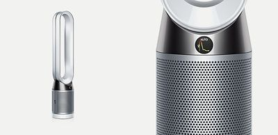

# ioBroker.dysonAirPurifier

## Адаптер ioBroker для очистителей воздуха и вентиляторов Dyson

Этот адаптер подключает ioBroker к различным очистителям воздуха Dyson. Значок вентилятора в логотипе создан [Freepik](https://www.flaticon.com/de/autoren/freepik) с сайта [www.flaticon.com](https://www.flaticon.com/de/) .

> Если вам понравился этот адаптер, пожалуйста, поддержите меня.  >

### поддерживаемые устройства

- Увлажнитель воздуха Dyson Pure Humidify+Cool (PH01, ProductType 358)
- Увлажнитель воздуха Dyson Pure Humidify+Cool (PH03, ProductType 358E)
- Увлажнитель воздуха Dyson Pure Humidify+Cool Formaldehyde (PH04, ProductType 358K)
- Фен Dyson Pure Cool Tower, модель 2018 года (TP04, ProductType 438)
- Dyson Pure Cool Tower Formaldehyde, модель 2018 года (TP07, ProductType 438E)
- Dyson Pure Cool Tower Formaldehyde, модель 2018 года (TP07, ProductType 438K)
- Dyson Pure Hot+Cool Link (HP02, ProductType 455)
- Dyson Pure Hot+Cool Link New (ProductType 455A)
- Настольный пылесос Dyson Pure Cool Link (DP01, ProductType 469)
- Dyson Pure Cool Link Tower (TP02, ProductType 475)
- Настольный пылесос Dyson Pure Cool Desk, модель 2018 года (DP04, ProductType 520)
- Фен Dyson Pure Hot+Cool, модель 2018 года (HP04, ProductType 527)
- Dyson Pure Hot+Cool (HP07, ProductType 527E)
- Dyson Pure Hot+Cool Formaldehyde (HP09, ProductType 527K)
- Очиститель воздуха Dyson Big+Quiet с защитой от формальдегида (BP03, тип продукта 664)

## Функции

Подключает ваши вентиляторы Dyson, тепловентиляторы, очистители воздуха и увлажнители воздуха к ioBroker.

- Считывает значения с устройств и датчиков.
- Позволяет управлять устройствами, изменяя некоторые параметры (питание от сети, вращение, обогрев, скорость вращения вентилятора и т. д.).
- Считывает список устройств с серверов Dyson.
- Обрабатывает _неограниченное_ количество вентиляторов (на самом деле, количество ограничено ресурсами вашего хоста ioBroker).

## Как это работает

При запуске облачное хранилище Dyson запрашивает информацию обо всех известных устройствах, привязанных к вашей учетной записи, и их паролях MQTT. Имея этот список, адаптер подключается ко всем устройствам локально и взаимодействует с ними.

- Подключение к облаку Dyson необходимо только для получения списка устройств, привязанных к вашей учетной записи, и их паролей MQTT.
- Поэтому новые устройства распознаются только при включении адаптера.
- Запрос к облачному сервису Dyson выполняется только один раз при запуске адаптера.
- Вентиляторы Dyson выступают в роли MQTT-сервера, а адаптер — в роли клиента.
- Вся связь между устройствами и адаптером осуществляется исключительно локально.
- Вся информация о соединении в адаптере удаляется и создается заново при перезагрузке.

## Установка

### Предварительные требования

- Для работы этого адаптера требуется Node.js версии 18.2 и выше.
- Требуется как минимум js-Controller 3.0.0.
- Требуется как минимум версия Admin 6.0.0.
- Для работы с этим адаптером вам потребуется учетная запись Dyson.
- Обязательно добавьте своего поклонника в свой аккаунт. Это можно сделать через приложение или онлайн.

### установка адаптера

#### Используя npm

Бегать`npm install iobroker.dysonairpurifier` Чтобы загрузить последнюю версию этого адаптера из репозитория npm, откройте соответствующую папку в вашей установке ioBroker.

#### Альтернативный вариант: использование URL-адреса GitHub.

Установите через административный интерфейс ioBroker, указав путь к последней стабильной версии на GitHub: <https://github.com/Grizzelbee/ioBroker.dysonairpurifier/tarball/master/>

Вы также можете установить более старые версии, используя эти методы (указав тег версии, например,`v0.6.0` вместо`master` (в URL-адресе), но обычно предпочтительнее использовать самый последний.

### Необходимы данные конфигурации.

- имя пользователя учетной записи Dyson
- Пароль для учетной записи Dyson (этот адаптер может обрабатывать пароли длиной до 32 символов)
- IP-адрес ваших вентиляторов/воздухоочистителей в вашей локальной сети (не во всех случаях).

Имя пользователя и пароль Dyson — это общие конфигурационные данные, которые необходимо ввести на странице конфигурации адаптера. В отличие от них, IP-адрес вводится в соответствующее поле.`Hostname` в дереве устройств на`devices` вкладка страницы.

#### Как настроить адаптер

> При первом обычном запуске этого адаптера выполняется запрос к API Dyson для получения информации обо всех ваших устройствах, и все поддерживаемые устройства будут созданы в дереве устройств — с основной информацией, предоставленной API, и дополнительным полем.`Hostaddress` .
>
> Поэтому запустите адаптер один раз, и ваши устройства Dyson будут созданы в дереве устройств с их основными настройками.
>
> Затем остановите адаптер и введите IP-адрес(а) в...`Hostaddress` Проверьте поле(я) в дереве устройств и перезапустите адаптер. После этого данные о ваших устройствах Dyson в дереве устройств должны отобразиться.

_Обратите внимание_ : из-за нестандартной реализации mDNS от Dyson вам потребуется указать локальный IP-адрес устройства _после первого запуска_ .

_Дополнительная заметка_ : Начиная с версии 0.7.1 адаптер пытается подключиться к устройству по его имени хоста (серийному номеру), если не указан адрес хоста/IP-адрес. Это будет работать при соблюдении двух условий:

1. В вашей локальной сети работает DNS-сервер. Либо в вашем маршрутизаторе (например, в маршрутизаторах FritzBox уже работает DNS-сервер), либо на выделенном устройстве.
2. Вы не изменили имя устройства по умолчанию.
3. Имя устройства корректно сопоставляется с его IP-адресом (в случае, если вы управляете DNS вручную).

### Двухфакторная аутентификация (начиная с версии V0.9.0)

После установки адаптера он должен запуститься автоматически — если этого не произойдет, пожалуйста, запустите его сначала. После обновления он также автоматически перезагрузится. В обоих случаях он останется в «желтом» состоянии и, вероятно, покажет некоторые ошибки в журнале — на данный момент это нормально.

- Откройте диалоговое окно настроек адаптера.
- Укажите хотя бы свой адрес электронной почты, пароль и код страны — остальное необязательно.
- Нажмите кнопку «Электронная почта с кодом двухфакторной аутентификации», чтобы начать процесс.
- В соответствующее поле вы автоматически получите "challengeId", электронное письмо и диалоговое окно с дальнейшими инструкциями.
- Введите 6-значный код из электронного письма в поле «одноразовый пароль Dyson».
- Нажмите кнопку «Завершить».
- После этого вы должны были получить от Dyson специальный купон (невидимый в целях безопасности).
- После завершения настройки нажмите «Сохранить и закрыть» — адаптер должен перезапуститься и загореться зеленым цветом.

Все значения будут сохранены и отображены далее.

> Обычно двухфакторная аутентификация не требуется по расписанию, но вы можете повторять её при необходимости.

#### Если при двухфакторной аутентификации вы сталкиваетесь с ошибкой 401, попробуйте следующее решение:

1. Выйдите из приложения Dyson на своем смартфоне.
2. Подождите несколько минут
3. Введите свои учетные данные для входа в адаптер (если это еще не сделано) и выполните процедуру двухфакторной аутентификации до конца.
4. Адаптер должен включиться и загореться зеленым.
5. Подождите немного (до часа, а может и больше, так как у Dyson есть блокировщик, который блокирует слишком много запросов за короткий промежуток времени).
6. Если вы хотите снова использовать приложение Dyson на своем смартфоне, войдите в систему заново.

## Управление вашим(и) устройством(ами)

В настоящее время этот адаптер способен управлять следующими состояниями ваших устройств:

- FanMode, режим работы устройства (ручной, автоматический, выключен)
- Скорость вращения вентилятора, Текущая скорость вращения вентилятора
- Ночной режим, состояние ночного режима
- Колебание, колебание вентилятора (вкл., выкл.).
- OscillationRight, OscillationAngle Upper Boundary
- OscillationLeft, OscillationAngle Lower Boundary
- OscillationAngle, OscillationAngle
- Непрерывный мониторинг, непрерывный мониторинг датчиков окружающей среды даже при выключенном устройстве.
- MainPower, основное питание вентилятора.
- Автоматический режим, вентилятор находится в автоматическом режиме.
- Направление потока — направление, в котором дует вентилятор. ВКЛ = спереди; ВЫКЛ = сзади (также известное как фокусировка струи).
- Jetfocus — направление потока воздуха от вентилятора. ВКЛ = спереди; ВЫКЛ = сзади (также известное как Jet focus).
- Режим обогрева, Режим обогрева \[ВКЛ/ВЫКЛ]
- HeatingTargetTemp, Целевая температура для отопления
- AirQualityTarget, Целевое качество воздуха для автоматического режима.
- Режим увлажнения, Вкл./Выкл.
- Режим автоматического увлажнения, Авто / Выкл.
- AutoHumidificationTarget, Auto HumidificationTarget
- Целевой уровень увлажнения, Целевой уровень увлажнения вручную
- TemperatureUnit — единица измерения для отображения значений температуры (на дисплее вентилятора).
- Жесткость воды: мягкая, средняя, жесткая.

Возможные значения для этих состояний, насколько известно, описаны ниже. Скорость вентилятора допускает значения только от 1 до 10 и режим «Авто». Если вы хотите установить скорость вентилятора на 0, вам нужно будет выключить основное питание. То же самое делает и приложение Dyson.

### Папка SystemStates (начиная с версии 2.4.0)

Устройства способны сообщать о сбоях. Эта функция добавлена в версии адаптера 2.4.0. На данный момент имеется лишь приблизительная информация о сбоях, и данные различаются от устройства к устройству. Если у вас есть более точная информация о сбое, пожалуйста, сообщите мне об этом, чтобы я мог улучшить адаптер. Все состояния сообщают о наличии или отсутствии сбоя.`True` означает неудачу,`false` означает «Отсутствие сбоя».

### Интервал опроса

- Начиная с версии 3.2.2, интервал опроса, равный 0, однозначно отключает опрос. Возможно, раньше это работало благодаря математическим расчетам, но точно сказать нельзя, и побочные эффекты неизвестны. Это полезно знать, потому что устройства обычно сами отправляют (по крайней мере, мои) свое состояние при его изменении. Использование этой настройки помогает уменьшить сетевой трафик, предотвращая ненужный опрос.

### Известные проблемы

- Автоматическое определение IP-адресов устройств отсутствует.
- По-прежнему много сообщений от неизвестных устройств (в основном, сообщения о сбоях и предупреждениях).
- Функция сброса фильтра не работает, поскольку правильное сообщение MQTT неизвестно.
- Иногда адаптер теряет MQTT-соединение с вентилятором и не может восстановить его.`This is usually no issue of the adapter itself, but an issue in your local network!`
  - В некоторых случаях достаточно отключить вентилятор от сети примерно на 10 секунд, чтобы перезагрузить его, а затем снова включить. Просто попробуйте!
  - В других случаях проблема заключалась в IP-адресе/DNS-сервере. Перезагрузка DHCP/DNS-сервера (маршрутизатора) решала проблему.

## Объяснение данных API Dyson (содержание полезной нагрузки сообщения)

Информация скопирована и дополнена из <https://github.com/shadowwa/Dyson-MQTT2RRD/blob/master/README.md>

### ТЕКУЩЕЕ СОСТОЯНИЕ

| имя                     | значение                                                          | возможные значения  | Единица |
| ----------------------- | ----------------------------------------------------------------- | ------------------- | ------- |
| модальная причина       | Текущий режим установлен с помощью RemoteControl, App, Scheduler. | КНР, ЛАПП, ЛШЧ, ПУИ |         |
| государственная причина |                                                                   | РЕЖИМ               |         |
| rssi                    | Уровень сигнала Wi-Fi                                             | -100 - 0            | дБм     |
| канал                   | Wi-Fi канал                                                       | 52                  |         |
| фкхп                    |                                                                   | 96704               |         |
| fghp                    |                                                                   | 70480               |         |

#### состояние продукта

\| имя | значение | возможные значения | Единица измерения | | ---- | ----------------------------------------------- | ----------------------------------------------------------------------------------------------------------------------------------------------------------------- | ----------------------------------- | --- | | ercd | Последний код ошибки | НЕТ или некоторые шестнадцатеричные значения | | | filf | Оставшийся срок службы фильтра | 0000 - 4300 | часов | | fmod | Режим | ВЕНТИЛЯТОР, АВТО, ВЫКЛ | | | fpwr | Основное питание | ВКЛ, ВЫКЛ | | | fnst | Состояние вентилятора | ВКЛ, ВЫКЛ, ВЕНТИЛЯТОР | | | fnsp | Скорость вентилятора | 0001 - 0010, АВТО | | | fdir | Направление вращения вентилятора, также известное как Jet Focus/ ВКЛ = Передний, ВЫКЛ = Задний | ВКЛ, ВЫКЛ | | | ffoc | JetFocus | ВКЛ, ВЫКЛ | | | nmod | Ночной режим | ВКЛ, ВЫКЛ | | | oson | Колебания | ВКЛ, ВЫКЛ | | | osal | Нижняя граница угла колебания | 0005 - 355 | ° (градусы) | | osau | Верхняя граница угла колебания | 0005 - 355 | ° (градусы) | | oscs | Активное колебание | ВКЛ, ВЫКЛ, ПРОСТОЙ | | | ancp | Угол колебания | CUST, 0180 | ° (градусы) | | qtar | Целевое качество воздуха | 0001=Хорошее, 0002=Нормальное, 0003=Плохое, 0004=Очень плохое | | | rhtm | Непрерывный мониторинг | ВКЛ, ВЫКЛ | | | auto | Автоматический режим | ВКЛ, ВЫКЛ | | | nmdv | Ночной режим Максимальная скорость вентилятора? | 0004 | | | cflr | Состояние угольного фильтра | 0000 - 0100 | Процент | | cflt | Угольный фильтр CARF, NONE | | | hflr | Статус HEPA-фильтра | 0000 - 0100 | Процент | | hflt | HEPA-фильтр | GHEP, GCOM | | | sltm | Таймер сна | ВКЛ, ВЫКЛ | | | | hmod | Режим обогрева \[ВКЛ/ВЫКЛ] | ОБОГРЕВ | | | hmax | Целевая температура для обогрева | 0 .. 5000 | K | | hume | Режим увлажнения | ВКЛ, ВЫКЛ, | | | haut | Автоматический режим увлажнения | HUMIDIFY\_AUTO\_MODE\_ON, HUMIDIFY\_AUTO\_MODE\_OFF | | | humt | Целевое увлажнение | HUMIDIFICATION\_MODE\_OFF, HUMIDIFICATION\_MODE\_THIRTY, HUMIDIFICATION\_MODE\_FORTY, HUMIDIFICATION\_MODE\_FIFTY, HUMIDIFICATION\_MODE\_SIXTY, HUMIDIFICATION\_MODE\_SEVENTY | | | cdrr | CleanDurationRemaining | integer | minutes | | rect | AutoHumidificationTarget | integer | % | | cltr | TimeRemainingToNextClean | integer | hours | | wath | WaterHardness | SOFT="2025", MEDIUM="1350", HARD="0675" | | | wacd | WarningCode | NONE... | | | rstf | reset filter lifecycle | 'RSTF', 'STET', RESET\_FILTER\_LIFE\_IGNORE, RESET\_FILTER\_LIFE\_ACTION | | | corf | Temperature format | ВКЛ=Цельсий, ВЫКЛ=Фаренгейт | | | clcr | Цикл глубокой очистки | CLNO=неактивен, CLAC=Глубокая очистка в процессе, CLCM=Завершено | | | hsta | Состояние нагрева | АКТИВНЫЙ/ПРОСТОЙ | | | msta | Состояние увлажнения | Активный/Простой ВЫКЛ, HUMD | | | psta | \[HP0x] Неизвестно | INIT, CLNG, INV, ВЫКЛ | | | bril | неизвестно | 0002 | УРОВЕНЬ\_НИЗКИЙ, УРОВЕНЬ\_СРЕДНИЙ, УРОВЕНЬ\_ВЫСОКИЙ | | fqhp | неизвестно | | | | tilt | \[HP0x] Неизвестно | string | | | dial | \[DP0x] Неизвестно | | |

| Коды ошибок | Значение                                                                                                                     |
| ----------- | ---------------------------------------------------------------------------------------------------------------------------- |
| НИКТО       | Активных ошибок нет.                                                                                                         |
| 57C2        | неизвестный                                                                                                                  |
| 11E1        | Функция осцилляции отключена. Пожалуйста, нажмите кнопку «Осцилляция» на пульте дистанционного управления, чтобы продолжить. |

#### планировщик

| имя  | значение      | возможные значения | Единица |
| ---- | ------------- | ------------------ | ------- |
| dstv | летнее время  | 0001...            |         |
| срск | ?             | 7c68...            |         |
| цид  | часовой пояс? | 0001...            |         |

### ДАННЫЕ ДАТЧИКА ТОКА ОКРУЖАЮЩЕЙ СРЕДЫ

#### данные

| имя   | значение                        | возможные значения | Единица  |
| ----- | ------------------------------- | ------------------ | -------- |
| хакт  | Влажность (%)                   | 0000 - 0100        | Процент  |
| пакт  | Пыль                            | 0000 - 0009        |          |
| sltm  | Таймер сна                      | ВЫКЛ.... 9999      | Протокол |
| такт  | Температура в Кельвинах         | 0000 - 5000        | К        |
| вакт  | летучих органических соединений | 0001 - 0009        |          |
| хчо   | Формальдегид (не использовался) |                    |          |
| ххр   | Формальдегид                    |                    |          |
| pm25  | PM2.5 (не используется)         | 0018               |          |
| pm10  | PM10 (не используется)          | 0011               |          |
| va10  | летучих органических соединений | 0004               |          |
| ноксл | NO2                             | 0000 - 0014        |          |
| p25r  | PM2.5 — твердые частицы         | 0019               | мкг/м³   |
| p10r  | PM10 — твердые частицы          | 0018               | мкг/м³   |

### Данные об окружающей среде и использовании

Избыточные значения?

#### данные

\| имя | значение | возможные значения | Единица измерения | | ----------- | ------------------------------------------------------------------------ | ------------------------------------------- | ----------- | --- | | pal0 - pal9 | количество секунд, проведенных в этом уровне пыли с начала часа | 00:00 - 36:00 | | | palm | похоже, медианное значение palX | | | | vol0 - vol9 | количество секунд, проведенных в этом уровне летучих органических соединений с начала часа | 00:00 - 36:00 | | | volm | похоже, медианное значение volX | | | | aql0 - aql9 | количество секунд, проведенных в этом уровне качества воздуха | max (pal, vol)) с начала часа | 00:00 - 36:00 | | | aqlm | похоже, медианное значение aqlX | | | | fafs | кажется, это количество секунд, проведенных в определенное время | 0000 - 3600 | | | faos | кажется, это количество секунд, проведенных в определенное время | 0000 - 3600 | | | fofs | кажется, это количество секунд, проведенных в определенное время | 0000 - 3600 | | | fons | кажется, это количество секунд, проведенных в определенное время | 0000 - 3600 | | | humm | влажность? (%) | 0000 - 0100 | | | tmpm | температура в кельвинах? | 0000 - 5000 | |

### sentry.io

Этот адаптер использует sentry.io для сбора информации о сбоях и автоматического сообщения о них автору. Для этого используется плагин [ioBroker.sentry](https://github.com/ioBroker/plugin-sentry) . Подробную информацию о том, что делает плагин, какая информация собирается и как отключить его, если вы не хотите предоставлять автору информацию о сбоях, вы можете найти на [домашней странице плагина](https://github.com/ioBroker/plugin-sentry) .

## Юридические уведомления

Dyson, Pure Cool, Pure Hot & Cool и другие являются товарными знаками или зарегистрированными товарными знаками компании [Dyson Ltd.](https://www.dyson.com) Все остальные товарные знаки являются собственностью их соответствующих владельцев.

## Changelog
### **WORK IN PROGRESS**
- (grizzelbee) Upd: Dependencies got updated
- (grizzelbee) Fix: [#338](https://github.com/Grizzelbee/ioBroker.dysonairpurifier/issues/338) Fixed Admin dependency
- (grizzelbee) Fix: [#341](https://github.com/Grizzelbee/ioBroker.dysonairpurifier/issues/341) Fixed linting
- fixes #342 Updated minimum required NodeJs Version to 20

### 3.2.7 (2025-02-13)
- (grizzelbee) Upd: Dependencies got updated
- (grizzelbee) Upd: Moved to eslint 9 and fixed new lint issues

### 3.2.6 (2024-11-13)
- (grizzelbee) Upd: Dependencies got updated
- (grizzelbee) Fix: Fixed issues mentioned by adapter checker regarding responsive design

### 3.2.5 (2024-10-08) 
- (grizzelbee) Upd: Dependencies got updated
- (grizzelbee) Fix: Fixed GUI issues
- (grizzelbee) Fix: Added missing files to files-section in package.json

### 3.2.4 (2024-10-01)
- (grizzelbee) Upd: Dependencies got updated
- (grizzelbee) Fix: Removed plugin-sentry
- (grizzelbee) Fix: [#318](https://github.com/Grizzelbee/ioBroker.dysonairpurifier/issues/318) Added tests for node 22
- (grizzelbee) Upd: [#315](https://github.com/Grizzelbee/ioBroker.dysonairpurifier/issues/315) Fixed some issues mentioned by adapter-checker

### 3.2.3 (2024-06-21) (Marching on)
- (grizzelbee) Fix: Added missing clearInterval in onUnload

### 3.2.2 (2024-06-18) (Marching on)
- (grizzelbee) Upd: Dependencies got updated
- (grizzelbee) Upd: [#286](https://github.com/Grizzelbee/ioBroker.dysonairpurifier/issues/286) Fixed polling which got broken in v3.1.10
- (grizzelbee) Upd: Poll intervall of 0 disables polling

### 3.2.1 (2024-06-04) (Marching on)
- (grizzelbee) Upd: Dependencies got updated
- (grizzelbee) Upd: [#286](https://github.com/Grizzelbee/ioBroker.dysonairpurifier/issues/286) Fixed polling which got broken in v3.1.10

### 3.2.0 (2024-05-28) (Marching on)

- (grizzelbee) Chg: Lamps (Product type 552a) won't generate a warning on startup any longer but show an info that they are not supported by this adapter.
- (grizzelbee) Chg: Vacuum cleaner robots (Product types 276 and 277) won't generate a warning on startup any longer but show an info that they are not supported by this adapter.
- (grizzelbee) New: [#289](https://github.com/Grizzelbee/ioBroker.dysonairpurifier/issues/289) Added Support for Dyson Purifier Big+Quiet Formaldehyde (BP03, Produce type 664) 
- (grizzelbee) Fix: [#287](https://github.com/Grizzelbee/ioBroker.dysonairpurifier/issues/287) Added Switzerland again to config 
- (grizzelbee) Upd: Dependencies got updated
- (grizzelbee) Chg: removed obsolete index_m.html
- (grizzelbee) Fix: Fixed broken NO2Index
- (grizzelbee) Fix: Fixed broken fan speeds 0-10
- (grizzelbee) Fix: Fixed polling of sensor data
- (grizzelbee) Fix: setting fan speed = Auto works

### 3.1.10 (2024-05-14) (Marching on)

- (grizzelbee) Fix: [#281](https://github.com/Grizzelbee/ioBroker.dysonairpurifier/issues/281) Removed duplicate Sleeptimer field from config
- (grizzelbee) New: Enabled editing of field Sleeptimer 
- (grizzelbee) Fix: [#283](https://github.com/Grizzelbee/ioBroker.dysonairpurifier/issues/283) Late config of fields
- (grizzelbee) Fix: Mapping text values in fields Sleeptimer & fanspeed to numerical values

### 3.1.9 (2024-05-13) (Marching on)

- (arcticon)   Fix: [#278](https://github.com/Grizzelbee/ioBroker.dysonairpurifier/issues/278) Changeable fields are working again.

### 3.1.8 (2024-05-10) (Marching on)

- (arcticon)   Upd: Dependencies got updated
- (grizzelbee) Chg: code refactoring  
- (arcticon)   Chg: code refactoring  
- (arcticon)   Chg: [#273](https://github.com/Grizzelbee/ioBroker.dysonairpurifier/issues/273) Performance improvements
- (arcticon)   Chg: [#274](https://github.com/Grizzelbee/ioBroker.dysonairpurifier/issues/274) Update of outdated certificate

### 3.1.7 (2024-04-24) (Marching on)

- (grizzelbee) Upd: dependencies got updated
- (grizzelbee) Fix: [#266](https://github.com/Grizzelbee/ioBroker.dysonairpurifier/issues/266) HeatingMode switch is now working correctly

### 3.1.6 (2024-04-24) (Marching on)

- (grizzelbee) Upd: dependencies got updated
- (grizzelbee) Fix: [#266](https://github.com/Grizzelbee/ioBroker.dysonairpurifier/issues/266) HeatingMode switch is now working correctly

### 3.1.5 (2024-04-16) (Marching on)

- (grizzelbee) Fix: Requesting at least admin v6.13.16 as dependency

### 3.1.4 (2024-03-22) (Marching on)

- (grizzelbee) Fix: Lamps (Product type 552) won't generate a warning on startup anymore but show an info that they are not supported by this adapter.

### 3.1.3 (2024-02-28) (Marching on)

- (grizzelbee) Fix: 2FA Process is working again - truely

### 3.1.2 (2024-02-26) (Marching on)

- (grizzelbee) Upd: dependencies got updated
- (grizzelbee) Fix: 2FA Process is working again
- (grizzelbee) New: At least Node.js V18.2.0 is required

### 3.1.1 (2024-02-01) (Marching on)

- (grizzelbee) Upd: dependencies got updated
- (grizzelbee) Fix: [#244](https://github.com/Grizzelbee/ioBroker.dysonairpurifier/issues/244) Fixed PM2.5, PM10, VOC Values to be compliant to the dyson App
- (grizzelbee) Fix: [#113](https://github.com/Grizzelbee/ioBroker.dysonairpurifier/issues/113) Fixed NO2 Values to be compliant to the dyson App
- (grizzelbee) Fix: [#244](https://github.com/Grizzelbee/ioBroker.dysonairpurifier/issues/244) Fixed PM2.5, PM10, VOC Indexes
- (grizzelbee) New: Changed admin user interface to jsonConfig
- (grizzelbee) Upd: Code cleanup

### 3.0.0 (2024-01-11) (Marching on)

- (grizzelbee) Upd: dependencies got updated
- (grizzelbee) Upd: updated year of copyright in license
- (grizzelbee) New: [#244](https://github.com/Grizzelbee/ioBroker.dysonairpurifier/issues/244) Added HCHO-Index
- (grizzelbee) Chg: BREAKING CHANGES:
  - Replaced values in field pm25 with values from pm25r and calculating them accordingly to the dyson App
  - Replaced values in field pm10 with values from pm10r and calculating them accordingly to the dyson App
  - [#244](https://github.com/Grizzelbee/ioBroker.dysonairpurifier/issues/244) Replaced values in field hcho with values from hchr and calculating them accordingly to the dyson App
  - Fields pm25r and pm10r are now deprecated and will be removed

### 2.5.9 (2023-08-21) (Halo of the dark)

- (grizzelbee) Fix: Updated year in license- and readme file to make adapter checker happy

### 2.5.8 (2023-08-09) (Halo of the dark)

- (grizzelbee) Fix: Fixed calculation of hmax temperatures for heater models.

### 2.5.7 (2022-12-06) (Halo of the dark)

- (grizzelbee) New: Added support for Dyson Pure Humidify+Cool Formaldehyde (PH04, ProductType 358K)
- (grizzelbee) Upd: Upgraded axios to 1.2.1

### 2.5.6 (2022-11-28) (Halo of the dark)

- (grizzelbee) Fix: [#213](https://github.com/Grizzelbee/ioBroker.dysonairpurifier/issues/213) Fixed warning due to wrong data type on field FILTER_REPLACEMENT

### 2.5.4 (2022-11-27) (Halo of the dark)

- (grizzelbee) Upd: [#207](https://github.com/Grizzelbee/ioBroker.dysonairpurifier/issues/207) Downgraded axios to 0.27.2 due to an error in version 1.x returning data as binary instead of string.

### 2.5.3 (2022-11-26) (Halo of the dark)

- (grizzelbee) Upd: Dependencies got updated
- (grizzelbee) Chg: [#207](https://github.com/Grizzelbee/ioBroker.dysonairpurifier/issues/207) better and easier detection of supported devices

### 2.5.2 (2022-11-17) (Halo of the dark)

- (grizzelbee) Upd: Dependencies got updated
- (grizzelbee) Chg: Moved log message "requesting new state of device" from info to debug
- (grizzelbee) New: Added Dyson Pure Hot+Cool Formaldehyde (Type 527K) to device list.
- (grizzelbee) New: Added Dyson Pure Cool Tower Formaldehyde (Type 438K) to device list.

### 2.5.1 (2022-03-23) (Halo of the dark)

- (grizzelbee) Fix: Improved layout of config page and added tooltips to the checkboxes

### 2.5.0 (2022-03-22) (Halo of the dark)

- (grizzelbee) New: [#185](https://github.com/Grizzelbee/ioBroker.dysonairpurifier/issues/185) Added config option to disable logging of reconnect events

### 2.4.1 (2022-03-20) (Echo from the past)

- (grizzelbee) New: Changed SystemState from text to boolean data points

### 2.4.0 (2022-03-17) (Echo from the past)

- (grizzelbee) New: Added warning code to device tree
- (grizzelbee) New: Added Device-faults as SystemState to device tree
- (grizzelbee) New: Added donate button to readme and config page
- (grizzelbee) Upd: Switched "Sending data to device" message from loglevel info to debug
- (grizzelbee) Upd: reduced amount of debug messages
- (grizzelbee) Upd: Updated dependencies

### 2.3.2 (2022-03-04) (Fairytale of doom)

- (grizzelbee) Fix: Fixed: Sentry-Error: [DYSONAIRPURIFIER-D](https://sentry.io/organizations/grizzelbee/issues/3021418514)
- (grizzelbee) Upd: Updated dependencies

### 2.3.1 (2022-01-14) (Fairytale of doom)

- (grizzelbee) Upd: Updated dependencies
- (grizzelbee) Upd: Updated documentation

### 2.3.0 (2021-12-02) (Fairytale of doom)

- (grizzelbee) New: Added some GUI elements for air quality in folder icons
- (grizzelbee) New: Added support for HEPA PTFE filters
- (grizzelbee) New: Added support for Combined PTFE filters
- (grizzelbee) Chg: Fanspeed is now a number (not string anymore) to work properly with IoT-Adapter. Please delete this data point and let get recreated.

### 2.2.0 (2021-11-07) (Welcome to my wasteland)

- (grizzelbee) New: [#154](https://github.com/Grizzelbee/ioBroker.dysonairpurifier/issues/154) Added support for dyson Humidify+Cool PH03/358E.

### 2.1.4 (2021-10-20) (Running to the edge)

- (grizzelbee) New: [#152](https://github.com/Grizzelbee/ioBroker.dysonairpurifier/issues/152) Added token-indicator to config page in admin to show whether a token has already been received and saved or not.

### 2.1.3 (2021-10-17) (Running to the edge)

- (grizzelbee) Fix: [#148](https://github.com/Grizzelbee/ioBroker.dysonairpurifier/issues/148) Hostaddress is used properly when given.
- (grizzelbee) Fix: [#149](https://github.com/Grizzelbee/ioBroker.dysonairpurifier/issues/149) OscillationAngle "Breeze" is working now
- (grizzelbee) Fix: [#150](https://github.com/Grizzelbee/ioBroker.dysonairpurifier/issues/150) Strange delay and jumping of boolean switches is fixed

### 2.1.2 (2021-10-07) (Running to the edge)

- (grizzelbee) New: Removed NO2 from general AirQuality to be more compliant to dyson-app
- (grizzelbee) Upd: Code cleanup
- (grizzelbee) Upd: Removed delay between sending a command and new values getting displayed (max 30 Secs)

### 2.1.1 (2021-10-05) (Running to the edge)

- (grizzelbee) New: Added some more data points
- (grizzelbee) New: Added switch for temperature unit of the fan display
- (grizzelbee) New: Improved logging of unknown data points
- (germanBluefox) Fix: Fixed icon links
- (grizzelbee) Fix: fixed dependencies badge
- (grizzelbee) Fix: added missing dependency plugin-sentry
- (grizzelbee) Fix: Setting HumidificationTarget now works

### 2.0.1 (2021-10-04) (Lost in forever)

- (grizzelbee) Fix: Turning on HeatingMode should work now
- (grizzelbee) Fix: Sentry-error [DYSONAIRPURIFIER-7](https://sentry.io/organizations/nocompany-6j/issues/2690134161/?project=5735771) -> Cannot read property '3' of undefined
- (grizzelbee) Upd: Updated dependencies

### 2.0.0 (2021-09-26) (Lost in forever)

- (grizzelbee) New: Added DeepCleanCycle to known data points
- (grizzelbee) Fix: Switching water hardness now really works
- (grizzelbee) BREAKING CHANGES: Please recreate your object tree and test your scripts!
- (grizzelbee) Chg: All ON/OFF switches are now boolean types to be more compliant to ioBroker standards for VIS and other adapters. Please delete those data points and let them being recreated if necessary.
- (grizzelbee) Chg: All angles are numbers now
- (grizzelbee) Chg: All 2-way switches are boolean now
-

### V1.1.0 (2021-09-15) (Coming home)

- (grizzelbee) New: Added correct tier-level to io-package
- (grizzelbee) New: improved logging of unknown data points
- (grizzelbee) New: Added support for dyson Pure Hot+Cool Link (ProductType 455A)
- (grizzelbee) New: Added support for formaldehyde sensor
- (grizzelbee) New: oscillation angles can be set
- (grizzelbee) Upd: Improved OscillationAngle data point to display only the values supported by the current model
- (grizzelbee) Fix: removed info: undefined is not a valid state value for id "Hostaddress"

### V1.0.0 (2021-08-26) (Dim the spotlight)

- (grizzelbee) Fix: [#130](https://github.com/Grizzelbee/ioBroker.dysonairpurifier/issues/130) Fixed the newly introduced bug showing wrong values for temperatures
- (grizzelbee) Upd: Pushed to version 1.0.0
- (grizzelbee) Upd: Updated dependencies

### V0.9.5 (2021-08-23) (Marching on)

- (grizzelbee) Doc: [#124](https://github.com/Grizzelbee/ioBroker.dysonairpurifier/issues/124) Documented workaround for 2FA 401 Issue in ReadMe
- (grizzelbee) Fix: [#128](https://github.com/Grizzelbee/ioBroker.dysonairpurifier/issues/128) Fixed saving of config data
- (grizzelbee) Fix: [#107](https://github.com/Grizzelbee/ioBroker.dysonairpurifier/issues/107) Fixed type error on temperatures
- (grizzelbee) Fix: fixed warnings on startup

### V0.9.4 (2021-08-20) ()

- (grizzelbee) New: [#124](https://github.com/Grizzelbee/ioBroker.dysonairpurifier/issues/124) Credentials won't get logged but shown in a popup in admin when failing 2FA process.
- (grizzelbee) New: Added adminUI tag to io-package
- (grizzelbee) New: Cleanup of io-package

### V0.9.3 (2021-08-19) (Paralyzed)

- (grizzelbee) New: [#124](https://github.com/Grizzelbee/ioBroker.dysonairpurifier/issues/124) Leading and trailing whitespaces will be removed from all config values when saving
- (grizzelbee) New: [#124](https://github.com/Grizzelbee/ioBroker.dysonairpurifier/issues/124) Password will be logged in clear text in case of a http 401 (unauthorized) error during 2FA
- (grizzelbee) Chg: [#124](https://github.com/Grizzelbee/ioBroker.dysonairpurifier/issues/124) Removed general debug logging of 2FA login data

### V0.9.2 (2021-08-15) (Pearl in a world of dirt)

- (bvol) New: [#114](https://github.com/Grizzelbee/ioBroker.dysonairpurifier/issues/114) Added Switzerland to country selection in config , Thanks, @BVol, for his code!
- (grizzelbee) Fix: [#119](https://github.com/Grizzelbee/ioBroker.dysonairpurifier/issues/119) Updated dyson certificate to enable connection again. Thanks, @Krobipd, for helping with the link
- (grizzelbee) Upd: Updated dependencies

### V0.9.1 (2021-05-17) (Still breathing)

- (grizzelbee) New: [#105](https://github.com/Grizzelbee/ioBroker.dysonairpurifier/issues/105) TP02, HP02 and others supporting the fmod token are now able to switch from Off to Auto- and manual-mode

### V0.9.0 (2021-05-15) (Still breathing)

- (grizzelbee) New: Added ioBroker sentry plugin to report errors automatically
- (grizzelbee) New: Added support for Dyson Pure Cool TP07 (438E)
- (grizzelbee) New: Added support for Dyson 2-factor login method
- (grizzelbee) New: Added "keep Sensorvalues" to config to prevent destroying old values when continuous monitoring is off and fan is switched off (TP02)
- (grizzelbee) Fix: FilterLife should now be correctly in hours and percent in two separate data fields for fans supporting this (e.g. TP02)

### V0.8.2 (2021-04-09) (Still breathing)

- (grizzelbee) Fix: [#80](https://github.com/Grizzelbee/ioBroker.dysonairpurifier/issues/80) fixed npm install hint in documentation
- (grizzelbee) Fix: [#82](https://github.com/Grizzelbee/ioBroker.dysonairpurifier/issues/82) fixed common.dataSource type with type >poll<
- (grizzelbee) Fix: [#95](https://github.com/Grizzelbee/ioBroker.dysonairpurifier/issues/95) Added support for dyson Hot+Cool Formaldehyde (527E)
- (grizzelbee) Fix: [#94](https://github.com/Grizzelbee/ioBroker.dysonairpurifier/issues/94) Fixed dustIndex

### V0.8.1 (2021-02-19) (Fall into the flames)

- (grizzelbee) New: added icons to each fan type in device tree
- (grizzelbee) New: Showing Filter type correctly - not as code anymore
- (grizzelbee) Upd: updated dependencies

### V0.8.0 (2021-02-18) (Beyond the mirror)

- (grizzelbee) New: Log as info if account is active on login; else log as warning.
- (grizzelbee) New: [#21](https://github.com/Grizzelbee/ioBroker.dysonairpurifier/issues/21) Improvement for humidifier support
- (grizzelbee) Fix: [#67](https://github.com/Grizzelbee/ioBroker.dysonairpurifier/issues/67) Adapter sometimes wrote objects instead of values.

### V0.7.5 (2021-02-12) (I won't surrender)

- (grizzelbee) Fix: [#65](https://github.com/Grizzelbee/ioBroker.dysonairpurifier/issues/65) Adapter get online again after changes to dyson cloud API login procedure.
- (grizzelbee) New: Adapter reconnects with new host address when it gets changed manually

### V0.7.4 (2021-02-10) (Human)

- (grizzelbee) Fix: fixed adapter traffic light for info.connection
- (grizzelbee) Fix: Minor fixes

### V0.7.3 (2021-02-10) (When angels fall)

- (theimo1221) Fix: [#59](https://github.com/Grizzelbee/ioBroker.dysonairpurifier/issues/59) added default country
- (theimo1221) New: added function to mask password to dyson-utils.js
- (grizzelbee) New: extended config test and error logging
- (grizzelbee) New: added password to protectedNative in io-package.json
- (grizzelbee) Fix: fixed showing password in config (leftover from testing/fixing)
- (grizzelbee) Fix: fixed detection of needed js-controller features
- (grizzelbee) Fix: fixed detection if IP is given or not
- (grizzelbee) Upd: creating all data points with await

### V0.7.2 (2021-02-10) (Songs of love and death)

- (grizzelbee) Fix: [#59](https://github.com/Grizzelbee/ioBroker.dysonairpurifier/issues/59) Fixed bug while loading/saving config which led to wrong values displayed for country and temperature unit
- (grizzelbee) Upd: switched "Skipping unknown ..." message from info to debug

### V0.7.1 (2021-02-06) (Horizons)

- (grizzelbee) New: When no host address is given - adapter tries to connect via default hostname of the device
- (grizzelbee) Fix: [#13](https://github.com/Grizzelbee/ioBroker.dysonairpurifier/issues/13) Filterlifetime is now correctly displayed in hours and percent for devices supporting this
- (grizzelbee) Fix: [#48](https://github.com/Grizzelbee/ioBroker.dysonairpurifier/issues/48) Fixed countrycodes for UK and USA
- (grizzelbee) Fix: [#52](https://github.com/Grizzelbee/ioBroker.dysonairpurifier/issues/52) Fixed VOCIndex
- (grizzelbee) Fix: Removed option to control Fan state since it corresponds to the state of the fan in auto-mode. Controlling it is senseless.
- (grizzelbee) Fix: Fixed await...then antipattern.
- (grizzelbee) Fix: Fixed undefined roles
- (grizzelbee) Fix: Fixed some bad promises and moved code to dysonUtils
- (grizzelbee) Fix: Fixed encrypting password using js-controller 3.0 build-in routine
- (grizzelbee) Upd: Added topic "Controlling your device(s)" to readme
- (grizzelbee) Upd: Removed unnecessary saving of MQTT password
- (grizzelbee) Upd: [#9](https://github.com/Grizzelbee/ioBroker.dysonairpurifier/issues/9) Added some more dyson codes for heaters and humidifiers

### V0.7.0 (2021-01-08) (Afraid of the dark)

- (jpwenzel) New: Removing crypto from package dependency list (using Node.js provided version)
- (jpwenzel) New: Introducing unit tests
- (jpwenzel) New: At least Node.js 10.0.0 is required
- (grizzelbee) New: [#23](https://github.com/Grizzelbee/ioBroker.dysonairpurifier/issues/23) - Introduced new data field AirQuality which represents the worst value of all present indexes.
- (grizzelbee) New: BREAKING CHANGE! - switched over to the adapter-prototype build-in password encryption. Therefore, you'll need to enter your password again in config.
- (grizzelbee) New: At least js-controller 3.0.0 is required
- (grizzelbee) New: At least admin 4.0.9 is required
- (jpwenzel) Fix: General overhaul of readme
- (jpwenzel) Fix: Code refactoring
- (grizzelbee) Fix: fixed some datafield names - please delete the whole device folder and get them newly created.
- (grizzelbee) Fix: [#18](https://github.com/Grizzelbee/ioBroker.dysonairpurifier/issues/18) - Fixed creating the indexes when there is no according sensor
- (grizzelbee) Fix: [#13](https://github.com/Grizzelbee/ioBroker.dysonairpurifier/issues/13) - Displaying Filter life value in hours again
- (grizzelbee) Fix: [#13](https://github.com/Grizzelbee/ioBroker.dysonairpurifier/issues/13) - Creating additional Filter life value in percent
- (grizzelbee) Fix: removed materializeTab from ioPackage
- (grizzelbee) Fix: calling setState now as callback in createOrExtendObject
- (grizzelbee) Fix: Removed non-compliant values for ROLE
- (grizzelbee) Fix: calling setState in callback of set/createObject now
- (grizzelbee) Fix: ensuring to clear all timeouts in onUnload-function

### V0.6.0 (2020-10-29) (Rage before the storm)

- (grizzelbee) New: [#17](https://github.com/Grizzelbee/ioBroker.dysonairpurifier/issues/17) - Added online-indicator for each device
- (grizzelbee) New: [#19](https://github.com/Grizzelbee/ioBroker.dysonairpurifier/issues/19) - Extended Password length from 15 characters to 32
- (grizzelbee) New: [#20](https://github.com/Grizzelbee/ioBroker.dysonairpurifier/issues/20) - Improved error handling on http communication with Dyson API
- (grizzelbee) Fix: Fixed typo within data field anchorpoint - please delete the old ancorpoint manually.
- (grizzelbee) Fix: [#13](https://github.com/Grizzelbee/ioBroker.dysonairpurifier/issues/13) - Filter life value is now displayed in percent not in hours

### V0.5.1 (2020-10-27) (Heart of the hurricane)

- (grizzelbee) Fix: Added missing clearTimeout

### V0.5.0 (2020-10-27) (Heart of the hurricane)

- (grizzelbee) New: Editable data fields have now appropriate value lists
- (grizzelbee) New: Added more country codes
- (grizzelbee) New: Target temperature of heater can now be set - **in the configured unit!**
- (grizzelbee) Fix: [#13](https://github.com/Grizzelbee/ioBroker.dysonairpurifier/issues/13) - Filter life value is now displayed in percent not in hours
- (grizzelbee) Fix: [#6](https://github.com/Grizzelbee/ioBroker.dysonairpurifier/issues/6) - Changing the fanspeed does now fully work.

### V0.4.1 (2020-10-16) (unbroken)

- (grizzelbee) New: [#8](https://github.com/Grizzelbee/ioBroker.dysonairpurifier/issues/8) - Documented ProductTypes for better overview and user experience in ReadMe
- (grizzelbee) New: [#9](https://github.com/Grizzelbee/ioBroker.dysonairpurifier/issues/9) - Added some Hot&Cool specific datafields
- (grizzelbee) New: Logging of from devices, when shutting down the adapter
- (grizzelbee) New: [#10](https://github.com/Grizzelbee/ioBroker.dysonairpurifier/issues/10) - Polling device data every X (configurable) seconds for new data, hence sensors don't send updates on changing values
- (grizzelbee) New: [#11](https://github.com/Grizzelbee/ioBroker.dysonairpurifier/issues/11) - Added Austria and France to Country-List
- (grizzelbee) Fix: Fixed bug in error handling when login to Dyson API fails
- (grizzelbee) Fix: [#12](https://github.com/Grizzelbee/ioBroker.dysonairpurifier/issues/12) - Fixed Dyson API login by completely securing via HTTPS.
- (grizzelbee) Fix: Updated some descriptions in config

### V0.4.0 (2020-09-29)

- (grizzelbee) New: devices are now **controllable**
- (grizzelbee) New: state-change-messages are processed correctly now
- (grizzelbee) Fix: Added missing °-Sign to temperature unit
- (grizzelbee) Fix: Terminating adapter when starting with missing Dyson credentials
- (grizzelbee) Fix: NO2 and VOC Indices should work now
- (grizzelbee) Fix: Fixed build errors

### V0.3.0 (2020-09-27) - first version worth giving it a try

- (grizzelbee) New: Messages received via Web-API and MQTT getting processed
- (grizzelbee) New: datapoints getting created and populated
- (grizzelbee) New: Added config item for desired temperature unit (Kelvin, Fahrenheit, Celsius)
- (grizzelbee) New: Added missing product names to product numbers
- (grizzelbee) New: Hostaddress/IP is editable / configurable
- (grizzelbee) New: calculate quality indexes for PM2.5, PM10, VOC and NO2 according to Dyson App

### V0.2.0 (2020-09-22) - not working! Do not install/use

- (grizzelbee) New: Login to Dyson API works
- (grizzelbee) New: Login to Dyson AirPurifier (2018 Dyson Pure Cool Tower [TP04]) works
- (grizzelbee) New: mqtt-Login to [TP04] works
- (grizzelbee) New: mqtt-request from [TP04] works
- (grizzelbee) New: mqtt-request to [TP04] is responding

### V0.1.0 (2020-09-04) - not working! Do not install/use

- (grizzelbee) first development body (non-functional)

## License

MIT License

Permission is hereby granted, free of charge, to any person obtaining a copy
of this software and associated documentation files (the "Software"), to deal
in the Software without restriction, including without limitation the rights
to use, copy, modify, merge, publish, distribute, sublicense, and/or sell
copies of the Software, and to permit persons to whom the Software is
furnished to do so, subject to the following conditions:

The above copyright notice and this permission notice shall be included in all
copies or substantial portions of the Software.

THE SOFTWARE IS PROVIDED "AS IS", WITHOUT WARRANTY OF ANY KIND, EXPRESS OR
IMPLIED, INCLUDING BUT NOT LIMITED TO THE WARRANTIES OF MERCHANTABILITY,
FITNESS FOR A PARTICULAR PURPOSE AND NONINFRINGEMENT. IN NO EVENT SHALL THE
AUTHORS OR COPYRIGHT HOLDERS BE LIABLE FOR ANY CLAIM, DAMAGES OR OTHER
LIABILITY, WHETHER IN AN ACTION OF CONTRACT, TORT OR OTHERWISE, ARISING FROM,
OUT OF OR IN CONNECTION WITH THE SOFTWARE OR THE USE OR OTHER DEALINGS IN THE
SOFTWARE.

Copyright (c) 2025 Hanjo Hingsen <open-source@hingsen.de>