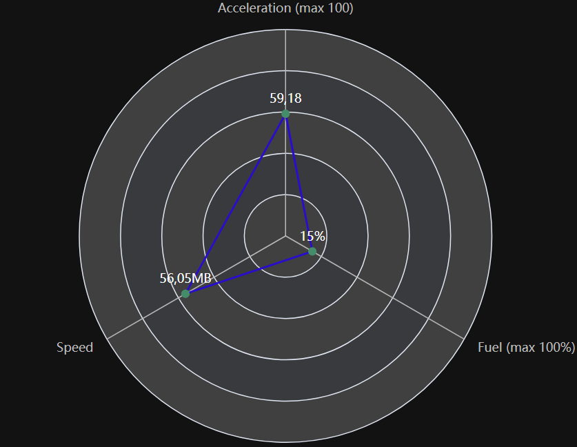

# ioBroker.echarts

**Этот адаптер использует библиотеки Sentry для автоматического сообщения разработчикам об исключениях и ошибках в коде.** Более подробную информацию, а также инструкции по отключению отправки сообщений об ошибках см. [в документации Sentry-Plugin](https://github.com/ioBroker/plugin-sentry#plugin-sentry) !

## адаптер echarts для ioBroker

Создавайте полезные графики в ioBroker:


 Для получения прогнозируемого результата используйте агрегацию "Фактическое значение".

### Один столбик на каждую точку данных

Обычно ось X столбчатой диаграммы — это время, и каждый столбец соответствует одному интервалу. В **настройках столбчатой диаграммы → Один столбец на линию** ось X становится списком линий: каждая линия получает ровно один столбец, который показывает последнее значение этой линии. Вместе с агрегацией «Фактическое значение», которая представляет собой текущее значение каждого состояния, например, потребления каждого устройства.

**Горизонтальные полосы** поворачивают диаграмму на 90°, так что названия располагаются на оси Y. Это лучший вариант для длинных названий или для большого количества строк.

## Использование

Добавьте это после перезапуска вкладки в админке:

Созданный пресет также доступен в веб-адаптере. URL:`http://IP:8082/echarts/index.html?preset=echarts.0.PRESETID` .

Для`vis` Имеется специальный виджет с удобным выбором предустановок.

### Всплывающая подсказка

Нижний регистр`i` Это означает, что значение было интерполировано из значений двух соседних элементов и в данный момент времени оно отсутствует.


### Данные из JSON

Источник данных можно определить из JSON. В этом случае можно создать пользовательское состояние соответствующего типа.`json` и сохраните значение следующим образом:

```json
[
    { "ts": 1675887847000, "val": 45 },
    { "ts": 1675887848000, "val": 77 },
    { "ts": 1675887849000, "val": 180 }
]
```

Поддерживаются альтернативные имена атрибутов для`val` :`value` ,`v` ,`data` ,`y` И далее для`ts` :`time` ,`t` ,`date` .

В настройках диаграммы Echarts невозможно задать начальную и конечную точки. Начальная и конечная точки будут автоматически рассчитаны на основе данных. Агрегация также невозможна. Все манипуляции должны выполняться путем записи данных в формате JSON. Диаграмма будет автоматически обновляться каждый раз при изменении значения.

### Рендеринг на стороне сервера

Вы можете отобразить предустановки на сервере и получить их в виде URL-адреса в формате base64, либо сохранить их на диске или в базе данных ioBroker:

```js
sendTo(
    'echarts.0',
    {
        preset: 'echarts.0.myPreset', // the only mandatory attribute

        renderer: 'svg', // svg | png | jpg | pdf, default: svg

        width: 1024, // default 1024
        height: 300, // default 300
        background: '#000000', // Background color
        theme: 'light', // Theme type: 'light', 'dark'

        title: 'ioBroker Chart', // Title of PDF document
        quality: 0.8, // quality of JPG
        compressionLevel: 3, // Compression level of PNG
        filters: 8, // Filters of PNG (Bit combination https://github.com/Automattic/node-canvas/blob/master/types/index.d.ts#L10)

        fileOnDisk: '', // Path on disk to save the file.
        fileName: '', // Path in ioBroker DB to save the files on 'echarts.0'. E.g. if your set "chart.svg", so you can access your picture via http(s)://ip:8082/echarts.0/chart.png

        cache: 600, // Cache time for this preset in seconds, default: 0 - no cache
    },
    result => {
        if (result.error) {
            console.error(result.error);
        } else {
            console.log(result.data);
        }
    },
);
```

**Внимание: на сенсорных устройствах с включенным масштабированием невозможно включить/отключить линии в легенде.**

## Руководство разработчика

**Для тех, кто не занимается разработкой, эта ссылка не работает!**

Для отладки диаграмм можно использовать локальную команду:

- cd iobroker.echarts/src-chart
- npm run start
- Браузер: <http://localhost:8081/adapter/echarts/tab.html?dev=true>

## Все

- виджет для vis (кнопка)
- отображать значки перечислений в папках или рядом с ними
  <!--
  	Placeholder for the next version (at the beginning of the line):
  	### **WORK IN PROGRESS**
  -->

## Changelog
### 5.1.1 (2026-08-31)
- (@GermanBluefox) Many GUI fixes

### 5.0.3 (2026-08-10)
- (@GermanBluefox) A line with the aggregation "raw" is drawn again. The step or the count of the preset was sent to the history adapter for such a line as well, although the editor hides both settings for that aggregation, and the line came back empty while the others in the same chart were fine
- (@GermanBluefox) The Y-axis of a line can be scaled logarithmically, in powers of ten. Values of zero or below cannot stand on such an axis and are left out
- (@GermanBluefox) A single line can be smoothed now: "Smoothing" in its settings replaces every value by the average of the last N values of that line. The other lines of the chart keep their own values, and a gap stays a gap. Only for lines - a bar already averages over its interval
- (@GermanBluefox) A room and a function bring their own color and their own icon into the chart list, as they have them in the admin. The icon takes the place of the folder, which would only stand beside it and say nothing. A group without an icon keeps its folder, and so do the "Others" groups, which are not real enums
- (@GermanBluefox) The alpha slider of the color picker has an effect again. The dialog read the picked color out of `hex`, which is six digits and knows no alpha, so the transparency was gone before anybody could see it and the picker showed `A: 1` again the next time. A color that is not fully opaque is handed on as `rgba()` now, an opaque one keeps its short hex
- (@GermanBluefox) The label over a slider stands as high as the labels of the fields beside it
- (@GermanBluefox) The label "Fill (from 0 to 1)" is translated again. It was renamed in the code, but the translation still stood under the old name and was therefore never found
- (@GermanBluefox) The room and the function filter of the chart list follow the inherited categories now. A room is normally written onto the channel or onto the device and not onto every single state, so only looking at the state itself found nothing and put the whole list under "Others". The way up leads from a state over its channel to its device and ends there, and the nearest station that carries something wins - with all of its enums, as an object can be a member of several
- (@GermanBluefox) The title of an opened line stands on the same line as its folder and its drag handle again
- (@GermanBluefox) The Y-offset takes fractions again, and so do the color threshold, the line thickness and the shadow size. The number fields of the editor read their entry with `parseInt`, which threw everything behind the comma away, so a preset lost its fraction as soon as the field was touched. A preset that was saved in between has to get its value entered once more
- (@GermanBluefox) A scatter plot draws its points again. It shared the rule of the lines, where the points are an addition that "show points" switches on - but a scatter plot consists of nothing else, so the chart stayed empty as long as that switch was off
- (@GermanBluefox) The title and the legend can stand outside the chart now, over it or under it. Both could only be placed somewhere inside before, where they lie over the lines. The grid gives up the place they need, and if both stand on the same side the title takes the outer row
- (@GermanBluefox) The tooltip of a step chart shows the value the step really carries now. It was interpolated between the two neighbours, which is right for a line but not for a step: between two points such a line holds one value. As that value was measured, it also stays in the tooltip when "no interpolation" is switched on, so lines with unsynchronized time stamps are shown together again
- (@GermanBluefox) Bars that share a Y-axis and are drawn on each other can show the sum of the whole stack over it now. The option sits in the bar settings next to the labels, and every stack carries the unit and the decimals of the line that owns its axis
- (@GermanBluefox) A range that ends with "this month" does not jump over a month anymore. On the 31st the month was counted up first and the 1st set afterwards, so a month with only 30 days rolled over into the one after it and the chart ended a whole month too late
- (@Voodoo2man) A preset can show a range selector in the chart now. It puts a calendar icon next to the other buttons on the right edge, and the range picked there changes the shown period without touching the preset. It also drops a zoom, because a zoomed window would swallow the new range
- (@GermanBluefox) The CSV export button does not hang over the chart anymore: the grid left a place for the button on the right edge only for the image export, so the CSV icon was drawn on top of the last values
- (@GermanBluefox) Every bar hangs on the Y-axis of its own line now. All of them were drawn on the axis of the first line, so a chart with e.g. a power in kWh and a collector temperature in °C pressed one of them flat on the bottom while its own axis stayed empty. Bars are only stacked on each other if they really share an axis
- (@GermanBluefox) A free bar interval below one minute or a negative one froze the browser: the walk over the intervals never reached the end of the range. Such a value falls back to "auto" now
- (@GermanBluefox) A relative time range holds whole bars now. "7 days" with daily bars gave eight of them, the first and the last one holding only a part of their day, and "1 month" gave 32. The range is measured from the border of the last bar now, so it shows exactly as many bars as it is long. A static or a zoomed range stays the window the user picked himself
- (@GermanBluefox) A single value that is not a real number does not make the Y-axis disappear anymore. A convert formula like `100 / val` gives infinity as soon as one value is zero, and that stretched the axis so far that ECharts drew no label and no grid line at all. Such a point is a gap in the line now
- (@GermanBluefox) Fixed the server-side rendering of a JSON source whose time stamps are text: the reading used `window`, which does not exist there yet, so the source stayed empty
- (@GermanBluefox) Fixed the Y-axis of a chart that is updated: it grew with the values but never shrank again, so a JSON source that switched to smaller values kept the much too high scale and the line was pressed flat onto the bottom
- (@GermanBluefox) Fixed the X-offset of a line: the unit was read from the second and the third character, so `-12m` counted as -12 seconds instead of -12 months, and an offset like `1d` or `1h` silently became one second. Hours, days and weeks can be written out now as well
- (@GermanBluefox) An offset of whole months or years does not jump into the following month anymore: one month before the 31st of March is the 28th of February now and no longer the 3rd of March
- (@GermanBluefox) Fixed the bar charts of a JSON source: a value that lies exactly on an interval border, like a counter that is written at 00:00, lost its bar. With only one value the chart stayed empty
- (@GermanBluefox) A JSON source that is updated shows its new bars now instead of dropping everything behind the range, and a rolling window does not leave empty bars at the beginning anymore
- (@GermanBluefox) A second JSON source of a bar chart is no longer cut off at the time range of the first one
- (@GermanBluefox) Copying a preset, creating one and opening one over the address bar ask to save the unsaved changes of the current preset now, like switching to another preset already did. The question comes before the new preset is written, so a cancel leaves nothing behind
- (@GermanBluefox) The button "Save current preset and load" is only offered if a preset is open at all, it answered with "Invalid object" for a data point picked from the list
- (@GermanBluefox) Fixed an old preset counting as changed as soon as anything was touched, even after the change was taken back
- (@GermanBluefox) A line on a shared Y-axis shows the inherited unit in a disabled field now instead of hiding it, so it is visible where the unit comes from
- (@GermanBluefox) A line that shares the Y-axis of a line that does not exist gets an own axis now instead of stopping the whole chart
- (@GermanBluefox) The interval of the bars can be entered freely in minutes now, e.g. 90 for one and a half hours or 4320 for three days
- (@GermanBluefox) Fixed the first and the last label of a bar chart being cut off at the border: the place beside the grid is calculated from their width now
- (@GermanBluefox) The text of a marking with an upper and a lower limit is drawn only once now and not at both border lines
- (@GermanBluefox) Fixed the Y-axis being pulled back over the upper limit of a marking, which could push the marking out of the visible area
- (@GermanBluefox) A marking widens the Y-axis of its own line now and no longer always the first one of the chart
- (@GermanBluefox) Fixed the sorting of the data of a JSON source: the values were not ordered by time, so the legend showed the oldest value instead of the newest one
- (@GermanBluefox) Added "1 week" as interval for the bar charts. The bars start on Monday, like the ISO calendar week. "auto" takes it for a range of 60 days up to half a year, which used to give only a handful of monthly bars
- (@GermanBluefox) Added the calendar week to the list of the time formats, with and without the German prefix "KW"
- (@GermanBluefox) The bar interval of one month was still offered as "30 days" in the editor
- (@GermanBluefox) Fixed a chart with a static time range walking one day into the future with every update
- (@GermanBluefox) The header of the tooltip of a bar chart respects the X-label offset now, so it shows the same date as the axis below it
- (@GermanBluefox) The bar charts respect the color and the number of the X-ticks now, and their ticks are hidden together with the axis
- (@GermanBluefox) The bar charts can draw a shifted line on the main time range too, so a value that carries the time stamp of the following interval can be moved into the interval it belongs to
- (@GermanBluefox) Fixed the drawing of a shifted line with an offset in months or years: it is moved in the calendar now and does not wander away from the 1st of the month anymore
- (@GermanBluefox) Added the option to draw one bar per line instead of one bar per time interval, so the X-axis is a list of data points, e.g. the consumption of every device. The bars can lie horizontally too
- (@GermanBluefox) Fixed the aggregation "current value": it stopped the reading of the chart with an error, so the radar charts stayed empty since v2.0.0
- (@GermanBluefox) The Y-axis does not open a negative area anymore if the values are never negative
- (@GermanBluefox) Fixed the confusing date in the tooltip: it uses the date format of the language of the user now
- (@GermanBluefox) The server-side rendering formats the dates in the language of the system now and not always in English
- (@GermanBluefox) The zoom and the pan stop at the end of the time range now, so the user cannot scroll into the future by accident. It can be switched off per preset
- (@GermanBluefox) Added the option to draw a line without an entry in the legend, e.g. for a value that is only a background
- (@GermanBluefox) Fixed the server-side rendering: the actual value was missing in the legend
- (@GermanBluefox) The server-side rendering measures the axis labels with the canvas now instead of estimating them, so the charts are no longer too narrow
- (@GermanBluefox) Fixed the X-axis labels being cut off with a bigger font: the place for them is calculated from the font size now
- (@GermanBluefox) Added a second color for the values below a threshold, e.g. green while charging and red while discharging a battery
- (@GermanBluefox) Lines with the same name are shown as one entry in the legend and as one row in the tooltip now
- (@GermanBluefox) Added the option to draw a line with X-offset on the main time range, so it can be compared with the not shifted lines
- (@Brainbug01) Fixed the white screen when opening the legend or export dialog
- (@GermanBluefox) Fixed the bar charts: the values were shown one interval too late
- (@GermanBluefox) Fixed the bar charts: the months are counted in the calendar now and not as 30 days
- (@GermanBluefox) Fixed the bar charts: no additional empty bar is added at the end of the range anymore
- (@GermanBluefox) Fixed the `difference` processing of the bar charts: the first bar is not lost anymore
- (@GermanBluefox) The configured time format is used for the X-axis labels of the bar charts too

### 5.0.2 (2026-08-10)
- (@GermanBluefox) Show a state under every history instance that logs it and not only under the first one
- (@GermanBluefox) Fixed the line break in the X-axis labels for the time formats like `HH:MM / dd.mm.yy`

### 5.0.1 (2026-08-08)
- (@Brainbug01) Fixed server-side rendering hanging until the caller timed out (preview showed "timeout" for every preset)
- (@GermanBluefox) Aligned the GUI of the editor, the preview and the chart with the admin 8 design
- (@Brainbug01) Fixed creating a preset in a folder

### 5.0.0 (2026-08-03)
- (@GermanBluefox) Update to ECharts 6.1.0 and React 19

## License

ioBroker.echarts is available under the Apache License V2.

Copyright (c) 2019-2026 @GermanBluefox <dogafox@gmail.com>

Apache ECharts
Copyright (c) 2017-2026 The Apache Software Foundation

This product includes software developed at
The Apache Software Foundation (https://www.apache.org/).