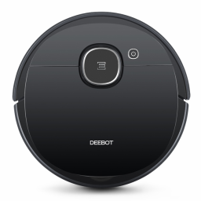

# Ecovacs Адаптер Deebot для ioBroker
[![github-workflow] (https://github.com/mrbungle64/iobroker.ecovacs-deebot/actions/workflows/node.js.yml/badge.svg)](https://github.com/mrbungle64/iobroker.ecovacs-deebot)

Этот адаптер использует библиотеку [ecovacs-deebot.js](https://github.com/mrbungle64/ecovacs-deebot.js).

## Функции
Некоторые примечательные особенности:

* Получить информацию (например, аккумулятор, журнал очистки, расходные материалы, состояние очистки и зарядки)
* Отправляйте чистые команды (например, авто, точечная область, настраиваемая область) и различные другие команды (например, воспроизведение звука, сброс расходных материалов)
* Сохраните пользовательскую область последнего запуска и повторно запустите сохраненные области
* Регулировка мощности вакуума (чистая скорость) и уровня воды
* Получить информацию во время процесса очистки (например, текущее положение и площадь)
* Получить информацию о картах, вкл. точечные области и виртуальные границы
* Удалять, сохранять и воссоздавать отдельные виртуальные границы, а также полный набор виртуальных границ *)
* Функция загрузки текущего изображения карты *)

*) Экспериментальный

Обратите внимание: некоторые функции доступны только для некоторых моделей.

## Модели
### Поддерживаемые модели
* Deebot 900/901
* Deebot OZMO 930
* Deebot OZMO 920/950

Перечисленные модели - это те, которые я использую сам или которые технически идентичны им.

### Эти модели должны работать исправно или хотя бы частично
* Deebot Slim 2
* Deebot N79 серии
* Deebot M88
* Deebot 600/601/605
* Deebot 710/711/711s
* Deebot OZMO 610
* Deebot OZMO 900/905
* Deebot OZMO Slim 10/11
* Deebot OZMO T5
* Серия Deebot U2
* Deebot N3 MAX
* Deebot N7
* Серия Deebot N8
* Серия Deebot T8
* Серия Deebot T9

Перечисленные модели либо уже работают, либо технически аналогичны этим моделям.
Тем не менее, функциональность может быть частично ограничена.

Я стараюсь достичь широкого диапазона функциональных возможностей, но решаю этот вопрос индивидуально, в зависимости от сложности и различных других критериев.
Претензий на полную функциональность конечно же нет.

## Монтаж
Рекомендуется использовать Node.js. версии 12.x или 14.x. Минимальная необходимая версия - все еще 10.x, но это может скоро измениться.

Этот адаптер использует библиотеку [узел-холст](https://www.npmjs.com/package/canvas) для некоторых функций, связанных с картой, которые могут потребовать установки некоторых дополнительных пакетов.

Установка Canvas необязательна и не требуется для моделей без функции карты, но для полного функционального диапазона установите следующие пакеты.

Для систем Linux на базе Debian необходимо выполнить следующие команды:

```bash
sudo apt-get update
sudo apt-get install build-essential libcairo2-dev libpango1.0-dev libjpeg-dev libgif-dev librsvg2-dev
```

Перед выполнением следующей команды может потребоваться перезагрузка.

```bash
sudo npm install canvas --unsafe-perm=true
```

Для получения инструкций для других систем посетите https://www.npmjs.com/package/canvas#compiling.

## Использование
* Информацию о том, как использовать этот адаптер, можно найти [здесь] (https://github.com/mrbungle64/ioBroker.ecovacs-deebot/wiki)

### Состояния
* Информацию о состояниях можно найти [здесь] (https://github.com/mrbungle64/ioBroker.ecovacs-deebot/wiki/States-%28EN%29) (на английском языке) и [здесь] (https:// github .com / mrbungle64 / ioBroker.ecovacs-deebot / wiki / Datenpunkte-% 28DE% 29) (немецкий)

## ВОПРОСЫ-ОТВЕТЫ
* Часто задаваемые вопросы можно найти [здесь] (https://github.com/mrbungle64/ioBroker.ecovacs-deebot/wiki/FAQ)

## Известные проблемы
* Для некоторых моделей (например, Deebot OZMO 930) рекомендуется [запланировать перезапуск] (https://www.iobroker.net/#en/documentation/admin/instances.md#The%20page%20content) один раз в день. потому что есть некоторые сообщения о том, что соединение теряется через прибл. 24 часа
* Некоторые функции очистки могут не работать с Deebot 710/711 / 711s. Пожалуйста, используйте пока версию 0.5.8.
* Функция "edge" не работает с Deebot U2 (вместо этого запускает автоматическую очистку)
* Некоторые состояния "журнала очистки" пусты на серии T9 ("last20Logs", "lastCleaningDate" и "lastCleaningMapImageURL")

## Заявление об ограничении ответственности
Я никоим образом не связан с ECOVACS.

## Changelog

### 1.2.2
* Added function to load current map image (non 950 type models, e.g. OZMO 930, Deebot 901)

### 1.2.1
* Some enhancements and fixes
* (benep) Added state to play sound by id

### 1.2.0
* Using library version 0.6.1
* Added functions for deleting, saving and recreating saved virtual boundaries (950 type models, e.g. OZMO 920/950, T8 series)
* Added functions for saving and recreating sets of virtual boundaries (950 type models, e.g. OZMO 920/950, T8 series)
* Added options to control clean speed and water level separately for each spot area
* Added function to save current spot area values
* Added function to load current map image (950 type models, e.g. OZMO 920/950, T8 series)
* Added some cleaning log values and some states for current cleaning stats
* Removed "Use alternative API call for lastCleaningMapImageURL and lastCleaningTimestamp" option
* Moved some states from "info" channel to sub channels "info.library" and "info.network"
* Quite a lot of improvements for processing map data, spot areas and virtual boundaries
* Some optimisations for js-controller 3.3
* Improved support for N8 series
* Initial support for T9 series
* Some improvements and fixes

### 1.1.1
* Using library version 0.6.0
  * Updated login process
  * Support for Chinese server login
* Initial support for some models (e.g. N3, N7 and N8 series)

### 1.1.0
* Stable release

### 1.0.13
* Using library version 0.5.6
* Some improvements and fixes

### 1.0.12
* Using library version 0.5.5
* Added some more T8 models
* Several improvements and fixes

### 1.0.11
* Enabled some features for OZMO 900
* Several minor improvements

### 1.0.10
* Using library version 0.5.4
* Several improvements and fixes
* Added available spot area boundaries to "map" channel (read only)

### 1.0.9
* Using library version 0.5.3
* Added some experimental features (for a few models only)
* Added option for virtual boundaries and some further improvements to adapter config
* Some improvements for js-controller 3.2.x

### 1.0.8
* Using library version 0.5.2
* Added available virtualBoundaries channel for Deebot 900/901 and Ozmo 930 (read only)
* Added "volume" and buttons for resetting consumable values for 950 type models (920/950/T8)
* Improved synchronization of spot area buttons
* Add option for setting the language for spot area names
* Added some experimental features (for a few models only)
* Several enhancements and fixes
* Bump some dependencies

### 1.0.7
* Using library version 0.5.1
* Initial support for Deebot U2 series
* Improved support for Ozmo T8 models
* (boriswerner) Fixed cleaning log for 950 type models (920/950/T8)
* (boriswerner) Added available virtualBoundaries to "map" channel (currently read only)
* Improved handling of device classes
* Several enhancements and fixes

### 1.0.6
* Using library version 0.5.0
* Fix for running multiple devices
* Support for additional Ozmo T8 models
* Add option to synchronize spotArea buttons
* Set state value for triggered buttons to false
* Add option to suppress "unknown" value for "map.deebotPositionCurrentSpotAreaID" state
* Further enhancements and fixes

### 1.0.5
* Bump library to 0.4.25
* Initial support for Ozmo T8 and T8+
* Implement buttons for resetting consumable values (currently Deebot 900/901 and Ozmo 930 only)
* Several enhancements and fixes

### 1.0.4
* Bump library to 0.4.21
* Remove canvas from dependencies
* Several bugfixes and improvements (especially for N79 series)
* Possibility to specify the number of reruns for a spot area
* Spot areas in the "control" channel are now created automatically
* Remove number of spot areas from adapter settings
* Some refactoring
* Bump dependencies

### 1.0.1 - 1.0.3
* Added support for Ozmo T8 AIVI
* Compact mode support
* Added a button to save the last used custom area values
* Added buttons to rerun saved custom areas
* Some enhancements and fixes

### 1.0.0
* Stable release

### 0.0.1 - 0.6.5
* [Changelog archive](https://github.com/mrbungle64/ioBroker.ecovacs-deebot/wiki/Changelog-(archive)#059)

## License

MIT License

Copyright (c) 2021 Sascha Hölzel <mrb1232@posteo.de>

Permission is hereby granted, free of charge, to any person obtaining a copy
of this software and associated documentation files (the "Software"), to deal
in the Software without restriction, including without limitation the rights
to use, copy, modify, merge, publish, distribute, sublicense, and/or sell
copies of the Software, and to permit persons to whom the Software is
furnished to do so, subject to the following conditions:

The above copyright notice and this permission notice shall be included in all
copies or substantial portions of the Software.

THE SOFTWARE IS PROVIDED "AS IS", WITHOUT WARRANTY OF ANY KIND, EXPRESS OR
IMPLIED, INCLUDING BUT NOT LIMITED TO THE WARRANTIES OF MERCHANTABILITY,
FITNESS FOR A PARTICULAR PURPOSE AND NONINFRINGEMENT. IN NO EVENT SHALL THE
AUTHORS OR COPYRIGHT HOLDERS BE LIABLE FOR ANY CLAIM, DAMAGES OR OTHER
LIABILITY, WHETHER IN AN ACTION OF CONTRACT, TORT OR OTHERWISE, ARISING FROM,
OUT OF OR IN CONNECTION WITH THE SOFTWARE OR THE USE OR OTHER DEALINGS IN THE
SOFTWARE.