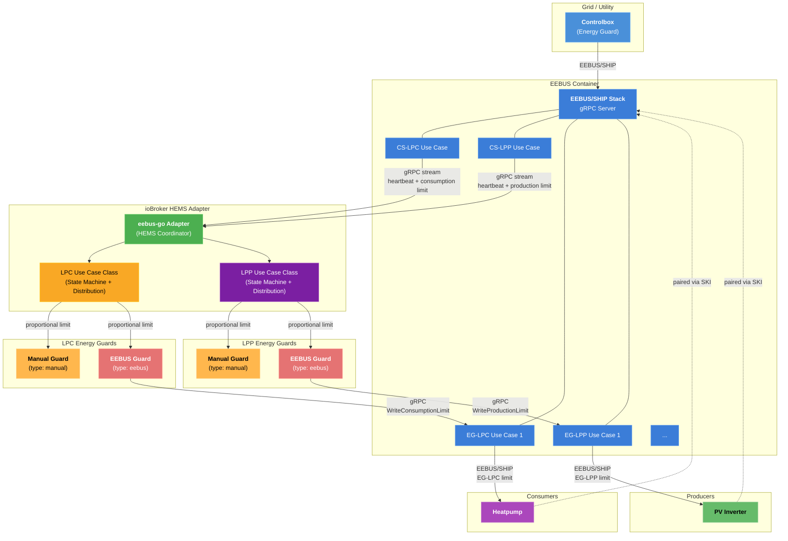

# Архитектурный сценарий: Блок управления + Защита от перенапряжения EEBUS + Ручная защита от перенапряжения (LPC и LPP)



## Описание компонента

| Компонент                             | Роль                                                                                                                                                                                                            |
| ------------------------------------- | --------------------------------------------------------------------------------------------------------------------------------------------------------------------------------------------------------------- |
| **Блок управления**                   | Устройство оператора энергосети, передающее ограничения потребления и/или производства по протоколу EEBUS/SHIP.                                                                                                 |
| **Контейнер EEBUS**                   | Контейнер Docker/Podman, работающий со стеком eebus-go SHIP. Обрабатывает все сетевые операции EEBUS/SHIP, обнаружение mDNS и модель данных SPINE. Предоставляет адаптеру доступ к gRPC API.                    |
| **Пример использования CS-LPC**       | Управляемая система — Ограничение энергопотребления (§14a EnWG). Получает данные об ограничениях потребления от блока управления.                                                                               |
| **Пример использования CS-LPP**       | Управляемая система — Ограничение выработки электроэнергии (§9 ЭЭГ). Получает ограничения на выработку электроэнергии от блока управления.                                                                      |
| **Пример использования EG-LPC**       | Energy Guard — Ограничение энергопотребления. Передает ограничения на потребление энергии сопряженным потребительским устройствам.                                                                              |
| **Пример использования EG-LPP**       | Energy Guard — Ограничение выработки электроэнергии. Передаёт ограничения на выработку электроэнергии парным производственным устройствам.                                                                      |
| **Адаптер eebus-go**                  | Адаптер ioBroker (координатор HEMS), который взаимодействует с контейнером через gRPC и делегирует задачи классам сценариев использования LPC и LPP.                                                            |
| **Класс вариантов использования LPC** | Реализует состояния CS-LPC (инициализация, неограниченное контролируемое, ограниченное, отказоустойчивое, неограниченное автономное) и распределяет ограничения потребления между системами защиты энергии LPC. |
| **Класс вариантов использования LPP** | Реализует состояния CS-LPP (идентичный конечный автомат) и распределяет ограничения на производство энергии между защитниками LPP.                                                                              |
| **EEBUS Energy Guard**                | Передает свою лимитную долю на сопряженное устройство через конечную точку gRPC EG-LPC или EG-LPP контейнера. Также принимает лимиты, установленные вручную оператором (продолжительность 60 минут).            |
| **Ручная защита энергии**             | Отсутствует соединение EEBUS. Лимит устанавливается вручную оператором с помощью объектов состояния ioBroker.                                                                                                   |
| **Тепловой насос**                    | Потребительское устройство сопряжено с контейнером через SKI. Получает ограничения EG-LPC по шине EEBUS/SHIP.                                                                                                   |
| **фотоэлектрический инвертор**        | Производственное устройство сопряжено с контейнером через SKI. Получает ограничения EG-LPP по шине EEBUS/SHIP.                                                                                                  |

## Поток данных

### LPC (ограничение потребления)

1. **Блок управления** подключается к **контейнеру EEBUS** через протокол EEBUS/SHIP (обнаружение mDNS, доверие SKI).
2. **В рамках сценария использования CS-LPC** контейнер передает события пульсации и ограничения потребления на **адаптер по протоколу** gRPC.
3. **Класс вариантов использования LPC** осуществляет переходы своего конечного автомата на основе сообщений о пульсе и ограничениях.
4. Когда активен лимит потребления, класс LPC распределяет его между энергозащитными устройствами LPC в процентном соотношении.
5. **Энергетическая защита EEBUS** вызывает`WriteConsumptionLimit` на конечной точке gRPC **EG-LPC** контейнера.
6. Контейнер передает ограничение EG-LPC на **тепловой насос** по шине EEBUS/SHIP.
7. Система **ручной защиты от перенапряжения** устанавливает ограничение на основе ввода данных оператором (без использования EEBUS).
8. Оператор также может установить **вручную ограничение** на **EEBUS Energy Guard** (продолжительность 60 минут, передается на тепловой насос через контейнер). Это ограничение сбрасывается, когда срабатывает ограничение блока управления.

### LPP (Ограничение производства)

1. Блок **управления** передает обязательства по ограничению производства в **сценарий использования CS-LPP** контейнера через EEBUS/SHIP.
2. **В рамках сценария использования CS-LPP** контейнер передает события пульсации и ограничения производственной среды на **адаптер** через gRPC.
3. **Класс вариантов использования LPP** осуществляет переходы своего конечного автомата на основе сообщений о пульсе и ограничениях.
4. Когда активен лимит производства, класс LPP распределяет его между защитными элементами LPP в процентах.
5. **Энергетическая защита EEBUS** вызывает`WriteProductionLimit` на конечной точке gRPC **EG-LPP** контейнера.
6. Контейнер передает ограничение EG-LPP на **фотоэлектрический инвертор** по шине EEBUS/SHIP.
7. Система **ручного регулирования энергопотребления** устанавливает предельный уровень выработки энергии на основе данных, введенных оператором.
8. Оператор также может установить **вручную ограничение на производство энергии** в системе **EEBUS Energy Guard** (продолжительность 60 минут). Это ограничение сбрасывается, когда активируется ограничение на производство в блоке управления.

## Дерево объектов ioBroker

```
eebus-go.0/
├── info/
│   ├── connection         (boolean)
│   ├── discoveredDevices  (JSON string)
│   └── ski                (string)
├── LPC/
│   ├── state              (string)
│   ├── limit              (number, W)
│   ├── limitDuration      (number, min)
│   ├── limitMinutesToday  (number, min)
│   └── EnergyGuards/
│       └── Guard_{name}/
│           ├── percentage, currentLimit, lastHeartbeat, failsafeLimit
│           ├── eebusConnected, manualLimit, confirmedLimit  (EEBUS only)
│           └── heartbeat, connected                         (manual only)
├── LPP/
│   ├── state              (string)
│   ├── limit              (number, W)
│   ├── limitDuration      (number, min)
│   ├── limitMinutesToday  (number, min)
│   └── EnergyGuards/
│       └── Guard_{name}/
│           ├── percentage, currentLimit, lastHeartbeat, failsafeLimit
│           ├── eebusConnected, manualLimit, confirmedLimit  (EEBUS only)
│           └── heartbeat, connected                         (manual only)
```