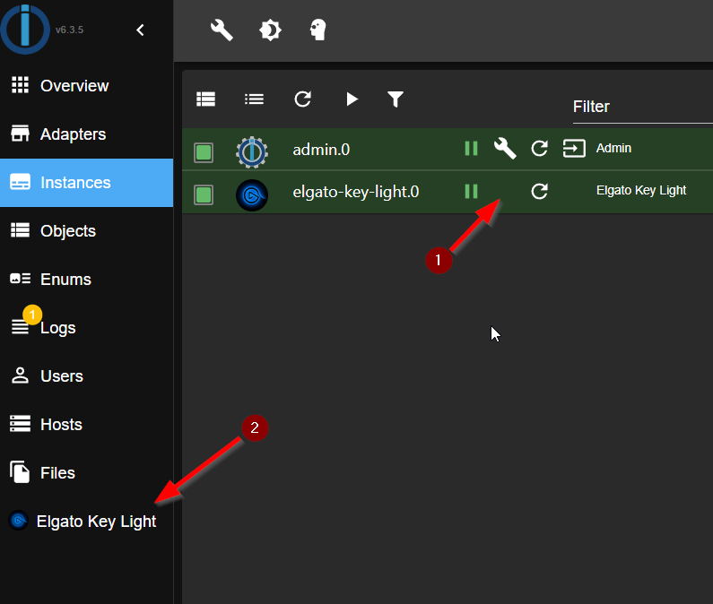

# IoBroker.elgato-ключ-свет
**Тесты:** 

## Адаптер elgato-key-light для ioBroker
### ОТКАЗ ОТ ОТВЕТСТВЕННОСТИ
Все названия продуктов и компаний или логотипы являются товарными знаками Trademarks™ или Registered® товарными знаками их соответствующих владельцев. Их использование не подразумевает какой-либо аффилированности или одобрения ими или связанными с ними аффилированными лицами! Этот личный проект осуществляется на развлекательной основе и не имеет никаких коммерческих целей. **Elgato** является товарным знаком **Corsair GmbH**.

### Часовой
**Этот адаптер использует библиотеки Sentry для автоматического сообщения разработчикам об исключениях и ошибках кода.**\ Для получения дополнительных сведений и информации о том, как отключить отчеты об ошибках, см.
[Документация по плагину Sentry](https://github.com/ioBroker/plugin-sentry#plugin-sentry)! Отчеты Sentry используются, начиная с js-controller 3.0.

### Кредиты
Этот адаптер был бы невозможен без огромной работы @xXBJXx (https://github.com/xXBJXx), который создал этот адаптер и, надеюсь, будет поддерживать его в будущем.

### Описание
Этот адаптер позволяет управлять [Elgato Key Lights](https://www.elgato.com/de/key-light) через ioBroker.\ Адаптер поддерживает следующие функции:

* Включение/выключение питания.
* Яркость ⇨ (доступно для всех основных фонарей).
* Цветовая температура ⇨ (доступно только с [Elgato Key Light](https://www.elgato.com/de/key-light), [Elgato Key Light Air](https://www.elgato.com/de/key-light-air),

[Кольцевой свет Elgato](https://www.elgato.com/de/ring-light) и [Elgato Key Light мини](https://www.elgato.com/de/key-light-mini) доступны)

* Цвет ⇨ (доступно только с [Elgato Light Strip](https://www.elgato.com/de/light-strip))

### Интерфейс адаптера
Классический интерфейс адаптера для экземпляров не существует.\  

Что можно сделать в пользовательском интерфейсе?

* № 1 устанавливает интервал опроса адаптера (по умолчанию: 60 секунд).

После изменения интервала необходимо перезапустить адаптер, это делается с помощью кнопки Сохранить.

* № 2 добавить новое устройство к адаптеру.
* № 3 устанавливает цветовую температуру для всех основных источников света (от 2900К до 7000К)
* № 4 устанавливает яркость для всех основных источников света (от 0% до 100%)
* № 5 установите цвет для световых полос\

  

* № 6 включить и выключить свет

**при изменении № 3, № 4 и № 5 изменение будет выполнено через 1,5 секунды.**

### Предупреждение
**Пожалуйста, не обращайтесь к точкам данных слишком часто, в противном случае устройства будут недоступны в течение нескольких секунд.**

### Точки данных
Точки данных создаются автоматически при обнаружении нового устройства.

#### Точки данных для всех основных огней / световых полос
\ Точки данных делятся на:

* **info** ⇨ Информация об устройстве\.

  

* **свет** ⇨ Точки данных для управления устройством, здесь есть два разных типа точек данных:
* для управления яркостью и цветовой температурой.

    

* для управления цветом

    

* **настройки** ⇨ точки данных для информации из настроек устройства

  

### Примечания
* Данные по цвету доступны только для световых полос.
* Данные по цветовой температуре доступны только для основных источников света.
* Данные по яркости доступны для всех основных светильников и световых полос.
* Сцены из Light Strips не поддерживаются. Так как они не доступны через API.

## Changelog
<!--
    Placeholder for the next version (at the beginning of the line):
    ### **WORK IN PROGRESS**
-->
### 1.1.0 (2024-04-14)
* (mcm1957) Adapter requires node.js 18 and js-controller >= 5 now
* (mcm1957) Dependencies have been updated

### 1.0.1 (2024-01-18)
* (mcm1957) Writing states now requires ack flag to be false.
* (mcm1957) Small adaptions to solve review issues have been applied.

### 1.0.0 (2024-01-18)
* (mcm1957) Adapter requires node.js 18 or newer now
* (mcm1957) Adapter has been moved into iobroker-community-adapters area
* (mcm1957) Dependencies have been updated

### 0.2.0 (2023-02-26)
* (xXBJXx) updated dependencies
* (xXBJXx) Updating the UI to the new functions of the iobroker-react library

### 0.1.0 (2023-02-06)
* (xXBJXx) removed the Bonjour search, because it did not work properly
* (xXBJXx) Adding a delete function for devices
* (xXBJXx) Dependency updates
* (xXBJXx) feature request [#2](https://github.com/xXBJXx/ioBroker.elgato-key-light/issues/2) added

## License
MIT License

Copyright (c) 2024 iobroker-community-adapters <mcm57@gmx.at>
Copyright (c) 2023 xXBJXx <issi.dev.iobroker@gmail.com>

Permission is hereby granted, free of charge, to any person obtaining a copy
of this software and associated documentation files (the "Software"), to deal
in the Software without restriction, including without limitation the rights
to use, copy, modify, merge, publish, distribute, sublicense, and/or sell
copies of the Software, and to permit persons to whom the Software is
furnished to do so, subject to the following conditions:

The above copyright notice and this permission notice shall be included in all
copies or substantial portions of the Software.

THE SOFTWARE IS PROVIDED "AS IS", WITHOUT WARRANTY OF ANY KIND, EXPRESS OR
IMPLIED, INCLUDING BUT NOT LIMITED TO THE WARRANTIES OF MERCHANTABILITY,
FITNESS FOR A PARTICULAR PURPOSE AND NONINFRINGEMENT. IN NO EVENT SHALL THE
AUTHORS OR COPYRIGHT HOLDERS BE LIABLE FOR ANY CLAIM, DAMAGES OR OTHER
LIABILITY, WHETHER IN AN ACTION OF CONTRACT, TORT OR OTHERWISE, ARISING FROM,
OUT OF OR IN CONNECTION WITH THE SOFTWARE OR THE USE OR OTHER DEALINGS IN THE
SOFTWARE.