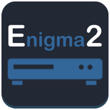
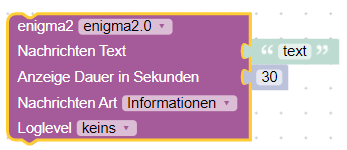
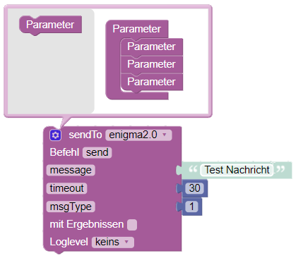

---

# ioBroker enigma2

- Адаптер для ioBroker, позволяющий получать информацию от приемника enigma2 и отправлять команды.
- (Адаптер работает только на одном хосте! При установке на клиентском компьютере пока сохраняются проблемы.)

---

### Функции

- BOX\_IP
- СЕТЬ
- CHANNEL\_SERVICEREFERENCE
- НАЗВАНИЕ\_КАНАЛА\_СЕРВИСА
- КАНАЛ
- ОПИСАНИЕ СОБЫТИЯ
- ПРОДОЛЖИТЕЛЬНОСТЬ СОБЫТИЯ
- ПРОДОЛЖИТЕЛЬНОСТЬ\_СОБЫТИЯ\_МИН
- СОБЫТИЕ ПРОДОЛЖАЕТСЯ
- EVENTREMAINING\_MIN
- ПРОЦЕНТ\_ПРОГРЕССА\_СОБЫТИЯ
- EVENT\_TIME\_START
- EVENT\_TIME\_END
- EVENT\_TIME\_PASSED
- Емкость жесткого диска
- HDD\_FREE
- ОТВЕТ\_СООБЩЕНИЕ
- МОДЕЛЬ
- ПРИГЛУШЕННЫЙ
- ПРОГРАММА
- ИНФОРМАЦИЯ О ПРОГРАММЕ
- ПРОГРАММА\_ПОСЛЕ
- PROGRAMM\_AFTER\_INFO
- ПОДДЕРЖИВАТЬ
- ОБЪЕМ
- WEB\_IF\_VERSION
- isRecording
- Таймер\_установлен
- MOVIE\_LIST (только openwebif)
- TIMER\_LIST
- CHANNEL\_PICON (Путь к иконке - только для OpenWebIF)

---

### основной

- enigma2-CONNECTION

---

### Командование

- command.CHANNEL\_DOWN
- команда.CHANNEL\_UP
- команда.ВНИЗ
- команда.UP
- команда.ЭПГ
- команда.ВЫХОД
- команда.ЛЕВАЯ
- команда.МЕНЮ
- команда.MUTE\_TOGGLE
- команда.ОК
- команда.ПАУЗА
- команда.ВОСПРОИЗВЕДЕНИЕ
- команда.РАДИО
- команда.REC
- команда.ДИСТАНЦИОННОЕ УПРАВЛЕНИЕ
- команда.ПРАВО
- команда.SET\_VOLUME
- command.STANDBY\_TOGGLE
- команда.СТОП
- команда.Т
- команда.UP
- команда.УМЕНЬШЕНИЕ\_ГРОМКОСТИ
- команда.VOLUME\_UP
- command.ZAP = отправить недействительную ссылку на сервис

---

### Главное командование

- main\_command.DEEP\_STANDBY = Deepstandby
- main\_command.REBOOT = Перезагрузка
- main\_command.RESTART\_GUI = Перезапустить Enigma2 (GUI)
- main\_command.STANDBY = Standby
- main\_command.WAKEUP\_FROM\_STANDBY = Пробуждение из режима ожидания

---

### Сообщение

- Message.Text = Текст сообщения (Enter -> Send)
- Message.Type = Число от 0 до 3 (0 = Да/Нет; 1 = Информация; 2 = Сообщение; 3 = Внимание)
- Message.Timeout = время ожидания сообщения в секундах. Может быть пустым значением или числом секунд, через которое сообщение должно исчезнуть.

---

### Alexa\_Command

- Alexa\_Command.Mute = Команда Alexa
- Alexa\_Command.Standby = Команда Alexa

---

### sendTo

#### в Блокли

- сообщение = Текст сообщения
- msgType = Число от 0 до 3 (0 = Да/Нет; 1 = Информация; 2 = Сообщение; 3 = Внимание)
- timeout = время ожидания сообщения в секундах. Может быть пустым значением или числом секунд, через которое сообщение должно исчезнуть.



### или



[> Импорт Blockly <](/#/docs/adapterref/iobroker.enigma2/admin/Blockly_Import.md)

#### на JavaScript

```js
sendTo('enigma2.0', 'send', {
    message: 'Test Messaget', /* Text of Message */
    timeout: 26,               /* timeout of Message in sec. (Can be empty or the Number of seconds the Message should disappear after.) */
    msgType: 1,                /* Number from 0 to 3 (0= Yes/No ; 1= Info ; 2=Message ; 3=Attention) */
});
```

## Changelog
<!--
    Placeholder for the next version (at the beginning of the line):
    ### **WORK IN PROGRESS**
-->
### **WORK IN PROGRESS**
- (copilot) Adapter requires node.js >= 22 now

### 2.3.0 (2026-03-05)
- (mcm1957) Adapter requires node.js >= 20 now.
- (copilot) Adapter requires admin >= 7.7.22 now
- (copilot) Adapter requires js-controller >= 6.0.11 now
- (mcm1957) Dependencies have been updated.

### 2.2.3 (2024-12-22)
* (mcm1957) Adapter has been moigrated to @iobroker/eslint-config. [#266]

### 2.2.2 (2024-12-22)
* (mcm1957) States 'message.*' are writeable again now. [#273]
* (mcm1957) Dependencies have been updated.

### 2.2.1 (2024-11-13)
* (mcm1957) Adapter requires js-controller 5.0.19 and admin 6.17.14 now.
* (mcm1957) Message states have been added. [#229]
* (simatec) Adapter changed to meet Responsive Design rules.
* (mcm1957) Several issues reported by adapter checker have been fixed.
* (mcm1957) Dependencies have been updated.

### 2.1.1 (2024-06-09)
* (klein0r) Updated Blockly definitions

[Older changelogs can be found there](https://github.com/iobroker-community-adapters/ioBroker.enigma2/blob/master/CHANGELOG_OLD.md)

## License
MIT License

Copyright (c) 2023-2026 iobroker-community-adapters <iobroker-community-adapters@gmx.de>

Permission is hereby granted, free of charge, to any person obtaining a copy
of this software and associated documentation files (the "Software"), to deal
in the Software without restriction, including without limitation the rights
to use, copy, modify, merge, publish, distribute, sublicense, and/or sell
copies of the Software, and to permit persons to whom the Software is
furnished to do so, subject to the following conditions:

The above copyright notice and this permission notice shall be included in all
copies or substantial portions of the Software.

THE SOFTWARE IS PROVIDED "AS IS", WITHOUT WARRANTY OF ANY KIND, EXPRESS OR
IMPLIED, INCLUDING BUT NOT LIMITED TO THE WARRANTIES OF MERCHANTABILITY,
FITNESS FOR A PARTICULAR PURPOSE AND NONINFRINGEMENT. IN NO EVENT SHALL THE
AUTHORS OR COPYRIGHT HOLDERS BE LIABLE FOR ANY CLAIM, DAMAGES OR OTHER
LIABILITY, WHETHER IN AN ACTION OF CONTRACT, TORT OR OTHERWISE, ARISING FROM,
OUT OF OR IN CONNECTION WITH THE SOFTWARE OR THE USE OR OTHER DEALINGS IN THE
SOFTWARE.