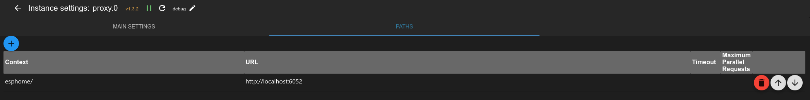
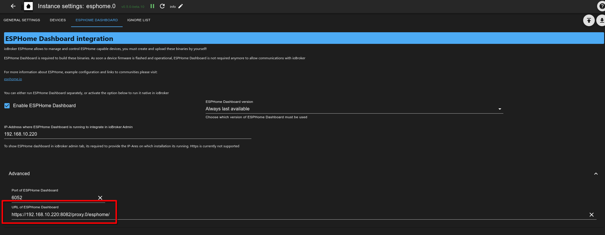
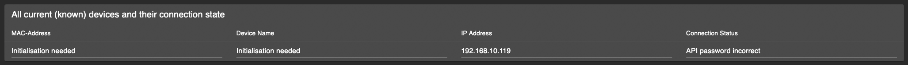

# IoBroker.esphome
[](https://weblate.iobroker.net/engage/adapters/?utm_source=widget)

**Тесты:** 

**Этот адаптер использует библиотеки Sentry для автоматического сообщения разработчикам об исключениях и ошибках кода.** Подробнее об отключении отчётов об ошибках см. в разделе [Документация по плагину Sentry](https://github.com/ioBroker/plugin-sentry#plugin-sentry)! Отчёты Sentry используются, начиная с версии js-controller 3.0.

## Адаптер ESPHome для ioBroker
Управляйте своим ESP8266/ESP32 с помощью простых, но эффективных файлов конфигурации, созданных и управляемых ESPHome.
Интеграция с управляемым устройством ESPHome (включая панель управления) через его собственный API обеспечивает синхронизацию всех данных (обработка событий в реальном времени, без опроса данных! :)


**Быстрые ссылки:**

- 📋 [FAQ - Часто задаваемые вопросы](#часто-задаваемые-вопросы-faq)
- ⚙️ [Предварительные условия и настройка](#предварительные условия)
- 🎛️ [Интеграция с панелью управления](#esphome-dashboard-integration-optional)
- 📱 [Управление устройствами](#device-management)
- 🔧 [Примеры конфигурации](#example-config)

Этот адаптер использует [esphome-native-api](https://github.com/Nafaya/esphome-native-api#readme) со всеми заслугами @Nafaya для взаимодействия с [ESPHome API](https://esphome.io/components/api.html?highlight=api)!

## Часто задаваемые вопросы (FAQ)
### В чем разница между адаптером ioBroker ESPHome и панелью управления ESPHome?
**Адаптер ioBroker ESPHome:**

- Интегрирует ваши устройства ESPHome в ioBroker для управления домашней автоматикой
- Взаимодействует напрямую с устройствами ESP через собственный API ESPHome
- Создает состояния/объекты ioBroker для управления и мониторинга устройств.
- Обрабатывает обновления статуса устройства в режиме реального времени (опрос не требуется)
- Управляет конфигурацией устройства в ioBroker

**Панель управления ESPHome:**

- Веб-интерфейс для создания, редактирования и управления конфигурациями устройств ESPHome
- Используется для написания YAML-конфигураций, компиляции прошивок и прошивки устройств.
- Может быть интегрирован в интерфейс администратора ioBroker как дополнительная функция.
- Может запускаться как интегрированно с этим адаптером, так и как внешняя установка (Docker, автономная)

**Вкратце:** Адаптер управляет вашими устройствами в ioBroker, а панель управления управляет конфигурациями устройств и прошивками.

### Как настроить селектор IP-адресов на панели мониторинга?
Настройка IP-адреса панели мониторинга в конфигурации адаптера служит разным целям:

**Для вкладки «Интегрированная панель управления» в ioBroker Admin:**

1. Введите IP-адрес и порт, на котором работает ваша панель управления ESPHome.
2. **Встроенная панель управления:** Используйте `127.0.0.1:6052` (по умолчанию для интегрированной панели управления)
3. **Внешняя панель управления:** Используйте IP-адрес и порт вашей внешней установки ESPHome (например, контейнер Docker).
4. **Настройка HTTPS:** Для сред HTTPS см. раздел с подробными настройками HTTPS ниже.

**Примеры IP-адресов панели управления:**

- Встроенный: `127.0.0.1:6052`
- Внешний докер: `192.168.1.100:6052`
- Внешний хост: `esphome.local:6052`
- HTTPS-прокси: `https://192.168.1.50:8082/proxy.0/esphome/`


**Примечание:** Вы можете использовать этот адаптер для управления устройствами ESPHome без настройки IP-адреса панели управления. IP-адрес панели управления необходим только в том случае, если вы хотите интегрировать интерфейс панели управления ESPHome в панель администратора ioBroker.

### Нужна ли мне панель инструментов ESPHome для использования этого адаптера?
**Нет, панель управления необязательна.** Вы можете использовать этот адаптер несколькими способами:

1. **Только адаптер**: управление предварительно настроенными устройствами ESPHome без интеграции с панелью управления.
2. **Адаптер + внешняя панель управления:** Используйте существующую установку ESPHome (Docker, автономную) и при необходимости интегрируйте ее в интерфейс ioBroker.
3. **Адаптер + встроенная панель управления:** включите встроенную функцию панели управления ESPHome для комплексного решения.

Адаптер работает автономно и требует только устройств с включенным API ESPHome в конфигурации.

### Как добавить устройства к адаптеру?
1. **Убедитесь, что API ESPHome включен** в конфигурации YAML вашего устройства (см. раздел «Предварительные условия»)
2. **Откройте вкладку устройства адаптера** в ioBroker Admin (адаптер должен быть запущен)
3. **Добавьте устройства вручную:** Введите IP-адрес устройства и учетные данные для аутентификации.
4. **Автоматическое обнаружение:** в настоящее время отключено (см. проблему № 175)

Адаптер установит соединение и создаст все необходимые объекты ioBroker для управления устройством.

## [Документация](https://DrozmotiX.github.io/languages/en/Adapter/ESPHome/)

## [Документация](https://DrozmotiX.github.io/languages/en/Adapter/ESPHome/)
Всю документацию по нашему адаптеру можно найти по адресу [Страница документации DrozmotiX](https://DrozmotiX.github.io/languages/en/Adapter/ESPHome/) -->

## Предпосылки
* NodeJS >= 18.x
* API активирован в YAML
* Для вкладок администратора (необязательно)
* IP-адрес панели управления ESPHome указан в настройках экземпляра.

## Интеграция с панелью управления ESPHome (необязательно)
Этот адаптер может опционально интегрировать панель управления ESPHome в интерфейс администратора ioBroker. Доступно несколько вариантов:

**Вариант 1: Встроенная панель управления (рекомендуется для новичков)**

- Включите «Встроенную интеграцию панели мониторинга ESPHome» в настройках адаптера.
- Использует интегрированную среду Python (внешняя настройка не требуется)
- Панель управления по умолчанию работает на порту 6052.
- Установите IP-адрес панели управления на `127.0.0.1:6052` для интеграции с администратором.

**Вариант 2: Внешняя панель управления**

- Использовать существующую установку ESPHome (Docker, автономную и т. д.)
- Введите IP:порт внешней панели в настройках адаптера.
- Пример: `192.168.1.100:6052` для контейнера Docker

**Вариант 3: Без интеграции с панелью управления**

- Полностью пропустить настройку панели управления
- Используйте внешние инструменты ESPHome для настройки устройства.
- Адаптер продолжает нормально управлять устройствами.


> **💡 См. раздел часто задаваемых вопросов выше** для получения подробных объяснений конфигурации IP-панели управления и различий между адаптером и панелью управления.

### Использование HTTPS
Одной из причин использования HTTPS является возможность напрямую прошивать устройства, подключенные к вашему ПК, поскольку esphome не позволит этого сделать с http (вероятно, из-за ограничений браузера в WebSerial).


Использование интегрированной панели управления, когда iobroker использует https, в настоящее время требует выполнения некоторых дополнительных шагов:

1. Установите веб-адаптер (если у вас его еще нет) и настройте https. Дополнительную информацию см. в веб-документации: [ioBroker.web](https://github.com/ioBroker/ioBroker.web)
2. установить адаптер [прокси](https://github.com/ioBroker/ioBroker.proxy)
3. Настройте путь в настройках прокси-адаптера:
1. контекст: `esphome/`
2. URL: `http://localhost:6052`



4. Настройте полный URL-адрес панели мониторинга в расширенном разделе настроек адаптера esphome — панель мониторинга esphome:
1. например: `https://<iobrokerIP>:<webAdapterPort>/proxy.0/esphome/`
2. где `<iobrokerIP>` — это IP-адрес хоста, на котором запущен ваш iobroker (такой же, как указано выше)
3. и `<webAdapterPort>` — порт веб-адаптера (по умолчанию 8082)
4. это должно выглядеть примерно так:

   

5. Если вы запускаете панель управления на внешнем хосте, вы также можете использовать URL-адрес внешнего экземпляра панели управления здесь.

## Как использовать этот адаптер
### Активировать API в YAML
> [!ВАЖНО] > ioBroker ESPHome позволяет интегрировать устройства с помощью ключа шифрования (рекомендуется) или пароля API (устаревшая версия), > необходимо указать соответствующие настройки аутентификации, > см. [Документация ESPHome](https://esphome.io/components/api.html?highlight=api) > Пожалуйста, настройте только ключ шифрования (предпочтительно) или пароль API (устаревшая версия)

#### Пример записи конфигурации ключа шифрования
```
api:
  encryption:
    key: "DyDfEgDzmA9GlK6ZuLkj3qgFcjXiZUzUf4chnIcjQto="
```

#### Пример записи конфигурации API
```
api:
  password: 'MyPassword'
```

## Управление устройствами
### Добавить/изменить/удалить устройства ESPHome в ioBroker
> [!ВАЖНО] > Этот адаптер интегрирует связь с устройствами, совместимыми с ESPHome, и (если активирована) интегрированной версией панели управления ESPHome.
> Вам необходимо самостоятельно настроить и загрузить конфигурацию ESP, используя интегрированную панель управления или внешнюю альтернативу (например, Docker), прежде чем их можно будет интегрировать в ioBroker.

> **💡 См. раздел часто задаваемых вопросов выше** для пошагового руководства по добавлению устройств к адаптеру.

На вкладке «Устройства» будут показаны все известные на данный момент устройства. Вы можете либо дождаться автоматического обнаружения устройств (в настоящее время отключено, см. #175), либо добавить их вручную, указав их IP-адрес и учетные данные.


> [!ПРИМЕЧАНИЕ] > Кнопки добавления/изменения/удаления устройств и загрузки таблицы устройств доступны только при запущенном адаптере! > Необходимо обновить таблицу устройств вручную, нажав «Обновить обзор устройств». Будут показаны все устройства и состояние их подключения.

Введите IP-адрес (если устройство уже известно, вы можете выбрать его из выпадающего списка) и выберите соответствующие действия:

- ДОБАВИТЬ/ИЗМЕНИТЬ УСТРОЙСТВА
- Отправит IP-адрес и учетные данные на серверную часть и попытается установить соединение.
- Если предоставлен ключ шифрования, API-пароль игнорируется. Убедитесь, что конфигурация YAML правильная!

- Удалить устройство
- Отправит сообщение на серверную часть с просьбой удалить это устройство.

> [!ВНИМАНИЕ] > Это действие удалит выбранное устройство и все его связанные состояния из ioBroker!

> [!ПРИМЕЧАНИЕ] > После добавления устройства появится сообщение об успешном завершении или ошибке. > Вы можете обновить таблицу, чтобы увидеть текущие устройства и состояние их подключения.

 

При успешном подключении устройство будет инициировано, и все связанные с ним состояния будут созданы для управления его атрибутами.
При внесении любых изменений в конфигурацию YAML перезагрузка ESP приведёт к отключению устройства и установке нового соединения.
В ходе этого процесса состояния, которые больше не являются частью конфигурации YAML, будут автоматически удалены.


### Пример конфигурации
Пример конфигурации, больше примеров см. в [Страница документации DrozmotiX (https://DrozmotiX.github.io) или [документация ESPHome](https://esphome.io/index.html)

<details><summary>Показать пример конфигурации</summary>

esphome: имя: sensor_badkamer платформа: ESP32 плата: esp-wrover-kit

wifi: use_address: 192.168.10.122 ssid: "xxxxxx" пароль: "xxxxxx"

# Включить API ESPHome
API: пароль: «MyPassword»

# Активировать шину i2c i2c: sda: 21 scl: 22 scan: True id: bus_a
# Пример конфигурации для bh1750
датчик:

- платформа: bh1750

имя: "Hal_Illuminance" адрес: 0x23 время_измерения: 69 интервал_обновления: 10 с

# Пример конфигурации для выхода GPIO
    выход:

- платформа: gpio

пин: 12 инвертированный: true идентификатор: gpio_12

# Пример конфигурации, связывающей коммутатор с ранее определенным выходом
    выключатель:

- платформа: выход

имя: «Универсальный вывод» вывод: 'gpio_12' </details>

## Tasmota / ESPEasy миграция
Миграция с предыдущих установок Sonoff Tasmota или ESPEasy очень проста. Вам просто нужно создать исполняемый файл в ESPHome и загрузить его в веб-интерфейс.
Подробнее см. в нашем [Страница документа](https://DrozmotiX.github.io/languages/en/Adapter/ESPHome/06.migration.html)

**_ПРИМЕЧАНИЕ:_** Сгенерированные файлы YAML хранятся в ```/opt/iobroker/iobroker-data/iobroker.esphome.>instance</>device<.yaml

## Поддержи меня
Если вам нравится моя работа, пожалуйста, рассмотрите возможность личного пожертвования (это персональная ссылка для пожертвований для DutchmanNL, не имеющая никакого отношения к проекту ioBroker!) [](http://paypal.me/DutchmanNL)

## Changelog

<!--
    Placeholder for the next version (at the beginning of the line):
    ### __WORK IN PROGRESS__
    * (DutchmanNL) 
-->
### 0.6.3 (2025-09-16)
* (@DutchmanNL) Fixed an admin error related to `jsonConfig` validation. #287
* (@DutchmanNL) Various general fixes and dependency updates to improve stability.
* (@DutchmanNL) Improved responsive design for better usability across devices. #284
* (@DutchmanNL) Introduced GitHub Actions to automatically verify the ESPHome Dashboard. #290
* (@DutchmanNL) Added a comprehensive FAQ section to the README to help users with common questions. #286
* (@DutchmanNL) Updated the `esphome-native-api` library to V1.3.3, which may resolve connection issues. #201

### 0.6.2 (2025-08-08)
* (@SimonFischer04) add support for text device type #141, displays #103
* (@SimonFischer04) fix cover device type #156
* (@SimonFischer04) workaround: downgrade python for now. fixes #259

### 0.6.1 (2025-05-24)
* (@SimonFischer04) Update esphome
* (@ticaki) Optimize admin configuration interface
* (@DutchmanNL) Optimize backend handling of device discovery
* (@DutchmanNL) Capability to select ESPHome Dashboard version added, resolves #118

### 0.5.0-beta.8 (2023-11-24)
* (DutchmanNL) Capability to automatically detect new devices added
* (DutchmanNL) Ensures a compatible pillow version is used (10.0.1)
* (SimonFischer04) Add pillow python package by default, resolves #188

### 0.5.0-beta.4 (2023-11-15)
* (DutchmanNL) Refactor memory caching of device data, resolves #189

## License
MIT License

Copyright (c) 2023-2025 DutchmanNL <rdrozda86@gmail.com>

Permission is hereby granted, free of charge, to any person obtaining a copy
of this software and associated documentation files (the "Software"), to deal
in the Software without restriction, including without limitation the rights
to use, copy, modify, merge, publish, distribute, sublicense, and/or sell
copies of the Software, and to permit persons to whom the Software is
furnished to do so, subject to the following conditions:

The above copyright notice and this permission notice shall be included in all
copies or substantial portions of the Software.

THE SOFTWARE IS PROVIDED "AS IS", WITHOUT WARRANTY OF ANY KIND, EXPRESS OR
IMPLIED, INCLUDING BUT NOT LIMITED TO THE WARRANTIES OF MERCHANTABILITY,
FITNESS FOR A PARTICULAR PURPOSE AND NONINFRINGEMENT. IN NO EVENT SHALL THE
AUTHORS OR COPYRIGHT HOLDERS BE LIABLE FOR ANY CLAIM, DAMAGES OR OTHER
LIABILITY, WHETHER IN AN ACTION OF CONTRACT, TORT OR OTHERWISE, ARISING FROM,
OUT OF OR IN CONNECTION WITH THE SOFTWARE OR THE USE OR OTHER DEALINGS IN THE
SOFTWARE.