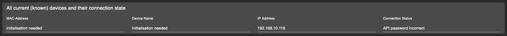

# ioBroker.esphome

**Этот адаптер использует библиотеки Sentry для автоматического сообщения разработчикам об исключениях и ошибках в коде.** Более подробную информацию, а также инструкции по отключению отправки сообщений об ошибках см. [в документации Sentry-Plugin](https://github.com/ioBroker/plugin-sentry#plugin-sentry) ! Система отчетности Sentry используется начиная с js-controller 3.0.

## Адаптер ESPHome для ioBroker

Управляйте своим ESP8266/ESP32 с помощью простых, но мощных конфигурационных файлов, созданных и управляемых ESPHome. Встроенная интеграция с управляемым ESPHome устройством (включая панель управления) через собственный API обеспечивает синхронизацию всех данных (обработка событий в реальном времени, без необходимости опроса данных! :)


**Быстрые ссылки:**

- 📋 [Часто задаваемые вопросы](#frequently-asked-questions-faq)
- ⚙️ [Предварительные условия и настройка](#prerequisites)
- 🎛️ [Интеграция с панелью управления](#esphome-dashboard-integration-optional)
- 📱 [Управление устройствами](#device-management)
- 🔧 [Примеры конфигурации](#example-config)

Этот адаптер использует [esphome-native-api](https://github.com/twocolors/esphome-native-api#readme) , все права принадлежат @twocolors, для взаимодействия с [API ESPHome](https://esphome.io/components/api.html?highlight=api) !

## Часто задаваемые вопросы (FAQ)

### В чём разница между адаптером ioBroker ESPHome и панелью управления ESPHome?

**Адаптер ioBroker ESPHome:**

- Интегрирует ваши устройства ESPHome в ioBroker для управления домашней автоматизацией.
- Осуществляет прямую связь с устройствами ESP через собственный API ESPHome.
- Создает состояния/объекты ioBroker для управления и мониторинга устройств.
- Обрабатывает обновления состояния устройства в режиме реального времени (опрос не требуется).
- Управляет конфигурацией устройства в ioBroker.

**Панель управления ESPHome:**

- Веб-интерфейс для создания, редактирования и управления конфигурациями устройств ESPHome.
- Используется для написания YAML-конфигураций, компиляции прошивки и прошивки устройств.
- Может быть интегрирована в административный интерфейс ioBroker в качестве дополнительной функции.
- Может запускаться как в интеграции с этим адаптером, так и в качестве внешней установки (Docker, автономное приложение).

**Вкратце:** адаптер управляет вашими устройствами в ioBroker, а панель управления отвечает за конфигурацию устройств и прошивку.

### Как настроить селектор IP-адресов на панели управления?

Параметр IP-адреса панели управления в конфигурации адаптера выполняет различные функции:

**Для вкладки «Интегрированная панель управления» в административной панели ioBroker:**

1. Введите IP-адрес и порт, на котором запущена ваша панель управления ESPHome.
2. **Встроенная панель управления:** используйте IP-адрес вашего хоста ioBroker (например,`192.168.1.10:6052` )
   - **Важно:** НЕ использовать`127.0.0.1:6052` (ни`localhost:6052` Если вы обращаетесь к ioBroker с других устройств, iframe попытается связаться с IP-адресом 127.0.0.1 из браузера клиента, а не с сервером ioBroker.
   - Использовать только`127.0.0.1:6052` если вы получаете доступ к административной панели ioBroker ТОЛЬКО с того же компьютера, на котором запущен ioBroker
3. **Внешняя панель управления:** используйте IP-адрес и порт вашей внешней установки ESPHome (например,`192.168.1.100:6052` )
4. **Настройка HTTPS:** Подробную информацию о настройке HTTPS см. в разделе «Настройка HTTPS» ниже.

**Примеры IP-адресов для панели управления:**

- Встроенный (доступен из сети):`192.168.1.10:6052` (замените на IP-адрес вашего хоста ioBroker)
- Встроенный (только локальный):`127.0.0.1:6052` (только если администратор имеет доступ к тому же компьютеру)
- Внешний хост:`esphome.local:6052` или`192.168.1.100:6052`
- HTTPS-прокси: `https://192.168.1.50:8082/proxy.0/esphome/`


**Примечание:** Вы можете использовать этот адаптер для управления устройствами ESPHome без настройки IP-адреса панели управления. IP-адрес панели управления необходим только в том случае, если вы хотите интегрировать интерфейс панели управления ESPHome в административную панель ioBroker.

### Для использования этого адаптера мне необходима панель управления ESPHome?

**Нет, панель управления является необязательной.** Вы можете использовать этот адаптер несколькими способами:

1. **Только адаптер:** управление предварительно настроенными устройствами ESPHome без интеграции с панелью управления.
2. **Адаптер + внешняя панель управления:** используйте существующую установку ESPHome (Docker, автономный режим) и при желании интегрируйте ее в интерфейс ioBroker.
3. **Адаптер + встроенная панель управления:** активируйте встроенную панель управления ESPHome для получения комплексного решения.

Адаптер работает автономно и требует наличия в конфигурации только тех устройств, у которых включен API ESPHome.

### Как добавить устройства к адаптеру?

1. **Убедитесь, что API ESPHome включен** в конфигурации YAML вашего устройства (см. раздел «Предварительные условия»).
2. **Откройте вкладку «Устройства» адаптера** в административной панели ioBroker (адаптер должен быть запущен).
3. **Добавление устройств вручную:** введите IP-адрес устройства и учетные данные для аутентификации.
4. **Автоматическое обнаружение:** используйте функцию автоматического обнаружения, если она включена в настройках адаптера.

Адаптер установит соединение и создаст все необходимые объекты ioBroker для управления устройством.

### Я настроил устройство в панели управления ESPHome, но оно не отображается в списке адаптеров.

**Важно:** адаптер и панель управления являются полностью отдельными компонентами и не имеют автоматической интеграции. Адаптер может по желанию установить (и запустить) панель управления для вашего удобства. Повторюсь, это не означает какой-либо интеграции между ними.

- **Панель управления:** используется для создания/редактирования конфигурационных файлов YAML, компиляции прошивки и прошивки устройств.
- **Адаптер:** используется для управления устройствами и синхронизации их состояния с ioBroker.

**Чтобы устройство, настроенное на панели управления, работало с адаптером:**

1. Прошейте устройство конфигурацией из панели управления (убедитесь, что API ESPHome включен в YAML-файле).
2. Добавьте устройство вручную в настройках адаптера (вкладка «Устройство»). Введите IP-адрес/имя хоста и ключ шифрования (рекомендуется) или пароль (устаревший способ).
3. Затем адаптер подключится к устройству через собственный API ESPHome.

**Примечание:** В будущем может быть реализована более тесная интеграция между панелью управления и адаптером (см. проблему #228), но в настоящее время они работают независимо друг от друга.

### Я настроил устройство в адаптере, но оно не отображается на панели управления.

**Это ожидаемое поведение** — адаптер и панель управления не синхронизируют конфигурации устройств автоматически.

- **Адаптер** подключается к устройствам через собственный API ESPHome для управления/мониторинга.
- **Панель** управления отвечает за конфигурацию YAML и компиляцию прошивки.

**Если вы хотите разместить устройство на приборной панели:**

**Вариант 1:**

1. Панель управления ESPHome может автоматически обнаруживать устройства в одной сети.
2. На панели управления обнаруженные устройства будут отображаться с кнопкой «ПРИНЯТЬ».
3. Нажмите «ПРИНЯТЬ», чтобы добавить их на панель управления для управления конфигурацией.

**Вариант 2:**

- Создайте новое устройство на панели управления и скопируйте туда существующий YAML-файл.

**Примечание:** Если вы хотите управлять устройствами только через ioBroker, вам не нужны устройства на панели управления. Панель управления необходима только для создания/изменения конфигураций устройств.

### Как установить/обновить Python?

Вкратце: Нет!

Адаптеру всё равно, какая версия Python установлена в вашей системе. Он всё равно установит и создаст собственную среду Python с правильными версиями. Поэтому, пожалуйста, не экспериментируйте с командами Python в вашей системе, если вы не знаете, что делаете.

<!--
## [Documentation](https://DrozmotiX.github.io/languages/en/Adapter/ESPHome/)

All our adapter documentation can be found at [The DrozmotiX Docu Page](https://DrozmotiX.github.io/languages/en/Adapter/ESPHome/)
-->

## Предварительные требования

```
* NodeJS >= 22.x
* API is activated in YAML
* For admin tabs (optional)
    * ESPHome Dashboard IP is provided in instance settings
```

## Тестирование предварительных версий

Предварительные версии публикуются в npm под определенным именем.`next` dist-tag и **не** предлагаются репозиторием ioBroker — их необходимо устанавливать отдельно. Отзывы о бета-версии приветствуются, пожалуйста, сообщайте о любых обнаруженных проблемах в [системе отслеживания ошибок](https://github.com/DrozmotiX/ioBroker.esphome/issues) .

Установите текущую предварительную версию с хоста ioBroker:

```bash
iobroker url iobroker.esphome@next
```

Или установите одну конкретную версию:

```bash
iobroker url iobroker.esphome@1.0.0-beta.1
```

Чтобы вернуться к выпущенной версии позже:

```bash
iobroker url iobroker.esphome
```

Все предварительные версии также перечислены в разделе [«Релизы»](https://github.com/DrozmotiX/ioBroker.esphome/releases) с указанием списка изменений.

## Интеграция с панелью управления ESPHome (опционально)

Этот адаптер позволяет дополнительно интегрировать панель управления ESPHome в административный интерфейс ioBroker. У вас есть несколько вариантов:

**Вариант 1: Встроенная панель управления (рекомендуется для начинающих)**

- Включите параметр "Встроенная интеграция панели управления ESPHome" в настройках адаптера.
- Использует встроенную среду Python (внешняя настройка не требуется).
- Панель управления по умолчанию работает на порту 6052.
- Установите IP-адрес панели управления на`127.0.0.1:6052` для интеграции с администрированием

**Вариант 2: Внешняя панель мониторинга**

- Используйте существующую установку ESPHome (Docker, автономный режим и т. д.).
- Введите IP-адрес и порт внешней панели управления в настройках адаптера.
- Пример:`192.168.1.100:6052` для контейнера Docker

**Вариант 3: Без интеграции с панелью управления**

- Полностью пропустите настройку панели управления.
- Для настройки устройства используйте внешние инструменты ESPHome.
- Адаптер по-прежнему управляет устройствами в обычном режиме.


> **💡 Подробные пояснения по настройке IP-адреса панели управления и различиям между адаптером и панелью управления см. в разделе FAQ выше** .

### Использование HTTPS

Одна из причин использования HTTPS — возможность прямой прошивки устройств, подключенных к компьютеру, поскольку esphome не позволяет этого делать с HTTP (вероятно, это ограничение браузера в отношении WebSerial).


Для использования встроенной панели управления при работе iobroker с протоколом HTTPS в настоящее время требуется выполнить несколько дополнительных шагов:

1. Установите (если у вас его еще нет) веб-адаптер и настройте HTTPS. Дополнительную информацию см. в документации по веб-приложениям: [ioBroker.web](https://github.com/ioBroker/ioBroker.web)
2. установить [прокси-](https://github.com/ioBroker/ioBroker.proxy) адаптер
3. Укажите путь в настройках прокси-адаптера:
   1. контекст:`esphome/`
   2. URL:`http://localhost:6052`
4. Укажите полный URL-адрес панели управления в разделе «Дополнительные параметры» настроек адаптера esphome — панель управления esphome:
   1. нравиться:`https://<iobrokerIP>:<webAdapterPort>/proxy.0/esphome/`
   2. где`<iobrokerIP>` IP-адрес хоста, на котором запущен ваш iobroker (аналогично указанному выше).
   3. и`<webAdapterPort>` — это порт веб-адаптера (по умолчанию 8082).
   4. Это должно выглядеть примерно так:
   5. Если вы запускаете панель мониторинга на внешнем хосте, вы также можете использовать URL-адрес внешнего экземпляра панели мониторинга, указанный здесь.

## Как использовать этот адаптер

### Активация API в YAML

> \[!ВАЖНО] ioBroker ESPHome позволяет интегрировать устройства с помощью ключа шифрования (рекомендуется) или пароля API (устаревший способ). Необходимо указать соответствующие параметры аутентификации, см. [документацию ESPHome.](https://esphome.io/components/api.html?highlight=api) Пожалуйста, настраивайте только ключ шифрования (предпочтительно) или пароль API (устаревший способ).

#### Пример записи в конфигурации ключа шифрования

```
api:
  encryption:
    key: "DyDfEgDzmA9GlK6ZuLkj3qgFcjXiZUzUf4chnIcjQto="
```

#### Пример записи в конфигурации API

```
api:
  password: 'MyPassword'
```

## Управление устройствами

### Добавление/изменение/удаление устройств ESPHome в ioBroker

> \[!ВАЖНО] Этот адаптер обеспечивает связь с устройствами, поддерживающими ESPHome, и (при активации) интегрированной версией панели управления ESPHome. Перед интеграцией в ioBroker вам необходимо самостоятельно настроить и загрузить конфигурацию ESP, используя либо интегрированную панель управления, либо внешний инструмент (например, Docker).

> **💡 Пошаговые инструкции по добавлению устройств к адаптеру см. в разделе часто задаваемых вопросов (FAQ) выше** .

На вкладке «Устройства» отображаются все известные на данный момент устройства; вы можете либо дождаться автоматического обнаружения устройств (в настоящее время эта функция отключена, см. #175), либо добавить их вручную, указав их IP-адрес и учетные данные.


> \[!NOTE] Кнопки для добавления/изменения/удаления устройств и загрузки таблицы устройств доступны только при работающем адаптере! Необходимо обновить таблицу устройств вручную, нажав кнопку «Обновить обзор устройств». После этого отобразятся все устройства и их состояние подключения.

Пожалуйста, введите IP-адрес (если устройство уже известно, выберите его из выпадающего списка) и выберите соответствующие действия:

- Добавить/изменить устройства
  - Отправит IP-адрес и учетные данные на серверную часть и попытается установить соединение.
  - Если предоставлен ключ шифрования, пароль API игнорируется, пожалуйста, убедитесь в правильности конфигурации YAML!

- Удалить устройство
  - Отправлю сообщение на серверную часть для удаления этого устройства.

> \[!ПРЕДУПРЕЖДЕНИЕ] Это действие удалит выбранное устройство и все связанные с ним состояния из ioBroker!

> \[!NOTE] После добавления устройства будет отображаться сообщение об успешном или ошибочном добавлении. Вы можете обновить таблицу, чтобы отобразить текущие устройства и их статус подключения.



Если соединение установлено успешно, устройство будет инициализировано, и будут созданы все связанные состояния для управления его атрибутами.\
&#x20;При внесении любых изменений в конфигурацию YAML перезагрузка ESP приведет к разрыву соединения и установлению нового.\
&#x20;В ходе этого процесса состояния, которые больше не являются частью конфигурации YAML, будут автоматически удалены.


### Управление файлами YAML

Адаптер предоставляет удобный интерфейс для управления конфигурационными файлами YAML непосредственно из административного интерфейса. Эта функция позволяет загружать, скачивать и управлять файлами YAML, хранящимися в каталоге ESPHome и используемыми панелью управления ESPHome.

#### Функции

- **Загрузка YAML-файлов** : Вставьте содержимое вашей конфигурации YAML непосредственно в административный интерфейс и загрузите его в каталог ESPHome.
- **Просмотр списка файлов** : Отображение всех файлов YAML, хранящихся в каталоге ESPHome, с указанием размера файла и даты изменения.
- **Загрузка файлов** : Получите содержимое любого YAML-файла для редактирования или резервного копирования.
- **Удаление файлов** : Удаление YAML-файлов, которые больше не нужны.

#### Как использовать

1. **Перейдите на вкладку «YAML-файлы»** в конфигурации адаптера.
2. **Загрузите новый файл** :
   - Введите имя файла (должно заканчиваться на .yaml или .yml).
   - Вставьте содержимое вашего YAML-файла конфигурации.
   - Нажмите «Загрузить файл».
3. **Обновите список файлов** , чтобы увидеть все доступные YAML-файлы.
4. **Скачать или удалить файлы** :
   - Введите имя файла в поле «Выберите файл».
   - Нажмите «Скачать файл», чтобы просмотреть содержимое, или «Удалить файл», чтобы удалить его.

> \[!NOTE] Файлы хранятся в каталоге ESPHome:`/opt/iobroker/iobroker-data/esphome.<instance>/`
>
> Это та же директория, что и в панели управления ESPHome, поэтому файлы, загруженные через адаптер, сразу же становятся доступны в панели управления, и наоборот.

> \[!TIP] Эта функция особенно полезна в следующих случаях:
>
> - Вы хотите быстро редактировать конфигурации, не обращаясь к файловой системе сервера.
> - Вам необходимо создать резервную копию или поделиться конфигурациями устройства.
> - Вы хотите управлять файлами YAML, не запуская полную панель управления ESPHome.

### Пример конфигурации

Пример конфигурации; дополнительные примеры см. [на странице документации DrozmotiX](https://DrozmotiX.github.io) или [в документации ESPHome.](https://esphome.io/index.html)

<details><summary>Show example config
</summary>

```
esphome:
  name: sensor_badkamer
  platform: ESP32
  board: esp-wrover-kit

wifi:
  use_address: 192.168.10.122
  ssid: "xxxxx"
  password: "xxxxxx"

# Enable ESPHome API
api:
    password: 'MyPassword'
# Activate i2c bus
i2c:
  sda: 21
  scl: 22
  scan: True
  id: bus_a

# Example configuration for bh1750
sensor:
  - platform: bh1750
    name: "Hal_Illuminance"
    address: 0x23
    measurement_time: 69
    update_interval: 10s

# Example configuration for an GPIO output
output:
  - platform: gpio
    pin: 12
    inverted: true
    id: gpio_12

# Example configuration linking a switch to the previous defined output
switch:
  - platform: output
    name: "Generic Output"
    output: 'gpio_12'
```

</details>

## Управление RGBW-светильниками

### RGB против RGBW — в чем разница?

**RGB-светильники** используют три канала (красный, зеленый, синий) для получения цветов, включая белый, путем смешивания всех трех на максимальной мощности. **RGBW-светильники** добавляют выделенный четвертый белый канал (`white` ), который обеспечивает более чистый и яркий белый цвет, чем смешивание RGB.

### Доступные состояния для светового объекта

| Состояние              | Описание                                                                                                                                                                                                               |
| ---------------------- | ---------------------------------------------------------------------------------------------------------------------------------------------------------------------------------------------------------------------- |
| `colorHEX`             | Записываемая шестнадцатеричная строка с указанием цвета, например`#ff6600` . Запись данных сюда обновляет значения красного/зеленого/синего цветов и отправляет команду.                                               |
| `red` /`green` /`blue` | Отдельные цветовые каналы (0–255).                                                                                                                                                                                     |
| `white`                | Выделенный белый канал (0–255). Присутствует только на светильниках с поддержкой RGBW.                                                                                                                                 |
| `brightness`           | Общая яркость (0–255).                                                                                                                                                                                                 |
| `config.rgbAutoWhite`  | **Только RGBW** — при установке соответствующего параметра.`true` , письмо`#ffffff` к`colorHEX` Автоматически активирует белый канал и обнуляет RGB. Ввод любого другого цвета отключает белый канал и использует RGB. |

### Автоматическое переключение белых каналов (`rgbAutoWhite` )

Когда обнаруживается источник света, поддерживающий RGBW (т.е. он включается),`white` состояние), адаптер автоматически создает записываемый файл`config.rgbAutoWhite` Переключатель состояния для данного объекта. По умолчанию установлено значение`false` (неполноценный).

**Чтобы включить:**

1. Откройте представление « **Объекты** ioBroker» и перейдите к своему световому объекту, например.`esphome.0.MyLight.Light.1.config.rgbAutoWhite` .
2. Установите значение на`true` .

**Поведение при включении:**

| `colorHEX` вход   | Результат                                                               |
| ----------------- | ----------------------------------------------------------------------- |
| `#ffffff`         | `white` → 1 (полный),`red` /`green` /`blue` → 0                         |
| Любой другой цвет | `white` → 0, каналы RGB установлены в соответствии со значениями цвета. |

**Поведение при отключении (по умолчанию):**`white` Канал никогда не изменяется автоматически; пользователи управляют им самостоятельно.

## Миграция Tasmota / ESPEasy

Переход с предыдущих версий Sonoff Tasmota или ESPEasy очень прост. Вам нужно всего лишь, чтобы ESPHome создал для вас исполняемый файл, а затем загрузил его через веб-интерфейс.\
&#x20;Более подробную информацию смотрите на нашей [странице документации.](https://DrozmotiX.github.io/languages/en/Adapter/ESPHome/06.migration.html)

**_ПРИМЕЧАНИЕ:_** Сгенерированные YAML-файлы хранятся по адресу \`\`\`/opt/iobroker/iobroker-data/iobroker.esphome.>instance\</>device<.yaml

## Поддержите меня

Если вам нравится мое творчество, пожалуйста, рассмотрите возможность личного пожертвования.\
&#x20;(Это личная ссылка для пожертвований DutchmanNL, не имеющая отношения к проекту ioBroker!)\
[](http://paypal.me/DutchmanNL)

## Changelog

<!--
    Placeholder for the next version (at the beginning of the line):
    ### __WORK IN PROGRESS__
    * (DutchmanNL)
-->

### 1.0.0-beta.2 (2026-07-30)

- (@SimonFischer04) **FIXED**: ESPHome Dashboard 2026.6.5 and Pillow 12.2.0 are used instead of the latest available release, the 2026.7.x releases currently fail to install (#463)
- (@SimonFischer04) **FIXED**: Installations still set to "Always last available" are migrated to those versions once, so an update no longer leaves behind a dashboard that cannot be installed (#463)
- (@SimonFischer04) **NEW**: Selecting "Always last available" again is respected, the migration runs only once and such a setup only gets a warning at startup (#463)
- (@DutchmanNL) **FIXED**: Falling back to the latest ESPHome or Pillow release no longer aborts the dashboard setup, the requirement was passed to pip without a version specifier
- (@DutchmanNL) **FIXED**: Added the missing "pingInterval" and "pingAttempts" defaults to io-package.json, they were only defined in the admin configuration
- (@DutchmanNL) **ENHANCED**: "npm run check" is free of type errors, so type regressions are visible again

### 1.0.0-beta.1 (2026-07-28)

- (@DutchmanNL) **FIXED**: Restored a green CI matrix, the dashboard integration tests no longer hang the test runner
- (@DutchmanNL) **FIXED**: Corrected the changelog entry in io-package.json so it matches the published version
- (@DutchmanNL) **FIXED**: Admin configuration is fully translated again, 29 texts were only available in English
- (@DutchmanNL) **FIXED**: YAML upload field renders as a proper multi-line text area again
- (@DutchmanNL) **ENHANCED**: Timers are now managed by the adapter, so they are always cleaned up on unload
- (@DutchmanNL) **ENHANCED**: Pre-releases are published under the npm "beta" tag instead of "latest"
- (@DutchmanNL) **ENHANCED**: Removed the obsolete admin/words.js and added prettier formatting scripts
- (@dependabot) **ENHANCED**: Updated @iobroker/testing to 5.3.0 and the GitHub actions used in CI

### 1.0.0-beta.0 - Stable version release candidate

- (@copilot) **NEW**: Promoted ioBroker.esphome to stable **v1.0.0**
- (@copilot) **NEW**: Brings ESPHome devices into ioBroker with live state updates and direct control
- (@copilot) **NEW**: Supports a wide range of device types including lights, switches, sensors, fans, covers, locks, and text entities
- (@copilot) **ENHANCED**: Includes optional ESPHome Dashboard integration plus built-in helpers for discovery and YAML-based device management
- (@arteck) **FIXED**: Improved disconnect handling and diagnostics so reconnects recover more cleanly when device connections are destroyed
- (@copilot) **ENHANCED**: Establishes a stable baseline for future ESPHome adapter development in ioBroker

### 0.7.0 (2026-05-17)

- (@SimonFischer04) **FIXED** copilot hallucinations
- (@SimonFischer04) **NEW** 'Always last available' for pillow version
- (@copilot) **FIXED**: Invalid jsonConfig warning on adapter installation
- (DutchmanNL) **FIXED**: ESLint errors by code refactoring

### 0.7.0-beta.4 (2026-02-21)

- (DutchmanNL) **FIXED**: ESLint errors by code refactoring
- (@copilot) **FIXED**: Restore missing `configStates` option in admin UI to allow configuring whether configuration states are shown per entity
- (@copilot) **NEW**: Per-device `rgbAutoWhite` toggle in the light config channel for automatic white-channel routing on RGBW lights (see [Controlling RGBW Lights](#controlling-rgbw-lights))

[Older changelogs can be found there](https://github.com/DrozmotiX/ioBroker.esphome/blob/main/CHANGELOG_OLD.md)

## License

MIT License

Copyright (c) 2023-2026 DutchmanNL <rdrozda86@gmail.com>

Permission is hereby granted, free of charge, to any person obtaining a copy
of this software and associated documentation files (the "Software"), to deal
in the Software without restriction, including without limitation the rights
to use, copy, modify, merge, publish, distribute, sublicense, and/or sell
copies of the Software, and to permit persons to whom the Software is
furnished to do so, subject to the following conditions:

The above copyright notice and this permission notice shall be included in all
copies or substantial portions of the Software.

THE SOFTWARE IS PROVIDED "AS IS", WITHOUT WARRANTY OF ANY KIND, EXPRESS OR
IMPLIED, INCLUDING BUT NOT LIMITED TO THE WARRANTIES OF MERCHANTABILITY,
FITNESS FOR A PARTICULAR PURPOSE AND NONINFRINGEMENT. IN NO EVENT SHALL THE
AUTHORS OR COPYRIGHT HOLDERS BE LIABLE FOR ANY CLAIM, DAMAGES OR OTHER
LIABILITY, WHETHER IN AN ACTION OF CONTRACT, TORT OR OTHERWISE, ARISING FROM,
OUT OF OR IN CONNECTION WITH THE SOFTWARE OR THE USE OR OTHER DEALINGS IN THE
SOFTWARE.