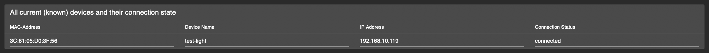

# IoBroker.esphome
[](https://weblate.iobroker.net/engage/adapters/?utm_source=widget)

**Тесты:** 

**Этот адаптер использует библиотеки Sentry для автоматического сообщения разработчикам об исключениях и ошибках кода.** Более подробную информацию и информацию о том, как отключить отчеты об ошибках, см. в [Документация по плагину Sentry](https://github.com/ioBroker/plugin-sentry#plugin-sentry)! Отчеты Sentry используются, начиная с js-controller 3.0.

## Адаптер ESPHome для ioBroker
Управляйте своим ESP8266/ESP32 с помощью простых, но мощных файлов конфигурации, созданных и управляемых ESPHome.
Встроенная интеграция управляемого устройства ESPHome (включая панель управления) с помощью его собственного API и обеспечивает синхронизацию всех данных (обработка событий в реальном времени, без опроса данных! :)


Этот адаптер использует [esphome-native-api](https://github.com/Nafaya/esphome-native-api#readme) со всеми кредитами @Nafaya для взаимодействия с [ESPHome API](https://esphome.io/components/api.html?highlight=api)!

## [Документация](https://DrozmotiX.github.io/languages/en/Adapter/ESPHome/)

## [Документация](https://DrozmotiX.github.io/languages/en/Adapter/ESPHome/)
Всю документацию по нашему адаптеру можно найти по адресу [Страница документации DrozmotiX](https://DrozmotiX.github.io/languages/en/Adapter/ESPHome/) -->

## Предпосылки
* NodeJS >= 18.x
* API активирован в YAML
* Для вкладок администратора (необязательно)
* IP-адрес панели управления ESPHome указан в настройках экземпляра

## Использование встроенной панели инструментов ESPHome
Вы можете использовать внешнюю установку ESPHome (например, docker) или активировать процесс ESPHome Dashboard, включенный в этот адаптер.
В любом случае, можно интегрировать панель управления в интерфейс администратора ioBroker, для этого необходимо указать IP-адрес, на котором запущена панель управления


### Использование HTTPS
Одной из причин использования HTTPS является возможность напрямую прошивать устройства, подключенные к вашему ПК, поскольку esphome не позволит этого сделать с http (вероятно, из-за ограничений браузера с WebSerial).


Использование интегрированной панели управления, когда iobroker использует https, в настоящее время требует выполнения некоторых дополнительных шагов:

1. установите (если у вас его еще нет) веб-адаптер и настройте https. Для получения дополнительной информации см. веб-документацию: [ioBroker.web](https://github.com/ioBroker/ioBroker.web)
2. установить адаптер [прокси](https://github.com/ioBroker/ioBroker.proxy)
3. настройте путь в настройках прокси-адаптера:
1. контекст: `esphome/`
2. URL-адрес: `http://localhost:6052`


4. Настройте полный URL-адрес панели мониторинга в расширенном разделе настроек адаптера esphome - панель мониторинга esphome:
1. например: `https://<iobrokerIP>:<webAdapterPort>/proxy.0/esphome/`
2. где `<iobrokerIP>` — это IP-адрес хоста, на котором запущен ваш iobroker (то же самое, что и выше)
3. и `<webAdapterPort>` - это порт веб-адаптера (по умолчанию 8082)
4. это должно выглядеть примерно так:

   

5. Если вы запускаете панель управления на внешнем хосте, вы также можете использовать URL-адрес внешнего экземпляра панели управления здесь

## Как использовать этот адаптер
### Активировать API в YAML
> [!ВАЖНО] > ioBroker ESPHome позволяет интегрировать устройства с помощью ключа шифрования (рекомендуется) или пароля API (устаревшая версия), > необходимо указать соответствующие настройки аутентификации, > см. [Документация ESPHome](https://esphome.io/components/api.html?highlight=api) > Пожалуйста, настройте только ключ шифрования (предпочтительно) или пароль API (устаревшая версия)

#### Пример записи конфигурации ключа шифрования
```
api:
  encryption:
    key: "DyDfEgDzmA9GlK6ZuLkj3qgFcjXiZUzUf4chnIcjQto="
```

#### Пример записи конфигурации API
```
api:
  password: 'MyPassword'
```

### Добавить/Изменить/Удалить устройства ESPHome в ioBroker
> [!ВАЖНО] > Этот адаптер интегрирует связь с устройствами, совместимыми с ESPHome, и > (если активирована) интегрированную версию панели инструментов ESPHome.
> Вы должны настроить и загрузить конфигурацию ESP самостоятельно, > используя интегрированную панель инструментов или внешнюю альтернативу > (например, Docker), прежде чем их можно будет интегрировать в ioBroker

На вкладке «Устройства» будут показаны все известные на данный момент устройства; вы можете либо дождаться автоматического обнаружения устройств (в настоящее время отключено, см. #175), либо добавить их вручную, указав их IP-адрес и учетные данные.


> [!ПРИМЕЧАНИЕ] > Кнопки для добавления/изменения/удаления устройств и загрузки таблицы устройств доступны только если адаптер запущен! > Необходимо обновить таблицу устройств вручную, нажав «Обновить обзор устройств», будут показаны все устройства и состояние их подключения

Введите IP-адрес (если устройство уже известно, вы можете выбрать его из выпадающего списка) и выберите соответствующие действия:

- ДОБАВИТЬ/Изменить устройства
- Отправит IP-адрес и учетные данные на бэкэнд и попытается установить соединение.
- Если предоставлен ключ шифрования, API-пароль игнорируется. Убедитесь, что конфигурация YAML правильная!

- Удалить устройство
- Отправит сообщение на бэкэнд для удаления этого устройства

> [!ВНИМАНИЕ] > Это действие удалит выбранное устройство и все связанные с ним состояния из ioBroker!

> [!ПРИМЕЧАНИЕ] > После добавления устройства появится сообщение об успешном или ошибочном завершении. > Вы можете обновить таблицу, чтобы отобразить текущие устройства и статус их подключения.

 

Если подключение прошло успешно, устройство будет инициировано, и все связанные состояния будут созданы для управления их атрибутами.
При внесении любых изменений в конфигурацию YAML перезагрузка ESP отключит и инициирует новое соединение.
Во время этого процесса состояния, которые больше не являются частью конфигурации YAML, будут автоматически удалены.


### Пример конфигурации
Пример конфигурации, больше примеров см. в [Страница документации DrozmotiX](https://DrozmotiX.github.io) или [документация ESPHome](https://esphome.io/index.html)

<details><summary>Показать пример конфигурации</summary>

esphome: имя: sensor_badkamer платформа: ESP32 плата: esp-wrover-kit

wifi: use_address: 192.168.10.122 ssid: "xxxxxx" пароль: "xxxxxx"

# Включить API ESPHome
api: пароль: 'MyPassword'

# Активировать шину i2c i2c: sda: 21 scl: 22 scan: True id: bus_a
# Пример конфигурации для bh1750
датчик:

- платформа: bh1750

имя: "Hal_Illuminance" адрес: 0x23 время_измерения: 69 интервал_обновления: 10 с

# Пример конфигурации для выхода GPIO
    выход:

- платформа: gpio

пин: 12 инвертированный: истинный идентификатор: gpio_12

# Пример конфигурации, связывающей коммутатор с ранее определенным выходом
    выключатель:

- платформа: выход

имя: "Универсальный вывод" вывод: 'gpio_12' </details>

## Tasmota / ESPEлегкая миграция
Миграция с предыдущих установок Sonoff Tasmota или ESPEasy очень проста. Вам просто нужно, чтобы ESPHome создал для вас двоичный файл, а затем загрузить его в веб-интерфейс.
Более подробную информацию см. на нашем [Страница документа](https://DrozmotiX.github.io/languages/en/Adapter/ESPHome/06.migration.html)

**_ПРИМЕЧАНИЕ:_** Сгенерированные файлы yaml хранятся в ```/opt/iobroker/iobroker-data/iobroker.esphome.>instance</>device<.yaml

## Поддержите меня
Если вам понравилась моя работа, пожалуйста, рассмотрите возможность личного пожертвования (это личная ссылка для пожертвований для DutchmanNL, не имеющая никакого отношения к проекту ioBroker!) [](http://paypal.me/DutchmanNL)

## Changelog

<!--
    Placeholder for the next version (at the beginning of the line):
    ### __WORK IN PROGRESS__
    * (DutchmanNL) 
-->
### 0.6.1 (2025-05-24)
* (@SimonFischer04) Update esphome
* (@ticaki) Optimize admin configuration interface
* (@DutchmanNL) Optimize backend handling of device discovery
* (@DutchmanNL) Capability to select ESPHome Dashboard version added, resolves #118

### 0.5.0-beta.8 (2023-11-24)
* (DutchmanNL) Capability to automatically detect new devices added
* (DutchmanNL) Ensures a compatible pillow version is used (10.0.1)
* (SimonFischer04) Add pillow python package by default, resolves #188

### 0.5.0-beta.4 (2023-11-15)
* (DutchmanNL) Refactor memory caching of device data, resolves #189

### 0.5.0-beta.1 (2023-11-12)
* (DutchmanNL) Only show error messages once for unreachable devices

### 0.5.0-beta.0 (2023-11-12) - Rebuild Admin Interface & Connection handler
* (DutchmanNL) Admin interface redesigned to JSON-Config relates #171
* (DutchmanNL) Backend massages implemented to Add/Modify/Delete devices
* (DutchmanNL) Device connection handling and visibility of devices improved
* (DutchmanNL) Auto device discovery temporary disabled due to external bug, relates #175
* (DutchmanNL) Possibility added to exclude IP-Addresses from device discovery, relates #175
* (DutchmanNL) Allow Selection to listen on specific interface or all for device discovery resolves #67
* (DutchmanNL) State implemented to show current connection status (unreachable/disconnected/connected) to improve management of devices
* (DutchmanNL) Several bugfixes, resolves #181 resolves #

## License
MIT License

Copyright (c) 2023-2025 DutchmanNL <rdrozda86@gmail.com>

Permission is hereby granted, free of charge, to any person obtaining a copy
of this software and associated documentation files (the "Software"), to deal
in the Software without restriction, including without limitation the rights
to use, copy, modify, merge, publish, distribute, sublicense, and/or sell
copies of the Software, and to permit persons to whom the Software is
furnished to do so, subject to the following conditions:

The above copyright notice and this permission notice shall be included in all
copies or substantial portions of the Software.

THE SOFTWARE IS PROVIDED "AS IS", WITHOUT WARRANTY OF ANY KIND, EXPRESS OR
IMPLIED, INCLUDING BUT NOT LIMITED TO THE WARRANTIES OF MERCHANTABILITY,
FITNESS FOR A PARTICULAR PURPOSE AND NONINFRINGEMENT. IN NO EVENT SHALL THE
AUTHORS OR COPYRIGHT HOLDERS BE LIABLE FOR ANY CLAIM, DAMAGES OR OTHER
LIABILITY, WHETHER IN AN ACTION OF CONTRACT, TORT OR OTHERWISE, ARISING FROM,
OUT OF OR IN CONNECTION WITH THE SOFTWARE OR THE USE OR OTHER DEALINGS IN THE
SOFTWARE.