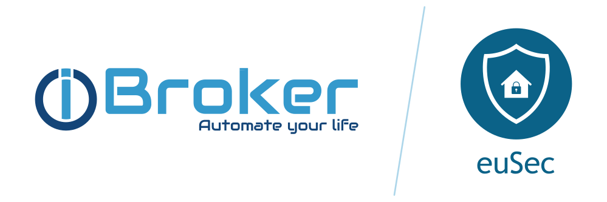

# IoBroker.euSec
**Тесты:** 

Это библиотека [ioBroker](https://www.iobroker.net) адаптер, который использует [eufy-security-client](https://github.com/bropat/eufy-security-client) для взаимодействия с устройствами Eufy.

**Этот проект не связан с Anker и Eufy (Eufy Security). Это мой личный проект, который я поддерживаю в свободное время.**

## Описание
Этот адаптер позволяет управлять [Устройства безопасности Eufy](https://us.eufylife.com/collections/security) путем подключения к облачным серверам Eufy и локальным/удалённым станциям.

Вам необходимо предоставить учётные данные для входа в облако. Адаптер подключается к вашей учётной записи в облаке и опрашивает все данные устройств по протоколу HTTPS. Теперь также поддерживается локальное или удалённое P2P-подключение к станциям/устройствам Eufy. Однако подключение к облаку Eufy всегда является обязательным условием.

Один экземпляр адаптера будет отображать все устройства из одной учетной записи Eufy Cloud и позволит управлять ими.

## Документация
Ознакомьтесь с документацией [здесь](https://iobroker-community-adapters.github.io/ioBroker.eusec/).

## Известные рабочие устройства
Информацию о поддерживаемых устройствах можно найти [здесь](https://github.com/bropat/eufy-security-client#known-working-devices).

## Кредиты
Создание этого адаптера было бы невозможно без выдающейся работы Патрика Броэтто (brobat) <https://github.com/bropat>, создавшего предыдущие версии этого адаптера.

## ВАЖНАЯ информация при обновлении до node.js 22
Адаптер 2.0.3 и более новые версии поддерживают node.js 22. Предыдущие версии node.js требуют специальной настройки, которая стала недействительной с node.js 22. Поэтому при обновлении node.js с любой версии ниже 22.x.x до node.js 22 выполните следующие действия:

- Если у вас установлен node.js < 22 и адаптер < 2.0.0, сначала обновите node.js, а затем установите адаптер 2.0.3.
- Если у вас установлен адаптер версии >= 2.0.0 с любым релизом узла ниже 22, ОБЯЗАТЕЛЬНО переустановите адаптер. Подробное описание (на немецком языке) доступно на нашем форуме (https://forum.iobroker.net/topic/82651/test-adapter-eusec-v2-0-x).

## Changelog

<!--
	Placeholder for the next version (at the beginning of the line):
	### **WORK IN PROGRESS**
-->
### 2.0.3 (2025-10-26)
- (mcm1957) Remove fix for CVE-2023-46809 for node.js 22 and newer

### 2.0.0 (2025-10-26)

- (mcm1957) Adapter has been migrated to iobroker-community-adapters organisation
- (mcm1957) Adapter requires node.js >= 20, js-controller >= 6.0.11 and admin >= 7.6.17 now
- (mcm1957) Dependencies have been updated

### 1.3.3 (2024-09-28)

* (bropat) Updated version of the package eufy-security-client (3.1.1)
* (bropat) Further details can be found in the changelog of eufy-security-client (3.1.1)

### 1.3.2 (2024-09-10)

* (bropat) Fixed issue #440

### 1.3.1 (2024-09-08)

* (bropat) Fixed issue #436
* (bropat) Fixed issue #439

## License

MIT License

Copyright (c) 2025 iobroker-community-adapters <iobroker-community-adapters@gmx.de>  
Copyright (c) 2020-2024 bropat <patrick.broetto@gmail.com>

Permission is hereby granted, free of charge, to any person obtaining a copy
of this software and associated documentation files (the "Software"), to deal
in the Software without restriction, including without limitation the rights
to use, copy, modify, merge, publish, distribute, sublicense, and/or sell
copies of the Software, and to permit persons to whom the Software is
furnished to do so, subject to the following conditions:

The above copyright notice and this permission notice shall be included in all
copies or substantial portions of the Software.

THE SOFTWARE IS PROVIDED "AS IS", WITHOUT WARRANTY OF ANY KIND, EXPRESS OR
IMPLIED, INCLUDING BUT NOT LIMITED TO THE WARRANTIES OF MERCHANTABILITY,
FITNESS FOR A PARTICULAR PURPOSE AND NONINFRINGEMENT. IN NO EVENT SHALL THE
AUTHORS OR COPYRIGHT HOLDERS BE LIABLE FOR ANY CLAIM, DAMAGES OR OTHER
LIABILITY, WHETHER IN AN ACTION OF CONTRACT, TORT OR OTHERWISE, ARISING FROM,
OUT OF OR IN CONNECTION WITH THE SOFTWARE OR THE USE OR OTHER DEALINGS IN THE
SOFTWARE.