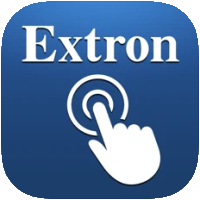

# ioBroker.extron

## Ссылки

Extron®, CrossPoint®, DTP®, NetPA®, XPA®, XTP® являются зарегистрированными товарными знаками компании RGB Systems, Incorporated.\
&#x20;См. [www.extron.com](https://www.extron.com/article/termsprivacy)

Логотип взят из приложения Extron Control от компании Extron.

Dante® — товарный знак компании [Audinate.](https://www.audinate.com/)

## Адаптер Extron для ioBroker

Адаптер Extron SIS

Управление устройствами Extron. Этот адаптер предназначен для управления некоторыми аудио- и видеопродуктами Extron с помощью протокола **Simple** **Instruction** Set **(IOBROK** ). Функциональный диапазон устройств огромен. Не все функции целесообразно поддерживать с помощью этого адаптера и взаимодействия с iobroker.

**Обратите внимание:** если тип устройства выбран в настройках адаптера, изменить его в будущем будет невозможно!

В одной установке iobroker может быть несколько экземпляров этого адаптера разных или одинаковых типов. Для будущих версий необходимо добавить действующую лицензию в конфигурацию адаптера для каждого экземпляра. Если вы являетесь некоммерческой организацией или используете его в личных целях, вы можете получить лицензию бесплатно. Пожалуйста, свяжитесь с автором.

### Поддерживаемые устройства

- Матричный коммутатор презентаций 8x2 (DTP2 CrossPoint 82)
- Медиаплеер и декодер H.264 (SMD 202)
- Кодировщик потокового мультимедиа (SME 211)
- 6x4 ProDSP процессор с AEC и Dante (DMP 64 Plus C AT)
- 12x8 ProDSP процессор с Dante (DMP 128 Plus AT)
- 12x8 ProDSP процессор с AEC, VoIP и Dante (DMP 128 Plus CV AT)
- Аудиопроцессор Dante Audio Matrix с функцией AEC (XMP 240 C AT)

## Список дел

- Тип устройства проверяется в начале разговора. Иногда это не удается. Необходимо заменить этот механизм на более надежный.
- Для уменьшения размера базы данных на устройствах цифровой обработки сигналов (DSP) используйте более точный выбор используемых входных и выходных сигналов.
- Добавить больше команд и их реализацию на стороне базы данных.
- улучшить механизм переподключения сети

## Changelog

<!--
    Placeholder for the next version (at the beginning of the line):
    ### **WORK IN PROGRESS**
-->

### **WORK IN PROGRESS**
- (copilot) Adapter requires node.js >= 22 now
- (Bannsaenger) updated dependencies and issues from repository checker

### 0.3.0 (2025-10-28)

- (Bannsaenger) updated dependencies and issues from repository checker
- (Bannsaenger) migrate to NPM Trusted Publishing
- (Bannsaenger) updated to adapter-dev and release script
- (Bannsaenger) introducing jsonConfig
- (mschlgl) add more DSP SIS commands
- (mschlgl) enhanced network reconnect functionality, added DANTE remote commands, additional devices
- (Bannsaenger) updated dependencies and issues from repository checker

### 0.2.15 (2024-06-12)

- (mschlgl) fixed typo in io-package.json

### 0.2.14 (2024-06-10)

- (mschlgl) changed function createDatabase to use setObj()

### 0.2.13 (2024-06-06)

- (mschlgl) corrected instance.comon.titleLang to be set at startup, updated role definitions, added audiofile transfer functionality for DMPxxx

### 0.2.12

- (mschlgl) added instance.comon.title / .titleLang to be set at startup

[Older changelogs can be found there](https://github.com/Bannsaenger/ioBroker.extron/blob/master/CHANGELOG_OLD.md)

## License

Attribution-NonCommercial 4.0 International (CC BY-NC 4.0)

Copyright (c) 2021-2026 Bannsaenger, https://github.com/bannsaenger <bannsaenger@gmx.de>

This work is licensed under a Creative Commons Attribution-NonCommercial 4.0 International License
http://creativecommons.org/licenses/by-nc/4.0/

Short content:
This is a human-readable summary of (and not a substitute for) the license. Disclaimer.
You are free to:

Share — copy and redistribute the material in any medium or format
Adapt — remix, transform, and build upon the material

The licensor cannot revoke these freedoms as long as you follow the license terms.

Under the following terms:

Attribution — You must give appropriate credit, provide a link to the license, and indicate if changes were made. You may do so in any reasonable manner, but not in any way that suggests the licensor endorses you or your use.

NonCommercial — You may not use the material for commercial purposes.

No additional restrictions — You may not apply legal terms or technological measures that legally restrict others from doing anything the license permits.

The above copyright notice and this permission notice shall be included in
all copies or substantial portions of the Software.

THE SOFTWARE IS PROVIDED "AS IS", WITHOUT WARRANTY OF ANY KIND, EXPRESS OR
IMPLIED, INCLUDING BUT NOT LIMITED TO THE WARRANTIES OF MERCHANTABILITY,
FITNESS FOR A PARTICULAR PURPOSE AND NONINFRINGEMENT. IN NO EVENT SHALL THE
AUTHORS OR COPYRIGHT HOLDERS BE LIABLE FOR ANY CLAIM, DAMAGES OR OTHER
LIABILITY, WHETHER IN AN ACTION OF CONTRACT, TORT OR OTHERWISE, ARISING FROM,
OUT OF OR IN CONNECTION WITH THE SOFTWARE OR THE USE OR OTHER DEALINGS IN
THE SOFTWARE.