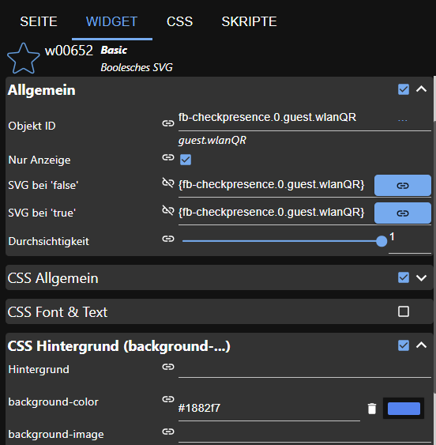

# IoBroker.fb-checkpresence
**Тесты:** 

## Адаптер fb-checkpresence для ioBroker
Адаптер проверяет присутствие членов семьи над фритцбоксом.
Необходимо указать имя члена семьи и mac-адрес (или ip-адрес) используемого устройства.
Комментарий не является обязательным, и вы можете включить или отключить члена семьи.
Точка данных основана на имени элемента.

### Использован открытый исходный код
#### Формат даты npm v4.5.3
(c) 2007–2009 Стивен Левитан <stevenlevithan.com> npm: https://www.npmjs.com/package/dateformat github: https://github.com/felixge/node-dateformat лицензия: MIT

### Предварительные условия адаптера
Для корректной работы необходимо установить адаптер истории. Вы можете выбрать один из следующих адаптеров:

* История
* SQL
* ИнфлюксБД

## Используемое устройство
Для этого адаптера используется AVM Fritzbox. Здесь вы можете найти информацию о Fritzbox https://avm.de/produkte/fritzbox/.
Службы fritzbox используются по протоколу TR-064.

### Условия Фрицбокса
Используемый интерфейс TR-064 от fritzbox описан здесь: https://avm.de/service/schnittstellen/.
Используются следующие услуги и действия TR-064:

* Хосты: 1 — X_AVM-DE_GetHostListPath (поддерживается с 9 января 2017 г.)
* Хосты: 1 — X_AVM-DE_GetMeshListPath
* Хосты:1 — GetSpecificHostEntry
* Хосты: 1 — X_AVM-DE_GetSpecificHostEntryByIP (поддерживается с 18 мая 2016 г.)
* DeviceInfo:1 — GetSecurityPort
* Информация об устройстве: 1 — Получить информацию
* WANPPPConnection:1 — GetInfo
* WANIPConnection:1 — GetInfo
* WLANConfiguration3 — SetEnable
* Конфигурация WLAN3 — GetInfo
* WLANConfiguration3 — GetSecurityKeys
* X_AVM-DE_HostFilter — DisallowWANAccessByIP
* X_AVM-DE_HostFilter — GetWANAccessByIP
* DeviceConfig:1 — перезагрузка
* LANConfigSecurity1 — X_AVM-DE_GetCurrentUser

По умолчанию интерфейс TR-064 не активирован. Однако это можно легко изменить через веб-интерфейс FritzBox. Для этого войдите в свой FritzBox и убедитесь, что экспертный вид активирован.
Затем ниже «Домашняя сеть »Обзор домашней сети» Настройки сети вы найдете пункт «Разрешить доступ приложениям». Там вам нужно активировать флажок, а затем один раз перезапустить FritzBox.

Подсказка: после изменения параметров не забудьте перезапустить Fritzbox!

## Диалоговое окно конфигурации
### Общий
Значения конфигурации проверяются, и могут быть сохранены только правильные значения. В противном случае кнопка сохранения будет неактивна.

### IP-адрес, пользователь и пароль Fritzbox
Настройка IP-адреса, пользователя и пароля необходима для получения данных устройства из fritzbox.
Поэтому пользователя необходимо создать в fritzbox. Это требуется для более новой версии прошивки (>= 7.25) fritzbox. Информацию см. здесь: https://avm.de/fileadmin/user_upload/Global/Service/Schnittstellen/Empfehlungen%20zur%20Benutzerfu%CC%88hrung%20bei%20der%20Anmeldung%20an%20einer%20FRITZ%21Box_v1.1.pdf Пароль зашифрован и не был сохранен в виде открытого текста. Имя пользователя и пароль могут содержать максимум 32 символа. См. информацию: https://service.avm.de/help/de/FRITZ-Box-Fon-WLAN-7490/014/hilfe_zeichen_fuer_kennwoerter#:~:text=Namen%20f%C3%BCr%20Benutzer,Kennwortfeld%20darf. %20nicht%20leer%20sein.
Подсказка: в некоторых случаях fritzbox мог заблокировать пользователя, если пароль был введен неправильно.
Часто в журнале появляется сообщение о тайм-ауте. Пожалуйста, проверьте, правильно ли вы ввели имя пользователя и пароль. Затем вам придется перезагрузить fritzbox.

### SSL-опция
В некоторых случаях адаптер не мог подключиться к fritzbox. Может помочь отключение этой опции.
В этом случае адаптер пытается подключиться без https.

### Интервал
У вас есть отдельные интервалы для членов семьи и устройств Fritzbox.
Интервал для устройств Fritzbox можно настроить от 10 до 3600 с. Обычно значение от 60 до 300 секунд является оптимальным интервалом для чтения данных fritzbox. Члены семьи могут быть настроены от 10 до 600. Каждый новый цикл начинается, если предыдущий цикл завершен.

### Время фильтра
Если время фильтрации больше 0 с, состояние члена семейства проверяется дважды (после времени фильтрации), если состояние меняется на ложное. Если состояние истинно, состояние устанавливается немедленно.

### Адаптер истории
Через адаптер истории вычисляются некоторые значения. Вы можете выбрать, будет ли использоваться для этих вычислений история, адаптер sql или influxdb. Адаптер истории должен быть установлен предварительно, а затем его можно выбрать в диалоговом окне конфигурации.
Если конфигурация истории отключена, то расчет некоторых значений не может быть реализован.

### Формат даты
Параметры маски формата даты описаны на этой веб-странице: https://www.npmjs.com/package/dateformat.
Маска формата используется для форматирования объектов таблиц html и json.

###Создание устройств ФБ
Если эта опция отмечена, объекты для каждого устройства в списке устройств Fritzbox создаются.
Если эта опция отключена, то информация о сетке также отключается.

### Ресинхронизация объектов устройств FB
Если эта опция отмечена, то объект устройства FB повторно синхронизируется со списком устройств из Fritzbox.

### Создание информации о сетке
Эту опцию можно проверить, если разрешено создание устройств FB. Если эта опция отмечена, создаются объекты сетки для каждого устройства в списке устройств Fritzbox.

### Информация о госте
Если эта опция отмечена, создаются состояния для гостей.

### Генерация qr-кода
Если эта опция отмечена, генерируется qr-код из гостевой сети WLAN. Вы можете показать этот QR-код в своей VIS с помощью виджета «Basic Boolesches SVG». Пожалуйста, используйте следующие настройки:

### Настройки членов семьи
Для настроенного члена семьи вам необходимо ввести имя члена, имя хоста, Mac- и IP-адрес, комментарий, и вы можете включить или отключить этого члена. Группа не является обязательной.
Если вы оставите группу пустой и установите для флага совместимости значение true, поведение будет аналогично более старой версии адаптера. Вы можете использовать состояние присутствия члена семьи или состояние, непосредственно сопоставленное с именем члена семьи. В будущей версии вы должны будете использовать состояние присутствия. Это поведение можно включить/отключить с помощью флажка совместимости: -> совместимость = true: поведение старой версии с пустой группой.
-> совместимость = true и группа не пуста: новое поведение. Все штаты в папке «члены семьи».
-> совместимость = false: новое поведение. Все штаты в папке «члены семьи».

Для каждого участника адаптер создает состояние присутствия и проверяет, присутствует ли этот участник или отсутствует. Состояние менялось, если менялось состояние присутствия.
Вы также можете включить фильтрацию для участника. Если состояние истинно, оно немедленно меняется на истинное. Если оно ложно, значение будет проверено снова по истечении времени фильтрации.
Если в обоих случаях состояние ложно, оно меняется на ложное. В противном случае оно не меняется.

Чтобы получить информацию о скорости в объектах, вам необходимо выбрать опцию fb-devices.

### Вручную активировать присутствие
В javascript вы можете активировать присутствие вручную. При отправке сообщения адаптеру каждое новое сообщение блокируется на 10 секунд. Вы получите отрицательный результат (ложь), если сообщение заблокировано.
True, если сообщение получено от адаптера.
` sendTo('fb-checkpresence.0', 'triggerPresence', {}, function (result) { log(result, 'info'); }); `

### Настройки белого списка
В белый список можно внести каждое известное устройство. Все неизвестные устройства заносятся в объект черного списка.
Если вы установите флажок в заголовке таблицы, будут выбраны все устройства.

## Функции
### Проверка поддержки AVM
Функция проверяет доступность используемых функций fritzbox. Доступность регистрируется как информация. Если у вас возникли проблемы, проверьте, все ли функции установлены на true. Также для пользователя проверяются права доступа, и для этой функции устанавливается значение «ложь», если права доступа неверны.

### Включить/выключить гостевую WLAN
В папке «Гость» вы можете установить для состояния WLAN значение «истина» или «ложь», а затем гостевая сеть WLAN будет включаться или выключаться.

### QR-код гостевой беспроводной сети
QR-код гостевой сети сохраняется в состоянии wlanQR в гостевой папке. QR-код может отображаться в базовом виджете Bool SVG.

### Включение/выключение доступа в Интернет устройств Fritzbox
В папке FB-devices вы можете установить для отключенного состояния значение true или false, и доступ этого устройства в Интернет будет заблокирован в Fritzbox.

### Получить гостей, черный список
В этой функции проверяется, вошел ли какой-либо пользователь в качестве гостя. Также проверяется, нет ли какого-либо устройства в белом списке.
Это устройство добавлено в черный список.

### Будьте активны
Для каждого члена семьи сведения о присутствии, дате прихода и ухода, а также ряд других данных рассчитываются и сохраняются в объекте-члене, если выбран адаптер истории.

### Номер хоста, активные устройства
Количество устройств и количество активных можно получить из fritzbox.

## Объекты
### Наличие объектаВсе
Если присутствуют все члены семьи, то объект верен.

### Наличие объекта
Если присутствует один член семьи, то объект истинен.

### Объектные устройства
Это все перечисленные устройства во fritzbox.

### Объект activeDevices
Это количество всех активных устройств во fritzbox.

### Объект html, json
Эти объекты представляют собой таблицы (json и html) с информацией о приходе и уходе всех членов семьи.

### Информация об объекте
Здесь указана информация о последнем обновлении и состоянии подключения адаптера.

### Объект гость
Здесь указана информация о количестве активных гостей и табличных объектах с информацией об устройстве.

### Черный список объектов
Здесь указана информация о количестве неизвестных устройств и табличных объектах с информацией о неизвестных устройствах.

### Объектmember.present
Здесь вы найдете информацию о присутствии участника на текущий день и как долго у участника был статус true с момента последнего изменения.

### Объектmember.absent
Здесь вы найдете информацию об отсутствии участника на текущий день и о том, как давно у участника был статус ложный с момента последнего изменения.

### Объектmember.comming,member.going
Здесь вы найдете информацию, когда член семьи приезжает или уходит из дома.

### Объектmember.history,member.historyHtml
Здесь вы найдете информацию об истории сегодняшнего дня.

## Changelog
### **WORK IN PROGRESS**
* (afuerhoff) new filter function implemented
* (afuerhoff) node >=18
* (afuerhoff) dependencies updated

### 1.2.4 (2024-02-09)
* (afuerhoff) test code deleted [#257](https://github.com/afuerhoff/ioBroker.fb-checkpresence/issues/257)
* (afuerhoff) dependencies updated

### 1.2.3 (2024-01-18)
* (afuerhoff) Readme updated
* (afuerhoff) function jsontables optimized
* (afuerhoff) non existent members set to false [#253](https://github.com/afuerhoff/ioBroker.fb-checkpresence/issues/253)
* (afuerhoff) optimization of log message [#240](https://github.com/afuerhoff/ioBroker.fb-checkpresence/issues/240)

### 1.2.2 (2023-07-28)
* (afuerhoff) bug fixed json tables [#215](https://github.com/afuerhoff/ioBroker.fb-checkpresence/issues/215)
* (afuerhoff) link feature optimized. See #206

### 1.2.1 (2023-07-14)
* (afuerhoff) bug fixed property link

### 1.2.0 (2023-07-13)
* (afuerhoff) dependencies updated
* (afuerhoff) mesh link added to family members [#206](https://github.com/afuerhoff/ioBroker.fb-checkpresence/issues/206)

## License
MIT License

Copyright (c) 2019-2024 Achim Fürhoff <achim.fuerhoff@outlook.de>

Permission is hereby granted, free of charge, to any person obtaining a copy
of this software and associated documentation files (the "Software"), to deal
in the Software without restriction, including without limitation the rights
to use, copy, modify, merge, publish, distribute, sublicense, and/or sell
copies of the Software, and to permit persons to whom the Software is
furnished to do so, subject to the following conditions:

The above copyright notice and this permission notice shall be included in all
copies or substantial portions of the Software.

THE SOFTWARE IS PROVIDED "AS IS", WITHOUT WARRANTY OF ANY KIND, EXPRESS OR
IMPLIED, INCLUDING BUT NOT LIMITED TO THE WARRANTIES OF MERCHANTABILITY,
FITNESS FOR A PARTICULAR PURPOSE AND NONINFRINGEMENT. IN NO EVENT SHALL THE
AUTHORS OR COPYRIGHT HOLDERS BE LIABLE FOR ANY CLAIM, DAMAGES OR OTHER
LIABILITY, WHETHER IN AN ACTION OF CONTRACT, TORT OR OTHERWISE, ARISING FROM,
OUT OF OR IN CONNECTION WITH THE SOFTWARE OR THE USE OR OTHER DEALINGS IN THE
SOFTWARE.
