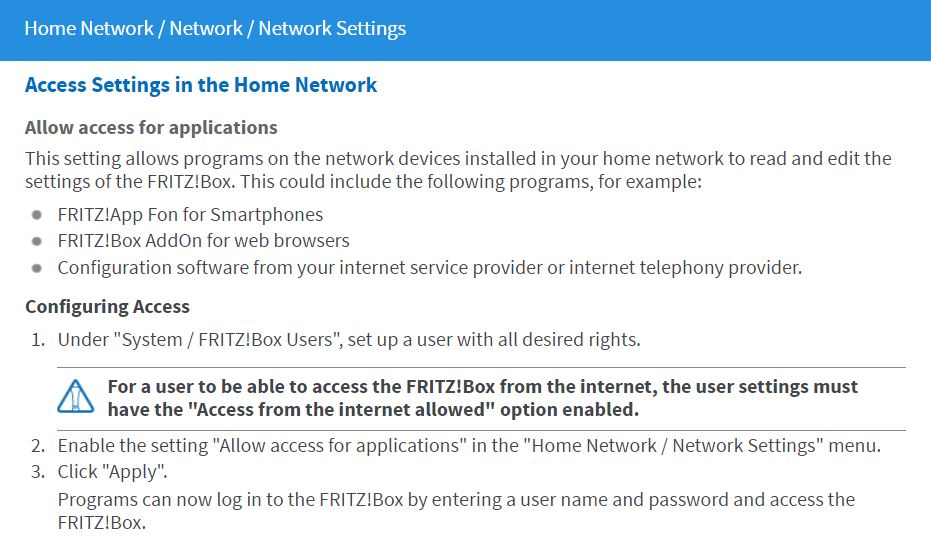
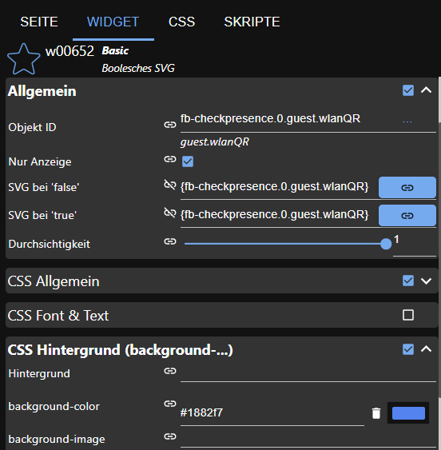

# IoBroker.fb-checkpresence
**Тесты:** 

## Адаптер fb-checkpresence для ioBroker
Адаптер проверяет наличие членов семьи через Fritzbox.
Необходимо указать имя члена семьи и MAC-адрес (или IP-адрес) используемого устройства.
Комментарий необязателен, и вы можете включить или отключить члена семьи.
Данные основаны на имени члена семьи.

### Использован открытый исходный код
#### Npm dateformat v4.5.3
(c) 2007-2009 Стивен Левитан <stevenlevithan.com> npm: https://www.npmjs.com/package/dateformat github: https://github.com/felixge/node-dateformat лицензия: MIT

### Предварительные условия адаптера
Для корректной работы необходимо установить адаптер истории. Вы можете выбрать один из следующих адаптеров:

* История
* SQL
* InfluxDB

## Использованное устройство
Для этого адаптера используется AVM Fritzbox. Информацию о Fritzbox можно найти здесь: https://avm.de/produkte/fritzbox/.
Сервисы Fritzbox работают по протоколу TR-064.

### Условия Fritzbox
Используемый интерфейс TR-064 из Fritzbox описан здесь: https://avm.de/service/schnittstellen/.
Используются следующие сервисы и действия TR-064:

* Hosts:1 - X_AVM-DE_GetHostListPath (поддерживается с 09.01.2017)
* Hosts:1 - X_AVM-DE_GetMeshListPath
* Hosts:1 - GetSpecificHostEntry
* Hosts:1 - X_AVM-DE_GetSpecificHostEntryByIP (поддерживается с 18.05.2016)
* DeviceInfo:1 - GetSecurityPort
* DeviceInfo:1 - GetInfo
* WANPPPConnection:1 - GetInfo
* WANIPConnection:1 - GetInfo
* WLANConfiguration3 - SetEnable
* WLANConfiguration3 - GetInfo
* WLANConfiguration3 - GetSecurityKeys
* X_AVM-DE_HostFilter - DisallowWANAccessByIP
* X_AVM-DE_HostFilter - GetWANAccessByIP
* DeviceConfig:1 - Перезагрузка
* LANConfigSecurity1 — X_AVM-DE_GetCurrentUser

По умолчанию интерфейс TR-064 не активирован. Однако это легко изменить через веб-интерфейс FritzBox. Для этого войдите в свою систему FritzBox и убедитесь, что активирован экспертный режим.
Затем вы найдете в разделе «Домашняя сеть » Обзор домашней сети » Настройки сети» пункт «Разрешить доступ для приложений». Там вам нужно установить флажок, а затем перезагрузить FritzBox.

Подсказка: После изменения параметров не забудьте перезагрузить Fritzbox!

## Диалог конфигурации
### Общий
Значения конфигурации проверяются, и сохраняться могут только корректные значения. В противном случае кнопка сохранения становится недоступной.

### IP-адрес, имя пользователя и пароль Fritzbox
Для получения данных об устройстве из Fritzbox необходимо настроить IP-адрес, имя пользователя и пароль.
Поэтому в Fritzbox необходимо создать пользователя. Это требуется для более новых версий прошивки (>= 7.25) Fritzbox. Дополнительную информацию см. здесь: https://avm.de/fileadmin/user_upload/Global/Service/Schnittstellen/Empfehlungen%20zur%20Benutzerfu%CC%88hrung%20bei%20der%20Anmeldung%20an%20einer%20FRITZ%21Box_v1.1.pdf Пароль зашифрован и не сохранен в открытом виде. Имя пользователя и пароль могут содержать максимум 32 символа. См. информацию по ссылке: https://service.avm.de/help/de/FRITZ-Box-Fon-WLAN-7490/014/hilfe_zeichen_fuer_kennwoerter#:~:text=Namen%20f%C3%BCr%20Benutzer,Kennwortfeld%20darf%20nicht%20leer%20sein.

Подсказка: В некоторых случаях Fritzbox может заблокировать пользователя, если пароль был введен неправильно.
Часто в журнале появляется сообщение о тайм-ауте. Пожалуйста, проверьте, правильно ли вы ввели имя пользователя и пароль. Затем перезагрузите Fritzbox.

### Опция SSL
В некоторых случаях адаптер не мог подключиться к Fritzbox. Отключение этой опции может помочь.
В этом случае адаптер пытается подключиться без HTTPS.

Интервал
Для членов семьи и устройств Fritzbox предусмотрены отдельные интервалы.
Интервал для устройств Fritzbox можно настроить от 10 до 3600 секунд. Обычно оптимальным интервалом для считывания данных с Fritzbox является значение от 60 до 300 секунд. Для членов семьи интервал можно настроить от 10 до 600 секунд. Каждый новый цикл начинается, если предыдущий цикл завершен.

### Время фильтрации
Если время фильтрации превышает 0 секунд, состояние члена семьи проверяется дважды (после истечения времени фильтрации): если состояние меняется на false, оно немедленно устанавливается.

### Адаптер истории
С помощью адаптера истории вычисляются некоторые значения. Вы можете выбрать, какой адаптер будет использоваться для этих вычислений: история, SQL или InfluxDB. Адаптер истории необходимо предварительно установить, после чего его можно выбрать в диалоговом окне конфигурации.
Если конфигурация истории отключена, то вычисление некоторых значений не будет выполнено.

### Формат даты
Параметры маски форматирования даты описаны на этой веб-странице: https://www.npmjs.com/package/dateformat.
Маска форматирования используется для форматирования объектов таблиц HTML и JSON.

### Создание устройств FB
Если этот параметр отмечен, создаются объекты для каждого устройства в списке устройств Fritzbox.
Если этот параметр отключен, то информация о сетке также отключается.

### Повторная синхронизация объектов устройства FB (однократно)
Если этот параметр отмечен, то объект устройства FB будет повторно синхронизирован со списком устройств из Fritzbox один раз.

### Повторная синхронизация объектов устройств FB (автоматически)
Если этот параметр отмечен, то объекты устройств Facebook синхронизируются со списком устройств из Fritzbox каждые x дней.

### Создание информации о сетке
Этот параметр можно установить, если разрешено создание устройств Fritzbox. Если этот параметр установлен, создаются сетчатые объекты для каждого устройства в списке устройств Fritzbox.

### Информация для гостей
Если этот параметр отмечен, создаются состояния для гостей.

### Генерация QR-кода
Если этот параметр отмечен, генерируется QR-код из гостевой сети Wi-Fi. Вы можете отобразить этот QR-код в вашем VIS с помощью виджета &quot;Basic Boolesches SVG&quot;. Пожалуйста, используйте следующие настройки:

### Настройки членов семьи
Для настроенного члена семьи необходимо ввести имя члена, имя хоста, MAC- и IP-адрес, комментарий, а также включить или отключить члена. Группа необязательна.
Если оставить поле группы пустым и установить флаг совместимости в значение true, поведение будет аналогично более старой версии адаптера. Вы можете использовать состояние присутствия члена семьи или состояние, напрямую сопоставленное с именем члена семьи. В будущей версии необходимо использовать состояние присутствия. Это поведение можно включать/выключать с помощью флажка совместимости: -> совместимость = true: поведение как в более старой версии с пустой группой.

-> совместимость = true и группа не пустая: новое поведение. Все состояния находятся в папке familymembers.

-> совместимость = false: новое поведение. Все состояния находятся в папке familymembers.

Для каждого участника адаптер создает состояние присутствия и проверяет, присутствует он или отсутствует. Состояние считается измененным, если изменилось состояние присутствия.
Вы также можете включить фильтрацию для участника. Если состояние истинно, оно немедленно меняется на истинное. Если оно ложно, то значение будет проверено снова через время фильтрации.
Если состояние в обоих случаях ложно, то оно меняется на ложное. В противном случае оно не меняется.

Чтобы получить информацию о скорости объектов, необходимо выбрать опцию fb-devices.

### Ручное включение режима присутствия
В JavaScript можно вручную запустить проверку присутствия. При отправке сообщения адаптеру каждое новое сообщение блокируется на 10 секунд. Если сообщение заблокировано, вы получите отрицательный результат (false).

Если сообщение получено от адаптера, результат будет истинным.

`sendTo('fb-checkpresence.0', 'triggerPresence', {} , function (result) { log(result, 'info'); });`

### Настройки белого списка
В белый список можно добавить все известные устройства. Все неизвестные устройства отображаются в объекте черного списка.
Если вы установите флажок в заголовке таблицы, будут выбраны все устройства.

В JavaScript можно отправить элемент в белый список.
Отправленные данные (имя хоста, MAC-адрес) сравниваются со списком устройств Fritzbox. Если запись присутствует, проверяется, сохранена ли она уже в белом списке. В противном случае запись сохраняется в таблице конфигурации белого списка.

sendTo('fb-checkpresence.0', 'addDeviceToWhitelist', { hostname: 'devicename', mac: '00:00:00:00:00:00' } , function (result) { log(result, 'info'); });

## Функции
### Проверка поддержки AVM
Эта функция проверяет доступность используемых функций Fritzbox. Информация о доступности регистрируется в журнале. Если возникнут проблемы, проверьте, установлены ли для всех функций значение «истина». Также проверяются права доступа пользователя, и функция устанавливается в значение «ложь», если права доступа указаны неверно.

### Включение/выключение гостевой беспроводной сети
В папке guest можно установить состояние wlan в значение true или false, после чего гостевая беспроводная сеть будет включаться или выключаться.

### QR-код гостевой беспроводной сети
QR-код гостевой беспроводной сети сохраняется в состоянии wlanQR в папке guest. QR-код может отображаться в виде базового виджета SVG типа Bool.

### Включение/выключение доступа в интернет для устройств Fritzbox
В папке FB-devices можно установить состояние "отключено" на true или false, и тогда доступ этого устройства к интернету будет заблокирован в Fritzbox.

### Привлечение гостей, внесение в черный список
В этой функции проверяется, вошел ли какой-либо пользователь в систему как гость. Также проверяется, отсутствует ли какое-либо устройство в указанном белом списке.
Эти устройства добавляются в черный список.

### Будьте активны
Для каждого члена семьи рассчитываются и сохраняются в объекте участника данные о его присутствии, датах прихода и ухода, а также ряд других сведений, если выбран адаптер истории.

### Номер хоста, активные устройства
Информация о количестве устройств и числе активных устройств поступает из Fritzbox.

## Объекты
### Наличие объекта
Если все члены семьи присутствуют, то утверждение истинно.

### Наличие объекта
Если присутствует хотя бы один член семьи, то утверждение истинно.

### Объектные устройства
Все эти устройства перечислены в Fritzbox.

### Объект activeDevices
Это общее количество всех активных устройств в Fritzbox.

### Объект html, json
Эти объекты представляют собой таблицы (в форматах JSON и HTML), содержащие информацию о прибытии и отъезде всех членов семьи.

### Информация об объекте
Здесь представлена информация о последнем обновлении и состоянии подключения адаптера.

### Гость объекта
Здесь представлена информация о количестве активных гостей и объектах таблиц, содержащих данные об устройстве.

### Черный список объектов
Здесь представлена информация о количестве неизвестных устройств и табличных объектах, содержащих информацию о неизвестных устройствах.

### Член объекта.present
Здесь вы найдете информацию о присутствии участника в текущий день и о том, как долго статус участника оставался «истинным» с момента последнего изменения.

### Объект member.absent
Здесь вы найдете информацию об отсутствии участника в текущий день и о том, как долго участник находится в статусе «ложный» с момента последнего изменения.

### Объект member.comming, member.going
Здесь вы найдете информацию о прибытии или отъезде члена семьи из дома.

### Объект member.history, member.historyHtml
Здесь вы найдете информацию об истории наших дней.

## Changelog
### **WORK IN PROGRESS**
- (copilot) Adapter requires node.js >= 22 now
* (afuerhoff) dependencies updated
* (afuerhoff) dependabot.yml fixed [#358](https://github.com/afuerhoff/ioBroker.fb-checkpresence/issues/358)
* (afuerhoff) new fb-devices sync option integrated
* (afuerhoff) readme updated
* (softwarecrash) PR398 fixes a crash in newfilter mode

### 1.4.2 (2025-10-30)
* (afuerhoff) dependencies updated
* (afuerhoff) package.json issues fixed [#350](https://github.com/afuerhoff/ioBroker.fb-checkpresence/issues/350)
* (afuerhoff) npm security changes
* (afuerhoff) filter time extended to 300s
* (afuerhoff) guest wlan bug fixed [#353](https://github.com/afuerhoff/ioBroker.fb-checkpresence/issues/353)
* (afuerhoff) deprecated functions changed

### 1.4.1 (2025-09-19)
* (afuerhoff) dependencies updated
* (afuerhoff) repository checker & code scanning issues fixed

### 1.4.0 (2025-05-28)
* (afuerhoff) dependencies updated
* (afuerhoff) error handling optimized
* (afuerhoff) enhancement  [#336](https://github.com/afuerhoff/ioBroker.fb-checkpresence/issues/336)
* (afuerhoff) issue [#337](https://github.com/afuerhoff/ioBroker.fb-checkpresence/issues/337)
* (afuerhoff) issue [#335](https://github.com/afuerhoff/ioBroker.fb-checkpresence/issues/335)

### 1.3.1 (2025-03-02)
* (afuerhoff) dependencies updated
* (afuerhoff) bug fixed [#333](https://github.com/afuerhoff/ioBroker.fb-checkpresence/issues/333)
* (afuerhoff) bug fixed [#305](https://github.com/afuerhoff/ioBroker.fb-checkpresence/issues/305)

### 1.3.0 (2025-02-14)
* (afuerhoff) dependencies updated
* (afuerhoff) eslint setup changed
* (afuerhoff) ipv6 ip-address and prefix added

[Older changelogs can be found there](CHANGELOG_OLD.md)

## License
MIT License

Copyright (c) 2019-2026 Achim Fürhoff <achim.fuerhoff@outlook.de>

Permission is hereby granted, free of charge, to any person obtaining a copy
of this software and associated documentation files (the "Software"), to deal
in the Software without restriction, including without limitation the rights
to use, copy, modify, merge, publish, distribute, sublicense, and/or sell
copies of the Software, and to permit persons to whom the Software is
furnished to do so, subject to the following conditions:

The above copyright notice and this permission notice shall be included in all
copies or substantial portions of the Software.

THE SOFTWARE IS PROVIDED "AS IS", WITHOUT WARRANTY OF ANY KIND, EXPRESS OR
IMPLIED, INCLUDING BUT NOT LIMITED TO THE WARRANTIES OF MERCHANTABILITY,
FITNESS FOR A PARTICULAR PURPOSE AND NONINFRINGEMENT. IN NO EVENT SHALL THE
AUTHORS OR COPYRIGHT HOLDERS BE LIABLE FOR ANY CLAIM, DAMAGES OR OTHER
LIABILITY, WHETHER IN AN ACTION OF CONTRACT, TORT OR OTHERWISE, ARISING FROM,
OUT OF OR IN CONNECTION WITH THE SOFTWARE OR THE USE OR OTHER DEALINGS IN THE
SOFTWARE.