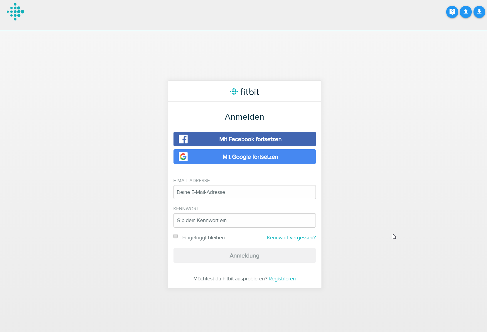
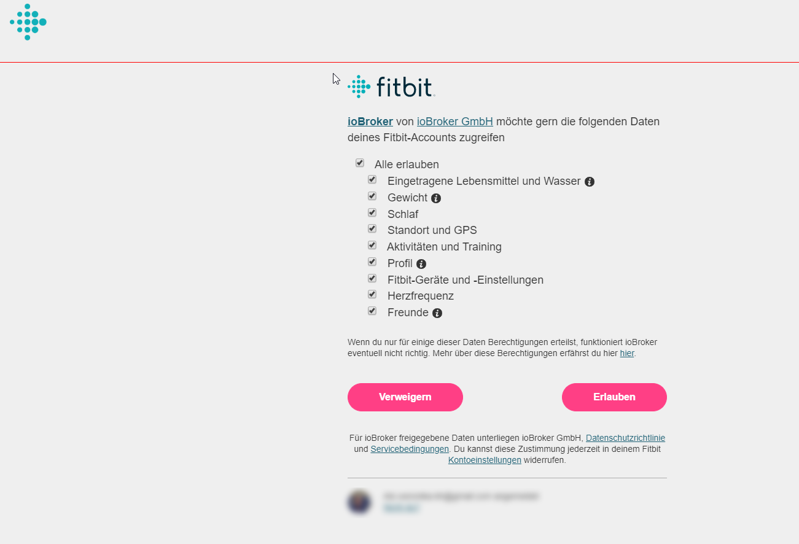

# IoBroker.fitbit
 

**Этот адаптер использует библиотеки Sentry для автоматического сообщения об исключениях и ошибках кода разработчикам.** Дополнительные сведения и информацию о том, как отключить отчеты об ошибках, см. в [Документация по плагину Sentry](https://github.com/ioBroker/plugin-sentry#plugin-sentry)! Отчеты Sentry используются, начиная с js-controller 3.0.

Этот адаптер извлекает данные из API Fitbit!

## Конфигурация

Нажмите кнопку «Авторизовать».

После этого вас могут попросить снова ввести свои учетные данные или, если кеш браузера все еще содержит файлы cookie, это может быть сделано автоматически.

Затем появятся `access token` и `refresh token`. Они доступны только для чтения.

Если этот процесс у вас не работает, вы можете попробовать получить токен доступа вручную: https://dev.fitbit.com/apps/oauthinteractivetutorial

## Несколько пользователей
Чтобы прочитать данные для нескольких пользователей (например, членов семьи), вы должны очистить куки в браузере и создать дополнительный экземпляр этого адаптера.

Важно: Если вы не очистите файлы cookie браузера, вы войдете в систему с последним действительным пользователем.

## Разработка
API был реализован в соответствии с https://dev.fitbit.com/build/reference/web-api/basics/

## Changelog

### 0.1.1 (2019-11-06)
* (bluefox) initial release

## License
The MIT License (MIT)

Copyright 2019-2022, bluefox <dogafox@gmail.com>

Permission is hereby granted, free of charge, to any person obtaining a copy
of this software and associated documentation files (the "Software"), to deal
in the Software without restriction, including without limitation the rights
to use, copy, modify, merge, publish, distribute, sublicense, and/or sell
copies of the Software, and to permit persons to whom the Software is
furnished to do so, subject to the following conditions:

The above copyright notice and this permission notice shall be included in
all copies or substantial portions of the Software.

THE SOFTWARE IS PROVIDED "AS IS", WITHOUT WARRANTY OF ANY KIND, EXPRESS OR
IMPLIED, INCLUDING BUT NOT LIMITED TO THE WARRANTIES OF MERCHANTABILITY,
FITNESS FOR A PARTICULAR PURPOSE AND NONINFRINGEMENT. IN NO EVENT SHALL THE
AUTHORS OR COPYRIGHT HOLDERS BE LIABLE FOR ANY CLAIM, DAMAGES OR OTHER
LIABILITY, WHETHER IN AN ACTION OF CONTRACT, TORT OR OTHERWISE, ARISING FROM,
OUT OF OR IN CONNECTION WITH THE SOFTWARE OR THE USE OR OTHER DEALINGS IN
THE SOFTWARE.