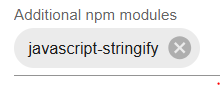

# IoBroker.flexcharts
**Тесты:** 

## Адаптер flexcharts для ioBroker
Раскройте весь потенциал [Apache ECharts](https://echarts.apache.org/en/index.html) в ioBroker — без каких-либо ограничений, накладываемых графическим интерфейсом настройки.

**Этот адаптер предназначен для опытных пользователей.** В нем нет пользовательского интерфейса для настройки графиков. Вы определяете графики полностью в коде (JavaScript или Blockly) или в формате JSON, хранящемся в состоянии ioBroker.

Взгляните на [Демонстрационная галерея ECharts](https://echarts.apache.org/examples/en/index.html), чтобы получить представление о том, что возможно.

Примечание: Адаптер еще не тестировался на MacOS.

## Что нового в версии 0.6.0
В основе flexcharts теперь лежит **Apache ECharts v6.0.0**. Ключевые нововведения:

- Совершенно новая тема оформления по умолчанию
- Передача неограниченного количества пользовательских тем
- Динамическое переключение тем оформления — например, в соответствии с темным режимом системы (`&darkmode=auto`)
- Новые типы диаграмм
- Передавать неограниченное количество функций, управляемых событиями.

> **Темы ECharts v5** по-прежнему доступны через параметр `&themev5`, например: > `http://localhost:8082/flexcharts/echarts.html?source=state&id=flexcharts.0.info.chart1&themev5` > > Apache предлагает светлую тему v5, но нет темной темы v5 — включена пользовательская темная тема v5, основанная на темной теме Apache v5.6.0. Если вы заметите различия, пожалуйста, сообщите об этом.

## Как это работает
Другие адаптеры графиков ioBroker используют пользовательский интерфейс для настройки содержимого и параметров графика, что обычно ограничивает возможности его отображения. flexcharts использует другой подход:

1. Вы определяете диаграмму как объект JSON (переменная `option` в ECharts) — либо хранящийся в состоянии ioBroker, либо возвращаемый из скрипта JavaScript.
2. Flexcharts передает это определение в Apache ECharts в браузере и отображает его.

Пример — столбчатая диаграмма с накоплением, хранящаяся в качестве значения состояния:

```json
{ "tooltip": {"trigger": "axis","axisPointer": {"type": "shadow"}},
  "legend": {},
  "xAxis": [{"type": "category","data": ["Mon","Tue","Wed","Thu","Fri","Sat","Sun"]}],
  "yAxis": [{"type": "value"}],
  "dataZoom": [{"show": true,"start": 0, "end": 100}],
  "series": [
    { "name": "Grid",      "type": "bar", "color": "#a30000", "stack": "Supply",      "data": [8,19,21,50,26,0,36]},
    { "name": "PV",        "type": "bar", "color": "#00a300", "stack": "Supply",      "data": [30,32,20,8,33,21,36]},
    { "name": "Household", "type": "bar", "color": "#0000a3", "stack": "Consumption", "data": [16,12,11,13,14,9,12]},
    { "name": "Heat pump", "type": "bar", "color": "#0000ff", "stack": "Consumption", "data": [22,24,30,20,22,12,25]},
    { "name": "Wallbox",   "type": "bar", "color": "#00a3a3", "stack": "Consumption", "data": [0,15,0,25,23,0,35]}
  ]
}
```

Результат:


## Предварительные условия
Flexcharts работает как веб-расширение. Необходимо установить и запустить [веб-адаптер](https://www.iobroker.net/#en/adapters/adapterref/iobroker.ws/README.md) (`web.0`). В приведенных ниже примерах предполагается использование порта по умолчанию 8082.

## Начиная
### Проверка установки
Откройте этот URL в браузере (замените `localhost` на адрес вашего сервера ioBroker):

`http://localhost:8082/flexcharts/echarts.html?source=state&id=flexcharts.0.info.chart1`

Должна появиться демонстрационная диаграмма. Если это произошло, значит, адаптер работает правильно.

### Вариант источника 1 — состояние ioBroker
`http://localhost:8082/flexcharts/echarts.html?source=state&id=0_userdata.0.echarts.chart1`

flexcharts считывает состояние `0_userdata.0.echarts.chart1` и отображает его как EChart. Создайте это состояние, вставьте приведенный выше пример JSON в качестве его значения, затем откройте URL-адрес.

> **Примечание:** Следующие символы не допускаются в идентификаторах штатов: `: / ? # [ ] @ ! $ & ' ( ) * + , ; = %`

### Вариант источника 2 — JavaScript-скрипт
Это более гибкий подход. flexcharts вызывает ваш скрипт при каждом запросе, и ваш скрипт возвращает определение диаграммы. Дополнительные параметры URL передаются скрипту.

Поддерживается только **javascript.0** (первый экземпляр адаптера JavaScript).

Создайте скрипт:

```javascript
onMessage('flexcharts', (httpParams, callback) => {
    const myJsonParams = (httpParams.myjsonparams ? JSON.parse(httpParams.myjsonparams) : {});
    console.log(`httpParams = ${JSON.stringify(httpParams)}`);
    chart1(result => callback(result));
});

function chart1(callback) {
    const option = {
        tooltip: {trigger: "axis", axisPointer: {type: "shadow"}},
        legend: {},
        xAxis: [{type: "category", data: ["Mon","Tue","Wed","Thu","Fri","Sat","Sun"]}],
        yAxis: [{type: "value"}],
        dataZoom: [{show: true, start: 0, end: 100}],
        series: [
            {name: "Grid",      type: "bar", color: "#a30000", stack: "Supply",      data: [8,19,21,50,26,0,36]},
            {name: "PV",        type: "bar", color: "#00a300", stack: "Supply",      data: [30,32,20,8,33,21,36]},
            {name: "Household", type: "bar", color: "#0000a3", stack: "Consumption", data: [16,12,11,13,14,9,12]},
            {name: "Heat pump", type: "bar", color: "#0000ff", stack: "Consumption", data: [22,24,30,20,22,12,25]},
            {name: "Wallbox",   type: "bar", color: "#00a3a3", stack: "Consumption", data: [0,15,0,25,23,0,35]}
        ]
    };
    callback(option);
}
```

Запустите скрипт, затем откройте: `http://localhost:8082/flexcharts/echarts.html?source=script`

Имя сообщения по умолчанию — `flexcharts`. Чтобы использовать другое имя, добавьте `&message=mycharts` и соответствующим образом измените `onMessage('mycharts', ...)`.

Дополнительные параметры URL передаются скрипту в разделе `httpParams`:

`http://localhost:8082/flexcharts/echarts.html?source=script&chart=chart1&myjsonparams={"period":"daily"}`

## Расширенные функции
### Функции JavaScript внутри определений диаграмм
Стандарт `JSON.stringify()` удаляет функции из определений диаграмм. Для включения функций (например, пользовательских форматтеров) используйте модуль npm `javascript-stringify`:

1. Добавьте `javascript-stringify` в раздел "Дополнительные модули npm" в конфигурации адаптера JavaScript:

   

2. В вашем скрипте: `var strify = require('javascript-stringify');`
3. Замените `callback(option)` на `callback(strify.stringify(option))`

— или для штата: `setState('my_chart_id', strify.stringify(option), true)`

См. [шаблон3](templates/flexchartsTemplate3.js) для рабочего примера использования форматировщика всплывающих подсказок.

> **Примечание по безопасности:** `javascript-stringify` позволяет передавать произвольный код в браузер. Не предоставляйте доступ к ioBroker из Интернета при использовании этого модуля.

### Динамические диаграммы, управляемые событиями
ECharts поддерживает интерактивные диаграммы, которые обновляются в ответ на действия пользователя. См. [Пример использования ECharts (https://echarts.apache.org/examples/en/editor.html?c=dataset-link) и запись экрана с использованием Flexcharts.](dynamic_charts_with_flexcharts.mkv).

Используйте **скрипт в качестве источника** и передавайте определение диаграммы и обработчики событий в виде массива. [Шаблон 4](templates/flexchartsTemplate4.js) демонстрирует это. Ключевые правила:

- Обработчики событий должны использовать `myChart.on("event", function(e){ ... })`
— Обработчик должен быть строкой JavaScript (используйте согласованные кавычки или минифицируйте с помощью [минификатора JS](https://www.toptal.com/developers/javascript-minifier)).
- Передайте все в виде массива: `callback([strify.stringify(option), onEvent1, onEvent2])`

При использовании **состояния в качестве источника** состояние должно представлять собой массив строк в формате JSON. И определение диаграммы, и строки обработчика должны быть допустимыми строками JSON (без переносов строк, только экранированные кавычки внутри). Пример: `flexcharts.0.info.chart3`.

> **Примечание для пользователей, обновляющих версию с v0.4.x:** В версии v0.5.0 переменная параметров диаграммы была переименована с `jsopts` на `option`. Обновите функции обработчика событий соответствующим образом.

> **Примечание по безопасности:** То же, что и выше — не предоставляйте доступ к ioBroker из Интернета при использовании `javascript-stringify`.

### Темы оформления (ECharts v6)
Используйте Apache ECharts [Конструктор тем](https://echarts.apache.org/en/theme-builder.html) для создания или изменения тем оформления.

**Использование скрипта в качестве источника:**

1. Скачайте тему из конструктора тем → вкладка "Версия JSON" → Скопировать
2. В вашем скрипте: `const myThemeDefault = <вставьте сюда>`
3. Передайте его как часть массива обратных вызовов:

`callback([JSON.stringify(option), ['default', JSON.stringify(myThemeDefault)]])`

[Шаблон 5](templates/flexchartsTemplate5.js) демонстрирует полное переключение тем оформления, включая темный режим.

**Использование штата в качестве источника:**

Значение состояния должно быть массивом: `[<stringified chart>, ['default', <stringified theme>]]`.
Рабочий пример см. в `flexcharts.0.info.chart4`.

Для тем, отличных от `default` и `dark`, требуется явная активация через `myChart.setTheme(<name>)` внутри функции, управляемой событиями.

**Быстрая попытка:**

```
callback([JSON.stringify(option), ['default', '{"title":{"left":"left"},"color":["#ff715e","#ffaf51","#ffee51","#8c6ac4","#715c87"],"backgroundColor":"rgba(64,64,64,0.5)"}']]);
```

## Шаблоны
| Шаблон | Описание |
|----------|-------------|
| [шаблон1](templates/flexchartsTemplate1.js) | Диаграмма с данными из адаптера истории |
| [шаблон3](templates/flexchartsTemplate3.js) | Столбчатая диаграмма с накоплением, созданная с помощью функции в определении диаграммы |
| [шаблон4](templates/flexchartsTemplate4.js) | Динамическая диаграмма, управляемая событиями |
| [шаблон5](templates/flexchartsTemplate5.js) | Пользовательские темы с динамическим переключением темного режима |
| [template5](templates/flexchartsTemplate5.js) | Пользовательские темы с динамическим переключением темного режима |

Дополнительные примеры:

- **Адаптер tibberLink:** см. обсуждения [здесь](https://github.com/MyHomeMyData/ioBroker.flexcharts/discussions/67) и [здесь](https://github.com/MyHomeMyData/ioBroker.flexcharts/discussions/66) — tibberLink также использует flexcharts нативно, см. его [документацию](https://github.com/hombach/ioBroker.tibberlink?tab=readme-ov-file#2-using-the-flexcharts-or-fully-featured-echarts-adapter-with-json)
- **Серия Viessmann E3** (например, тепловой насос Vitocal 250): [обсуждение на ioBroker.e3oncan](https://github.com/MyHomeMyData/ioBroker.e3oncan/discussions/35)

## Ссылка
Базовый URL: `http://localhost:8082/flexcharts/echarts.html`

| Параметр | Значения | Описание |
|-----------|--------|-------------|
| `source=state` | | Чтение определения диаграммы из состояния ioBroker. Требуется `id`. |
| `id=<state_id>` | | Идентификатор штата для чтения (требуется для `source=state`). |
| `message=<name>` | по умолчанию: `flexcharts` | Название сообщения для `onMessage()` в скрипте. |
| `darkmode` | `on` \| `off` \| `auto` | Темный режим: `on`/без значения = всегда темный, `off` = всегда светлый, `auto` = следовать системным настройкам. |
| `refresh=<n>` | секунд, мин. 5, по умолчанию 60 | Интервал автоматической перезагрузки. Активно только при наличии параметра. |
| `themev5` | | Используйте стандартные и темные темы Apache ECharts версии 5 вместо стандартных тем версии 6. |
| `<custom>=<value>` | | Все дополнительные параметры передаются скрипту в `httpParams`. |
| `<custom>=<value>` | | Любые дополнительные параметры передаются скрипту в `httpParams`. |

## Пожертвовать
<a href="https://www.paypal.com/donate/?hosted_button_id=WKY6JPYJNCCCQ"></a> Если вам понравился этот проект — или вы просто чувствуете себя щедрым, — подумайте о том, чтобы угостить меня пивом. За ваше здоровье! :beers:

## Changelog
<!--
	Placeholder for the next version (at the beginning of the line):
	### **WORK IN PROGRESS**
-->
### 0.6.2 (2026-04-13)
* (MyHomeMyData) Restructuring of code for better readability and improved performance.
* (MyHomeMyData) Restructuring of Readme for better readability.

### 0.6.1 (2025-11-01)
* (MyHomeMyData) Added support for dark mode theme of ECharts version 5.6.0 (when using paramter themev5). Based on Apache ECharts 6.

### 0.6.0 (2025-10-19)
* (MyHomeMyData) Updated Apache ECharts to version 6.0.0 using brand new default theme - please take a look to Readme! Ref. issue #125
* (MyHomeMyData) Added option to dynamically switch dark mode by listening to the system's setting. Based on Apache ECharts 6.
* (MyHomeMyData) Added possibility to add self defined themes. Based on Apache ECharts 6.
* (MyHomeMyData) Extended support for definition of onEvent functions. Now an unlimited number of functions can be defined instead of just one.
* (MyHomeMyData) Fixes for issue #132 (repository checker)

### 0.5.0 (2025-09-17)
* (MyHomeMyData) Changed internal naming of chart's options from 'jsopts' to 'option'. If you're using event driven functions within your charts, you may need to adapt the naming accordingly. Pls. refer to Readme.
* (MyHomeMyData) Migration to ESLint 9. Fixes issues #107 (Migration to ESLint 9) and #114 (findings of repository checker)

### 0.4.1 (2025-05-22)
* (MyHomeMyData) Fix for issue #96 (findings of repository checker)

### 0.4.0 (2025-03-24)
* (MyHomeMyData) Added functionality to support event driven functions within charts, ref. issue #85
* (MyHomeMyData) Added timeout for script as source
* (MyHomeMyData) Added test cases for integration testing

### 0.3.2 (2025-02-09)
* (MyHomeMyData) Added hint for use of flexcharts by adapter tibberLink

### 0.3.1 (2025-02-02)
* (MyHomeMyData) Updated Apache ECharts to version 5.6.0
* (MyHomeMyData) Added support for 3D charts using extension echarts-gl, see issue #68
* (MyHomeMyData) Added templates for tibberLink Adapter

### 0.3.0 (2025-01-08)
* (MyHomeMyData) Enhancement for usage of functions within echart definitions.
* (MyHomeMyData) Fix for issue #56 (findings of repository checker)

### 0.2.0 (2024-11-06)
* (MyHomeMyData) Updated readme. Added sections Templates and Reference.
* (MyHomeMyData) Fix for issue #41 (findings of repository checker)
* (MyHomeMyData) Updated ECharts to version 5.5.1, see issue #40
* (MyHomeMyData) Fix for issue #39 (html warnings)
* (MyHomeMyData) Added option 'refresh' to enable auto update of chart

### 0.1.6 (2024-10-19)
* (MyHomeMyData) Fix for issue #37

### 0.1.5 (2024-10-11)
* (MyHomeMyData) Fixes for issue #36

### 0.1.4 (2024-10-06)
* (MyHomeMyData) Fixes for issue #34
* (MyHomeMyData) Fixes for issue #33

### 0.1.3 (2024-10-05)
* (MyHomeMyData) Fixed issue on windows systems (handling of file path)

### 0.1.2 (2024-10-01)
* (MyHomeMyData) Adapted adapter configurations

### 0.1.1 (2024-10-01)
* (MyHomeMyData) Removed main.js from package.json since it's obsolete

### 0.1.0 (2024-10-01)
* (MyHomeMyData) Use web extension instead of creating own web server. Use http://localhost:8082/flexcharts/echarts.html instead of http://localhost:3100/echarts.html

### 0.0.4 (2024-09-13)
* (MyHomeMyData) Changed default port to 3100 to avoid conflict with camera adapter
* (MyHomeMyData) Check for conflicting port usage during start of instance
* (MyHomeMyData) Added option to select dark mode
* (MyHomeMyData) Fixed missing 404-page

### 0.0.3 (2024-08-25)
* (MyHomeMyData) Disabled sinon should interface
* (MyHomeMyData) Update of npm dependencies

### 0.0.2 (2024-08-05)
* (MyHomeMyData) initial release

## License
MIT License

Copyright (c) 2024-2026 MyHomeMyData <juergen.bonfert@gmail.com>

Permission is hereby granted, free of charge, to any person obtaining a copy
of this software and associated documentation files (the "Software"), to deal
in the Software without restriction, including without limitation the rights
to use, copy, modify, merge, publish, distribute, sublicense, and/or sell
copies of the Software, and to permit persons to whom the Software is
furnished to do so, subject to the following conditions:

The above copyright notice and this permission notice shall be included in all
copies or substantial portions of the Software.

THE SOFTWARE IS PROVIDED "AS IS", WITHOUT WARRANTY OF ANY KIND, EXPRESS OR
IMPLIED, INCLUDING BUT NOT LIMITED TO THE WARRANTIES OF MERCHANTABILITY,
FITNESS FOR A PARTICULAR PURPOSE AND NONINFRINGEMENT. IN NO EVENT SHALL THE
AUTHORS OR COPYRIGHT HOLDERS BE LIABLE FOR ANY CLAIM, DAMAGES OR OTHER
LIABILITY, WHETHER IN AN ACTION OF CONTRACT, TORT OR OTHERWISE, ARISING FROM,
OUT OF OR IN CONNECTION WITH THE SOFTWARE OR THE USE OR OTHER DEALINGS IN THE
SOFTWARE.

Additional remark:
Source code of [Apache ECharts](https://echarts.apache.org/en/index.html) is used according to [Apache License, Version 2.0](https://www.apache.org/licenses/LICENSE-2.0)