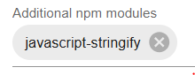

# ioBroker.flexcharts

## адаптер flexcharts для ioBroker

Раскройте весь потенциал [Apache ECharts](https://echarts.apache.org/en/index.html) в ioBroker — без каких-либо ограничений, накладываемых графическим интерфейсом настройки.

> **Этот адаптер предназначен для опытных пользователей.** В нём нет пользовательского интерфейса для настройки графиков. Вы определяете графики полностью в коде (JavaScript или Blockly) или в формате JSON, хранящемся в состоянии ioBroker.

Ознакомьтесь с [демонстрационной галереей ECharts](https://echarts.apache.org/examples/en/index.html) , чтобы получить представление о возможностях платформы.

Примечание: Адаптер еще не тестировался на MacOS.

## Что нового в версии 0.7.3

**Настраиваемый тайм-аут для`source=script` виджеты** — позволяют избежать ложных ошибок тайм-аута при ресурсоемких вычислениях или при использовании скоординированных/последовательных диаграмм:

- Новый опциональный`&requestTimeout=<ms>` Этот параметр переопределяет значение по умолчанию — 2000 мс ожидания выполнения скрипта.`onMessage()` ответ
- Поведение по умолчанию остается неизменным — это актуально только в случае истечения времени ожидания.

## Что нового в версии 0.7.2

**Удобные для начинающих шаблоны и пошаговое руководство** — делают гибкие диаграммы более доступными для пользователей, которые только начинают работать с ECharts:

- Два новых шаблона, удобных для начинающих: [шаблон 6](https://github.com/MyHomeMyData/ioBroker.flexcharts/blob/main/templates/flexchartsTemplate6.js) (энергетический столбчатый график с данными адаптера истории) и [шаблон 7](https://github.com/MyHomeMyData/ioBroker.flexcharts/blob/main/templates/flexchartsTemplate7.js) (реактивный индикаторный график с автоматическим обновлением SSE).
- Улучшены комментарии и маркеры STEP во всех существующих шаблонах (1–5)
- Новая [вики с руководством по созданию графиков](https://github.com/MyHomeMyData/ioBroker.flexcharts/wiki) : пошаговые инструкции по созданию интерактивных диаграмм с нуля — см. [Дополнительные примеры и ресурсы.](#further-examples-and-resources)

## Что нового в версии 0.7.1

**Обновление диаграммы SSE происходит без перезагрузки страницы** — при использовании`&sse` Теперь диаграмма обновляется на месте, а не перезагружает всю страницу:

- Анимация в ECharts плавно работает при каждом обновлении данных.
- Отсутствует мерцание и перестроение графика при обновлении.
- Работает прозрачно для всех существующих систем.`&sse` URL-адреса — никаких изменений не требуется.

## Как это работает

Другие адаптеры графиков ioBroker используют пользовательский интерфейс для настройки содержимого и параметров графика, что обычно ограничивает возможности его отображения. flexcharts использует другой подход:

1. Вы определяете диаграмму как объект JSON (ECharts).`option` переменная) — либо хранится в состоянии ioBroker, либо возвращается из скрипта JavaScript.
2. flexcharts передает это определение в Apache ECharts в браузере и отображает его.

Пример — столбчатая диаграмма с накоплением, хранящаяся в качестве значения состояния:

```json
{ "tooltip": {"trigger": "axis","axisPointer": {"type": "shadow"}},
  "legend": {},
  "xAxis": [{"type": "category","data": ["Mon","Tue","Wed","Thu","Fri","Sat","Sun"]}],
  "yAxis": [{"type": "value"}],
  "dataZoom": [{"show": true,"start": 0, "end": 100}],
  "series": [
    { "name": "Grid",      "type": "bar", "color": "#a30000", "stack": "Supply",      "data": [8,19,21,50,26,0,36]},
    { "name": "PV",        "type": "bar", "color": "#00a300", "stack": "Supply",      "data": [30,32,20,8,33,21,36]},
    { "name": "Household", "type": "bar", "color": "#0000a3", "stack": "Consumption", "data": [16,12,11,13,14,9,12]},
    { "name": "Heat pump", "type": "bar", "color": "#0000ff", "stack": "Consumption", "data": [22,24,30,20,22,12,25]},
    { "name": "Wallbox",   "type": "bar", "color": "#00a3a3", "stack": "Consumption", "data": [0,15,0,25,23,0,35]}
  ]
}
```

Результат:


## Предварительные требования

Flexcharts работает как веб-расширение. [Веб-адаптер](https://www.iobroker.net/#en/adapters/adapterref/iobroker.ws/README.md) (`web.0` ) должен быть установлен и запущен. В приведенных ниже примерах предполагается использование порта по умолчанию 8082.

## Начиная

### Проверьте установку

Откройте этот URL в браузере (замените`localhost` (с адресом вашего сервера ioBroker):

`http://localhost:8082/flexcharts/echarts.html?source=state&id=flexcharts.0.info.chart1`

Должна появиться демонстрационная диаграмма. Если это произошло, значит, адаптер работает правильно.

### Вариант источника 1 — состояние ioBroker

`http://localhost:8082/flexcharts/echarts.html?source=state&id=0_userdata.0.echarts.chart1`

Flexcharts считывает состояние`0_userdata.0.echarts.chart1` и отображает его как EChart. Создайте это состояние, вставьте приведенный выше пример JSON в качестве его значения, затем откройте URL-адрес.

> **Примечание:** следующие символы не допускаются в удостоверениях личности штата:`: / ? # [ ] @ ! $ & ' ( ) * + , ; = %`

### Вариант источника 2 — JavaScript-скрипт

Это более гибкий подход. flexcharts вызывает ваш скрипт при каждом запросе, и ваш скрипт возвращает определение диаграммы. Дополнительные параметры URL передаются скрипту.

Поддерживается только **javascript.0** (первый экземпляр адаптера JS).

Создайте скрипт:

```javascript
onMessage('flexcharts', (httpParams, callback) => {
    const myJsonParams = (httpParams.myjsonparams ? JSON.parse(httpParams.myjsonparams) : {});
    console.log(`httpParams = ${JSON.stringify(httpParams)}`);
    chart1(result => callback(result));
});

function chart1(callback) {
    const option = {
        tooltip: {trigger: "axis", axisPointer: {type: "shadow"}},
        legend: {},
        xAxis: [{type: "category", data: ["Mon","Tue","Wed","Thu","Fri","Sat","Sun"]}],
        yAxis: [{type: "value"}],
        dataZoom: [{show: true, start: 0, end: 100}],
        series: [
            {name: "Grid",      type: "bar", color: "#a30000", stack: "Supply",      data: [8,19,21,50,26,0,36]},
            {name: "PV",        type: "bar", color: "#00a300", stack: "Supply",      data: [30,32,20,8,33,21,36]},
            {name: "Household", type: "bar", color: "#0000a3", stack: "Consumption", data: [16,12,11,13,14,9,12]},
            {name: "Heat pump", type: "bar", color: "#0000ff", stack: "Consumption", data: [22,24,30,20,22,12,25]},
            {name: "Wallbox",   type: "bar", color: "#00a3a3", stack: "Consumption", data: [0,15,0,25,23,0,35]}
        ]
    };
    callback(option);
}
```

Запустите скрипт, затем откройте:`http://localhost:8082/flexcharts/echarts.html?source=script`

Имя сообщения по умолчанию —`flexcharts` Чтобы использовать другое имя, добавьте`&message=mycharts` и отрегулировать`onMessage('mycharts', ...)` соответственно.

Дополнительные параметры URL передаются скрипту.`httpParams` :

`http://localhost:8082/flexcharts/echarts.html?source=script&chart=chart1&myjsonparams={"period":"daily"}`

## Расширенные функции

### Функции JavaScript внутри определений диаграмм

Стандарт`JSON.stringify()` Удаляет функции из определений диаграмм. Для включения функций (например, пользовательских форматтеров) используйте модуль npm.`javascript-stringify` :

1. Добавлять`javascript-stringify` в раздел "Дополнительные модули npm" в конфигурации адаптера JavaScript:
2. В вашем скрипте:`var strify = require('javascript-stringify');`
3. Заменять`callback(option)` с`callback(strify.stringify(option))` — или для штата:`setState('my_chart_id', strify.stringify(option), true)`

См. [шаблон 3](https://github.com/MyHomeMyData/ioBroker.flexcharts/blob/main/templates/flexchartsTemplate3.js) для рабочего примера использования форматировщика всплывающих подсказок.

> **Примечание по безопасности:**`javascript-stringify` Позволяет передавать произвольный код в браузер. Не предоставляйте доступ к ioBroker из интернета при использовании этого модуля.

### Динамические диаграммы, управляемые событиями

ECharts поддерживает интерактивные диаграммы, которые обновляются в ответ на действия пользователя. См. этот [пример ECharts](https://echarts.apache.org/examples/en/editor.html?c=dataset-link) и [запись экрана с использованием flexcharts](https://github.com/MyHomeMyData/ioBroker.flexcharts/blob/main/dynamic_charts_with_flexcharts.mkv) .

Используйте **скрипт в качестве источника** и передавайте определение диаграммы и обработчики событий в виде массива. [Шаблон 4](https://github.com/MyHomeMyData/ioBroker.flexcharts/blob/main/templates/flexchartsTemplate4.js) демонстрирует это. Ключевые правила:

- Обработчики событий должны использовать`myChart.on("event", function(e){ ... })`
- Обработчик должен быть строкой JavaScript (используйте единообразные кавычки или минифицируйте с помощью [минификатора JavaScript](https://www.toptal.com/developers/javascript-minifier) ).
- Передайте все данные в виде массива:`callback([strify.stringify(option), onEvent1, onEvent2])`

Если в **качестве источника используется состояние** , то оно должно представлять собой массив строк в формате JSON. И определение диаграммы, и строки обработчика должны быть допустимыми строками JSON (без переносов строк, только экранированные кавычки внутри). Пример:`flexcharts.0.info.chart3` .

> **Примечание для пользователей, обновляющих систему с версии 0.4.x:** переменная параметров диаграммы была переименована.`jsopts` к`option` В версии 0.5.0 обновите функции обработчика событий соответствующим образом.

> **Примечание по безопасности:** Как и выше, не предоставляйте доступ к ioBroker из интернета при использовании`javascript-stringify` .

### Обновление диаграммы по событию (SSE)

Добавлять`&sse` Добавьте ссылку на любой URL-адрес диаграммы, чтобы включить автоматическое обновление диаграммы через [Server-Sent Events](https://developer.mozilla.org/en-US/docs/Web/API/Server-sent_events) . Браузер поддерживает постоянное соединение с сервером и обновляет диаграмму на месте при каждом изменении исходных данных — перезагрузка страницы и интервал опроса не требуются. Анимация ECharts плавно работает при каждом обновлении.

**С`source=state` :**

Диаграмма автоматически обновляется всякий раз, когда изменяется состояние, указанное в ней.`&id=` изменения.

```
http://localhost:8082/flexcharts/echarts.html?source=state&id=0_userdata.0.echarts.chart1&sse
```

**С`source=script` :**

Скрипт управляет содержимым диаграммы, поэтому flexcharts не может знать, какое состояние запускает обновление. Укажите это явно с помощью`&triggerid=<state_id>` :

```
http://localhost:8082/flexcharts/echarts.html?source=script&message=mycharts&triggerid=0_userdata.0.echarts.trigger&sse
```

Диаграмма обновляется всякий раз, когда`0_userdata.0.echarts.trigger` Изменения. Ваш скрипт ioBroker может обновить это состояние, чтобы отправлять обновления графика в браузер.

**Фильтр дроссельной заслонки и подтверждения:**

По умолчанию (`&sse` (без значения) График обновляется не чаще одного раза в 5 секунд (минимум). Передайте число, чтобы установить более длительный минимальный интервал:

```
...&sse=30    → update at most once every 30 seconds
```

Для более точного управления используйте JSON-объект (в формате URL):

```
...&sse={"refresh":10,"ack":true}   → update only on acknowledged state changes, at most every 10 s
...&sse={"ack":false}               → update only on unacknowledged changes (set by script), default interval
```

Изменения состояния, произошедшие в течение интервала регулирования, не теряются — обновление откладывается до следующего допустимого момента.

> **Примечание:**`&sse` и`&refresh` можно комбинировать — SSE запускает обновление на месте при изменении состояния,`&refresh` обеспечивает резервный вариант периодической перезагрузки страницы.

### Темы оформления (ECharts v6)

Используйте Apache ECharts [Theme Builder](https://echarts.apache.org/en/theme-builder.html) для создания или изменения тем оформления.

**Использование скрипта в качестве источника:**

1. Скачать тему можно через конструктор тем → вкладка "Версия JSON" → Скопировать
2. В вашем скрипте:`const myThemeDefault = <paste here>`
3. Передайте его как часть массива обратных вызовов:`callback([JSON.stringify(option), ['default', JSON.stringify(myThemeDefault)]])`

[Шаблон 5](https://github.com/MyHomeMyData/ioBroker.flexcharts/blob/main/templates/flexchartsTemplate5.js) демонстрирует полное переключение тем оформления, включая темный режим.

**Использование штата в качестве источника:**

Значение состояния должно быть массивом:`[<stringified chart>, ['default', <stringified theme>]]` . Видеть`flexcharts.0.info.chart4` для наглядного примера.

Темы, помимо`default` и`dark` требуется явная активация через`myChart.setTheme(<name>)` внутри функции, управляемой событиями.

**Быстрая попытка:**

```
callback([JSON.stringify(option), ['default', '{"title":{"left":"left"},"color":["#ff715e","#ffaf51","#ffee51","#8c6ac4","#715c87"],"backgroundColor":"rgba(64,64,64,0.5)"}']]);
```

## Шаблоны

| Шаблон                                                                                                    | Описание                                                                                                                                                             |
| --------------------------------------------------------------------------------------------------------- | -------------------------------------------------------------------------------------------------------------------------------------------------------------------- |
| [шаблон1](https://github.com/MyHomeMyData/ioBroker.flexcharts/blob/main/templates/flexchartsTemplate1.js) | Диаграмма с данными из адаптера истории.                                                                                                                             |
| [шаблон2](https://github.com/MyHomeMyData/ioBroker.flexcharts/blob/main/templates/flexchartsTemplate2.js) | Простой линейный график с данными из адаптера истории — реактивные обновления SSE.                                                                                   |
| [шаблон3](https://github.com/MyHomeMyData/ioBroker.flexcharts/blob/main/templates/flexchartsTemplate3.js) | Столбчатая диаграмма с накоплением и функцией в определении диаграммы.                                                                                               |
| [шаблон4](https://github.com/MyHomeMyData/ioBroker.flexcharts/blob/main/templates/flexchartsTemplate4.js) | Динамическая диаграмма, управляемая событиями                                                                                                                        |
| [шаблон5](https://github.com/MyHomeMyData/ioBroker.flexcharts/blob/main/templates/flexchartsTemplate5.js) | Пользовательские темы с динамическим переключением темного режима                                                                                                    |
| [шаблон6](https://github.com/MyHomeMyData/ioBroker.flexcharts/blob/main/templates/flexchartsTemplate6.js) | **Удобно для начинающих:** Обзор энергоресурсов — столбчатая диаграмма с накоплением данных из исторического адаптера.                                               |
| [шаблон7](https://github.com/MyHomeMyData/ioBroker.flexcharts/blob/main/templates/flexchartsTemplate7.js) | **Удобно для начинающих:** диаграмма с отображением текущих значений (аккумулятор, фотоэлектрическая система, тепловой насос, датчики) — оперативные обновления SSE. |
| [шаблон8](https://github.com/MyHomeMyData/ioBroker.flexcharts/blob/main/templates/flexchartsTemplate8.js) | Диаграмма на карте — круговые диаграммы, наложенные на географическую карту (Исландия) с использованием пользовательской карты GeoJSON.                              |

## Дополнительные примеры и ресурсы

### Поваренная книга (пошаговые инструкции)

Впервые работаете с Flexcharts или ECharts? **[В вики Flexcharts](https://github.com/MyHomeMyData/ioBroker.flexcharts/wiki)** вы найдете пошаговые инструкции, которые помогут вам создать как статическую диаграмму, так и полностью интерактивную панель мониторинга:

| Статья                                                                                                                                                | Чему вы научитесь                                                                                                                      |
| ----------------------------------------------------------------------------------------------------------------------------------------------------- | -------------------------------------------------------------------------------------------------------------------------------------- |
| [A1 — Диаграмма с областями, расположенными друг над другом](https://github.com/MyHomeMyData/ioBroker.flexcharts/wiki/Cookbook-A1-Stacked-Area-Chart) | Создайте график в реальном времени с автоматическим обновлением SSE; подключите реальные состояния данных с помощью скрипта.           |
| [A2 — Добавление круговой диаграммы](https://github.com/MyHomeMyData/ioBroker.flexcharts/wiki/Cookbook-A2-Adding-a-Pie-Chart)                         | Дополните диаграмму круговой диаграммой, показывающей еженедельное распределение энергии.                                              |
| [A3 — Интерактивные диаграммы](https://github.com/MyHomeMyData/ioBroker.flexcharts/wiki/Cookbook-A3-Interactive-Charts)                               | Диаграммы, управляемые событиями: круговая диаграмма реагирует на наведение курсора; общие наборы данных, строки обработчиков событий. |

Планируется публикация новых статей о кулинарных книгах.

### Примеры адаптеров сторонних производителей

- **Адаптер tibberLink:** см. обсуждения [здесь](https://github.com/MyHomeMyData/ioBroker.flexcharts/discussions/67) и [здесь](https://github.com/MyHomeMyData/ioBroker.flexcharts/discussions/66) — tibberLink также использует flexcharts изначально, см. его [документацию.](https://github.com/hombach/ioBroker.tibberlink?tab=readme-ov-file#2-using-the-flexcharts-or-fully-featured-echarts-adapter-with-json)
- **Адаптер sun2000:** доступна встроенная [интеграция с flexcharts.](https://github.com/bolliy/ioBroker.sun2000/wiki/Statistk-\(statistics\))
- **Серия Viessmann E3** (например, тепловой насос Vitocal 250): [обсуждение на ioBroker.e3oncan](https://github.com/MyHomeMyData/ioBroker.e3oncan/discussions/35)

## Ссылка

Базовый URL:`http://localhost:8082/flexcharts/echarts.html`

| Параметр               | Ценности                        | Описание                                                                                                                                                                                                                                                                                                                                              |
| ---------------------- | ------------------------------- | ----------------------------------------------------------------------------------------------------------------------------------------------------------------------------------------------------------------------------------------------------------------------------------------------------------------------------------------------------- |
| `source=state`         |                                 | Считывание определения графика из состояния ioBroker. Требуется`id` .                                                                                                                                                                                                                                                                                 |
| `source=script`        |                                 | Вызов скрипта JavaScript через`onMessage()` .                                                                                                                                                                                                                                                                                                         |
| `id=<state_id>`        |                                 | Необходимо прочитать удостоверение личности штата (требуется для`source=state` ).                                                                                                                                                                                                                                                                     |
| `message=<name>`       | по умолчанию:`flexcharts`       | Название сообщения для`onMessage()` в сценарии.                                                                                                                                                                                                                                                                                                       |
| `darkmode`             | `on` \|`off` \|`auto`           | Темный режим:`on` /нет значения = всегда темно,`off` = всегда светлый,`auto` = следовать системным настройкам.                                                                                                                                                                                                                                        |
| `refresh=<n>`          | секунд, мин. 5, по умолчанию 60 | Интервал автоматической перезагрузки. Активен только при наличии этого параметра.                                                                                                                                                                                                                                                                     |
| `sse`                  | нет ценности \|`<n>` \|`<json>` | Активировать обновления диаграмм, запускаемые событиями сервера (Server-Sent Events). Нет значения или`&sse=5` Обновление происходит не чаще, чем каждые 5 секунд (минимум).`&sse=<n>` минимальное количество секунд между обновлениями.`&sse={"refresh":<n>,"ack":true\|false}` Дополнительно можно отфильтровать данные по состоянию подтверждения. |
| `triggerid=<state_id>` |                                 | При использовании удостоверения личности штата следите за изменениями.`source=script` с`&sse` .                                                                                                                                                                                                                                                       |
| `themev5`              |                                 | Вместо тем оформления по умолчанию из версии 6 используйте темы оформления Apache ECharts v5 и темную тему.                                                                                                                                                                                                                                           |
| `<custom>=<value>`     |                                 | Все дополнительные параметры передаются скрипту.`httpParams` .                                                                                                                                                                                                                                                                                        |
| `requestTimeout=<n>`   | мс, по умолчанию 2000           | Тайм-аут для`source=script` Ожидание ответа от скрипта. Увеличьте значение, если вычисления скрипта (или общей/последовательной очереди) регулярно занимают больше времени, чем значение по умолчанию.                                                                                                                                                |

## Пожертвовать

<a href="https://www.paypal.com/donate/?hosted_button_id=WKY6JPYJNCCCQ"></a>\
&#x20;Если вам понравился этот проект — или вы просто чувствуете себя щедрым, — подумайте о том, чтобы угостить меня пивом. За ваше здоровье! :beers:

## Changelog
<!--
	Placeholder for the next version (at the beginning of the line):
	### **WORK IN PROGRESS**
-->
### 0.7.3 (2026-08-24)
* (MyHomeMyData) Added optional `requestTimeout` parameter for `source=script` widgets to configure the timeout waiting on the script's response (default 2000 ms, unchanged). Ref. issue #205

### 0.7.2 (2026-05-07)
* (MyHomeMyData) Added beginner-friendly templates 6 (energy stacked bar chart with history adapter) and 7 (reactive gauge chart with SSE auto-update)
* (MyHomeMyData) Improved comments and STEP markers in templates 1–5
* (MyHomeMyData) Added Wiki with Cookbook articles A1–A3 (step-by-step guides for building live charts)

### 0.7.1 (2026-05-05)
* (MyHomeMyData) Adapter requires node.js >= 22 now
* (MyHomeMyData) SSE now updates chart in place via setOption instead of reloading the page — ECharts animations work correctly on data updates

### 0.7.0 (2026-04-15)
* (MyHomeMyData) Implemented SSE (Server-Sent Events) to support event driven updating of chart

### 0.6.2 (2026-04-13)
* (MyHomeMyData) Restructuring of code for better readability and improved performance.
* (MyHomeMyData) Restructuring of Readme for better readability.

### Older versions

Older changelog entries are available in [CHANGELOG_OLD.md](https://github.com/MyHomeMyData/ioBroker.flexcharts/blob/main/CHANGELOG_OLD.md).

## License
MIT License

Copyright (c) 2024-2026 MyHomeMyData <juergen.bonfert@gmail.com>

Permission is hereby granted, free of charge, to any person obtaining a copy
of this software and associated documentation files (the "Software"), to deal
in the Software without restriction, including without limitation the rights
to use, copy, modify, merge, publish, distribute, sublicense, and/or sell
copies of the Software, and to permit persons to whom the Software is
furnished to do so, subject to the following conditions:

The above copyright notice and this permission notice shall be included in all
copies or substantial portions of the Software.

THE SOFTWARE IS PROVIDED "AS IS", WITHOUT WARRANTY OF ANY KIND, EXPRESS OR
IMPLIED, INCLUDING BUT NOT LIMITED TO THE WARRANTIES OF MERCHANTABILITY,
FITNESS FOR A PARTICULAR PURPOSE AND NONINFRINGEMENT. IN NO EVENT SHALL THE
AUTHORS OR COPYRIGHT HOLDERS BE LIABLE FOR ANY CLAIM, DAMAGES OR OTHER
LIABILITY, WHETHER IN AN ACTION OF CONTRACT, TORT OR OTHERWISE, ARISING FROM,
OUT OF OR IN CONNECTION WITH THE SOFTWARE OR THE USE OR OTHER DEALINGS IN THE
SOFTWARE.

Additional remark:
Source code of [Apache ECharts](https://echarts.apache.org/en/index.html) is used according to [Apache License, Version 2.0](https://www.apache.org/licenses/LICENSE-2.0)