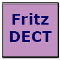

# Инструкция по установке

## Настройки Fritz!Box

Это должен быть пользователь, имеющий доступ к Fritzbox и системе «умный дом».

# пароль

Могут возникнуть проблемы:

- Пароль длиннее 32 символов
- Использование специальных символов
- Использование расширенного ASCII: Если возникнут проблемы, то, возможно, сначала стоит использовать более короткий и простой пароль, чтобы в принципе проверить механизм входа в систему адаптера, а затем постепенно расширять его.

## Настройки адаптера

- Введите IP-адрес, перед которым стоит "http\://"
- Интервал опроса можно свободно выбрать (по умолчанию 5 минут = 300 секунд). Это необходимо для отслеживания операций вне ioBroker, поскольку Fritz!Box не предоставляет автоматических обновлений.
- Если интервал опроса установлен на 0, циклические запросы выполняться не будут. Обновления будут происходить только по запросу (см. раздел «Ручное обновление»).

## Адаптер Старт

При запуске адаптера происходит следующее:

- Прошивка устройства Fritzbox запрашивается и записывается в лог (некоторые устройства Fritzbox не отвечают на этот запрос, что приводит к ошибке).
- Для устройств создаются точки данных (объекты).
- Создаются точки данных (объекты) для групп.
- Объекты снабжены данными.

Следующие объекты записываются только один раз при запуске:

- идентификатор
- fwversion
- производитель
- название продукта
- мастер-консультант
- члены

## Функция термостата

Термостат может работать в автоматическом режиме (регулирование температуры), в котором он поддерживает заданную температуру. Заданная температура может быть комфортной температурой, температурой понижения температуры или температурой, заданной пользователем.

Кроме того, клапан можно полностью закрыть, что соответствует состоянию ВЫКЛ. В режиме ВКЛ также можно предварительно выбрать другое направление, что соответствует режиму BOOST или сауны (не забудьте дать ему снова отрегулироваться ;-) ).

В настоящее время эти три режима работы можно предварительно выбрать, используя значения 0, 1 или 2 в поле «режим» для точек данных. Предварительный выбор режима 0-AUTO выбирает последнюю заданную температуру.

### Температура со смещением

В Fritz!Box можно скорректировать измеренную температуру. Для этого нужно ввести измеренную температуру, и будет сгенерировано смещение. Это смещение затем применяется к точке данных .temp. Это обеспечивает измерение внутренней температуры. Фактическая температура (actualtemp), используемая внутри термостата радиатора, также изменяется с помощью смещения. Это означает, что термостат внутренне регулирует температуру до скорректированного значения. Поэтому actualtemp и targettemp сопоставимы для сравнения профилей целевой и фактической температуры.

## Обновление вручную

Можно запустить обновление вручную, например, между интервалами опроса или когда опрос отключен. Для этого отправьте экземпляру адаптера сообщение, содержащее текст «update» без каких-либо параметров. После завершения обновления будет вызвана необязательная функция обратного вызова.

Ниже приведён пример, демонстрирующий, как запустить обновление вручную:

```javascript
sendTo('fritzdect.0', 'update', null,
    (e) => {
        if (e["result"]) {
            // Update erfolgreich
        } else {
            console.log(e["error"]);
        }
    }
);
```

## Поиск неисправностей

Рекомендуется просмотреть лог; если он неинформативен или содержит слишком мало информации, следует предварительно выбрать режим отладки в экспертных настройках экземпляра.

## Changelog

### **WORK IN PROGRESS**

- (copilot) Adapter requires node.js >= 22 now

### 2.6.4 (WIP)

- new IKEA lamp commands issue #625
- object corrections
- thermostat temp tist max 40°C

### 2.6.3 (npm)

- update to comply with repo checker

## License

The MIT License (MIT)

Copyright (c) 2018-2026 foxthefox <foxthefox@wysiwis.net>