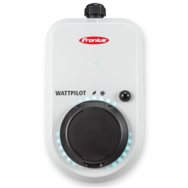

# ioBroker.fronius-wattpilot

[К английской версии файла README](/#/docs/adapterref/iobroker.fronius-wattpilot/README_DE.md)

## Что это за адаптер?

Адаптер Dieser интегрирован с Ihren Fronius Wattpilot EV-Ladegerät с ioBroker и ermöglicht es Ihnen, Ihre Ladestation zu überwachen und zu steuern. Wattpilot — это интеллектуальная функция электроснабжения, которая включена в систему «Умный дом».

**🌟 Основные функции:**

- Echtzeitüberwachung des Ladestatus
- Fernsteuerung der Ladeparameter
- Unterstützung für Cloud- und lokale Verbindungen

## Installation und Einrichtung

### Voraussetzungen

Для установки адаптеров необходимо использовать Wattpilot:

1. **Wattpilot-Einrichtung abschließen** : Beenden Sie die Ersteinrichtung mit der offiziellen Fronius Wattpilot App и **отслеживать его пароль**
2. **С подключением к Wi-Fi** : Приложения в приложении «Интернет» — вкладка и подключение к Wattpilot с вашим WiFi-Netzwerk
3. **Найден IP-адрес** : Выберите подходящий IP-адрес для вашего Wattpilot с помощью следующих методов:

- **Метод маршрутизатора** : Prüfen Sie die Weboberfläche Ihres Routers for verbundene Geräte
- **Метод приложения** : Советуем использовать приложение Wattpilot для подключения к WiFi-названию. Sie sehen dann die Netzwerkdetails einschließlich der IP-Adresse

> 💡 **Важно** : Es wird dringend empfohlen, eine statische IP-адрес для Ihren Wattpilot в маршрутизаторе-Einstellungen zu vergeben, um Verbindungsprobleme zu vermeiden.

### Установка адаптера

1. Установка адаптера от ioBroker «Adapter»-сайт
2. Erstellen Sie eine neue Instanz des fronius-wattpilot Адаптеры
3. In der Instanzkonfiguration:

- Получите **IP-адрес** вашего Wattpilot ein
- Получить **пароль** Wattpilot ein
- Konfigurieren Sie andere Einstellungen nach Bedarf

4. Speichern Sie die Konfiguration

Если все правильные настройки настроены, то, когда адаптер будет установлен и начат, необходимо выполнить настройку.

## Wie Sie den Adapter verwenden

### Daten lesen

Адаптер является автоматическим устройством для всех ватт-пилотов. Если у вас есть все другие даты в ioBroker, вы можете:

- Визуализация в VIS или других интерфейсах
- Logik in Skripten und Blockly
- Automatisierungsregeln

**Datenmodi:**

- **Nur Schlüsselpunkte** (Стандарт): Zeigt nur die wichtigsten Werte
- **Все действия** : Деактивация опции «Nur Schlüsselpunkte», все настройки API-Datan zu sehen

📖 Vollständige API-документация: [Wattpilot API-документация](https://github.com/joscha82/wattpilot/blob/main/API.md) (Dank an joscha82)

### Steuerung Ihres Wattpilot

#### Directe Zustandssteuerung (NEU!)

Sie können jetzt wichtige Wattpilot-Funktionen Direct Steuern, Indem Sie in die Zustände Schreiben.

#### Erweiterte Steuerung über set\_state

Для лучшего понимания ситуации`set_state` Datenpunkt mit diesem Format:

```
zustandsName;wert
```

**Verfügbare Zustände:**

- **amp** :`6-16` (Ладэстр в амперах)
- **cae** :`true` Одер`false` (⚠️ деактивация Cloud-Funktionalität - kann Neustart erfordern)

**Примеры:**

```
amp;10          // Ladestrom auf 10A setzen
```

## Beispiele и Anwendungsfälle

### Пример интеграции солнечной энергии

Schauen Sie sich unser [Blockly-Beispiel](https://github.com/tim2zg/ioBroker.fronius-wattpilot/blob/main/examples/example-Blockly.xml) an, das zeigt, wie Sie:

- Ihre Solarstromerzeugung überwachen
- Автоматический базовый блок Wattpilot-Ladestrom на солнечной энергии

**Итак, verwenden Sie das Beispiel:**

1. Kopieren Sie den Inhalt aus der Beispieldatei
2. Нажмите кнопку «Blöcke importieren» в ioBroker Blockly для «Blöcke importieren»-Symbol (обратите внимание на Ecke)
3. Fügen Sie den Inhalt ein und passen Sie ihn and Ihr Setup and

### Häufige Automatisierungen

- **Zeitbasiertes Laden** : Laden während Schwachlastzeiten starten
- **Solar-Überschuss-Laden** : Nur laden, wenn überschüssige Solarenergie verfügbar ist
- **Anwesenheitserkennung** : Базовый режим загрузки при автоматическом запуске/остановке автомобиля.
- **Lastausgleich** : Ladestrom basierend auf Haushalts-Stromverbrauch anpassen

## Технические детали

Адаптер связан с WebSocket-Schnittstelle де Wattpilot и конвертирует собственные данные в ioBroker-Datenpunkte. Вы можете использовать локальную сеть Wi-Fi или облачную базу данных.

**Verbindungstypen:**

- **Места использования Wi-Fi** (empfohlen): Directe Verbindung zu Ihrem Wattpilot
- **Облако** : использование облачных сервисов Fronius

## Fehlerbehebung

**Häufige Probleme:**

- **Verbindung fehlgeschlagen** : Prüfen Sie IP-адрес и пароль
- **Häufige Verbindungsabbrüche** : Weisen Sie Ihrem Wattpilot eine statische IP zu
- **Fehlende Datenpunkte** : Versuchen Sie den "Alle Werte"-Modus zu aktivieren
- **Проблема с облаком** : Überprüfen Sie die`cae` -Einstellung

**⚠️ Haftungsausschluss:** новые API-интерфейсы адаптера Dieser. Verwenden Sie ihn auf eigene Gefahr und seien Sie vorsichtig beim Ändern von Einstellungen, die den Betrieb Ihres Geräts beeinträchtigen könnten.

## Разработчик

- [СебастианХанц](https://github.com/SebastianHanz)
- [tim2zg](https://github.com/tim2zg)
- [дерХауби](https://github.com/derHaubi)

## Лицензия

Лицензия MIT

Авторские права (c) 2024 tim2zg <tim2zg@protonmail.com>

Hiermit wird unentgeltlich jeder Person, die eine Kopie der Software und der zugehörigen Dokumentationen («Программное обеспечение») erhält, die Erlaubnis erteilt, sie uneingeschränkt zu nutzen, inklusive und ohne Ausnahme mit dem Recht, sie zu verwenden, zu копировать, модифицировать, объединять, публиковать, публиковать, разглашать и/или использовать, а также лица, которые используют это программное обеспечение, чтобы получить информацию о нем, чтобы получить следующие сведения:

Der obige Urheberrechtsvermerk und dieser Erlaubnisvermerk in allen Kopien или Teilkopien der Software beizulegen.

ПРОГРАММНОЕ ОБЕСПЕЧЕНИЕ, КОТОРОЕ ПРОГРАММНОЕ ОБЕСПЕЧЕНИЕ НЕ ПРЕДОСТАВЛЯЕТСЯ, ИЛИ ЯВЛЯЕТСЯ ГАРАНТИЯ БЕРЕТ, ДОПОЛНИТЕЛЬНАЯ ГАРАНТИЯ ДЛЯ ГАРАНТИИ ДЛЯ ПЕРЕД ВОРГЕЗЕХЕНЕНОМ ИЛИ ЛУЧШИМИ ЛУЧШИМИ СОВЕТАМИ, JEGLICHER RECHTSVERLETZUNG, JEDOCH НИЧТ ДАРАУФ БЕШРЕНКТ. IN KEINEM FALL SIND DIE AUTOREN ODER COPYRIGHTINHABER FÜR JEGLICHEN SCHADEN ODER SONSTIGE ANSPRÜCHE HAFTBAR ZU MACHEN, OB INFOLGE DER FÜLLUNG DER FÜLLUNG EINES VERTRAGES, EINES DELIKTES ODER ANDERS IM ZUSAMMEHANG MIT DER SOFTWARE ODER НЕОБХОДИМОЕ ПРОГРАММНОЕ ОБЕСПЕЧЕНИЕ.

## Changelog

<!--
    Platzhalter für die nächste Version (am Anfang der Zeile):
    ### **WORK IN PROGRESS**
-->

### 4.7.0 (2025-06-19)
- Neuschreibung des Adapters
- Hinzugefügte Möglichkeit, Zustände direkt zu setzen
- Hinzugefügte Möglichkeit, allgemeine Zustände direkt zu setzen
- Alle Probleme behoben

### 4.6.3 (2023-12-24)
- Einen Fehler behoben, bei dem der Adapter eine undefinierte Variable verwenden würde
- Fehler #44 behoben
- Fehler #43 behoben

### 4.6.2 (2023-08-15)
- Dank an Norb1204 für die Behebung einiger Fehler, die ich übersehen hatte. Mehr in Issue #40

### 4.6.1 (2023-08-15)
- Issue #39 behoben (set_state funktioniert nicht)

### 4.6.0 (2023-07-15)
- Timeout-Problem im normalen Parser-Modus behoben (#36), existiert noch im dynamischen Parser-Modus --> verwenden Sie kein Timeout (0)
- Eine Reihe von Problemen bezüglich des statischen Parser-Modus behoben
- Verbesserungen der Lebensqualität --> Sie können jetzt die allgemeinen Zustände direkt setzen! (set_power, set_mode) sind aus Kompatibilitätsgründen und für den dynamischen Parser-Modus weiterhin verfügbar

### 4.5.1 (2023-03-02)
- Problem #29 behoben (benutzerdefinierte Zustände funktionieren nicht)

### 4.5.0 (2023-02-19)
- Zufällige Log-Nachrichten behoben
- Einen Typkonflikt beim set_state Zustand behoben
- Commits sollten ab sofort signiert sein

### 4.4.0 (2023-02-16)
- Bekannte Zustände werden jetzt aktualisiert, auch wenn der dynamische Parser aktiviert ist

### 4.3.0 (2023-01-14)
- Abhängigkeits-Updates
- Zustands-Updates

### 4.2.1 (2023-01-05)
- Fehler im Alle-Werte-Modus / Parser behoben

### 4.2.0 (2023-01-01)
- Einige QoL-Verbesserungen

### 4.1.0 (2022-12-30)
- Möglichkeit hinzugefügt, Zustände manuell über die Instanz-Einstellungen hinzuzufügen
- Den Fehler behoben, bei dem der Adapter nicht die korrekten Werttypen setzte
- Einige Verbesserungen der Lebensqualität hinzugefügt

### 4.0.0 (2022-11-30)
- Timing-Problem behoben
- set_power und set_mode Zustände hinzugefügt

### 3.3.1 (2022-11-17)
- Einen Fehler behoben, bei dem set_state nicht beschreibbar war

### 3.3.0 (2022-11-17)
- Einen Fehler behoben, bei dem der Adapter nicht die korrekten Labels für die Zustände setzte
- Performance-Verbesserungen
- Abhängigkeiten behoben

### 3.2.5 (2022-10-14)
- Kleine Änderungen an package.json und io-package.json

### 3.2.4 (2022-10-11)
- Abkühlungszeittimer für normale Werte behoben

### 3.2.3 (2022-10-08)
- Fehler behoben, bei dem der Adapter den Timeout-Timer nicht respektierte und ständig versuchen würde, sich mit dem WattPilot zu verbinden
- Fehler behoben, bei dem der Adapter eine falsche Trennnachricht an den WattPilot senden würde

### 3.2.2 (2022-10-06)
- Wiederverbindungsfrequenz behoben
- Mehrere WebSocket-Verbindungen behoben
- Frequenz-Handler hinzugefügt

### 3.2.1 (2022-10-02)
- Wiederverbindung zum WebSocket behoben
- Code umstrukturiert

### 3.2.0 (2022-09-29)
- Wiederverbindung implementiert
- Code verkleinert

### 3.1.0 (2022-09-07)
- Option hinzugefügt, die Cloud als Datenquelle zu verwenden
- GitHub-Workflows aktualisiert

### 3.0.0 (2022-09-04)
- README.md aktualisiert
- "Beispiele"-Verzeichnis für Beispielanwendungen erstellt
- Einige Übersetzungen hinzugefügt
- Checkbox "Parser" zu etwas Intuitiverem umbenannt
- #4 behoben: Datenpunkt "map" wird jetzt korrekt erstellt
- #5 behoben: Passwort-Zeichen sind nicht mehr sichtbar
- Typkonflikt von cableType behoben

### 2.2.4 (2022-09-01)
- SebastianHanz behob unendlichen RAM-Verbrauch
- etwas Beschreibung hinzugefügt

### 2.2.3 (2022-08-30)
- SebastianHanz behob Typ-Konflikte. Vielen Dank!

### 2.2.2 (2022-08-25)
- Fehlerbehebungen

### 2.2.1 (2022-08-22)
- Fehlerbehebungen

### 2.2.0 (2022-08-21)
- Fehler behoben

### 2.1.0 (2022-08-19)
- Min Node Version 16

### 2.0.3 (2022-07-20)
- Readme aktualisiert

### 2.0.2 (2022-07-12)
- Fehler behoben

### 2.0.1 (2022-07-10)
- Eine Installationsanleitung hinzugefügt. Nicht zu detailliert, da derzeit nicht im stabilen Repository.

### 2.0.0 (2022-07-10)
- NPM-Versionen hoffentlich behoben

### 1.1.0 (2022-07-10)
- UselessPV und TimeStamp Parser hinzugefügt, einige Tests durchgeführt.

### 1.0.1 (2022-06-02)
- Tests

### 1.0.0 (2022-06-02)
- Einige Änderungen vorgenommen
- Einige weitere Änderungen vorgenommen

### 0.0.5 (2020-01-01)
- Besserer Code

### 0.0.4 (2020-01-01)
- Parser-Option hinzugefügt

### 0.0.3 (2020-01-01)
- Parser hinzugefügt

### 0.0.2 (2020-01-01)
- Fehler behoben

### 0.0.1 (2020-01-01)
- Erste Veröffentlichung