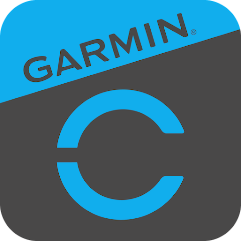

# IoBroker.garmin
**Тесты:** 

## Адаптер Garmin для ioBroker
Адаптер для Garmin Connect

# Loginablauf
Функция Garmin Connect Mail и Passwort доступна.

## Фильтр Datenpunkt (белый список)
Адаптер является стандартным для всех дат. В список разрешенных можно внести только лучшие данные.

### Тип фильтра
| Введите | Бесшрайбунг | Бейшпиль |
| --------------- | ----------------------------------------------- | ------------------------------------------ |
| **Точные ключи** | Exakte Uebereinstimmung nur mit Feldnamen | `bmi` findet jedes Field namens `bmi` |
| **Поиск** | Teilstring-Suche в ключах или Pfad | `heart` находит `heartRate`, `restingHeart` |
| **Поиск** | Teilstring-Suche в ключах или Pfad | `heart` находит `heartRate`, `restingHeart` |

### Примеры
**Nur bestimmte Feldnamen (ueberall):**

```text
Exact Keys: bmi, weight, bodyfat, bonemass
```

**Nur bestimmte Pfade:**

```text
Exact Paths: weight.dateweightlist.bmi, hydration.valueinml
```

**Alles aus einem Bereich:**

```text
Search: heart, sleep, stress
```

**Комбинация:**

```text
Exact Keys: bmi
Exact Paths: hydration.valueinml
Search: sleep
```

### Hinweise
- Фильтр без учета регистра (Gross/Kleinschreibung egal)
- Pfade werden mit Punkt getrennt: `dailysleep.dailysleepdto.sleepscores.overall.value`
- **Выбор**: Pfade OHNE Array-Indizes angeben (например, `weight.dateweightlist.bmi` NICHT `weight.dateweightlist01.bmi`). Индикации (`01`, `02`, ...) сначала используются ioBroker.
- Дополнительный список разрешений = alle Datenpunkte werden angelegt
- Leere API-Antworten erzeugen keine Ordner

## Обсуждение и вопросы
<https://forum.iobroker.net/topic/59413/test-adapter-garmin>

## Аутентификация через API Garmin (Примечания для разработчиков)
### Учетные данные OAuth
Учетные данные потребителя OAuth1 находятся в Garmin Connect Mobile APK в встроенной библиотеке `libsr.so`.

**Экстракция:**

```bash
# 1. APK von APKMirror oder APKPure laden (APKM/XAPK = Split APKs)
# 2. APKM umbenennen zu .zip und entpacken
# 3. Native library aus ARM64 Split extrahieren:
unzip split_config.arm64_v8a.apk lib/arm64-v8a/libsr.so -d /tmp/

# 4. Strings durchsuchen - alle Credentials sind kommasepariert in einem langen Block:
strings /tmp/lib/arm64-v8a/libsr.so | grep "apps.googleusercontent.com"
# Output enthält: google_client_id,google_secret,...,oauth1_key,oauth1_secret,GARMIN_CONNECT_MOBILE_ANDROID_DI,...
```

| Сертификат | Ценность |
| ---------------------- | -------------------------------------- |
| Ключ потребителя OAuth1 | `fc3e99d2-118c-44b8-8ae3-03370dde24c0` |
| Идентификатор клиента OAuth2 DI | `GARMIN_CONNECT_MOBILE_ANDROID_DI` |
| Идентификатор клиента DI OAuth2 | `GARMIN_CONNECT_MOBILE_ANDROID_DI` |

Альтернатива фон Гарта S3: `https://thegarth.s3.amazonaws.com/oauth_consumer.json`

### Процесс аутентификации (мобильный API)
1. Вход через SSO: `POST https://sso.garmin.com/sso/signin` -> Сервисный тикет (ST-xxxxx)
2. Токен OAuth1: `POST https://connectapi.garmin.com/oauth-service/oauth/preauthorized?ticket=ST-xxxxx` -> oauth_token + oauth_token_secret (подписано с помощью HMAC-SHA1)
3. Токен OAuth2: `POST https://connectapi.garmin.com/oauth-service/oauth/exchange/user/2.0` -> access_token + refresh_token (Bearer)
4. Обновление токена: `POST https://connectapi.garmin.com/di-oauth2-service/oauth/token` с `grant_type=refresh_token&client_id=GARMIN_CONNECT_MOBILE_ANDROID_DI&refresh_token=...`
5. Вызовы API: `GET https://connectapi.garmin.com/...` с заголовком `Authorization: Bearer {access_token}`

### Конечные точки API
- `/userprofile-service/socialProfile`
- `/usersummary-service/usersummary/daily/?calendarDate=YYYY-MM-DD`
- `/wellness-service/wellness/...`
- `/activitylist-service/activities/...`

### Ссылки
- [garth](https://github.com/matin/garth) - Библиотека Python для Garmin Connect
- Тестовый скрипт: `test-api.js` (SSO-вход + обмен токенов + тестирование API)

## Changelog
### 1.0.0 (2026-01-15)

- fix login and add datapoint filter

### 0.2.0 (2025-03-02)

- rework login process

### 0.0.4

- (TA2k) fix installation problems

### 0.0.3

- (TA2k) initial release

## License

MIT License

Copyright (c) 2022-2030 TA2k <tombox2020@gmail.com>

Permission is hereby granted, free of charge, to any person obtaining a copy
of this software and associated documentation files (the "Software"), to deal
in the Software without restriction, including without limitation the rights
to use, copy, modify, merge, publish, distribute, sublicense, and/or sell
copies of the Software, and to permit persons to whom the Software is
furnished to do so, subject to the following conditions:

The above copyright notice and this permission notice shall be included in all
copies or substantial portions of the Software.

THE SOFTWARE IS PROVIDED "AS IS", WITHOUT WARRANTY OF ANY KIND, EXPRESS OR
IMPLIED, INCLUDING BUT NOT LIMITED TO THE WARRANTIES OF MERCHANTABILITY,
FITNESS FOR A PARTICULAR PURPOSE AND NONINFRINGEMENT. IN NO EVENT SHALL THE
AUTHORS OR COPYRIGHT HOLDERS BE LIABLE FOR ANY CLAIM, DAMAGES OR OTHER
LIABILITY, WHETHER IN AN ACTION OF CONTRACT, TORT OR OTHERWISE, ARISING FROM,
OUT OF OR IN CONNECTION WITH THE SOFTWARE OR THE USE OR OTHER DEALINGS IN THE
SOFTWARE.