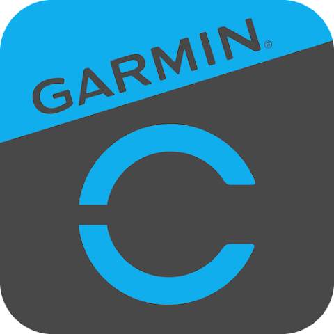

# ioBroker.garmin

## Адаптер Garmin для ioBroker

Адаптер для Garmin Connect

# Логинаблауф

Функция Garmin Connect Mail и Passwort доступна.

## Фильтр точек данных (список разрешенных файлов)

Адаптер является стандартным для всех дат. В список разрешенных можно внести только лучшие данные.

### Фильтр Типен

| Тип              | Описание                                        | Пример                                   |
| ---------------- | ----------------------------------------------- | ---------------------------------------- |
| **Точные ключи** | Exakte Uebereinstimmung nur mit Feldnamen       | `bmi` findet jedes Feld namens`bmi`      |
| **Точные пути**  | Exakte Uebereinstimmung mit vollstaendigem Pfad | `weight.dateweightlist.bmi`              |
| **Поиск**        | Teilstring-Suche в ключе или Pfad               | `heart` найти`heartRate` ,`restingHeart` |

### Beispiele

**Nur bestimmte Feldnamen (ueberall):**

```text
Exact Keys: bmi, weight, bodyfat, bonemass
```

**Nur bestimmte Pfade:**

```text
Exact Paths: weight.dateweightlist.bmi, hydration.valueinml
```

**Alles aus einem Bereich:**

```text
Search: heart, sleep, stress
```

**Комбинация:**

```text
Exact Keys: bmi
Exact Paths: hydration.valueinml
Search: sleep
```

### Hinweise

- Фильтр без учета регистра (Gross/Kleinschreibung egal)
- Pfade werden mit Punkt getrennt:`dailysleep.dailysleepdto.sleepscores.overall.value`
- **Wichtig** : Pfade OHNE Array-Indizes angeben (zB`weight.dateweightlist.bmi` НИХТ`weight.dateweightlist01.bmi` ). Die Indizes (`01` ,`02` , ...) сначала был предложен ioBroker.
- Список разрешенных = alle Datenpunkte werden angelegt
- Leere API-Antworten erzeugen keine Ordner

## Discussion und Fragen

<https://forum.iobroker.net/topic/59413/test-adapter-garmin>

## Аутентификация через API Garmin (примечания для разработчиков)

### Учетные данные OAuth

Потребительские учетные данные OAuth1 находятся в APK-файле Garmin Connect Mobile в собственной библиотеке.`libsr.so` versteckt.

**Извлечение:**

```bash
# 1. APK von APKMirror oder APKPure laden (APKM/XAPK = Split APKs)
# 2. APKM umbenennen zu .zip und entpacken
# 3. Native library aus ARM64 Split extrahieren:
unzip split_config.arm64_v8a.apk lib/arm64-v8a/libsr.so -d /tmp/

# 4. Strings durchsuchen - alle Credentials sind kommasepariert in einem langen Block:
strings /tmp/lib/arm64-v8a/libsr.so | grep "apps.googleusercontent.com"
# Output enthält: google_client_id,google_secret,...,oauth1_key,oauth1_secret,GARMIN_CONNECT_MOBILE_ANDROID_DI,...
```

| Удостоверение личности          | Ценить                                 |
| ------------------------------- | -------------------------------------- |
| Ключ потребителя OAuth1         | `fc3e99d2-118c-44b8-8ae3-03370dde24c0` |
| Секрет потребителя OAuth1       | `E08WAR897WEy2knn7aFBrvegVAf0AFdWBBF`  |
| Идентификатор клиента OAuth2 DI | `GARMIN_CONNECT_MOBILE_ANDROID_DI`     |

Alternativ von garth S3:`https://thegarth.s3.amazonaws.com/oauth_consumer.json`

### Процесс аутентификации (мобильный API)

1. Вход через единый вход (SSO):`POST https://sso.garmin.com/sso/signin` -> Сервисный билет (ST-xxxxx)
2. Токен OAuth1:`POST https://connectapi.garmin.com/oauth-service/oauth/preauthorized?ticket=ST-xxxxx` -> oauth\_token + oauth\_token\_secret (подпись HMAC-SHA1)
3. Токен OAuth2:`POST https://connectapi.garmin.com/oauth-service/oauth/exchange/user/2.0` -> access\_token + refresh\_token (Bearer)
4. Токен обновления:`POST https://connectapi.garmin.com/di-oauth2-service/oauth/token` мит`grant_type=refresh_token&client_id=GARMIN_CONNECT_MOBILE_ANDROID_DI&refresh_token=...`
5. Вызовы API:`GET https://connectapi.garmin.com/...` с заголовком`Authorization: Bearer {access_token}`

### Конечные точки API

- `/userprofile-service/socialProfile`
- `/usersummary-service/usersummary/daily/?calendarDate=YYYY-MM-DD`
- `/wellness-service/wellness/...`
- `/activitylist-service/activities/...`

### Референс

- [garth](https://github.com/matin/garth) — библиотека Python для Garmin Connect
- Тестовый скрипт:`test-api.js` (Вход через SSO + Обмен токенов + Тестирование API)

## Changelog
### 1.0.0 (2026-01-15)

- fix login and add datapoint filter

### 0.2.0 (2025-03-02)

- rework login process

### 0.0.4

- (TA2k) fix installation problems

### 0.0.3

- (TA2k) initial release

## License

MIT License

Copyright (c) 2022-2030 TA2k <tombox2020@gmail.com>

Permission is hereby granted, free of charge, to any person obtaining a copy
of this software and associated documentation files (the "Software"), to deal
in the Software without restriction, including without limitation the rights
to use, copy, modify, merge, publish, distribute, sublicense, and/or sell
copies of the Software, and to permit persons to whom the Software is
furnished to do so, subject to the following conditions:

The above copyright notice and this permission notice shall be included in all
copies or substantial portions of the Software.

THE SOFTWARE IS PROVIDED "AS IS", WITHOUT WARRANTY OF ANY KIND, EXPRESS OR
IMPLIED, INCLUDING BUT NOT LIMITED TO THE WARRANTIES OF MERCHANTABILITY,
FITNESS FOR A PARTICULAR PURPOSE AND NONINFRINGEMENT. IN NO EVENT SHALL THE
AUTHORS OR COPYRIGHT HOLDERS BE LIABLE FOR ANY CLAIM, DAMAGES OR OTHER
LIABILITY, WHETHER IN AN ACTION OF CONTRACT, TORT OR OTHERWISE, ARISING FROM,
OUT OF OR IN CONNECTION WITH THE SOFTWARE OR THE USE OR OTHER DEALINGS IN THE
SOFTWARE.