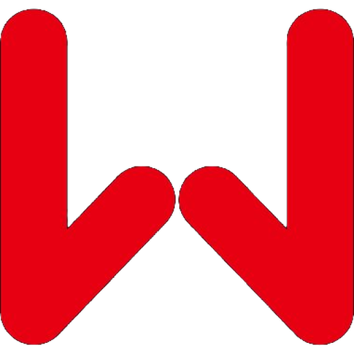

# iobroker.goodwe-pv

## Версии

## Часовой

**Этот адаптер использует библиотеки Sentry для автоматического сообщения разработчикам об исключениях и ошибках в коде.** Для получения более подробной информации и сведений о том, как отключить отчеты об ошибках, см. <a href="https://github.com/ioBroker/plugin-sentry#plugin-sentry">Документация по плагину Sentry</a>!

## адаптер goodwe-pv для ioBroker

Общение с [GoodWe](https://www.goodwe.com) Гибридные инверторы серий ET, EH, BH и BT подключаются через локальный UDP-интерфейс (порт 8899). Подключение к облаку не требуется — адаптер взаимодействует напрямую с инвертором в вашей локальной сети.

### Поддерживаемые устройства

Все гибридные инверторы GoodWe, которые предоставляют локальный интерфейс Modbus-over-UDP через порт 8899:

- Серия ET (например, GW5-ET, GW8-ET, …)
- серия EH
- серия BH
- серия БТ

## Конфигурация

**IP-адрес** — Локальный IP-адрес инвертора GoodWe (по умолчанию: `127.0.0.1`Найдите его в таблице DHCP-аренды вашего маршрутизатора или на портале SEMS / в приложении ShinePhone в разделе «Информация об устройстве». Рекомендуется использовать статический IP-адрес или резервирование DHCP.

**Цикл опросов общественного мнения** — Как часто в секундах каждая группа данных считывается повторно с инвертора (по умолчанию: `10`Четыре группы данных (DeviceInfo, RunningData, ExtComData, BMSInfo) обрабатываются с задержкой, поэтому в секунду выполняется только один UDP-запрос.

> **Кончик:** Найдите IP-адрес инвертора в таблице DHCP-аренды вашего маршрутизатора или проверьте портал GoodWe SEMS / приложение ShinePhone в разделе «Информация об устройстве». Рекомендуется назначить статический IP-адрес или зарезервировать его по DHCP, чтобы адрес не менялся.

## На основе

Этот адаптер основан на [ioBroker.goodwe](https://github.com/FossyTom/ioBroker.goodwe) к [ФоссиТом](https://github.com/FossyTom) (Томас Шенбергер), лицензия MIT. Copyright (c) 2023 Томас Шенбергер <SchoenbergerThomas@freenet.de>

## Пожертвовать

\
Если вам понравился этот проект — или вы просто чувствуете себя щедрым, — подумайте о том, чтобы угостить меня пивом. За ваше здоровье! :beers:

## Changelog
<!--
	Placeholder for the next version (at the beginning of the line):
	### **WORK IN PROGRESS**
-->
### 1.0.0 (2026-09-06)

- (hombach) version for stable release
- (hombach) updated dependencies

### 0.2.4 (2026-08-07)

- (hombach) add missing descriptions to DeviceInfo and BMSInfo states
- (hombach) remove placeholder desc "-" from states without a meaningful description
- (hombach) remove unused Rtc field from GoodWeRunningData type
- (hombach) updated dependencies

### 0.2.3 (2026-07-18)

- (hombach) replace deprecated role value.power.consumption with value.energy.consumed
- (hombach) replace value.power.produced with value.energy.produced for accumulated kWh states
- (hombach) replace invalid roles value.power.apparent and value.signal with valid alternatives

### 0.2.2 (2026-07-12)

- (hombach) assign semantic ioBroker roles to many states
- (hombach) fix PowerFactor scaling: signed int / 1000 instead of uint / 100
- (hombach) fix TotalReactivePower sign: use signed int (VAR can be negative)
- (hombach) fix EnergyTotalSell/Buy unit: GM3000 meter float is in Wh, divide by 1000

### 0.2.1 (2026-07-12)

- (hombach) add GoodWe manufacturer link to README
- (hombach) remove debug code (checkPasswordAsync/checkGroupAsync) from onReady
- (hombach) disable unused onStateChange handler (no writable states)
- (hombach) add runtime validation for pollCycle config parameter
- (hombach) expose DerateFlag as ioBroker state in RunningData
- (hombach) fix UTF-8 encoding corruption in all i18n translation files

[Older changelogs can be found there](CHANGELOG_OLD.md)

## License
MIT License

Copyright (c) 2026 hombach <goodwePV@homba.ch>

Permission is hereby granted, free of charge, to any person obtaining a copy
of this software and associated documentation files (the "Software"), to deal
in the Software without restriction, including without limitation the rights
to use, copy, modify, merge, publish, distribute, sublicense, and/or sell
copies of the Software, and to permit persons to whom the Software is
furnished to do so, subject to the following conditions:

The above copyright notice and this permission notice shall be included in all
copies or substantial portions of the Software.

THE SOFTWARE IS PROVIDED "AS IS", WITHOUT WARRANTY OF ANY KIND, EXPRESS OR
IMPLIED, INCLUDING BUT NOT LIMITED TO THE WARRANTIES OF MERCHANTABILITY,
FITNESS FOR A PARTICULAR PURPOSE AND NONINFRINGEMENT. IN NO EVENT SHALL THE
AUTHORS OR COPYRIGHT HOLDERS BE LIABLE FOR ANY CLAIM, DAMAGES OR OTHER
LIABILITY, WHETHER IN AN ACTION OF CONTRACT, TORT OR OTHERWISE, ARISING FROM,
OUT OF OR IN CONNECTION WITH THE SOFTWARE OR THE USE OR OTHER DEALINGS IN THE
SOFTWARE.