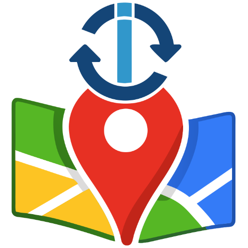

# IoBroker.google-sharedlocations2
**Тесты:** 

## Адаптер google-sharedlocations2 для ioBroker
Делитесь своим местоположением с ioBroker через Google Maps. Для этого вам следует создать отдельный аккаунт Google, то есть аккаунт для вашей установки ioBroker. НЕ используйте свой личный аккаунт.

### Конфигурация
В настройках вы можете ввести учетные данные аккаунта Google, созданного вами для ioBroker, и адаптер сделает все остальное за вас. **НЕ** вводите данные своего **личного** аккаунта.

Затем поделитесь своим местоположением с мобильного устройства (и учетной записи) с этой учетной записью iobroker-google-account. Адаптер прочитает предоставленное местоположение и создаст состояния в ioBroker для каждого пользователя, поделившегося своим местоположением с учетной записью Google.

Вы можете настроить интервал опроса. Но значения меньше 1 минуты будут игнорироваться, чтобы избежать блокировки со стороны Google.

Если вы не хотите вводить имя пользователя и пароль, это возможно, ознакомьтесь с [ниже](#use-a-cookie).

### Использовать cookie
Иногда возникают проблемы со входом в систему. Поскольку адаптер просто открывает браузер и пытается войти (но делает это, по сути, «вслепую», полагаясь на уже имеющуюся информацию), это может не сработать, и я мало что могу сделать. Иногда вы можете получить предупреждение о новом входе в систему. Иногда вам придется повторно войти в систему с помощью двухфакторной аутентификации. Если вы столкнетесь с такой проблемой, скопируйте действительный файл cookie для google.com в состояние `google-sharedlocations2.0.info.currentCookies` из реального браузера.

Вы даже можете оставить поля «имя пользователя» и «пароль» пустыми в конфигурации, и тогда адаптер будет стараться поддерживать работу этого cookie-файла на максимально высоком уровне (аналогично моей версии старого адаптера google-sharedlocations-Adapter), не пытаясь войти в систему (но время от времени используя браузер для загрузки всей страницы, это, кажется, помогает оставаться авторизованным).

Данный адаптер никак не связан с Google. Использование этого адаптера может нарушать Условия использования Google. Используйте на свой страх и риск.

Авторские права и товарные знаки Google являются собственностью Google.

## Changelog
<!--
    Placeholder for the next version (at the beginning of the line):
    ### **WORK IN PROGRESS**
-->
### 0.4.0 (2026-07-03)
- (ioBroker-Bot) Adapter requires admin >= 7.8.23 now.
* (Garfonso) minor fixes and improvements.
* (Garfonso/Claude) added self heal if wrong chrome version is installed (e.g. after update of puppeteer).

### 0.3.6 (2026-04-25)
* (Garfonso) somehow the old improve cookie call does not work anymore (since switch to fetch). Don't see why. -> So we just run the browser once a day.
* (Garfonso) Login with browser no tries to clear cookies in browser, if normal login does not work.

### 0.3.5 (2026-04-22)
* (Garfonso) resize logo.

### 0.3.4 (2026-04-22)
* (Garfonso) replaced axios dependency. Tried to make login more robust.

### 0.3.3 (2026-02-17)
* (Garfonso) if deleting cookies, also delete cookies in Browser to force login with username & password.

[Older changelogs can be found there](CHANGELOG_OLD.md)

## License
MIT License

Copyright (c) 2026 Garfonso <garfonso@mobo.info>

Permission is hereby granted, free of charge, to any person obtaining a copy
of this software and associated documentation files (the "Software"), to deal
in the Software without restriction, including without limitation the rights
to use, copy, modify, merge, publish, distribute, sublicense, and/or sell
copies of the Software, and to permit persons to whom the Software is
furnished to do so, subject to the following conditions:

The above copyright notice and this permission notice shall be included in all
copies or substantial portions of the Software.

THE SOFTWARE IS PROVIDED "AS IS", WITHOUT WARRANTY OF ANY KIND, EXPRESS OR
IMPLIED, INCLUDING BUT NOT LIMITED TO THE WARRANTIES OF MERCHANTABILITY,
FITNESS FOR A PARTICULAR PURPOSE AND NONINFRINGEMENT. IN NO EVENT SHALL THE
AUTHORS OR COPYRIGHT HOLDERS BE LIABLE FOR ANY CLAIM, DAMAGES OR OTHER
LIABILITY, WHETHER IN AN ACTION OF CONTRACT, TORT OR OTHERWISE, ARISING FROM,
OUT OF OR IN CONNECTION WITH THE SOFTWARE OR THE USE OR OTHER DEALINGS IN THE
SOFTWARE.