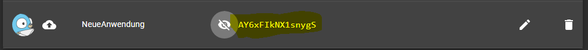
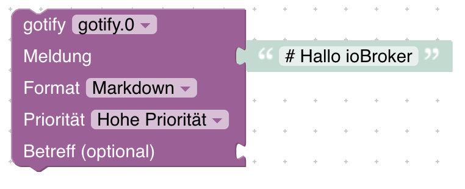
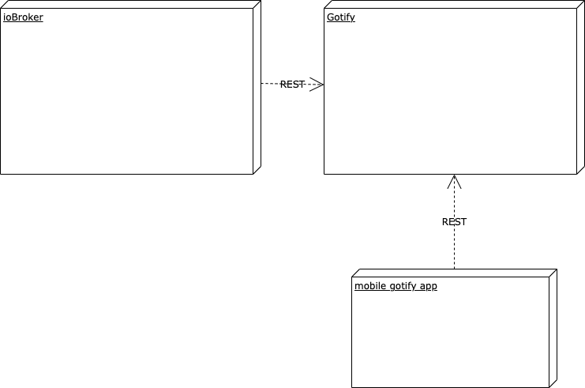

# ioBroker.gotify

## Адаптер Gotify для ioBroker

Отправляйте push-уведомления из [ioBroker](https://iobroker.net/) в [Gotify](https://gotify.net/)

## Установка

### Подготовка

- Войдите в Gotify, используя свою учетную запись.
- Создайте приложение для ioBroker.
- Запишите номер вашей новой заявки.

### В ioBroker

- Перейти к адаптеру
- Нажмите на значок github-cat
- Перейдите на вкладку «Настройка».
- Перейдите по ссылке <https://github.com/ThomasPohl/ioBroker.gotify>
- Установить
- Создайте новый экземпляр для gotify-adapter.
- Введите URL-адрес вашей установки.
- Добавьте ранее созданный токен.

## Использование

### Блокли

Чтобы отправлять сообщения с помощью Blockly, просто добавьте блок Gotify в свой скрипт:

Если вы выберете Markdown в качестве формата, вы сможете использовать [Markdown](https://guides.github.com/features/mastering-markdown/) для форматирования своих сообщений.

### JavaScript

Отправьте простое сообщение, используя токен по умолчанию:

```javascript
sendTo('gotify.0', 'send', {
    title: 'DG lüften',
    message: 'Luftfeuchtigkeit im DG zu hoch!',
});
```

Отправьте сообщение с пользовательским токеном (он переопределяет настроенный по умолчанию токен):

```javascript
sendTo('gotify.0', 'send', {
    title: 'Custom notification',
    message: 'This message uses a different token',
    priority: 8,
    contentType: 'text/markdown',
    token: 'AaBbCcDdEeFfGg123456',
});
```

## Коммуникация

Следующая диаграмма иллюстрирует, как ioBroker отправляет push-уведомления на ваш смартфон.

И ioBroker, и мобильное приложение подключаются к серверу gotify с помощью REST. Мобильное приложение поддерживает открытый веб-сокет к серверу gotify для получения новых уведомлений.

Когда ioBroker-адаптер хочет отправить уведомление, он отправляет POST-запрос на сервер Gotify. Сервер Gotify отвечает за отправку уведомления клиенту.

## Changelog

<!--
    Placeholder for the next version (at the beginning of the line):
    ### **WORK IN PROGRESS**
-->

### **WORK IN PROGRESS**
- (copilot) Adapter requires node.js >= 22 now

### 0.5.0 (2025-12-28)

- (Thomas Pohl) Allow to overwrite token when sending messages (javascript only not for blockly)
- (Thomas Pohl) Update dependencies

### 0.4.0

- (Thomas Pohl) Support for notification-manager was added
- (Thomas Pohl) Blockly can now send messages with priority 10

### 0.3.0

- (Thomas Pohl) The token is stored now encrypted
- (Thomas Pohl) node.js 22 is supported

### 0.2.1

- (Thomas Pohl) Optimized startup behavior when adapter is not configured

### 0.2.0

- (Thomas Pohl) Add timeout for http calls
- (Thomas Pohl) Update dependency versions

[Older changelogs can be found there](https://github.com/ThomasPohl/ioBroker.gotify/blob/master/CHANGELOG_OLD.md)

## License

Licensed under the Apache License, Version 2.0 (the "License");
you may not use this file except in compliance with the License.
You may obtain a copy of the License at

       http://www.apache.org/licenses/LICENSE-2.0

Unless required by applicable law or agreed to in writing, software
distributed under the License is distributed on an "AS IS" BASIS,
WITHOUT WARRANTIES OR CONDITIONS OF ANY KIND, either express or implied.
See the License for the specific language governing permissions and
limitations under the License.

Copyright (c) 2024-2026 Thomas Pohl <post@thomaspohl.net>