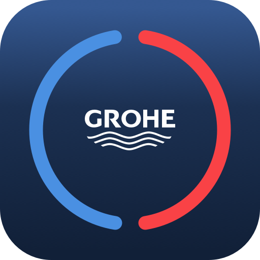

# IoBroker.grohe-smarthome
**Тесты:** 

# IoBroker Адаптер Grohe для умного дома
Этот адаптер подключает ioBroker к облаку **Grohe Smarthome / Ondus** и предоставляет доступ к устройствам Grohe в виде состояний (и некоторых элементов управления) внутри ioBroker.

Он поддерживает:

- **Grohe Sense** (тип `101`)
- **Защита Грохе** (тип `103`)
- **Дом Grohe Blue** (тип `104`)
- **Grohe Blue Professional** (тип `105`)

Адаптер выполняет вход через поток OIDC/Keycloak от Grohe, сохраняет **зашифрованный токен обновления** в определенном состоянии и опрашивает облачный API Grohe с настраиваемым интервалом.

---

## Документация
[🇺🇸 Документация](./docs/en/README.md)

[🇩🇪 Документация](./docs/de/README.md)

---

## Changelog
<!--
	Placeholder for the next version (at the beginning of the line):
	### **WORK IN PROGRESS**
-->
### 0.2.5 (2026-02-26)

* (patricknitsch) Update Admin Package

### 0.2.4 (2026-02-25)

* (patricknitsch) Fix Points for Latest Repo
* (patricknitsch) Update Packages

### 0.2.3 (2026-02-15)

* (claude) Fix no correct messages

### 0.2.2 (2026-02-12)
 * (claude) Fix Problem with jsonConfig and Interval

### 0.2.1 (2026-02-11)
* (patricknitsch) Change Log for measurement

### 0.2.0 (2026-02-10)

* (claude) Extend Error Handling for noon and midnight

### 0.1.7 (2026-02-09)

* (patricknitsch) Update Error Handling
* (patricknitsch) Update Readme

### 0.1.6 (2026-02-09)

* (patricknitsch) Changed Loglevel
* (claude) Update Error Handling -> increase Try-Timeouts

### 0.1.5 (2026-02-09)

* (patricknitsch) Update Dependencies

### 0.1.4 (2026-02-09)

* (claude) Fix wrong value for Grohe Blue remainingFilter
* (claude) Update Readme

### 0.1.3 (2026-02-08)

* (claude) Fix null of Total Consumption
* (claude) Update Readme

### 0.1.2 (2026-02-07)

* (patricknitsch) Update Readme and Translations

### 0.1.1 (2026-02-07) 
* (claude) Rate limiting awareness (HTTP 403 handling)
* (claude) Immediate state readback after commands
* (claude) Optimized polling with tiered API call frequency

### 0.1.0 (2026-02-07)
* (patricknitsch) initial release
* (claude) OAuth login via Grohe Keycloak with automatic token refresh
* (claude) Support for Sense, Sense Guard, Blue Home, Blue Professional
* (claude) Encrypted refresh token storage
* (claude) Optional raw measurement data states
* (claude) i18n support (EN/DE) for admin UI

## License
MIT License

Copyright (c) 2026 patricknitsch <patricknitsch@web.de>

Permission is hereby granted, free of charge, to any person obtaining a copy
of this software and associated documentation files (the "Software"), to deal
in the Software without restriction, including without limitation the rights
to use, copy, modify, merge, publish, distribute, sublicense, and/or sell
copies of the Software, and to permit persons to whom the Software is
furnished to do so, subject to the following conditions:

The above copyright notice and this permission notice shall be included in all
copies or substantial portions of the Software.

THE SOFTWARE IS PROVIDED "AS IS", WITHOUT WARRANTY OF ANY KIND, EXPRESS OR
IMPLIED, INCLUDING BUT NOT LIMITED TO THE WARRANTIES OF MERCHANTABILITY,
FITNESS FOR A PARTICULAR PURPOSE AND NONINFRINGEMENT. IN NO EVENT SHALL THE
AUTHORS OR COPYRIGHT HOLDERS BE LIABLE FOR ANY CLAIM, DAMAGES OR OTHER
LIABILITY, WHETHER IN AN ACTION OF CONTRACT, TORT OR OTHERWISE, ARISING FROM,
OUT OF OR IN CONNECTION WITH THE SOFTWARE OR THE USE OR OTHER DEALINGS IN THE
SOFTWARE.