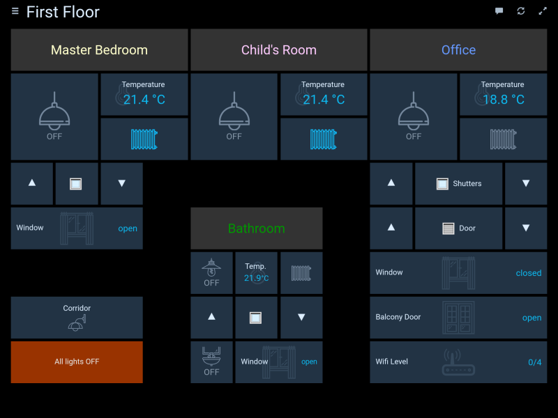
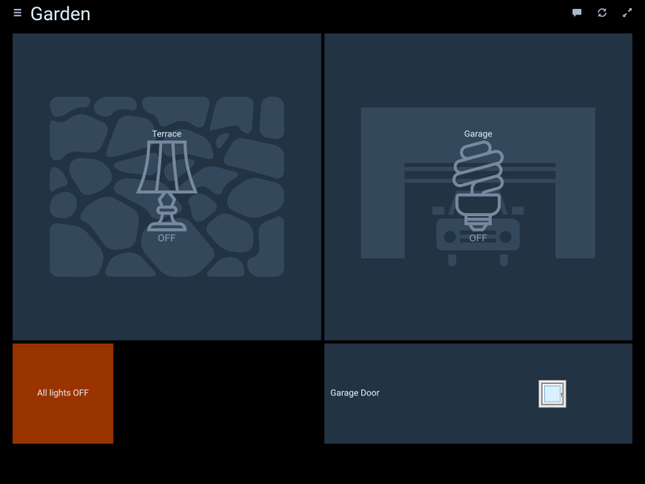

# IoBroker.habpanel
HABPanel — это легкий интерфейс информационной панели для ioBroker, основанный на OpenHAB HABpanel.

В частности, он имеет встроенный конструктор информационной панели, позволяющий легко создавать интерфейсы прямо на целевом устройстве.

## Монтаж
**Важно!** Этот адаптер нельзя установить напрямую с GitHub. Только из НПМ.

## Начиная
- При первом доступе к HABPanel в новом браузере или устройстве вы должны увидеть довольно пустой экран — следуйте инструкциям и начните с щелчка (или касания) значка в правом верхнем углу.
- Теперь вы находитесь в режиме редактирования, появилась ссылка (_"Добавить новую панель мониторинга"_), а также ссылка _"Дополнительные настройки"_.
- Если вы ранее использовали HABPanel и сохранили некоторые конфигурации панели на сервере, перейдите в _"Дополнительные настройки"_ и нажмите на свою предыдущую конфигурацию - она будет мгновенно восстановлена. Или создайте свою первую информационную панель: нажмите ссылку «Добавить новую панель»_ и дайте ей имя.
- Нажмите/коснитесь плитки информационной панели, чтобы войти в редактор информационной панели.
- Добавьте свой первый виджет: выберите меню _"Добавить виджет"_ и выберите тип виджета (скажем, Dummy - простой виджет, отображающий состояние элемента).
- Переместите виджет перетаскиванием и измените его размер с помощью белого шеврона - он появляется при нажатии на виджет.
- Нажмите на три точки в правом верхнем углу виджета, чтобы открыть его контекстное меню, и выберите _"Редактировать..."_.
- Настройте некоторые настройки (имя, элемент openHAB и т. д.) и подтвердите свои изменения.
- Сохраните конфигурацию, нажав кнопку _Сохранить_.
– Нажмите кнопку «Выполнить», чтобы увидеть панель управления в действии. Используйте кнопку «Назад» в браузере или стрелку, чтобы вернуться к чертежной доске.
- Когда вы будете довольны набором информационных панелей, вернитесь к _"Дополнительным настройкам"_, затем нажмите/коснитесь _"Сохранить текущую конфигурацию в новую конфигурацию панели"_; это сохранит его на сервере openHAB 2, как описано выше, и сделает его доступным для повторного использования.

## Скриншоты

## Changelog
<!--
	Placeholder for the next version (at the beginning of the line):
	### __WORK IN PROGRESS__
-->
### __WORK IN PROGRESS__
-   (mcm1957) Adapter requires nodeJS >=18 and js-controller >= 5 now.
-   (mcm1957) Dependencies have been updated.

### 0.5.0 (2022-02-16)
* (jogibear9988) added on support for new websockets

### 0.4.3 (2020-08-22)
* (bluefox) The compatibility to socket.io 3.0.13 provided

### 0.4.1 (2020-02-10)
* (Apollon77) compatibility to web 3.0

### 0.3.5 (2019-04-15)
* (yaming116) bugfix i18n

### 0.3.4 (2019-02-04)
* (janfromberlin) button widget did not handle primitive boolean commands
* (matthiasgasser) fix time series query start date, adapted end date

### 0.3.3 (2019-02-02)
* (janfromberlin) fix button toggle functionality for true/false

### 0.3.2 (2019-01-30)
* (foxthefox) chart and timeline functionality fixed

### 0.3.1 (2019-01-27)
* (foxthefox) chart and timeline functionality added

### 0.2.6 (2019-01-14)
* (jogibear9988) bugfix selection element

### 0.2.5 (2019-01-14)
* (jogibear9988) bugfix format strings

### 0.2.4 (2019-01-13)
* (jogibear9988) bugfix template widget

### 0.2.3 (2019-01-11)
* (jogibear9988) upgrade to current openhab version

### 0.1.7 (2017-05-20)
* (bluefox) add to welcome screen

### 0.1.6 (2017-05-15)
* (bluefox) initial commit

## License
Copyright (c) 2024 iobroker-community-adapters <iobroker-community-adapters@gmx.de>
Copyright 2017-2022 bluefox <dogafox@gmail.com>

Eclipse Public License