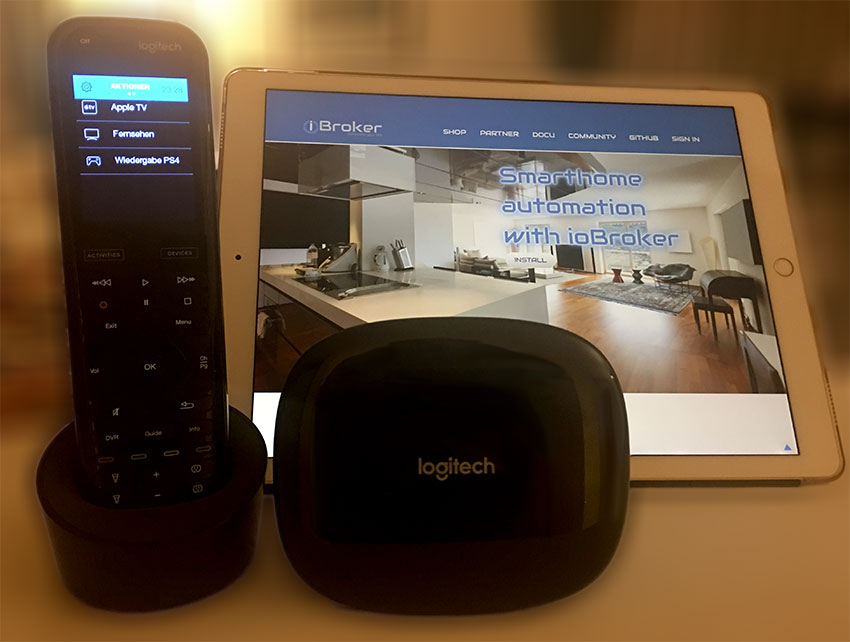
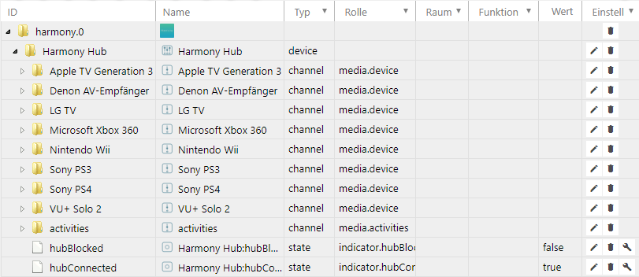
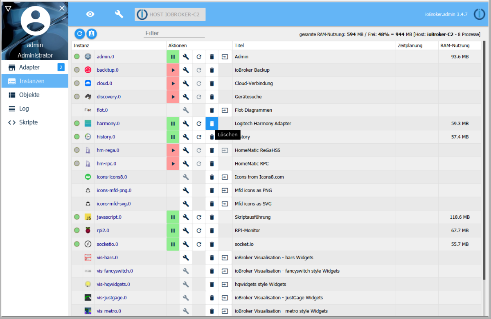

# Logitech Harmony
Адаптер Logitech Harmony позволяет легко интегрировать один или несколько концентраторов Logitech Harmony в систему ioBroker.

Logitech Harmony Hub может управлять различными устройствами для развлечений и умного дома. С помощью ioBroker действия можно запускать и останавливать через концентратор, запрашивать состояние действий и управлять устройствами дистанционно с помощью виртуальных нажатий клавиш.



## Обзор
### Logitech Harmony
Logitech Harmony совместим с более чем 270 000 развлекательных и умных домашних устройств. К ним относятся телевизоры и кабельные коробки, проигрыватели дисков и игровые приставки, AV-ресиверы и потоковые мультимедийные проигрыватели, а также интеллектуальное освещение, замки, термостаты и многое другое.

С Logitech Harmony вы можете переключать программы, регулировать громкость, устанавливать избранное и управлять освещением и другими интеллектуальными устройствами. Изюминкой системы является создание действий по управлению несколькими устройствами одним нажатием кнопки.

1. Logitech Harmony Hub подключается к домашней сети через Wi-Fi.
2. Концентраторы Harmony не имеют порта Ethernet.
3. Концентратор поддерживает только полосу частот WLAN 2,4 ГГц. Диапазон частот 5 ГГц будет

   не поддерживается

4. Следует использовать маршрутизатор 802.11 g / n. 802.11 a / b не поддерживается.
5. WEP 64/128, WPA Personal и WEP используются в качестве шифрования для WLAN

   WPA2-AES поддерживается.

6. UPnP не должен быть включен для приложения Harmony, чтобы приложение Harmony могло выполнять

Распознать Хаба и пообщаться с ним. С другой стороны, он должен быть включен для концентратора, чтобы обнаруживать и работать с другими устройствами в сети.
Это относится, например, к таким устройствам, как Philips Hue, Sonos, Nest, Roku или Smart TV.

7. Максимальное количество устройств на ход составляет 8 устройств. 15 устройств возможно, если как

   Удаленный по крайней мере один Harmony Touch или Ultimate один зарегистрирован в концентраторе.

8. Максимальное количество предпочтительных каналов - 50 на мобильное устройство.

### Адаптер Logitech Harmony
Адаптер Logitech Harmony автоматически находит все концентраторы Logitech Harmony, которые находятся в одной сетевой подсети, через соединение Wi-Fi с сервером ioBroker.

Объекты для запуска функций и действий (= макросы команд) автоматически создаются адаптером в ioBroker. Текущий статус концентратора также доступен. Указывая или читая созданные объекты, их состояние можно изменить, и, таким образом, действия могут быть инициированы или запрошены

## Предварительные условия перед установкой
Адаптер ioBroker для системы Logitech Harmony не позволяет создавать или изменять устройства или действия. Поэтому перед использованием адаптера необходимо настроить систему дистанционного управления, как описано в руководстве Logitech, и работать с контролируемыми устройствами.

## Установка
Экземпляр адаптера устанавливается через интерфейс администратора ioBroker. Подробные инструкции для необходимых шагов установки можно найти **здесь**

После завершения установки экземпляра адаптера окно конфигурации открывается автоматически.

## Конфигурация
Адаптер автоматически находит все концентраторы Harmony, которые находятся в подсети сервера ioBroker.

### Окно «Настройки адаптера Logitech Harmony»


| Поле | Описание |
|:-------------|:-------------|
| **Пользователь Hub** | Если доступ к конфигурации Harmony Hub обеспечивается с помощью пользователя и пароля, здесь необходимо ввести имя пользователя. Он чувствителен к регистру.
| **Пароль концентратора** | Если доступ к конфигурации Harmony Hub обеспечивается с помощью пользователя и пароля, необходимо ввести пароль здесь. Он чувствителен к регистру.

Два поля необходимо заполнять только в том случае, если концентратор защищен именем пользователя и паролем.

После завершения настройки диалоговое окно конфигурации закрывается с `SPEICHERN UND SCHLIEßEN`. Это приведет к последующему перезапуску адаптера.

## Экземпляры
При установке адаптера был создан активный экземпляр адаптера Logitech Harmony Hub в разделе `Objekte`.


На сервере ioBroker может быть установлен только один экземпляр адаптера Logitech Harmony.

Включен ли адаптер или подключен к Logitech Harmony Hub, указывается цветом поля «Состояние» экземпляра. Если указатель мыши указывает на символ, отображается дополнительная подробная информация.

## Объекты адаптера
В разделе `Objekte` все устройства и действия, распознаваемые адаптером в концентраторе, перечислены в древовидной структуре. Кроме того, предоставляется также информация о том, происходит ли связь с концентратором гладко.



Каждая точка данных связана со своим типом данных и разрешениями.
Разрешения можно читать (R), а также писать (W). Каждая точка данных может быть по меньшей мере прочитана (R), тогда как другие также могут быть описаны. Чтобы найти конкретную точку данных, рекомендуется поиск с использованием комбинации клавиш «CTRL + F».

| Объект | Доступ | Bescheibung |
|------|-------|-----------|
| **гармония.0** | R | Имя первого *экземпляра* адаптера Logitech Harmony |
| & #; **Harmony Hub** | R | Имя *Hub* |
| & mp; **Apple TV поколения 3** | R | Имя *устройства* содержит функции устройства |
| &emsp; **** Denon AV Receiver** | R | Имя *устройства* содержит функции устройства |
| &emsp; &emsp; **** | R | Другие *устройства* |
| &emsp; &emsp; **деятельность** | R | Список всех *действий* | запрограммированных в Harmony Hub
| &emsp; &emsp; ***hubBlocked*** | R | Указывает, занят ли концентратор |
| &emsp; &emsp; ***hubConnected*** | R | Состояние соединения между адаптером и концентратором |

### Функции устройства
Если вы откроете устройство, вы получите список всех функций, принадлежащих устройству. Эти функции устройства зависят от устройства и поэтому различаются в устройствах разных типов.


#### Запуск функции устройства
Каждая функция устройства `{Instanz}.{Hub Name}.{Gerät}.{Gerätefunktion}` запускает соответствующую реакцию адресованного устройства. Значения функций устройства могут быть прочитаны и записаны. Запуск можно проверить с помощью указателя мыши, чтобы активировать звонок справа от функции. Кроме того, вы также можете ввести значение там с символом карандаша.
Значения имеют единицу измерения `Millisekunden`. Если вы вводите значение от 1 до 250 мс, концентратор Harmony обычно выдает нажатие одной клавиши указанной длины. Значения, превышающие 250 мс, могут привести к тому, что устройство будет работать несколько раз.
После запуска функции устройства значение снова изменяется на 0.

### Мероприятия
Ниже `activities` перечислены все действия, запрограммированные в Harmony Hub.


#### Начало деятельности
Действия начинаются, если вы вводите число больше 0 для действия `{Instanz}.{Hub Name}.activities.{Aktivität}`.
Во время выполнения операции это значение сначала изменяется на 1 (= начало), а затем на 2 (= активно).

#### Завершение деятельности
Работу можно остановить, установив для нее значение 0.
Кроме того, вы можете ввести любой номер, чтобы прекратить действие в объекте `{Instanz}.{Hub Name}.activities.currentStatus`.
Во время прекращения действия `{Instanz}.{Hub Name}.activities.currentStatus` изменяется с 3 (= прекращается) на 0 (= неактивен).

#### Другие значения статуса
`{Instanz}.{Hub Name}.activities.currentActivity` возвращает текущее текущее действие в виде строки.

`{Instanz}.{Hub Name}.activities.currentStatus` указывает на статус Центра Гармонии. Значения означают

- 0 = неактивно
- 1 = старт
- 2 = активный
- 3 = отделка

`{Instanz}.{Hub Name}.activities.{Aktivität}` указывает на статус действия.
Значение значений аналогично `{Instanz}.{Hub Name}.activities.currentStatus`.

## Деинсталляция
> T: Я думаю, что стандартная установка адаптера в центральной статье подробно описана. Адаптер будет (всегда) ссылаться на эту центральную статью. Здесь описаны только отклонения от стандартной процедуры.

Если экземпляр нужно удалить снова, он будет удален с помощью назначенного значка корзины в столбце Экземпляры



Появится запрос подтверждения, который должен быть подтвержден с помощью ***OK***


Затем снова появится окно, показывающее обработку команд удаления


Эта деинсталляция полностью удаляет все объекты, принадлежащие экземпляру.

Если установочные файлы полностью удалены с хоста, это необходимо сделать с помощью значка корзины на плитке адаптера Harmony в разделе Адаптеры.

## Скидки
резервная копия

multihost

история

производительность

## FAQ
!> Ищите на форуме часто задаваемые вопросы и дайте справочный ответ здесь

1. **Соединение с концентратором прерывается снова и снова.**

Для связи с адаптером Harmony Hub требуется отличная беспроводная связь. Рекомендуется использовать точку доступа беспроводной локальной сети в непосредственной близости от концентратора.

2. **Как реализовать кнопку "alles aus" через ioBroker?**

   Установите для `{Instanz}.{Hub Name}.activities.currentStatus` значение 0.

3. ** Под Windows сообщение появляется при установке адаптера

   `ERR! code ENOGIT` и адаптер не работает. **

Перед установкой адаптера Harmony загрузите и установите GIT с веб-сайта https://git-scm.com/download/win.

4. ** Под Linux сообщение появляется при установке адаптера

   `ERR! code ENOGIT` и адаптер не работает. **

Установите GIT с помощью командной строки и `sudo apt install git` перед установкой адаптера Harmony.

6. **Скрипты больше не работают с более новыми версиями адаптера.**

Начиная с версии 0.9.1 адаптера, объекты называются по-разному. Из старых `harmony.0.Harmony_Hub` был, например, новый `harmony.0.Harmony Hub`. Пожалуйста, проверьте объекты и добавьте к ним компоненты, например, Настройте скрипты.

7. ** Wi-Fi автоматически отключается ночью. Адаптер подстраивается под

   Перезапуск WLAN не приводит к автоматическому подключению к концентратору. **

Вставьте автоматический перезапуск экземпляра гармонии (экспертный режим) через 5-10 минут после запуска WiFi-роутера.

8. **HUB не найден.**

Проверьте, является ли концентратор действительно той же сетевой подсетью и VLAN, что и сервер ioBroker. Разрешены ли многоадресные рассылки или они отфильтрованы маршрутизатором? Горит ли светодиодный индикатор состояния на концентраторе зеленым? Доступен ли концентратор через приложение Logitech? Следуйте инструкциям Logitech для решения проблем с подключением.

9. **Может быть установлен только один экземпляр адаптера.**

На сервере ioBroker может быть установлен только один экземпляр адаптера Logitech Harmony.

## Примеры
### JavaScript
Триггерные функции устройства. Здесь AV-ресивер Denon включается или выключается при изменении значения другой точки данных.

```
if (getState("hm-rpc.0.MEQ01234567.2.STATE").val == true) {
  setState("harmony.0.Harmony Hub.Denon AV-Empfänger.PowerOn"/*Denon AV-Empfänger:PowerOn*/, '1', true);
  // Bei Kontrolle Schalter == AN keine Verzögerung Schalter
} else if (getState("hm-rpc.0.MEQ01234567.2.STATE").val == false) {
  // Bei Kontrolle Schalter == AUS schalte mit Verzögerung
  var timeout = setTimeout(function () {
    setState("harmony.0.Harmony Hub.Denon AV-Empfänger.PowerOn"/*Denon AV-Empfängerr:PowerOn*/, '1', true);
  }, 1000);
}
```

### Блэкли
Триггерные функции устройства. Здесь AV-ресивер Denon включается или выключается при изменении значения другой точки данных.


[источник](media/a_harmony_blockly.xml)

### Node-Red
> связанные нод-красные элементы

> Примеры

> Экспорт для повторного использования

### Vis
> связанные элементы vis

> Примеры

> Экспорт для повторного использования

> Фрагменты кода

## Ссылки
> Ссылки на другие документы на портале ioBroker

> Веб-ссылки, например производителю

> Ссылки на GitHub

* Сторона производителя [https://www.logitech.com/de-de/product/harmony-hub](https://www.logitech.com/de-de/product/harmony-hub)

## Changelog
<!--
    Placeholder for the next version (at the beginning of the line):
    ### **WORK IN PROGRESS**
-->
### 2.0.3 (2025-11-04)
* (@GermanBluefox) Corrected the table in the configuration

### 2.0.2 (2025-11-03)
* (mcm1957) Adapter requires node.js >= 20, js-controller >= 6.0.11 and admin >= 7.6.17 now.
* (@GermanBluefox) Added state "switch" to switch activities on/off with Alexa
* (@GermanBluefox) Adapter has been rewritten with TypeScript
* (mcm1957) Dependencies have been updated.

### 1.5.0 (2024-06-02)
* (WolfspiritM) Multiple subnets can be entered as comma separated list now. (#147)
* (mcm1957) Testing for node.js 22 has been added.
* (mcm1957) Dependencies have been updated.

### 1.4.0 (2024-04-11)
* (mcm1957) Adapter requires node.js 18 and js-controller >= 5 now
* (mcm1957) Translations have been updated
* (mcm1957) Dependencies have been updated

### 1.3.0 (2023-11-08)
* (mcm1957) Adapter requires nodejs 16 now.
* (mcm1957) Adapter has been moved to iobroker-community-adapters organisation.
* (mcm1957) Dependencies have been updated.

## License
The MIT License (MIT)

Copyright (c) 2023-2025 iobroker-community-adapters <iobroker-community-adapters@gmx.de>  
Copyright (c) 2015-2019 Pmant <patrickmo@gmx.de>

Permission is hereby granted, free of charge, to any person obtaining a copy
of this software and associated documentation files (the "Software"), to deal
in the Software without restriction, including without limitation the rights
to use, copy, modify, merge, publish, distribute, sublicense, and/or sell
copies of the Software, and to permit persons to whom the Software is
furnished to do so, subject to the following conditions:

The above copyright notice and this permission notice shall be included in
all copies or substantial portions of the Software.

THE SOFTWARE IS PROVIDED "AS IS", WITHOUT WARRANTY OF ANY KIND, EXPRESS OR
IMPLIED, INCLUDING BUT NOT LIMITED TO THE WARRANTIES OF MERCHANTABILITY,
FITNESS FOR A PARTICULAR PURPOSE AND NONINFRINGEMENT. IN NO EVENT SHALL THE
AUTHORS OR COPYRIGHT HOLDERS BE LIABLE FOR ANY CLAIM, DAMAGES OR OTHER
LIABILITY, WHETHER IN AN ACTION OF CONTRACT, TORT OR OTHERWISE, ARISING FROM,
OUT OF OR IN CONNECTION WITH THE SOFTWARE OR THE USE OR OTHER DEALINGS IN
THE SOFTWARE.