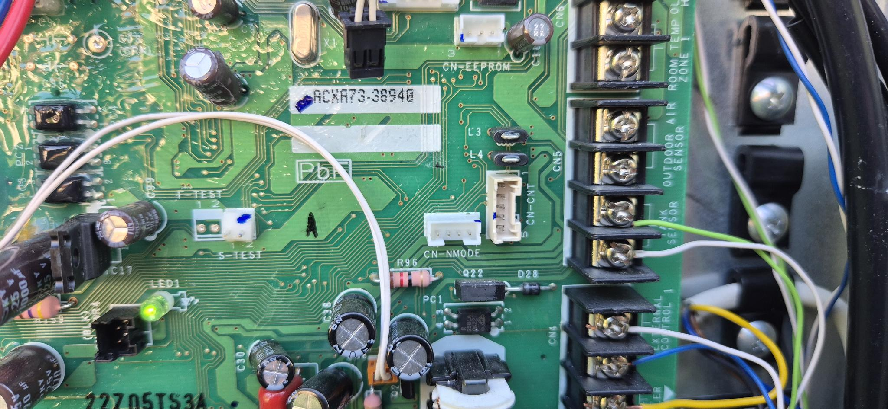
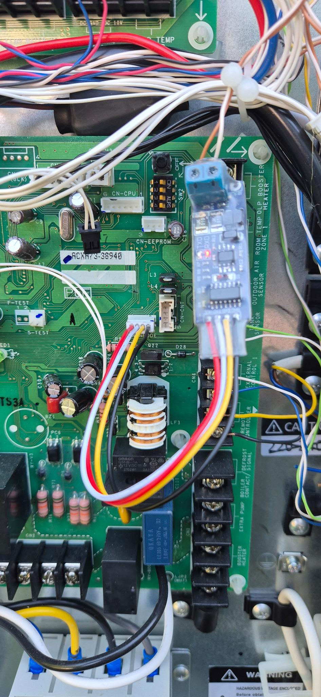

# IoBroker.heishamon
Адаптер ioBroker, который передает данные по протоколу **Panasonic Aquarea CN-CNT** напрямую по последовательной линии, без использования модуля HeishaMon или брокера MQTT. Разъем CN-CNT теплового насоса использует **логические уровни 5 В TTL UART**. Для подключения к UART с напряжением 3,3 В, например, к GPIO UART Raspberry Pi, требуется соответствующий преобразователь уровней. Для длинных кабелей можно дополнительно добавить преобразователь TTL/RS485, поскольку протокол является полудуплексным. Декодирование протокола основано на данных из [Проект HeishaMon](https://github.com/Egyras/HeishaMon).

> **Статус:** Предварительный релиз. Библиотека протоколов, симулятор и логика адаптера находятся в процессе разработки; следующим шагом станет полевое тестирование на реальном тепловом насосе.

## Поддерживаемые тепловые насосы
Тепловые насосы типа «воздух-вода» Panasonic Aquarea серий **H, J, K и L**.

## Установка
Установите из официального репозитория ioBroker через административный интерфейс: откройте вкладку **Адаптеры**, найдите **heishamon** и нажмите «Установить». Затем добавьте экземпляр в разделе **Экземпляры**.

### Требования к последовательному порту
Это действия на стороне хоста, которые административный интерфейс не может выполнить за вас:

— Пользователю процесса ioBroker (`iobroker` в стандартной конфигурации Linux) должны быть разрешены доступ к последовательным устройствам. В Debian/Raspberry Pi OS это означает группу `dialout`:

```bash
groups iobroker                     # must contain 'dialout'
sudo usermod -aG dialout iobroker   # if not — then restart the whole ioBroker service
```

— Используйте стабильный путь к устройству, чтобы порт сохранял работоспособность после перезагрузки и повторного подключения. Предпочтительнее использовать `/dev/serial/by-id/...` вместо `/dev/ttyUSB0`:

```bash
ls -l /dev/serial/by-id/
```

На плате Raspberry Pi GPIO UART путь в любом случае статический (например, `/dev/ttyAMA2`).

Для подключения теплового насоса см. раздел [Проводка](#wiring) ниже.

## Конфигурация
| Настройки | По умолчанию | Описание |
|---|---|---|
| `device` | `/dev/ttyUSB0` | Путь к последовательному устройству, которое открывает адаптер. Должен быть доступен для чтения процессом ioBroker. |
| `pollIntervalSec` | `5` | Как часто адаптер опрашивает тепловой насос (в секундах). |
| `extraPollEnabled` | `false` | Опрашивает дополнительный блок данных об энергопотреблении (только для серии K/L). По умолчанию отключено — включается только для насосов K/L; на моделях H/J дополнительный опрос просто завершается по истечении времени ожидания. |
| `readOnlyMode` | `false` | Только пассивное прослушивание: не отправлять запросы на опрос или команды установки, только декодировать кадры от другого ведущего устройства на шине. |
| `readOnlyMode` | `false` | Только пассивное прослушивание: не отправлять запросы или команды установки, только декодировать кадры от другого ведущего устройства на шине. |

## Функции
- **Прямая последовательная связь** с тепловыми насосами Panasonic Aquarea через порт CN-CNT. Не требуется оборудование HeishaMon или брокер MQTT.
- **157 точек данных** отображаются как состояния ioBroker с соответствующими ролями, типами и единицами измерения.
- **Установить команды** для всех параметров, доступных для записи и поддерживаемых протоколом CN-CNT.
- **Режим только для чтения** для безопасной параллельной работы с существующей установкой HeishaMon (переход на 4-й этап).
- **Статистика качества соединения** (входящие/исходящие кадры, ошибки CRC, тайм-ауты) в канале `info.*`.
- **Дополнительный блок данных (опционально)** для тепловых насосов серии K/L (6 дополнительных точек данных об энергопотреблении).

## ⚠️ Учет скорости записи
Механизм внутреннего хранения настроек контроллера Panasonic Aquarea не документирован. Обычное использование — ручная настройка, периодическая автоматизация умного дома — вряд ли приведет к износу; сообщество HeishaMon имеет многолетний опыт эксплуатации без сообщений о сбоях. Однако высокочастотная запись (например, ПИД-регулятор, корректирующий заданное значение каждые несколько секунд) теоретически может со временем израсходовать ячейку EEPROM, если контроллер не использует FRAM, MRAM или ОЗУ с функцией сброса данных при отключении питания.

**Избегайте записи одной и той же точки данных чаще, чем каждые несколько минут**, если у вас нет конкретных сведений о том, что ваша версия контроллера это допускает. Для регулирования с обратной связью предпочтительнее использовать медленный внешний контур, который управляет внутренними контроллерами теплового насоса, а не напрямую управляет исполнительным механизмом.

## Что вам нужно
**Никакого устройства HeishaMon, никакого ESP, никакого MQTT-брокера.** Этот адаптер взаимодействует напрямую по протоколу Panasonic CN-CNT. Вам нужно лишь установить **последовательное соединение** между тепловым насосом и устройством, на котором запущен ioBroker (ПК, домашний сервер, NAS, Raspberry Pi и т. д.).

**Уровень подготовки — сначала прочтите это.** Для установки необходимо открыть крышку электронного блока теплового насоса и подключить два провода данных и заземление к внутреннему разъему. Вы должны уметь работать с проводами малого сечения и основами электроники (логические уровни, контуры заземления, RS485). Это низковольтное устройство (сигнал 5 В), **не** работающее от сети — но неправильный разъем или перевернутая проводка все равно могут нарушить работу теплового насоса. Если это предложение вызывает у вас беспокойство, то это не лучший проект для начала работы с электроникой.

> ⚠️ **Вы делаете это исключительно на свой страх и риск — гарантия не предоставляется.** Вскрытие устройства > может аннулировать гарантию производителя. Выключите тепловой насос перед подключением проводов.
> **Семь раз отмерь, один раз подключи.**

### Сигнал и строительный блок
По сути, это всего лишь **последовательное соединение между хостом ioBroker и тепловым насосом** — ничего более экзотического. Вопрос лишь в том, как физически организовать это соединение.

Тепловой насос использует обычный **5 В TTL UART** на своем разъеме. Самый простой способ обеспечить связь — это **5 В USB-to-TTL UART адаптер**: всего три провода — **GND ↔ GND** и две линии данных, **перекрещенные** (передатчик теплового насоса → приемник адаптера, приемник теплового насоса → передатчик адаптера) — оставляют +5 В / +12 В неподключенными. Предварительно подключенный кабель `PHR-4` к **CN-NMODE** позволяет часто обойтись без пайки.

**Гальваническая изоляция необязательна, но важно понимать, что поставлено на карту.** Контакты RX/TX теплового насоса могут быть **подключены напрямую к микроконтроллеру**, практически без какой-либо защиты между ними. Чрезмерное напряжение или ток на этих линиях — контур заземления/выравнивающего тока, сбой в проводке, контакт +12 В, задетый сигнальной линией — могут **вывести из строя микроконтроллер и оставить материнскую плату теплового насоса**. Если вы не уверены в наличии контура заземления/выравнивающего тока между тепловым насосом и основным устройством, дешевый **USB-изолятор** на стороне USB устранит этот путь.
В противном случае защитите линии другим способом (например, с помощью последовательных резисторов или PTC-предохранителей) — многие установки работают нормально без какой-либо изоляции, но это решение вы принимаете осознанно.

Этот адаптер без корпуса подойдет **только если хост ioBroker действительно находится рядом с тепловым насосом** — например, при стендовом тестировании или при установке небольшого одноплатного компьютера непосредственно рядом с устройством.

### Рекомендуемая конфигурация — двухпроводной RS485 на расстоянии
На практике хост ioBroker находится в другой комнате или на другом этаже, а не в 2 метрах от теплового насоса. Поэтому разумным вариантом связи в реальных условиях является **RS485 по экранированной витой паре**, что также соответствует полудуплексному характеру протокола:

```
heat pump (5 V TTL, CN-NMODE)
   └─ TTL↔RS485 converter        ← near the heat pump
        └─ shielded twisted pair, 120 Ω termination at BOTH ends, mind A/B
             └─ RS485↔USB adapter ← at the ioBroker host
                  └─ USB → ioBroker host  →  /dev/serial/by-id/…
```

Вы создаете тот же TTL-интерфейс, что и выше, но вместо передачи данных по USB на всем протяжении, вы преобразуете сигнал в RS485 прямо на тепловом насосе и прокладываете два провода к хосту. Небольшие платы **преобразователя TTL↔RS485** стоят всего несколько долларов в обычных интернет-магазинах и, как правило, уже имеют **базовую защиту линии** (TVS-диоды / резисторы смещения) — это приятный дополнительный запас прочности со стороны теплового насоса.
Гальваническая изоляция остается необязательной и, если используется, проще всего применяется на стороне USB хоста.

Какой бы путь вы ни выбрали, адаптер всегда видит только **путь к локальному последовательному устройству** — продолжение на [Конфигурация](#configuration).

### Другие варианты (расширенные)
<details><summary>GPIO UART для Raspberry Pi (ioBroker работает непосредственно на Pi)</summary>

UART на Raspberry Pi с выводами GPIO работает на напряжении **3,3 В**, а тепловой насос — на 5 В TTL, поэтому **преобразователь логических уровней обязателен**. GPIO также является естественным концом интерфейса RS485 (преобразователь RS485↔UART → преобразователь уровней → GPIO). Три шага:

1. **Выберите аппаратный UART и его контакты.** Используйте настоящий PL011, а не мини-UART.

`ttyS0` (его скорость передачи данных изменяется в зависимости от тактовой частоты ядра). На Raspberry Pi 4/5 дополнительные контакты PL011 соответствуют фиксированным парам GPIO (TXD/RXD), например, `uart2`→GPIO0/1, `uart3`→GPIO4/5, `uart4`→GPIO8/9, `uart5`→GPIO12/13. Подключите провод от теплового насоса (через преобразователь уровней) к одной из этих пар — перекрещенный, плюс GND.

2. **Включите UART в конфигурации загрузки.** Добавьте `dtoverlay=uart3` (или любой другой).

(вы выбрали) в `/boot/firmware/config.txt` (более старые версии Raspberry Pi OS: `/boot/config.txt`) и перезагрузите.

3. **Найдите соответствующий узел устройства.** После перезагрузки UART отобразится как

`/dev/ttyAMAx`; подтвердите, какой узел принадлежит вашему оверлею, с помощью `dmesg | grep ttyAMA` или `ls -l /dev/serial*`, затем введите этот стабильный путь в конфигурацию адаптера.

Точную распиновку разъемов (CN-CNT и CN-NMODE) см. в [Проводка](#wiring).

</details>

## Проводка
> ⚠️ **Семь раз отмерь, один раз подключи.** Все представленное здесь предоставляется **без каких-либо гарантий** и используется **исключительно на ваш собственный риск и под вашу ответственность.**

> ☠️ **Неправильное подключение может вывести из строя тепловой насос.** Контакты CN-CNT / CN-NMODE RX/TX могут быть **подключены напрямую к микроконтроллеру теплового насоса**, практически без какой-либо защиты между ними. Обратите внимание на **контакты +5 В и +12 В, расположенные непосредственно рядом с сигнальными линиями** в таблицах ниже: попадание +12 В на сигнальный контакт, перевернутый провод или скачок тока заземления/выравнивающего тока может **вывести из строя микроконтроллер и оставить материнскую плату неработоспособной.** Дважды проверьте каждый контакт перед включением питания.

На материнской плате теплового насоса имеются два одинаковых разъема, которые можно использовать с этим адаптером: **CN-CNT** и **CN-NMODE**. Подойдет любой из них — выберите тот, к которому легче добраться.



`CN-CNT` — это разъем, обычно используемый для **облачного модуля CZ-TAW1** или **дополнительной печатной платы**:

- Если подключен модуль **CZ-TAW1**, используйте этот адаптер в режиме **только для чтения**, чтобы он только прослушивал шину и никогда не управлял ею.
- При наличии **дополнительной печатной платы** имеется два ведущих устройства шины, поэтому возможны коллизии — в целом, это должно работать. После ошибки CRC адаптер ожидает случайного времени перед следующим доступом к шине, чтобы разорвать синхронизацию из-за коллизий (см. примечания к шине, управляемой ответом, в журнале изменений).

Оба разъема передают сигнал **5 В TTL UART**, поэтому для устройств с напряжением 3,3 В, таких как GPIO Raspberry Pi, требуется преобразователь уровней. Названия сигналов ниже приведены **с точки зрения теплового насоса** — перечеркните их на стороне адаптера (передатчик теплового насоса → приемник адаптера, приемник теплового насоса → передатчик адаптера).

### CN-CNT — JST `B05B-XASK-1` (соединительный разъем `PAP-05V-S`)
| Пин | Сигнал |
|---|---|
| 1 | +5 В |
| 2 | TX, уровень 5 В (от теплового насоса) |
| 3 | RX, уровень 5 В (для теплового насоса) |
| 4 | +12 В |
| 5 | GND |

### CN-NMODE — серия JST PH (соединительный разъем `PHR-4`, доступен в готовом виде у крупных онлайн-ритейлеров)
| Пин | Сигнал |
|---|---|
| 1 | GND |
| 2 | RX, уровень 5 В (для теплового насоса) |
| 3 | TX, уровень 5 В (от теплового насоса) |
| 4 | +5 В |

Пример — преобразователь UART в RS485, подключенный к разъему `CN-NMODE` (сторона теплового насоса варианта RS485 для дальней связи):



## Поиск неисправностей
- **`EACCES` на последовательном устройстве** — пользователь процесса ioBroker не входит в группу `dialout`. После выполнения команды `sudo usermod -aG dialout iobroker` перезапустите всю службу ioBroker (`sudo systemctl restart iobroker`), а не только экземпляр — членство в группе вступает в силу только в новой сессии.
- **Адаптер запускается, но данные не отображаются** — проверьте проводку на порту CN-CNT (перекрестно TX↔RX, подключите GND, следите за уровнями TTL 5 В, см. [Проводка](#wiring)). При использовании преобразователя TTL↔RS485 также проверьте полярность A/B и оконечные резисторы. При исправном соединении за несколько секунд заполняется около 157 точек данных в `heishamon.0.main.*` и устанавливается значение `heishamon.0.info.connection` в `true`.
- **Команды установки не оказывают никакого эффекта** — `readOnlyMode` — это преднамеренно безопасное значение по умолчанию для первого запуска. Отключайте его только после того, как путь чтения будет выполнен без проблем.
- **Подключение осуществляется через шину CZ-TAW1** — оставьте адаптер в режиме `readOnlyMode`, иначе это вызовет конфликты шины с облачным модулем Panasonic.

## Документация
Проектная документация находится в папке [документация/](docs/):

- [docs/plan/](docs/plan/) — план этапов и дорожная карта.
- [docs/protocol/](docs/protocol/) — Анализ протокола CN-CNT.
- [docs/decisions/](docs/decisions/) — записи о решениях в области архитектуры.

## Благодарности и лицензирование исходного кода
Декодирование протокола основано на работе [Сообщество HeishaMon](https://github.com/Egyras/HeishaMon). Карта регистров CN-CNT и многие подсказки по реализации берут свое начало оттуда.

На момент написания этой статьи в репозитории HeishaMon отсутствует **явный файл лицензии** — нет `LICENSE`, нет заголовка в исходном коде, нет четкого заявления в файле README. В соответствии с законодательством США и ЕС об авторском праве, по умолчанию используется формулировка «все права защищены», поэтому мы не можем копировать или напрямую переносить оригинальный код. Чтобы избежать проблем:

Исходный код HeishaMon на C++ служит **только в качестве справочного материала** для понимания протокола Panasonic CN-CNT.
- Этот адаптер представляет собой **переработку на TypeScript в чистом виде**: мы изучили исходный код, перевели протокол в [docs/protocol/](docs/protocol/) и реализовали его на основе этой документации, а не на основе исходного кода.
- Файлы документации протокола в репозитории HeishaMon (`MQTT-Topics.md`, `OptionalPCB.md`, `ProtocolByteDecrypt.md`) описывают наблюдаемый физический протокол — то есть, это фактическая информация, не подлежащая защите авторским правом; они цитируются в качестве источников там, где это уместно.

Сам протокол CN-CNT не опубликован компанией Panasonic; открытия HeishaMon основаны на эмпирических наблюдениях. Факты не подлежат защите авторским правом, но конкретная реализация этих открытий на C++ подлежит.

## Changelog

<!--
    Placeholder for the next version (at the beginning of the line):
    ### **WORK IN PROGRESS**
-->

### 0.0.14 (2026-06-29)
* (Tobias Hanss) Corrected the maintainer email address in the package metadata (`package.json`, `io-package.json`)
* (Tobias Hanss) `extraPollEnabled` now defaults to **off** (opt-in) — the K/L-series extra data block is only polled when explicitly enabled, so a fresh install never polls datapoints that H/J pumps cannot provide. Existing instances keep their current setting
* (Tobias Hanss) Documentation: reworked the hardware/wiring section — clarified that only a plain serial link is needed (no HeishaMon device), made 2-wire RS485 the recommended real-world path, added a Raspberry Pi GPIO UART step-by-step, and a dead-mainboard warning at the wiring pinouts

### 0.0.13 (2026-06-28)
* (Tobias Hanss) Release now uses npm trusted publishing (provenance via OIDC) on Node 24 — fixes repository-checker E2008/E3019/E3022
* (Tobias Hanss) Removed the redundant `mocha` dev-dependency (it ships with `@iobroker/testing`) — E0063; the CI `adapter-tests` job now declares `needs: check-and-lint` — E3014
* (Tobias Hanss) Lint-config cleanup: dropped `.prettierignore` in favour of `// prettier-ignore` markers on the datapoint tables — W0084/W5048. No functional change

### 0.0.12 (2026-06-28)
* (Tobias Hanss) Resilient startup: a failed serial open no longer terminates the adapter — it stays alive, sets `info.connection=false` and retries
* (Tobias Hanss) Polling reworked to a setTimeout-at-end-of-tick scheme so poll ticks can never overrun or pile up in the wire queue, even under sustained communication failure
* (Tobias Hanss) `validateConfig()` now validates and safely clamps the user-configurable timeouts/gaps (`responseTimeoutMs`, `setCommandGapMs`, `sendMaxRetries`) to the Node.js timer ceiling
* (Tobias Hanss) `info` channel name fully translated (all 11 languages); setup help texts clarified
* (Tobias Hanss) Documentation: folded the install notes into the README and removed the separate INSTALL.md
* (Tobias Hanss) Tooling: adopted the standard ioBroker test-and-release workflow (testing-action-check / -adapter / -deploy) and migrated to `@iobroker/eslint-config`. No change to the heat-pump protocol

### 0.0.11 (2026-06-21)
* (Tobias Hanss) Object state roles for writable datapoints are now `level` instead of `value` (the `value` role requires `write=false`), fixing the repository checker's object-structure errors (E1011)
* (Tobias Hanss) State objects are now updated on upgrade (`extendObject`) so existing installations pick up the corrected roles
* (Tobias Hanss) Added the recommended i18n translations for the `info.connection` state name (W1001)

### 0.0.10 (2026-06-21)
* (Tobias Hanss) Published from CI with npm provenance (signed build attestation). No change to the adapter itself

### 0.0.9 (2026-06-21)
* (Tobias Hanss) CI: the release workflow's npm-publish step is now idempotent — it skips publishing when the version is already on npm, so a manual publish no longer makes the tagged release run fail. No change to the adapter itself

### 0.0.8 (2026-06-20)
* (Tobias Hanss) Maintenance for ioBroker repository acceptance: adapter-managed timers for clean shutdown, Node.js >=22 required, CI runs the adapter tests on Linux, Windows and macOS. No functional change to the heat-pump communication

### 0.0.7 (2026-05-30)
* (Tobias Hanss) Response-driven half-duplex bus: every send now waits for the heat pump's reply (or a timeout) before the next frame goes out, and retries up to 3 times on timeout or CRC error
* (Tobias Hanss) After a CRC error a randomised backoff precedes the next bus access to avoid lock-step collisions with a second master (Option-PCB)
* (Tobias Hanss) New "Diagnostics" setting toggles the set-command response logging (off by default)

### 0.0.6 (2026-05-30)
* (Tobias Hanss) Diagnostic logging to reverse-engineer the heat pump's SET acknowledgement: logs the sent frame and the heat pump's reply (frame type, timing, hexdump) at info level

### 0.0.5 (2026-05-30)
* (Tobias Hanss) Wire-queue gap is now enforced between every pair of sends, including across idle periods (previously the gap only applied while multiple tasks were already stacked in the queue — so polls and isolated sets bypassed it entirely)
* (Tobias Hanss) Queue is hard-capped at 100 pending entries; overflows are logged at warn level and the dropped send is skipped instead of silently piling up

### 0.0.3 (2026-05-26)
* (Tobias Hanss) Serialize all wire writes through a FIFO queue with a configurable inter-frame gap (default 200 ms). Fixes lost set commands when a script writes several datapoints at once
* (Tobias Hanss) Pump_Duty / Max_Pump_Duty unit removed (raw value 65-254, no physical unit)

### 0.0.2 (2026-05-25)
* (Tobias Hanss) Lower Node.js engine requirement to >= 20 (was 22) so the adapter installs on current ioBroker LTS hosts

### 0.0.1 (2026-05-25)
* (Tobias Hanss) Initial adapter release

[Older changelogs can be found there](CHANGELOG_OLD.md)

## License

MIT License

Copyright (c) 2026 Tobias Hanss <t.dev@familie-hanss.de>

Permission is hereby granted, free of charge, to any person obtaining a copy
of this software and associated documentation files (the "Software"), to deal
in the Software without restriction, including without limitation the rights
to use, copy, modify, merge, publish, distribute, sublicense, and/or sell
copies of the Software, and to permit persons to whom the Software is
furnished to do so, subject to the following conditions:

The above copyright notice and this permission notice shall be included in all
copies or substantial portions of the Software.

THE SOFTWARE IS PROVIDED "AS IS", WITHOUT WARRANTY OF ANY KIND, EXPRESS OR
IMPLIED, INCLUDING BUT NOT LIMITED TO THE WARRANTIES OF MERCHANTABILITY,
FITNESS FOR A PARTICULAR PURPOSE AND NONINFRINGEMENT. IN NO EVENT SHALL THE
AUTHORS OR COPYRIGHT HOLDERS BE LIABLE FOR ANY CLAIM, DAMAGES OR OTHER
LIABILITY, WHETHER IN AN ACTION OF CONTRACT, TORT OR OTHERWISE, ARISING FROM,
OUT OF OR IN CONNECTION WITH THE SOFTWARE OR THE DEALINGS IN THE SOFTWARE.