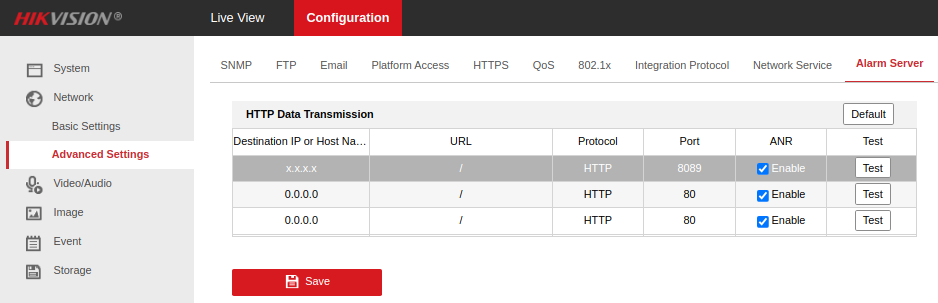
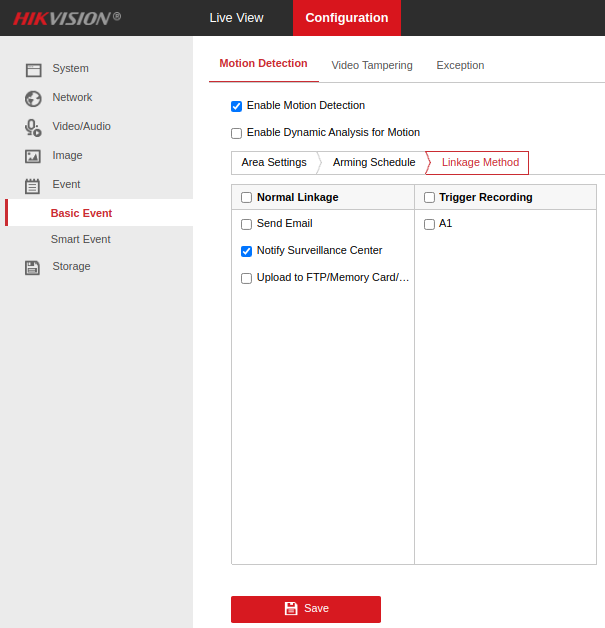

# ioBroker.hikvision-alarmserver

## Адаптер сервера сигнализации Hikvision для ioBroker

Адаптер для приема сигналов тревоги/событий, отправляемых с камер Hikvision.

Протестировано на моделях Hikvision:

- DS-2CD2043G2-I
- DS-2CD2143G2-I
- DS-2DE2A404IW-DE3
- DS-2DE3A404IW-DE/W

Сообщения об успехе/неудаче/ошибках приветствуются, если у вас есть модель, не включенная в этот список.

## Использование

Экземпляр адаптера создает логическое состояние для каждой комбинации типа камеры/события. Камеры идентифицируются по MAC-адресу (с ограничениями, определяемыми самой камерой).

По всей видимости, камеры постоянно генерируют события каждую секунду, когда эти события еще действительны, но сообщение для их удаления не отправляется. По этой причине адаптер автоматически удаляет события, которые не были повторно зарегистрированы более 5 секунд.

## Конфигурация

### ioBroker

#### Сеть

В настройках адаптера выберите свободный порт, на котором адаптер будет прослушивать запросы (по умолчанию 8089).

#### Тайм-аут будильника

Большинство устройств сигнализируют _об активности_ тревоги, постоянно отправляя оповещения. Эти устройства никогда не отправляют _неактивные_ сообщения. Поэтому адаптер считает, что тревога сброшена, если в течение заданного периода времени не поступает никаких сообщений. Укажите этот период здесь (по умолчанию 5000 мс).

#### Дерево каналов

Некоторые камеры (например, с несколькими датчиками) передают данные по нескольким каналам (не путать с каналами ioBroker). Чтобы различать события между каждым из каналов камеры, выберите соответствующую опцию.

Для определенных типов событий (например, обнаружение поля, пересечение линии и т. д.) некоторые камеры способны идентифицировать цели обнаружения движения (например, человек, транспортное средство и т. д.). Чтобы создать состояние для каждой из этих целей для каждого соответствующего типа события, отметьте соответствующую опцию.

#### sendTo

Некоторые типы получаемых событий имеют простое логическое значение «вкл/выкл» (длительность, VMD и т. д.). Для таких простых событий достаточно установить соответствующее состояние в дереве объектов ioBroker.

Однако некоторые полученные события содержат двоичные данные, такие как изображения, постоянное хранение которых в дереве объектов ioBroker было бы нецелесообразным. Более удобным механизмом обработки таких событий является использование встроенной системы обмена сообщениями ioBroker, которая позволяет передавать объекты сообщений между адаптерами.

Хотя эта функция предназначена в основном для изображений, поддерживается также отправка, инициируемая простыми XML-фрагментами.

Точное отправляемое сообщение можно настроить в параметре.`Send to message...` поля. Эти поля обрабатываются с помощью JavaScript.`Function` Объект, имеющий две доступные переменные:`ctx` (объект контекста события — см. ниже), а в случае частей изображения необработанный буфер доступен в`imageBuffer` .

##### Пример 1: Отправлять текстовые оповещения о каждом событии, полученном через Telegram.

Если адаптер Telegram уже установлен, можно задать следующие параметры.`XML event parts` раздел:

- Отправить в экземпляр для XML:`telegram.0`
- Отправить команду для XML: Оставьте поле пустым
- Отправить сообщение в формате XML: Обратите внимание, что обратные кавычки являются частью заданного значения.`` `Received ${ctx.eventType} from ${ctx.deviceName}` ``

##### Пример 2: Отправка изображений через Telegram

Если адаптер Telegram уже установлен, можно задать следующие параметры.`Image event parts` раздел:

- Отправить изображения в экземпляр:`telegram.0`
- Отправить команду для получения изображений: Оставьте поле пустым
- Отправить сообщение для получения изображений:`{ text: imageBuffer, type: 'photo' }`

##### Пример 3: Отправка изображений в пользовательский JavaScript-код.

Более сложный пример — отправка каждого полученного буфера изображения пользовательскому скрипту, работающему внутри адаптера JavaScript:

- Отправить на имя экземпляра:`javascript.0`
- Отправить в командный пункт:`toScript` (Это не пример — требуется ввод строки без изменений).
- Отправить сообщение:`{ script: 'script.js.myImageHandler', message: 'myImageReceiver', data: { device: ctx.device, image: imageBuffer } }`

Внутри JavaScript-адаптера (нулевой экземпляр) создайте скрипт с именем`myImageHandler` и добавьте этот код:

```javascript
onMessage('myImageReceiver', (data, cb) => {
  // data.device holds mac address of device (colons stripped).
  // data.image holds raw image buffer.
  ...
  cb();
});
```

##### Объект контекста события

Он`ctx` Контекст события обладает следующими свойствами:

- `macAddress`
- `eventType`
- `detectionTarget`
- `channelName`
- `device` - MAC-адрес без кавычек (для согласованности с net-tools).
- `deviceName` - Имя хоста, полученное с помощью net-tools или копии`device` если не найдено.
- `stateId` - Идентификатор штата, который запускает это событие.
- `eventLogged` - Логическое значение, указывающее на корректное срабатывание состояния. Всегда должно быть истинным.
- `xml` - Разобранные XML-данные.
- `ts` - JavaScript`Date` объект, созданный из`dateTime` в сообщении о событии (или время получения события, если оно недоступно).
- `periodPath` - Папка файловой системы, в которой в данный момент сохраняются части события (меняется ежедневно).
- `fileBase` - Префикс для всех сохраненных частей текущего сообщения.
- `files` - Массив, содержащий имена файлов (включая полный путь) всех файлов, выгруженных в процессе обработки текущего сообщения.

#### Сохранение данных события

Если отмечено событие, XML-данные и/или изображения хранятся в локальной файловой системе в следующем порядке:`iobroker-data/hikvision-alarmserver.<instance>` .

_Внимание!_ Эти файлы в настоящее время не удалены и не заархивированы, поэтому используйте их с осторожностью или разработайте для этого внешнюю стратегию.

### На камеру

Перейдите на страницу настроек вашей камеры (камер) и задайте IP-адрес/хост и порт ioBroker:



Убедитесь, что в списке событий, о которых вы хотите сообщать в ioBroker, присутствует пункт «Уведомить центр наблюдения». Например:



## Changelog

<!--
  Placeholder for the next version (at the beginning of the line):
  ### **WORK IN PROGRESS**
-->
### **WORK IN PROGRESS**
- (copilot) Adapter requires node.js >= 22 now
- (copilot) Adapter requires admin >= 7.7.22 now
- (copilot) Adapter requires js-controller >= 6.0.11 now
- (copilot) Adapter requires admin >= 7.6.17 now
* (mcm1957) Adapter requires node.js >= 18 and js-controller >= 5 now
* (mcm1957) Dependencies have been updated

### 0.1.0 (2023-01-24)
-   (Robin Rainton) Added configuration for alarm timeout ([#16](https://github.com/iobroker-community-adapters/ioBroker.hikvision-alarmserver/issues/16)).
-   (Robin Rainton) Fixed multipart message handling for line crossing/field detection, etc ([#18](https://github.com/iobroker-community-adapters/ioBroker.hikvision-alarmserver/issues/18)).
-   (Robin Rainton) Optionally save XML/images & send events using `sendTo` to other adapters ([#20](https://github.com/iobroker-community-adapters/ioBroker.hikvision-alarmserver/issues/20) & [#26](https://github.com/iobroker-community-adapters/ioBroker.hikvision-alarmserver/issues/26)).
-   (Robin Rainton) Added info.connection state ([#22](https://github.com/iobroker-community-adapters/ioBroker.hikvision-alarmserver/issues/22)).
-   (Robin Rainton) Handle cases where `TargetRect` is specified in decimals between zero & one ([#24](https://github.com/iobroker-community-adapters/ioBroker.hikvision-alarmserver/issues/24)).

### 0.0.7 (2022-12-29)
-   (Robin Rainton) Add bind address option ([#9](https://github.com/iobroker-community-adapters/ioBroker.hikvision-alarmserver/issues/9)).
-   (Robin Rainton) Try to derive device names from net-tools. Optionally use channelName from devices ([#10](https://github.com/iobroker-community-adapters/ioBroker.hikvision-alarmserver/issues/10)).

### 0.0.6 (2022-12-13)
-   (Robin Rainton) Handle multipart message payload ([#5](https://github.com/iobroker-community-adapters/ioBroker.hikvision-alarmserver/issues/5)).
-   (Robin Rainton) Handle payloads without XML declaration ([#7](https://github.com/iobroker-community-adapters/ioBroker.hikvision-alarmserver/issues/7).)

### 0.0.5 (2022-12-10)
-   (Robin Rainton) Drop colons from device IDs.

### 0.0.2
-   (Robin Rainton) initial release.

[Older changelogs can be found there](https://github.com/iobroker-community-adapters/ioBroker.hikvision-alarmserver/blob/main/CHANGELOG_OLD.md)

## License
MIT License


Copyright (c) 2026 iobroker-community-adapters <iobroker-community-adapters@gmx.de>  
Copyright (c) 2022-2024 Robin Rainton <robin@rainton.com>

Permission is hereby granted, free of charge, to any person obtaining a copy
of this software and associated documentation files (the "Software"), to deal
in the Software without restriction, including without limitation the rights
to use, copy, modify, merge, publish, distribute, sublicense, and/or sell
copies of the Software, and to permit persons to whom the Software is
furnished to do so, subject to the following conditions:

The above copyright notice and this permission notice shall be included in all
copies or substantial portions of the Software.

THE SOFTWARE IS PROVIDED "AS IS", WITHOUT WARRANTY OF ANY KIND, EXPRESS OR
IMPLIED, INCLUDING BUT NOT LIMITED TO THE WARRANTIES OF MERCHANTABILITY,
FITNESS FOR A PARTICULAR PURPOSE AND NONINFRINGEMENT. IN NO EVENT SHALL THE
AUTHORS OR COPYRIGHT HOLDERS BE LIABLE FOR ANY CLAIM, DAMAGES OR OTHER
LIABILITY, WHETHER IN AN ACTION OF CONTRACT, TORT OR OTHERWISE, ARISING FROM,
OUT OF OR IN CONNECTION WITH THE SOFTWARE OR THE USE OR OTHER DEALINGS IN THE
SOFTWARE.