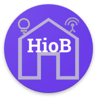

- [Создать кнопку](/#/docs/adapterref/iobroker.hiob/docs/en/button.md)
- [Создавайте ценность](/#/docs/adapterref/iobroker.hiob/docs/en/value.md)
- [Создать расширенные настройки](/#/docs/adapterref/iobroker.hiob/docs/en/advanced.md)
- [Создайте переключатель с помощью ползунка.](/#/docs/adapterref/iobroker.hiob/docs/en/switch_w_slider.md)
- [Создать разделительную линию](/#/docs/adapterref/iobroker.hiob/docs/en/division.md)
- [Создать веб-представление](/#/docs/adapterref/iobroker.hiob/docs/en/webview.md)
- [Создать таблицу](/#/docs/adapterref/iobroker.hiob/docs/en/table.md)
- [Создать цветовую палитру](/#/docs/adapterref/iobroker.hiob/docs/en/color.md)
- [Создать сетевой медиаплеер](/#/docs/adapterref/iobroker.hiob/docs/en/media_player.md)

## Граф (только SQL-адаптер)

### С помощью Graph можно создавать графики состояний, записанных с помощью SQL-запросов или адаптеров истории.

- Проведите пальцем влево, чтобы удалить виджет.
- Нажмите на знак плюса в правом нижнем углу.

- Сначала необходимо начать запись. В качестве примера на двух картинках использовался SQL-адаптер. Нажмите «Пользовательские настройки» и включите SQL.

- Выпадающий список: выберите`Graph (only sql Adapter)` .
- Название: Название виджета
- Заголовок: Подзаголовочный текст графика
- Ось Y: Откройте группу «Ось Y» и нажмите кнопку «Добавить ось Y».

- Проведите пальцем влево, чтобы удалить ось Y.
- Можно создать несколько осей Y (вертикальных линий), которые затем можно выбрать при создании линии.
- Описание: Описание масштабирования
- мин: Начинаем масштабирование. Здесь я начинаю с 1.
- макс.: Конец саклизации. В примере 100
- Интервал: Масштабируемый интервал. В примере введено число 10. Таким образом, отображается 1, 11, 22, 33, xxx.

- Проведите пальцем влево, чтобы удалить ось X.
- Ось X: Откройте группу «Ось X» и нажмите`Button Add X Axis` .
- Можно создать несколько осей X (горизонтальных линий), которые затем можно выбрать при создании линии.
- Описание: Описание масштабирования
- Конец оси: Конец масштабирования (см. изображение для вариантов).
- Область действия: Как часто следует отображать единицу измерения области действия. Если вы сейчас введете`hour` В поле «Единица измерения» отобразится один час. Если вы введете 4, отобразится 4 часа.
- Единица измерения: выберите единицу измерения здесь (см. изображение для просмотра вариантов).

- Проведите пальцем влево, чтобы удалить строку.
- Строки: Откройте группу «Строки» и нажмите кнопку «Добавить линию».
- Можно создать несколько линий (диаграмму).
- Имя: Это имя будет отображаться на диаграмме в качестве заголовка.
- Устройство: Выберите нужный товар в списке.
- Точка данных: Выбор состояния, отслеживаемого с помощью SQL.
- Тип линии: Выберите тип линии (см. изображение с вариантами).
- Ось X: Выбор всех осей X.
- Ось Y: Выбор всех осей Y.
- Минимальное время до следующего обновления: время, когда обновление должно быть выполнено не позднее указанного срока. Обновление происходит автоматически при запуске приложения.
- Показать точку данных: Отображается название штата.

- Отслеживающий шар: Включите, если необходимо установить метки.

- Затем нажмите «Сохранить».
- Длительное нажатие на виджет переключает его в режим копирования. Здесь вы можете выбрать виджеты, с которых следует создать копию.

- Добавляет виджет на экран.

- [Создать кнопку](/#/docs/adapterref/iobroker.hiob/docs/en/button.md)
- [Создавайте ценность](/#/docs/adapterref/iobroker.hiob/docs/en/value.md)
- [Создать расширенные настройки](/#/docs/adapterref/iobroker.hiob/docs/en/advanced.md)
- [Создайте переключатель с помощью ползунка.](/#/docs/adapterref/iobroker.hiob/docs/en/switch_w_slider.md)
- [Создать разделительную линию](/#/docs/adapterref/iobroker.hiob/docs/en/division.md)
- [Создать веб-представление](/#/docs/adapterref/iobroker.hiob/docs/en/webview.md)
- [Создать таблицу](/#/docs/adapterref/iobroker.hiob/docs/en/table.md)
- [Создать цветовую палитру](/#/docs/adapterref/iobroker.hiob/docs/en/color.md)
- [Создать сетевой медиаплеер](/#/docs/adapterref/iobroker.hiob/docs/en/media_player.md)