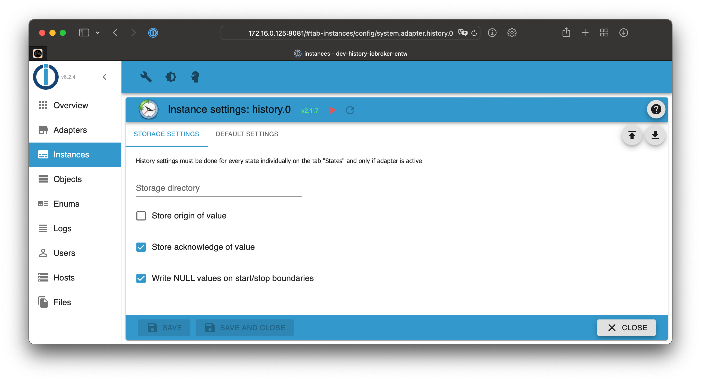
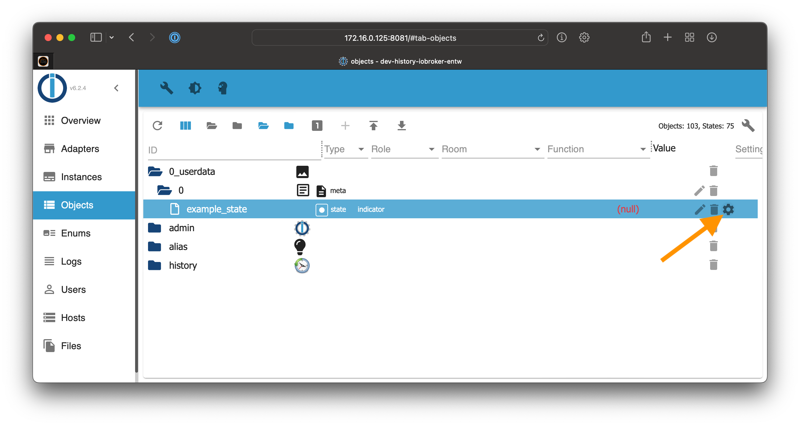
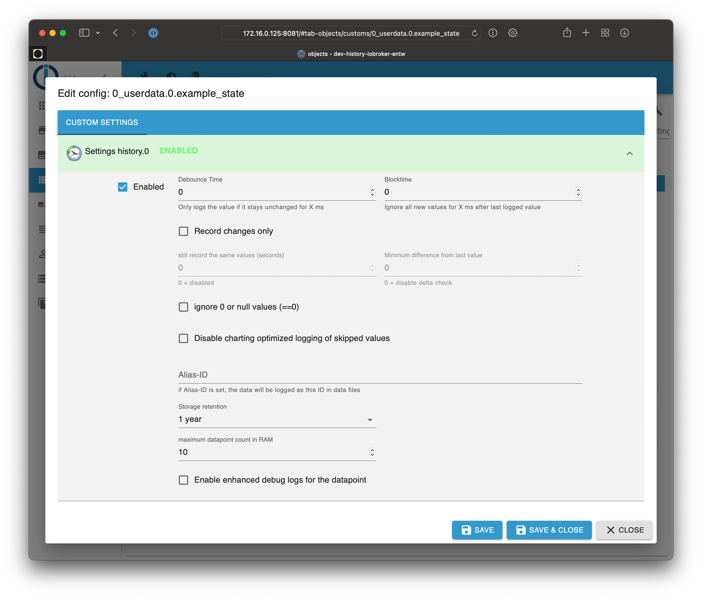
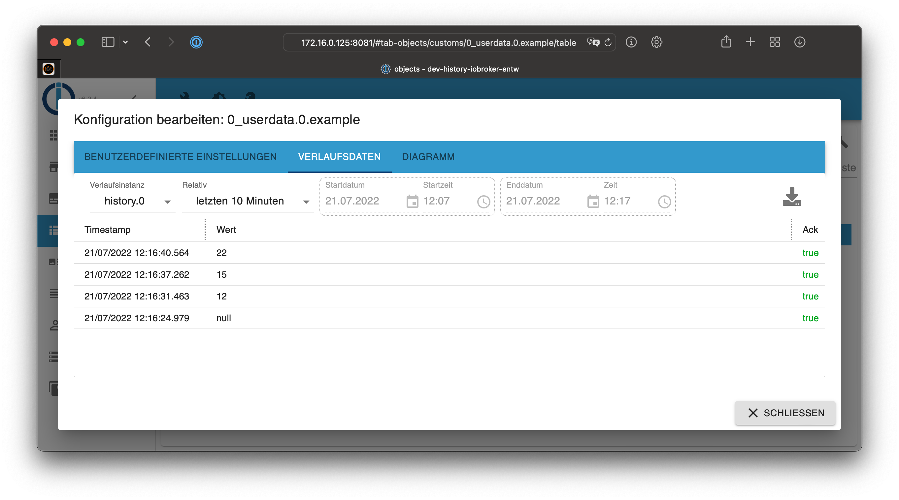
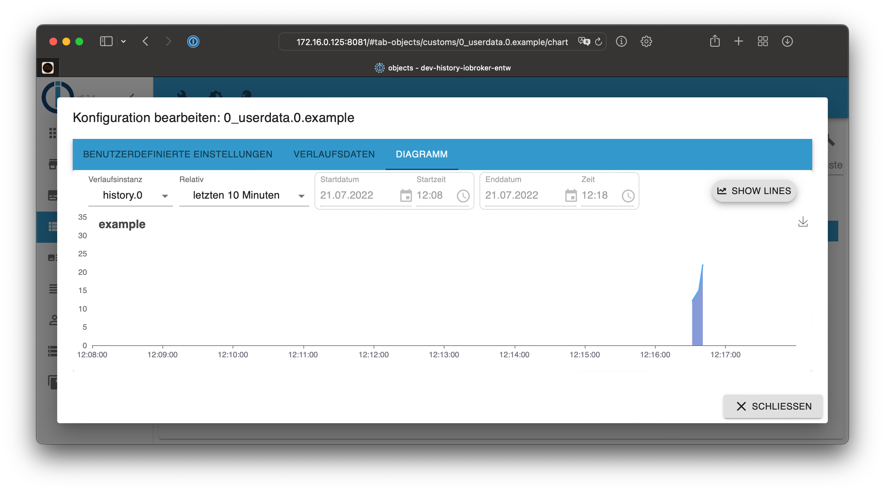
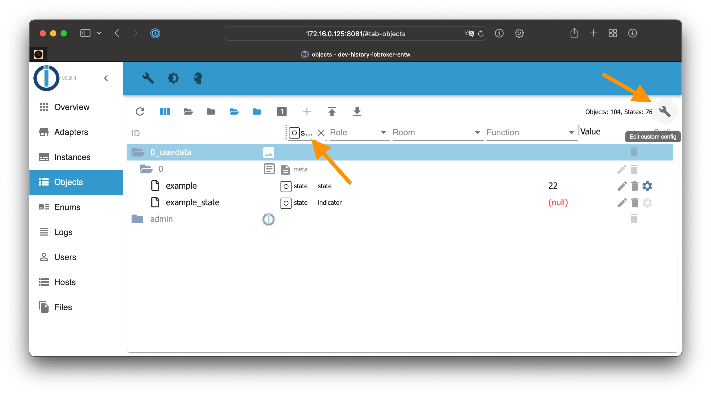

# IoBroker.история
* [Описание](#описание)
* [Конфигурация адаптера](#adapter-configuration)
* [Настройки хранилища](#storage-settings)
* [Настройки по умолчанию для штатов](#default-settings-for-states)
* [Настройки для штатов](#settings-for-states)
* [Использование](#использование)
* [Исторические данные](#history-Data)
* [Диаграмма](#диаграмма)
* [Включить ведение журнала для нескольких состояний одновременно](#enable-logging-for-multiple-states-once)
* [Доступ к значениям из адаптера Javascript](#access-values-from-javascript-adapter)
* [Управление журналом истории через Javascript](#history-logging-management-via-javascript)
* [Получить список включенных состояний](#get-list-of-enabled-states)
* [Перенос данных истории в SQL или InfluxDB](#migrate-history-data-to-sql-or-influxdb)

## Описание
Этот адаптер сохраняет историю состояний в двухэтапном процессе.

1. Сначала точки данных хранятся в оперативной памяти
2. как только они достигнут maxLength, они будут сохранены на диске

## Конфигурация адаптера
### Хранилище-Настройки


**Каталог хранения** Путь к каталогу, в котором будут храниться файлы.

Каталог будет создан относительно каталога по умолчанию ``/opt/iobroker/iobroker-data``.

Этот каталог будет содержать новый подкаталог для каждого нового дня, который содержит зарегистрированную информацию.

> Без определения пути данные будут храниться в расположении по умолчанию ``/opt/iobroker/iobroker-data/history``

> Также поддерживаются абсолютные пути, такие как ``/mnt/history`` (Linux) or ``D:/History`` (Windows)

> Пожалуйста, НЕ храните данные ни в каком каталоге ``node_modules``!

**Сохранить происхождение значения** Определяет, будет ли также храниться атрибут "от".

**Подтверждение значения магазина**

**Запишите значения NULL на границах начала/остановки**

### Настройки по умолчанию для состояний
Существуют настройки по умолчанию для каждого нового состояния, которое должно быть зарегистрировано.
Каждое значение впоследствии может быть изменено индивидуально для каждого состояния.


**Время устранения дребезга** Защита от нестабильных значений, чтобы гарантировать, что регистрируются только стабильные значения, когда значение не изменилось в течение определенного количества миллисекунд.

**Blocktime** Определяет, как долго после сохранения последнего значения не будут сохраняться никакие другие значения.
Когда заданное время в миллисекундах заканчивается, регистрируется следующее значение, которое выполняет все остальные проверки.

**По-прежнему записывать те же значения (секунды)** При использовании «Записывать только изменения» здесь можно установить временной интервал в секундах, после которого также неизмененные значения будут повторно зарегистрированы в БД.

**Минимальная разница с последним значением** При использовании «Записывать только изменения» вы можете определить необходимую минимальную разницу между новым значением и последним значением. Если это не достигнуто, значение не записывается.

**Хранилище** Сколько значений в прошлом будет храниться на диске. Данные удаляются по истечении времени, как только новые данные должны быть сохранены для точки данных.

**Максимальное количество точек данных в ОЗУ** Определите, сколько значений будет храниться в ОЗУ, прежде чем сохранять их на диске. Вы можете контролировать количество операций ввода-вывода. Это может быть полезно для систем, которые используют SD-карту для хранения, чтобы продлить срок службы.

**При запросе округлять числа до** Определите, до скольких цифр нужно округлить значения при запросе.

**Отключить протоколирование пропущенных значений, оптимизированное для построения диаграмм** ??

**Включить расширенные журналы отладки для точки данных** Если вы хотите видеть более подробные журналы для этой точки данных, вы можете включить этот параметр.
Вам все еще нужно включить уровень журнала «отладка», чтобы эти дополнительные значения были видны! Это помогает при отладке проблем или понимании того, почему адаптер регистрирует значение (или нет).

## Настройки для состояний
Настройки состояний, которые должны протоколироваться, определяются на вкладке «объекты».
Используйте символ шестеренки в самом правом столбце, чтобы настроить параметры ведения журнала.



Откроется следующий диалог:



**Включено** Активировать регистрацию состояния

**Время устранения дребезга** Защита от нестабильных значений, чтобы гарантировать, что регистрируются только стабильные значения, когда значение не изменилось в течение определенного количества миллисекунд.

**Blocktime** Определяет, как долго после сохранения последнего значения не будут сохраняться никакие другие значения.
Когда заданное время в миллисекундах заканчивается, регистрируется следующее значение, которое выполняет все остальные проверки.

**Записывать только изменения** Эта функция гарантирует, что регистрируются только измененные значения, если они соответствуют другим проверкам (см. ниже). Те же значения не будут регистрироваться.

**По-прежнему записывать те же значения (секунды)** При использовании «Записывать только изменения» здесь можно установить временной интервал в секундах, после которого также неизмененные значения будут повторно зарегистрированы в БД.

**Минимальная разница с последним значением** При использовании «Записывать только изменения» вы можете определить необходимую минимальную разницу между новым значением и последним значением. Если это не достигнуто, значение не записывается.

**Игнорировать значения ниже** Не записывать в журнал значения, которые меньше этого значения.

**Игнорировать указанные выше значения** Не заносить в журнал значения, превышающие это значение.

**Игнорировать 0 или пустые значения (==0)** Этот параметр предотвращает сохранение значений ``0`` or ``null`` в базе данных.

**Отключить протоколирование пропущенных значений, оптимизированное для построения диаграмм** ??

**Псевдоним-ID** Вы можете определить псевдоним для идентификатора. Это полезно, если вы сменили устройство и хотите вести непрерывную регистрацию данных.

**Хранилище** Сколько значений в прошлом будет храниться на диске. Данные удаляются по истечении времени, как только новые данные должны быть сохранены для точки данных.

**Максимальное количество точек данных в ОЗУ** Определите, сколько значений будет храниться в ОЗУ, прежде чем сохранять их на диске. Вы можете контролировать количество операций ввода-вывода. Это может быть полезно для систем, которые используют SD-карту для хранения, чтобы продлить срок службы.

**При запросе округлять числа до** Определите, до скольких цифр нужно округлить значения при запросе.

**Включить расширенные журналы отладки для точки данных** Если вы хотите видеть более подробные журналы для этой точки данных, вы можете включить этот параметр.
Вам все еще нужно включить уровень журнала «отладка», чтобы эти дополнительные значения были видны! Это помогает при отладке проблем или понимании того, почему адаптер регистрирует значение (или нет).

## Применение
### Данные истории
Щелчок по символу шестеренки объекта открывает настройки. Вы можете найти сохраненные данные истории истории во вкладке «данные истории»:



### Диаграмма
Для числовых состояний вы также можете использовать вкладку «диаграмма», которая будет отображать данные в виде графика.



## Включить ведение журнала сразу для нескольких состояний
Чтобы включить ведение журнала сразу для нескольких состояний, вы можете отфильтровать список объектов по типу «состояние».
После этого можно включить логирование сразу для всех состояний.

> Внимание: Большие установки могут содержать тысячи состояний. Включение ведения журнала сразу для многих состояний может занять много времени. Следующий процесс является лишь примером!

1. Переключитесь на просмотр списка на вкладке объектов
2. Фильтр по типу "состояние"
3. Щелкните значок гаечного ключа в правом верхнем углу, чтобы открыть конфигурацию параметров журнала.
4. Включите ведение журнала
5. Настройте дополнительные параметры, например «записывать только изменения».
6. Сохраните конфигурацию



## Доступ к значениям из адаптера Javascript
Доступ к значениям можно получить из установленного адаптера JavaScript. Примеры:

- Получить 50 последних сохраненных событий для всех идентификаторов

```javascript
sendTo('history.0', 'getHistory', {
    id: '*',
    options: {
        end:       Date.now(),
        count:     50,
        aggregate: 'onchange',
        addId:     true
    }
}, function (result) {
    for (var i = 0; i < result.result.length; i++) {
        console.log(result.result[i].id + ' ' + new Date(result.result[i].ts).toISOString());
    }
});
```

- Получить сохраненные значения для ``system.adapter.admin.0.memRss`` за последний час.

```javascript
var end = Date.now();
sendTo('history.0', 'getHistory', {
    id: 'system.adapter.admin.0.memRss',
    options: {
        start:      end - 3600000,
        end:        end,
        aggregate: 'onchange'
    }
}, function (result) {
    for (var i = 0; i < result.result.length; i++) {
        console.log(result.result[i].val + ' ' + new Date(result.result[i].ts).toISOString());
    }
});
```

Доступные Варианты:

- **start** - (необязательно) время в мс - *Date.now()*'
- **end** - (необязательно) время в мс - *Date.now()*', по умолчанию (сейчас + 5000 секунд)
- **шаг** - (необязательно) используется в сумме (макс., мин., среднее, общее, ...) шаг в мс интервалов
- **count** - количество значений, если агрегация 'onchange', или количество интервалов, если используется другой метод агрегации. Счетчик будет игнорироваться, если установлен шаг, иначе по умолчанию будет 500, если он не установлен.
- **from** - если поле *from* должно быть включено в ответ
- **ack** - если поле *ack* должно быть включено в ответ
- **q** - если поле *q* должно быть включено в ответ
- **user** - если поле *user* должно быть включено в ответ
- **comment** - если поле *c* должно быть включено в ответ
- **addId** - если поле *id* должно быть включено в ответ
- **limit** - не возвращать больше записей, чем лимит
- **round** - округлить результат до количества знаков после запятой
- **ignoreNull** - если нулевые значения должны быть включены (false), заменены последним ненулевым значением (true) или заменены на 0 (0)
- **removeBorderValues** — по умолчанию возвращаются дополнительные значения границ для оптимизации диаграммы. Установите для этого параметра значение true, если это не требуется (например, для обработки данных скрипта).
- **returnNewestEntries** — возвращаемые данные всегда сортируются по отметке времени по возрастанию. При использовании агрегата «нет», а также при указании «количества» или «ограничения» это означает, что обычно возвращаются самые старые записи (если не предоставлены «начальные» данные). Установите для этого параметра значение true, чтобы вместо этого получать самые новые записи.
- **aggregate** - метод агрегации (по умолчанию: 'average'):
    - *minmax* - используется специальный алгоритм. Разделите весь временной диапазон на небольшие интервалы и найдите для каждого интервала максимальное, минимальное, начальное и конечное значения.
    - *max* - Разбить весь временной диапазон на небольшие интервалы и найти для каждого интервала максимальное значение и использовать его для этого интервала (нулевые значения будут игнорироваться).
    - *min* - То же, что и max, но принимает минимальное значение.
    - *average* - То же, что и max, но берется среднее значение.
    - *total* - То же, что и max, но вычислить общее значение.
    - *count* - То же, что и max, но вычислить количество значений (будут вычислены нули).
    - *процентиль* - вычислить n-й процентиль (n указывается в options.percentile или по умолчанию равен 50, если не указан).
    - *quantile* - вычислить квантиль n (n задается в options.quantile или по умолчанию равен 0,5, если не указан).
    - *integral* - Вычислить интеграл (дополнительные параметры см. ниже).
    - *none* - Никакой агрегации. Только необработанные значения за данный период.
- **percentile** - (необязательно) при использовании агрегированного метода "percentile" определяет уровень процентиля (0..100) (по умолчанию 50)
- **quantile** - (необязательно) при использовании агрегированного метода "quantile" определяет уровень квантиля (0..1) (по умолчанию 0,5)
- **integralUnit** - (необязательный) при использовании агрегатного метода «интегральный» определяет единицу измерения в секундах (по умолчанию 60 с). например чтобы получить интеграл в часах для Втч или около того, установите значение 3600.
- **integralInterpolation** - (необязательно) при использовании агрегированного метода «интегральный» определяет метод интерполяции (по умолчанию «нет»).
    - *linear* - линейная интерполяция
    - *none* - нет/пошаговая интерполяция

Первая и последняя точки будут рассчитаны для агрегаций, кроме агрегации **нет**.
Если вы вручную запрашиваете некоторую агрегацию, вы должны игнорировать первое и последнее значения, поскольку они вычисляются из значений вне периода.

### StoreState
Если вы хотите записать другие данные в базу данных истории, вы можете использовать встроенную системную функцию **storeState**. Эту функцию также можно использовать для преобразования данных из других адаптеров истории, таких как история или SQL.

Успешный ответ не означает, что данные действительно записаны на диск. Это просто означает, что они были обработаны!

Указанные идентификаторы не проверяются в базе данных ioBroker и не нуждаются в настройке или включении там. Если собственные идентификаторы используются без настроек, то параметр «правила» не поддерживается и приведет к ошибке. Для таких идентификаторов по умолчанию используется «Максимальное количество хранимых в ОЗУ значений».

Сообщение может иметь один из следующих трех форматов:

- один идентификатор и один объект состояния
- один идентификатор и массив объектов состояния
- массив из нескольких идентификаторов с одним объектом состояния каждый

```javascript
sendTo('history.0', 'storeState', [
    id: 'mbus.0.counter.xxx',
    state: {ts: 1589458809352, val: 123, ack: false, from: 'system.adapter.whatever.0', ...}
], result => console.log('added'));

sendTo('history.0', 'storeState', {
    id: 'mbus.0.counter.xxx',
    state: [
      {ts: 1589458809352, val: 123, ack: false, from: 'system.adapter.whatever.0', ...},
      {ts: 1589458809353, val: 123, ack: false, from: 'system.adapter.whatever.0', ...}
    ]
}, result => console.log('added'));

sendTo('history.0', 'storeState', [
    {id: 'mbus.0.counter.xxx', state: {ts: 1589458809352, val: 123, ack: false, from: 'system.adapter.whatever.0', ...}},
    {id: 'mbus.0.counter.yyy', state: {ts: 1589458809353, val: 123, ack: false, from: 'system.adapter.whatever.0', ...}}
], result => console.log('added'));
```

Кроме того, вы можете добавить атрибут ``rules: true`` in message to activate all rules, like ``counter``, ``changesOnly``, ``de-bounce`` и так далее.

### Удалить состояния
Если вы хотите удалить записи из базы данных, вы можете использовать встроенную системную функцию **delete**:

```javascript
sendTo('history.0', 'delete', [
    {id: 'mbus.0.counter.xxx', state: {ts: 1589458809352},
    {id: 'mbus.0.counter.yyy', state: {ts: 1589458809353}
], result => console.log('deleted'));
```

Чтобы удалить ВСЕ данные истории для некоторой точки данных, выполните:

```javascript
sendTo('history.0', 'deleteAll', [
    {id: 'mbus.0.counter.xxx'}
    {id: 'mbus.0.counter.yyy'}
], result => console.log('deleted'));
```

Чтобы удалить данные истории для некоторой точки данных и для некоторого диапазона, выполните:

```javascript
sendTo('history.0', 'deleteRange', [
    {id: 'mbus.0.counter.xxx', start: '2019-01-01T00:00:00.000Z', end: '2019-12-31T23:59:59.999'},
    {id: 'mbus.0.counter.yyy', start: 1589458809352, end: 1589458809353}
], result => console.log('deleted'));
```

Время может быть мс с начала эпохи или строкой, которую можно преобразовать с помощью объекта Date javascript.

Значения будут удалены **включая установленные ограничения** (``ts >= start AND ts <= end``).

## Обновить состояния
Если вы хотите изменить значения, качество или флаг подтверждения в базе данных, вы можете использовать встроенную системную функцию **update**:

```javascript
sendTo('history.0', 'update', [
    {id: 'mbus.0.counter.xxx', state: {ts: 1589458809352, val: 15, ack: true, q: 0},
    {id: 'mbus.0.counter.yyy', state: {ts: 1589458809353, val: 16, ack: true, q: 0}
], result => console.log('deleted'));
```

``ts`` является обязательным. В объект состояния должен быть включен хотя бы один другой флаг.

## Управление журналом истории через Javascript
Адаптер поддерживает включение и отключение ведения журнала истории через JavaScript, а также получение списка включенных точек данных с их настройками.

### Включить
Сообщение требует наличия ``id`` точки данных. Кроме того, необязательный ``options`` для определения конкретных настроек точки данных:

```javascript
sendTo('history.0', 'enableHistory', {
    id: 'system.adapter.history.0.memRss',
    options: {
        changesOnly:  true,
        debounce:     0,
        retention:    31536000,
        maxLength:    3,
        changesMinDelta: 0.5,
        aliasId: ''
    }
}, function (result) {
    if (result.error) {
        console.log(result.error);
    }
    if (result.success) {
        //successfull enabled
    }
});
```

### Запрещать
Сообщение требует наличия ``id`` точки данных.

```javascript
sendTo('history.0', 'disableHistory', {
    id: 'system.adapter.history.0.memRss',
}, function (result) {
    if (result.error) {
        console.log(result.error);
    }
    if (result.success) {
        //successfull enabled
    }
});
```

## Получить список включенных состояний
Сообщение не имеет параметров.

```javascript
sendTo('history.0', 'getEnabledDPs', {}, function (result) {
    // result is an object. Example:
    {
        "system.adapter.history.0.memRss": {
            changesOnly: true,
            debounce: 0,
            retention: 31536000,
            maxLength: 3,
            changesMinDelta: 0.5,
            enabled: true,
            changesRelogInterval: 0,
            aliasId: ""
        }
    }
});
```

## Перенос данных истории в SQL или InfluxDB
### Главная идея
Когда у вас есть больше данных с течением времени, адаптер истории может быть не лучшим выбором, а реальная база данных лучше. Для этого есть еще адаптеры для хранения данных. Например. для баз данных SQL (PostgreSQL, MS-SQL, MySQL, SQLite) и InfluxDB.
С этим изменением возникает вопрос, как преобразовать собранные данные из прошлого в эти новые адаптеры.

Для этого некоторые скрипты преобразователя были помещены в каталог ``/opt/iobroker/node_modules/iobroker.history/converter`` that can help and do the job. These scripts are called from the command line with ``node``.

### Лучшая практика при выполнении преобразования
Если вы переходите от одного метода истории к другому, я предлагаю следующий процесс:

1. Активируйте новый метод истории (sql/influxdb) для соответствующих состояний, начните ведение журнала и убедитесь, что он работает должным образом. Это означает, что вы регистрируетесь «дважды» (в истории и новой цели).
2. Запустите сценарии анализа, чтобы получить «отсечки», в которых начинается дублирование регистрации.
3. Остановите адаптер истории и выполните миграцию (это может занять некоторое время). Таким образом, старые значения будут добавлены к новым.
4. Если вы уверены, что сделали что-то, а также проверили файлы ошибок: удалите данные истории, чтобы освободить место.

### Шаг 1: Подготовьте и проанализируйте существующие данные в целевом объекте передачи
При преобразовании данных следует передавать только те данные, которых еще нет. Поэтому существует первый набор скриптов под названием **analyze<db>.js**. Этот скрипт следует выполнить один раз в начале, чтобы собрать некоторые данные для существующих данных и сохранить их в локальных файлах .json, которые будут использоваться реальным скриптом конвертера.

Собираются два вида данных:

- **самое раннее значение для идентификатора точки данных**: метка времени самой первой записи.

для каждой существующей точки данных сохраняется и используется импортом для игнорирования всех новых значений по умолчанию. Предполагается, что данные заполняются полностью, начиная с этой первой записи, и все более ранние значения в противном случае будут дублироваться.
Это предположение может быть перезаписано при импорте по параметрам.

- **существующие значения за день для идентификатора точки данных**: анализируются существующие данные.

на ежедневной основе, и каждый день сохраняется там, где данные уже существуют. Это можно использовать в качестве альтернативы первым данным, чтобы также заполнить «дыры» в данных.

#### Анализировать инфлукс.js
Этот скрипт собирает упомянутые данные для экземпляра InfluxDB.

**Применение**:

``node analyzeinflux.js [InfluxDB-Instance] [Loglevel] [--deepAnalyze]``

**Пример**:

``node analyzeinflux.js influxdb.0 info --deepAnalyze``

Параметры:

- InfluxDB-Instance: какой экземпляр influxdb-Adapter следует использовать? (По умолчанию: influxdb.0) Если задано, это должен быть первый параметр после имени скрипта.
- Уровень журнала: уровень журнала для вывода (по умолчанию: информация). Если set должен быть вторым параметром после имени скрипта.
- ``--deepAnalyze``: также собирает существующие значения за день, по умолчанию запрашивается только самое раннее значение.

Затем скрипт сгенерирует один или три файла .json с собранными данными. Затем эти файлы используются реальным скриптом конвертера.

#### Анализироватьsql.js
Этот сценарий собирает упомянутые данные для экземпляра SQL.

**Применение**:

``node analyzesql.js [SQL-Instance] [Loglevel]``

**Пример**:

``node analyzesql.js sql.0 info``

Параметры:

- Экземпляр SQL: какой экземпляр адаптера SQL следует использовать? (По умолчанию: sql.0) Если задано, это должен быть первый параметр после имени скрипта.
- Уровень журнала: уровень журнала для вывода (по умолчанию: информация). Если set должен быть вторым параметром после имени скрипта.

Затем скрипт сгенерирует два файла .json с собранными данными. Эти файлы затем используются реальным скриптом конвертера.

### Преобразование данных истории в БД
Сценарий будет напрямую использовать сгенерированные файлы JSON из адаптера истории на диске для передачи их в базу данных. Кроме того, он использует предварительно сгенерированные файлы данных для уже существующих значений в целевой БД, чтобы преобразовать только несуществующие данные.

Сценарий можно запустить без какого-либо анализа (шаг 1) заранее, тогда вам нужно установить startdata в качестве параметра, и он просто преобразует что-либо с этого момента времени назад во времени.

Если вы уже запускали анализ и существует файл **earliestDBValues.json**, то преобразуются только эти точки данных, если вы не используете параметры для изменения этого.

Когда анализ выполнялся до этого и используются файлы данных, они также обновляются всеми преобразованными данными, поэтому второй запуск обычно не создает дубликатов.

Чтобы сбросить данные, удалите файл **earliestDBValues.json**, **existingDBValues.json** и/или **existingDBTypes.json**.

Затем конвертер возвращается назад во времени по всем дням, доступным в виде данных, и определяет, какие данные нужно передать в InfluxDB.

> Если вы хотите прервать процесс, вы можете нажать «x» или «<CTRL-C>».

Сам скрипт конвертера должен работать со всеми адаптерами History, которые поддерживают метод **storeState**.

> Примечание. Миграция большого количества данных создаст определенную нагрузку на систему, > особенно когда преобразователь и экземпляр целевой базы данных работают на одной машине.
> Контролируйте загрузку и производительность вашей системы во время действия и, возможно, используйте параметр > ``delayMultiplicator``, чтобы увеличить задержки в конвертере.

**Применение:**

``node history2db.js [DB-Instanz] [Loglevel] [Date-to-start|0] [path-to-Data] [delayMultiplicator] [--logChangesOnly [relog-Interval(m)]] [--ignoreExistingDBValues] [--processNonExistingValuesOnly] [--processAllDPs] [--simulate]``

**Пример**:

``node history2db.js influxdb.0 info 20161001 /path/to/data 2 --logChangesOnly 30 --processNonExistingValuesOnly``

Возможные опции и параметры:

- **Экземпляр БД**: Экземпляр БД для отправки данных. Обязательный параметр. Должен быть первым параметром после имени скрипта.
- **Loglevel**: уровень логирования для вывода (по умолчанию: информация). Если set должен быть вторым параметром после имени скрипта.
- **Дата начала**: день начала в формате `ггггммдд` (например, 20161028). Используйте «0», чтобы использовать обнаруженные самые ранние значения. Если установлен, должен быть третий параметр после имени скрипта.
- **path-to-Data**: путь к файлам данных. По умолчанию iobroker-install-directory/iobroker-data/history-data. Если set должен быть четвертым параметром после имени скрипта.
- **<delayMultiplicator>**: изменить задержки между несколькими действиями в скрипте с помощью множителя. «2» будет означать, что задержки, вычисленные конвертером, удваиваются. Если set должен быть пятым параметром после имени скрипта.
- **--logChangesOnly [relog-Interval(m)]**: при установке --logChangesOnly данные анализируются и сокращаются, поэтому в InfluxDB сохраняются только измененные значения. Кроме того, можно установить «relog-Interval(s)» в минутах, чтобы повторно регистрировать неизмененные значения после этого интервала.
- **--ignoreExistingDBValues**: С этим параметром все существующие данные игнорируются и все данные вставляются в БД. Пожалуйста, убедитесь, что дубликаты не создаются. Этот параметр полезен для исправления «дыр» в данных, где некоторые данные отсутствуют. По умолчанию он заполняет все точки данных хотя бы одной записью в БД. Это может быть перезаписано с помощью `--processAllDPs`
- **--processNonExistingValuesOnly**: с этим параметром файл «существующие точки данных по дням» из скрипта анализа используется и проверяется для каждого дня и точки данных. **В этом режиме существующие значения БД всегда игнорируются, а также не обновляются, поэтому выполните еще один анализ после использования этого режима!!!**
- **--processAllDPs**: С помощью этого параметра вы убедитесь, что все существующие точки данных из файлов истории перенесены в БД, даже если они еще не существуют в этой БД.
- **--simulate**: с помощью этого параметра вы включаете режим симуляции, что означает, что реальной записи не происходит, а также файлы данных анализа не будут обновляться при выходе.

## Changelog

### __WORK IN PROGRESS__
* (Apollon77) Fix getHistory when aggregations were used in some cases

### 2.2.4 (2022-09-19)
* (Apollon77) Update for future js-controller versions

### 2.2.3 (2022-09-12)
* (Apollon77) Fix error in history2db converter script

### 2.2.1 (2022-08-13)
* (Apollon77) Fix crash cases reported by Sentry
* (kleinOr) Updated converter scripts to work with influxdb 2.x

### 2.2.0 (2022-07-22)
* (Apollon77) make sure getHistory works for all cases
* (Bluefox/Apollon77) Add option to add comment and user info to results

### 2.1.7 (2022-06-27)
* (Apollon77) Allow to remove a configuration value for "round" in config again

### 2.1.6 (2022-06-27)
* (Apollon77) When not count is provided for aggregate "none" or "onchange" then the limit (default 2000) is used as count to define the number of data to return.

### 2.1.5 (2022-06-24)
* (Apollon77) Ignore errors from forked process after response was sent for GetHistory

### 2.1.4 (2022-06-12)
* (Apollon77) Make sure debug log is active according to the settings

### 2.1.3 (2022-06-08)
* (Apollon77) Huge performance optimizations for GetHistory calls

### 2.1.2 (2022-05-28)
* (Apollon77) Fix crash case reported by Sentry

### 2.1.1 (2022-05-27)
* (Apollon77) Fix crash case reported by Sentry

### 2.1.0 (2022-05-27)
* (Apollon77) Fix several crash cases reported by Sentry
* (Apollon77) Make sure disabling "Log changes only" also really do not log the changes anymore
* (Apollon77) Allow storeState and GetHistory also to be called for "unknown ids"

### 2.0.1 (2022-05-11)
* (Apollon77) BREAKING: Configuration is only working in the new Admin 5 UI!
* (Apollon77) Did bigger adjustments to the recording logic and added a lot of new Features. Please refer to Changelog and Forum post for details.
* (Apollon77) Make sure disabling "Log changes only" also really do not log the changes anymore

### 2.0.0 (2022-05-11)
* (Apollon77) BREAKING: Configuration is only working in the new Admin 5 UI!
* (Apollon77) BREAKING! Did bigger adjustments to the recording logic. Debounce is refined and blockTime is added to differentiate between the two checks
* (Apollon77) BREAKING! GetHistory requests now need to deliver the ts in milliseconds! Make sure to use up to date scripts and Charting UIs
* (Apollon77) New setting added to disable the "logging of additional values for charting optimization" - then only the expected data are logged
* (Apollon77) Add flag returnNewestEntries for GetHistory to determine which records to return when more entries as "count" are existing for aggregate "none"
* (Apollon77) Make sure id is always returned on GetHistory when addId is set
* (Apollon77) Add new Debug flag to enable/disable debug logging on datapoint level (default is false) to optimize performance
* (Apollon77) Add support to specify how to round numbers on query per datapoint
* (Apollon77) Add aggregate method "percentile" to calculate the percentile (0..100) of the values (requires options.percentile with the percentile level, defaults to 50 if not provided). Basically same as Quantile just different levels are used
* (Apollon77) Add aggregate method "quantile" to calculate the quantile (0..1) of the values (requires options.quantile with the quantile level, defaults to 0.5 if not provided). Basically same as Percentile just different levels are used
* (Apollon77) Add (experimental) method "integral" to calculate the integral of the values. Requires options.integralUnit with the time duration of the integral in seconds, defaults to 60s if not provided. Optionally a linear interpolation can be done by setting options.integralInterpolation to "linear"
* (Apollon77) When request contains flag removeBorderValues: true, the result then cut the additional pre and post border values out of the results
* (Apollon77) If storeState Message calls include a rules property then the new value is added with respecting all rules (incl. debounce, so be careful!)
* (Apollon77) Enhance the former "Ignore below 0" feature and now allow specifying to ignore below or above specified values. The old setting is converted to the new one
* (Apollon77) Allow to specify custom retention duration in days
* (Apollon77) Adjust handing for data files prior 1.1.2010 and automatically convert older ts formats to the new one
* (Apollon77) Adjust handling of data prior 1.1.2000 in the importer scripts
* (Apollon77) Make sure that min change delta allows numbers entered with comma (german notation) in all cases

### 1.11.1 (2022-03-26)
* (Apollon77) Fix the js-controller and admin minimum version

### 1.11.0 (2022-02-22)
* (bluefox) Added support deletion and changing of stored values.

### 1.10.6 (2022-02-19)
* (Apollon77) Prevent some crash cases reported by Sentry

### 1.10.5 (2021-12-19)
* (Excodibur) Hide settings not relevant when "log changes only" is not used
* (Apollon77) Allow all number values for debounce again

### 1.10.4 (2021-12-14)
* (bluefox) Support only `js.controller` >= 3.3.x
* (bluefox) Used system/custom view for collecting the objects
* (bluefox) Implemented option to ignore zero- or/and below zero- values

### 1.9.14 (2021-11-19)
* (Apollon77) Prevent crash cases reported by Sentry

### 1.9.13 (2021-04-19)
* (bluefox) Added the support of Admin5

### 1.9.12 (2021-01-17)
* (Apollon77) Optimize stop handling

### 1.9.10 (2020-07-28)
* (bluefox) Code formatting done
* (bluefox) Filtered out the acknowledgment and the quality from the getHistory call if not requested

### 1.9.9 (2020-06-29)
* (Apollon77) prevent crashes (Sentry IOBROKER-HISTORY-K, IOBROKER-HISTORY-J, IOBROKER-HISTORY-C, IOBROKER-HISTORY-G)

### 1.9.8 (2020-05-14)
* (bluefox) added command to read supported features

### 1.9.7 (2020-05-08)
* (bluefox) set default history if not yet set

### 1.9.6 (2020-05-04)
* (Apollon77) optimize retention directory logic again (Sentry IOBROKER-HISTORY-A)

### 1.9.5 (2020-04-30)
* (Apollon77) optimize retention directory logic again (Sentry IOBROKER-HISTORY-7)

### 1.9.4 (2020-04-23)
* (Apollon77) Catch error when Storage directory can not be created (Sentry IOBROKER-HISTORY-1)
* (Apollon77) make sure internal structures are initialized correctly (Sentry IOBROKER-HISTORY-2)
* (Apollon77) make sure to handle cases where retention directory is not existing (Sentry IOBROKER-HISTORY-3)

### 1.9.3 (2020-04-19)
* __Requires js-controller >= 2.0.0__
* (foxriver76) removed usage of adapter.objects
* (Apollon77) check if objects have changed and ignore unchanged
* (Apollon77) adjust allowed file system names
* (Apollon77) Add Sentry for Error Reporting with js-controller 3.0
* (Apollon77) Make sure value undefined is ignored

### 1.8.7 (2019-09-02)
* (paul53) old files should be deleted automatically

### 1.8.6 
* Fix several smaller issues and optimized some texts

### 1.8.5 (2018-07-02)
* (Apollon77) Error fixed in storeState

### 1.8.4 (2018-06-24)
* (Apollon77) Fixing/allow to disable writing of start and end values

### 1.8.0 (2018-06-19/24)
* (Apollon77) Add option to write data to a different ID to make device changes easier. Retrieving data works for both IDs

### 1.7.4 (2018-04-03)
* (AlCalzone) Fix filename handling for states with special characters

### 1.7.3 (2018-03-28)
* (Apollon77) Respect 'keep forever' setting for retention from datapoint configuration

### 1.7.2 (2018-02-05)
* (bondrogeen) Admin3 Fixes

### 1.7.1 (2018-01-31)
* (Bluefox) Admin3 Fixes

### 1.7.0 (2018-01-17)
* (bluefox) Ready for Admin3

### 1.6.6 (2017-12-20)
* (bluefox) translations

### 1.6.5 (2017-10-05)
* (Apollon77) fix relog value feature

### 1.6.4 (2017-08-12)
* (bluefox) add "save last value" option

### 1.6.3 (2017-08-03)
* (Apollon77) fix behaviour of log interval to always log the current value

### 1.6.2 (2017-04-07)
* fix in datatype conversions

### 1.6.0 (2017-02-28)
* (Apollon77) Replace some characters in history filenames

### 1.5.3 (2017-02-22)
* (Apollon77) Small fix for older configurations

### 1.5.2
* (Apollon77) Enhance Min-Delta logic for datapoints from type mixed

### 1.5.1 (2017-01-16)
* (bluefox) Fix handling of float values in Adapter config and Datapoint config.

### 1.5.0 (2016-12-01)
* (Apollon77) Add messages enableHistory/disableHistory
* (Apollon77) add support to log changes only if value differs a minimum value for numbers
* (Apollon77) Fixing aggregate calculation

### 1.4.0 (2016-10-29)
* (Apollon77) add option to re-log unchanged values to make it easier for visualization
* (Apollon77) added converter scripts to move history data to db

### 1.3.1 (2016-09-25)
* (Apollon77) Fixed: ts is assigned as val
* (bluefox) Fix selector for history objects

### 1.3.0 (2016-08-30)
* (bluefox) сompatible only with new admin

### 1.2.0 (2016-08-27)
* (bluefox) change name of object from history to custom

### 1.1.0 (2016-08-27)
* (bluefox) fix aggregation of last point
* (bluefox) aggregation none just deliver the raw data without any aggregation

### 1.0.5 (2016-07-24)
* (bluefox) fix aggregation on large intervals

### 1.0.4 (2016-07-05)
* (bluefox) fix aggregation on seconds

### 1.0.3 (2016-05-31)
* (bluefox) draw line to the end if ignore null

### 1.0.2 (2016-05-29)
* (bluefox) switch max and min with each other

### 1.0.1 (2016-05-28)
* (bluefox) calculate end/start values for "on change" too

### 1.0.0 (2016-05-20)
* (bluefox) change default aggregation name

### 0.4.1 (2016-05-14)
* (bluefox) support sessionId

### 0.4.0 (2016-05-05)
* (bluefox) use aggregation file from sql adapter
* (bluefox) fix the values storage on exit
* (bluefox) store all cached data every 5 minutes
* (bluefox) support of ms

### 0.2.1 (2015-12-14)
* (bluefox) add description of settings
* (bluefox) place aggregate function into separate file to enable sharing with other adapters
* (smiling-Jack) Add generate Demo data
* (smiling-Jack) get history in own fork
* (bluefox) add storeAck flag
* (bluefox) mockup for onchange

### 0.2.0 (2015-11-15)
* (Smiling_Jack) save and load in adapter and not in js-controller
* (Smiling_Jack) aggregation of data points
* (Smiling_Jack) support of storage path

### 0.1.3 (2015-02-19)
* (bluefox) fix small error in history (Thanks on Dschaedl)
* (bluefox) update admin page

### 0.1.2 (2015-01-20)
* (bluefox) enable save&close button by config

### 0.1.1 (2015-01-10)
* (bluefox) check if state was not deleted

### 0.1.0 (2015-01-02)
* (bluefox) enable npm install

### 0.0.8 (2014-12-25)
* (bluefox) support of de-bounce interval

### 0.0.7 (2014-11-01)
* (bluefox) store every change and not only lc != ts

### 0.0.6 (2014-10-19)
* (bluefox) add configuration page

## License

The MIT License (MIT)

Copyright (c) 2014-2022 Bluefox <dogafox@gmail.com>, Apollon77

Copyright (c) 2016 Smiling_Jack

Copyright (c) 2014 hobbyquaker

Permission is hereby granted, free of charge, to any person obtaining a copy
of this software and associated documentation files (the "Software"), to deal
in the Software without restriction, including without limitation the rights
to use, copy, modify, merge, publish, distribute, sublicense, and/or sell
copies of the Software, and to permit persons to whom the Software is
furnished to do so, subject to the following conditions:

The above copyright notice and this permission notice shall be included in
all copies or substantial portions of the Software.

THE SOFTWARE IS PROVIDED "AS IS", WITHOUT WARRANTY OF ANY KIND, EXPRESS OR
IMPLIED, INCLUDING BUT NOT LIMITED TO THE WARRANTIES OF MERCHANTABILITY,
FITNESS FOR A PARTICULAR PURPOSE AND NONINFRINGEMENT. IN NO EVENT SHALL THE
AUTHORS OR COPYRIGHT HOLDERS BE LIABLE FOR ANY CLAIM, DAMAGES OR OTHER
LIABILITY, WHETHER IN AN ACTION OF CONTRACT, TORT OR OTHERWISE, ARISING FROM,
OUT OF OR IN CONNECTION WITH THE SOFTWARE OR THE USE OR OTHER DEALINGS IN
THE SOFTWARE.