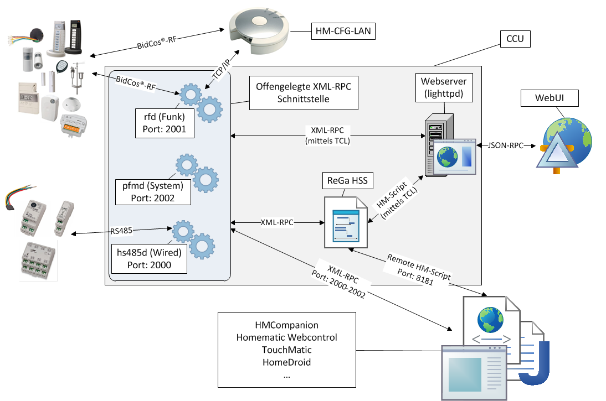
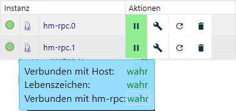

# HomeMatic RPC
## Homematic
> Homematic - это система умного дома eQ-3, которая обеспечивает полный контроль над широким спектром функций, от сценариев (от простых до сложных) в доме или квартире.

&gt; Устройства включают продукты для управления освещением, рольставнями и обогревом, детекторы опасности, датчики безопасности и продукты для измерения погодных данных. Радиосвязь упрощает модернизацию. В новых зданиях могут использоваться компоненты проводной шины. <a href="https://www.eq-3.de/produkte/homematic.html" title="Домашняя страница производителя eQ3">источник</a>

## Администрирование и контроль компонентов homematic с помощью ioBroker
Для оптимального управления и контроля компонентов homematic с помощью ioBroker требуются два адаптера:

### 1. Homematic ReGaHss
Этот адаптер подключается к гомематическому логическому слою "ReGaHSS" (** Re **sidential** Gateway).
Он синхронизирует реальные имена, системные переменные, комнаты, сделки и программы между Homematic и ioBroker.

### 2. Homematic RPC
** R ** emote ** P ** rocedur ** C ** all, RPC для краткости - это метод реализации межпроцессного взаимодействия. Этот адаптер обеспечивает подключение к коммуникационным модулям центрального блока homematic (CCU / CCU2 / CCU3 ...). Поддерживаются модули rfd (радио), HMIP-rfd, hs485d (проводной), CuxD (дополнительное программное обеспечение для подключения внешних компонентов, таких как EnOcean, FS20 и т. Д.) И Homegear (замена CCU).

Эта диаграмма иллюстрирует структуру и интерфейсы связи:

[источник](http://www.wikimatic.de/wiki/Datei:Homematic_Aufbau.png)

## Адаптер Homematic RPC
Этот адаптер обеспечивает подключение к коммуникационным модулям центрального блока homematic (CCU / CCU2 / CCU3 ...). Экземпляр адаптера отвечает только за включенные модули (RFD, проводной и т. Д.). Если несколько модулей должны поддерживаться параллельно, для каждого модуля должен быть установлен отдельный экземпляр.

Адаптер связывается с соответствующим модулем через BIN-RPC или XML-RPC. Поскольку используется интерфейс событий, правильная адресация важна. Таким образом, события автоматически передаются на адаптер, и циклический опрос не требуется.

Кроме того, адаптер имеет функции для циклического контроля подключения к CCU.

Если новые устройства обучаются в CCU, то адаптер должен быть перезапущен с конфигурацией «Инициируйте новые устройства (один раз)». Это позволит передать информацию с новых устройств homematic на адаптер.

## Конфигурация
### Основные настройки
### HomeMatic address
IP-адрес CCU или хоста, на котором запущен сервис Homematic BidCos.

### HomeMatic Port
Настройка порта зависит от требуемого модуля связи, вводится автоматически при выборе демона и должна изменяться только в том случае, если порты отличаются от стандартных.

По умолчанию предоставляются следующие порты:

| Модуль связи | Стандартный порт | Порт HTTPS |
|---------------------|--------------|------------|
| Радио (RFD) | 2001 | 42001 |
| Проводной | 2000 | 42000 |
| CUxD | 8701 | \ - |
| Homematic IP | 2010 | 42010 |

### Демон
CCU / Homematic поддерживает различные типы устройств (проводные, беспроводные, HMIP, CUxD). Для каждого типа должен быть создан отдельный экземпляр.

### Протокол
Для связи предусмотрено два протокола: XML-RPC и BIN-RPC.

* CUxD требует протокола BIN-RPC; HMIP и RFD протокол XML-RPC. *

### Синхронизировать устройства снова (один раз)
При первом запуске адаптера все устройства считываются. Если позже в CCU будут сделаны изменения (переименование устройств, добавление новых устройств и т. Д.), Активируйте этот выбор и перезапустите адаптер с помощью «Сохранить и закрыть».

### Адрес адаптера
Выпадающее меню выбирает IP хоста, на котором установлен адаптер. Выбор «0.0.0.0 Listen to all IPs» и «127.0.0.1» зарезервирован для особых случаев.

### Порт адаптера
По умолчанию порт «0» установлен здесь для автоматического выбора порта ioBroker и должен изменяться только в исключительных случаях.

## Дополнительные настройки
### Адрес обратного вызова адаптера
Если ioBroker работает за маршрутизатором (например, в контейнере Docker), адреса входа и выхода могут отличаться. Если здесь введен IP-адрес маршрутизатора, проблемы можно избежать, поскольку маршрутизатор переходит к пересылке в ioBroker.

### Интервал проверки соединения (сек)
С заданным интервалом запрос проверки связи отправляется в CCU.

### Интервал повторного подключения (сек)
Время, после которого начинается новая попытка подключения.

### Не удалять устройства
По умолчанию устройства также удаляются из списка объектов, если они были изучены в CCU. Чтобы сохранить эти устройства в списке объектов, например, потому что они были только временно удалены, эту опцию можно активировать.

### Использовать HTTPS
Если эта опция активирована, защищенное соединение установлено.
Работает только с протоколом XML-RPC.

### Имя пользователя и пароль
При использовании HTTPS или если API CCU требует аутентификации, данные должны быть введены здесь.

## Экземпляр

В разделе *Экземпляры* ioBroker вы найдете установленный экземпляр адаптера. Слева светофорная система визуализирует, активирован ли адаптер и подключен ли он к CCU.

Если вы поместите указатель мыши на символ, вы получите подробную информацию.

## Объекты адаптера
В области «Объекты» все значения и информация, передаваемые блоком управления в адаптер, отображаются в виде древовидной структуры.

Отображаемые объекты и значения зависят от устройств (функции и каналов) и структуры внутри CCU.

Панель управления помечена идентификатором BidCoS-RF (который включает в себя все виртуальные ключи), устройства создаются под их серийным номером, а группы помечены INT000000 *x*

### Канал 0 (все устройства)
Этот канал создается для каждого устройства и содержит функциональные данные после краткого обзора:

| *Точка данных* | *Значение* |
|--------------------------------|--------------------------------------------------------|
| AES_Key | Зашифрованная активация активная / неактивная |
| Config (Ожидание / Ожидание тревоги) | В ожидании конфигурации |
| Dutycycle / Dutycycle Alarm | Airtime Homematic Devices |
| RSSI (Device / Peer) | Радиосила (устройство \ <-> Центральная) |
| Low Bat / Low Bat Alarm | низкий заряд батареи |
| Липкая недостижимая / недоступная тревога | Ошибка связи с системным сообщением (произошла ошибка) |
| Достигнуть / Достигнуть тревоги | Ошибка связи системного сообщения (текущее состояние) |

### Каналы 1-6
Здесь перечислены измеренные значения, данные управления и состояния; в зависимости от функции устройства отображаются разные данные. Вот короткая выдержка:

| *Функция* | *Канал* | *Возможные значения* |
|-------------------------|---------|-----------------------------------------------------------|
| Датчики | 1 | Температура, влажность, уровень, условия открытия и т. Д. |
| Нагревательные термостаты | 4 | Режимы работы, заданная / фактическая температура, положение клапана и т. Д. |
| Приводы | 1 | Уровень (рольставни, диммеры), направление движения (рольставни) и т. Д. |
| Приборы с измерительной функцией | 3 | Статус |
| | 6 | Расходомер, напряжение, мощность и т. Д. |

## FAQ

## License

The MIT License (MIT)

Copyright (c) 2014-2021 bluefox <dogafox@gmail.com>

Copyright (c) 2014 hobbyquaker

Permission is hereby granted, free of charge, to any person obtaining a copy
of this software and associated documentation files (the "Software"), to deal
in the Software without restriction, including without limitation the rights
to use, copy, modify, merge, publish, distribute, sublicense, and/or sell
copies of the Software, and to permit persons to whom the Software is
furnished to do so, subject to the following conditions:

The above copyright notice and this permission notice shall be included in
all copies or substantial portions of the Software.

THE SOFTWARE IS PROVIDED "AS IS", WITHOUT WARRANTY OF ANY KIND, EXPRESS OR
IMPLIED, INCLUDING BUT NOT LIMITED TO THE WARRANTIES OF MERCHANTABILITY,
FITNESS FOR A PARTICULAR PURPOSE AND NONINFRINGEMENT. IN NO EVENT SHALL THE
AUTHORS OR COPYRIGHT HOLDERS BE LIABLE FOR ANY CLAIM, DAMAGES OR OTHER
LIABILITY, WHETHER IN AN ACTION OF CONTRACT, TORT OR OTHERWISE, ARISING FROM,
OUT OF OR IN CONNECTION WITH THE SOFTWARE OR THE USE OR OTHER DEALINGS IN
THE SOFTWARE.