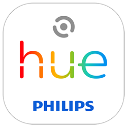
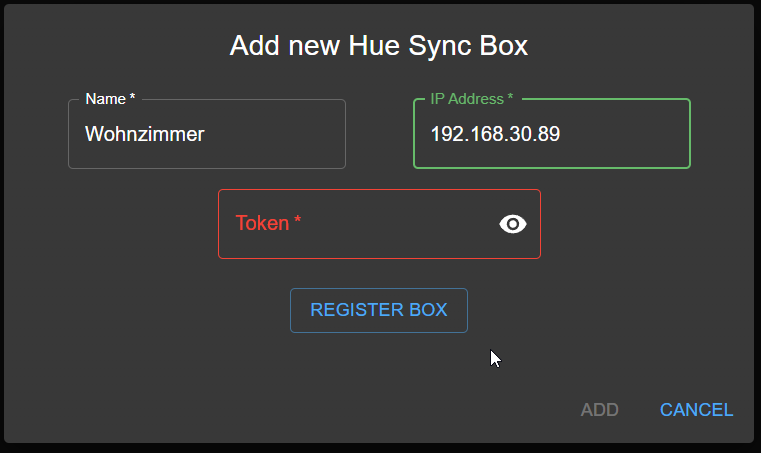
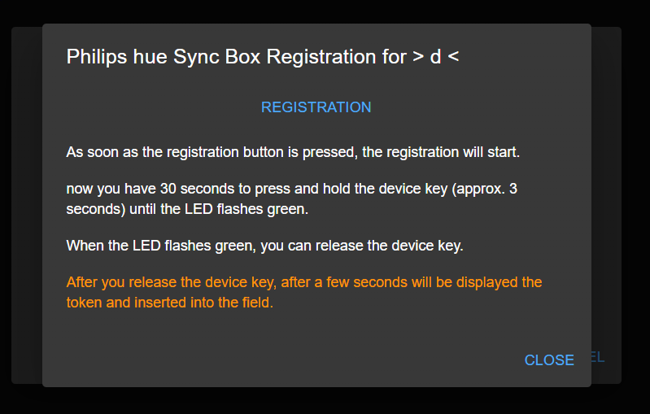
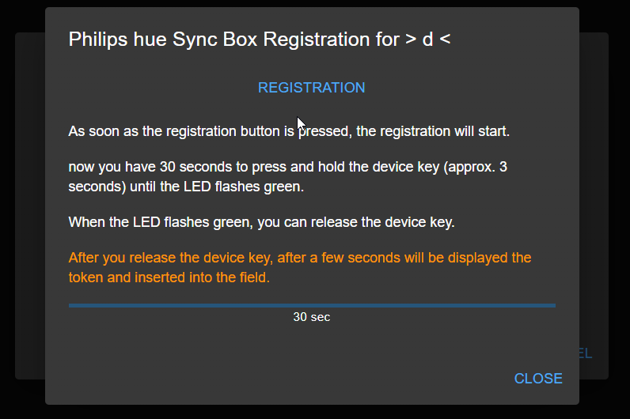
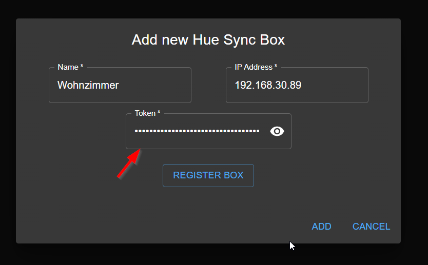
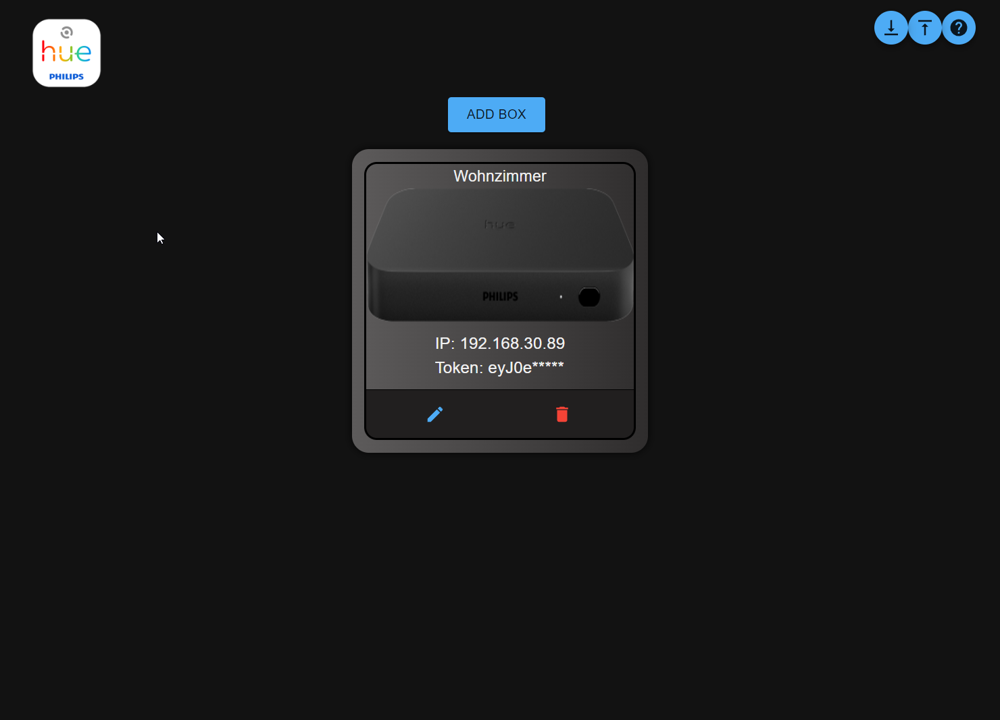
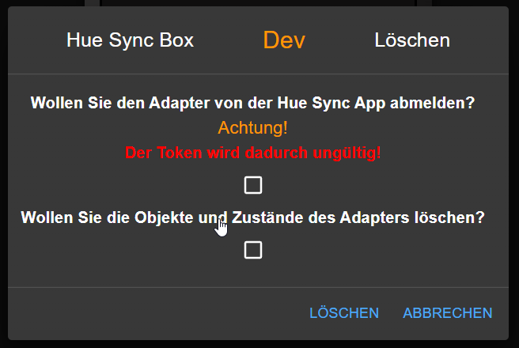

# ioBroker.hue-sync-box

## Адаптер hue-sync-box для ioBroker

**Этот адаптер использует библиотеки Sentry для автоматического сообщения разработчикам об исключениях и ошибках в коде.** Более подробную информацию, а также инструкции по отключению отправки сообщений об ошибках см. [в документации Sentry-Plugin](https://github.com/ioBroker/plugin-sentry#plugin-sentry) ! Система отчетности Sentry используется начиная с js-controller 3.0.

## Для работы адаптера требуется версия Node.js >= 16.x.

### Что такое Philips Hue Sync Box?

Philips Hue Sync Box — это устройство, позволяющее синхронизировать цвета и световые эффекты ваших светильников Philips Hue с экраном компьютера. Это возможно благодаря тому, что Sync Box распознает цвета и световые эффекты вашего экрана и передает их на ваши светильники Philips Hue.

### Что умеет этот адаптер?

Адаптер опрашивает API Philips Hue Sync Box каждые 15 секунд и соответствующим образом обновляет точки данных. Некоторые точки данных могут изменять настройки Sync Box (например, переключатель включения/выключения синхронизации, переключение входов HDMI и т. д.). Любое изменение точек данных немедленно отправляется в Philips Hue Sync Box и запускает обновление точек данных. Можно создать несколько устройств Philips Hue Sync Box одновременно.

## Что необходимо для использования адаптера?

- IP-адрес Philips Hue Sync Box (только IPv4)
- Токен для Hue Sync Box (см. ниже)

## Как подключить Philips Hue Sync Box к адаптеру?

1. Откройте настройки адаптера и нажмите кнопку «Добавить поле».
2. Введите название для поля; название должно состоять только из одного символа, так как оно будет использоваться в качестве идентификатора.
3. Введите IP-адрес устройства. (Только IPv4) (небольшая подсказка: при вводе IP-адреса точка будет автоматически вставляться после каждой третьей цифры)

   
4. Нажмите на кнопку`register box` Откроется новое окно, где вы сможете зарегистрировать устройство (см. ниже).
5. Как только кнопка`registration` После нажатия кнопки начинается процесс, затем у вас есть 30 секунд, чтобы нажать кнопку на устройстве и удерживать её около 3 секунд, пока светодиод не начнет мигать зеленым. (см. ниже)
6. После того, как вы отпустите кнопку устройства, через несколько секунд на экране отобразится токен, который затем будет вставлен в соответствующее поле (см. ниже).
7. Теперь вы можете нажать на кнопку.`add` и поле будет добавлено, после чего вам останется только нажать на кнопку.`save` для сохранения конфигурации.

## Удалите блок Hue Sync из адаптера.

### Внимание! Для корректной работы удаления с указанными опциями токен должен быть создан с помощью функции регистрации адаптера.

1. Откройте настройки адаптера и нажмите на кнопку «Удалить», значок корзины.
2. Откроется новое окно с двумя вариантами. Выберите нужный вариант. Если ни один из вариантов не выбран, флажок будет просто удалён из конфигурации. (см. ниже)
   - `deregister from the box` - Устройство будет удалено из адаптера, и токен также будет удален из устройства.
   - `delete object` - Блок будет удален из адаптера, а объекты будут удалены из ioBroker.

Вы также можете выбрать оба варианта одновременно, тогда блок будет удален из адаптера, объекты будут удалены из ioBroker, а токен будет удален из блока.

## Changelog
<!--
	Placeholder for the next version (at the beginning of the line):
	### **WORK IN PROGRESS**
-->
### 0.3.5 (2023-02-06)
* (xXBJXx) Dependency update

### 0.3.4 (2023-01-15)
* (xXBJXx) fixed Sentry error reporting

### 0.3.3 (2023-01-14)
* (xXBJXx) fixed a bug

### 0.3.2 (2023-01-13)
* (xXBJXx) update dependencies
* (xXBJXx) Log output extended and improved
* (xXBJXx) Added data point for the response JSON
* (xXBJXx) Added data point "Reachable" to check if the box is reachable

### 0.3.1 (2022-12-20)
* (xXBJXx) Fixed error message that occurs after a successful registration.

### 0.3.0 (2022-12-20)
* (xXBJXx) added delete function for objects and Token
* (xXBJXx) added funktion for sync the `execution.intensity` state

### 0.2.1 (2022-12-17)
* (xXBJXx) typo corrected in README
* (xXBJXx) Fixed a bug when sending commands to the box

### 0.2.0 (2022-12-17)
* (xXBJXx) Optimization and improvement of the registration process

### 0.1.0 (2022-12-16)
* (Issi) First release

## License
MIT License

Copyright (c) 2022-2023 Issi <issi.dev.iobroker@gmail.com>

Permission is hereby granted, free of charge, to any person obtaining a copy
of this software and associated documentation files (the "Software"), to deal
in the Software without restriction, including without limitation the rights
to use, copy, modify, merge, publish, distribute, sublicense, and/or sell
copies of the Software, and to permit persons to whom the Software is
furnished to do so, subject to the following conditions:

The above copyright notice and this permission notice shall be included in all
copies or substantial portions of the Software.

THE SOFTWARE IS PROVIDED "AS IS", WITHOUT WARRANTY OF ANY KIND, EXPRESS OR
IMPLIED, INCLUDING BUT NOT LIMITED TO THE WARRANTIES OF MERCHANTABILITY,
FITNESS FOR A PARTICULAR PURPOSE AND NONINFRINGEMENT. IN NO EVENT SHALL THE
AUTHORS OR COPYRIGHT HOLDERS BE LIABLE FOR ANY CLAIM, DAMAGES OR OTHER
LIABILITY, WHETHER IN AN ACTION OF CONTRACT, TORT OR OTHERWISE, ARISING FROM,
OUT OF OR IN CONNECTION WITH THE SOFTWARE OR THE USE OR OTHER DEALINGS IN THE
SOFTWARE.