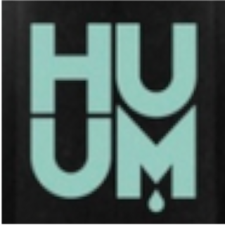

# ioBroker.huum-sauna

Этот адаптер интегрирует устройство управления сауной HUUM в iobroker. Спецификацию устройства HUUM для управления сауной можно найти [здесь](https://huum.de/) . Описание API можно найти ( [github.com/horemansp/HUUM](https://github.com/horemansp/HUUM) ).

## Параметры

- 1 + 2 Учетные данные пользователя для веб-страницы HUUM " <https://api.huum.eu/action/home/> "
- 3 обновления... Обновите страницу, чтобы загрузить данные HUUM с устройства.
- 4 световых пути... Дополнительный световой путь (состояние) для переключения внешнего освещения. Если пусто, используется метод переключения HUUM.
- 5\. AstroLight. При установке подсветка автоматически включается с закатом (для саун на открытом воздухе).

## Пример использования

## [Список изменений](https://github.com/Chris-656/ioBroker.huum-sauna/blob/main/CHANGELOG.md)

\-->

## Changelog

### 0.5.0 (2025-02-23)
- updated dependencies
- js-controller
- core

### 0.4.5 (2023-10-31)
- Fixed login with no sauna defined
- Steamer Error -> setting humdidity to 0, old version otherwise sauna will be switched off

### 0.4.4 (2023-02-12)
- adapted temp reached when sauna is stopped from the app
- added an offset for temp reached value when use the intelligent sauna mode

### 0.4.3 (2023-01-31)
- Fixed Switchlight when lightpath is empty

### 0.4.2 (2022-09-25)
- Fixes on presets, no more states for the setting

### 0.4.1 (2022-09-25)
-  Added new Preset states for steam or dry saunamode

### 0.4.0 (2022-08-21)
- fixed light external state issue

### 0.3.9 (2022-08-20)
- added steamerError, when error occurs sauna is switched off and a warning is documented
- saftey issue, reduce targettemperatur when in steam mode
- some minor changes

### 0.3.8 (2022-08-04)
- Add Sauna Sleep Refresh Time as parameter, when set to 0 there is no traffic otherwise update in minutes

### 0.3.7 (2022-02-26)
- add Sauna Images -> adapted from icons-mfd-svg Images
- added sleepRefresh when Sauna is switched off to reduce network traffic (30 minutes)

### 0.3.6 (2022-02-20)
- release script
- fixes

### 0.3.1 (2022-02-20)
- included automated switch on light

### 0.3.0 (2022-02-13)
- create stable version

### 0.2.1 (2022-01-30)
- create npm package

### 0.2.0 (2022-01-30)  - 2022 Release
- minor Version created

### 0.1.10 (2022-01-30)
- added Trigger (state targetTempReached) when sauna temperature is reached
- Minor bug fixes and code revisions

### 0.1.7
- starting sauna with target temperature and humidity
- switch on light in sauna (also on separat id)
- subscribe also foreign state id
- minor bugs and code revision

### 0.1.6
- starting sauna with target temperature
- switch on light in sauna (also on separat id)
- get sauna status

### 0.1.0
- initial version

<!--

## License
Copyright (c) 2025 Chris <besterquester@live.at>

Permission is hereby granted, free of charge, to any person obtaining a copy
of this software and associated documentation files (the "Software"), to deal
in the Software without restriction, including without limitation the rights
to use, copy, modify, merge, publish, distribute, sublicense, and/or sell
copies of the Software, and to permit persons to whom the Software is
furnished to do so, subject to the following conditions:

The above copyright notice and this permission notice shall be included in all
copies or substantial portions of the Software.

THE SOFTWARE IS PROVIDED "AS IS", WITHOUT WARRANTY OF ANY KIND, EXPRESS OR
IMPLIED, INCLUDING BUT NOT LIMITED TO THE WARRANTIES OF MERCHANTABILITY,
FITNESS FOR A PARTICULAR PURPOSE AND NONINFRINGEMENT. IN NO EVENT SHALL THE
AUTHORS OR COPYRIGHT HOLDERS BE LIABLE FOR ANY CLAIM, DAMAGES OR OTHER
LIABILITY, WHETHER IN AN ACTION OF CONTRACT, TORT OR OTHERWISE, ARISING FROM,
OUT OF OR IN CONNECTION WITH THE SOFTWARE OR THE USE OR OTHER DEALINGS IN THE
SOFTWARE.