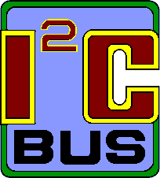

# IoBroker.i2c
**Тесты:** 

## Адаптер I2C для ioBroker
Осуществляет связь с устройствами по шине I2C.

## Руководство разработчика
Этот раздел предназначен для разработчика. Его можно удалить позже.

### ОТКАЗ ОТ ОТВЕТСТВЕННОСТИ
Пожалуйста, убедитесь, что вы учитываете авторские права и товарные знаки при использовании названий или логотипов компаний, и добавьте отказ от ответственности в файл README.
Вы можете посмотреть примеры в других адаптерах или задать вопрос в сообществе разработчиков. Использование названия или логотипа компании без разрешения может повлечь за собой юридические проблемы.

### Начиная
Вы почти закончили, осталось всего несколько шагов:

1. Создайте новый репозиторий на GitHub с именем `ioBroker.i2c`.
1. Инициализируйте текущую папку как новый репозиторий Git:

```bash
git init -b master
git add .
git commit -m "Initial commit"
```

1. Свяжите свой локальный репозиторий с репозиторием на GitHub:

```bash
git remote add origin https://github.com/UncleSamSwiss/ioBroker.i2c
```

1. Загрузите все файлы в репозиторий GitHub:

```bash
git push origin master
```

1. Добавьте новый секретный ключ по адресу https://github.com/UncleSamSwiss/ioBroker.i2c/settings/secrets. Он должен называться `AUTO_MERGE_TOKEN` и содержать персональный токен доступа с возможностью отправки изменений в репозиторий, например, ваш собственный. Создать новый токен можно по адресу https://github.com/settings/tokens.

1. Перейдите в файл [main.js](main.js) и начинайте программировать!

### Передовые методы
Мы собрали несколько статей по теме ioBroker и программированию в целом. Если вы новичок в ioBroker или Node.js, вам стоит с ними ознакомиться. Если вы уже опытный пользователь, вам тоже стоит их посмотреть — возможно, вы узнаете что-то новое :)

### Роли государства
При создании объектов состояния важно использовать правильную роль для состояния. Роль определяет, как состояние должно интерпретироваться визуализациями и другими адаптерами. Список доступных ролей и их значений см. в разделе [документация по государственным ролям](https://www.iobroker.net/#en/documentation/dev/stateroles.md).

**Важно:** Не придумывайте собственные названия ролей. Если вам нужна роль, которой нет в официальном списке, обратитесь в сообщество разработчиков ioBroker за рекомендациями и обсуждением добавления новых ролей.

### Скрипты в `package.json`
Для вашего удобства предопределено несколько npm-скриптов. Вы можете запустить их, используя `npm run <scriptname>`

| Название скрипта | Описание |
| `check` | Выполняет проверку типов вашего кода (без компиляции). |
| `test:ts` | Выполняет тесты, определенные вами в файлах `*.test.ts`. |
| `test:package` | Гарантирует, что ваши `package.json` и `io-package.json` действительны. |
| `test:integration` | Проверяет запуск адаптера с реальным экземпляром ioBroker. |
| `test` | Выполняет минимальный запуск тестирования файлов пакета и ваших тестов. |
| `lint` | Запускает `ESLint` для проверки вашего кода на наличие ошибок форматирования и потенциальных багов. |
| `translate` | Переводит тексты в вашем адаптере на все необходимые языки. Подробнее см. [`@iobroker/adapter-dev`](https://github.com/ioBroker/adapter-dev#manage-translations). |
| `release` | Создает новый релиз, подробности см. в [`@alcalzone/release-script`](https://github.com/AlCalzone/release-script#usage). |
| `release` | Создает новый релиз. Подробнее см. [`@alcalzone/release-script`](https://github.com/AlCalzone/release-script#usage). |

### Написание тестов
Правильно проведенное тестирование кода бесценно, поскольку оно дает вам уверенность в внесении изменений в код, при этом вы точно знаете, сломается ли что-то и когда это произойдет. Хорошая статья на тему разработки через тестирование — https://hackernoon.com/introduction-to-test-driven-development-tdd-61a13bc92d92.
Хотя написание тестов до написания кода может показаться странным на первый взгляд, у этого подхода есть очевидные преимущества.

Этот шаблон предоставляет вам базовые тесты для запуска адаптера и файлов пакетов.
Рекомендуется добавить собственные тесты.

### Публикация адаптера
С помощью GitHub Actions вы можете включить автоматические релизы в npm при каждой отправке нового тега git, соответствующего формату `v<major>.<minor>.<patch>`. Мы **настоятельно рекомендуем** это сделать. Необходимые шаги описаны в `.github/workflows/test-and-release.yml`.

Поскольку вы установили скрипт выпуска, вы можете создать новый релиз, просто вызвав:

```bash
npm run release
```

Дополнительные параметры командной строки для скрипта выпуска описаны в разделе [документация скрипта выпуска](https://github.com/AlCalzone/release-script#command-line).

Чтобы ваш адаптер был опубликован в ioBroker, обратитесь к документации [ioBroker.repositories](https://github.com/ioBroker/ioBroker.repositories#requirements-for-adapter-to-get-added-to-the-latest-repository).

### Проверьте работу адаптера вручную на локальной установке ioBroker
Для локальной установки адаптера без публикации рекомендуется выполнить следующие шаги:

1. Если у вас еще нет репозитория GitHub для вашего адаптера, создайте его.
1. Загрузите свой код в репозиторий GitHub.
1. Используйте административный интерфейс ioBroker или командную строку для установки адаптера из GitHub:
- **Через административный интерфейс**: Перейдите на вкладку «Адаптеры», нажмите «Пользовательская установка» (значок GitHub) и введите URL-адрес вашего репозитория:

```
https://github.com/UncleSamSwiss/ioBroker.i2c
```

Также можно установить из определенной ветки, добавив в конце `#branchname`:

```
https://github.com/UncleSamSwiss/ioBroker.i2c#dev
```

- **Через командную строку**: Установите с помощью команды `iob`:

```bash
iob url https://github.com/UncleSamSwiss/ioBroker.i2c
```

Или из конкретной ветви:

```bash
iob url https://github.com/UncleSamSwiss/ioBroker.i2c#dev
```

Для получения более поздних обновлений:

1. Отправьте изменения в GitHub.
1. Повторите описанные выше шаги установки (через административный интерфейс или команду `iob url`), чтобы обновить адаптер.

## Changelog

<!--
    Placeholder for the next version (at the beginning of the line):
    ### **WORK IN PROGRESS**
-->

### 2.0.0 (2026-04-01)

- (UncleSamSwiss) Allow to add/remove devices without restarting the adapter
- (UncleSamSwiss) Add support for Device Manager
- (UncleSamSwiss) Change to JSON Config
- (UncleSamSwiss) Minimum required Node.js version is now 20

### 1.2.1 (2021-10-13)

- (UncleSamSwiss) Reading multiple values from I2C into states is now faster. This should increase the polling frequency for most devices.

### 1.2.0 (2021-03-02)

- (UncleSamSwiss) Added support for MCP342x family (#44).
- (UncleSamSwiss) Added proper error handling on all periodic I2C operations (#112).

### 1.1.1 (2020-11-29)

- (UncleSamSwiss) Fixed issue with device search not working (#53).

### 1.1.0 (2020-11-05)

- (UncleSamSwiss) Added support for SX1507, SX1508 and SX1509.
- (UncleSamSwiss) Added support for MCP4725.
- (UncleSamSwiss) Added support for HMC5883L and QMC5883L.
- (UncleSamSwiss) Added support for Adafruit STEMMA Soil Sensor.
- (UncleSamSwiss) Added support for INA219.
- (UncleSamSwiss) Changed polling interval of ADS1x15 to milliseconds.
- (UncleSamSwiss) Fixed several bugs.

### 1.0.1 (2020-10-27)

- (UncleSamSwiss) Removed unneeded files in NPM package

### 1.0.0 (2020-10-27)

- (UncleSamSwiss) Updated to the latest development tools and changed to the TypeScript language
- (UncleSamSwiss) Rewrote entire UI in React with TypeScript

### 0.0.8 (2020-05-26)

- (Peter Müller) Added support for Generic device.
- (Peter Müller) Added support for `read` and `write` commands in scripts using `sendTo`.
- (Peter Müller) Added support for interrupts on PCF8574, MCP23008, MCP23017 devices.

### 0.0.7 (2020-01-19)

- (CC1337) Added support for PCA9685.

### 0.0.6 (2019-03-17)

- (UncleSamSwiss) Added support for BME280.
- (UncleSamSwiss) Added support for ADS1015 / ADS1115.

### 0.0.5 (2019-01-12)

- (UncleSamSwiss) Added support for MCP23008.

### 0.0.4 (2018-07-23)

- (UncleSamSwiss) Improved stability of MCP23017.
- (Apollon77) Latest ioBroker utils and testing including node 10.

### 0.0.3 (2017-11-12)

- (UncleSamSwiss) Added support for MCP23017.

### 0.0.2 (2017-07-30)

- (UncleSamSwiss) Added support for inverting PCF8574 inputs and outputs.

### 0.0.1 (2017-07-27)

- (UncleSamSwiss) Initial version

## License

                                 Apache License
                           Version 2.0, January 2004
                        http://www.apache.org/licenses/

TERMS AND CONDITIONS FOR USE, REPRODUCTION, AND DISTRIBUTION

1. Definitions.

    "License" shall mean the terms and conditions for use, reproduction,
    and distribution as defined by Sections 1 through 9 of this document.

    "Licensor" shall mean the copyright owner or entity authorized by
    the copyright owner that is granting the License.

    "Legal Entity" shall mean the union of the acting entity and all
    other entities that control, are controlled by, or are under common
    control with that entity. For the purposes of this definition,
    "control" means (i) the power, direct or indirect, to cause the
    direction or management of such entity, whether by contract or
    otherwise, or (ii) ownership of fifty percent (50%) or more of the
    outstanding shares, or (iii) beneficial ownership of such entity.

    "You" (or "Your") shall mean an individual or Legal Entity
    exercising permissions granted by this License.

    "Source" form shall mean the preferred form for making modifications,
    including but not limited to software source code, documentation
    source, and configuration files.

    "Object" form shall mean any form resulting from mechanical
    transformation or translation of a Source form, including but
    not limited to compiled object code, generated documentation,
    and conversions to other media types.

    "Work" shall mean the work of authorship, whether in Source or
    Object form, made available under the License, as indicated by a
    copyright notice that is included in or attached to the work
    (an example is provided in the Appendix below).

    "Derivative Works" shall mean any work, whether in Source or Object
    form, that is based on (or derived from) the Work and for which the
    editorial revisions, annotations, elaborations, or other modifications
    represent, as a whole, an original work of authorship. For the purposes
    of this License, Derivative Works shall not include works that remain
    separable from, or merely link (or bind by name) to the interfaces of,
    the Work and Derivative Works thereof.

    "Contribution" shall mean any work of authorship, including
    the original version of the Work and any modifications or additions
    to that Work or Derivative Works thereof, that is intentionally
    submitted to Licensor for inclusion in the Work by the copyright owner
    or by an individual or Legal Entity authorized to submit on behalf of
    the copyright owner. For the purposes of this definition, "submitted"
    means any form of electronic, verbal, or written communication sent
    to the Licensor or its representatives, including but not limited to
    communication on electronic mailing lists, source code control systems,
    and issue tracking systems that are managed by, or on behalf of, the
    Licensor for the purpose of discussing and improving the Work, but
    excluding communication that is conspicuously marked or otherwise
    designated in writing by the copyright owner as "Not a Contribution."

    "Contributor" shall mean Licensor and any individual or Legal Entity
    on behalf of whom a Contribution has been received by Licensor and
    subsequently incorporated within the Work.

2. Grant of Copyright License. Subject to the terms and conditions of
   this License, each Contributor hereby grants to You a perpetual,
   worldwide, non-exclusive, no-charge, royalty-free, irrevocable
   copyright license to reproduce, prepare Derivative Works of,
   publicly display, publicly perform, sublicense, and distribute the
   Work and such Derivative Works in Source or Object form.

3. Grant of Patent License. Subject to the terms and conditions of
   this License, each Contributor hereby grants to You a perpetual,
   worldwide, non-exclusive, no-charge, royalty-free, irrevocable
   (except as stated in this section) patent license to make, have made,
   use, offer to sell, sell, import, and otherwise transfer the Work,
   where such license applies only to those patent claims licensable
   by such Contributor that are necessarily infringed by their
   Contribution(s) alone or by combination of their Contribution(s)
   with the Work to which such Contribution(s) was submitted. If You
   institute patent litigation against any entity (including a
   cross-claim or counterclaim in a lawsuit) alleging that the Work
   or a Contribution incorporated within the Work constitutes direct
   or contributory patent infringement, then any patent licenses
   granted to You under this License for that Work shall terminate
   as of the date such litigation is filed.

4. Redistribution. You may reproduce and distribute copies of the
   Work or Derivative Works thereof in any medium, with or without
   modifications, and in Source or Object form, provided that You
   meet the following conditions:

    (a) You must give any other recipients of the Work or
    Derivative Works a copy of this License; and

    (b) You must cause any modified files to carry prominent notices
    stating that You changed the files; and

    (c) You must retain, in the Source form of any Derivative Works
    that You distribute, all copyright, patent, trademark, and
    attribution notices from the Source form of the Work,
    excluding those notices that do not pertain to any part of
    the Derivative Works; and

    (d) If the Work includes a "NOTICE" text file as part of its
    distribution, then any Derivative Works that You distribute must
    include a readable copy of the attribution notices contained
    within such NOTICE file, excluding those notices that do not
    pertain to any part of the Derivative Works, in at least one
    of the following places: within a NOTICE text file distributed
    as part of the Derivative Works; within the Source form or
    documentation, if provided along with the Derivative Works; or,
    within a display generated by the Derivative Works, if and
    wherever such third-party notices normally appear. The contents
    of the NOTICE file are for informational purposes only and
    do not modify the License. You may add Your own attribution
    notices within Derivative Works that You distribute, alongside
    or as an addendum to the NOTICE text from the Work, provided
    that such additional attribution notices cannot be construed
    as modifying the License.

    You may add Your own copyright statement to Your modifications and
    may provide additional or different license terms and conditions
    for use, reproduction, or distribution of Your modifications, or
    for any such Derivative Works as a whole, provided Your use,
    reproduction, and distribution of the Work otherwise complies with
    the conditions stated in this License.

5. Submission of Contributions. Unless You explicitly state otherwise,
   any Contribution intentionally submitted for inclusion in the Work
   by You to the Licensor shall be under the terms and conditions of
   this License, without any additional terms or conditions.
   Notwithstanding the above, nothing herein shall supersede or modify
   the terms of any separate license agreement you may have executed
   with Licensor regarding such Contributions.

6. Trademarks. This License does not grant permission to use the trade
   names, trademarks, service marks, or product names of the Licensor,
   except as required for reasonable and customary use in describing the
   origin of the Work and reproducing the content of the NOTICE file.

7. Disclaimer of Warranty. Unless required by applicable law or
   agreed to in writing, Licensor provides the Work (and each
   Contributor provides its Contributions) on an "AS IS" BASIS,
   WITHOUT WARRANTIES OR CONDITIONS OF ANY KIND, either express or
   implied, including, without limitation, any warranties or conditions
   of TITLE, NON-INFRINGEMENT, MERCHANTABILITY, or FITNESS FOR A
   PARTICULAR PURPOSE. You are solely responsible for determining the
   appropriateness of using or redistributing the Work and assume any
   risks associated with Your exercise of permissions under this License.

8. Limitation of Liability. In no event and under no legal theory,
   whether in tort (including negligence), contract, or otherwise,
   unless required by applicable law (such as deliberate and grossly
   negligent acts) or agreed to in writing, shall any Contributor be
   liable to You for damages, including any direct, indirect, special,
   incidental, or consequential damages of any character arising as a
   result of this License or out of the use or inability to use the
   Work (including but not limited to damages for loss of goodwill,
   work stoppage, computer failure or malfunction, or any and all
   other commercial damages or losses), even if such Contributor
   has been advised of the possibility of such damages.

9. Accepting Warranty or Additional Liability. While redistributing
   the Work or Derivative Works thereof, You may choose to offer,
   and charge a fee for, acceptance of support, warranty, indemnity,
   or other liability obligations and/or rights consistent with this
   License. However, in accepting such obligations, You may act only
   on Your own behalf and on Your sole responsibility, not on behalf
   of any other Contributor, and only if You agree to indemnify,
   defend, and hold each Contributor harmless for any liability
   incurred by, or claims asserted against, such Contributor by reason
   of your accepting any such warranty or additional liability.

END OF TERMS AND CONDITIONS

APPENDIX: How to apply the Apache License to your work.

      To apply the Apache License to your work, attach the following
      boilerplate notice, with the fields enclosed by brackets "[]"
      replaced with your own identifying information. (Don't include
      the brackets!)  The text should be enclosed in the appropriate
      comment syntax for the file format. We also recommend that a
      file or class name and description of purpose be included on the
      same "printed page" as the copyright notice for easier
      identification within third-party archives.

Copyright 2026 UncleSamSwiss

Licensed under the Apache License, Version 2.0 (the "License");
you may not use this file except in compliance with the License.
You may obtain a copy of the License at

       http://www.apache.org/licenses/LICENSE-2.0

Unless required by applicable law or agreed to in writing, software
distributed under the License is distributed on an "AS IS" BASIS,
WITHOUT WARRANTIES OR CONDITIONS OF ANY KIND, either express or implied.
See the License for the specific language governing permissions and
limitations under the License.