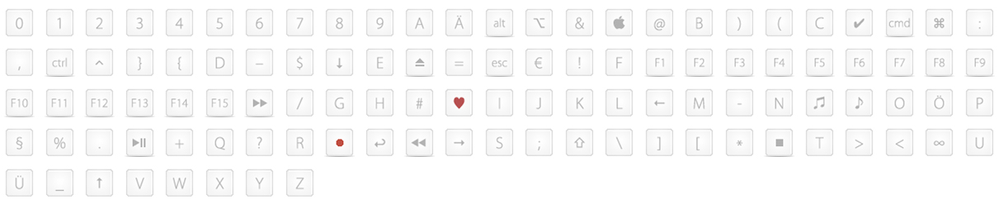
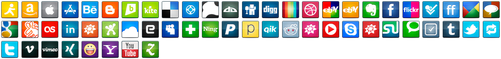

# ioBroker.icons-addictive-flavour-png

Набор иконок для ioBroker.vis и ioBroker.mobile от Addictive Flavour Icon Set. <http://www.smashingmagazine.com/2010/04/15/the-ultimate-free-web-designer-s-icon-set-750-icons-incl-psd-sources/>

[Здесь](https://github.com/ioBroker/ioBroker.icons-addictive-flavour-png/blob/master/ICONLIST.md) вы можете посмотреть все значки.

Вы можете использовать этот набор для всех своих проектов бесплатно и без каких-либо ограничений. Вы можете свободно использовать его как для личных, так и для коммерческих проектов, включая программное обеспечение, онлайн-сервисы, шаблоны и темы. Набор не подлежит перепродаже, сублицензированию, сдаче в аренду, передаче или иному предоставлению для использования. Пожалуйста, разместите ссылку на эту статью, если хотите рассказать о нем другим.

## Цитата Оливера Твардовского

## Мотивация, лежащая в основе дизайна.

В январе 2009 года я выпустил свой первый набор пиксельных иконок под названием «flavour» прямо здесь, в Smashing Magazine, а несколько месяцев спустя, в мае 2009 года, я расширил этот набор и выпустил «flavour extended».

Теперь, спустя более года, пришло время завершить эту серию. «Притягательный вкус» станет последней частью серии о вкусах. (По крайней мере, пока я так думаю ^\_^)

В своих последних релизах я просил вас оставить отзывы о наборе иконок, и их было невероятно много. Я получил сотни писем и прочитал еще больше комментариев здесь и в Твиттере ( <http://twitter.com/mywayhome> ).

С помощью «затягивающего вкуса» я надеюсь предоставить вам именно тот набор иконок, который вы хотели и который вам нужен для ваших проектов веб-разработки. Однако, если в наборе отсутствует какая-либо конкретная иконка, которая вам необходима для вашего проекта или сайта, пожалуйста, свяжитесь со мной в Твиттере ( <http://twitter.com/mywayhome> ) или по электронной почте ( <icons@addictedotocoffee.de> ), и мы посмотрим, что можем для вас сделать!

Хочу поблагодарить всех вас за огромную поддержку в создании этого масштабного набора иконок. Особую благодарность хочу выразить Магде, Ларсу, Мартину Леблану, Бастиану Алльгейеру, команде Smashing Magazine и всем бета-тестерам, которые проделали фантастическую работу, оценивая мою работу и даря мне обратную связь, любовь и вдохновение!

Следите за обновлениями, чтобы не пропустить новые мои публикации в журнале Smashing Magazine или в моем Твиттере ( <http://twitter.com/mywayhome> ).

Большое спасибо, Оливер.

### Как использовать

- Установите набор иконок "icons-addictive-flavour-png" (в качестве адаптера) и в диалоговом окне выбора изображения в файле ioBroker.vis перейдите по пути "/icons-addictive-flavour-png/".

## Changelog
### 0.1.0 (2015-05-20)
* (bluefox) initial commit

