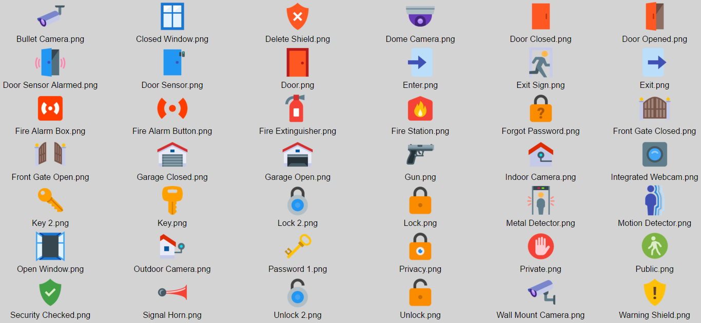

# ioBroker.icons-icons

Набор иконок для ioBroker.vis и ioBroker.mobile от [icons8](https://icons8.com)

[Здесь](https://github.com/ioBroker/ioBroker.icons-icons8/blob/master/ICONLIST.md) вы можете посмотреть значки. Внимание: загружаемый файл может быть очень большим!

В этом наборе около 4300 иконок.

### Как использовать

- Установите набор иконок "icons-icons8" (в качестве адаптера) и в диалоговом окне выбора изображений в файле ioBroker.vis перейдите по пути "/icons-icons8/".

## Changelog
### 0.1.0 (2016-04-29)
* (bluefox) initial commit

[Older changelogs can be found there](https://github.com/ioBroker/ioBroker.icons-icons8/blob/master/CHANGELOG_OLD.md)