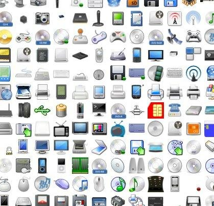

# ioBroker.icons-open-icon-library-png

Набор иконок для ioBroker.vis и ioBroker.mobile от Addictive Flavour Icon Set. <http://sourceforge.net/projects/openiconlibrary/>

[Здесь](https://github.com/ioBroker/ioBroker.icons-open-icon-library-png/blob/master/ICONLIST.md) вы можете посмотреть все значки.

### Как использовать

## Changelog
### 0.1.3 (2016-01-20)
* (bluefox) make changes back

### 0.1.2 (2016-01-19)
* (Jey Cee) update for new vis structure

### 0.1.0 (2015-05-21)
* (bluefox) initial commit