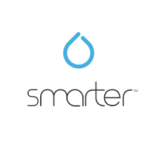

# IoBroker.ikettle2
** Тесты: ** 

## Ikettle2 адаптер для ioBroker
Управляйте своим Smarter iKettle 2.0 с помощью ioBroker.

## Присоединяйтесь к серверу Discord, чтобы обсудить все о ioBroker!

## [Спонсоры](./SPONSORS.md)
Если вам нравится моя работа, пожалуйста, сделайте личное пожертвование (это личная ссылка для пожертвования для Jey Cee, не имеющая отношения к проекту ioBroker!) [![Пожертвовать] (https://raw.githubusercontent.com/iobroker-community-adapters/ioBroker.wled/master/admin/button.png)](https://www.paypal.com/cgi-bin/webscr?cmd=_s-xclick&hosted_button_id=95YZN2LR59Q64&source=url)

---

## Руководство по эксплуатации
### Описание объекта **вкл** - Включает чайник. set_temperature необходимо установить раньше.
** on_formula ** - включает чайник, нагревает и поддерживает температуру formula_time в течение времени warming_time.
Формула_температура и время нагрева должны быть установлены раньше.

** calibrate ** - начать базовую калибровку.

** on_plate ** - указывает, стоит ли чайник на опорной плите.

** set_temperature ** - Целевая температура нагрева воды.

** formula_temperature ** - Целевая температура после нагрева воды до заданной_температуры.

** water_temperature ** - Фактическая температура воды.

** water_level ** - Фактическое количество воды в чайнике. Примечание. Точность не так хороша и может быть совершенно ложной, поэтому убедитесь, что в чайнике есть вода, глазами.

** warming_time ** - время, в течение которого чайник будет поддерживать воду при температуре формулы перед выключением.
Примечание: 0 = не используется, минимальное время - 5 минут, максимальное - 30 минут.

** get_preset ** - считывать предустановленные значения для ручного управления (без приложения) из чайника.

** set_preset ** - Установите предварительно заданные значения на чайнике для ручного управления (без приложения).
Формула_температура, температура и время нагрева в предварительно заданной папке должны быть установлены раньше.

---

### Calibrate Возьмите чайник с подставки и установите для объекта значение true.
После звукового сигнала с базы вы можете снова поставить чайник на базу и использовать его.
---

## Changelog

* (Jey Cee) fixes for Beta release

### 1.0.0
* (Jey Cee) initial release

## License
MIT License

Copyright (c) 2021 Jey Cee <jey-cee@live.com>

Permission is hereby granted, free of charge, to any person obtaining a copy
of this software and associated documentation files (the "Software"), to deal
in the Software without restriction, including without limitation the rights
to use, copy, modify, merge, publish, distribute, sublicense, and/or sell
copies of the Software, and to permit persons to whom the Software is
furnished to do so, subject to the following conditions:

The above copyright notice and this permission notice shall be included in all
copies or substantial portions of the Software.

THE SOFTWARE IS PROVIDED "AS IS", WITHOUT WARRANTY OF ANY KIND, EXPRESS OR
IMPLIED, INCLUDING BUT NOT LIMITED TO THE WARRANTIES OF MERCHANTABILITY,
FITNESS FOR A PARTICULAR PURPOSE AND NONINFRINGEMENT. IN NO EVENT SHALL THE
AUTHORS OR COPYRIGHT HOLDERS BE LIABLE FOR ANY CLAIM, DAMAGES OR OTHER
LIABILITY, WHETHER IN AN ACTION OF CONTRACT, TORT OR OTHERWISE, ARISING FROM,
OUT OF OR IN CONNECTION WITH THE SOFTWARE OR THE USE OR OTHER DEALINGS IN THE
SOFTWARE.