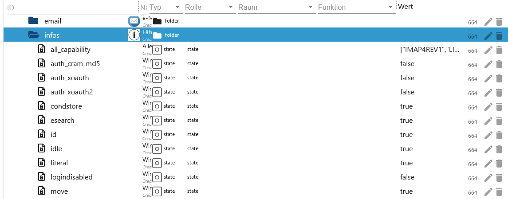
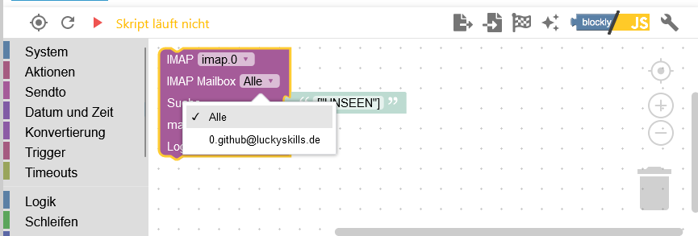

# IoBroker.imap
```:warning:
 ⚠ Dieser Adapter kann mit dem Blockly (Eigene Abfrage) das System sehr schnell zum Absturz bringen.
 ⚠ Daher bitte diese Beschreibung aufmerksam durchlesen.
```

[Вернуться к README](/README.md)

# Краткое содержание
- [настройки экземпляра](#instance-settings)
    - [Настройки TAB IMAP] (#instance-configuration-tab-imap-create)
    - [Символы TAB настроек] (#instance-configuration-tab-symbols-create)
    - [Настройки TAB Mailparser] (#instance-configuration-tab-mailparser-options-create)
- [точки данных](#точки данных)
    - [точки данных imap.0](#точки данных-imap0)
    - [datapoints imap.0.username](#datapoints-imap0username)
    - [точки данных imap.0.username.email.emails_xx](#datapoints-imap0usernameemailemail_xx)
    - [точки данных imap.0.username.infos](#datapoints-imap0usernameinfos)
    - [точки данных imap.0.username.remote](#datapoints-imap0usernameremote)
    - [точки данных imap.0.username.remote.copy](#datapoints-imap0usernameremotecopy)
    - [datapoints imap.0.username.remote.flag](#datapoints-imap0usernameremoteflag)
    - [точки данных imap.0.username.remote.html](#datapoints-imap0usernameremotehtml)
    - [точки данных imap.0.username.remote.move](#datapoints-imap0usernameremotemove)
- [Блоклы](#блоклы)
    - [Изменить настройки экземпляра Blockly](#blockly-imap-query-with-instance-settings)
    - [Создайте свой запрос](#blockly-imap-query-change)
    - [Запрос с настройками экземпляра](#blockly-imap-own-query)
    - [установить флаги] (установить-#blockly-imap-flags)
- [Массив JSON](#массив-json)
    - [imap.0.xxx.email.email_xx.attach_json](#array-json-imap0xxxemailemail_xxattach_json)
    - [imap.0.xxx.json](#массив-json-imap0xxxjson)
    - [imap.0.xxx.last_activity_json](#json-imap0xxxlast_activity_json)
    - [imap.0.xxx.качество](#json-imap0xxxquality)
    - [imap.0.xxx.status](#json-imap0xxxstatus)
    - [imap.0.online_history](#array-json-imap0online_history)
- [Примеры Javascripts и Blocklys](/docs/de/EXAMPLE.md)

# Настройки экземпляра
### Создать конфигурацию экземпляра TAB IMAP
[Краткое содержание](#zusammenfassung)

```:warning:
 ⚠ Die Instanz muss aktiviert sein!!!!
```

- `Активный`: активировать соединение IMAP.
- `Хост`: например. Например, imap.gmail.com
- `Входящие`: Стандартный INBOX - Ящик для мониторинга - Возможный выбор см. imap.0.xxx.remote.change_folder
- `Порт`: по умолчанию 993
- `Имя пользователя`: Имя пользователя - Экземпляр должен быть активирован!!!
- `Пароль`: Пароль - Экземпляр должен быть активирован!!! - [логин Gmail](https://support.google.com/mail/answer/185833?hl=de) - [двухфакторная аутентификация Outlook](https://mcuiobroker.gitbook.io/jarvis-infos/ подсказки /общие/микрософт-виндовс/двухфакторная аутентификация)

    

- `max.`: Максимальная система в виде точек данных email_01...email_02... (1-99)
- `макс. HTML`: максимальное количество писем в формате HTML. Должно быть больше максимального количества точек данных (1–99).
- `TLS`: использовать соединение TLS – по умолчанию верно
- `flags`: флаг для запроса IMAP. Возможные флаги:

```
ALL - alle – Alle Nachrichten.
ANSWERED - geantwortet – Nachrichten mit gesetzter Beantwortet-Flagge.
DELETED - gelöscht – Nachrichten mit gesetzter Gelöscht-Flagge.
DRAFT - Entwurf – Nachrichten mit gesetzter Entwurfsflagge.
FLAGGED - gekennzeichnet – Nachrichten mit gesetzter Flagge.
NEW - neu – Nachrichten, bei denen das Flag „Zuletzt verwendet“ gesetzt ist, aber nicht das Flag „Gesehen“.
SEEN - gesehen – Nachrichten, bei denen das Flag „Gesehen“ gesetzt ist.
RECENT - jüngste – Nachrichten, bei denen das Flag „Zuletzt verwendet“ gesetzt ist.
OLD - alt – Nachrichten, für die das Flag „Zuletzt verwendet“ nicht gesetzt ist. Dies entspricht funktional !RECENT (im Gegensatz zu „!NEW“).
UNANSWERED - unbeantwortet – Nachrichten, bei denen das Flag „Beantwortet“ nicht gesetzt ist.
UNDELETED - ungelöscht – Nachrichten, für die das Flag „Gelöscht“ nicht gesetzt ist.
UNDRAFT - kein Entwurf – Nachrichten, bei denen das Draft-Flag nicht gesetzt ist.
UNFLAGGED - ungekennzeichnet – Nachrichten, für die das Flag „Markiert“ nicht gesetzt ist.
UNSEEN - ungesehen – Nachrichten, bei denen das Flag „Gesehen“ nicht gesetzt ist.
```

- «Выбрать значок»: значок для папки (загрузить на вкладке «Создать значки»)


- `опция tls`: по умолчанию {"rejectUnauthorized": false}
- `Auto-TLS`: Возможные варианты: `всегда`, `обязательно` и `никогда`. По умолчанию никогда

    **Для получения дополнительной информации прочитайте [здесь](https://www.npmjs.com/package/node-imap).**


- `Att.`: Чтобы заполнить поле HTML, вложения также должны быть загружены. Это использует много оперативной памяти!!! Следовательно, по умолчанию `false`
- `Mailparser option`: Mailparser option (создавать только на вкладке `MAILPARSER OPTIONS`)


- `макс. Предел MEMRSS: «С момента, когда u. a. действие срабатывает.
- `Перезапуск:` Если достигнут лимит MEMRSS, адаптер будет перезапущен. Тем не менее, он проверяется только каждые 24 часа.


- «Точка данных»: если достигнут предел MEMRSS, для выбранной точки данных устанавливается значение «истина». Это должно быть сброшено вручную. Тем не менее, он проверяется только каждые 24 часа.


- `Отправить:` Если достигнут лимит MEMRSS, отправляется сообщение. Сообщение будет отправлено при каждом обновлении `MEMRSS`.
    - `Экземпляры:` Пример: telegram.0, telegram.1, pushover.0
    - `Экземпляры пользователя:` Пример: Питер, Олаф, Томас


### Создать символы TAB конфигурации экземпляра
[Краткое содержание](#zusammenfassung)

- `Имя значка:` Имя значка. Пожалуйста, не используйте повторяющиеся имена. Затем при запуске адаптера в записи журнала создается ошибка.
- `Загрузить:` Загрузить значок.


### Создать экземпляр конфигурации TAB Параметры Mailparser
[Краткое содержание](#zusammenfassung)

- `Name:` Имя парсера почты. Пожалуйста, не используйте повторяющиеся имена. Затем при запуске адаптера в записи журнала создается ошибка. Точное описание можно прочитать [здесь](https://nodemailer.com/extras/mailparser/).
- `Пропустить HTML к тексту:` Не генерировать обычный текст из HTML.
- `Максимальная длина HTML для анализа:` Максимальный объем HTML для анализа в байтах. Если это превышено, генерируются только данные заголовка.
- `Пропустить ссылки на изображения:` Пропускает преобразование вложений CID в изображения URL-адресов данных. Изображения не конвертируются как base64, что экономит «огромное использование оперативной памяти».
- `Пропустить текст в HTML:` Не генерировать HTML из обычных текстовых сообщений.
- `Пропустить текстовые ссылки:` не размещать ссылки в текстовом содержимом.


# Точки данных
### Точек данных `imap.0`
[Краткое содержание](#zusammenfassung)

| объект | Описание |
| --------------------- | ----------------------------------------------------------------------------------------------- |
| imap.0.json_imap | Имя IMAP-соединения с последним действием. Триггер для входящих писем или обновлений. |
| imap.0.json_table | Последнее обновление соединения IMAP в виде таблицы JSON для VIS. |
| imap.0.online_counter | Количество активных IMAP-соединений. |
| imap.0.онлайн_история | История активности подключения в формате JSON – [Пример](#array-json-imap0online_history). |


### Точек данных `imap.0.benutzername`
[Краткое содержание](#zusammenfassung)

| объект | Описание |
| ---------------------------------- | --------------------------------------------------------------------------------------------------- |
| imap.0.xxx.active_inbox | Активный почтовый ящик |
| imap.0.xxx.хост | имя хоста |
| imap.0.xxx.html | HTML-код для ВИС |
| imap.0.xxx.json | Таблица JSON для VIS — [Пример](#array-json) |
| imap.0.xxx.last_activity_json | Какая активность в виде массива JSON - [Пример](#json-imap0xxxlast_activity_json) |
| imap.0.xxx.last_activity_json | Какая активность в виде массива JSON - [пример](#json-imap0xxxlast_activity_json) |
| imap.0.xxx.last_activity_timestamp | Временная метка последней активности |
| imap.0.xxx.качество | Качество всех точек данных в формате JSON. Обновляется каждые 24 часа - [Пример](#json-imap0xxxquality) |
| imap.0.xxx.статус | Информация о соединении IMAP в формате JSON - [Пример](#json-imap0xxxstatus) |
| imap.0.xxx.статус | Информация о соединении IMAP в формате JSON - [Пример](#json-imap0xxxstatus) |
| imap.0.xxx.total | Количество писем в активном почтовом ящике |
| imap.0.xxx.total_unread | Количество непрочитанных писем в активном почтовом ящике |


### Точек данных `imap.0.benutzername.email.email_xx`
[Краткое содержание](#zusammenfassung)

| объект | Описание |
| ------------------------------------- | ------------------------------------------------------------------------------------- |
| imap.0.xxx.email.email_01.attach | Количество вложений и изображений в теле |
| imap.0.xxx.email.email_01.attach_json | Информация о вложениях в формате JSON - [Пример](#array-json-imap0xxxemailemail_xxattach_json) |
| imap.0.xxx.email_01.content | Содержание письма |
| imap.0.xxx.email.email_01.flag | Флаги электронной почты |
| imap.0.xxx.email.email_01.от | Грузоотправители как массив |
| imap.0.xxx.email.email_01.receive | дата получения |
| imap.0.xxx.email.email_01.seq | порядковый номер |
| imap.0.xxx.email.email_01.size | Размер письма в байтах |
| imap.0.xxx.email.email_01.subject | Тема письма |
| imap.0.xxx.email.email_01.texthtml | Контент в формате HTML |
| imap.0.xxx.email.email_01.to | Получатели как массив |
| imap.0.xxx.email.email_01.uid | Уникальный UID |

 

### Точек данных `imap.0.benutzername.infos`
[Краткое содержание](#zusammenfassung)

| объект | Описание |
| -------------------------------------- | --------------------------------------------------------------------------------------------------------------------------------------------------------------------- |
| imap.0.xxx.infos.all_capability | Все возможности подключения IMAP |
| imap.0.xxx.infos.auth_cram-md5 | Метод аутентификации auth_cram-md5 |
| imap.0.xxx.infos.auth_xoauth | Метод аутентификации xoauth |
| imap.0.xxx.infos.auth_xoauth2 | Метод аутентификации xoauth2 |
| imap.0.xxx.infos.condstore | Возможен запрос MODSEQ [пожалуйста, обратитесь](https://datatracker.ietf.org/doc/html/rfc4551#page-18) |
| imap.0.xxx.infos.id | [Пожалуйста, обратитесь](https://www.iana.org/assignments/imap-capabilities/imap-capabilities.xhtml) |
| imap.0.xxx.infos.idle | [Пожалуйста, обратитесь](https://www.iana.org/assignments/imap-capabilities/imap-capabilities.xhtml) |
| imap.0.xxx.infos.literal\* | [Пожалуйста, обратитесь](https://www.iana.org/assignments/imap-capabilities/imap-capabilities.xhtml) |
| imap.0.xxx.infos.logindisabled | [Пожалуйста, обратитесь](https://www.iana.org/assignments/imap-capabilities/imap-capabilities.xhtml) |
| imap.0.xxx.infos.move | Электронные письма можно перемещать. [Пожалуйста, обратитесь](https://www.iana.org/assignments/imap-capabilities/imap-capabilities.xhtml) |
| imap.0.xxx.infos.namespace | [Пожалуйста, обратитесь](https://www.iana.org/assignments/imap-capabilities/imap-capabilities.xhtml) |
| imap.0.xxx.infos.quota | [Пожалуйста, обратитесь](https://www.iana.org/assignments/imap-capabilities/imap-capabilities.xhtml) |
| imap.0.xxx.infos.sasl-ir | [Пожалуйста, обратитесь](https://www.iana.org/assignments/imap-capabilities/imap-capabilities.xhtml) |
| imap.0.xxx.infos.sort | электронная почта будет получена отсортированной [Пожалуйста, обратитесь](https://www.iana.org/assignments/imap-capabilities/imap-capabilities.xhtml) |
| imap.0.xxx.infos.sort_display | Информация заголовка отсортирована.[Пожалуйста, обратитесь](https://www.iana.org/assignments/imap-capabilities/imap-capabilities.xhtml) |
| imap.0.xxx.infos.starttls | Стартлс поддерживается. Затем можно установить в конфигурации экземпляра. [Пожалуйста, обратитесь](https://www.iana.org/assignments/imap-capabilities/imap-capabilities.xhtml) |
| imap.0.xxx.infos.thread_orderedsubject | [Пожалуйста, обратитесь](https://www.iana.org/assignments/imap-capabilities/imap-capabilities.xhtml) |
| imap.0.xxx.infos.thread_references | [Пожалуйста, обратитесь](https://www.iana.org/assignments/imap-capabilities/imap-capabilities.xhtml) |
| imap.0.xxx.infos.unselect | [Пожалуйста, обратитесь](https://www.iana.org/assignments/imap-capabilities/imap-capabilities.xhtml) |
| imap.0.xxx.infos.x-gm-ext-1 | [Пожалуйста, обратитесь](https://www.iana.org/assignments/imap-capabilities/imap-capabilities.xhtml) |
| imap.0.xxx.infos.x-gm-ext-1 | [См.] (https://www.iana.org/assignments/imap-capabilities/imap-capabilities.xhtml) |

 

### Точек данных `imap.0.benutzername.remote`
[Краткое содержание](#zusammenfassung)

| объект | Описание |
| ------------------------------- | -------------------------------------------------------------------------------------------------------------------------------------------------------------------- |
| imap.0.xxx.remote.apply_html | Примените изменения из imap.0.xxx.remote.html. |
| imap.0.xxx.remote.change_folder | Конфигурация экземпляра: измените папку сообщений для отслеживания и отображения. Сбрасывается только после перезагрузки. |
| imap.0.xxx.remote.criteria | Конфигурация экземпляра: изменить поиск. Сбрасывается только после перезагрузки. |
| imap.0.xxx.remote.reload_emails | Перезагрузите электронные письма. |
| imap.0.xxx.remote.search_start | применить изменения из папки change_folder, критериев и show_mails |
| imap.0.xxx.remote.show_mails | Конфигурация экземпляра: количество писем (макс. HTML) для загрузки. Сбрасывается только после перезагрузки. Должно быть, конечно, больше, чем значение макс |
| imap.0.xxx.remote.vis_command | Команда от VIS для перемещения почты из ящиков выбора. Используется только ВИС. |


### Точек данных `imap.0.benutzername.remote.copy`
[Краткое содержание](#zusammenfassung)

| объект | Описание |
| --------------------------------- | ------------------------------------------------------------------------------------------------------------------------- |
| imap.0.xxx.remote.copy.apply_copy | Применить смену папки и uid. |
| imap.0.xxx.remote.copy.folder | Выберите папку, в которую следует скопировать выбранное письмо. |
| imap.0.xxx.remote.copy.uid | Введите здесь UID письма, которое нужно скопировать. UID можно найти в imap.0.xxx.json или в папках электронной почты |


### Точек данных `imap.0.benutzername.remote.flag`
[Краткое содержание](#zusammenfassung)

| объект | Описание |
| --------------------------------- | ------------------------------------------------------------------------------------------------------------------------- |
| imap.0.xxx.remote.flag.apply_flag | Применить изменение набора, типа и uid. |
| imap.0.xxx.remote.flag.set | Выберите setFlag для флага, добавьте addFlag для флага и удалите delFlag для флага |
| imap.0.xxx.remote.flag.type | Выберите флаг для добавления, установки или удаления |
| imap.0.xxx.remote.flag.uid | UID, на который следует изменить флаг. UID можно найти в imap.0.xxx.json или в папках электронной почты |


### Точек данных `imap.0.benutzername.remote.html`
[Краткое содержание](#zusammenfassung)

| объект | Описание |
| ---------------------------------------------- | ----------------------------------------------------------------------------------------------- |
| imap.0.xxx.remote.html.body_background | Цвет фона таблицы — по умолчанию #000000 |
| imap.0.xxx.remote.html.choose_content | Показать поле из электронной почты. </br>Возможные поля: html, text, textAsHtml и html convert. |
| imap.0.xxx.remote.html.header_border | Заголовок ширины границы — по умолчанию 2 пикселя |
| imap.0.xxx.remote.html.header_font | Заголовок шрифта — стандартный Helvetica |
| imap.0.xxx.remote.html.header_font_size | Размер шрифта заголовка — по умолчанию 15 пикселей |
| imap.0.xxx.remote.html.header_linear_color_1 | Значение заголовка градиентного фона 1 — по умолчанию #424242 |
| imap.0.xxx.remote.html.header_linear_color_2 | Значение заголовка градиентного фона 2 - по умолчанию #424242 |
| imap.0.xxx.remote.html.header_tag_border_color | Заголовок цвета границы — по умолчанию #424242 — любой |
| imap.0.xxx.remote.html.header_text_color | Цвет текста заголовка — по умолчанию #BDBDBD |
| imap.0.xxx.remote.html.header_width | Ширина заголовка - Авто по умолчанию - Возможные пиксели или % |
| imap.0.xxx.remote.html.headline_align_column_1 | Столбец заголовка выравнивания текста 1 — по умолчанию по центру </br> Возможно по центру, слева, справа и автоматически |


| объект | Описание |
| ----------------------------------------------- | --------------------------------------------------------------------------------------------- |
| imap.0.xxx.remote.html.headline_align_column_2 | Столбец 2 заголовка выравнивания текста - по умолчанию по центру </br> Возможно по центру, слева, справа и автоматически |
| imap.0.xxx.remote.html.headline_align_column_3 | Столбец 3 заголовка выравнивания текста - по умолчанию по центру </br> Возможно по центру, слева, справа и автоматически |
| imap.0.xxx.remote.html.headline_align_column_4 | Столбец 4 заголовка выравнивания текста - по умолчанию по центру </br> Возможно по центру, слева, справа и автоматически |
| imap.0.xxx.remote.html.headline_align_column_5 | Столбец 5 заголовка выравнивания текста - по умолчанию по центру </br> Возможно по центру, слева, справа и автоматически |
| imap.0.xxx.remote.html.headline_align_column_6 | Столбец 6 заголовка выравнивания текста - по умолчанию по центру </br> Возможно по центру, слева, справа и автоматически |
| imap.0.xxx.remote.html.headline_align_column_7 | Столбец заголовка выравнивания текста 7 - по умолчанию по центру </br> Возможно по центру, слева, справа и автоматически |
| imap.0.xxx.remote.html.headline_align_column_8 | Столбец 8 заголовка выравнивания текста - по умолчанию по центру </br> Возможно по центру, слева, справа и автоматически |
| imap.0.xxx.remote.html.headline_align_column_9 | Столбец 9 заголовка выравнивания текста - по умолчанию по центру </br> Возможно по центру, слева, справа и автоматически |
| imap.0.xxx.remote.html.headline_align_column_10 | Столбец заголовка выравнивания текста 10 - по умолчанию по центру </br> Возможно по центру, слева, справа и автоматически |
| imap.0.xxx.remote.html.headline_color | Цвет корпуса — по умолчанию #BD5A3C |
| imap.0.xxx.remote.html.headline_column_width_1 | Ширина столбца Столбец 1 - Авто по умолчанию - Возможные пиксели или % |
| imap.0.xxx.remote.html.headline_column_width_10 | Ширина столбца Столбец 10 - Авто по умолчанию - Возможные px или % |


| объект | Описание |
| ---------------------------------------------- | ------------------------------------------------------------- |
| imap.0.xxx.remote.html.headline_column_width_2 | Ширина столбца Столбец 2 - Авто по умолчанию - Возможные пиксели или % |
| imap.0.xxx.remote.html.headline_column_width_3 | Ширина столбца Столбец 3 - Авто по умолчанию - Возможные пиксели или % |
| imap.0.xxx.remote.html.headline_column_width_4 | Ширина столбца Столбец 4 - Авто по умолчанию - Возможные пиксели или % |
| imap.0.xxx.remote.html.headline_column_width_5 | Ширина столбца Столбец 5 - Авто по умолчанию - Возможные px или % |
| imap.0.xxx.remote.html.headline_column_width_6 | Ширина столбца Столбец 6 - Авто по умолчанию - Возможные пиксели или % |
| imap.0.xxx.remote.html.headline_column_width_7 | Ширина столбца Столбец 7 - Авто по умолчанию - Возможные px или % |
| imap.0.xxx.remote.html.headline_column_width_8 | Ширина столбца Столбец 8 - Авто по умолчанию - Возможные px или % |
| imap.0.xxx.remote.html.headline_column_width_9 | Ширина столбца Столбец 9 - Авто по умолчанию - Возможные пиксели или % |
| imap.0.xxx.remote.html.headline_font_size | Размер текста в строках - по умолчанию 16 пикселей |
| imap.0.xxx.remote.html.headline_height | Высота ячейки - по умолчанию 35 пикселей |
| imap.0.xxx.remote.html.headline_style | Стиль ячейки — по умолчанию обычный — возможен обычный или полужирный |


| объект | Описание |
| ------------------------------------------------ | ---------------------------------------------------------------------------------------------- |
| imap.0.xxx.remote.html.headline_underlined | Граница ячейки - по умолчанию 3 пикселя |
| imap.0.xxx.remote.html.headline_underlined_color | Цвет границы ячейки — по умолчанию #ffffff |
| imap.0.xxx.remote.html.jarvis | Настройка кода для просмотра в Джарвисе |
| imap.0.xxx.remote.html.mails_even_color | Цвет фона линии для прямых идентификаторов - стандартный #333333 |
| imap.0.xxx.remote.html.mails_nextday_color_even | Цвет фона линии для прямых идентификаторов вчера - стандартный #F7FFE0 |
| imap.0.xxx.remote.html.mails_nextday_color_odd | Цвет фона линии для нечетных идентификаторов вчера - стандартный #F7FFE0 |
| imap.0.xxx.remote.html.mails_odd_color | Цвет фона линии для нечетных идентификаторов - стандартный #FFE32E |
| imap.0.xxx.remote.html.mails_today_color | Цвет фона строки для текущего дня прямого идентификатора - стандартный #ffffff |
| imap.0.xxx.remote.html.mails_today_color_odd | Цвет фона линии для текущего дня нечетного идентификатора - по умолчанию #ffffff |
| imap.0.xxx.remote.html.p_tag_text_align | Выравнивание текста верхнего и нижнего колонтитула - стандартное по центру </br> Возможно по центру, слева, справа и автоматически |
| imap.0.xxx.remote.html.short_content | Максимальное количество символов в содержимом - по умолчанию 35 |
| imap.0.xxx.remote.html.short_subject | Максимальное количество символов в теме - по умолчанию 35 |
| imap.0.xxx.remote.html.table_tag_border_color | Цвет границы таблицы — по умолчанию #424242 |


| объект | Описание |
| ------------------------------------------- | --------------------------------------------------------------------- |
| imap.0.xxx.remote.html.table_tag_cell | Расстояние между ячейками - по умолчанию 6 пикселей |
| imap.0.xxx.remote.html.table_tag_text_align | Выравнивание текста таблицы - Авто по умолчанию - Возможно px или % |
| imap.0.xxx.remote.html.table_tag_width | Размер таблицы - Авто по умолчанию - Возможные px или % |
| imap.0.xxx.remote.html.td_tag_2_colums | Граница строки строки 1 и 2 - Авто по умолчанию - Возможные пиксели или % |
| imap.0.xxx.remote.html.td_tag_border_bottom | Поле линии внизу - по умолчанию 1 пиксель |
| imap.0.xxx.remote.html.td_tag_border_color | Цвет нижней границы линии — по умолчанию #424242 |
| imap.0.xxx.remote.html.td_tag_border_right | Поле строки справа — по умолчанию 1 пиксель |
| imap.0.xxx.remote.html.td_tag_cell | Расстояние между ячейками в строках - по умолчанию 6 пикселей |
| imap.0.xxx.remote.html.text_content | Столбец текста заголовка 5 — содержимое по умолчанию |
| imap.0.xxx.remote.html.text_date | Столбец текста заголовка 4 - Дата по умолчанию |
| imap.0.xxx.remote.html.text_flag | Столбец текста заголовка 7 - Стандартные флаги |
| imap.0.xxx.remote.html.text_from | Столбец текста заголовка 2 — по умолчанию Из |


| объект | Описание |
| ------------------------------------------ | --------------------------------------------------- |
| imap.0.xxx.remote.html.text_id | Текстовый столбец заголовка 1 — идентификатор по умолчанию |
| imap.0.xxx.remote.html.text_move_or_copy | Столбец текста заголовка 9 — копирование/вставка по умолчанию |
| imap.0.xxx.remote.html.text_select_addflag | Начальный текст в поле выбора флажка - стандартный addFlags - |
| imap.0.xxx.remote.html.text_select_copy | Начальный текст в копии Поле выделения - Стандартная копия |
| imap.0.xxx.remote.html.text_select_delflag | Начальный текст в поле выбора флажка - по умолчанию delFlags - |
| imap.0.xxx.remote.html.text_select_move | Начальный текст в поле выбора копии - стандартный ход |
| imap.0.xxx.remote.html.text_select_setflag | Начальный текст в поле выбора флажка - по умолчанию setFlags - |
| imap.0.xxx.remote.html.text_seq | Столбец 6 текста заголовка — стандартная последовательность |
| imap.0.xxx.remote.html.text_setflag | Столбец текста заголовка 10 — действие флага по умолчанию |
| imap.0.xxx.remote.html.text_subject | Столбец текста заголовка 3 - Тема по умолчанию |
| imap.0.xxx.remote.html.text_uid | Столбец текста заголовка 8 — UID по умолчанию |
| imap.0.xxx.remote.html.top_font | Шрифт верхнего и нижнего колонтитула - Стандартный Helvetica |


| объект | Описание |
| -------------------------------------- | ---------------------------------------------------------------------------- |
| imap.0.xxx.remote.html.top_font_size | Размер шрифта верхнего и нижнего колонтитула - стандартный 20 пикселей |
| imap.0.xxx.remote.html.top_font_weight | Толщина шрифта верхнего и нижнего колонтитула - стандартный нормальный - возможен обычный или полужирный |
| imap.0.xxx.remote.html.top_text | Текст заголовка по умолчанию для имени пользователя |
| imap.0.xxx.remote.html.top_text_color | Цвет текста заголовка - по умолчанию #ffffff |


### Точек данных `imap.0.benutzername.remote.move`
[Краткое содержание](#zusammenfassung)

| объект | Описание |
| --------------------------------- | ---------------------------------------------------------------------------------------------------------------------------- |
| imap.0.xxx.remote.move.apply_move | Применить смену папки и uid. |
| imap.0.xxx.remote.move.folder | Выберите папку, в которую нужно переместить выбранную почту. |
| imap.0.xxx.remote.move.uid | Введите UID письма, которое нужно переместить сюда. Вы можете найти UID в imap.0.xxx.json или в папках электронной почты |


# Блокли
### Изменить блочный запрос IMAP
[Краткое содержание](#zusammenfassung)

- При этом вы можете установить эти [точки данных] (# data points-imap0usernameremote).
- Возможные флаги можно найти [в конфигурации экземпляра](#instance-configuration-tab-imap-create).
- Возможность выбора подключения IMAP или применить ко всем.

 

### Блочный собственный запрос IMAP
[Краткое содержание](#zusammenfassung)

-   ОПАСНОСТЬ! Вот и все данные такие. Например, вложения. Этот запрос может нагрузить ОЗУ или ЦП до предела. Если создан неправильный критерий, это может привести к падению iobroker!!!
- Затем данные доставляются в формате JSON.
- При выводе журнала файл журнала становится очень большим. Поэтому позже снова удалите выходные данные журнала.
- Должна быть создана переменная с именем `result`.
- [Примеры](/docs/ru/EXAMPLE.md)


### Блочный запрос IMAP с настройками экземпляра
[Краткое содержание](#zusammenfassung)

- Загрузите все данные из IMAP-соединения и обработайте их самостоятельно. Параметр экземпляра используется в качестве критерия поиска.
-   ОПАСНОСТЬ! Высокое потребление оперативной памяти
- Затем данные доставляются в формате JSON.
- При выводе журнала файл журнала становится очень большим. Поэтому позже снова удалите выходные данные журнала.
- Должна быть создана переменная с именем `result`.
- [Примеры](/docs/ru/EXAMPLE.md)


### Установить флаги блочного IMAP
[Краткое содержание](#zusammenfassung)

- Установите флаг setFlag=set, addFlag=add или delFlag=delete для электронной почты.
- Выберите почтовый ящик.
- Выберите setFlag=set, addFlag=добавить или delFlag=удалить.
- выбрать флаг.
- [Возможные флаги см. в imap.0.xxx.status](#json-imap0xxxstatus)


# Массив JSON
### Массив JSON imap.0.xxx.email.email_xx.attach_json
[Краткое содержание](#zusammenfassung)

```json
[
    {
        "partID": "2",
        "id": "<image001.png@01D9C718.240FAD50>",
        "uid": 86,
        "size": "159762",
        "filename": "image001.png",
        "type": "inline",
        "encoding": "base64"
    },
    {
        "partID": "3",
        "id": "<image002.png@01D9C718.36F8AE30>",
        "uid": 86,
        "size": "1296247",
        "filename": "image002.png",
        "type": "inline",
        "encoding": "base64"
    }
]
```

### Массив JSON imap.0.xxx.json
[Краткое содержание](#zusammenfassung)

```json
[
    {
        "id": 1,
        "date": "15.08.2023 15:39:17",
        "from": ["test@luckyskills.de"],
        "from_name": ["Tester"],
        "attach": 0,
        "attach_info": [],
        "to": ["github@luckyskills.de"],
        "to_name": ["Lucky-ESA"],
        "subject": "Test",
        "text": "Am 2023-08-10 12:17, schrieb test@luckyskills.de:\n>>> TEST\n",
        "html": false,
        "textAsHtml": "Am 2023-08-10 12:17, schrieb <a href=\"mailto:test@luckyskills.de\">test@luckyskills.de</a>:<br/>&gt;&gt;&gt; TEST</p>",
        "seqno": 74,
        "uid": 93,
        "size": 1077,
        "flag": "unseen"
    }
]
```

### JSON imap.0.xxx.last_activity_json
[Краткое содержание](#zusammenfassung)

```json
{
    "modseq": "196",
    "flags": ["\\Seen"]
}
```

### JSON imap.0.xxx.качество
[Краткое содержание](#zusammenfassung)

```json
{
    "message": "No Message"
}
```

### Возможности
```
0: "0x00 - good",
1: "0x01 - general problem",
2: "0x02 - no connection problem",
16: "0x10 - substitute value from controller",
17: "0x11 - general problem by instance",
18: "0x12 - instance not connected",
32: "0x20 - substitute initial value",
64: "0x40 - substitute value from device or instance",
65: "0x41 - general problem by device",
66: "0x42 - device not connected",
68: "0x44 - device reports error",
128: "0x80 - substitute value from sensor",
129: "0x81 - general problem by sensor",
130: "0x82 - sensor not connected",
132: "0x84 - sensor reports error",
```

### JSON imap.0.xxx.status
[Краткое содержание](#zusammenfassung)

```json
{
    "name": "INBOX",
    "flags": ["\\Answered", "\\Flagged", "\\Deleted", "\\Seen", "\\Draft"],
    "readOnly": false,
    "uidvalidity": 1667682367,
    "uidnext": 94,
    "permFlags": ["\\Answered", "\\Flagged", "\\Deleted", "\\Seen", "\\Draft"],
    "keywords": [],
    "newKeywords": true,
    "persistentUIDs": true,
    "nomodseq": false,
    "seq": 0,
    "time": 0,
    "reason": "",
    "user": "github_luckyskills_de",
    "messages": {
        "total": 74,
        "new": 0
    },
    "highestmodseq": "200"
}
```

### Массив JSON imap.0.online_history
[Краткое содержание](#zusammenfassung)

```json
[
    {
        "client": "github_luckyskills_de",
        "time": 1692298599784,
        "status": "Online"
    },
    {
        "client": "github_luckyskills_de",
        "time": 1692298232899,
        "status": "Online"
    }
]
```

## Changelog

<!--
    Placeholder for the next version (at the beginning of the line):
    ### **WORK IN PROGRESS**
-->

### **WORK IN PROGRESS**

-   (Lucky-ESA) Added RAM consumption - Instance Settings
-   (Lucky-ESA) Added german documention
-   (Lucky-ESA) Added Mailparser options
-   (Lucky-ESA) Added counter history
-   (Lucky-ESA) Bug fixes

### 0.0.9 (2023-07-26)

-   (Lucky-ESA) Fixed RAM consumption of new emails
-   (Lucky-ESA) Added counter attachments in JSON

### 0.0.8 (2023-07-13)

-   (Lucky-ESA) Fix refresh crash
-   (Lucky-ESA) Added MB threshold

### 0.0.7 (2023-04-25)

-   (Lucky-ESA) Fix correct counter for seen and unseen
-   (Lucky-ESA) Added capabilities
-   (Lucky-ESA) Criteria change without restart
-   (Lucky-ESA) Added outlook.office365.com oauth2 login
-   (Lucky-ESA) Added Connection.js from Module to Adapter
-   (Lucky-ESA) Bug fixes

### 0.0.6 (2023-03-17)

-   (Lucky-ESA) Added trigger move or copy emails
-   (Lucky-ESA) Added JSON for multiple IMAP accounts
-   (Lucky-ESA) Bug fixes

### 0.0.5 (2023-03-15)

-   (Lucky-ESA) Added: Limited reconnected (5 max)
-   (Lucky-ESA) Added: into datapoints
-   (Lucky-ESA) Added: Password entry not possible without an active instance
-   (Lucky-ESA) Added: Added description to readme
-   (Lucky-ESA) Added: Added move or copy
-   (Lucky-ESA) Added: Set flag with datapoints
-   (Lucky-ESA) Fix: debug output without attachments
-   (Lucky-ESA) Fix: wrong json_table
-   (Lucky-ESA) Fix: value null
-   (Lucky-ESA) Change: Reconnected change info level to debug level
-   (Lucky-ESA) Change: correct dp roles
-   (Lucky-ESA) Change: delete attachments (too much RAM usage)

### 0.0.4 (2023-03-03)

-   (Lucky-ESA) Fix json_table

### 0.0.3 (2023-03-03)

-   (Lucky-ESA) Beta release

### 0.0.2 (2023-03-03)

-   (Lucky-ESA) initial release

## License

MIT License

Copyright (c) 2023 Lucky-ESA <github@luckyskills.de>

Permission is hereby granted, free of charge, to any person obtaining a copy
of this software and associated documentation files (the "Software"), to deal
in the Software without restriction, including without limitation the rights
to use, copy, modify, merge, publish, distribute, sublicense, and/or sell
copies of the Software, and to permit persons to whom the Software is
furnished to do so, subject to the following conditions:

The above copyright notice and this permission notice shall be included in all
copies or substantial portions of the Software.

THE SOFTWARE IS PROVIDED "AS IS", WITHOUT WARRANTY OF ANY KIND, EXPRESS OR
IMPLIED, INCLUDING BUT NOT LIMITED TO THE WARRANTIES OF MERCHANTABILITY,
FITNESS FOR A PARTICULAR PURPOSE AND NONINFRINGEMENT. IN NO EVENT SHALL THE
AUTHORS OR COPYRIGHT HOLDERS BE LIABLE FOR ANY CLAIM, DAMAGES OR OTHER
LIABILITY, WHETHER IN AN ACTION OF CONTRACT, TORT OR OTHERWISE, ARISING FROM,
OUT OF OR IN CONNECTION WITH THE SOFTWARE OR THE USE OR OTHER DEALINGS IN THE
SOFTWARE.