# ioBroker.imap

```:warning:
 ⚠ Dieser Adapter kann mit dem Blockly (Eigene Abfrage) das System sehr schnell zum Absturz bringen.
 ⚠ Daher bitte diese Beschreibung aufmerksam durchlesen.
```

[Вернуться к файлу README](https://github.com/Lucky-ESA/ioBroker.imap/blob/master/README.md)

# Краткое содержание

- [Настройки экземпляра](#instanz-einstellungen)
  - [Вкладка «Настройки» IMAP](#instanz-konfiguration-tab-imap-erstellen)
  - [Значки вкладки «Настройки»](#instanz-konfiguration-tab-symbole-erstellen)
  - [Вкладка «Настройки» OAuth2](#instanz-konfiguration-tab-oauth2-erstellen)
  - [Вкладка «Настройки» Mailparser](#instanz-konfiguration-tab-mailparser-optionen-erstellen)
- [Точки данных](#zustände-objekte)
  - [точки данных imap.0](#zustände-imap0)
  - [Точки данных imap.0.username](#zustände-imap0benutzername)
  - [Точки данных imap.0.username.email.emails\_xx](#zustände-imap0benutzernameemailemail_xx)
  - [Точки данных imap.0.username.info](#zustände-imap0benutzernameinfos)
  - [Точки данных imap.0.username.remote](#zustände-imap0benutzernameremote)
  - [Точки данных imap.0.username.remote.copy](#zustände-imap0benutzernameremotecopy)
  - [Точки данных imap.0.username.remote.flag](#zustände-imap0benutzernameremoteflag)
  - [Точки данных imap.0.username.remote.html](#zustände-imap0benutzernameremotehtml)
  - [Точки данных imap.0.username.remote.move](#zustände-imap0benutzernameremotemove)
- [Блоклис](#blocklys)
  - [Изменение настроек экземпляра Blockly](#blockly-imap-abfrage-mit-instanz-einstellungen)
  - [Создайте свой собственный запрос](#blockly-imap-abfrage-ändern)
  - [Запрос с настройками экземпляра](#blockly-imap-eigene-abfrage)
  - [Установка флагов](#blockly-imap-flags-setzen)
- [JSON-массив](#array-json)
  - [imap.0.xxx.email.email\_xx.attach\_json](#array-json-imap0xxxemailemail_xxattach_json)
  - [imap.0.xxx.json](#array-json-imap0xxxjson)
  - [imap.0.xxx.last\_activity\_json](#json-imap0xxxlast_activity_json)
  - [imap.0.xxx.quality](#json-imap0xxxquality)
  - [imap.0.xxx.status](#json-imap0xxxstatus)
  - [imap.0.online\_history](#array-json-imap0online_history)
- [Пример: JavaScript и Blockly](/#/docs/adapterref/iobroker.imap/EXAMPLE.md)

# Настройки экземпляра

### Вкладка «Создать конфигурацию экземпляра» IMAP

[Краткое содержание](#zusammenfassung)

```:warning:
 ⚠ Die Instanz muss aktiviert sein!!!!
```

- `Aktiv` : Включить IMAP-соединение

- `Host` например, imap.gmail.com

- `Posteingang` Стандартный почтовый ящик (INBOX) - Ящик для мониторинга - Возможные варианты выбора см. в imap.0.xxx.remote.change\_folder. Пример: INBOX.subfolder (точка в качестве разделителя)

- `Port` Стандарт 993

- `Nutzername` Имя пользователя - Экземпляр должен быть активирован!!!

- `Passwort` Пароль — экземпляр должен быть активирован!!! — [Вход в Gmail](https://support.google.com/mail/answer/185833?hl=de) — [Аутентификация Outlook OAuth2](https://learn.microsoft.com/en-us/entra/identity-platform/quickstart-register-app?tabs=certificate)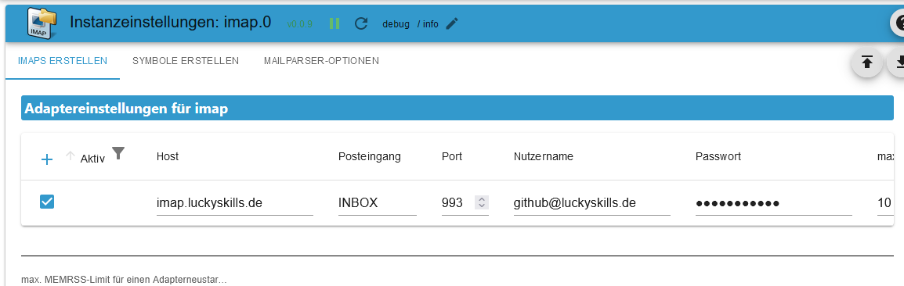

- `max.` Максимальное количество точек данных email\_01...email\_02... (1-99)

- `max. HTML` Максимальное количество писем в формате HTML. Должно быть больше максимального количества точек данных (1-99).

- `TLS` Использовать TLS-соединение — по умолчанию установлено значение true.

- `Flaggen` Флаг для IMAP-запроса. Возможные флаги:

```
ALL - alle – Alle Nachrichten.
ANSWERED - geantwortet – Nachrichten mit gesetzter Beantwortet-Flagge.
DELETED - gelöscht – Nachrichten mit gesetzter Gelöscht-Flagge.
DRAFT - Entwurf – Nachrichten mit gesetzter Entwurfsflagge.
FLAGGED - gekennzeichnet – Nachrichten mit gesetzter Flagge.
NEW - neu – Nachrichten, bei denen das Flag „Zuletzt verwendet“ gesetzt ist, aber nicht das Flag „Gesehen“.
SEEN - gesehen – Nachrichten, bei denen das Flag „Gesehen“ gesetzt ist.
RECENT - jüngste – Nachrichten, bei denen das Flag „Zuletzt verwendet“ gesetzt ist.
OLD - alt – Nachrichten, für die das Flag „Zuletzt verwendet“ nicht gesetzt ist. Dies entspricht funktional !RECENT (im Gegensatz zu „!NEW“).
UNANSWERED - unbeantwortet – Nachrichten, bei denen das Flag „Beantwortet“ nicht gesetzt ist.
UNDELETED - ungelöscht – Nachrichten, für die das Flag „Gelöscht“ nicht gesetzt ist.
UNDRAFT - kein Entwurf – Nachrichten, bei denen das Draft-Flag nicht gesetzt ist.
UNFLAGGED - ungekennzeichnet – Nachrichten, für die das Flag „Markiert“ nicht gesetzt ist.
UNSEEN - ungesehen – Nachrichten, bei denen das Flag „Gesehen“ nicht gesetzt ist.
```

- `Symbol auswählen` Значок папки (под вкладкой TAB)`Symbole erstellen` (загрузить)

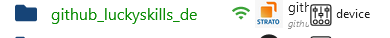

- `tls-Option` По умолчанию установлено значение {"rejectUnauthorized": false}
- `Auto-TLS` Возможные варианты:`always` ,`required` и`never` Стандарт никогда не соблюдается. **Для получения дополнительной информации, пожалуйста, прочтите [здесь](https://www.npmjs.com/package/node-imap) .**

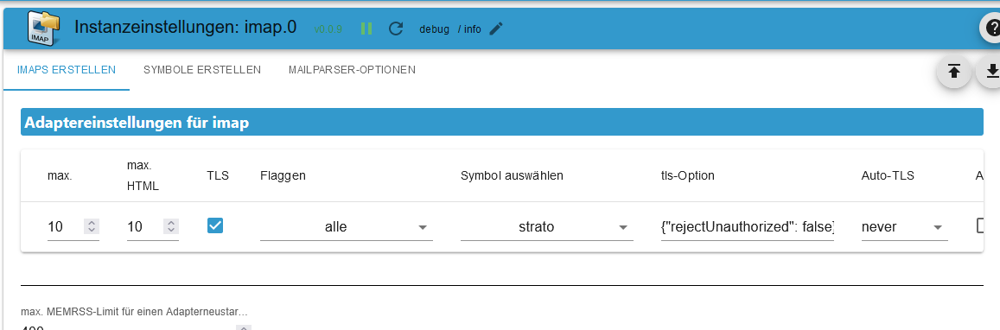

- `Att.` Для заполнения поля HTML необходимо также загрузить вложения. Это потребляет много оперативной памяти! Поэтому используйте настройки по умолчанию.`false`
- `Mailparser-Option` Опция анализа почты (только на вкладке TAB)`MAILPARSER-OPTIONEN` создавать)
- `Token` : [Сначала создайте токены здесь.](#instanz-konfiguration-tab-oauth2-erstellen)

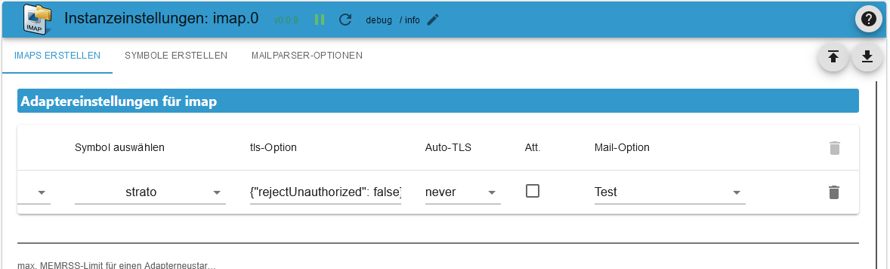

- `max. MEMRSS-Limit:` С момента запуска действия.
- `Neu starten:` Если достигается лимит MEMRSS, адаптер перезапускается. Однако проверка этого процесса выполняется только каждые 24 часа.

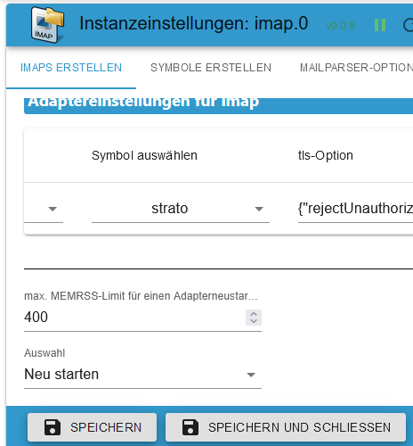

- `Objekt-ID:` Если будет достигнут лимит MEMRSS, выбранная точка данных будет...`true` Настройка выполнена. Необходимо выполнить сброс вручную. Однако проверка производится только каждые 24 часа.

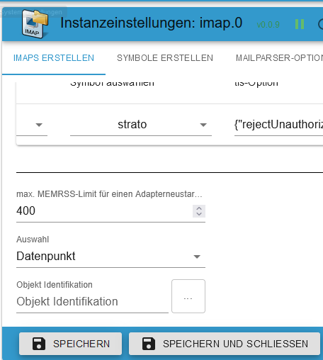

- `Senden:` Сообщение отправляется при достижении лимита MEMRSS. Затем оно будет обновляться при каждом последующем обновлении.`MEMRSS` Сообщение было отправлено.
  - `Instanzen:` Пример: telegram.0, telegram.1, pushover.0
  - `Instanzen Benutzer:` Пример: Питер, Олаф, Томас

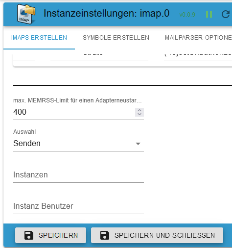

### Символы вкладки «Конфигурация экземпляра» создают

[Краткое содержание](#zusammenfassung)

- `Symbolname:` Назовите символ. Пожалуйста, не используйте повторяющиеся имена. В противном случае при запуске адаптера в журнале будет зафиксирована ошибка.
- `Upload:` Загрузите иконку.

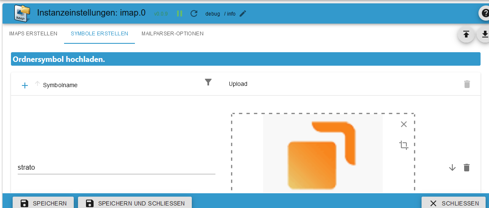

### Создать вкладку конфигурации экземпляра oauth2

[Краткое содержание](#zusammenfassung)

- `Name` имя
- `Kunden ID` Идентификатор клиента
- `Token` Токен
- `Mandanten-ID` Идентификатор мандата

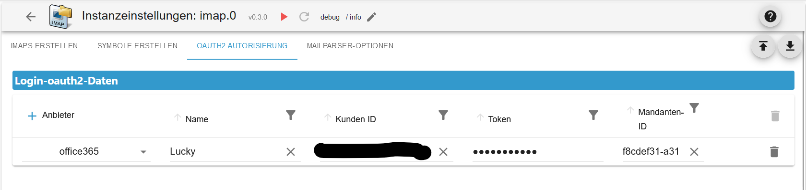</br>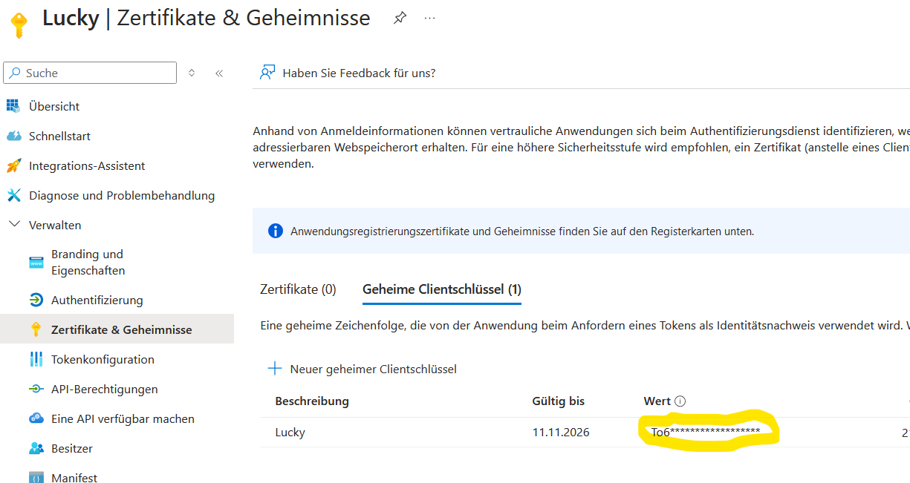</br>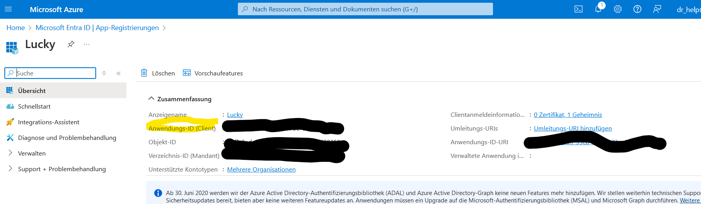</br>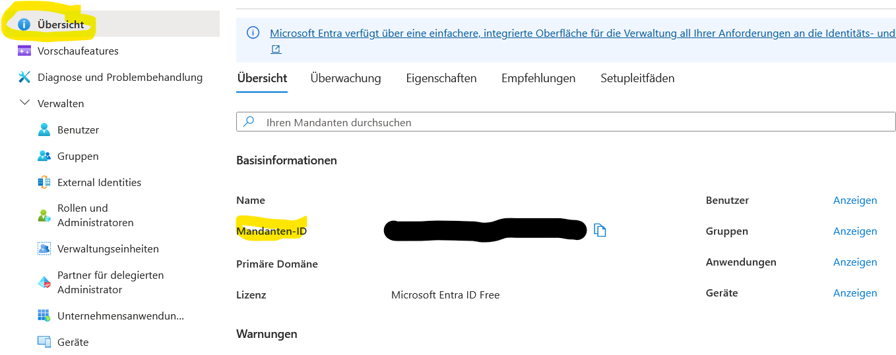

### Вкладка «Конфигурация экземпляра» > «Параметры Mailparser» > «Создать»

[Краткое содержание](#zusammenfassung)

- `Name:` Имя парсера почты. Пожалуйста, не используйте повторяющиеся имена. В противном случае при запуске адаптера в журнале будет зафиксирована ошибка. Подробное описание можно найти [здесь](https://nodemailer.com/extras/mailparser/) .
- `HTML in Text überspringen:` Не генерирует обычный текст из HTML.
- `Maximale HTML-Länge zum Parsen:`Максимальный объем HTML-кода для анализа в байтах. Если этот лимит превышен, будут сгенерированы только данные заголовка.
- `Bildlinks überspringen:` Пропускает преобразование вложений CID в изображения по URL-адресу данных. Изображения не преобразуются в base64.`enormen RAM Verbrauch` сохраняет.
- `Text in HTML überspringen:` Не генерирует HTML из сообщений в обычном текстовом формате.
- `Textlinks überspringen:` Не включайте ссылки в текстовый контент.

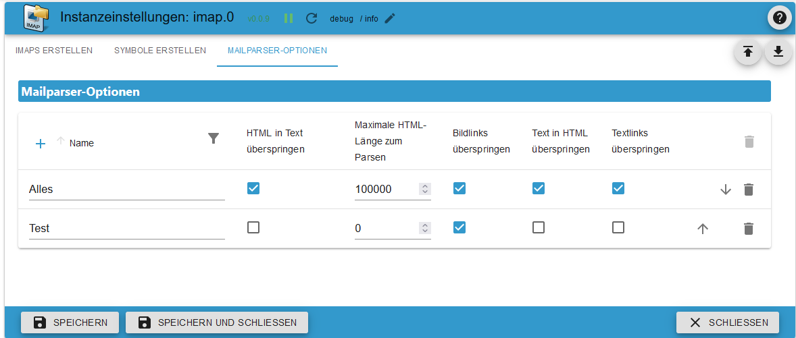

# Состояния (объекты)

### Условия`imap.0`

[Краткое содержание](#zusammenfassung)

| объект                 | Описание                                                                                     |
| ---------------------- | -------------------------------------------------------------------------------------------- |
| imap.0.json\_imap      | Название IMAP-соединения с последней активностью. Триггер для входящих писем или обновлений. |
| imap.0.json\_table     | Последнее обновление IMAP-соединения в виде JSON-таблицы для VIS.                            |
| imap.0.online\_counter | Количество активных IMAP-соединений.                                                         |
| imap.0.online\_history | История взаимодействий с соединениями в [формате](#array-json-imap0online_history) JSON.     |

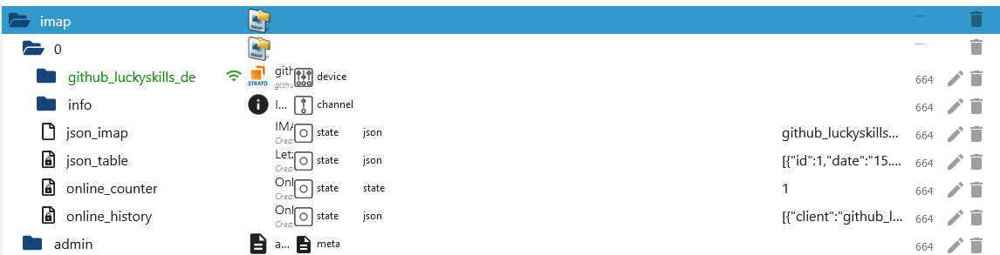

### Условия`imap.0.benutzername`

[Краткое содержание](#zusammenfassung)

| объект                               | Описание                                                                                                 |
| ------------------------------------ | -------------------------------------------------------------------------------------------------------- |
| imap.0.xxx.active\_inbox             | Активные входящие                                                                                        |
| imap.0.xxx.host                      | Имя хоста                                                                                                |
| imap.0.xxx.html                      | HTML-код для VIS                                                                                         |
| imap.0.xxx.json                      | [Пример](#array-json) JSON-таблицы для VIS                                                               |
| imap.0.xxx.last\_activity            | Последние события                                                                                        |
| imap.0.xxx.last\_activity\_json      | Какой вид активности можно представить в виде JSON-массива — [пример.](#json-imap0xxxlast_activity_json) |
| imap.0.xxx.last\_activity\_timestamp | Отметка времени последней активности                                                                     |
| imap.0.xxx.online                    | статус IMAP-соединения                                                                                   |
| imap.0.xxx.quality                   | Качество всех данных в формате JSON. Обновление каждые 24 часа — [пример.](#json-imap0xxxquality)        |
| imap.0.xxx.status                    | Информация о соединении IMAP в формате JSON — [пример.](#json-imap0xxxstatus)                            |
| imap.0.xxx.total                     | Количество писем в активном почтовом ящике                                                               |
| imap.0.xxx.total\_unread             | Количество непрочитанных писем в активном почтовом ящике                                                 |

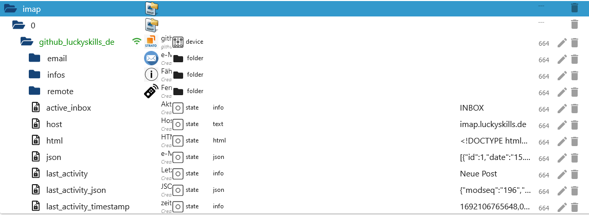

### Условия`imap.0.benutzername.email.email_xx`

[Краткое содержание](#zusammenfassung)

| объект                                  | Описание                                                                                      |
| --------------------------------------- | --------------------------------------------------------------------------------------------- |
| imap.0.xxx.email.email\_01.attach       | Количество вложений и изображений в теле сообщения                                            |
| imap.0.xxx.email.email\_01.attach\_json | Информация о вложении в формате JSON - [пример](#array-json-imap0xxxemailemail_xxattach_json) |
| imap.0.xxx.email\_01.content            | Содержимое электронного письма                                                                |
| imap.0.xxx.email.email\_01.flag         | Метки электронной почты                                                                       |
| imap.0.xxx.email.email\_01.from         | Отправитель в виде массива                                                                    |
| imap.0.xxx.email.email\_01.receive      | Дата получения                                                                                |
| imap.0.xxx.email.email\_01.seq          | Порядковый номер                                                                              |
| imap.0.xxx.email.email\_01.size         | Размер электронного письма в байтах                                                           |
| imap.0.xxx.email.email\_01.subject      | Тема письма                                                                                   |
| imap.0.xxx.email.email\_01.texthtml     | Содержимое в формате HTML                                                                     |
| imap.0.xxx.email.email\_01.to           | Приёмник в виде массива                                                                       |
| imap.0.xxx.email.email\_01.uid          | Уникальный UID                                                                                |

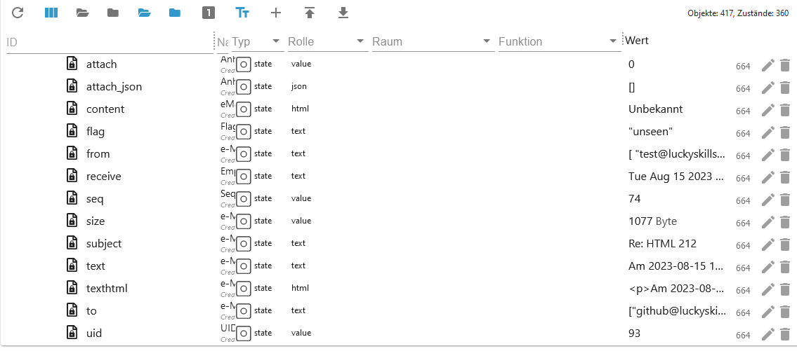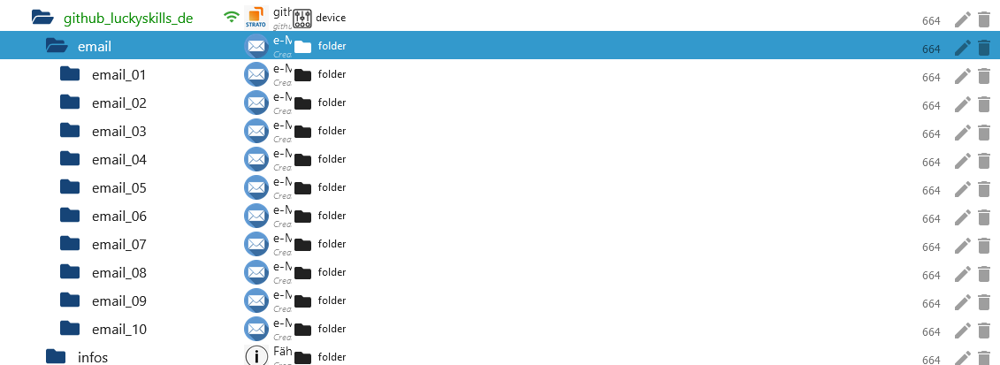

### Условия`imap.0.benutzername.infos`

[Краткое содержание](#zusammenfassung)

| объект                                  | Описание                                                                                                                                                                   |
| --------------------------------------- | -------------------------------------------------------------------------------------------------------------------------------------------------------------------------- |
| imap.0.xxx.infos.all\_capability        | Все функции IMAP-соединения                                                                                                                                                |
| imap.0.xxx.infos.auth\_cram-md5         | Метод аутентификации auth\_cram-md5                                                                                                                                        |
| imap.0.xxx.infos.auth\_xoauth           | метод аутентификации xoauth                                                                                                                                                |
| imap.0.xxx.infos.auth\_xoauth2          | метод аутентификации xoauth2                                                                                                                                               |
| imap.0.xxx.infos.condstore              | Возможна отправка запроса MODSEQ [, см.](https://datatracker.ietf.org/doc/html/rfc4551#page-18)                                                                            |
| imap.0.xxx.infos.esearch                | Поиск по нескольким почтовым ящикам одной командой                                                                                                                         |
| imap.0.xxx.infos.id                     | [Видеть](https://www.iana.org/assignments/imap-capabilities/imap-capabilities.xhtml)                                                                                       |
| imap.0.xxx.infos.idle                   | [Видеть](https://www.iana.org/assignments/imap-capabilities/imap-capabilities.xhtml)                                                                                       |
| imap.0.xxx.infos.literal\*              | [Видеть](https://www.iana.org/assignments/imap-capabilities/imap-capabilities.xhtml)                                                                                       |
| imap.0.xxx.infos.logindisabled          | [Видеть](https://www.iana.org/assignments/imap-capabilities/imap-capabilities.xhtml)                                                                                       |
| imap.0.xxx.infos.move                   | Электронные письма можно переместить. [См.](https://www.iana.org/assignments/imap-capabilities/imap-capabilities.xhtml)                                                    |
| imap.0.xxx.infos.namespace              | [Видеть](https://www.iana.org/assignments/imap-capabilities/imap-capabilities.xhtml)                                                                                       |
| imap.0.xxx.infos.quota                  | [Видеть](https://www.iana.org/assignments/imap-capabilities/imap-capabilities.xhtml)                                                                                       |
| imap.0.xxx.infos.sasl-ir                | [Видеть](https://www.iana.org/assignments/imap-capabilities/imap-capabilities.xhtml)                                                                                       |
| imap.0.xxx.infos.sort                   | Электронные письма будут извлекаться в отсортированном виде. [См.](https://www.iana.org/assignments/imap-capabilities/imap-capabilities.xhtml)                             |
| imap.0.xxx.infos.sort\_display          | Заголовочная информация отсортирована. [См.](https://www.iana.org/assignments/imap-capabilities/imap-capabilities.xhtml)                                                   |
| imap.0.xxx.infos.starttls               | Поддерживается Starttls. Его можно настроить в параметрах экземпляра. [См. \[](https://www.iana.org/assignments/imap-capabilities/imap-capabilities.xhtml) ссылка/ссылка]. |
| imap.0.xxx.infos.thread\_orderedsubject | [Видеть](https://www.iana.org/assignments/imap-capabilities/imap-capabilities.xhtml)                                                                                       |
| imap.0.xxx.infos.thread\_references     | [Видеть](https://www.iana.org/assignments/imap-capabilities/imap-capabilities.xhtml)                                                                                       |
| imap.0.xxx.infos.unselect               | [Видеть](https://www.iana.org/assignments/imap-capabilities/imap-capabilities.xhtml)                                                                                       |
| imap.0.xxx.infos.x-gm-ext-1             | [Видеть](https://www.iana.org/assignments/imap-capabilities/imap-capabilities.xhtml)                                                                                       |

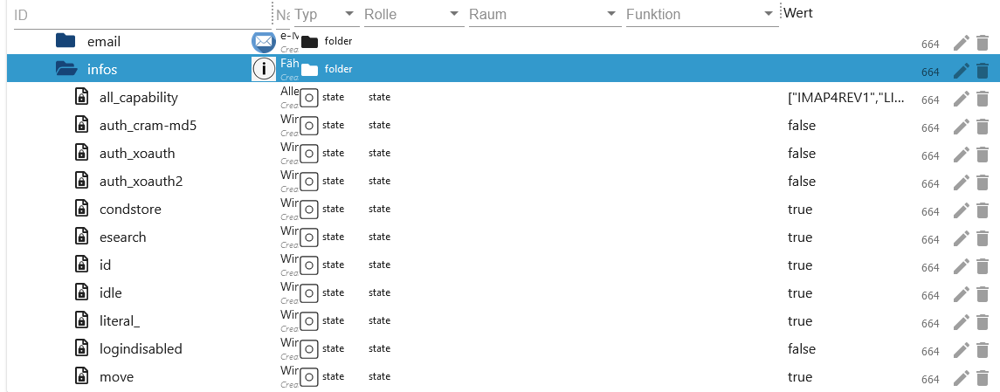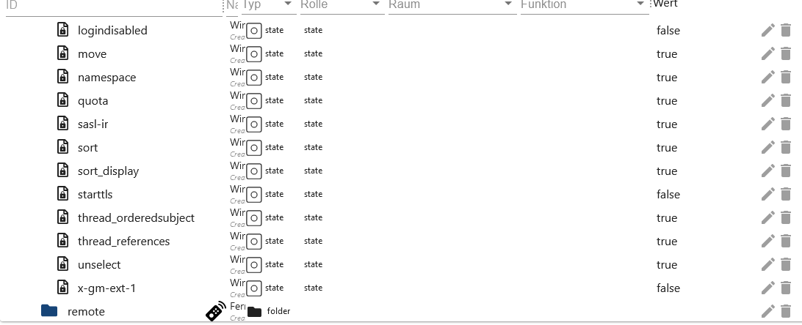

### Условия`imap.0.benutzername.remote`

[Краткое содержание](#zusammenfassung)

| объект                                          | Описание                                                                                                                                                                         |
| ----------------------------------------------- | -------------------------------------------------------------------------------------------------------------------------------------------------------------------------------- |
| imap.0.xxx.remote.apply\_html                   | Примените изменения к файлу imap.0.xxx.remote.html.                                                                                                                              |
| imap.0.xxx.remote.change\_folder                | Настройка экземпляра: Измените папку почты для мониторинга и отображения. Эти настройки будут сброшены только после перезапуска.                                                 |
| imap.0.xxx.remote.criteria                      | Настройки экземпляра: Изменение параметров поиска. Эти параметры будут сброшены только после перезапуска.                                                                        |
| imap.0.xxx.remote.mailbox\_folder\_change\_name | Измените имя папки почтового ящика. Пример: \["INBOX.imap", "INBOX.newimap"] [См.](#ordnername) \[ссылка/ссылка]                                                                 |
| imap.0.xxx.remote.mailbox\_folder\_create       | Создание папок почтового ящика                                                                                                                                                   |
| imap.0.xxx.remote.mailbox\_folder\_delete       | Удалить папку почтового ящика вместе с ее содержимым.                                                                                                                            |
| imap.0.xxx.remote.reload\_emails                | Перезагрузите электронные письма.                                                                                                                                                |
| imap.0.xxx.remote.search\_start                 | Примените изменения к параметрам change\_folder, criteria и show\_mails.                                                                                                         |
| imap.0.xxx.remote.show\_mails                   | Настройки экземпляра: Количество загружаемых писем (максимум HTML). Это значение сбрасывается только после перезапуска. Разумеется, это значение должно быть выше максимального. |
| imap.0.xxx.remote.vis\_command                  | Команда из VIS для перемещения электронных писем из выделенных областей. Используется только в VIS.                                                                              |

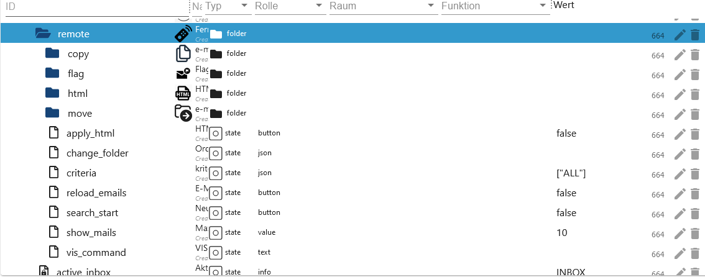

### Название папки

Старые названия папок можно просмотреть в объекте imap.0.xxx.remote.change\_folder.

### Условия`imap.0.benutzername.remote.copy`

[Краткое содержание](#zusammenfassung)

| объект                             | Описание                                                                                                                                   |
| ---------------------------------- | ------------------------------------------------------------------------------------------------------------------------------------------ |
| imap.0.xxx.remote.copy.apply\_copy | Примените изменения к папке и идентификатору пользователя (uid).                                                                           |
| imap.0.xxx.remote.copy.folder      | Выберите папку, куда следует скопировать выбранное электронное письмо.                                                                     |
| imap.0.xxx.remote.copy.uid         | Введите здесь UID электронного письма, которое хотите скопировать. UID можно найти в файле imap.0.xxx.json или в папках электронной почты. |

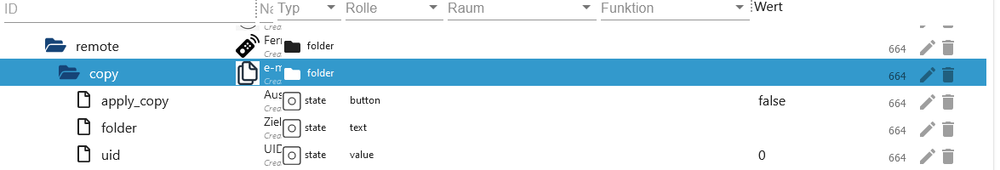

### Условия`imap.0.benutzername.remote.flag`

[Краткое содержание](#zusammenfassung)

| объект                             | Описание                                                                                                         |
| ---------------------------------- | ---------------------------------------------------------------------------------------------------------------- |
| imap.0.xxx.remote.flag.apply\_flag | Примените изменения к набору, типу и идентификатору пользователя.                                                |
| imap.0.xxx.remote.flag.set         | Выберите setFlag, чтобы установить флаг, addFlag, чтобы добавить флаг, и delFlag, чтобы удалить флаг.            |
| imap.0.xxx.remote.flag.type        | Выберите флаг, который хотите добавить, установить или удалить.                                                  |
| imap.0.xxx.remote.flag.uid         | UID, для которого следует изменить флаг. UID можно найти в файле imap.0.xxx.json или в папках электронной почты. |

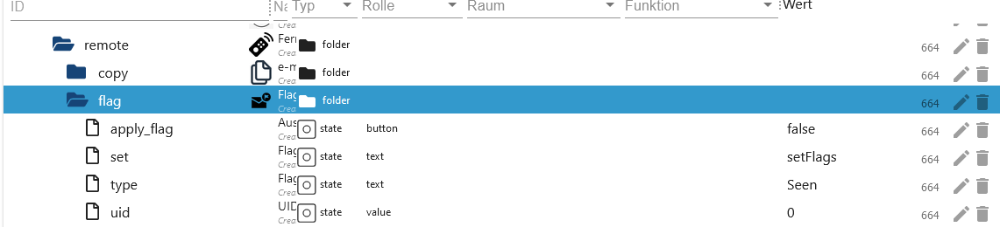

### Условия`imap.0.benutzername.remote.html`

[Краткое содержание](#zusammenfassung)

| объект                                            | Описание                                                                                                                             |
| ------------------------------------------------- | ------------------------------------------------------------------------------------------------------------------------------------ |
| imap.0.xxx.remote.html.body\_background           | Цвет фона таблицы - по умолчанию #000000                                                                                             |
| imap.0.xxx.remote.html.choose\_content            | Отобразить поле из электронного письма.</br> Возможные поля: html, text, textAsHtml и html convert.                                  |
| imap.0.xxx.remote.html.header\_border             | Толщина границы заголовка — стандартная 2 пикселя.                                                                                   |
| imap.0.xxx.remote.html.header\_font               | Шрифт заголовка — стандартный Helvetica.                                                                                             |
| imap.0.xxx.remote.html.header\_font\_size         | Размер шрифта заголовка — по умолчанию 15 пикселей.                                                                                  |
| imap.0.xxx.remote.html.header\_linear\_color\_1   | Значение заголовка градиентного фона 1 - по умолчанию #424242                                                                        |
| imap.0.xxx.remote.html.header\_linear\_color\_2   | Значение заголовка «Градиентный фон» — 2 (по умолчанию #424242)                                                                      |
| imap.0.xxx.remote.html.header\_tag\_border\_color | Цвет рамки заголовка - Стандартный #424242 - Возможно всё                                                                            |
| imap.0.xxx.remote.html.header\_text\_color        | Цвет текста заголовка — по умолчанию #BDBDBD                                                                                         |
| imap.0.xxx.remote.html.header\_width              | Ширина заголовка — по умолчанию автоматически — может быть задана в пикселях или процентах.                                          |
| imap.0.xxx.remote.html.headline\_align\_column\_1 | Выравнивание текста в заголовке столбца 1 — по центру (стандартное).</br> Возможные варианты: центр, левый, правый и автоматический. |

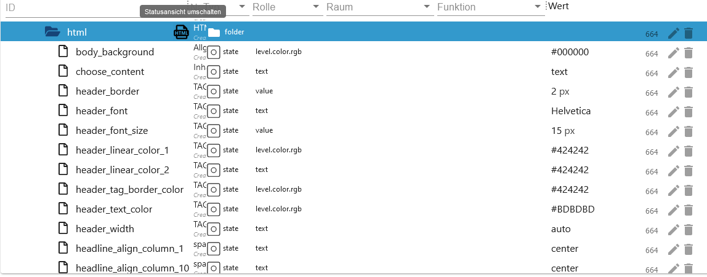

| объект                                             | Описание                                                                                                                                        |
| -------------------------------------------------- | ----------------------------------------------------------------------------------------------------------------------------------------------- |
| imap.0.xxx.remote.html.headline\_align\_column\_2  | Выравнивание текста в заголовке столбца 2 — стандартное выравнивание по центру.</br> Возможные варианты: центр, левый, правый и автоматический. |
| imap.0.xxx.remote.html.headline\_align\_column\_3  | Выравнивание текста в заголовке столбца 3 — по центру (стандартное).</br> Возможные варианты: центр, левый, правый и автоматический.            |
| imap.0.xxx.remote.html.headline\_align\_column\_4  | Выравнивание текста в заголовке столбца 4 — по центру (стандартное).</br> Возможные варианты: центр, левый, правый и автоматический.            |
| imap.0.xxx.remote.html.headline\_align\_column\_5  | Выравнивание текста в заголовке столбца 5 — по центру (стандартное).</br> Возможные варианты: центр, левый, правый и автоматический.            |
| imap.0.xxx.remote.html.headline\_align\_column\_6  | Выравнивание текста в заголовке столбца 6 — по центру (стандартное).</br> Возможные варианты: центр, левый, правый и автоматический.            |
| imap.0.xxx.remote.html.headline\_align\_column\_7  | Выравнивание текста в заголовке столбца 7 — по центру (стандартное).</br> Возможные варианты: центр, левый, правый и автоматический.            |
| imap.0.xxx.remote.html.headline\_align\_column\_8  | Выравнивание текста в заголовке колонки 8 - по центру (стандартное).</br> Возможные варианты: центр, левый, правый и автоматический.            |
| imap.0.xxx.remote.html.headline\_align\_column\_9  | Выравнивание текста в заголовке столбца 9 — по центру (стандартное).</br> Возможные варианты: центр, левый, правый и автоматический.            |
| imap.0.xxx.remote.html.headline\_align\_column\_10 | Выравнивание текста в заголовке столбца 10 — по центру (стандартное).</br> Возможные варианты: центр, левый, правый и автоматический.           |
| imap.0.xxx.remote.html.headline\_color             | Цвет рамки основного текста - Стандартный #BD5A3C                                                                                               |
| imap.0.xxx.remote.html.headline\_column\_width\_1  | Ширина столбца 1 - По умолчанию авто - Может быть задана в пикселях или процентах                                                               |
| imap.0.xxx.remote.html.headline\_column\_width\_10 | Ширина столбца: Столбец 10 - По умолчанию авто - Может быть задано в пикселях или процентах                                                     |

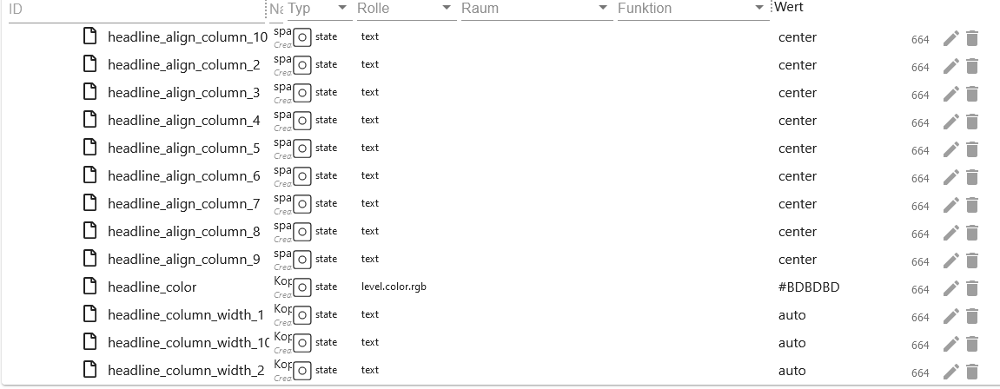

| объект                                            | Описание                                                                                    |
| ------------------------------------------------- | ------------------------------------------------------------------------------------------- |
| imap.0.xxx.remote.html.headline\_column\_width\_2 | Ширина столбца 2 - По умолчанию авто - Может быть задана в пикселях или процентах           |
| imap.0.xxx.remote.html.headline\_column\_width\_3 | Ширина столбца 3 - По умолчанию авто - Может быть задана в пикселях или процентах           |
| imap.0.xxx.remote.html.headline\_column\_width\_4 | Ширина столбца 4 - По умолчанию авто - Может быть задана в пикселях или процентах           |
| imap.0.xxx.remote.html.headline\_column\_width\_5 | Ширина столбца Столбец 5 - По умолчанию авто - Может быть задана в пикселях или процентах   |
| imap.0.xxx.remote.html.headline\_column\_width\_6 | Ширина столбца 6 - По умолчанию авто - Может быть задана в пикселях или процентах           |
| imap.0.xxx.remote.html.headline\_column\_width\_7 | Ширина столбца 7 - По умолчанию авто - Может быть задана в пикселях или процентах           |
| imap.0.xxx.remote.html.headline\_column\_width\_8 | Ширина столбца: Столбец 8 - По умолчанию авто - Может быть задана в пикселях или процентах  |
| imap.0.xxx.remote.html.headline\_column\_width\_9 | Ширина столбца. Столбец 9 - По умолчанию авто - Может быть задана в пикселях или процентах. |
| imap.0.xxx.remote.html.headline\_font\_size       | Размер текста в строках — по умолчанию 16 пикселей.                                         |
| imap.0.xxx.remote.html.headline\_height           | Высота ячейки — по умолчанию 35 пикселей.                                                   |
| imap.0.xxx.remote.html.headline\_style            | Стиль ячейки: по умолчанию обычный; по желанию — обычный или жирный.                        |

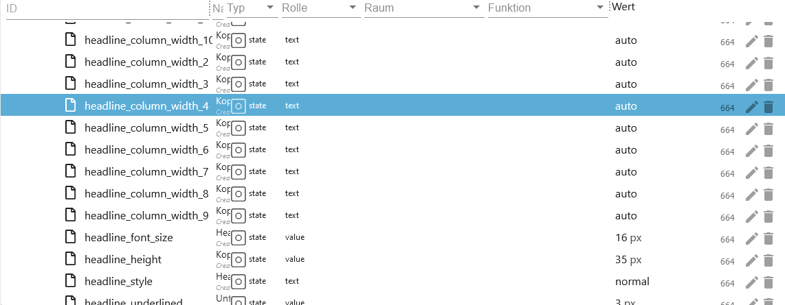

| объект                                             | Описание                                                                                                                                       |
| -------------------------------------------------- | ---------------------------------------------------------------------------------------------------------------------------------------------- |
| imap.0.xxx.remote.html.headline\_underlined        | Граница ячейки — по умолчанию 3 пикселя.                                                                                                       |
| imap.0.xxx.remote.html.headline\_underlined\_color | Цвет границы ячейки - Стандартный #ffffff                                                                                                      |
| imap.0.xxx.remote.html.jarvis                      | Корректировка кода для просмотра в Jarvis                                                                                                      |
| imap.0.xxx.remote.html.mails\_even\_color          | Цвет фона строки для четных идентификаторов — по умолчанию #333333                                                                             |
| imap.0.xxx.remote.html.mails\_nextday\_color\_even | Цвет фона строки для четных ID вчера - по умолчанию #F7FFE0                                                                                    |
| imap.0.xxx.remote.html.mails\_nextday\_color\_odd  | Цвет фона строки для нечетных ID вчера - по умолчанию #F7FFE0                                                                                  |
| imap.0.xxx.remote.html.mails\_odd\_color           | Цвет фона строки для нечетных идентификаторов — по умолчанию #FFE32E                                                                           |
| imap.0.xxx.remote.html.mails\_today\_color         | Цвет фона строки для четных идентификаторов, текущий день - по умолчанию #ffffff                                                               |
| imap.0.xxx.remote.html.mails\_today\_color\_odd    | Цвет фона строки для нечетных ID, текущий день - по умолчанию #ffffff                                                                          |
| imap.0.xxx.remote.html.p\_tag\_text\_align         | Выравнивание текста в верхнем и нижнем колонтитулах — по центру (стандартное).</br> Возможные варианты: центр, левый, правый и автоматический. |
| imap.0.xxx.remote.html.short\_content              | Ограничение по количеству символов в тексте - Стандарт 35                                                                                      |
| imap.0.xxx.remote.html.short\_subject              | Ограничение на количество символов в строке темы — по умолчанию 35.                                                                            |
| imap.0.xxx.remote.html.table\_tag\_border\_color   | Цвет границы таблицы - Стандартный #424242                                                                                                     |

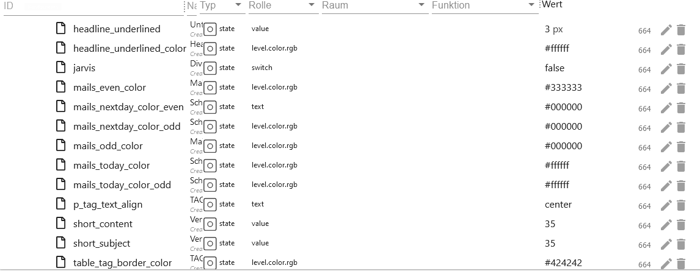

| объект                                         | Описание                                                                                        |
| ---------------------------------------------- | ----------------------------------------------------------------------------------------------- |
| imap.0.xxx.remote.html.table\_tag\_cell        | Расстояние между ячейками — по умолчанию 6 пикселей.                                            |
| imap.0.xxx.remote.html.table\_tag\_text\_align | Выравнивание текста в таблице — по умолчанию автоматический — возможно пиксели или проценты     |
| imap.0.xxx.remote.html.table\_tag\_width       | Размер таблицы — по умолчанию автоматический — возможно в пикселях или процентах.               |
| imap.0.xxx.remote.html.td\_tag\_2\_columns     | Границы строк 1 и 2 — по умолчанию автоматические — возможно указание в пикселях или процентах. |
| imap.0.xxx.remote.html.td\_tag\_border\_bottom | Нижний отступ — по умолчанию 1 пиксель.                                                         |
| imap.0.xxx.remote.html.td\_tag\_border\_color  | Цвет нижней границы — стандартный № 424242                                                      |
| imap.0.xxx.remote.html.td\_tag\_border\_right  | Правый отступ — по умолчанию 1 пиксель                                                          |
| imap.0.xxx.remote.html.td\_tag\_cell           | Расстояние между ячейками в строках — по умолчанию 6 пикселей.                                  |
| imap.0.xxx.remote.html.text\_content           | Заголовочный текст, столбец 5 — Стандартное содержимое                                          |
| imap.0.xxx.remote.html.text\_date              | Заголовочный текст, столбец 4 - Стандартная дата                                                |
| imap.0.xxx.remote.html.text\_flag              | Заголовочный текст, столбец 7 — Стандартные флаги                                               |
| imap.0.xxx.remote.html.text\_from              | Заголовочный текст, столбец 2 — по умолчанию из                                                 |

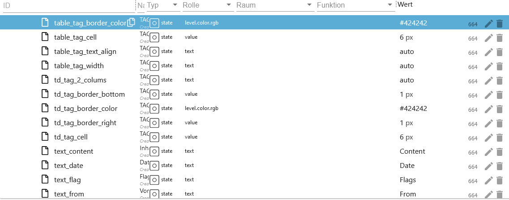

| объект                                       | Описание                                                                              |
| -------------------------------------------- | ------------------------------------------------------------------------------------- |
| imap.0.xxx.remote.html.text\_id              | Заголовочный текст, столбец 1 - ID по умолчанию                                       |
| imap.0.xxx.remote.html.text\_move\_or\_copy  | Заголовочный текст, столбец 9 — стандартное копирование/вставка                       |
| imap.0.xxx.remote.html.text\_select\_addflag | Начальный текст в поле выбора флага - Стандартная функция добавления флагов -         |
| imap.0.xxx.remote.html.text\_select\_copy    | Начальный текст в выделенной области — стандартный текст                              |
| imap.0.xxx.remote.html.text\_select\_delflag | Начальный текст в поле выбора флага - Стандартное удаление флагов -                   |
| imap.0.xxx.remote.html.text\_select\_move    | Копирование начального текста в выделенную область — перемещение текста по умолчанию. |
| imap.0.xxx.remote.html.text\_select\_setflag | Начальный текст в поле выбора флага - Default setFlags -                              |
| imap.0.xxx.remote.html.text\_seq             | Заголовочный текст, столбец 6 - Стандартная последовательность                        |
| imap.0.xxx.remote.html.text\_setflag         | Столбец заголовка 10 — Стандартное действие флага                                     |
| imap.0.xxx.remote.html.text\_subject         | Заголовочный текст, столбец 3 - Стандартный предмет                                   |
| imap.0.xxx.remote.html.text\_uid             | Заголовочный текст, столбец 8 — Стандартный UID                                       |
| imap.0.xxx.remote.html.top\_font             | Шрифт для верхнего и нижнего колонтитулов — стандартный Helvetica.                    |

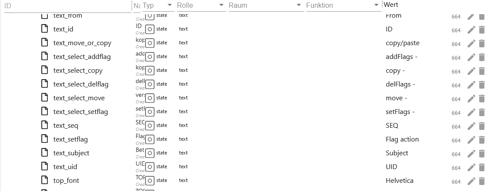

| объект                                   | Описание                                                                                                  |
| ---------------------------------------- | --------------------------------------------------------------------------------------------------------- |
| imap.0.xxx.remote.html.top\_font\_size   | Размер шрифта для заголовка и нижнего колонтитула — по умолчанию 20 пикселей.                             |
| imap.0.xxx.remote.html.top\_font\_weight | Толщина шрифта в верхнем и нижнем колонтитулах: — Стандартный обычный — Дополнительно: обычный или жирный |
| imap.0.xxx.remote.html.top\_text         | Заголовочный текст: имя пользователя по умолчанию                                                         |
| imap.0.xxx.remote.html.top\_text\_color  | Цвет текста заголовка - Стандартный #ffffff                                                               |

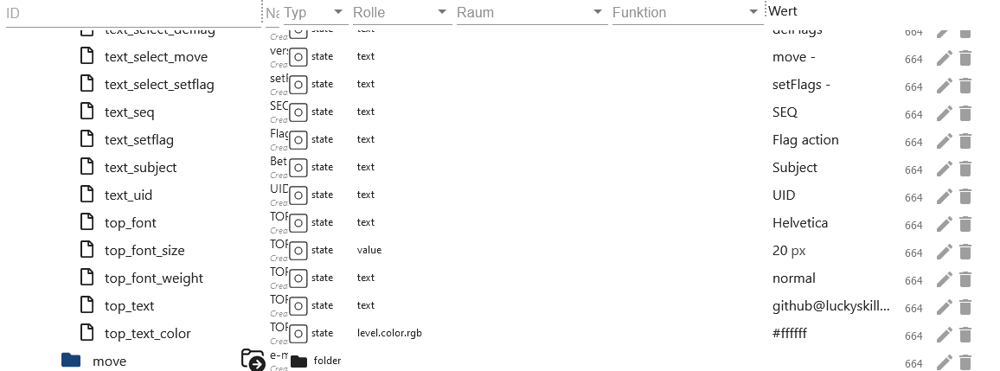

### Условия`imap.0.benutzername.remote.move`

[Краткое содержание](#zusammenfassung)

| объект                             | Описание                                                                                                                                       |
| ---------------------------------- | ---------------------------------------------------------------------------------------------------------------------------------------------- |
| imap.0.xxx.remote.move.apply\_move | Примените изменения к папке и идентификатору пользователя (uid).                                                                               |
| imap.0.xxx.remote.move.folder      | Выберите папку, в которую следует переместить выбранное электронное письмо.                                                                    |
| imap.0.xxx.remote.move.uid         | Введите здесь UID адреса электронной почты, который нужно переместить. UID можно найти в файле imap.0.xxx.json или в папках электронной почты. |

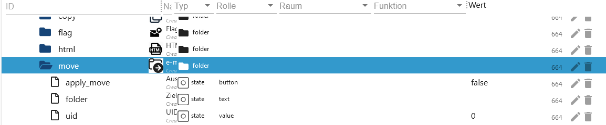

# Блоклис

### Изменить IMAP-запрос Blockly

[Краткое содержание](#zusammenfassung)

- Это позволяет вам задать эти [точки данных](#zustände-imap0benutzernameremote) .
- Возможные флаги можно найти [в конфигурации экземпляра](#instanz-konfiguration-tab-imap-erstellen) .
- Выберите IMAP-подключение или примените его ко всем подключениям.
- Допускается максимум 100 электронных писем.

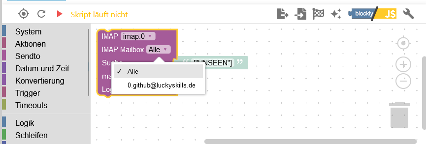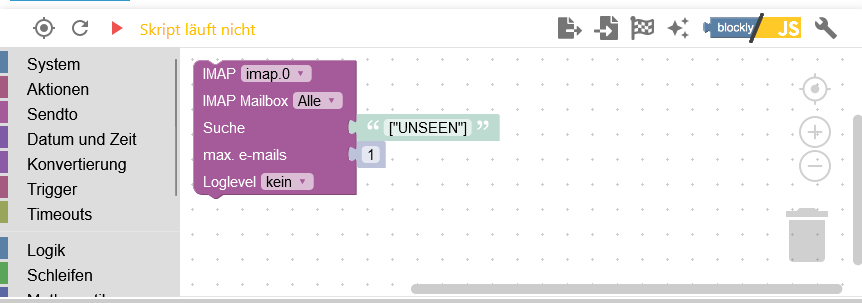

### Пользовательский запрос Blockly IMAP

[Краткое содержание](#zusammenfassung)

- ВНИМАНИЕ! Сюда будут отправляться все данные, такие как вложения. Этот запрос может довести вашу оперативную память или процессор до предела. Создание некорректного критерия может привести к сбою ioBroker!!!
- Затем данные передаются в формате JSON.
- В результате ведения журнала создается очень большой файл. Поэтому записи в журнале следует удалять позже.
- Должна существовать переменная с именем`result` быть сотворённым.
- Допускается максимум 100 электронных писем.
- [Примеры](/#/docs/adapterref/iobroker.imap/EXAMPLE.md)

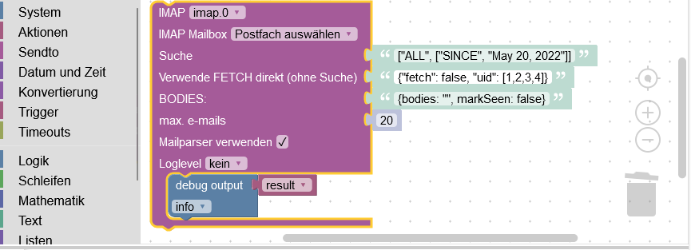

### Запрос Blockly IMAP с настройками экземпляра

[Краткое содержание](#zusammenfassung)

- Загрузите все данные из IMAP-соединения и обработайте их вручную. В качестве критерия поиска используется параметр экземпляра.
- ВНИМАНИЕ! Высокое потребление оперативной памяти.
- Затем данные передаются в формате JSON.
- В результате ведения журнала создается очень большой файл. Поэтому записи в журнале следует удалять позже.
- Должна существовать переменная с именем`result` быть сотворённым.
- [Примеры](/#/docs/adapterref/iobroker.imap/EXAMPLE.md)

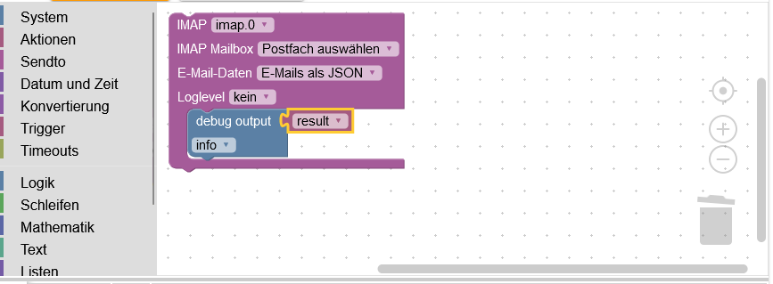

### Настройка флагов IMAP Blockly

[Краткое содержание](#zusammenfassung)

- В электронном письме для указания флага можно использовать \`setFlag=set\`, \`addFlag=add\` или \`delFlag=delete\`.
- Выберите почтовый ящик.
- Выберите setFlag=set, addFlag=add или delFlag=delete.
- Выберите флаг.
- [Возможные значения флагов можно найти в файле imap.0.xxx.status.](#json-imap0xxxstatus)

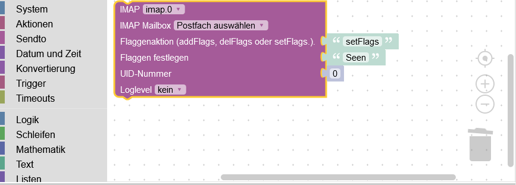

# JSON-массив

### Array JSON imap.0.xxx.email.email\_xx.attach\_json

[Краткое содержание](#zusammenfassung)

```json
[
    {
        "partID": "2",
        "id": "<image001.png@01D9C718.240FAD50>",
        "uid": 86,
        "size": "159762",
        "filename": "image001.png",
        "type": "inline",
        "encoding": "base64"
    },
    {
        "partID": "3",
        "id": "<image002.png@01D9C718.36F8AE30>",
        "uid": 86,
        "size": "1296247",
        "filename": "image002.png",
        "type": "inline",
        "encoding": "base64"
    }
]
```

### Массив JSON imap.0.xxx.json

[Краткое содержание](#zusammenfassung)

```json
[
    {
        "id": 1,
        "date": "15.08.2023 15:39:17",
        "from": ["test@luckyskills.de"],
        "from_name": ["Tester"],
        "attach": 0,
        "attach_info": [],
        "to": ["github@luckyskills.de"],
        "to_name": ["Lucky-ESA"],
        "subject": "Test",
        "text": "Am 2023-08-10 12:17, schrieb test@luckyskills.de:\n>>> TEST\n",
        "html": false,
        "textAsHtml": "Am 2023-08-10 12:17, schrieb <a href=\"mailto:test@luckyskills.de\">test@luckyskills.de</a>:<br/>&gt;&gt;&gt; TEST</p>",
        "seqno": 74,
        "uid": 93,
        "size": 1077,
        "flag": "unseen"
    }
]
```

### JSON imap.0.xxx.last\_activity\_json

[Краткое содержание](#zusammenfassung)

```json
{
    "modseq": "196",
    "flags": ["\\Seen"]
}
```

### JSON imap.0.xxx.quality

[Краткое содержание](#zusammenfassung)

```json
{
    "message": "No Message"
}
```

### Возможности

```
0: "0x00 - good",
1: "0x01 - general problem",
2: "0x02 - no connection problem",
16: "0x10 - substitute value from controller",
17: "0x11 - general problem by instance",
18: "0x12 - instance not connected",
32: "0x20 - substitute initial value",
64: "0x40 - substitute value from device or instance",
65: "0x41 - general problem by device",
66: "0x42 - device not connected",
68: "0x44 - device reports error",
128: "0x80 - substitute value from sensor",
129: "0x81 - general problem by sensor",
130: "0x82 - sensor not connected",
132: "0x84 - sensor reports error",
```

### JSON imap.0.xxx.status

[Краткое содержание](#zusammenfassung)

```json
{
    "name": "INBOX",
    "flags": ["\\Answered", "\\Flagged", "\\Deleted", "\\Seen", "\\Draft"],
    "readOnly": false,
    "uidvalidity": 1667682367,
    "uidnext": 94,
    "permFlags": ["\\Answered", "\\Flagged", "\\Deleted", "\\Seen", "\\Draft"],
    "keywords": [],
    "newKeywords": true,
    "persistentUIDs": true,
    "nomodseq": false,
    "seq": 0,
    "time": 0,
    "reason": "",
    "user": "github_luckyskills_de",
    "messages": {
        "total": 74,
        "new": 0
    },
    "highestmodseq": "200"
}
```

### Массив JSON imap.0.online\_history

[Краткое содержание](#zusammenfassung)

```json
[
    {
        "client": "github_luckyskills_de",
        "time": 1692298599784,
        "status": "Online"
    },
    {
        "client": "github_luckyskills_de",
        "time": 1692298232899,
        "status": "Online"
    }
]
```

## Changelog

### **WORK IN PROGRESS**

- (Lucky-ESA) Admin 7.6.20 required

### 0.4.0 (2026-05-30)

- (copilot) Adapter requires node.js >= 22 now
- (Lucky-ESA) Description revised
- (Lucky-ESA) Admin 7.8.23 required
- (Lucky-ESA) JS-Controller 7.0.7 required
- (Lucky-ESA) Added meta object for attachments

### 0.3.0 (2024-12-07)

- (Lucky-ESA) Mailbox folder delete added
- (Lucky-ESA) Mailbox folder create added
- (Lucky-ESA) Change Mailbox Folder name added
- (Lucky-ESA) IMAP package changed
- (Lucky-ESA) Migration to ESLint9

### 0.2.2 (2024-11-07)

- (Lucky-ESA) New design for settings page added
- (Lucky-ESA) Crash if uid is empty for new emails

### 0.2.1 (2024-09-16)

- (Lucky-ESA) Update dependencies
- (Lucky-ESA) Changed Log info to debug
- (Lucky-ESA) Fixed blockly setFlag crash

### 0.2.0 (2024-06-15)

- (Lucky-ESA) Updated Blockly definitions
- (Lucky-ESA) JS-Controller >= 5.0.19 required
- (Lucky-ESA) Admin >=6.13.16 required

[Older changelogs can be found there](CHANGELOG_OLD.md)

## License

MIT License

Copyright (c) 2023-2026 Lucky-ESA <github@luckyskills.de>

Permission is hereby granted, free of charge, to any person obtaining a copy
of this software and associated documentation files (the "Software"), to deal
in the Software without restriction, including without limitation the rights
to use, copy, modify, merge, publish, distribute, sublicense, and/or sell
copies of the Software, and to permit persons to whom the Software is
furnished to do so, subject to the following conditions:

The above copyright notice and this permission notice shall be included in all
copies or substantial portions of the Software.

THE SOFTWARE IS PROVIDED "AS IS", WITHOUT WARRANTY OF ANY KIND, EXPRESS OR
IMPLIED, INCLUDING BUT NOT LIMITED TO THE WARRANTIES OF MERCHANTABILITY,
FITNESS FOR A PARTICULAR PURPOSE AND NONINFRINGEMENT. IN NO EVENT SHALL THE
AUTHORS OR COPYRIGHT HOLDERS BE LIABLE FOR ANY CLAIM, DAMAGES OR OTHER
LIABILITY, WHETHER IN AN ACTION OF CONTRACT, TORT OR OTHERWISE, ARISING FROM,
OUT OF OR IN CONNECTION WITH THE SOFTWARE OR THE USE OR OTHER DEALINGS IN THE
SOFTWARE.