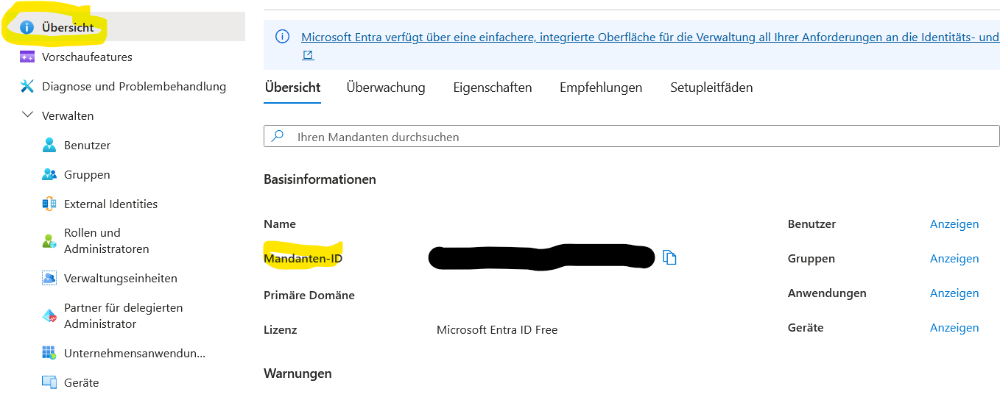
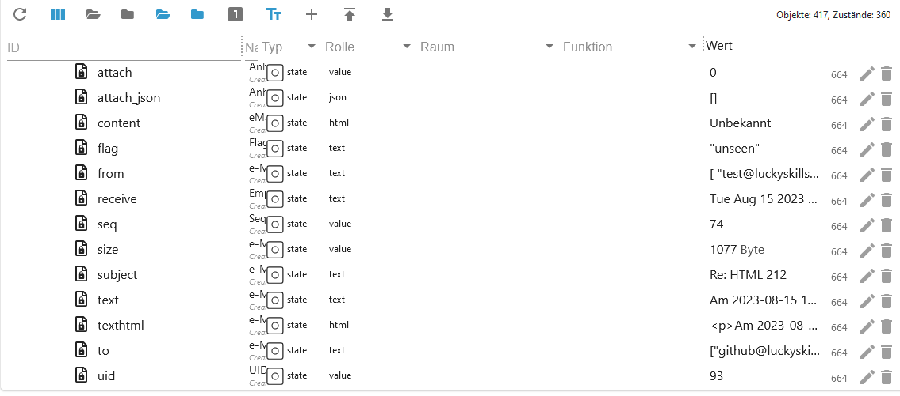

# IoBroker.imap
```:warning:
 ⚠ Dieser Adapter kann mit dem Blockly (Eigene Abfrage) das System sehr schnell zum Absturz bringen.
 ⚠ Daher bitte diese Beschreibung aufmerksam durchlesen.
```

[Вернуться к README](/README.md)

# Краткое содержание
- [Настройки экземпляра](#instance-settings)
- [Настройки ВКЛАДКА IMAP](#instance-configuration-tab-imap-create)
- [Символы вкладки настроек](#instance-configuration-tab-symbols-create)
- [Настройки ВКЛАДКА Oauth2](#instance-configuration-tab-oauth2-create)
- [Настройки Вкладка Mailparser](#instance-configuration-tab-mailparser-options-create)
- [точки данных](#состояния-объекты)
- [Точки данных imap.0](#states-imap0)
- [Точки данных imap.0.имя_пользователя](#states-imap0имя_пользователя)
- [Точки данных imap.0.имя_пользователя.email.emails_xx](#states-imap0имя_пользователяemailmail_xx)
- [Точки данных imap.0.username.infos](#states-imap0usernameinfos)
- [Точки данных imap.0.username.remote](#states-imap0usernameremote)
- [Точки данных imap.0.username.remote.copy](#states-imap0usernameremotecopy)
- [Точки данных imap.0.username.remote.flag](#states-imap0usernameremoteflag)
- [Точки данных imap.0.username.remote.html](#states-imap0usernameremotehtml)
- [Точки данных imap.0.username.remote.move](#states-imap0usernameremotemove)
- [Blocklys](#blocklys)
- [Изменить настройки экземпляра Blockly](#blockly-imap-query-with-instance-settings)
- [Создайте свой собственный запрос](#blockly-imap-change-query)
- [Запрос с настройками экземпляра](#blockly-imap-custom-query)
- [Установить флаги](#blockly-imap-flags-setzen)
- [Массив JSON](#array-json)
- [imap.0.xxx.email.email_xx.attach_json](#array-json-imap0xxxemailemail_xxattach_json)
- [imap.0.xxx.json](#array-json-imap0xxxjson)
- [imap.0.xxx.last_activity_json](#json-imap0xxxlast_activity_json)
- [imap.0.xxx.quality](#json-imap0xxxquality)
- [imap.0.xxx.status](#json-imap0xxxstatus)
- [imap.0.online_history](#array-json-imap0online_history)
- [Пример Javascript и Blocklys](/docs/de/EXAMPLE.md)

# Настройки экземпляра
### Вкладка конфигурации экземпляра IMAP Создать
[Краткое содержание](#zusammenfassung)

```:warning:
 ⚠ Die Instanz muss aktiviert sein!!!!
```

- `Активно`: активировать соединение IMAP
- `Хост`: например, imap.gmail.com
- `Входящие`: Стандартный ящик для входящих сообщений - Ящик для мониторинга - Возможный выбор см. imap.0.xxx.remote.change_folder

Пример: INBOX.subfolder (точка в качестве разделителя)

- `Порт`: по умолчанию 993
- `Имя пользователя`: Имя пользователя - Экземпляр должен быть активирован!!!
- `Пароль`: Пароль - Экземпляр должен быть включен!!! - [вход в Gmail](https://support.google.com/mail/answer/185833?hl=de) - [аутентификация Outlook Oauth2](https://learn.microsoft.com/en-us/entra/identity-platform/quickstart-register-app?tabs=certificate)

  

- `макс.`: Максимальная система в виде точек данных email_01...email_02... (1-99)
- `макс. HTML`: Максимальное количество писем в формате HTML. Должно быть больше максимального количества точек данных (1–99).
- `TLS`: использовать TLS-соединение — по умолчанию true
- `Flags`: Флаг для запроса IMAP. Возможные флаги:

```
ALL - alle – Alle Nachrichten.
ANSWERED - geantwortet – Nachrichten mit gesetzter Beantwortet-Flagge.
DELETED - gelöscht – Nachrichten mit gesetzter Gelöscht-Flagge.
DRAFT - Entwurf – Nachrichten mit gesetzter Entwurfsflagge.
FLAGGED - gekennzeichnet – Nachrichten mit gesetzter Flagge.
NEW - neu – Nachrichten, bei denen das Flag „Zuletzt verwendet“ gesetzt ist, aber nicht das Flag „Gesehen“.
SEEN - gesehen – Nachrichten, bei denen das Flag „Gesehen“ gesetzt ist.
RECENT - jüngste – Nachrichten, bei denen das Flag „Zuletzt verwendet“ gesetzt ist.
OLD - alt – Nachrichten, für die das Flag „Zuletzt verwendet“ nicht gesetzt ist. Dies entspricht funktional !RECENT (im Gegensatz zu „!NEW“).
UNANSWERED - unbeantwortet – Nachrichten, bei denen das Flag „Beantwortet“ nicht gesetzt ist.
UNDELETED - ungelöscht – Nachrichten, für die das Flag „Gelöscht“ nicht gesetzt ist.
UNDRAFT - kein Entwurf – Nachrichten, bei denen das Draft-Flag nicht gesetzt ist.
UNFLAGGED - ungekennzeichnet – Nachrichten, für die das Flag „Markiert“ nicht gesetzt ist.
UNSEEN - ungesehen – Nachrichten, bei denen das Flag „Gesehen“ nicht gesetzt ist.
```

- `Выбрать значок`: Значок для папки (загрузить в разделе `Создать значки`)


- `tls-option`: по умолчанию {"rejectUnauthorized": false}
- `Auto-TLS`: Возможные варианты: `always`, `required` и `never`. Значение по умолчанию — `never`.

**Для получения более подробной информации прочтите [здесь](https://www.npmjs.com/package/node-imap).**


- `Att.`: Для заполнения HTML-поля необходимо загрузить вложения. Это потребляет много оперативной памяти! Поэтому значение по умолчанию — `false`.
- `Mailparser-Option`: параметр Mailparser (сначала создайте его на вкладке `MAILPARSER-OPTIONS`)
- `Token`: Токен [сначала создайте здесь](#instance-configuration-tab-oauth2-create)


- `макс. предел MEMRSS:` с момента запуска следующего действия.
- `Перезапуск`: при достижении лимита MEMRSS адаптер будет перезапущен. Однако эта проверка выполняется только каждые 24 часа.


- `Идентификатор объекта:` При достижении предела MEMRSS выбранной точке данных присваивается значение `истина`. Это значение необходимо сбросить вручную. Однако проверка выполняется только каждые 24 часа.


- `Отправить`: при достижении лимита MEMRSS отправляется сообщение. Далее сообщение отправляется при каждом обновлении `MEMRSS`.
- `Экземпляры:` Пример: telegram.0,telegram.1,pushover.0
- `Пользователь экземпляра:` Пример: Питер,Олаф,Томас


### Вкладка конфигурации экземпляра Создание символов
[Краткое содержание](#zusammenfassung)

- `Имя символа:` Имя символа. Не используйте повторяющиеся имена. Это приведёт к появлению ошибки в журнале при запуске адаптера.
- `Загрузить:` Загрузить значок.


### Создать конфигурацию экземпляра TAB oauth2
[Краткое содержание](#zusammenfassung)

- `Имя` Имя
- `Идентификатор клиента` Идентификатор клиента
- токен `Токен`
- `Идентификатор клиента` Идентификатор клиента

</br> </br> </br> 

### Вкладка конфигурации экземпляра Параметры Mailparser Создать
[Краткое содержание](#zusammenfassung)

- `Имя:` Имя почтового парсера. Не используйте повторяющиеся имена. Это приведёт к появлению ошибки в журнале при запуске адаптера. Подробное описание можно найти [здесь](https://nodemailer.com/extras/mailparser/).
- `Пропустить HTML в текст:` Не генерирует простой текст из HTML
- `Максимальная длина HTML для анализа:` Максимальный объём HTML-кода для анализа в байтах. При превышении этого ограничения будут сгенерированы только данные заголовка.
- `Пропустить ссылки на изображения`: пропускает преобразование вложений CID в изображения URL-адресов данных. Изображения не преобразуются в base64, что позволяет `значительно экономить оперативную память`.
- `Пропустить текст в HTML:` Не генерирует HTML из обычных текстовых сообщений.
- `Пропускать текстовые ссылки:` Не размещайте ссылки в текстовом контенте.


# Состояния (объекты)
### Условия `imap.0`
[Краткое содержание](#zusammenfassung)

| Объект | Описание |
| --------------------- | ----------------------------------------------------------------------------------------------- |
| imap.0.json_imap | Имя IMAP-подключения с последней активностью. Срабатывает при входящих письмах или обновлениях. |
| imap.0.json_table | Последнее обновление соединения IMAP в виде таблицы JSON для VIS. |
| imap.0.online_counter | Количество активных подключений IMAP. |
| imap.0.online_history | История подключений в формате JSON - [Пример](#array-json-imap0online_history). |


### Условия `imap.0.benutzername`
[Краткое содержание](#zusammenfassung)

| Объект | Описание |
| ---------------------------------- | --------------------------------------------------------------------------------------------------- |
| imap.0.xxx.active_inbox | Активный почтовый ящик |
| imap.0.xxx.host | имя хоста |
| imap.0.xxx.html | HTML-код для VIS |
| imap.0.xxx.json | Таблица JSON для VIS - [Пример](#array-json) |
| imap.0.xxx.last_activity_json | Какая активность как массив JSON - [Пример](#json-imap0xxxlast_activity_json) |
| imap.0.xxx.last_activity_json | Какая активность как массив JSON - [Пример](#json-imap0xxxlast_activity_json) |
| imap.0.xxx.last_activity_timestamp | Временная метка последней активности |
| imap.0.xxx.quality | Качество всех точек данных в формате JSON. Обновляется каждые 24 часа - [Пример](#json-imap0xxxquality) |
| imap.0.xxx.status | Информация о соединении IMAP в формате JSON - [Пример](#json-imap0xxxstatus) |
| imap.0.xxx.status | Информация о соединении IMAP в формате JSON - [Пример](#json-imap0xxxstatus) |
| imap.0.xxx.total | Количество писем в активном почтовом ящике |
| imap.0.xxx.total_unread | Количество непрочитанных писем в активном почтовом ящике |


### Условия `imap.0.benutzername.email.email_xx`
[Краткое содержание](#zusammenfassung)

| Объект | Описание |
| ------------------------------------- | ------------------------------------------------------------------------------------- |
| imap.0.xxx.email.email_01.attach | Количество вложений и изображений в теле сообщения |
| imap.0.xxx.email.email_01.attach_json | Информация о вложении в формате JSON - [Пример](#array-json-imap0xxxemailemail_xxattach_json) |
| imap.0.xxx.email_01.content | Содержимое электронной почты |
| imap.0.xxx.email.email_01.flag | Флаги электронной почты |
| imap.0.xxx.email.email_01.from | Отправитель как массив |
| imap.0.xxx.email.email_01.receive | Дата получения |
| imap.0.xxx.email.email_01.seq | Порядковый номер |
| imap.0.xxx.email.email_01.size | Размер письма в байтах |
| imap.0.xxx.email.email_01.subject | Тема письма |
| imap.0.xxx.email.email_01.texthtml | Содержимое в формате HTML |
| imap.0.xxx.email.email_01.to | Получатели как массив |
| imap.0.xxx.email.email_01.uid | Уникальный UID |

 

### Условия `imap.0.benutzername.infos`
[Краткое содержание](#zusammenfassung)

| Объект | Описание |
| -------------------------------------- | --------------------------------------------------------------------------------------------------------------------------------------------------------------------- |
| imap.0.xxx.infos.all_capability | Все возможности соединения IMAP |
| imap.0.xxx.infos.auth_cram-md5 | Метод аутентификации auth_cram-md5 |
| imap.0.xxx.infos.auth_xoauth | Метод аутентификации xoauth |
| imap.0.xxx.infos.auth_xoauth2 | Метод аутентификации xoauth2 |
| imap.0.xxx.infos.condstore | Возможен запрос MODSEQ [видеть](https://datatracker.ietf.org/doc/html/rfc4551#page-18) |
| imap.0.xxx.infos.id | [Видеть](https://www.iana.org/assignments/imap-capabilities/imap-capabilities.xhtml) |
| imap.0.xxx.infos.idle | [Видеть](https://www.iana.org/assignments/imap-capabilities/imap-capabilities.xhtml) |
| imap.0.xxx.infos.literal\* | [Видеть](https://www.iana.org/assignments/imap-capabilities/imap-capabilities.xhtml) |
| imap.0.xxx.infos.logindisabled | [Видеть](https://www.iana.org/assignments/imap-capabilities/imap-capabilities.xhtml) |
| imap.0.xxx.infos.move | Письма можно перемещать. [Видеть](https://www.iana.org/assignments/imap-capabilities/imap-capabilities.xhtml) |
| imap.0.xxx.infos.namespace | [Видеть](https://www.iana.org/assignments/imap-capabilities/imap-capabilities.xhtml) |
| imap.0.xxx.infos.quota | [Видеть](https://www.iana.org/assignments/imap-capabilities/imap-capabilities.xhtml) |
| imap.0.xxx.infos.sasl-ir | [Видеть](https://www.iana.org/assignments/imap-capabilities/imap-capabilities.xhtml) |
| imap.0.xxx.infos.sort | Письма будут извлечены отсортированными [Видеть](https://www.iana.org/assignments/imap-capabilities/imap-capabilities.xhtml) |
| imap.0.xxx.infos.sort_display | Информация заголовка сортируется.[Видеть](https://www.iana.org/assignments/imap-capabilities/imap-capabilities.xhtml) |
| imap.0.xxx.infos.starttls | Starttls поддерживается. Его можно настроить в конфигурации экземпляра. [Видеть](https://www.iana.org/assignments/imap-capabilities/imap-capabilities.xhtml) |
| imap.0.xxx.infos.thread_orderedsubject | [Видеть](https://www.iana.org/assignments/imap-capabilities/imap-capabilities.xhtml) |
| imap.0.xxx.infos.thread_references | [Видеть](https://www.iana.org/assignments/imap-capabilities/imap-capabilities.xhtml) |
| imap.0.xxx.infos.unselect | [Видеть](https://www.iana.org/assignments/imap-capabilities/imap-capabilities.xhtml) |
| imap.0.xxx.infos.x-gm-ext-1 | [Видеть](https://www.iana.org/assignments/imap-capabilities/imap-capabilities.xhtml) |
| imap.0.xxx.infos.x-gm-ext-1 | [См.](https://www.iana.org/assignments/imap-capabilities/imap-capabilities.xhtml) |

 

### Условия `imap.0.benutzername.remote`
[Краткое содержание](#zusammenfassung)

| Объект | Описание |
| -------------------------------------------- | -------------------------------------------------------------------------------------------------------------------------------------------------------------------- |
| imap.0.xxx.remote.apply_html | Применить изменения из imap.0.xxx.remote.html. |
| imap.0.xxx.remote.change_folder | Конфигурация экземпляра: изменение почтовой папки для мониторинга и отображения. Сброс будет произведен только после перезагрузки. |
| imap.0.xxx.remote.criteria | Конфигурация экземпляра: Изменить поиск. Сброс будет произведен только после перезагрузки. |
| imap.0.xxx.remote.mailbox_folder_change_name | Изменить имя папки почтового ящика. Пример: ["INBOX.imap", "INBOX.newimap"] [см.](#ordnername) |
| imap.0.xxx.remote.mailbox_folder_create | Создать папку почтового ящика |
| imap.0.xxx.remote.mailbox_folder_delete | Удалить папку почтового ящика с содержимым |
| imap.0.xxx.remote.reload_emails | Перезагрузка писем. |
| imap.0.xxx.remote.search_start | Применить изменения к change_folder, criteria и show_mails |
| imap.0.xxx.remote.show_mails | Конфигурация экземпляра: Количество писем (макс. HTML) для загрузки. Это значение сбрасывается только после перезагрузки. Конечно, оно должно быть больше максимального значения. |
| imap.0.xxx.remote.vis_command | Команда VIS для перемещения писем из полей выбора. Используется только VIS. |


### Имя папки
Старые имена папок можно просмотреть в объекте imap.0.xxx.remote.change_folder

### Условия `imap.0.benutzername.remote.copy`
[Краткое содержание](#zusammenfassung)

| Объект | Описание |
| --------------------------------- | ------------------------------------------------------------------------------------------------------------------------- |
| imap.0.xxx.remote.copy.apply_copy | Применить изменения к папке и uid. |
| imap.0.xxx.remote.copy.folder | Выберите папку, в которую следует скопировать выбранное письмо. |
| imap.0.xxx.remote.copy.uid | Введите здесь UID письма, которое нужно скопировать. UID можно найти в файле imap.0.xxx.json или в папках электронной почты. |


### Условия `imap.0.benutzername.remote.flag`
[Краткое содержание](#zusammenfassung)

| Объект | Описание |
| --------------------------------- | ------------------------------------------------------------------------------------------------------------------------- |
| imap.0.xxx.remote.flag.apply_flag | Применить изменения к набору, типу и uid. |
| imap.0.xxx.remote.flag.set | Выберите setFlag, чтобы установить флаг, addFlag, чтобы добавить флаг, и delFlag, чтобы удалить флаг |
| imap.0.xxx.remote.flag.type | Выберите флаг для добавления, установки или удаления |
| imap.0.xxx.remote.flag.uid | UID, на который следует изменить флаг. UID можно найти в файле imap.0.xxx.json или в папках электронной почты. |


### Условия `imap.0.benutzername.remote.html`
[Краткое содержание](#zusammenfassung)

| Объект | Описание |
| ---------------------------------------------- | ----------------------------------------------------------------------------------------------- |
| imap.0.xxx.remote.html.body_background | Цвет фона таблицы - по умолчанию #000000 |
| imap.0.xxx.remote.html.choose_content | Отображение поля из электронной почты. </br>Возможные поля: html, text, textAsHtml и html convert. |
| imap.0.xxx.remote.html.header_border | Толщина границы заголовка — по умолчанию 2 px |
| imap.0.xxx.remote.html.header_font | Шрифт заголовка - Стандартный Helvetica |
| imap.0.xxx.remote.html.header_font_size | Размер шрифта заголовка — по умолчанию 15 пикселей |
| imap.0.xxx.remote.html.header_linear_color_1 | Значение заголовка градиентного фона 1 — по умолчанию #424242 |
| imap.0.xxx.remote.html.header_linear_color_2 | Значение заголовка градиентного фона 2 — по умолчанию #424242 |
| imap.0.xxx.remote.html.header_tag_border_color | Цвет границы заголовка - Стандарт #424242 - Всё возможно |
| imap.0.xxx.remote.html.header_text_color | Цвет текста заголовка - по умолчанию #BDBDBD |
| imap.0.xxx.remote.html.header_width | Ширина заголовка - По умолчанию авто - Возможные значения px или % |
| imap.0.xxx.remote.html.headline_align_column_1 | Выравнивание текста в заголовке столбца 1 — по умолчанию по центру </br> Возможные значения: по центру, слева, справа и автоматически |


| Объект | Описание |
| ----------------------------------------------- | --------------------------------------------------------------------------------------------- |
| imap.0.xxx.remote.html.headline_align_column_2 | Выравнивание текста в заголовке столбца 2 — по умолчанию по центру </br> Возможные значения: по центру, слева, справа и автоматически |
| imap.0.xxx.remote.html.headline_align_column_3 | Выравнивание текста в заголовке столбца 3 — по умолчанию по центру </br> Возможные значения: по центру, слева, справа и автоматически |
| imap.0.xxx.remote.html.headline_align_column_4 | Выравнивание текста в заголовке столбца 4 — по умолчанию по центру </br> Возможные значения: по центру, слева, справа и автоматически |
| imap.0.xxx.remote.html.headline_align_column_5 | Выравнивание текста в заголовке столбца 5 — по умолчанию по центру </br> Возможные значения: по центру, слева, справа и автоматически |
| imap.0.xxx.remote.html.headline_align_column_6 | Выравнивание текста в заголовке столбца 6 — по умолчанию по центру </br> Возможные значения: по центру, слева, справа и автоматически |
| imap.0.xxx.remote.html.headline_align_column_7 | Выравнивание текста в заголовке столбца 7 — по умолчанию по центру </br> Возможные значения: по центру, слева, справа и автоматически |
| imap.0.xxx.remote.html.headline_align_column_8 | Выравнивание текста в заголовке столбца 8 — по умолчанию по центру </br> Возможные значения: по центру, слева, справа и автоматически |
| imap.0.xxx.remote.html.headline_align_column_9 | Выравнивание текста в заголовке столбца 9 — по умолчанию по центру </br> Возможные значения: по центру, слева, справа и автоматически |
| imap.0.xxx.remote.html.headline_align_column_10 | Выравнивание текста в заголовке столбца 10 — по умолчанию по центру </br> Возможные значения: по центру, слева, справа и автоматически |
| imap.0.xxx.remote.html.headline_color | Цвет границы основного текста — стандартный #BD5A3C |
| imap.0.xxx.remote.html.headline_column_width_1 | Ширина столбца столбец 1 - по умолчанию авто - возможно px или % |
| imap.0.xxx.remote.html.headline_column_width_10 | Ширина столбца column 10 — по умолчанию auto — возможно px или % |


| Объект | Описание |
| ---------------------------------------------- | ------------------------------------------------------------- |
| imap.0.xxx.remote.html.headline_column_width_2 | Ширина столбца 2 - по умолчанию авто - возможны px или % |
| imap.0.xxx.remote.html.headline_column_width_3 | Ширина столбца 3 - по умолчанию авто - возможны px или % |
| imap.0.xxx.remote.html.headline_column_width_4 | Ширина столбца 4 - по умолчанию авто - возможны px или % |
| imap.0.xxx.remote.html.headline_column_width_5 | Ширина столбца 5 - по умолчанию авто - возможны px или % |
| imap.0.xxx.remote.html.headline_column_width_6 | Ширина столбца 6 - по умолчанию авто - возможны px или % |
| imap.0.xxx.remote.html.headline_column_width_7 | Ширина столбца 7 - по умолчанию авто - возможны px или % |
| imap.0.xxx.remote.html.headline_column_width_8 | Ширина столбца column 8 — по умолчанию auto — возможно px или % |
| imap.0.xxx.remote.html.headline_column_width_9 | Ширина столбца 9 — по умолчанию авто — возможны px или % |
| imap.0.xxx.remote.html.headline_font_size | Размер текста в строках - по умолчанию 16 пикселей |
| imap.0.xxx.remote.html.headline_height | Высота ячейки - по умолчанию 35 пикселей |
| imap.0.xxx.remote.html.headline_style | Стиль ячейки - По умолчанию обычный - Возможен обычный или полужирный |


| Объект | Описание |
| ------------------------------------------------ | ---------------------------------------------------------------------------------------------- |
| imap.0.xxx.remote.html.headline_underlined | Граница ячейки — по умолчанию 3 пикселя |
| imap.0.xxx.remote.html.headline_underlined_color | Цвет границы ячейки - по умолчанию #ffffff |
| imap.0.xxx.remote.html.jarvis | Адаптация кода для просмотра в Jarvis |
| imap.0.xxx.remote.html.mails_even_color | Цвет фона строки для четных идентификаторов — Стандарт #333333 |
| imap.0.xxx.remote.html.mails_nextday_color_even | Цвет фона строки для четных идентификаторов вчерашнего дня - по умолчанию #F7FFE0 |
| imap.0.xxx.remote.html.mails_nextday_color_odd | Цвет фона строки для нечетных идентификаторов вчера — по умолчанию #F7FFE0 |
| imap.0.xxx.remote.html.mails_odd_color | Цвет фона строки для нечетных идентификаторов — Стандарт #FFE32E |
| imap.0.xxx.remote.html.mails_today_color | Цвет фона строки для четных идентификаторов на текущий день - по умолчанию #ffffff |
| imap.0.xxx.remote.html.mails_today_color_odd | Цвет фона строки для нечетных идентификаторов на текущий день — по умолчанию #ffffff |
| imap.0.xxx.remote.html.p_tag_text_align | Выравнивание текста верхнего и нижнего колонтитулов — по умолчанию по центру </br> Возможные значения: по центру, слева, справа и автоматически |
| imap.0.xxx.remote.html.short_content | Ограничение на количество символов в содержимом — по умолчанию 35 |
| imap.0.xxx.remote.html.short_subject | Ограничение на количество символов в теме — по умолчанию 35 |
| imap.0.xxx.remote.html.table_tag_border_color | Цвет границы таблицы - По умолчанию #424242 |


| Объект | Описание |
| ------------------------------------------- | --------------------------------------------------------------------- |
| imap.0.xxx.remote.html.table_tag_cell | Расстояние между ячейками - по умолчанию 6 пикселей |
| imap.0.xxx.remote.html.table_tag_text_align | Выравнивание текста таблицы - По умолчанию автоматическое - Возможные значения px или % |
| imap.0.xxx.remote.html.table_tag_width | Размер таблицы - По умолчанию автоматически - Возможные px или % |
| imap.0.xxx.remote.html.td_tag_2_colums | Границы строк 1 и 2 - По умолчанию автоматически - Возможные px или % |
| imap.0.xxx.remote.html.td_tag_border_bottom | Нижнее поле — по умолчанию 1 пиксель |
| imap.0.xxx.remote.html.td_tag_border_color | Цвет границы нижней строки — Стандартный #424242 |
| imap.0.xxx.remote.html.td_tag_border_right | Правое поле строки — по умолчанию 1 пиксель |
| imap.0.xxx.remote.html.td_tag_cell | Расстояние между ячейками в строках — по умолчанию 6 пикселей |
| imap.0.xxx.remote.html.text_content | Текст заголовка, столбец 5 — стандартное содержимое |
| imap.0.xxx.remote.html.text_date | Текст заголовка, столбец 4 — дата по умолчанию |
| imap.0.xxx.remote.html.text_flag | Текст заголовка, столбец 7 — Стандартные флаги |
| imap.0.xxx.remote.html.text_from | Текст заголовка, столбец 2 — по умолчанию от |


| Объект | Описание |
| ------------------------------------------ | --------------------------------------------------- |
| imap.0.xxx.remote.html.text_id | Текст заголовка, столбец 1 — идентификатор по умолчанию |
| imap.0.xxx.remote.html.text_move_or_copy | Текст заголовка, столбец 9 — стандартное копирование/вставка |
| imap.0.xxx.remote.html.text_select_addflag | Начать текст в поле выбора флага - по умолчанию addFlags - |
| imap.0.xxx.remote.html.text_select_copy | Начать копирование текста в поле выбора — копирование по умолчанию |
| imap.0.xxx.remote.html.text_select_delflag | Начать текст в поле выбора флага - по умолчанию delFlags - |
| imap.0.xxx.remote.html.text_select_move | Копировать начальный текст в поле выбора — переместить по умолчанию |
| imap.0.xxx.remote.html.text_select_setflag | Начать текст в поле выбора флага - Стандартный setFlags - |
| imap.0.xxx.remote.html.text_seq | Текст заголовка, столбец 6 — стандартная SEQ |
| imap.0.xxx.remote.html.text_setflag | Текст заголовка, столбец 10 — стандартное действие флага |
| imap.0.xxx.remote.html.text_subject | Текст заголовка, столбец 3 — тема по умолчанию |
| imap.0.xxx.remote.html.text_uid | Текст заголовка, столбец 8 — UID по умолчанию |
| imap.0.xxx.remote.html.top_font | Шрифт верхнего и нижнего колонтитула — стандартный Helvetica |


| Объект | Описание |
| -------------------------------------- | ---------------------------------------------------------------------------- |
| imap.0.xxx.remote.html.top_font_size | Размер шрифта верхнего и нижнего колонтитула — по умолчанию 20 пикселей |
| imap.0.xxx.remote.html.top_font_weight | Толщина шрифта для верхнего и нижнего колонтитулов - По умолчанию обычный - Возможный обычный или полужирный |
| imap.0.xxx.remote.html.top_text | Текст заголовка по умолчанию для имени пользователя |
| imap.0.xxx.remote.html.top_text_color | Цвет текста заголовка - по умолчанию #ffffff |


### Условия `imap.0.benutzername.remote.move`
[Краткое содержание](#zusammenfassung)

| Объект | Описание |
| --------------------------------- | ---------------------------------------------------------------------------------------------------------------------------- |
| imap.0.xxx.remote.move.apply_move | Применить изменения к папке и uid. |
| imap.0.xxx.remote.move.folder | Выберите папку, в которую следует переместить выбранное письмо. |
| imap.0.xxx.remote.move.uid | Введите здесь UID письма, которое нужно переместить. UID можно найти в файле imap.0.xxx.json или в папках электронной почты. |


#Blocklys
### Изменить блочный IMAP-запрос
[Краткое содержание](#zusammenfassung)

- Это позволяет вам установить эти [точки данных](#states-imap0usernameremote).
- Возможные флаги можно найти [в конфигурации экземпляра](#instance-configuration-tab-imap-create).
- Возможен выбор соединения IMAP или применение ко всем.
- Разрешено максимум 100 писем.

 

### Собственный запрос Blockly IMAP
[Краткое содержание](#zusammenfassung)

ВНИМАНИЕ! Все данные, включая вложения, отправляются сюда. Этот запрос может нагрузить оперативную память или процессор до предела. Создание неверного критерия может привести к сбою iobroker!
- Затем данные доставляются в формате JSON.
- Журналирование выходных данных может привести к значительному увеличению размера файла журнала. Поэтому удалите журнальные данные позже.
- Необходимо создать переменную с именем `result`.
- Разрешено максимум 100 писем.
- [Примеры](/docs/ru/EXAMPLE.md)


### Блочный IMAP-запрос с настройками экземпляра
[Краткое содержание](#zusammenfassung)

- Загружайте все данные из IMAP-подключения и обрабатывайте их независимо. В качестве критерия поиска используется настройка экземпляра.
- ВНИМАНИЕ! Высокое потребление оперативной памяти.
- Затем данные доставляются в формате JSON.
- Журналирование выходных данных может привести к значительному увеличению размера файла журнала. Поэтому удалите журнальные данные позже.
- Необходимо создать переменную с именем `result`.
- [Примеры](/docs/ru/EXAMPLE.md)


### Установить флаги Blockly IMAP
[Краткое содержание](#zusammenfassung)

- Для электронной почты setFlag=установить, addFlag=добавить или delFlag=удалить флаг.
- Выберите почтовый ящик.
- Выберите setFlag=set, addFlag=add или delFlag=delete.
- Выберите флаг.
- [Возможные флаги см. в imap.0.xxx.status](#json-imap0xxxstatus)


# Массив JSON
### Массив JSON imap.0.xxx.email.email_xx.attach_json
[Краткое содержание](#zusammenfassung)

```json
[
    {
        "partID": "2",
        "id": "<image001.png@01D9C718.240FAD50>",
        "uid": 86,
        "size": "159762",
        "filename": "image001.png",
        "type": "inline",
        "encoding": "base64"
    },
    {
        "partID": "3",
        "id": "<image002.png@01D9C718.36F8AE30>",
        "uid": 86,
        "size": "1296247",
        "filename": "image002.png",
        "type": "inline",
        "encoding": "base64"
    }
]
```

### Массив JSON imap.0.xxx.json
[Краткое содержание](#zusammenfassung)

```json
[
    {
        "id": 1,
        "date": "15.08.2023 15:39:17",
        "from": ["test@luckyskills.de"],
        "from_name": ["Tester"],
        "attach": 0,
        "attach_info": [],
        "to": ["github@luckyskills.de"],
        "to_name": ["Lucky-ESA"],
        "subject": "Test",
        "text": "Am 2023-08-10 12:17, schrieb test@luckyskills.de:\n>>> TEST\n",
        "html": false,
        "textAsHtml": "Am 2023-08-10 12:17, schrieb <a href=\"mailto:test@luckyskills.de\">test@luckyskills.de</a>:<br/>&gt;&gt;&gt; TEST</p>",
        "seqno": 74,
        "uid": 93,
        "size": 1077,
        "flag": "unseen"
    }
]
```

### JSON imap.0.xxx.last_activity_json
[Краткое содержание](#zusammenfassung)

```json
{
    "modseq": "196",
    "flags": ["\\Seen"]
}
```

### JSON imap.0.xxx.quality
[Краткое содержание](#zusammenfassung)

```json
{
    "message": "No Message"
}
```

### Возможности
```
0: "0x00 - good",
1: "0x01 - general problem",
2: "0x02 - no connection problem",
16: "0x10 - substitute value from controller",
17: "0x11 - general problem by instance",
18: "0x12 - instance not connected",
32: "0x20 - substitute initial value",
64: "0x40 - substitute value from device or instance",
65: "0x41 - general problem by device",
66: "0x42 - device not connected",
68: "0x44 - device reports error",
128: "0x80 - substitute value from sensor",
129: "0x81 - general problem by sensor",
130: "0x82 - sensor not connected",
132: "0x84 - sensor reports error",
```

### JSON imap.0.xxx.status
[Краткое содержание](#zusammenfassung)

```json
{
    "name": "INBOX",
    "flags": ["\\Answered", "\\Flagged", "\\Deleted", "\\Seen", "\\Draft"],
    "readOnly": false,
    "uidvalidity": 1667682367,
    "uidnext": 94,
    "permFlags": ["\\Answered", "\\Flagged", "\\Deleted", "\\Seen", "\\Draft"],
    "keywords": [],
    "newKeywords": true,
    "persistentUIDs": true,
    "nomodseq": false,
    "seq": 0,
    "time": 0,
    "reason": "",
    "user": "github_luckyskills_de",
    "messages": {
        "total": 74,
        "new": 0
    },
    "highestmodseq": "200"
}
```

### Массив JSON imap.0.online_history
[Краткое содержание](#zusammenfassung)

```json
[
    {
        "client": "github_luckyskills_de",
        "time": 1692298599784,
        "status": "Online"
    },
    {
        "client": "github_luckyskills_de",
        "time": 1692298232899,
        "status": "Online"
    }
]
```

## Changelog

### **WORK IN PROGRESS**

- (Lucky-ESA) Description revised
- (Lucky-ESA) Admin 7.6.17 required
- (Lucky-ESA) JS-Controller 7.0.7 required
- (Lucky-ESA) Node 20 required
- (Lucky-ESA) Added meta object for attachments

### 0.3.0 (2024-12-07)

- (Lucky-ESA) Mailbox folder delete added
- (Lucky-ESA) Mailbox folder create added
- (Lucky-ESA) Change Mailbox Folder name added
- (Lucky-ESA) IMAP package changed
- (Lucky-ESA) Migration to ESLint9

### 0.2.2 (2024-11-07)

- (Lucky-ESA) New design for settings page added
- (Lucky-ESA) Crash if uid is empty for new emails

### 0.2.1 (2024-09-16)

- (Lucky-ESA) Update dependencies
- (Lucky-ESA) Changed Log info to debug
- (Lucky-ESA) Fixed blockly setFlag crash

### 0.2.0 (2024-06-15)

- (Lucky-ESA) Updated Blockly definitions
- (Lucky-ESA) JS-Controller >= 5.0.19 required
- (Lucky-ESA) Admin >=6.13.16 required

### 0.1.3 (2024-03-06)

- (Lucky-ESA) Fixed setFlag
- (Lucky-ESA) Fixed sendTo error during instance deletion ([#57](https://github.com/Lucky-ESA/ioBroker.imap/issues/57))
- (Lucky-ESA) Mass email shift intercepted

### 0.1.2 (2024-01-24)

- (Lucky-ESA) Added missing translate
- (Lucky-ESA) Updated package
- (Lucky-ESA) Bug fixes

### 0.1.1 (2023-09-11)

- (Lucky-ESA) Delete wrong error parse message

### 0.1.0 (2023-09-06)

- (Lucky-ESA) Added RAM consumption - Instance Settings
- (Lucky-ESA) Added german documention
- (Lucky-ESA) Added Mailparser options
- (Lucky-ESA) Added counter history
- (Lucky-ESA) Bug fixes

### 0.0.9 (2023-07-26)

- (Lucky-ESA) Fixed RAM consumption of new emails
- (Lucky-ESA) Added counter attachments in JSON

### 0.0.8 (2023-07-13)

- (Lucky-ESA) Fix refresh crash
- (Lucky-ESA) Added MB threshold

### 0.0.7 (2023-04-25)

- (Lucky-ESA) Fix correct counter for seen and unseen
- (Lucky-ESA) Added capabilities
- (Lucky-ESA) Criteria change without restart
- (Lucky-ESA) Added outlook.office365.com oauth2 login
- (Lucky-ESA) Added Connection.js from Module to Adapter
- (Lucky-ESA) Bug fixes

### 0.0.6 (2023-03-17)

- (Lucky-ESA) Added trigger move or copy emails
- (Lucky-ESA) Added JSON for multiple IMAP accounts
- (Lucky-ESA) Bug fixes

### 0.0.5 (2023-03-15)

- (Lucky-ESA) Added: Limited reconnected (5 max)
- (Lucky-ESA) Added: into datapoints
- (Lucky-ESA) Added: Password entry not possible without an active instance
- (Lucky-ESA) Added: Added description to readme
- (Lucky-ESA) Added: Added move or copy
- (Lucky-ESA) Added: Set flag with datapoints
- (Lucky-ESA) Fix: debug output without attachments
- (Lucky-ESA) Fix: wrong json_table
- (Lucky-ESA) Fix: value null
- (Lucky-ESA) Change: Reconnected change info level to debug level
- (Lucky-ESA) Change: correct dp roles
- (Lucky-ESA) Change: delete attachments (too much RAM usage)

### 0.0.4 (2023-03-03)

- (Lucky-ESA) Fix json_table

### 0.0.3 (2023-03-03)

- (Lucky-ESA) Beta release

### 0.0.2 (2023-03-03)

- (Lucky-ESA) initial release

## License

MIT License

Copyright (c) 2023-2025 Lucky-ESA <github@luckyskills.de>

Permission is hereby granted, free of charge, to any person obtaining a copy
of this software and associated documentation files (the "Software"), to deal
in the Software without restriction, including without limitation the rights
to use, copy, modify, merge, publish, distribute, sublicense, and/or sell
copies of the Software, and to permit persons to whom the Software is
furnished to do so, subject to the following conditions:

The above copyright notice and this permission notice shall be included in all
copies or substantial portions of the Software.

THE SOFTWARE IS PROVIDED "AS IS", WITHOUT WARRANTY OF ANY KIND, EXPRESS OR
IMPLIED, INCLUDING BUT NOT LIMITED TO THE WARRANTIES OF MERCHANTABILITY,
FITNESS FOR A PARTICULAR PURPOSE AND NONINFRINGEMENT. IN NO EVENT SHALL THE
AUTHORS OR COPYRIGHT HOLDERS BE LIABLE FOR ANY CLAIM, DAMAGES OR OTHER
LIABILITY, WHETHER IN AN ACTION OF CONTRACT, TORT OR OTHERWISE, ARISING FROM,
OUT OF OR IN CONNECTION WITH THE SOFTWARE OR THE USE OR OTHER DEALINGS IN THE
SOFTWARE.