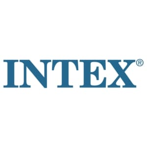

# ioBroker.intex

## Адаптер Intex для ioBroker

Адаптер для Intex Whirlpool с модулем Wi-Fi, совместимый со старым приложением.

## Этот адаптер работает только со старым приложением Intex.

С 2025 года компания Intex предлагает два приложения для загрузки, оба для Apple и Android. Как упоминалось выше, этот адаптер не работает с новыми бассейнами. В руководстве пользователя указано, какое приложение вам нужно. Поэтому рекомендуется прочитать инструкцию.

### Мне придётся плакать, если у меня появится новый бассейн?

Однозначно НЕТ, новые бассейны, похоже, поддерживают Tuya. Забудьте о новом приложении Intex; просто используйте приложение Tuya, Smart Life или другое, которое поддерживает адаптер Tuya. Добавьте бассейн туда. Всё будет работать идеально. Так что получайте удовольствие и поблагодарите Thestef86 за проведенное исследование.

## Стратегия взаимодействия с бассейном и облаком.

### Об облаках

#### Облачный резервный вариант; локальное использование пула, если доступно.

В этом режиме система пытается локально отправить команду управления и команду обновления. Если возникает ошибка в локальной связи, система переключается в облачный режим работы до тех пор, пока адаптер не будет запущен снова.

IP-адрес и порт берутся из облака. Если IP-адрес совпадает, пул необходимо зарегистрировать заново в приложении. Нажмите и удерживайте кнопку «Подключиться» и выполните поиск пула. Обычно удалять его из приложения не требуется.

#### Облачный вторичный; пул только локальный

В этом режиме система отправляет команды управления и обновления локально. При возникновении ошибки в локальной связи система не переключается в облачный режим работы.

Здесь можно установить интервал в 0,5 минуты.

IP-адрес и порт берутся из облака. Если IP-адрес совпадает, пул необходимо зарегистрировать заново в приложении. Нажмите и удерживайте кнопку «Подключиться» и выполните поиск пула. Обычно удалять его из приложения не требуется.

#### Только облачное хранилище

В этом режиме система отправляет через облако только команды управления и обновления.

##### Авторизоваться

Введите адрес электронной почты и пароль приложения Intex.

### Местный

#### Только для местных жителей

В локальном режиме работы в настоящее время также предлагаются функции, которые пул не поддерживает. В поле «Адрес» необходимо указать либо DNS-имя пула на маршрутизаторе, либо IP-адрес пула.

Здесь также можно установить интервал в 0,5 минуты.

IP-адрес пула можно найти с помощью кнопки поиска. Однако это может быть запрещено маршрутизаторами, например, если устройствам WLAN запрещено взаимодействовать друг с другом, или если порты или встроенная функция трансляции заблокированы в локальном брандмауэре компьютера.

## Управление функциями спа-салона

Параметр "intex.0.-id-.control.-command-", установленный в значение true или false, управляет состоянием команды пула.

## Обсуждение и вопросы на немецком языке.

<https://forum.iobroker.net/topic/47932/test-intext-app-v0-0-x>

## Changelog

<!--
  Placeholder for the next version (at the beginning of the line):
  ### **WORK IN PROGRESS**
-->

### 0.1.7 (2024-08-13)

- (PLCHome) Fixed error.

### 0.1.6 (2024-08-13)

- (PLCHome) Configure this adapter to use the release script.
- (PLCHome) New object error, the error is extracted from the temperature if one is pending.

### 0.1.5

- (PLCHome) spelling mistake sanitzer to sanitizer on status control.sanitizer and control.sanitizerTime corrected.

### 0.1.4

- (PLCHome) Changing read-only objects, e.g. temperature, no longer causes a crash.

### 0.1.3

- (PLCHome) The remaining time for the filter is corrected to the disinfection time if it is longer

### 0.1.2

- (PLCHome) Fixed filter remaining time on heating from 1 to -1 for infinity

### 0.1.1

- (PLCHome) Remaining time for filter and sanitizer added under control.
- (PLCHome) Refresh added under Control.
- (PLCHome) Remote deleted because Control can do it better.

### 0.1.0

- (rbartl/PLCHome) Support local IP. Both via cloud and only locally without cloud. Thanks to Austria to Robert Bartl.
- (PLCHome) Confirm directly after switching via Control.

### 0.0.7

- (PLCHome) Switching via remote works again.
- (PLCHome) After switching via Control, the previous traffic status can be transmitted from the cloud. This can lead to a toggling of the status.

### 0.0.6

- (PLCHome) Defined setting of states
- (PLCHome) Change Fahrenheit Celsius
- (PLCHome) "control.temperature", read only, object from 0.0.5 must be deleted once.

### 0.0.5

- (PLCHome) Set temperature added, object must be deleted once.
- (PLCHome) Decoding of status information

### 0.0.1

- (TA2k) initial release

## License

MIT License

Copyright (c) 2021 - 2024 TA2k <tombox2020@gmail.com>

Permission is hereby granted, free of charge, to any person obtaining a copy
of this software and associated documentation files (the "Software"), to deal
in the Software without restriction, including without limitation the rights
to use, copy, modify, merge, publish, distribute, sublicense, and/or sell
copies of the Software, and to permit persons to whom the Software is
furnished to do so, subject to the following conditions:

The above copyright notice and this permission notice shall be included in all
copies or substantial portions of the Software.

THE SOFTWARE IS PROVIDED "AS IS", WITHOUT WARRANTY OF ANY KIND, EXPRESS OR
IMPLIED, INCLUDING BUT NOT LIMITED TO THE WARRANTIES OF MERCHANTABILITY,
FITNESS FOR A PARTICULAR PURPOSE AND NONINFRINGEMENT. IN NO EVENT SHALL THE
AUTHORS OR COPYRIGHT HOLDERS BE LIABLE FOR ANY CLAIM, DAMAGES OR OTHER
LIABILITY, WHETHER IN AN ACTION OF CONTRACT, TORT OR OTHERWISE, ARISING FROM,
OUT OF OR IN CONNECTION WITH THE SOFTWARE OR THE USE OR OTHER DEALINGS IN THE
SOFTWARE.