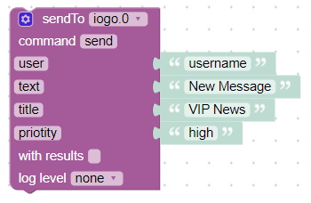

# IoBroker.iogo
Этот адаптер добавляет дополнительные функции в приложение для умного дома ioGo https://play.google.com/store/apps/details?id=de.nisnagel.iogo.
Пожалуйста, посетите www.iogo.app для получения дополнительной информации о том, как начать работу.

## Конфигурация
Для использования этого адаптера необходим действительный лицензионный ключ.
Лицензию можно купить после создания учетной записи на https://www.iogo.app.

Пожалуйста, введите данные своей учетной записи (электронная почта/пароль) в конфигурации инстанса.

## Использование
Вы можете отправить сообщение всем аутентифицированным пользователям через messageBox `sendTo('iogo', 'New message')` или конкретному пользователю `sendTo('iogo', {user: 'Username', text: 'Test message'})`.
Пользователь должен быть создан заранее (пожалуйста, прочтите документацию по приложению для получения дополнительной информации).

Можно указать более одного получателя (просто разделите имена пользователей запятой). Например: Получатель: "Пользователь1,Пользователь4,Пользователь5"

Пример отправки настроенного сообщения уведомления с помощью javascript:

```
sendTo('iogo', {
    user:                   'Username',
    text:                   'New message',
    title:                  'VIP News'
});
```

И один пример с blockly:



Обратные вызовы также поддерживаются:

```
sendTo('iogo', {title: 'News', text: 'New message'}, function (res) {
    console.log('Sent to ' + res + ' users');
});
```

Просто отправьте путь к изображению вместо текста или используйте атрибут URL `sendTo('iogo.0', 'absolute/path/file.png')`

```
sendTo('iogo', {
    user:                   'Username',
    text:                   'New message',
    title:                  'VIP News',
    url:                    'absolute/path/file.png'
});
```

**Возможные варианты**:

- `пользователь`: один пользователь или список пользователей
- `text`: само сообщение
- `title`: заголовок уведомления
- `url`: Абсолютный путь к изображению
- `expiry`: время истечения в секундах

<!-- Заполнитель для следующей версии (в начале строки):

### __РАБОТА ВЫПОЛНЯЕТСЯ__ -->

## Changelog
### 0.7.0 (2021-05-24)
* (bluefox) Added support of Admin5

### 0.6.x
* (nisio) Changes for ioGo app version 2.3.0+ (older versions no longer supported)

### 0.5.x
* (nisio) Changes for ioGo app version 2.1.0+ (older versions no longer supported)
* (nisio) Split main.js into several files

### 0.4.x
* (nisio) Changes for ioGo app version 2.0.0+ (older versions no longer supported)

### 0.3.x
* (nisio) added support of compact mode
* (nisio) added support node 12

### 0.2.x
* (nisio) added pro features

### 0.1.x
* (nisio) initial release

## License
The MIT License (MIT)

Copyright (c) 2018 - 2021 Nis Nagel <info@iogo.app>

Permission is hereby granted, free of charge, to any person obtaining a copy
of this software and associated documentation files (the "Software"), to deal
in the Software without restriction, including without limitation the rights
to use, copy, modify, merge, publish, distribute, sublicense, and/or sell
copies of the Software, and to permit persons to whom the Software is
furnished to do so, subject to the following conditions:

The above copyright notice and this permission notice shall be included in
all copies or substantial portions of the Software.

THE SOFTWARE IS PROVIDED "AS IS", WITHOUT WARRANTY OF ANY KIND, EXPRESS OR
IMPLIED, INCLUDING BUT NOT LIMITED TO THE WARRANTIES OF MERCHANTABILITY,
FITNESS FOR A PARTICULAR PURPOSE AND NONINFRINGEMENT. IN NO EVENT SHALL THE
AUTHORS OR COPYRIGHT HOLDERS BE LIABLE FOR ANY CLAIM, DAMAGES OR OTHER
LIABILITY, WHETHER IN AN ACTION OF CONTRACT, TORT OR OTHERWISE, ARISING FROM,
OUT OF OR IN CONNECTION WITH THE SOFTWARE OR THE USE OR OTHER DEALINGS IN
THE SOFTWARE.