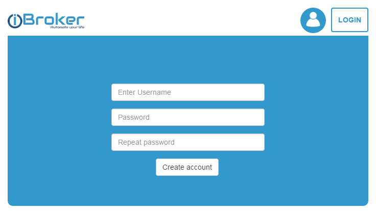
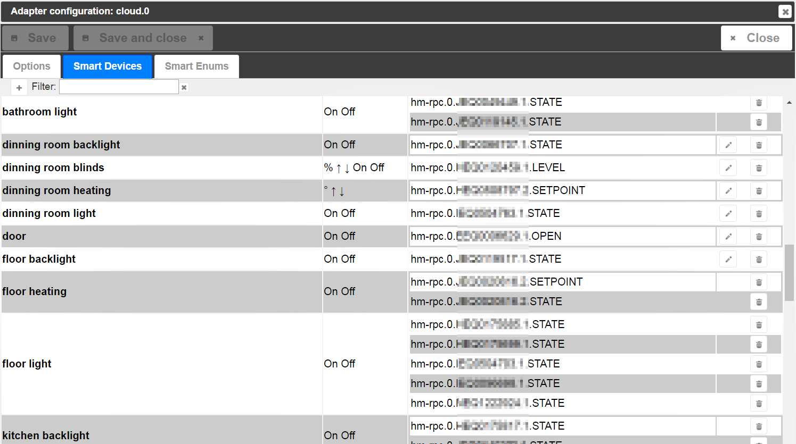
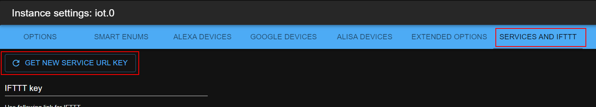

# ioBroker IoT-адаптер

Этот адаптер предназначен ТОЛЬКО для связи с Amazon Alexa, Google Home и Nightscout. Он не предназначен для удаленного доступа к вашему экземпляру ioBroker. Для этого используйте адаптер ioBroker.cloud.

**Этот адаптер использует библиотеки Sentry для автоматического сообщения разработчикам об исключениях и ошибках в коде.** Более подробную информацию, а также инструкции по отключению отправки сообщений об ошибках см. [в документации Sentry-Plugin](https://github.com/ioBroker/plugin-sentry#plugin-sentry) ! Система отчетности Sentry используется начиная с js-controller 3.0.

## Начиная

### Для чего нужен этот адаптер?

Этот адаптер подключает ваши устройства ioBroker к голосовым помощникам, таким как Amazon Alexa и Google Home. Он автоматически создает виртуальные устройства умного дома, которыми можно управлять с помощью голосовых команд.

### Основные понятия

**Перечисления** — это способ организации устройств в ioBroker. Существует два типа:

- **Комнаты** : помещения, такие как «Гостиная», «Спальня», «Кухня».
- **Функции** : Типы устройств, такие как «Освещение», «Отопление», «Жалюзи».

**«Умные имена»** — это имена, которые голосовые помощники (Alexa, Google Home) используют для идентификации ваших устройств. Адаптер автоматически генерирует эти имена, комбинируя информацию о комнате и ее функциях (например, «Свет в гостиной»).

### Как это работает:

1. Вы организуете состояния ioBroker в **комнаты** и **функции,** используя перечисления.
2. Адаптер автоматически распознает устройства и создает для них интеллектуальные имена, например, «Освещение в гостиной» или «Отопление в спальне».
3. Эти виртуальные устройства становятся доступны в Alexa или Google Home.
4. Вы можете управлять ими с помощью голосовых команд, например: «Алекса, включи свет в гостиной».

### Предварительные требования

Для использования IoT-адаптера необходимо сначала зарегистрироваться в облаке ioBroker [по адресу https://iobroker.pro](https://iobroker.pro) .

Примечание: Датчик влажности не может отображаться отдельно от датчика температуры, поскольку Alexa и Google Home не поддерживают такие устройства.

[Ссылка на настройки типов API Google.](https://developers.google.com/actions/smarthome/guides/)



## Настройки

### Язык

Этот параметр определяет язык, используемый для автоматически генерируемых имен устройств.

- **"по умолчанию"** : Интеллектуальные имена будут использовать исходные имена из ваших перечислений ioBroker (комнат и функций) без преобразования.
- **Указание конкретного языка** (например, английский, немецкий): Все известные названия помещений и функций будут переведены на выбранный язык.

**Пример:**

- Если ваше устройство называется "Wohnzimmer" (по-немецки "Гостиная") и вы выберете английский язык, то в Alexa/Google Home оно будет называться "Living Room Light".
- Если вы выберете «по умолчанию», останется «Светлая комната».

Это полезно в демонстрационных целях или когда вам нужно быстро переключаться между языками.

### В названиях функций указывайте их первыми.

Этот параметр изменяет порядок слов в автоматически генерируемых названиях устройств.

По умолчанию адаптер создает имена устройств, объединяя **имя комнаты** и **имя функции** .

- **Если флажок не установлен (по умолчанию)** : Комната имеет приоритет → «Диммер для гостиной»
- **Если отмечено** : функция выполняется в первую очередь → "Регулировка яркости в гостиной"

**Зачем это менять?** Некоторым людям кажется более естественным сказать «Алекса, включи диммер в гостиной» вместо «Алекса, включи диммер в гостиной». Выберите то, что звучит лучше на вашем языке.

### Соедините слова с

Этот параметр добавляет связующее слово между названиями помещений и функций в автоматически генерируемых именах устройств.

**Пример:**

- **Без** этой настройки: «Регулировка яркости в гостиной» или «Регулировка яркости в гостиной»
- **Соединяющим** словом "in": "Dimmer in Living Room" или "Living Room in Dimmer"

**Важно:** Как правило, использовать эту функцию **не рекомендуется** , поскольку:

- Голосовым помощникам приходится распознавать лишнее слово, что может привести к недоразумениям.
- Более простые названия лучше работают с голосовыми командами.

Оставьте это поле пустым, если у вас нет веской причины добавлять связующие слова.

### Уровень ВЫКЛ для переключателей

Некоторые группы состоят из смешанных устройств: диммеров и выключателей. Допускается управление ими с помощью команд «ВКЛ» и «ВЫКЛ», а также в процентах. Если команда`Set to 30%` и`OFF level is 30%` Таким образом, переключатели будут включены. Команда "Установить на 25%" выключит все переключатели.

Кроме того, если команда "ВЫКЛ", адаптер запомнит текущий уровень диммера, если фактическое значение превышает или равно "30%". Позже, когда поступит новая команда "ВКЛ", адаптер переключит диммер не на 100%, а на уровень, сохраненный в памяти.

Пример:

- Предположим, что _уровень выключения_ составляет 30%.
- Виртуальное устройство "Свет" имеет два физических устройства: _выключатель_ и _диммер_ .
- Команда: "установить яркость света на 40%". Адаптер запомнит это значение для _диммера_ , установит его в режим "диммер" и включит _выключатель_ .
- Команда: "выключить свет". Адаптер установит _диммер_ на 0% и выключит _выключатель_ .
- Команда: "включить свет". _Диммер_ => 40%, _выключатель_ => ВКЛ.
- Команда: "установить яркость света на 20%". _Диммер_ => 20%, _выключатель_ => ВЫКЛ. Значение диммера не будет сохранено, так как оно ниже _уровня ВЫКЛ_ .
- Команда: "включить свет". _Диммер_ => 40%, _выключатель_ => ВКЛ.

### от ON

Вы можете выбрать режим работы команды «ВКЛ», которая будет применяться к числовому состоянию. Можно выбрать конкретное значение или использовать последнее ненулевое значение.

### Напишите ответ на

Для каждой команды будет генерироваться текстовый ответ. Здесь вы можете указать идентификатор объекта, куда должен быть записан этот текст. Например _, sayit.0.tts.text_ .

### Цвета

Для работы канала необходимо 3-5 штатов со следующими ролями:

- `level.color.saturation` - необходимо для обнаружения канала,
- `level.color.hue` ,
- `level.dimmer` ,
- `switch` - необязательный,
- `level.color.temperature` (необязательный)

```
Alexa, set the "device name" to "color"
Alexa, turn the light fuchsia
Alexa, set the bedroom light to red
Alexa, change the kitchen to the color chocolate
```

### Замок

Для того чтобы иметь возможность блокировать замки, государство должно играть определенную роль.`switch.lock` и имеют`native.LOCK_VALUE` для определения состояния блокировки. Если вам требуется отдельное значение для управления блокировкой, вы можете использовать`native.CONTROL VALUE` .

```
Alexa, is "lock name" locked/unlocked
Alexa, lock the "lock name"
```

## Как генерируются имена устройств

Адаптер автоматически создает виртуальные устройства умного дома, объединяя информацию из ваших настроек ioBroker.

### Понимание перечислений

Перечисления — это встроенный в ioBroker способ организации устройств:

- **Перечень помещений** : содержит информацию о местоположении (гостиная, ванная комната, спальня, кухня и т. д.).
- **Перечисление функций** : содержит типы устройств (освещение, жалюзи, отопление и т. д.).

### Требования к автоматическому обнаружению

Для того чтобы состояние (устройство) автоматически включалось в систему управления умным домом, оно должно соответствовать следующим условиям:

1. **Должно быть в перечислении функций** (например, "Light", "Heating", "Blinds")
2. **Необходимо иметь соответствующую должность** :`state` ,`switch` , или`level.*` (нравиться`level.dimmer` )
   - Если весь канал включен в перечисление функций, то отдельным состояниям не требуются определенные роли.
3. **Должен быть доступен для записи** :`common.write` должно быть`true`
4. **Особые требования:**
   - Диммеры должны иметь`common.type` как`number`
   - Отопление должно быть`common.unit` как`°C` ,`°F` , или`°K` и`common.type` как`number`

### Как создаются имена

Адаптер объединяет информацию о помещении и его функциях для создания осмысленных названий:

**Пример:**

- В гостиной есть выключатель света.
- В перечислении указаны «Свет» (функция) и «Гостиная» (комната).
- Сгенерированное имя будет: **"Светильник в гостиной"**

**Несколько устройств одного типа:** Все светильники в гостиной объединены в одно виртуальное устройство «Свет в гостиной». Когда вы говорите «Алекса, включи свет в гостиной», все светильники в этой комнате включаются.

**Устройство без указания комнаты:** если состояние присутствует только в перечислении функций (например, "Свет"), но не в какой-либо комнате, будет использоваться исходное имя состояния.

### Пользовательские имена с помощью smartName

Вы можете отключить автоматическое присвоение имен:

- Набор`common.smartName` на ваше предпочтительное имя → Устройство будет использовать именно это имя
- Набор`common.smartName` к`false` → Устройство будет исключено из системы управления умным домом.

### Ручная настройка

Диалоговое окно настроек позволяет вручную указать, какие штаты будут включены и как они будут сгруппированы:

**Переименование:**

- **Группы, состоящие из одного штата** : могут быть переименованы (использует smartName штата).
- **Многосостоятельные группы** : необходимо переименовать, изменив имена перечислений.

### Создание пользовательских групп

Чтобы создать собственные группы устройств:

- Используйте адаптер "сцены".
- Создайте "скрипт" в адаптере JavaScript.

### Заменяет

Вы можете указать строки, которые будут автоматически заменяться в именах устройств. Например, если вы установите параметр замены следующим образом:`.STATE,.LEVEL` , так что все`.STATE` и`.LEVEL` будет удалено из имен. Будьте внимательны к пробелам. Если вы установите`.STATE, .LEVEL` , так`.STATE` и`.LEVEL` будет заменено, а не`.LEVEL` .

## Вспомогательные государства

- `smart.lastObjectID` Это состояние будет установлено, если с помощью навыка Home (Alexa, Google Home) управлялось только одно устройство.
- `smart.lastFunction` : Название функции (если существует), для которой была выполнена последняя команда.
- `smart.lastRoom` Название комнаты (если существует), для которой была выполнена последняя команда.
- `smart.lastCommand` Последняя выполненная команда. Команда может быть:`true(ON)` ,`false(OFF)` ,`number(%)` ,`-X(decrease at x)` ,`+X(increase at X)`
- `smart.lastResponse` Текстовый ответ на команду. Его можно отправить кому-либо.`text2speech` (`sayit` ) двигатель.

## Переключить режим

Alexa v3 поддерживает режим переключения. Это значит, что если вы скажете «Alexa, включи свет», а свет уже горит, он будет выключен.

## IFTTT

[инструкции](/#/docs/adapterref/iobroker.iot/doc/ifttt.md)

## Google Домой

Если в журнале вы видите следующее сообщение об ошибке:`[GHOME] Invalid URL Pro key. Status auto-update is disabled you can set states but receive states only manually` Поэтому вам необходимо заново сгенерировать URL-ключ:



## Услуги

Есть возможность отправлять сообщения в облачный адаптер. Если вы позвоните...`[POST]https://service.iobroker.in/v1/iotService?service=custom_<NAME>&key=<XXX>&user=<USER_EMAIL>` и ценность в качестве полезной нагрузки.

`curl --data "myString" https://service.iobroker.in/v1/iotService?service=custom_<NAME>&key=<XXX>&user=<USER_EMAIL>`

или

`[GET]https://service.iobroker.in/v1/iotService?service=custom_<NAME>&key=<XXX>&user=<USER_EMAIL>&data=myString`

Если в настройках вы зададите поле «Белый список для служб» название`custom_test` При вызове сервиса с именем "custom\_test" состояние **cloud.0.services.custom\_test** будет установлено в _значение myString_ .

Вы можете добавить символ "\*" в белый список, и все сервисы будут доступны.

Здесь вы найдете инструкции по использованию [Tasker](https://github.com/ioBroker/ioBroker.iot/blob/master/doc/tasker.md) .

Использование сервиса IFTTT разрешено только при наличии установленного ключа IFTTT.

Зарезервированные имена`ifttt` ,`text2command` ,`simpleApi` ,`swagger` Их необходимо использовать без`custom_` префикс.

Вы также можете запросить действительный URL-адрес сервиса с помощью сообщения:

```js
sendTo('iot.0', 'getServiceEndpoint', { serviceName: 'custom_myService' }, result =>
    console.log(JSON.stringify(result)),
);
// Output: {"result":
//  {"url": "https://service.iobroker.in/v1/iotService?key=xxx&user=uuu&service=custom_myService",
//   "stateID":"iot.0.services.myService",
//   "warning":"Service name is not in white list"
//  }}
```

### `text2command`

Вы можете написать`text2command` В белом списке можно отправлять POST-запросы.`https://service.iobroker.in/v1/iotService?service=text2command&key=<user-app-key>&user=<USER_EMAIL>` записывать данные в`text2command.X.text` переменная.

Вы также можете использовать метод GET.`https://service.iobroker.in/v1/iotService?service=text2command&key=<user-app-key>&user=<USER_EMAIL>&data=<MY COMMAND>`

`X` Это можно определить в настройках с помощью параметра "Использовать экземпляр text2command".

## Пользовательский навык

Ответы на запросы, требующие использования пользовательского навыка, могут обрабатываться двумя способами:

- `text2command`
- `javascript`

### `text2command`

если`text2command` Экземпляр определяется в диалоговом окне конфигурации, поэтому вопрос будет отправлен именно в этот экземпляр.

`text2command` Необходимо настроить систему таким образом, чтобы ожидаемая фраза была проанализирована, и был выдан ответ.

### `Javascript`

Существует возможность обработать вопрос непосредственно с помощью скрипта. Она активирована по умолчанию, если нет других вариантов.`text2command` Выбран экземпляр.

Если`text2command` Экземпляр определен, поэтому этот экземпляр должен предоставить ответ, а ответ от _скрипта_ будет проигнорирован.

Адаптер предоставит подробную информацию в двух состояниях с разным уровнем детализации.

- `smart.lastCommand` Содержит полученный текст, включая информацию о типе запроса (намерении). Пример:`askDevice Status Rasenmäher`
- `smart.lastCommandObj` содержит строку JSON, которую можно преобразовать в объект, содержащий следующую информацию.
  - `words` содержать полученные слова в массиве
  - `intent` Содержит тип запроса. В настоящее время возможны следующие значения:
    - v1 Навык:`askDevice` ,`controlDevice` ,`actionStart` ,`actionEnd` ,`askWhen` ,`askWhere` ,`askWho`
    - Навык v2:`queryIntent` когда был получен полный текст,`controlDevice` для резервного варианта с неполным текстом
  - `deviceId` Содержит идентификатор устройства, на которое был отправлен запрос, доставленный Amazon; если идентификатор не указан, будет пустой строкой.
  - `deviceRoom` Содержит сопоставленный идентификатор помещения, который можно настроить в административном интерфейсе IoT для собираемых идентификаторов устройств.
  - `sessionId` Содержит идентификатор сессии навыка (sessionId), который должен совпадать, если было произнесено несколько команд; предоставляется Amazon; если не указан, будет пустой строкой.
  - `userId` Содержит идентификатор пользователя (userId) от владельца устройства (или, возможно, позже, от пользователя, взаимодействовавшего с навыком), предоставленный Amazon; если он не указан, будет пустой строкой.
  - `userName` Содержит сопоставленное имя пользователя, которое можно настроить в административном интерфейсе IoT для собранных идентификаторов пользователей.

Более подробную информацию о том, как распознаются слова и какие типы запросов различает пользовательский навык Alexa, можно найти по ссылке [: https://forum.iobroker.net/viewtopic.php?f=37\&t=17452](https://forum.iobroker.net/viewtopic.php?f=37\&t=17452) .

**Результат возвращается через состояние smart.lastResponse**

Ответ необходимо отправить в течение 200 мс в текущем состоянии.`smart.lastResponse` Это может быть простая текстовая строка или объект JSON. Если это текстовая строка, то этот текст будет отправлен в ответ на действие навыка. Если текст представляет собой объект JSON, то можно использовать следующие ключи:

- `responseText` необходимо включить текст для возврата в Amazon
- `shouldEndSession` Это логическое значение, определяющее, будет ли сессия закрыта после произнесения ответа или останется открытой для приема следующего голосового ввода.
- `sessionId` Необходимо указать идентификатор сессии (sessionId), для которой предназначен ответ. В идеале, его следует указывать, чтобы разрешить одновременные сессии. Если он не указан, предполагается первая сессия, ожидающая ответа.

**Результат возвращается через сообщение экземпляру IoT.**

Экземпляр IoT также принимает сообщение с именем "alexaCustomResponse", содержащее ключ "response", с объектом, который может содержать эти ключи.`responseText` и`shouldEndSession` и`sessionId` Как описано выше. От экземпляра IoT на сообщение ответа не будет!

**Пример сценария, использующего текст.**

```js
// important, that ack=true
on({ id: 'iot.0.smart.lastCommand', ack: true, change: 'any' }, obj => {
    // you have 200ms to prepare the answer and to write it into iot.X.smart.lastResponse
    setState('iot.0.smart.lastResponse', 'Received phrase is: ' + obj.state.val); // important, that ack=false (default)
});
```

**Пример скрипта, использующего объекты JSON.**

```js
// important, that ack=true
on({ id: 'iot.0.smart.lastCommandObj', ack: true, change: 'any' }, obj => {
    // you have 200ms to prepare the answer and to write it into iot.X.smart.lastResponse
    const request = JSON.parse(obj.state.val);
    const response = {
        responseText: 'Received phrase is: ' + request.words.join(' ') + '. Bye',
        shouldEndSession: true,
        sessionId: request.sessionId,
    };

    // Return response via state
    setState('iot.0.smart.lastResponse', JSON.stringify(response)); // important, that ack=false (default)

    // or alternatively return as message
    sendTo('iot.0', 'alexaCustomResponse', response);
});
```

### Частное облако

Если вы используете приватный навык/действие/навык для общения с`Alexa/Google Home/Алиса` Таким образом, у вас есть возможность использовать экземпляр IoT для обработки запросов от него.

Например, для`yandex alice` :

```js
const OBJECT_FROM_ALISA_SERVICE = {}; // object from alisa service or empty object
OBJECT_FROM_ALISA_SERVICE.alisa = '/path/v1.0/user/devices'; // called URL, 'path' could be any text, but it must be there
sendTo('iot.0', 'private', { type: 'alisa', request: OBJECT_FROM_ALISA_SERVICE }, response => {
    // Send this response back to alisa service
    console.log(JSON.stringify(response));
});
```

Поддерживаются следующие типы:

- `alexa` - взаимодействие с Amazon Alexa или пользовательским навыком Amazon.
- `ghome` - взаимодействие с Google Actions через Google Home
- `alisa` - работа с Яндексом Алиса
- `ifttt` - работает как IFTTT (на самом деле не обязательно, но для целей тестирования)

## Яндекс Алиса

[инструкции](https://github.com/ioBroker/ioBroker.iot/blob/master/doc/alisa.md)

## Отправляйте сообщения в приложение

Начиная с версии 1.15.x, вы можете отправлять сообщения на`ioBroker Visu` Приложение ( [Android](https://play.google.com/store/apps/details?id=com.iobroker.visu) и [iOS](https://apps.apple.com/de/app/iobroker-visu/id1673095774) ). Для этого необходимо написать следующие состояния:

```js
setState('iot.0.app.expire', 60); // optional. Time in seconds
setState('iot.0.app.priority', 'normal'); // optional. Priority: 'high' or 'normal'
setState('iot.0.app.title', 'ioBroker'); // optional. Default "ioBroker"
setState('iot.0.app.message', 'Message text'); // important, that ack=false (default)

// or just one state (this also allows to use payload -> `actions`, `devices` and `openUrl` property)
// only message is mandatory. All other are optional
// Note that, if you are using `actions`or `devices`, the app needs to handle the notification in the background before showing it
// in some scenarios, e.g. low power or spamming to many notifications the OS may decide to not show the notification at all
setState('iot.0.app.message', JSON.stringify({
  message: 'Message text',
  title: 'ioBroker',
  expire: 60,
  priority: 'normal', 
  payload: {
      devices: JSON.stringify(['iPhone von Maelle', 'iPhone von Max']), // devices to send the message to, if not given send to all - requires Visu App 1.4.0
      openUrl: 'https://www.iobroker.net', // opens a link when clicking on the notification
      actions: JSON.stringify([ // actions to respond to the notification - requires Visu App 1.4.0
          { buttonTitle: 'Yes', identifier: 'home:yes' }, // The app will display the button title and on clicking the identifier will be set to the state `iot.0.app.devices.<deviceName>.actionResponse`
          { buttonTitle: 'No', identifier: 'home:no' }
      ])
  }
})); // important, that ack=false (default)
```

## Все

- Умные названия должны иметь более высокий приоритет в группах.

<!--
	Placeholder for the next version (at the beginning of the line):
	### **WORK IN PROGRESS**
-->

## Changelog
### **WORK IN PROGRESS**
- (@GermanBluefox) Migrated blockly to TypeScript

### 7.0.1 (2026-08-06)
- (@GermanBluefox) Migrated to TypeScript 6 and react 19

### 6.1.3 (2026-06-12)
- (@GermanBluefox) Added support of credentials manager

### 6.1.0 (2026-06-02)
- (@GermanBluefox) Implemented new feature to select devices from the list and not by enumeration
- (@GermanBluefox) Possibility to send messages to the app directly from the state
- (@GermanBluefox) Migrated google and alisa to TypeScript

### 6.0.3 (2026-04-23)
- (@GermanBluefox) Allowed to read temperature information via Alexa

### 6.0.1 (2026-04-07)
- (iobroker-bot) Adapter requires node.js >= 20 now.
- (@GermanBluefox) Removed support for Alexa 2
- (@GermanBluefox) Fixed bug in Alisa with color and motion sensor
- (@GermanBluefox) Validate Discovery response before sending it back

## License

The MIT License (MIT)

Copyright (c) 2018-2026 bluefox <dogafox@gmail.com>

Permission is hereby granted, free of charge, to any person obtaining a copy
of this software and associated documentation files (the "Software"), to deal
in the Software without restriction, including without limitation the rights
to use, copy, modify, merge, publish, distribute, sublicense, and/or sell
copies of the Software, and to permit persons to whom the Software is
furnished to do so, subject to the following conditions:

The above copyright notice and this permission notice shall be included in all
copies or substantial portions of the Software.

THE SOFTWARE IS PROVIDED "AS IS", WITHOUT WARRANTY OF ANY KIND, EXPRESS OR
IMPLIED, INCLUDING BUT NOT LIMITED TO THE WARRANTIES OF MERCHANTABILITY,
FITNESS FOR A PARTICULAR PURPOSE AND NONINFRINGEMENT. IN NO EVENT SHALL THE
AUTHORS OR COPYRIGHT HOLDERS BE LIABLE FOR ANY CLAIM, DAMAGES OR OTHER
LIABILITY, WHETHER IN AN ACTION OF CONTRACT, TORT OR OTHERWISE, ARISING FROM,
OUT OF OR IN CONNECTION WITH THE SOFTWARE OR THE USE OR OTHER DEALINGS IN THE
SOFTWARE.