# IoBroker.iqontrol
**Тесты:**

| Linux/Mac/Windows: | Проверка совместимости с различными браузерами: |
|---------------------------------------------------------------------------------------------------------------------------------------| --- |

****

## Адаптер iQontrol для ioBroker
Быстрое веб-приложение для визуализации.

    

&copy; by dslraser:


&cop; by muuulle:


&copy; by peks-64:


Работает в любом браузере.
Простая настройка, при этом полностью настраиваемый и адаптивный дизайн.

> **Этот адаптер использует библиотеки Sentry для автоматического сообщения разработчикам об исключениях и ошибках в коде.** Для получения более подробной информации и сведений о том, как отключить отправку сообщений об ошибках, см. [Документация по плагину Sentry](https://github.com/ioBroker/plugin-sentry#plugin-sentry)! Отправка сообщений Sentry используется начиная с js-controller 3.0.

## Благодарности
Создание этого адаптера было бы невозможно без замечательной работы @o0Shojo0o (https://github.com/o0Shojo0o), который разрабатывал предыдущие версии этого адаптера.

## Как сообщать о проблемах и отправлять запросы на добавление новых функций
В идеале, пожалуйста, используйте для этого раздел "Проблемы" на GitHub, а наилучший способ - установить для адаптера режим отладочного логирования (Экземпляры -> Экспертный режим -> Уровень логирования столбцов). Затем получите файл лога с диска через подкаталог ioBroker 'log', **а не** через административную панель, что позволит сократить строки.

## Видеоурок (на немецком языке):
[](https://youtube.com/playlist?list=PL8epyNz8pGEv6-R8dnfXm-m5aBlZFKOBG)

## Добавить на главный экран
Вы можете сохранить его как веб-приложение на главном экране, и оно будет выглядеть и ощущаться как нативное приложение: 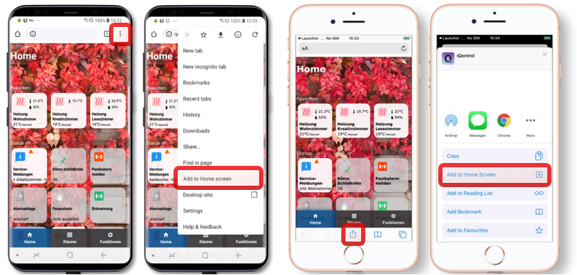

Это также работает на вашем ПК с браузером Chrome:

* Откройте iQontrol в Chrome
* Нажмите на меню с тремя точками - Дополнительные инструменты - Создать ярлык
* После этого вы найдете iQontrol в меню «Пуск» в разделе приложений Chrome и даже сможете добавить его на панель задач.

Вам необходимо...
* Nodejs 10 или выше
* Веб-адаптер с одним экземпляром, работающим по тому же протоколу (http или https), что и административный адаптер, socket.IO установлен в значение 'integrated', а 'Force Web-Sockets' отключен.
* Если это противоречит работе других адаптеров, просто добавьте еще один экземпляр с указанными выше настройками - iQontrol найдет наиболее подходящий экземпляр веб-адаптера и будет использовать его для связи.
* Для подключения через *iobroker.pro-Cloud* как административный, так и веб-адаптер должны быть настроены на HTTP (а не HTTPS).

* Если у вас возникнут какие-либо проблемы, пожалуйста, ознакомьтесь с разделом [устранение неполадок](#устранение неполадок) в конце этого файла readme.

## Форум
Перейдите в ветку поддержки [форум iobroker](https://forum.iobroker.net/topic/52077).

Перейдите в ветку разработчиков [форум iobroker](https://forum.iobroker.net/topic/22039).

## Вики
Посмотрите вики [вики](https://github.com/sbormann/ioBroker.iqontrol/wiki).

## Как использовать
**Не пугайтесь множества доступных опций.** Большинство функций работают сразу после установки. Вы *можете*, но вам не обязательно использовать все возможности настройки, которые предлагает iQontrol! Просто начните так:

* Начните создавать представления.

Представления можно рассматривать как нечто вроде страницы.

* Затем создайте устройства на основе этих представлений.

Устройства имеют роль, которая определяет их функциональность, используемые значки и так далее.
В зависимости от этой роли вы можете связать с устройством несколько состояний. Это обеспечит устройству его функциональность.
Если вы выберете роль «Ссылка на другое представление», вы сможете создавать ссылки на другие представления. Я рекомендую оформить ссылки на другие представления тем же фоном, что и связанное представление.
Вы также можете попробовать использовать функцию автосоздания, чтобы выбрать существующее устройство из дерева объектов iobroker. Автосоздание пытается определить роль и сопоставить как можно больше состояний.

* После этого вы можете создать панель инструментов, которая отображается в нижнем колонтитуле.

Элементы панели инструментов - это ссылки на представления.
Первый элемент панели инструментов будет вашим «Главным представлением», которое будет загружаться при запуске.

* Чтобы придать всему изысканный стиль, вы можете загрузить свои собственные изображения.

Вы можете использовать свои изображения в качестве фоновых изображений для элементов интерфейса или для устройств.
Изображения из папки `/usericons` можно использовать в качестве значков для устройств.
Бесплатные встроенные демонстрационные обои взяты с сайта www.pexels.com.

### Использовать автосоздание
* Кнопка «Автоматическое создание представлений» находится на вкладке «Представления».
* Если у вас есть хорошо поддерживаемые перечисления ioBroker, такие как «Комнаты» или «Функции», вы можете использовать эту функцию для автоматического создания представлений с устройствами, перечисленными в этих перечислениях.
* Имейте в виду, что из-за большого количества различных адаптеров и устройств во вселенной ioBroker функция автоматического создания не может корректно обрабатывать все устройства. Возможно, вам потребуется вручную перенастроить некоторые параметры для достижения наилучших результатов. Но автоматическое создание предоставляет хорошую отправную точку для создания собственной визуализации за считанные секунды.

## Параметры URL
* Фронтенд вызывается через `http[s]://<url или ip iobroker>:<port of web adapter>/iqontrol/index.html`
* `<порт веб-адаптера>` обычно равен 8082
* Чтобы открыть указанный экземпляр, можно добавить `namespace=iqontrol.<номер-экземпляра>` в качестве параметра URL.
* Чтобы открыть указанное представление, можно добавить `renderView=<viewID>` в качестве параметра URL.
* `<viewID>` необходимо отформатировать следующим образом: `iqontrol.<instance-number>.Views.<view-name>`
* Примечание: регистр имеет значение!
* Чтобы открыть указанное представление в качестве домашней страницы, добавьте `home=<viewID>` в качестве параметра URL. Это также изменит связанное представление первой записи на панели инструментов!
* `<viewID>` необходимо отформатировать следующим образом: `iqontrol.<instance-number>.Views.<view-name>`
* Примечание: регистр имеет значение!
* Чтобы открыть указанное диалоговое окно во время загрузки страницы, можно добавить `openDialog=<deviceID>` в качестве параметра URL.
* `<deviceID>` необходимо отформатировать следующим образом: `iqontrol.<instance-number>.Views.<view-name>.devices.<device-number>`, где `<device-number>` начинается с 0 (следовательно, первое устройство в представлении будет иметь номер 0).
* Примечание: регистр имеет значение!
* Для установки или изменения параметров возврата по истечении определенного времени используйте следующие параметры:
* `returnAfterTimeTreshold=<время в секундах>` устанавливает время, по истечении которого вызывается целевое представление. Используйте `0`, чтобы отключить функцию возврата по истечении времени.
* `returnAfterTimeDestiationView=<viewID>` - параметр `view`, который задаёт представление, вызываемое после достижения порогового значения. Если параметр не указан, будет использоваться основное представление.
* Эти опции полезны, если вы вызываете iQontrol с настенного планшета, который должен автоматически возвращаться на главный экран после использования.
* Чтобы загрузить страницу без панели инструментов, можно добавить `noToolbar=true`.
* Чтобы загрузить страницу без панели, можно добавить `noPanel=true`.
* Чтобы загрузить страницу без панели инструментов и панели, с отключенной функцией прокрутки, без индикатора загрузки и с прозрачным экраном загрузки, можно добавить `isBackgroundView=true`.
* Обычно iQontrol использует язык, заданный в ioBroker. Вы можете изменить его, добавив `language=<xx>`.
* `<xx>` может быть `de`, `en`, `es`, `fr`, `it`, `nl`, `pl`, `pt`, `ru` или `zh-cn`
* Если ваш экземпляр iQontrol защищен паролем (см. Параметры - Защита паролем), вы можете ввести пароль, добавив `passphrase=<MyPassphrase>`.

**Пример:**

* `https://192.168.1.1:8082/iqontrol/index.html?namespace=iqontrol.1&home=iqontrol.1.Views.Living-Room`
* Обратите внимание на регистр букв

## Шрифты
* Вы можете загрузить собственные файлы шрифтов во вкладке «Изображения/Виджеты» в папку `/userfonts`.
* На вкладке «Параметры» вы можете выбрать эти шрифты в нескольких местах.
* Это зависит от настроек MIME вашего сервера, от того, корректно ли шрифт отображается в браузере - у меня лучше всего работали файлы .ttf и .woff (протестировано на Raspberry Pi 4b).
* Эти настройки MIME должны работать:
* .otf: `application/x-font-opentype`
* .ttf: `application/x-font-ttf` или `application/x-font-truetype`
* .woff: `application/font-woff`
* .woff2: `application/font-woff2`
* .eot: `application/vnd.ms-fontobject`
* Вы можете конвертировать шрифты в другие форматы на сайте `fontsquirrel.com` в разделе генератора.
* Имейте в виду, что веб-шрифты всегда немного сложны в настройке, и не каждый шрифт будет работать на каждом сервере и в каждом браузере.

## Иконки и фоновые изображения
* Вы можете использовать встроенные изображения, изображения, загруженные на вкладке «Изображения», или любой бесплатный URL-адрес по вашему выбору.
* Вы также можете использовать переменную внутри URL-адреса изображения. Это может быть полезно, например, для прогнозов погоды. Используйте следующий шаблон:
* `path/to/firstloaded.png|anotherpath/to/{iobrokerstate|fallback}.png`
* Пример: `./../iqontrol.meta/userimages/demo/bottle.jpg|./../iqontrol.meta/userimages/demo/{javascript.0.myimage|whitestone}.jpg`
* При открытии окна загружается файл `./../iqontrol.meta/userimages/demo/bottle.jpg`
* Как только состояние `javascript.0.myimage` будет получено с сервера, изображение будет заменено на `./../iqontrol.meta/userimages/demo/XXX.jpg`, где `XXX` - значение `javascript.0.myimage`.
* Если `javascript.0.myimage` не имеет значения, будет использован резервный вариант `whitestone` (использование резервного варианта необязательно).

### Индикаторы выполнения
* Возможно использовать определения SVG в сочетании с переменными вместо файлов изображений для отображения индикаторов выполнения.
* Доступно несколько встроенных шаблонов на выбор, но вы также можете создавать собственные SVG-файлы.

 

* Дополнительную информацию см. в [Вики](https://github.com/sbormann/ioBroker.iqontrol/wiki/Progress-Bars)

### Диаграммы
* Вы можете добавить виджет «FLOT Chart-Widget» в качестве BACKGROUND_URL любого устройства, и он автоматически отобразит основное состояние в виде графика на фоне плитки устройства.
* Необходимо убедиться, что состояние регистрируется и записывается одним из адаптеров истории ioBroker.


## Названия устройств
* Подобно переменным в URL-адресах изображений, вы можете использовать переменные в именах устройств. Синтаксис практически тот же:
* `Текст во время загрузки|Текст после загрузки {iobrokerstate|fallback}`
* Кроме того, можно заключить состояние iobroker в квадратные скобки, тогда будет использоваться простое значение без единицы измерения: `Текст во время загрузки|Текст после загрузки {[состояние iobroker]|резервный вариант}`
* Пример: `Погода загружается|Погода: {javascript.0.weather|Данные о погоде не найдены}`
* При открытии окна отображается сообщение «Погода загружается».
* Как только состояние `javascript.0.weather` будет получено с сервера, текст будет заменен на `Weather: XXX`, где `XXX` - значение `javascript.0.weather`.
* Если `javascript.0.weather` не имеет значения, будет использовано резервное значение `Данные о погоде не найдены` (использование резервного значения необязательно).

## Всплывающие сообщения
* Каждый экземпляр создает состояние `iqontrol.x.Popup.Message`
* При передаче значений в это состояние на всех **текущих** открытых интерфейсах iQontrol будет отображаться всплывающее сообщение (или уведомление).
* Кроме того, каждый экземпляр создает состояние `iqontrol.x.Popup.PersistentMessage`.
* При передаче значений в этом состоянии всплывающее сообщение будет сохранено в массиве PERSISTENT_MESSAGES_PENDING.
* Постоянные сообщения будут отображаться не только на всех открытых в данный момент интерфейсах iQontrol, но и на всех **будущих** открытых экземплярах до тех пор, пока они не будут подтверждены (кликом или по истечении срока действия) или пока не истечет их срок действия.
* Параметр `PersistentExpires` определяет, когда истекает срок действия постоянного сообщения, в виде метки времени UNIX (в секундах с 1970-01-01 00:00:00). Значения меньше 31536000 интерпретируются как продолжительность в секундах с текущего момента (31536000 секунд = 1 год).
* `PersistentUndismissible` *логическое значение* - Если установлено значение true, постоянное сообщение будет сохраняться даже после закрытия окна. При открытии нового экземпляра iQontrol оно будет отображаться снова. В противном случае постоянные сообщения удаляются после закрытия всплывающего окна (даже по клику или по истечении заданного времени).
* `PersistentId` - это необязательное произвольное выражение, которое можно использовать для идентификации сообщения.
* Идентификатор можно использовать для удаления соответствующих всплывающих сообщений, отправив его в `PERSISTENT_MESSAGES_DELETE_ID`. Отправка `null` в этот параметр удалит все ожидающие сообщения.
* Этот идентификатор также можно использовать для повторного отображения соответствующих всплывающих сообщений на всех открытых в данный момент экземплярах iQontrol, отправив его в функцию `PERSISTENT_MESSAGES_SHOW_ID`. Отправка значения `null` в эту точку данных отобразит все ожидающие сообщения.
* **Примечание**: Вы можете отправить сообщение только в одну из двух точек данных: «Message» или «PersistentMessage», но не в обе.
* Для форматирования текста сообщения можно использовать HTML-теги.
* Существуют дополнительные состояния для дальнейшей настройки отображаемого всплывающего окна (их необходимо установить до установки точки данных сообщения):
* `Duration`: Это время в миллисекундах, в течение которого отображается сообщение; если установлено значение 0, сообщение необходимо подтвердить.
* `ClickedValue` и `ClickedDestinationState`: Если пользователь щелкает по всплывающему окну, значение из `ClickedValue` будет отправлено в `iqontrol.x.Popup.POPUP_CLICKED` и, если указано, дополнительно к точке данных в `ClickedDestinationState`.
* Если значение не указано, будет использоваться `true`.
* `ClickKeepsOpen` *логическое значение* - если true, всплывающее окно можно закрыть только нажатием на кнопку; нажатие на само всплывающее окно не закроет его. Поэтому убедитесь, что вы добавили кнопки в сообщение всплывающего окна, как описано ниже.
* `ButtonNames`: Здесь вы можете указать список кнопок, разделенных запятыми, которые будут отображаться внизу всплывающего окна (например, "OK,Abort")
* `ButtonValues` и `ButtonDestinationStates`: это списки значений, разделенных запятыми, которые будут отправлены в `iqontrol.x.Popup.BUTTON_CLICKED` и, если указано, в дополнение к точке данных в `ButtonDestinationStates`, если пользователь нажмет соответствующую кнопку.
* Вместо точки данных вы можете использовать команды `COMMAND:renderView` и `COMMAND:openDialog` в качестве ButtonDestinationState для отображения представления или открытия диалогового окна.
* Значение кнопки (ButtonValue) задает представление или диалог и должно иметь формат `iqontrol.<instance-number>.Views.<view-name>` или `iqontrol.<instance-number>.Views.<view-name>.devices.<device-number>`, где `<device-number>` начинается с 0 (следовательно, первое устройство в представлении - это устройство с номером 0).
* Если вы используете только одно значение (вместо списка, разделенного запятыми), это значение будет использоваться для всех кнопок.
* Если оставить поле `ButtonValues` пустым, будет использоваться имя кнопки.
* Если вы используете только одно состояние назначения (вместо списка, разделенного запятыми), это состояние будет использоваться для всех кнопок.
* `ButtonCloses`: Это список логических значений (`true`/`false`), разделенных запятыми, которые указывают, следует ли закрывать всплывающее окно при нажатии соответствующей кнопки.
* `ButtonClears`: Это список логических значений (`true`/`false`), разделенных запятыми, которые указывают, следует ли очищать настройки всплывающего окна (= устанавливать все состояния всплывающего окна в пустое состояние) при нажатии соответствующей кнопки.
* В качестве альтернативы вы можете задать эти значения с помощью команды sendTo, используя параметры `PopupMessage`, `PopupDuration`, `PopupClickedValue` и так далее.
* Пример: `sendTo("iqontrol", "send", {PopupMessage: 'Это мое сообщение', PopupDuration: 2500, PopupClickedValue: 'messageConfirmed'});`
* Вы также можете использовать Blockly для отправки сообщений в iQontrol.

 

## Виджеты
* Каждый фрагмент кода имеет поля BACKGROUND_URL и BACKGROUND_HTML.
* Здесь вы можете указать ссылку (через BACKGROUND_URL) на веб-сайт или разместить прямой HTML-код (через BACKGROUND_HTML), который будет отображаться в качестве фона плитки.
* Это дает вам возможность размещать (интерактивный) контент внутри плитки (например, часы, диаграммы FLOT, таблицы, прогнозы погоды и так далее).
* По умолчанию события мыши будут направляться на это содержимое (поэтому вы больше не сможете щелкнуть по самой плитке), но вы можете отключить это с помощью параметра "Направлять события мыши на плитку, а не на содержимое BACKGROUND_VIEW/URL/HTML".
* iQontrol предлагает роль устройства «Виджет», которая имеет ряд предопределенных параметров, используемых в основном при отображении веб-сайта в виде виджета. Однако вы можете добиться того же результата с любой другой ролью, соответствующим образом изменив параметры устройства.


<подробности> <краткое описание>Разработка виджетов (только для экспертов): (<ins>нажмите, чтобы открыть</ins>)</краткое описание>

### JQuery
* Технически содержимое BACKGROUND_VIEW/URL/HTML размещается внутри HTML-элемента, называемого iframe, который представляет собой веб-сайт внутри веб-сайта.
* Для использования jQuery вы можете перенести его из iQontrol в iFrame с помощью следующего кода:

``window.$=window.jQuery=parent.jQuery.extend(function(s){return parent.jQuery(s,document)},parent.jQuery);``

* Пример:

	```html
	<!doctype html>
	<html>
	<head>
		<meta http-equiv="Content-Type" content="text/html; charset=UTF-8"/>
		<meta name="widget-description" content="This is a demo widget-preset. It has no useful funcion. (C) by Sebastian Bormann"/>
		<meta name="widget-options" content="{'noZoomOnHover': 'true', 'hideDeviceName': 'true', 'sizeInactive': 'xwideIfInactive highIfInactive', 'iconNoPointerEventsInactive': 'true', 'hideDeviceNameIfInactive': 'true', 'hideStateIfInactive': 'true', 'sizeActive': 'fullWidthIfActive fullHeightIfActive', 'bigIconActive': 'true', 'iconNoPointerEventsActive': 'true', 'hideDeviceNameIfActive': 'true', 'hideStateIfActive': 'true', 'sizeEnlarged': 'fullWidthIfEnlarged fullHeightIfEnlarged', 'bigIconEnlarged': 'true', 'iconNoPointerEventsEnlarged': 'false', 'noOverlayEnlarged': 'true', 'hideDeviceNameIfEnlarged': 'true', 'hideStateIfEnlarged': 'true', 'popupAllowPostMessage': 'true', 'backgroundURLAllowPostMessage': 'true', 'backgroundURLNoPointerEvents': 'false'}"/>
		<title>iQontrol Widget Test</title>
	</head>
	<body>
		<div id="testDiv">Loading...</div>
		<script type="text/javascript">
			console.log("JQUERY-TEST");
			window.$=window.jQuery=parent.jQuery.extend(function(s){return parent.jQuery(s,document)},parent.jQuery);
			$(document).ready(function(){
				$('#testDiv').html("<h1>Hello World</h1)");
				console.log("jQuery works!!");
			});
		</script>
	</body>
	</html>
	```

### PostMessage-Communication
* Включив параметр "Разрешить обмен данными postMessage для BACKGROUND_VIEW/URL/HTML", вы можете разрешить обмен данными postMessage между виджетом в его iframe и самим iQontrol.
* Для отправки команд в iQontrol можно использовать следующую команду JavaScript: `window.parent.postMessage(message, "*");`
* `message` - это объект JavaScript в формате `{ command: command, stateId: stateId, value: value }`
* Поддерживаются следующие команды сообщений:
* `{ command: "setWidgetState", stateId: <widgetStateId>, value: <value> }`
* Это установит состояние ioBroker `iqontrol.<instance>.Widgets.<widgetStateId>` в значение `<value>` (`<value>` может быть строкой, числом, логическим значением или объектом, например `{ val: <value>, ack: true|false }`)
* `{ command: "getWidgetState", stateId: <widgetStateId> }`
* Это заставит iQontrol отправить значение состояния ioBroker `iqontrol.<instance>.Widgets.<widgetStateId>` (см. ниже, как получить ответное сообщение).
* `{ command: "getWidgetStateSubscribed", stateId: <widgetStateId> }`
* Это заставит iQontrol отправлять значение состояния ioBroker `iqontrol.<instance>.Widgets.<widgetStateId>` сейчас и каждый раз, когда его значение изменяется (см. ниже, как получать ответные сообщения).
* `{ command: "setWidgetDeviceState", stateId: <widgetDeviceState>, value: <value> }`
* Это установит значение `<value>` в точке данных ioBroker, назначенной состоянию устройства `<widgetDeviceState>` (например, значение, назначенное уровню `LEVEL`) (`<value>` может быть строкой, числом, логическим значением или объектом, например `{ val: <value>, ack: true|false }`).
* `{ command: "getWidgetDeviceState", stateId: <widgetDeviceState> }`
* Это заставит iQontrol отправить значение точки данных ioBroker, которая назначена состоянию устройства `<widgetDeviceState>` (например, точку данных, которая назначена уровню; см. ниже, как получить ответное сообщение).
* `{ command: "getWidgetDeviceStateSubscribed", stateId: <widgetDeviceState> }`
* Это заставит iQontrol отправлять значение точки данных ioBroker, которая назначена состоянию устройства `<widgetDeviceState>` (например, точку данных, которая назначена уровню), сейчас и каждый раз, когда её значение изменяется (см. ниже, как получать ответное сообщение).
* `{ command: "setState", stateId: <stateId>, value: <value> }`
* Это установит состояние ioBroker `<stateId>` в значение `<value>` (`<value>` может быть строкой, числом, логическим значением или объектом, например `{ val: <value>, ack: true|false }`)
* `{ command: "getState", stateId: <stateId> }`
* Это заставит iQontrol отправить значение состояния ioBroker `<stateId>` (см. ниже, как получить ответное сообщение).
* `{ command: "getStateSubscribed", stateId: <stateId> }`
* Это заставит iQontrol отправлять значение состояния ioBroker `<stateId>` сейчас и каждый раз, когда его значение изменяется (см. ниже, как получать ответные сообщения).
* `{ command: "getOptions"}`
* Это приведет к тому, что iQontrol отправит пользователю параметры, которые он настроил, в виде объекта.
* `{ command: "renderView", value: <viewID> }`
* Это даст указание iQontrol отобразить представление, где `<viewID>` должен быть отформатирован как `iqontrol.<instance-number>.Views.<view-name>` (с учетом регистра).
* `{ command: "openDialog", value: <deviceID> }`
* Это даст указание iQontrol открыть диалоговое окно, в котором `<deviceID>` должен быть отформатирован следующим образом: `iqontrol.<instance-number>.Views.<view-name>.devices.<device-number>`, где `<device-number>` начинается с 0 (следовательно, первое устройство в представлении будет иметь номер 0).
* Для получения сообщений от iQontrol необходимо зарегистрировать обработчик событий для события "message" с помощью команды JavaScript `window.addEventListener("message", receivePostMessage, false);`
* Функция `receivePostMessage` получает объект `event`.
* `event.data` содержит сообщение от iqontrol, которое будет представлять собой объект следующего вида:
* event.data = `{ command: "getState", stateId: <stateId>, value: <stateObject> }` - это будет ответ на команду `getState` или `getStateSubscribed` и даст вам фактический объект `<value>` состояния ioBroker `<stateId>`
* `<stateObject>` сам по себе является объектом, подобным

			```
			event.data.value = {
				val: <value (rounded)>,
				unit: "<unit>",
				valFull: <value (not rounded, no javascript-injection prevention)>,
				plainText: "<clear text of val, for example taken from valuelist>",
				min: <minimum>,
				max: <maximum>,
				step: <step-width>,
				valuelist: {<object with possible values and corresponding clear text>},
				targetValues: {<target value list>},
				ack: <true|false>,
				readonly: <true|false>,
				custom: {<object with custom settings>},
				id: <id of the iobroker datapoint>,
				from: "<source of state>",
				lc: <timestamp of last change>,
				ts: <timestamp of last actualization>,
				q: <quality of signal>,
				role: "<role of state>",
				type: "<string|number|boolean>",
				name: "<name of datapoint>",
				desc: "<description of datapoint>",
				Date: <Date-object (only present, if value is regognized as a valid time or period)>
			}
			```

* Чтобы указать iQontrol генерировать widgetState в `iqontrol.<instance>.Widgets`, можно использовать метатег внутри раздела <head> веб-сайта виджета:
* Синтаксис:

```
<meta name="widget-datapoint" content="WidgetName.StateName" data-type="string" data-role="text" />
```

* Вы можете дополнительно настроить точку данных, используя атрибуты data-type (который может быть строкой, числом или логическим значением), data-role, data-name, data-min, data-max, data-def и data-unit.
* Вы также можете использовать URL-параметр (см. ниже) в качестве переменной, например, для создания отдельных экземпляров виджетов с собственными точками данных.
* Тогда синтаксис будет следующим:

		  ```
          <meta name="widget-datapoint" content="WidgetName.StateName|WidgetName.{instance}.StateName" data-type="string" data-role="text" />
          ```

* Если переменная `instance` задана, то часть после символа `|` будет использоваться в качестве имени состояния виджета, а `{instance}` будет заменено значением переменной `instance`.
* Если переменная `instance` не задана, то часть перед символом `|` будет использоваться в качестве имени `wigdetState`.
* Соответствующая точка данных создается только в том случае, если виджет-сайт добавлен на устройство в качестве URL или BACKGROUND_URL.
* Аналогичный принцип может быть использован для URL/HTML-состояния, которое используется для отображения веб-сайта в диалоговом окне устройства.
* Чтобы создать иконку для вашего виджета, поместите файл .png с тем же именем, что и у виджета, в каталог widgets.
* Пример виджета на сайте представлен ниже:

<details> <summary>Показать пример виджета widget-website, который будет отображаться как виджет с postMessage-communication: (<ins>нажмите, чтобы открыть</ins>)</summary>

* Вы можете использовать следующий HTML-код и скопировать его в свойство BACKGROUND_HTML-State виджета (который затем необходимо настроить как "Constant")
* В качестве альтернативы вы можете загрузить этот код в виде HTML-файла в подкаталог `/userwidgets` и указать ссылку на него в параметре BACKGROUND_URL-State (который затем также необходимо настроить как "Constant")
* Активируйте опцию "Разрешить передачу postMessage-сообщений для BACKGROUND_VIEW/URL/HTML"
* Будет продемонстрировано, как осуществляется двусторонняя связь между веб-сайтом и iQontrol.

```html
<!doctype html>
<html>
<head>
	<meta http-equiv="Content-Type" content="text/html; charset=UTF-8"/>
	<meta name="widget-datapoint" content="postMessageTest.test" data-type="string" data-role="text" />
	<meta name="widget-description" content="This is a test widget. To get the WidgetDeviceState-Functions working, please set a valid iobroker-datapoint for STATE. (C) by Sebastian Bormann"/>
	<meta name="widget-urlparameters" content="title/postMessageTest/Please enter a title">
	<meta name="widget-options" content="{'noZoomOnHover': 'true', 'hideDeviceName': 'true', 'sizeInactive': 'xwideIfInactive highIfInactive', 'iconNoPointerEventsInactive': 'true', 'hideDeviceNameIfInactive': 'true', 'hideStateIfInactive': 'true', 'sizeActive': 'xwideIfActive highIfActive', 'bigIconActive': 'true', 'iconNoPointerEventsActive': 'true', 'hideDeviceNameIfActive': 'true', 'hideStateIfActive': 'true', 'sizeEnlarged': 'fullWidthIfEnlarged fullHeightIfEnlarged', 'bigIconEnlarged': 'true', 'iconNoPointerEventsEnlarged': 'false', 'noOverlayEnlarged': 'true', 'hideDeviceNameIfEnlarged': 'true', 'hideStateIfEnlarged': 'true', 'popupAllowPostMessage': 'true', 'backgroundURLAllowPostMessage': 'true', 'backgroundURLNoPointerEvents': 'false'}"/>
 	<title>iQontrol postMessageTest</title>
</head>
<body>
	<br><br>
	<h3><span id="title">postMessageTest</span><h3>
	<button onclick="getWidgetState('postMessageTest.test')">getWidgetState postMessageTest.test</button><br>
	<button onclick="getWidgetStateSubscribed('postMessageTest.test')">getWidgetStateSubscribed postMessageTest.test</button><br>
	<button onclick="setWidgetState('postMessageTest.test', 'Hello world')">setWidgetState postMessageTest.test to 'Hello world'</button><br>
  	<br>
	<button onclick="getWidgetDeviceState('STATE')">getWidgetDeviceState STATE</button><br>
	<button onclick="getWidgetDeviceStateSubscribed('STATE')">getWidgetDeviceStateSubscribed STATE</button><br>
	<button onclick="setWidgetDeviceState('STATE', 'Hello world')">setWidgetDeviceState STATE to 'Hello world'</button><br>
  	<br>
	<button onclick="getState('system.adapter.admin.0.cpu')">getState system.adapter.admin.0.cpu</button><br>
	<button onclick="getStateSubscribed('system.adapter.admin.0.uptime')">getStateSubscribed system.adapter.admin.0.uptime</button><br>
	<button onclick="setState('iqontrol.0.Popup.Message', 'Hey, this is a test Message')">setState popup message</button><br>
  	<br>
	<button onclick="renderView('iqontrol.0.Views.Home')">renderView 'Home'</button><br>
	<button onclick="openDialog('iqontrol.0.Views.Home.devices.0')">openDialog 1st device on 'Home'</button><br>
	<br><hr>
	message sent: <span id="messageSent">-</span><br>
	<br><hr>
	message received: <span id="messageReceived">-</span><br>
	<br><hr>
	this means: <span id="thisMeans">-</span><br>
	<br><hr>
    <script type="text/javascript">
		var countSend = 0;
		var countReceived = 0;

		//Set title from UrlParameter
		document.getElementById('title').innerHTML = getUrlParameter('title') || "No Title set";

		//getWidgetState
		function getWidgetState(stateId){
			sendPostMessage("getWidgetState", stateId);
		}

		//getWidgetStateSubscribed (this means, everytime the state changes, an update will be received)
		function getWidgetStateSubscribed(stateId){
			sendPostMessage("getWidgetStateSubscribed", stateId);
		}

		//setWidgetState
		function setWidgetState(stateId, value){
			sendPostMessage("setWidgetState", stateId, value);
		}


		//getWidgetDeviceState
		function getWidgetDeviceState(stateId){
			sendPostMessage("getWidgetDeviceState", stateId);
		}

		//getWidgetDeviceStateSubscribed (this means, everytime the state changes, an update will be received)
		function getWidgetDeviceStateSubscribed(stateId){
			sendPostMessage("getWidgetDeviceStateSubscribed", stateId);
		}

		//setWidgetDeviceState
		function setWidgetDeviceState(stateId, value){
			sendPostMessage("setWidgetDeviceState", stateId, value);
		}


		//getState
		function getState(stateId){
			sendPostMessage("getState", stateId);
		}

		//getStateSubscribed (this means, everytime the state changes, an update will be received)
		function getStateSubscribed(stateId){
			sendPostMessage("getStateSubscribed", stateId);
		}

		//setState
		function setState(stateId, value){
			sendPostMessage("setState", stateId, value);
		}


		//renderView
		function renderView(viewId){
			sendPostMessage("renderView", null, viewId);
		}

		//openDialog
		function openDialog(deviceId){
			sendPostMessage("openDialog", null, deviceId);
		}

		// +++++ Default Functions +++++
		//getUrlParameter
		function getUrlParameter(name) {
			name = name.replace(/[\[]/, '\\[').replace(/[\]]/, '\\]');
			var regex = new RegExp('[\\?&]' + name + '=([^&#]*)');
			var results = regex.exec(location.search);
			return results === null ? null : decodeURIComponent(results[1].replace(/\+/g, ' '));
		};

		//send postMessages
		function sendPostMessage(command, stateId, value){
			countSend++;
			message = { command: command, stateId: stateId, value: value };
			document.getElementById('messageSent').innerHTML = countSend + " - " + JSON.stringify(message);
			window.parent.postMessage(message, "*");
		}

		//receive postMessages
		window.addEventListener("message", receivePostMessage, false);
		function receivePostMessage(event) { //event = {data: message data, origin: URL of origin, source: id of sending element}
			countReceived++;
			if(event.data) document.getElementById('messageReceived').innerHTML = countReceived + " - " + JSON.stringify(event.data);
			if(event.data && event.data.command) switch(event.data.command){
				case "getState":
				if(event.data.stateId && event.data.value && event.data.value.val){
					document.getElementById('thisMeans').innerHTML = "Got State " + event.data.stateId + " with value " + event.data.value.val;
				}
				break;
			}
		}
	</script>
</body>
</html>
```

</details>

### Дальнейшая настройка виджетов
* Существуют дополнительные метатеги, которые можно использовать в разделе <head> вашего сайта виджета для настройки его поведения:
* `widget-description`
* синтаксис:

		  ```  
          <meta name="widget-description" content="Please see www.mywebsite.com for further informations. (C) by me"/>
          ```

* Содержимое будет отображаться при выборе виджета в качестве URL или BACKGROUND_URL, а также при автоматическом создании виджета.
* `widget-urlparameters`
* синтаксис:

		  ```
          <meta name="widget-urlparameters" content="parameter/default value/description/type;parameter2/default value2/description2/type2"/>
          ```

* Пользователю будет предложено указать эти параметры при выборе виджета в качестве URL или BACKGROUND_URL, а также при автоматическом создании виджета.
* Параметр `type` является необязательным и может принимать значения `text` (это значение по умолчанию), `number`, `checkbox`, `color`, `select`, `multipleSelect`, `combobox`, `historyInstance`, `datapoint`, `listJsonDatapoint`, `icon`, `fontFamily`, `fontSize`, `fontStyle`, `fontWeight`, `language`, `section`, `divider`, `info`, `link` или `hidden`.
* Если тип - `select`, `multipleSelect` или `combobox`, то необходимо указать возможные варианты, добавив `/<selectOptions>`, где `<selectOptions>` - это строка в формате `<value1>,<caption1>/<value2>,<caption2>/...` (combobox - это выпадающий список с возможностью ввода произвольного текста).
* Если тип данных - `number`, то можно указать минимальное, максимальное значение и ширину шага, добавив `/<numberOptions>`, где `<numberOptions>` - строка в формате `<min>,<max>,<step>`.
* Типы `section`, `divider`, `info` и `link` не выполняют никаких дополнительных функций, они предназначены только для отображения информации пользователю. Для `link` значение должно быть URL-адресом, но все косые черты должны быть заменены обратными косыми чертами.
* Виджету будет передан тип `hidden`, но диалоговое окно настроек не отобразится.
* Все эти параметры будут переданы веб-сайту виджета через строку параметров URL (например, `widget.html?parameter=value&parameter2=value2`).
* Вы можете использовать эти настройки внутри своего виджета, запросив параметры URL с помощью функции следующим образом:

			```
			function getUrlParameter(name) {
				name = name.replace(/[\[]/, '\\[').replace(/[\]]/, '\\]');
				var regex = new RegExp('[\\?&]' + name + '=([^&#]*)');
				var results = regex.exec(location.search);
				return results === null ? null : decodeURIComponent(results[1].replace(/\+/g, ' '));
			};
			```

* Если вы использовали тип `icon` в качестве параметра URL, то получите либо путь относительно каталога iqontrol, либо абсолютный путь к изображению. Для создания действительной ссылки на изображение можно использовать следующий код:

			    ```
				var iconOn = getUrlParameter('iconOn') || './images/icons/switch_on.png';
				if(iconOn.indexOf('http') != 0) iconOn = '/iqontrol/' + iconOn;
				```

* `widget-options`
* синтаксис:

		  ```
          <meta name="widget-options" content="{'noZoomOnHover': 'true', 'hideDeviceName': 'true'}"/>
          ```

* См. раскрывающийся раздел ниже, где перечислены возможные параметры, которые можно настроить с помощью этого метатега.

* `widget-replaceurl`
* синтаксис:

```
<meta name="widget-replaceurl" content="<url>" data-absolute="<true|false>"/>

* Это изменяет используемый URL/BACKGROUND_URL для данного виджета (таким образом, вы можете определить предустановки виджета, которые используются для предоставления пользователю специальных или упрощенных настроек. Но при вызове виджета iQontrol использует заданный `<url>` вместо исходного URL).
* По умолчанию заменяется только имя файла (с расширением). При установке `data-absolute=`true`` заменяется весь URL-адрес.

<details> <summary>Показать возможные параметры, которые можно настроить с помощью метатега 'widget-options': (<ins>нажмите, чтобы открыть</ins>)</summary>

* Иконки:
* `icon_on` (Значок включен):
		* По умолчанию: ""
* `icon_off` (Значок выключен):
		* По умолчанию: ""
* Параметры, специфичные для устройства:
* `showState` (Показать состояние) - действительно только для ролей Button и Program:
* Возможные значения: `true`|`false`
* По умолчанию: `false`
* `showPowerAsState:` (Отображать состояние ПИТАНИЯ) - действительно только для ролей «Выключатель», «Свет» и «Вентилятор»:
* Возможные значения: `true`|`false`
* По умолчанию: `false`
* `buttonCaption` (Заголовок для кнопки) - действителен только для роли Button:
		* По умолчанию: ""
* `returnToOffSetValueAfter` (Вернуться к значению 'OFF_SET_VALUE' через [мс]) - действительно только для роли Button:
* Возможные значения: число от 10 до 60000
		* По умолчанию: ""
* `alwaysSendTrue` (Всегда отправлять 'true' (не переключать)) - действительно только для роли Scene:
* Возможные значения: `true`|`false`
* По умолчанию: `false`
* `closeDialogAfterExecution` (Закрыть диалоговое окно после выполнения) - действительно только для ролей Button, Program и Scene:
* Возможные значения: `true`|`false`
* По умолчанию: `false`
* `invertCt` (Инвертировать CT (использовать Kelvin вместо Mired)) - действительно только для роли Light:
* Возможные значения: `true`|`false`
* По умолчанию: `false`
* `alternativeColorspace` (Цветовое пространство для ALTERNATIVE_COLORSPACE_VALUE") - действительно только для роли Light:
* Возможные значения: ""|"RGB"|"#RGB"|"RGBW"|"#RGBW"|"RGBWWCW"|"#RGBWWCW"|"RGBCWWW"|"#RGBCWWW"|"RGB_HUEONLY"|"#RGB_HUEONLY"|"HUE_MILIGHT"|"HHSSBB_TUYA"
		* По умолчанию: ""
* `linkOverlayActiveColorToHue` (Используйте цвет лампы как OVERLAY_ACTIVE_COLOR) - действительно только для роли Light:
* Возможные значения: `true`|`false`
* По умолчанию: `false`
* `linkGlowActiveColorToHue` (Используйте цвет лампы как GLOW_ACTIVE_COLOR) - действительно только для роли Light:
* Возможные значения: `true`|`false`
* По умолчанию: `false`
* `controlModeDisabledValue` (Значение CONTROL_MODE для 'disabled') - действительно только для ролей Thermostat, Homematic-Thermostat и Homematic IP-Thermostat:
		* По умолчанию: ""
* `valveStatesSectionType` (Внешний вид VALVE_STATES) - действительно только для ролей Thermostat, Homematic-Thermostat и Homematic IP-Thermostat:
* Возможные значения: `true`|`false``none`|`none noCaption`|`collapsible`|`collapsible open`
* По умолчанию: "сворачиваемый"
* `stateClosedValue` (Значение STATE для 'closed') - действительно только для ролей 'Окно' и 'Дверь' с замком:
		* По умолчанию: ""
* `stateOpenedValue` (Значение STATE для 'opened') - действительно только для роли Window:
		* По умолчанию: ""
* `stateTiltedValue` (Значение STATE для 'tilted') - действительно только для роли Window:
		* По умолчанию: ""
* `lockStateLockedValue` (Значение LOCK_STATE для 'locked') - действительно только для роли "Дверь с замком":
		* По умолчанию: ""
* `lockOpenValue` (Значение LOCK_OPEN для 'открытой двери') - действительно только для роли "Дверь с замком":
		* По умолчанию: ""
* `invertActuatorLevel` (Инвертировать УРОВЕНЬ (0 = открыто)) - действительно только для роли Слепой:
* Возможные значения: `true`|`false`
* По умолчанию: `false`
* `directionOpeningValue` (Значение параметра DIRECTION для 'opening') - действительно только для роли Window:
* По умолчанию: "1"
* `directionClosingValue` (Значение параметра DIRECTION для 'закрытие') - действительно только для роли Window:
* По умолчанию: "2"
* `directionUncertainValue` (Значение DIRECTION для 'uncertain') - действительно только для роли Window:
* По умолчанию: "3"
* `favoritePositionCaption` (Заголовок для FAVORITE_POSITION) - действителен только для роли Window:
* По умолчанию: "Избранное место"
* `stopCaption` (Заголовок для STOP) - действителен только для роли Window:
* По умолчанию: "Стоп"
* `upCaption` (Заголовок для UP) - действителен только для роли Window:
* По умолчанию: "Вниз"
* `downCaption` (Заголовок для DOWN) - действителен только для роли Window:
* По умолчанию: "Вниз"
* `noConfirmationForTogglingViaIcon` (Не запрашивать подтверждение при переключении через значок) - действительно только для роли «Гаражные ворота»:
* По умолчанию: "false"
* Возможные значения: `true`|`false`
* `controlModeDisarmedValue` (Значение CONTROL_MODE для 'disarmed') - действительно только для роли Alarm:
* По умолчанию: "0"
* `showStateAndLevelSeparatelyInTile` (Отображение состояния и уровня отдельно в плитке) - действительно только для значения роли:
* Возможные значения: ""|"devidedByComma"|"devidedByComma preceedCaptions"|"devidedBySemicolon"|"devidedBySemicolon preceedCaptions"|"devidedByHyphen"|"devidedByHyphen preceedCaptions"
		* По умолчанию: ""
* `timeCaption` (Подпись для ВРЕМЕНИ) - действительна только для роли DateAndTime:
		* По умолчанию: ""
* `timeFormat` (Формат времени (как указано в точке данных, см. файл readme)) - действителен только для роли DateAndTime:
* По умолчанию: "x"
* `timeDisplayFormat` (Формат отображения времени (как оно должно отображаться, см. файл readme)) - действителен только для роли DateAndTime:
* По умолчанию: "dddd, DD.MM.YYYY HH:mm:ss"
* `timeDisplayDontShowDistance` (Показать расстояние) - действительно только для роли DateAndTime:
* Возможные значения: ""|`false`|`true`
* По умолчанию: "" (это означает использование пользовательских настроек точек данных)
* `dateAndTimeTileActiveConditions` (Плитка активна, когда все выбранные элементы имеют значение true) - действительно только для роли DateAndTime:
* Возможные значения (массив): "activeIfStateActive", "activeIfTimeNotZero", "activeIfTimeInFuture", "activeIfTimeInPast"
* По умолчанию: "activeIfStateActive,activeIfTimeInFuture"
* `dateAndTimeTileActiveWhenRinging` (Плитка всегда активна, когда активен звонок) - действительно только для роли DateAndTime:
* По умолчанию: true
* `dateAndTimeShowInState` (Показать в состоянии) - действительно только для роли DateAndTime:
* Возможные значения (массив): "showStateIfInactive", "showStateIfActive", "showSubjectIfActive", "showSubjectIfInactive", "showTimeIfInactiveAndInPast", "showTimeIfInactiveAndInFuture", "showTimeIfActiveAndInPast", "showTimeIfActiveAndInFuture", "showTimeDistanceIfInactiveAndInPast", "showTimeDistanceIfInactiveAndInFuture", "showTimeDistanceIfActiveAndInPast", "showTimeDistanceIfActiveAndInFuture"
* По умолчанию: "showStateIfInactive,showSubjectIfActive,showTimeDistanceIfActiveAndInFuture"
* `coverImageReloadDelay` (Задержка перезагрузки изображения обложки [мс]) - действительно только для роли Media:
* Возможные значения: число от 0 до 5000
		* По умолчанию: ""
* `coverImageNoReloadOnTitleChange:` (Принудительная перезагрузка изображения обложки при изменении заголовка невозможна) - действительно только для роли Media:
* Возможные значения: `true`|`false`
* По умолчанию: `false`
* `statePlayValue` (Значение STATE для 'play') - действительно только для роли Media:
* По умолчанию: "play"
* `statePauseValue` (Значение STATE для 'pause') - действительно только для роли Media:
* По умолчанию: "пауза"
* `stateStopValue` (Значение STATE для 'stop') - действительно только для роли Media:
* По умолчанию: "stop"
* `useStateValuesForPlayPauseStop` (Отправлять эти значения (вместо true) при нажатии кнопок ВОСПРОИЗВЕДЕНИЕ, ПАУЗА и СТОП) - действительно только для роли Media:
* Возможные значения: `true`|`false`
* По умолчанию: "false"
* `hidePlayOverlay` (Скрыть значок воспроизведения) - действует только для роли Media:
* Возможные значения: `true`|`false`
* По умолчанию: `false`
* `hidePauseAndStopOverlay` (Скрыть значки паузы и остановки) - действительно только для роли Media:
* Возможные значения: `true`|`false`
* По умолчанию: `false`
* `repeatOffValue` (Значение REPEAT для 'off') - действительно только для роли Media:
* По умолчанию: `false`
* `repeatAllValue` (Значение REPEAT для 'повторить все') - действительно только для роли Media:
* По умолчанию: `true`
* `repeatOneValue` (Значение REPEAT для 'repeat one') - действительно только для роли Media:
* По умолчанию: "2"
* `remoteKeepSectionsOpen` (Оставлять разделы открытыми) - действует только для роли Media:
* Возможные значения: `true`|`false`
* По умолчанию: `false`
* `remoteSectionsStartOpened` (Начинайте с изначально открытых разделов) - действительно только для роли Media:
* Возможные значения: массив, содержащий "REMOTE_PAD", "REMOTE_CONTROL", "REMOTE_ADDITIONAL_BUTTONS", "REMOTE_CHANNELS", "REMOTE_NUMBERS" и/или "REMOTE_COLORS"
* По умолчанию: `false`
* `remoteShowDirectionsInsidePad` (Отображение громкости и каналов +/- внутри панели) - действительно только для роли Media:
* Возможные значения: `true`|`false`
* По умолчанию: `false`
* `remoteChannelsCaption` (Заголовок для раздела 'Каналы') - действителен только для роли Media:
		* По умолчанию: ""
* `remoteAdditionalButtonsCaption` (Заголовок для раздела «Дополнительные кнопки») - действителен только для роли Media:
		* По умолчанию: ""
* `togglePowerSwitch` (Переключать состояние переключателя питания вместо состояния (например, при нажатии на значок)) - действительно только для роли Media:
* Возможные значения: `true`|`false`
* По умолчанию: `false`
* `noVirtualState` (Не используйте виртуальную точку данных для STATE (скройте переключатель, если STATE пуст)) - действительно только для роли Widget:
* Возможные значения: `true`|`false`
* По умолчанию: `false`
* Общий:
* `readonly` (Только для чтения):
* Возможные значения: `true`|`false`
* По умолчанию: `false`
* `renderLinkedViewInParentInstance` (Открывает связанное представление в родительском экземпляре, если это представление используется в качестве BACKGROUND_VIEW):
* Возможные значения: `true`|`false`
* По умолчанию: `false`
* `renderLinkedViewInParentInstanceClosesPanel` (После открытия связанного представления в родительском экземпляре закрыть панель (если она закрывается)):
* Возможные значения: `true`|`false`
* По умолчанию: `false`
* Поведение плиток (общее):
* `clickOnIconAction` (Действие «Нажмите на значок»):
* Возможные значения: "toggle"|"openDialog"|"enlarge"|"openLinkToOtherView"|"openURLExternal"|`false`
* По умолчанию: "переключатель"
* `clickOnTileAction` (Действие при нажатии на плитку):
* Возможные значения: "toggle"|"openDialog"|"enlarge"|"openLinkToOtherView"|"openURLExternal"|`false`
* По умолчанию: "openDialog"
* `clickOnIconOpensDialog` (Нажатие на значок открывает диалоговое окно (вместо переключения)):
* *устарело*, поскольку эта опция теперь включена в clickOnIconAction.
* Возможные значения: `true`|`false`
* По умолчанию: `false`
* `clickOnTileToggles` (Нажмите на переключатели плиток (вместо открытия диалогового окна))):
* *устарело*, поскольку эта опция теперь включена в clickOnTileAction.
* Возможные значения: `true`|`false`
* По умолчанию: `false`
* `clickOnTileOpensDialog` (Нажатие на плитку открывает диалоговое окно):
* *устарело*, поскольку эта опция теперь включена в clickOnTileAction.
* Возможные значения: `true`|`false`
* По умолчанию: `true` (для большинства устройств)
* `noZoomOnHover` (Отключить эффект масштабирования при наведении курсора):
* Возможные значения: `true`|`false`
* По умолчанию: `false` (для большинства устройств)
* `iconNoZoomOnHover` (Отключает эффект масштабирования при наведении курсора на иконку):
* Возможные значения: `true`|`false`
* По умолчанию: `false`
* `hideDeviceName` (Скрыть имя устройства):
* Возможные значения: `true`|`false`
* По умолчанию: `true`
* Условия для активации плитки:
* `tileActiveStateId` (Идентификатор состояния (пустое значение = будет использоваться STATE/LEVEL)):
		* По умолчанию: ""
* `tileActiveCondition` (Условие):
		* Возможные значения: ""|"at"|"af"|"eqt"|"eqf"|"eq"|"ne"|"gt"|"ge"|"lt"|"le"
		* По умолчанию: ""
* `tileActiveConditionValue` (Значение условия):
		* По умолчанию: ""
* Поведение плитки, если устройство неактивно:
* `sizeInactive` (Размер плитки, если устройство неактивно):
* Возможные значения: ""|"narrowIfInactive shortIfInactive"|"narrowIfInactive"|"narrowIfInactive highIfInactive"|"narrowIfInactive xhighIfInactive"|"shortIfInactive"|"shortIfInactive wideIfInactive"|"shortIfInactive xwideIfInactive"|"wideIfInactive"|"xwideIfInactive"|"highIfInactive"|"xhighIfInactive"|"wideIfInactive highIfInactive"|"xwideIfInactive highIfInactive"|"wideIfInactive xhighIfInactive"|"xwideIfInactive xhighIfInactive"|"fullWidthIfInactive aspect-1-1IfInactive"|"fullWidthIfInactive aspect-4-3IfInactive"|"fullWidthIfInactive aspect-3-2IfInactive"|"fullWidthIfInactive аспект-16-9IfInactive"|"fullWidthIfInactive аспект-21-9IfInactive"|"fullWidthIfInactive fullHeightIfInactive"|"
* По умолчанию: "xwideIfInactive highIfInactive"
* `stateHeightAdaptsContentInactive` (Адаптирует высоту состояния под его содержимое (при необходимости это перезаписывает размер плитки), если устройство неактивно):
* Возможные значения: `true`|`false`
* По умолчанию: `false`
* `stateFillsDeviceInactive` (Размер STATE заполняет все устройство (это может помешать просмотру другого контента), если устройство неактивно):
* Возможные значения: `true`|`false`
* По умолчанию: `false`
* `stateBigFontInactive` (Используйте крупный шрифт для обозначения состояния, если устройство неактивно):
* Возможные значения: `true`|`false`
* По умолчанию: `false`
* `bigIconInactive` (Показывать большой значок, если устройство неактивно):
* Возможные значения: `true`|`false`
* По умолчанию: `false`
* `iconNoPointerEventsInactive` (Игнорировать события мыши для значка, если устройство неактивно):
* Возможные значения: `true`|`false`
* По умолчанию: `false`
* `transparentIfInactive` (Сделать фон прозрачным, если устройство неактивно):
* Возможные значения: `true`|`false`
* По умолчанию: `false`
* `noOverlayInactive` (Удаляет наложение плитки, если устройство неактивно):
* Возможные значения: `true`|`false`
* По умолчанию: `true`
* `hideBackgroundURLInactive` (Скрывает фон из BACKGROUND_VIEW/URL/HTML, если устройство неактивно):
* Возможные значения: `true`|`false`
* По умолчанию: `false`
* `hideDeviceNameIfInactive` (Скрывает имя устройства, если устройство неактивно):
* Возможные значения: `true`|`false`
* По умолчанию: `false`
* `hideInfoAIfInactive` (Скрывает INFO_A, если устройство неактивно):
* Возможные значения: `true`|`false`
* По умолчанию: `false`
* `hideInfoBIfInactive` (Скрыть INFO_B, если устройство неактивно):
* Возможные значения: `true`|`false`
* По умолчанию: `false`
* `hideIndicatorIfInactive` (Скрывает значки индикаторов (ОШИБКА, НЕДОСТУП, БАТАРЕЯ), если устройство неактивно):
* Возможные значения: `true`|`false`
* По умолчанию: `false`
* `hideStateIfInactive` (Скрывает состояние, если устройство неактивно):
* Возможные значения: `true`|`false`
* По умолчанию: `false`
* `hideDeviceIfInactive` (Скрыть устройство, если оно неактивно):
* Возможные значения: `true`|`false`
* По умолчанию: `false` * `
* Поведение плитки, если устройство активно:
* `sizeActive` (Размер плитки, если устройство активно):
* Возможные значения: ""|"narrowIfActive shortIfActive"|"narrowIfActive"|"narrowIfActive highIfActive"|"narrowIfActive xhighIfActive"|"shortIfActive"|"shortIfActive wideIfActive"|"shortIfActive xwideIfActive"|"wideIfActive"|"xwideIfActive"|"highIfActive"|"xhighIfActive"|"wideIfActive highIfActive"|"xwideIfActive highIfActive"|"wideIfActive xhighIfActive"|"xwideIfActive xhighIfActive"|"fullWidthIfActive aspect-1-1IfActive"|"fullWidthIfActive aspect-4-3IfActive"|"fullWidthIfActive aspect-3-2IfActive"|"fullWidthIfActive aspect-16-9IfActive"|"fullWidthIfActive aspect-21-9IfActive"|"fullWidthIfActive fullHeightIfActive"|"
* `stateHeightAdaptsContentActive` (Адаптирует высоту состояния под его содержимое (при необходимости это перезаписывает размер плитки), если устройство неактивно):
* Возможные значения: `true`|`false`
* По умолчанию: `false`
* `stateFillsDeviceActive` (Размер STATE заполняет все устройство (это может помешать просмотру другого контента), если устройство неактивно):
* Возможные значения: `true`|`false`
* По умолчанию: `false`
* `stateBigFontActive` (Используйте крупный шрифт для обозначения состояния, если устройство активно):
* Возможные значения: `true`|`false`
* По умолчанию: `false`
* `bigIconActive` (Показывать большой значок, если устройство активно):
* Возможные значения: `true`|`false`
* По умолчанию: `false`
* `iconNoPointerEventsActive` (Игнорировать события мыши для значка, если устройство активно):
* Возможные значения: `true`|`false`
* По умолчанию: `false`
* `transparentIfActive` (Сделать фон прозрачным, если устройство активно):
* Возможные значения: `true`|`false`
* По умолчанию: `false`
* `noOverlayActive` (Удаляет наложение плитки, если устройство активно):
* Возможные значения: `true`|`false`
* По умолчанию: `true`
* `hideBackgroundURLActive` (Скрывает фон из BACKGROUND_VIEW/URL/HTML, если устройство активно):
* Возможные значения: `true`|`false`
* По умолчанию: `false`
* `hideDeviceNameIfActive` (Скрыть имя устройства, если устройство активно):
* Возможные значения: `true`|`false`
* По умолчанию: `false`
* `hideInfoAIfActive` (Скрывает INFO_A, если устройство активно):
* Возможные значения: `true`|`false`
* По умолчанию: `false`
* `hideInfoBIfActive` (Скрыть INFO_B, если устройство активно):
* Возможные значения: `true`|`false`
* По умолчанию: `false`
* `hideIndicatorIfActive` (Скрывает значки индикаторов (ОШИБКА, НЕДОСТУП, БАТАРЕЯ), если устройство активно):
* Возможные значения: `true`|`false`
* По умолчанию: `false`
* `hideStateIfActive` (Скрывает состояние, если устройство активно):
* Возможные значения: `true`|`false`
* По умолчанию: `false`
* `hideDeviceIfActive` (Скрыть устройство, если оно активно):
* Возможные значения: `true`|`false`
* По умолчанию: `false`
* Поведение при увеличении размера экрана:
* `sizeEnlarged` (Размер плитки, если устройство увеличено):
* Возможные значения ""|"narrowIfEnlarged shortIfEnlarged"|"narrowIfEnlarged"|"narrowIfEnlarged highIfEnlarged"|"narrowIfEnlarged xhighIfEnlarged"|"shortIfEnlarged"|"shortIfEnlarged wideIfEnlarged"|"shortIfEnlarged xwideIfEnlarged"|"wideIfEnlarged"|"xwideIfEnlarged"|"highIfEnlarged"|"xhighIfEnlarged"|"wideIfEnlarged highIfEnlarged"|"wideIfEnlarged xhighIfEnlarged"|"xwideIfEnlarged xhighIfEnlarged"|"fullWidthIfEnlarged aspect-1-1IfEnlarged"|"fullWidthIfEnlarged aspect-4-3IfEnlarged"|"fullWidthIfEnlarged aspect-3-2IfEnlarged"|"fullWidthIfEnlarged aspect-16-9IfEnlarged"|"fullWidthIfEnlarged aspect-21-9IfEnlarged"|"fullWidthIfEnlarged fullHeightIfEnlarged"|"
* `stateHeightAdaptsContentEnlarged` (Адаптирует высоту состояния под его содержимое (при необходимости это перезаписывает размер плитки), если устройство неактивно):
* Возможные значения: `true`|`false`
* По умолчанию: `false`
* `stateFillsDeviceInactiveEnlarged` (Размер STATE заполняет все устройство (это может мешать просмотру другого контента), если устройство неактивно):
* Возможные значения: `true`|`false`
* По умолчанию: `false`
* `stateBigFontEnlarged` (Используйте крупный шрифт для слова STATE, если устройство увеличено):
* Возможные значения: `true`|`false`
* По умолчанию: `false`
* `bigIconEnlarged` (Показать большой значок, если устройство увеличено):
* Возможные значения: `true`|`false`
* По умолчанию: `true`
* `iconNoPointerEventsEnlarged` (Игнорировать события мыши для значка, если устройство увеличено):
* Возможные значения: `true`|`false`
* По умолчанию: `false`
* `transparentIfEnlarged` (Сделать фон прозрачным, если устройство увеличено):
* Возможные значения: `true`|`false`
* По умолчанию: `false`
* `noOverlayEnlarged` (Удаляет наложение плитки, если устройство увеличено):
* Возможные значения: `true`|`false`
* По умолчанию: `false`
* `tilEnlargeStartEnlarged` (Плитка увеличивается при запуске):
* Возможные значения: `true`|`false`
* По умолчанию: `false`
* `tilEnlargeShowButtonInactive` (Показать кнопку увеличения, если устройство неактивно):
* Возможные значения: `true`|`false`
* По умолчанию: `true`
* `tilEnlargeShowButtonActive` (Показать кнопку увеличения, если устройство активно):
* Возможные значения: `true`|`false`
* По умолчанию: `true`
* `tileEnlargeShowInPressureMenuInactive` (Показать увеличенное изображение в меню, если устройство неактивно):
* Возможные значения: `true`|`false`
* По умолчанию: `true`
* `tileEnlargeShowInPressureMenuActive` (Отображать увеличенное изображение в меню, если устройство активно)
* Возможные значения: `true`|`false`
* По умолчанию: `true`
* `visibilityBackgroundURLEnlarged` (Видимость фона из BACKGROUND_VIEW/URL/HTML, если устройство увеличено):
* Возможные значения: ""|"visibleIfEnlarged"|"hideIfEnlarged"
		* По умолчанию: ""
* `hideDeviceNameIfEnlarged` (Скрыть имя устройства, если устройство увеличено):
* Возможные значения: `true`|`false`
* По умолчанию: `false`
* `hideInfoAIfEnlarged` (Скрывает INFO_A, если устройство увеличено):
* Возможные значения: `true`|`false`
* По умолчанию: `false`
* `hideInfoBIfEnlarged` (Скрыть INFO_B, если устройство увеличено):
* Возможные значения: `true`|`false`
* По умолчанию: `false`
* `hideIndicatorIfEnlarged` (Скрывает значки индикаторов (ОШИБКА, НЕДОСТУП, БАТАРЕЯ), если устройство увеличено):
* Возможные значения: `true`|`false`
* По умолчанию: `false`
* `hideStateIfEnlarged` (Скрыть состояние, если устройство увеличено):
* Возможные значения: `true`|`false`
* По умолчанию: `false`
* `hideIconEnlarged` (Скрыть значок, если устройство увеличено):
* Возможные значения: `true`|`false`
* По умолчанию: `false`
* Отметка времени:
* `stateCaption` (Заголовок STATE):
		* По умолчанию: ""
* `levelCaption` (Подпись к слову LEVEL):
		* По умолчанию: ""
* `levelFavorites` (Избранные значения для LEVEL (список чисел, разделенных точкой с запятой)):
		* По умолчанию: ""
* `levelFavoritesHideSlider` (Скрывает ползунок для уровня LEVEL, если заданы значения для раздела «Избранное»):
* Возможные значения: `true`|`false`
* По умолчанию: `false`
* `hideStateAndLevelInDialog` (Скрыть состояние и уровень в диалоговом окне):
* Возможные значения: `true`|`false`
* По умолчанию: `false`
* `addTimestampToState` (Добавить метку времени в состояние):
		* Возможные значения: ""|"SA"|"ST"|"STA"|"SE"|"SEA"|"SE."|"SE.A"|"Se"|"SeA"|"STE"|"STEA"|"STE"|"STE.A"|"ST e"|"STeA"|"T"|"TA"|"TE"|"TEA"|"TE"|"TE.A"|"Te"|"TeA"|"E"|"EA"|"E"|"EA"|"e"|"eA"|"N"
* По умолчанию: "N"
* `showTimestamp` (Показать метку времени в диалоговом окне):
* Возможные значения: ""|"да"|"нет"|"всегда"|"никогда"
		* По умолчанию: ""
* ИНФОРМАЦИЯ A/B:
* `infoARoundDigits` (Округлить INFO_A до этого количества знаков после запятой):
* Возможные значения: 0-10
* По умолчанию: "1"
* `infoBRoundDigits` (Округлить INFO_B до этого количества знаков после запятой):
* Возможные значения: 0-10
* По умолчанию: "1"
* `infoAShowName` (Показать имя объекта INFO_A):
* Возможные значения: `true`|`false`
* По умолчанию: `false`
* `infoBShowName` (Показать имя объекта INFO_B):
* Возможные значения: `true`|`false`
* По умолчанию: `false`
* Значок пустого заряда батареи:
* `batteryActiveCondition` (Состояние):
		* Возможные значения: ""|"at"|"af"|"eqt"|"eqf"|"eq"|"ne"|"gt"|"ge"|"lt"|"le"
		* По умолчанию: ""
* `batteryActiveConditionValue` (Значение состояния):
		* По умолчанию: ""
* Значок UNREACH:
* `invertUnreach` (Инвертировать UNREACH (использовать connected вместо unreach)):
* Возможные значения: `true`|`false`
* По умолчанию: `false`
* `hideUnreachIfInactive` (Скрыть (или игнорировать) UNREACH, если устройство неактивно):
* Возможные значения: `true`|`false`
* По умолчанию: `false`
* Значок ошибки:
* `invertError` (Инвертировать ERROR (использовать ok вместо error)):
* Возможные значения: `true`|`false`
* По умолчанию: `false`
* BACKGROUND_VIEW/URL/HTML:
* `adjustHeightToBackgroundView` (Регулировка высоты плитки устройства в соответствии с размером BACKGROUND_VIEW):
* Возможные значения: `true`|`false`
* По умолчанию: `false`
* `backgroundURLAllowAdjustHeight` (Разрешить виджету в BACKGROUND_URL регулировать высоту плитки устройства):
* Возможные значения: `true`|`false`
* По умолчанию: `false`
* `backgroundLimitAdjustHeightToScreen` (Ограничивает регулировку высоты размером экрана):
* Возможные значения: `true`|`false`
* По умолчанию: `false`
* `backgroundURLDynamicIframeZoom` (Динамическое масштабирование для BACKGROUND_VIEW/URL/HTML (это уровень масштабирования в процентах, необходимый для того, чтобы контент поместился в один блок 1x1)):
* Возможные значения: число от 0,01 до 200
		* По умолчанию: ""
* `backgroundURLPadding` (Применить отступы к BACKGROUND_VIEW/URL/HTML):
* Возможные значения: число от 0 до 50 [пикселей]
		* По умолчанию: ""
* `backgroundURLAllowPostMessage` (Разрешить передачу сообщений postMessage для BACKGROUND_VIEW/URL/HTML):
* Возможные значения: `true`|`false`
* По умолчанию: `false`
* `backgroundURLNoPointerEvents` (Перенаправляет события мыши на плитку, а не на содержимое BACKGROUND_VIEW/URL/HTML):
* Возможные значения: `true`|`false`
* По умолчанию: `false`
* `overlayAboveBackgroundURL` (Положение наложения над фоном BACKGROUND_VIEW/URL/HTML):
* Возможные значения: `true`|`false`
* По умолчанию: `false`
* ЗНАЧОК:
* `badgeWithoutUnit` (Показать значение значка без единицы измерения):
* Возможные значения: `true`|`false`
* По умолчанию: `false`
* `showBadgeIfZero` (Показывать значок, даже если значение равно нулю):
* Возможные значения: `true`|`false`
* По умолчанию: `false`
* СВЕТИТЬСЯ:
* `invertGlowHide` (Инвертировать GLOW_HIDE):
* Возможные значения: `true`|`false`
* По умолчанию: `false`
* URL/HTML:
* `popupWidth` (Ширина [px] для URL/HTML-блока):
		* По умолчанию: ""
* `popupHeight` (Высота [px] для URL/HTML-блока):
		* По умолчанию: ""
* `popupFixed` (Фиксированное (неизменяемое)):
* Возможные значения: `true`|`false`
* По умолчанию: `false`
* `openURLExternal` (Открывает URL в новом окне (вместо отображения в виде поля в диалоговом окне)):
* Возможные значения: `true`|`false`
* По умолчанию: `false`
* `openURLExternalCaption` (Заголовок кнопки для открытия URL в новом окне):
		* По умолчанию: ""
* `popupAllowPostMessage` (Разрешить передачу сообщений postMessage для URL/HTML):
* Возможные значения: `true`|`false`
* По умолчанию: `false`
* ДОПОЛНИТЕЛЬНЫЕ ЭЛЕМЕНТЫ УПРАВЛЕНИЯ:
* `additionalControlsSectionType` (Внешний вид ADDITIONAL_CONTROLS):
* Возможные значения: "none"|"collapsible"|"collapsible open"
* По умолчанию: "сворачиваемый"
* `additionalControlsCaption` (Заголовок для ADDITIONAL_CONTROLS):
* По умолчанию: "Дополнительные элементы управления"
* `additionalControlsHeadingType` (Отображение заголовков ADDITIONAL_CONTROLS):
* Возможные значения: "none"|"collapsible"|"collapsible open"
* По умолчанию: "сворачиваемый"
* `additionalControlsHideNameForButtons` (Скрывает имя (с иконкой) для кнопок (используйте только подпись)):
* Возможные значения: `true`|`false`
* По умолчанию: `false`
* ДОПОЛНИТЕЛЬНАЯ ИНФОРМАЦИЯ:
* `additionalInfoSectionType` (Появление ADDITIONAL_INFO):
* Возможные значения: "none"|"collapsible"|"collapsible open"
* По умолчанию: "сворачиваемый"
* `additionalInfoCaption` (Подпись для ADDITIONAL_INFO):
* По умолчанию: "Дополнительная информация"
* `additionalInfoListType` (тип списка ADDITIONAL_INFO):
* Возможные значения: ""|`plain`
		* По умолчанию: ""
* `additionalInfoListColumnCount` (Разделите список на указанное количество столбцов):
* Возможные значения: `auto`|`1`|`2`|`3`|`4`|`5`|`6`
* По умолчанию: `auto`
* `additionalInfoListColumnWidth` (Не опускайтесь ниже этой ширины столбца [px]):
* Возможные значения: 0-1200
		* По умолчанию: ""

</details>

<details> <summary>Показать пример виджета на сайте, который создает карту с указанными выше настройками: (<ins>нажмите, чтобы открыть</ins>)</summary>

* Вы можете загрузить следующий HTML-код в виде HTML-файла в подкаталог `/userwidgets` и указать ссылку на него в параметре BACKGROUND_URL-State (который затем необходимо настроить как "Constant")
* При добавлении виджета отображается его описание.
* Затем вас спросят, хотите ли вы применить предложенные варианты.
* Для управления положением карты создаются три точки данных: `iqontrol.x.Widgets.Map.Position.latitude`, `.altitude` и `.zoom`.

```html
<!doctype html>
<html style="width: 100%; height: 100%; margin: 0;">
<head>
	<meta http-equiv="Content-Type" content="text/html; charset=UTF-8"/>
	<meta name="widget-description" content="This is a map widget, please provide coordinates at iqontrol.x.Widgets.Map.Posision. (C) by Sebastian Bormann"/>
	<meta name="widget-options" content="{'noZoomOnHover': 'true', 'hideDeviceName': 'true', 'sizeInactive': 'xwideIfInactive highIfInactive', 'iconNoPointerEventsInactive': 'true', 'hideDeviceNameIfInactive': 'true', 'hideStateIfInactive': 'true', 'sizeActive': 'fullWidthIfActive fullHeightIfActive', 'bigIconActive': 'true', 'iconNoPointerEventsActive': 'true', 'hideDeviceNameIfActive': 'true', 'hideStateIfActive': 'true', 'sizeEnlarged': 'fullWidthIfEnlarged fullHeightIfEnlarged', 'bigIconEnlarged': 'true', 'iconNoPointerEventsEnlarged': 'false', 'noOverlayEnlarged': 'true', 'hideDeviceNameIfEnlarged': 'true', 'hideStateIfEnlarged': 'true', 'popupAllowPostMessage': 'true', 'backgroundURLAllowPostMessage': 'true', 'backgroundURLNoPointerEvents': 'false'}"/>
	<meta name="widget-datapoint" content="Map.Position.latitude" data-type="number" data-role="value.gps.latitude" />
	<meta name="widget-datapoint" content="Map.Position.longitude" data-type="number" data-role="value.gps.longitude" />
	<meta name="widget-datapoint" content="Map.Position.zoom" data-type="number" data-role="value.zoom" />
	<link rel="stylesheet" href="https://unpkg.com/leaflet@1.7.1/dist/leaflet.css" integrity="sha512-xodZBNTC5n17Xt2atTPuE1HxjVMSvLVW9ocqUKLsCC5CXdbqCmblAshOMAS6/keqq/sMZMZ19scR4PsZChSR7A==" crossorigin=""/>
	<script src="https://unpkg.com/leaflet@1.7.1/dist/leaflet.js" integrity="sha512-XQoYMqMTK8LvdxXYG3nZ448hOEQiglfqkJs1NOQV44cWnUrBc8PkAOcXy20w0vlaXaVUearIOBhiXZ5V3ynxwA==" crossorigin=""></script>
	<title>Simple iQontrol Map Widget</title>
</head>
<body style="width: 100%; height: 100%; margin: 0px;">
	<div id="mapid" style="width: 100%; height: 100%; margin: 0px;"></div>
	<script type="text/javascript">
		//Declarations
		var mapPositionLatitude;
		var mapPositionLongitude;
		var mapPositionZoom;
		var mymap = false;

		//Subscribe to WidgetDatapoints now
		sendPostMessage("getWidgetStateSubscribed", "Map.Position.latitude");
		sendPostMessage("getWidgetStateSubscribed", "Map.Position.longitude");
		sendPostMessage("getWidgetStateSubscribed", "Map.Position.zoom");

		//Initialize map (if all three parameters mapPositionLatitude, mapPositionLongitude and mapPositionZoom were received)
		if(mapPositionLatitude != null && mapPositionLongitude != null && mapPositionZoom != null){
			console.log("Init map: " + mapPositionLatitude + "|" + mapPositionLongitude + "|" + mapPositionZoom);
			mymap = L.map('mapid').setView([mapPositionLatitude, mapPositionLongitude], mapPositionZoom);
			L.tileLayer('https://{s}.tile.openstreetmap.org/{z}/{x}/{y}.png', {
				'attribution':  'Kartendaten &copy; <a href="https://www.openstreetmap.org/copyright">OpenStreetMap</a> Mitwirkende',
				'useCache': true
			}).addTo(mymap);
		}

		//Reposition map
		function repositionMap(){
			console.log("Reposition map: " + mapPositionLatitude + "|" + mapPositionLongitude + "|" + mapPositionZoom);
			if(mymap) mymap.setView([mapPositionLatitude, mapPositionLongitude], mapPositionZoom); else console.log("   Abort, map not initialized yet");
		}

		//send postMessages
		function sendPostMessage(command, stateId, value){
			message = { command: command, stateId: stateId, value: value };
			window.parent.postMessage(message, "*");
		}

		//receive postMessages
		window.addEventListener("message", receivePostMessage, false);
		function receivePostMessage(event){ //event = {data: message data, origin: URL of origin, source: id of sending element}
			if(event.data && event.data.command) switch(event.data.command){
				case "getState":
				if(event.data.stateId && event.data.value) switch(event.data.stateId){
					case "Map.Position.latitude":
					console.log("Set latitude to " + event.data.value.val);
					mapPositionLatitude = parseFloat(event.data.value.val) || 0;
					if(mymap) repositionMap();
					break;

					case "Map.Position.longitude":
					console.log("Set longitude to " + event.data.value.val);
					mapPositionLongitude = parseFloat(event.data.value.val) || 0;
					if(mymap) repositionMap();
					break;

					case "Map.Position.zoom":
					console.log("Set zoom to " + event.data.value.val);
					mapPositionZoom = parseFloat(event.data.value.val) || 0;
					if(mymap) repositionMap();
					break;
				}
				break;
			}
		}
	</script>
</body>
</html>
```

</details>

<details> <summary>Показать более сложный пример: (<ins>нажмите, чтобы открыть</ins>)</summary>

* Вы можете загрузить следующий HTML-код в виде HTML-файла в подкаталог `/userwidgets` и указать ссылку на него в параметре BACKGROUND_URL-State (который затем необходимо настроить как "Constant")
* При добавлении виджета отображается его описание.
* Запрашивается URL-параметр для заголовка и для вашего экземпляра.
* Затем вас спросят, хотите ли вы применить предложенные варианты.
* Создается набор точек данных для управления положением карты и установки избранных позиций.

```html
<!doctype html>
<html style="width: 100%; height: 100%; margin: 0;">
<head>
	<meta http-equiv="Content-Type" content="text/html; charset=UTF-8"/>
	<meta name="widget-description" content="This is a map widget, please provide coordinates at iqontrol.x.Widgets.Map[.instance]. (C) by Sebastian Bormann"/>
	<meta name="widget-urlparameters" content="instance//Instance (create multiple instances to get multiple distinct datapoints to configure your map)/number/0,100,1;title/My Map/Title for your map">
	<meta name="widget-options" content="{'noZoomOnHover': 'true', 'hideDeviceName': 'true', 'sizeInactive': 'xwideIfInactive highIfInactive', 'iconNoPointerEventsInactive': 'true', 'hideDeviceNameIfInactive': 'true', 'hideStateIfInactive': 'true', 'sizeActive': 'fullWidthIfActive fullHeightIfActive', 'bigIconActive': 'true', 'iconNoPointerEventsActive': 'true', 'hideDeviceNameIfActive': 'true', 'hideStateIfActive': 'true', 'sizeEnlarged': 'fullWidthIfEnlarged fullHeightIfEnlarged', 'bigIconEnlarged': 'true', 'iconNoPointerEventsEnlarged': 'false', 'noOverlayEnlarged': 'true', 'hideDeviceNameIfEnlarged': 'true', 'hideStateIfEnlarged': 'true', 'popupAllowPostMessage': 'true', 'backgroundURLAllowPostMessage': 'true', 'backgroundURLNoPointerEvents': 'false'}"/>

	<meta name="widget-datapoint" content="Map.Position.latitude|Map.{instance}.Position.latitude" data-type="number" data-role="value.gps.latitude" />
	<meta name="widget-datapoint" content="Map.Position.longitude|Map.{instance}.Position.longitude" data-type="number" data-role="value.gps.longitude" />
	<meta name="widget-datapoint" content="Map.Position.zoom|Map.{instance}.Position.zoom" data-type="number" data-role="value.zoom" />

	<meta name="widget-datapoint" content="Map.Favorites.0.Position.latitude|Map.{instance}.Favorites.0.Position.latitude" data-type="number" data-role="value.gps.latitude" />
	<meta name="widget-datapoint" content="Map.Favorites.0.Position.longitude|Map.{instance}.Favorites.0.Position.longitude" data-type="number" data-role="value.gps.longitude" />
	<meta name="widget-datapoint" content="Map.Favorites.0.name|Map.{instance}.Favorites.0.name" data-type="string" data-role="text" />
	<meta name="widget-datapoint" content="Map.Favorites.0.icon-url|Map.{instance}.Favorites.0.icon-url" data-type="string" data-role="url" />

	<meta name="widget-datapoint" content="Map.Favorites.1.Position.latitude|Map.{instance}.Favorites.1.Position.latitude" data-type="number" data-role="value.gps.latitude" />
	<meta name="widget-datapoint" content="Map.Favorites.1.Position.longitude|Map.{instance}.Favorites.1.Position.longitude" data-type="number" data-role="value.gps.longitude" />
	<meta name="widget-datapoint" content="Map.Favorites.1.name|Map.{instance}.Favorites.1.name" data-type="string" data-role="text" />
	<meta name="widget-datapoint" content="Map.Favorites.1.icon-url|Map.{instance}.Favorites.1.icon-url" data-type="string" data-role="url" />

	<meta name="widget-datapoint" content="Map.Favorites.2.Position.latitude|Map.{instance}.Favorites.2.Position.latitude" data-type="number" data-role="value.gps.latitude" />
	<meta name="widget-datapoint" content="Map.Favorites.2.Position.longitude|Map.{instance}.Favorites.2.Position.longitude" data-type="number" data-role="value.gps.longitude" />
	<meta name="widget-datapoint" content="Map.Favorites.2.name|Map.{instance}.Favorites.2.name" data-type="string" data-role="text" />
	<meta name="widget-datapoint" content="Map.Favorites.2.icon-url|Map.{instance}.Favorites.2.icon-url" data-type="string" data-role="url" />

	<meta name="widget-datapoint" content="Map.Favorites.3.Position.latitude|Map.{instance}.Favorites.3.Position.latitude" data-type="number" data-role="value.gps.latitude" />
	<meta name="widget-datapoint" content="Map.Favorites.3.Position.longitude|Map.{instance}.Favorites.3.Position.longitude" data-type="number" data-role="value.gps.longitude" />
	<meta name="widget-datapoint" content="Map.Favorites.3.name|Map.{instance}.Favorites.3.name" data-type="string" data-role="text" />
	<meta name="widget-datapoint" content="Map.Favorites.3.icon-url|Map.{instance}.Favorites.3.icon-url" data-type="string" data-role="url" />

	<meta name="widget-datapoint" content="Map.Favorites.4.Position.latitude|Map.{instance}.Favorites.4.Position.latitude" data-type="number" data-role="value.gps.latitude" />
	<meta name="widget-datapoint" content="Map.Favorites.4.Position.longitude|Map.{instance}.Favorites.4.Position.longitude" data-type="number" data-role="value.gps.longitude" />
	<meta name="widget-datapoint" content="Map.Favorites.4.name|Map.{instance}.Favorites.4.name" data-type="string" data-role="text" />
	<meta name="widget-datapoint" content="Map.Favorites.4.icon-url|Map.{instance}.Favorites.4.icon-url" data-type="string" data-role="url" />

	<meta name="widget-datapoint" content="Map.Favorites.5.Position.latitude|Map.{instance}.Favorites.5.Position.latitude" data-type="number" data-role="value.gps.latitude" />
	<meta name="widget-datapoint" content="Map.Favorites.5.Position.longitude|Map.{instance}.Favorites.5.Position.longitude" data-type="number" data-role="value.gps.longitude" />
	<meta name="widget-datapoint" content="Map.Favorites.5.name|Map.{instance}.Favorites.5.name" data-type="string" data-role="text" />
	<meta name="widget-datapoint" content="Map.Favorites.5.icon-url|Map.{instance}.Favorites.5.icon-url" data-type="string" data-role="url" />

	<meta name="widget-datapoint" content="Map.Favorites.6.Position.latitude|Map.{instance}.Favorites.6.Position.latitude" data-type="number" data-role="value.gps.latitude" />
	<meta name="widget-datapoint" content="Map.Favorites.6.Position.longitude|Map.{instance}.Favorites.6.Position.longitude" data-type="number" data-role="value.gps.longitude" />
	<meta name="widget-datapoint" content="Map.Favorites.6.name|Map.{instance}.Favorites.6.name" data-type="string" data-role="text" />
	<meta name="widget-datapoint" content="Map.Favorites.6.icon-url|Map.{instance}.Favorites.6.icon-url" data-type="string" data-role="url" />

	<meta name="widget-datapoint" content="Map.Favorites.7.Position.latitude|Map.{instance}.Favorites.7.Position.latitude" data-type="number" data-role="value.gps.latitude" />
	<meta name="widget-datapoint" content="Map.Favorites.7.Position.longitude|Map.{instance}.Favorites.7.Position.longitude" data-type="number" data-role="value.gps.longitude" />
	<meta name="widget-datapoint" content="Map.Favorites.7.name|Map.{instance}.Favorites.7.name" data-type="string" data-role="text" />
	<meta name="widget-datapoint" content="Map.Favorites.7.icon-url|Map.{instance}.Favorites.7.icon-url" data-type="string" data-role="url" />

	<meta name="widget-datapoint" content="Map.Favorites.8.Position.latitude|Map.{instance}.Favorites.8.Position.latitude" data-type="number" data-role="value.gps.latitude" />
	<meta name="widget-datapoint" content="Map.Favorites.8.Position.longitude|Map.{instance}.Favorites.8.Position.longitude" data-type="number" data-role="value.gps.longitude" />
	<meta name="widget-datapoint" content="Map.Favorites.8.name|Map.{instance}.Favorites.8.name" data-type="string" data-role="text" />
	<meta name="widget-datapoint" content="Map.Favorites.8.icon-url|Map.{instance}.Favorites.8.icon-url" data-type="string" data-role="url" />

	<meta name="widget-datapoint" content="Map.Favorites.9.Position.latitude|Map.{instance}.Favorites.9.Position.latitude" data-type="number" data-role="value.gps.latitude" />
	<meta name="widget-datapoint" content="Map.Favorites.9.Position.longitude|Map.{instance}.Favorites.9.Position.longitude" data-type="number" data-role="value.gps.longitude" />
	<meta name="widget-datapoint" content="Map.Favorites.9.name|Map.{instance}.Favorites.9.name" data-type="string" data-role="text" />
	<meta name="widget-datapoint" content="Map.Favorites.9.icon-url|Map.{instance}.Favorites.9.icon-url" data-type="string" data-role="url" />

	<link rel="stylesheet" href="https://unpkg.com/leaflet@1.7.1/dist/leaflet.css" integrity="sha512-xodZBNTC5n17Xt2atTPuE1HxjVMSvLVW9ocqUKLsCC5CXdbqCmblAshOMAS6/keqq/sMZMZ19scR4PsZChSR7A==" crossorigin=""/>
	<script src="https://unpkg.com/leaflet@1.7.1/dist/leaflet.js" integrity="sha512-XQoYMqMTK8LvdxXYG3nZ448hOEQiglfqkJs1NOQV44cWnUrBc8PkAOcXy20w0vlaXaVUearIOBhiXZ5V3ynxwA==" crossorigin=""></script>
	<title>iQontrol Map Widget</title>
</head>
<body style="width: 100%; height: 100%; margin: 0px;">
	<div id="mapid" style="width: 100%; height: 100%; margin: 0px;"></div>
	<div id="title" style="position: absolute; top: 3px; right: 15px; z-index: 1000; font-size: smaller; font-family: helvetica; text-shadow: 0px 0px 3px white;"></div>
	<script type="text/javascript">
	//Declarations
	var mapPositionLatitude;
	var mapPositionLongitude;
	var mapPositionZoom;
	var mapFavorites = [];
	var mapMarkers = [];
	var mapMarkerIcons = [];
	var mymap = false;

	//Get UrlParameters
	var instance = getUrlParameter('instance');
	var widgetDatapointsRoot = (instance ? "Map." + instance : "Map");
	document.getElementById('title').innerHTML = getUrlParameter('title') || "";

	//Subscribe to WidgetDatapoints now
	console.log("Getting Map Datapoints from " + widgetDatapointsRoot);
	sendPostMessage("getWidgetStateSubscribed", widgetDatapointsRoot + ".Position.latitude");
	sendPostMessage("getWidgetStateSubscribed", widgetDatapointsRoot + ".Position.longitude");
	sendPostMessage("getWidgetStateSubscribed", widgetDatapointsRoot + ".Position.zoom");
	for(var i=0; i<10; i++){
		mapFavorites[i] = {};
		sendPostMessage("getWidgetStateSubscribed", widgetDatapointsRoot + ".Favorites." + i + ".Position.latitude");
		sendPostMessage("getWidgetStateSubscribed", widgetDatapointsRoot + ".Favorites." + i + ".Position.longitude");
		sendPostMessage("getWidgetStateSubscribed", widgetDatapointsRoot + ".Favorites." + i + ".name");
		sendPostMessage("getWidgetStateSubscribed", widgetDatapointsRoot + ".Favorites." + i + ".icon-url");
	}

	//Initialize and Reposition map
	function repositionMap(){
		console.log("Reposition map: " + mapPositionLatitude + "|" + mapPositionLongitude + "|" + mapPositionZoom);
		if(mymap){
			mymap.setView([mapPositionLatitude, mapPositionLongitude], mapPositionZoom);
		} else {
			if(mapPositionLatitude != null && mapPositionLongitude != null && mapPositionZoom != null){
			console.log("Init map: " + mapPositionLatitude + "|" + mapPositionLongitude + "|" + mapPositionZoom);
				mymap = L.map('mapid', {tap: false}).setView([mapPositionLatitude, mapPositionLongitude], mapPositionZoom);
				L.tileLayer('https://{s}.tile.openstreetmap.org/{z}/{x}/{y}.png', {
					'attribution':  'Kartendaten &copy; <a href="https://www.openstreetmap.org/copyright">OpenStreetMap</a>',
					'useCache': true
				}).addTo(mymap);
			}
		}
	}

	//Set Favorites Markers
	function favoritesMarkers(favoritesIndex){
		if(mapMarkers[favoritesIndex]){
			mapMarkers[favoritesIndex].setLatLng([mapFavorites[favoritesIndex].latitude, mapFavorites[favoritesIndex].longitude]);
		} else {
			if(mapFavorites[favoritesIndex].latitude != null && mapFavorites[favoritesIndex].longitude != null && mapFavorites[favoritesIndex].name != null && mapFavorites[favoritesIndex].iconUrl != null){
				if(mapFavorites[favoritesIndex].iconUrl != "") {
					mapMarkers[favoritesIndex] = L.marker([mapFavorites[favoritesIndex].latitude, mapFavorites[favoritesIndex].longitude], {icon: mapMarkerIcons[favoritesIndex]}).addTo(mymap).bindPopup(mapFavorites[favoritesIndex].name);
				} else {
					mapMarkers[favoritesIndex] = L.marker([mapFavorites[favoritesIndex].latitude, mapFavorites[favoritesIndex].longitude]).addTo(mymap).bindPopup(mapFavorites[favoritesIndex].name);
				}
			}
		}
	}

	//Set Favorites Markers Name
	function favoritesMarkersName(favoritesIndex){
		if(mapMarkers[favoritesIndex]) mapMarkers[favoritesIndex].setPopupContent(mapFavorites[favoritesIndex].name); else favoritesMarkers(favoritesIndex);
	}

	 //Set Farovites Markers Icon
	function favoritesMarkersIcon(favoritesIndex){
		if(mapFavorites[favoritesIndex].iconUrl != "") {
			mapMarkerIcons[favoritesIndex] = L.icon({
				iconUrl: mapFavorites[favoritesIndex].iconUrl,
				iconSize:		[32, 32], // size of the icon
				shadowSize:		[32, 32], // size of the shadow
				iconAnchor:		[16, 16], // point of the icon which will correspond to marker's location
				shadowAnchor:	[16, 16], // the same for the shadow
				popupAnchor:	[0, 0]    // point from which the popup should open relative to the iconAnchor
			});
		} else {
			mapMarkerIcons[favoritesIndex] = L.Icon.Default.prototype;
		}
		if(mapMarkers[favoritesIndex]) mapMarkers[favoritesIndex].setIcon(mapMarkerIcons[favoritesIndex]); else favoritesMarkers(favoritesIndex);
	}

	//send postMessages
	function sendPostMessage(command, stateId, value){
		message = { command: command, stateId: stateId, value: value };
		window.parent.postMessage(message, "*");
	}

	//receive postMessages
	window.addEventListener("message", receivePostMessage, false);
	function receivePostMessage(event) { //event = {data: message data, origin: URL of origin, source: id of sending element}
		if(event.data && event.data.command) switch(event.data.command){
			case "getState":
				if(event.data.stateId && event.data.value) switch(event.data.stateId){
					case widgetDatapointsRoot + ".Position.latitude":
						console.log("Set latitude to " + event.data.value.valFull);
						mapPositionLatitude = parseFloat(event.data.value.valFull) || 0;
						repositionMap();
					break;

					case widgetDatapointsRoot + ".Position.longitude":
						console.log("Set longitude to " + event.data.value.valFull);
						mapPositionLongitude = parseFloat(event.data.value.valFull) || 0;
						repositionMap();
					break;

					case widgetDatapointsRoot + ".Position.zoom":
						console.log("Set zoom to " + event.data.value.valFull);
						mapPositionZoom = parseFloat(event.data.value.valFull) || 0;
						repositionMap();
					break;

					default:
					if(event.data.stateId.substring(0, 14) == widgetDatapointsRoot + ".Favorites."){
						var favoritesIndex = parseInt(event.data.stateId.substring(14,15));
						switch(event.data.stateId.substring(16)){
							case "Position.latitude":
							console.log("Set mapFavorite " + favoritesIndex + " latitude to " + event.data.value.valFull);
							mapFavorites[favoritesIndex].latitude = parseFloat(event.data.value.valFull) || 0;
							favoritesMarkers(favoritesIndex);
							break;

							case "Position.longitude":
							console.log("Set mapFavorite " + favoritesIndex + " longitude to " + event.data.value.valFull);
							mapFavorites[favoritesIndex].longitude = parseFloat(event.data.value.valFull) || 0;
							favoritesMarkers(favoritesIndex);
							break;

							case "name":
							console.log("Set mapFavorite " + favoritesIndex + " name to " + event.data.value.val);
							mapFavorites[favoritesIndex].name = event.data.value.val || null;
							favoritesMarkersName(favoritesIndex);
							break;

							case "icon-url":
							console.log("Set mapFavorite " + favoritesIndex + " iconUrl to " + event.data.value.val);
							mapFavorites[favoritesIndex].iconUrl = event.data.value.val || "";
							favoritesMarkersIcon(favoritesIndex);
							break;
						}
					}
				}
			break;
		}
	}

	//GetUrlParameter
	function getUrlParameter(name) {
		name = name.replace(/[\[]/, '\\[').replace(/[\]]/, '\\]');
		var regex = new RegExp('[\\?&]' + name + '=([^&#]*)');
		var results = regex.exec(location.search);
		return results === null ? null : decodeURIComponent(results[1].replace(/\+/g, ' '));
	};
	</script>
</body>
</html>
```

</details> </details>

## Списки и счетчики
iQontrol предоставляет мощный инструмент для создания динамических списков и счетчиков устройств и состояний.

Таким образом, например, все открытые окна можно автоматически подсчитать и визуализировать в виде списка. Другой пример - включенные в данный момент лампы в доме.

Таким же образом можно создавать служебные сообщения, например, подсчитывая количество недоступных устройств или устройств с разряженной батареей. После этого iQontrol автоматически обновляет списки.

Для визуализации подсчитанных устройств можно использовать виджет Device-Counter-Widget, который предоставляет простой, но при этом легко настраиваемый интерфейс. Эксперты также могут использовать виджет JSON-Table-Widget, который предоставляет еще больше возможностей для конфигурации (Device-Counter-Widget - это упрощенная версия виджета JSON-Table-Widget).

### Создать список
* Перейдите на вкладку СПИСКИ/СЧЕТЧИКИ, создайте список и дайте ему уникальное имя. Нажмите **редактировать**.
* В верхней части необходимо определить **селекторы**:
* Этот список будет обработан сверху вниз.
* В любой позиции вы можете добавлять или удалять элементы, задавая условия. Это сгенерирует ваш **ИТОГОВЫЙ СПИСОК**.
* Условия состоят из следующих частей:
* Модификатор: Добавить или удалить элементы из списка
* Тип: Выберите, что добавить или удалить из списка. Тип может быть следующим:
* **Все** - само собой разумеется
* **Перечисление** - фильтр по перечислению. Вы можете определить перечисления, например, «комнаты», «функции» или «верхний этаж Windows», в административном адаптере ioBroker.
* **Перечисление с дочерними элементами** - перечисления часто содержат только само устройство без его точек данных. Поэтому чаще всего используется перечисление с дочерними элементами, которое автоматически включает и точки данных.
* **ID** - фильтрация по идентификатору точек данных, например, удаление идентификаторов, не заканчивающихся на '.color' или '.saturation'.
* **Тип объекта** - фильтр по типу объекта, который может быть устройством, каналом, состоянием или перечислением.
* **Тип** - фильтрация по `common.type` точки данных, например, строка, число, логическое значение.
* **Роль** - фильтр по `common.role` точки данных. Это один из самых важных фильтров, поскольку каждая точка данных должна иметь `common.role`, описывающий ее назначение, например, switch, `indicator.unreach` или level.color.rgb. В ioBroker существует множество распространенных ролей, просто посмотрите на свои точки данных, admin-adapter предоставляет список всех из них.
* Операторы сравнения: Некоторые типы данных можно сравнивать со значением. Оператор обозначает выполняемое сравнение, например, «больше», «меньше» или, для строк, «начинается с» или «содержит»:
* Они работают без учета регистра (поэтому «Text» - это то же самое, что «text»).
* Вы также можете сравнивать несколько значений одновременно, если укажете список аргументов, разделенных запятыми.
* Пример: `|remove|ID|doesn't end with|.error,.overheat|` удалит все идентификаторы, которые не заканчиваются на '.error' ИЛИ на '.overheat'.
* Значение: Значение, с которым сравнивается оператор сравнения.
* Также можно **фильтровать по псевдонимам**: это полезно, если, например, вы создаете список, который подсчитывает устройства с разряженными батареями. Но вы не хотите, чтобы он учитывал одновременно и исходное устройство, и его псевдоним. Поэтому фильтр по псевдонимам гарантирует, что точки данных, имеющие псевдоним в списке, будут удалены.
* Далее вы можете определить **счетчики**:
* В вашем TOTAL_LIST можно определить несколько счетчиков, которые будут учитывать заданные условия. Допустим, вы создали список со всеми точками данных о низком заряде батареи. Теперь вы хотите подсчитать, сколько из них активны в данный момент, то есть имеют статус «истина». Это делается с помощью счетчика.
* Каждому счетчику необходимо присвоить имя.
* Каждому прилавку можно присвоить единицу измерения.
* Для каждого счетчика необходимо задать как минимум одно условие. Для этого нажмите на значок редактирования:
* Добавьте столько условий, сколько хотите
* Условия обрабатываются сверху вниз
* Условия могут быть связаны операторами И или ИЛИ, что позволяет создавать сложные условия для счетчика.
* Счетчики обновляются каждый раз, когда изменяется какая-либо точка данных в вашем TOTAL_LIST.
* Кроме того, вы можете установить определенный **временной интервал**, через который будет обновляться счетчик (например, если вы считаете, сколько устройств у вас есть с меткой времени старше 5 минут - это требует периодической проверки).
* Далее вы можете определить **вычисления**:
* Вычисления могут использоваться для объединения числовых данных и, например, для расчета суммы различных счетчиков.
* Также можно комбинировать объекты, такие как массивы (списки), путем сложения или вычитания.
* Затем вы можете определить **комбинации**:
* Комбинации могут использоваться для объединения различных точек данных с текстом.
* Префикс будет располагаться перед значением указанного идентификатора, а постфикс - после него.
* В разделе «Только если» можно определить условие, следует ли размещать линию или нет.
* При активации функции «Только префикс» добавляется только префикс (без значения и постфикса), если условие выполняется.
* Вы также можете указать текст «Else», который будет добавлен, если условие не выполняется.
* По крайней мере, вы можете определить **логи**:
* Журналы можно использовать для регистрации изменений в данных с указанием времени в таблице.
* Каждый раз, когда изменяется значение одного из указанных идентификаторов, журнал обновляется.
* Добавив параметр задержки обновления (debounce-time), вы можете предотвратить слишком частое обновление (например, если некоторые значения изменяются почти одновременно).
* Журнал представляет собой таблицу, которая может содержать любое количество столбцов по вашему желанию.
* Необходимо присвоить столбцам уникальные имена.
* Затем можно определить содержимое столбца: номер записи, метку времени или значение идентификатора.
* Результат логирования сохраняется в виде JSON-кода и может отображаться с помощью виджета JSON-таблицы.

* Результаты списков со счетчиками, вычислениями, комбинациями и логами сохраняются в точках данных, которые вы найдете в файле iqontrol.x.Lists.

### Примеры
* В этом примере показано, как создать список запрещенных действий (UNREACH-List):

	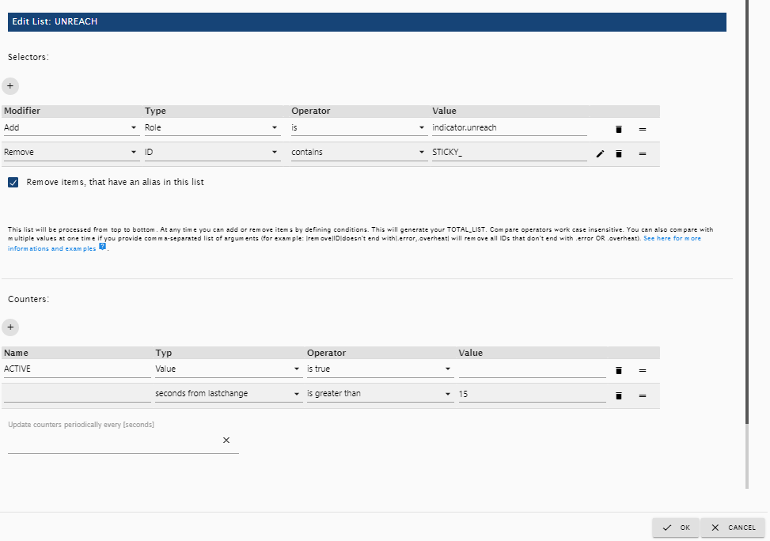

* В селекторах сначала добавляются все точки данных с общей ролью `indicator.unreach`.
* Но затем это удаляет все точки данных, в идентификаторе которых есть `STICKY_` (`homematic` предоставляет индикатор `STICKY_UNREACH`, который нам не нужен для подсчета).
* Фильтрует дубликаты по псевдонимам.

	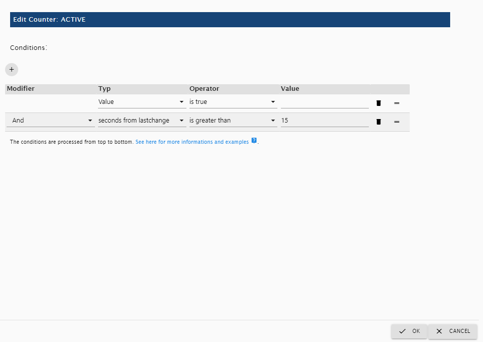

* И наконец, подсчитываются все точки данных со значением «true», которые находятся в этом состоянии не менее 15 секунд.
* Существуют встроенные списки по умолчанию, которые вы можете добавить, например, сложные списки сообщений службы и монитор адаптера. Просто нажмите кнопку «Добавить списки по умолчанию» и выберите, что добавить. Вы можете изучить списки, чтобы лучше понять, как они работают.

### Вики
* В вики есть очень хорошее объяснение с некоторыми полезными улучшениями от `dslraser`: [wiki](https://github.com/sbormann/ioBroker.iqontrol/wiki/Listen-Z%C3%A4hler)
* Здесь вы найдете несколько советов по настройке замены значков в виджете счетчика устройств: [wiki](https://github.com/sbormann/ioBroker.iqontrol/wiki/JSON-Table-and-Device-Counter-Widget---Icon-Replacements)

## Изменение конфигурации точки данных
Вы можете изменить конфигурацию точек данных с помощью значка гаечного ключа (или, точнее, значка шестеренки в новом react-ui), расположенного за точкой данных в диалоговом окне конфигурации устройства или на вкладке объектов в iobroker.

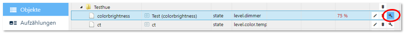 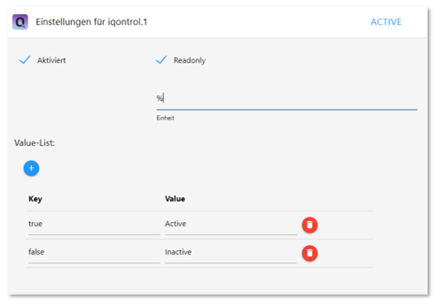

Здесь вы можете:

* Установить флаг "Только для чтения"
* Установить флаг инвертирования
* Установить флаг подтверждения (заставляет пользователя подтвердить изменение перед его записью в точку данных)
* Установка PIN-кода (заставляет пользователя ввести этот PIN-код перед записью изменений в точку данных - но будьте осторожны: это обеспечивает лишь низкий уровень безопасности, поскольку проверка PIN-кода выполняется на стороне клиента! Используйте цифру для отображения полноэкранной клавиатуры для ввода PIN-кода, если потребуется ввести код).
* Измените единицу измерения точки данных, разделив значения для нуля, единственного и множественного числа.
* Изменить минимальное и максимальное значения точки данных
* Задайте шаг, который делает ползунок уровня при его увеличении/уменьшении.
* Изменить тип точки данных
* Изменить роль точки данных
* Укажите идентификатор целевого значения (target-value-id), который представляет собой идентификатор точки данных, куда записываются целевые значения (если у вас разные точки данных для фактического и целевого значения).
* Установить или изменить список значений
* При желании добавьте в список значений опцию для ввода свободного текста.
* Задайте список целевых значений:
* Помимо идентификатора целевого значения, вы можете определить различные идентификаторы точек данных и целевые значения для разных ключей (ключи - это возможные значения исходной точки данных).
* Также можно использовать символ подстановки `*` в ключах и в значениях целевых объектов.
	* Пример:
* Ключ: `TuneIn-Playlist: *`, Идентификатор целевой точки данных: `alexa2.0.Echo-Devices.XYZ.Music-Provider.TuneIn-Playlist`, Целевое значение: `*`
* Если пользователь введёт `TuneIn-Playlist: Ambient`, значение `Ambient` будет записано в `alexa2.0.Echo-Devices.XYZ.Music-Provider.TuneIn-Playlist`.

        

## Описание ролей и связанных с ними состояний
Каждое устройство имеет роль, которая определяет его функцию. Каждая роль генерирует набор состояний, которые могут быть связаны с соответствующим состоянием iobroker.
Если вы используете функцию автосоздания, вы можете выбрать существующее устройство из дерева объектов iobroker. Автосоздание пытается определить роль и сопоставить как можно больше состояний.
Это будет работать только для известных устройств. Для неизвестных устройств и для наделения устройств расширенными функциями вы можете добавить их вручную с помощью кнопки (+) или отредактировать устройства, созданные с помощью автосоздания.
Чтобы отредактировать роль и состояния устройства, нажмите на значок карандаша за устройством. Ниже вы найдете краткое описание ролей и используемых состояний:

### Общие положения:
#### ГОСУДАРСТВЕННЫЙ УРОВЕНЬ
Практически все роли имеют состояние **STATE** и/или **LEVEL**. В большинстве случаев это отражает основную функцию устройства. Вы можете присвоить ему состояния iobroker следующих типов:

* *логическое значение* - если возможно, оно будет преобразовано в осмысленный текст, например, «вкл/выкл», «открыто/закрыто» или что-то подобное. При щелчке по значку плитки происходит попытка переключения логического значения (например, включение или выключение света). Если значение не является доступным только для чтения, в диалоговом окне появится переключатель.
* *число* - будет отображаться вместе с соответствующей единицей измерения и создавать ползунок в диалоговом окне.
* *строка* - текст для отображения
* *value-list* - будет отображено выбранное значение. Если оно не защищено от записи, в диалоговом окне будет сгенерировано выпадающее меню.
*Технически *список значений* - это значение с соответствующим списком преобразований, определенным в объекте `common.custom.iqontrol.<instance>.states`, `native.states` или `common.states` точки данных:

```
"native": {
    "states": {`true`: "Text for true", `false`: "Text for false"},
    ...
}
```

* Вы можете создать свой собственный список значений, изменив точку данных (значок гаечного ключа, или, точнее, значок шестерни в новом react-ui, расположенный за точкой данных на вкладке объектов iobroker, см. выше).
* iQontrol отобразит заданный список значений в виде выпадающего списка в диалоговом окне при следующих обстоятельствах:
* если тип - `number` и список значений содержит ровно столько элементов, сколько шагов между минимальным и максимальным значениями точки данных или
* если тип - `boolean`, но роль не `switch` или
* если тип - `string` или
* если активирована опция "Добавить возможность ввода свободного текста"
* Отображение плитки устройства в активном или неактивном состоянии также определяется точкой данных STATE или LEVEL. Кроме того, вы можете свободно настроить поведение в разделе параметров «Условия для активной плитки». Вы даже можете задать другую внешнюю точку данных, определяющую состояние плитки.

Однако не каждый тип подходит для каждой роли. Например, состояние переключателя в большинстве случаев будет логическим значением, позволяющим переключаться между включенным и выключенным состоянием. При этом может отображаться строка, но сам переключатель не будет функциональным.

#### Дальнейшие общие положения:
* **INFO_A** и **INFO_B**: *массив* - массив точек данных и значков, который будет циклически отображаться в правом верхнем углу плитки.

    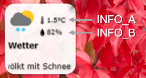

* **ДОПОЛНИТЕЛЬНЫЕ ЭЛЕМЕНТЫ УПРАВЛЕНИЯ**: *массив* - массив точек данных, определяющих дополнительные элементы управления, которые будут отображаться в информационном диалоговом окне. Вы можете использовать переменные в именах и заголовках (используйте тот же синтаксис, что и для обычных имен устройств).
* **ДОПОЛНИТЕЛЬНАЯ ИНФОРМАЦИЯ**: *массив* - массив точек данных, который будет отображаться в нижней части информационного диалога.
* **URL**: CONSTANT или DATAPOINT *строка* - этот URL будет открыт как iframe внутри диалогового окна.
* **HTML**: CONSTANT или DATAPOINT *строка* - эта разметка будет отображаться внутри iframe, если URL-Datapoint не указан.
* **BACKGROUND_URL**: CONSTANT или DATAPOINT *строка* - этот URL будет отображаться в качестве фона плитки устройства. Он размещается поверх фоновых изображений, но вы можете настроить его так, чтобы он скрывался, если плитка активна или неактивна. Более подробную информацию см. в разделе виджетов данного руководства.
* **BACKGROUND_HTML**: CONSTANT или DATAPOINT *строка* - эта разметка будет отображаться в качестве фона плитки устройства, если не указан BACKGROUND_URL.
* **БАТАРЕЯ**: *логическое значение* - если истинно, или *число* - если заряд меньше 10%, отобразится небольшой значок пустой батареи.
* Дополнительное описание поведения значка батареи можно настроить в разделе параметров «Значок пустой батареи».
* **ОШИБКА**: *логическое значение* - если значение истинно, отобразится маленький значок восклицательного знака
* **UNREACH**: *логическое значение* - если true, отобразится небольшой значок беспроводной связи.
* В разделе «Общие» в настройках можно изменить поведение (используйте `connected` вместо `unreach`).
* **ENLARGE_TILE**: *логическое значение* - если true, плитка будет установлена как увеличенная. Вы можете изменить это значение, нажав кнопку увеличения/уменьшения. Но каждый раз, когда состояние ENLARGE_TILE изменяется, оно снова будет управлять состоянием увеличения плиток. Если роль `ENLARGE_TILE` - `button`, то каждое изменение состояния будет переключать состояние увеличения.
* **ЗНАЧОК**: *число* или *строка* - если присутствует значение, отличное от нуля/false, то в верхнем левом углу отображается значок с этим значением. Можно настроить отображение значка даже при нулевом значении или игнорировать единицу измерения.
* **BADGE_COLOR**: *строка* - любая допустимая строка html-цвета (например, 'green', '#00FF00', 'rgba(0,255,0,0.5)' и т. д.), представляющая цвет значка. Если строка отсутствует или недопустима, будет использован красный цвет с 20% прозрачностью.

    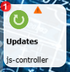

* **OVERLAY_INACTIVE_COLOR** и **OVERLAY_ACTIVE_COLOR**: *строка* - любая допустимая строка цвета HTML (например, 'green', '#00FF00', 'rgba(0,255,0,0.5)' и т. д.), представляющая цвет наложения плитки (в зависимости от того, активна плитка или нет). Если допустимая строка цвета не указана, используется стандартный цвет наложения (который можно настроить в параметрах iQontrol). Имейте в виду, что в параметрах iQontrol есть опция определения прозрачности наложения, которая повлияет на внешний вид установленного цвета наложения.
* Для светильников также можно использовать опцию "Использовать цвет лампы в качестве OVERLAY_ACTIVE_COLOR", которую можно найти в настройках конкретного устройства.

    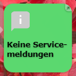

* **GLOW_INACTIVE_COLOR** и **GLOW_ACTIVE_COLOR**: *строка* - любая допустимая строка html-цвета (например, `green`, `#00FF00`, `rgba(0,255,0,0.5)` и т. д.), представляющая цвет эффекта свечения вокруг плитки (в зависимости от того, активна плитка или нет). Если допустимая строка цвета не указана, эффект свечения отключается.
* **GLOW_HIDE**: *логическое значение* - если true, эффект свечения скрывается (можно инвертировать в разделе «Общие» в настройках)
* Для освещения также можно использовать опцию "Использовать цвет лампы как GLOW_ACTIVE_COLOR", которую можно найти в настройках конкретного устройства.

    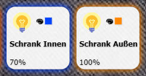

### Ссылка на другой вид:
* Не имеет других штатов
* Свойство **linked-view-property** открывается напрямую.

###  Переключатель:
* **СОСТОЯНИЕ**: *логическое значение* - отображение и установка состояния включения/выключения
* **МОЩНОСТЬ**: *число* - потребляемая мощность, которая будет отображаться мелким шрифтом в правом верхнем углу.

###  Кнопка:
* **ШТАТ**: *любой* - любой желаемый тип штата
* **SET_VALUE**: CONSTANT *string* - это константа (не связанное состояние iobroker!), которая будет присвоена состоянию при нажатии кнопки.
* **OFF_SET_VALUE**: CONSTANT *string* - это константа (не связанное состояние iobroker!). Если определено, состояние будет сброшено до этого значения через время, указанное в параметрах, или через 100 мс.

###  Свет:
Каждый источник света может находиться в одном или обоих из следующих состояний:

* **СОСТОЯНИЕ**: *логическое значение* - отображение и установка состояния включения/выключения
* **УРОВЕНЬ**: *число* - отображает и устанавливает уровень освещения

По желанию можно определить следующие состояния:

* Для цветных светодиодов (цветовое пространство HSB):
* **ОТТЕНОК**: *число* - цвет света от 0 до 360° (формат оттенка)
* **НАСЫЩЕННОСТЬ**: *число* - насыщенность света (от белого до чистого цвета)
* **ЯРКОСТЬ_ЦВЕТА**: *число* - яркость цветных светодиодов (если у вас состояние LEVEL и нет белых светодиодов, это игнорируется, поскольку яркость полностью контролируется состоянием LEVEL).
* Для белых светодиодов:
* **КТ**: *число* - цветовая температура света, если он имеет два оттенка белого.
* **WHITE_BRIGHTNESS**: *число* - яркость белых светодиодов (если у вас состояние LEVEL и нет цветных светодиодов, это игнорируется, поскольку яркость полностью контролируется состоянием LEVEL).
* Альтернативные цветовые пространства:
* **ALTERNATIVE_COLORSPACE_VALUE**: *строка* или *число* (в зависимости от выбранного цветового пространства) - значение альтернативного цветового пространства

Если ваше устройство не поддерживает использование цветовых пространств HUE, SATURATION и COLOR_BRIGHTNESS (HSB/HSV), вы можете использовать различные альтернативные цветовые пространства. В настройках устройства вы можете выбрать одно из следующих цветовых пространств:

* **RGB** / **#RGB**: вместо использования HUE, SATURATION и COLOR_BRIGHTNESS можно использовать формат RGB (шестнадцатеричный), необязательно с префиксом '#'.
* **RGBW** / **#RGBW**: вместо использования HUE, SATURATION, COLOR_BRIGHTNESS и WHITE_BRIGHTNESS можно использовать формат RGBW (шестнадцатеричный), необязательно с префиксом '#'.
* **RGBWWCW** / **#RGBWWCW** / **RGBCWWW** / **#RGBCWWW**: вместо HUE, SATURATION, COLOR_BRIGHTNESS, CT и WHITE_BRIGHTNESS можно использовать формат RGBWWCW или RGBCWWW (шестнадцатеричный, WW = теплый белый, CW = холодный белый), с возможностью добавления символа '#' в начале.
* **RGB (только оттенок)** / **#RGB (только оттенок)**: вместо использования HUE можно использовать формат RGB (только оттенок) (шестнадцатеричный), необязательно с ведущим символом '#'. В этом особом случае формат RGB будет принимать только чистые насыщенные цвета круга оттенка-цвета. Смешанный белый цвет не допускается.
* **Оттенок для Milight**: Это значение оттенка для устройств Milight (версия 5), с использованием другой отправной точки в цветовом круге оттенка:

```
tHue = modulo(66 - (hue / 3.60), 100) * 2.55;
modulo(-3.60 * (MilightHue/2.55 - 66), 360);
on modulo(n, m){ return ((n % m) + m) %m; }
```

* **HHSSBB для Tuya**: шестнадцатеричная строка длиной в 12 цифр, представляющая оттенок (HH = 0000-016d [0-365]), насыщенность (SS = 0000-03e8 [0-1000]) и яркость цвета (BB = 0000-03e8 [0-1000])

Обратите внимание: преобразование в альтернативное цветовое пространство выполняется на стороне клиента, поэтому оно активно только в том случае, если iQontrol открыт где-либо. Следовательно, вы не можете использовать его в качестве конвертера цветовых пространств. Чтобы избежать зацикливания преобразования, рекомендуется использовать либо исходные точки данных цветового пространства (HUE, SATURATION, COLOR_BRIGHTNESS, CT, WHITE_BRIGHTNESS), *либо* точки данных альтернативного цветового пространства для *замены* этих точек данных.

* Режим действия:
* **ЭФФЕКТ**: *список значений* - эффект, который нужно воспроизвести
* **EFFECT_NEXT**: *логическое значение* - если установлено значение true, будет воспроизведен следующий эффект (в качестве альтернативы для устройств, не поддерживающих список значений EFFECT)
* **EFFECT_SPEED_UP** / **EFFECT_SPEED_DOWN**: *логическое значение* - если установлено значение true, эффект будет ускоряться/ускоряться.
* Разнообразный:
* **МОЩНОСТЬ**: *число* - потребляемая мощность, которая будет отображаться мелким шрифтом в правом верхнем углу.

###  Вентилятор:
* **СОСТОЯНИЕ**: *логическое значение* - отображение и установка состояния включения/выключения
* **УРОВЕНЬ**: *число* или *список значений* - скорость вращения вентилятора
* **МОЩНОСТЬ**: *число* - потребляемая мощность, которая будет отображаться мелким шрифтом в правом верхнем углу.

###  Термостат:
* **SET_TEMPERATURE**: *число* - целевая температура
* **ТЕМПЕРАТУРА**: *число* - фактическая температура, которая будет отображаться мелким шрифтом в правом верхнем углу.
* **ВЛАЖНОСТЬ**: *число* - фактическая влажность, которая будет отображаться мелким шрифтом в правом верхнем углу.
* **CONTROL_MODE**: *value-list* - отображение и установка режима работы термостата
* **WINDOW_OPENING_REPORTING**: *логическое значение* - если true, отображается небольшое открытое окно
* **VALVE_STATES**: массив имен и чисел - отображает степень открытия клапанов, связанных с термостатом.

###  Термостат Homematic:
Помимо обычного термостата, вы можете задать следующие параметры:

* **PARTY_TEMPERATURE**: *строка* - строка специального формата для определения режима вечеринки или праздника термостатов Homematic.
* **BOOST_STATE**: *число* - отображает оставшееся время работы термостатов Homematic в режиме повышенной нагрузки.

### 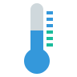 Датчик температуры, 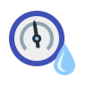 Датчик влажности,  Датчик давления:
* **СОСТОЯНИЕ**: *число* - температура или влажность, отображаемые в нижней части устройства.
* **ТЕМПЕРАТУРА**: *число* - температура, которая будет отображаться мелким шрифтом в правом верхнем углу.
* **ВЛАЖНОСТЬ**: *число* - показатель влажности, который будет отображаться мелким шрифтом в правом верхнем углу.
* Свойство **linked-view-property** открывается напрямую.

###  Датчик яркости:
* **СОСТОЯНИЕ**: *число* - яркость, которая будет отображаться в нижней части устройства.
* **ЯРКОСТЬ**: *число* - яркость, которая будет отображаться мелким шрифтом в правом верхнем углу.
* Свойство **linked-view-property** открывается напрямую.

###  Датчик движения:
* **СОСТОЯНИЕ**: *логическое значение* - отображает, обнаружено движение или нет
* Свойство **linked-view-property** открывается напрямую.

### 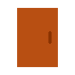 Дверь, 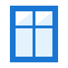 Окно:
* **СОСТОЯНИЕ**: *логическое значение* - отображает, открыта или закрыта дверь или окно.
* В качестве альтернативы вы можете назначить *список значений* для отображения дополнительных состояний, таких как «наклонено» (в параметрах окон можно определить, какой текст обозначает открытое, закрытое и наклоненное состояние для отображения соответствующей иконки).
* Вы также можете присвоить *строку* для отображения любого текста, например, «3 окна открыты» или «все закрыты», или *число*.
* Свойство **linked-view-property** открывается напрямую.

### 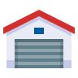 Гаражные ворота:
* **СОСТОЯНИЕ**: *логическое значение* - отображает, открыта или закрыта дверь.
* В качестве альтернативы вы можете присвоить *список значений* для отображения дополнительных состояний, таких как «наклон».
* Вы также можете присвоить *строку* для отображения любого текста, например, «3 двери открыты» или «все закрыты».
* **TOGGLE**: *логическое значение* - отображает кнопку «Переключатель» и устанавливается в значение true при нажатии.

###  Дверь с замком:
* **СОСТОЯНИЕ**: *логическое значение* - отображает, открыта или закрыта дверь (контакт двери/окна)
* **LOCK_STATE**: *логическое значение* - отображает и управляет состоянием двери (если STATE равно true, управление отключено, поскольку дверь нельзя запереть, она открыта).
* **LOCK_STATE_UNCERTAIN**: *логическое значение* - если true, состояние будет отображаться курсивом, указывая на то, что точное положение замка неизвестно.
* **LOCK_OPEN**: *логическое значение* - если установлено значение true, дверь откроется полностью

###  Слепой:
* **УРОВЕНЬ**: *число* - высота жалюзи в процентах
* **НАПРАВЛЕНИЕ**: *список значений* - может быть Stop, Up и Down. Значения, представляющие Stop, Up, Down и Unknown, можно настроить.
* **СТОП**: *логическое значение* - устанавливается в true, если нажата кнопка «Стоп». Дополнительно можно задать значение с помощью точки данных **STOP_SET_VALUE**. Если задано, это значение будет отправлено вместо true при нажатии кнопки «Стоп».
* **ВВЕРХ** / **ВНИЗ**: *логическое значение* - устанавливается в true, если нажата кнопка вверх/вниз (для устройств, использующих точки данных UP и DOWN вместо или в дополнение к LEVEL). Кроме того, вы можете задать значение с помощью точек данных **UP_SET_VALUE** / **DOWN_SET_VALUE**. Если задано, это значение будет отправлено вместо true при нажатии кнопки вверх/вниз.
* **FAVORITE_POSITION**: *логическое значение* - может использоваться для вызова избранной позиции. При нажатии кнопки «Избранное» (название кнопки можно настроить в параметрах устройства) в этот параметр будет отправлено значение true. Кроме того, вы можете задать значение с помощью параметра **FAVORITE_POSITION_SET_VALUE**. Если он задан, то вместо значения true будет отправлено значение при нажатии кнопки «Избранное».
* **УРОВЕНЬ_РЕШЕТОК**: *число* - положение реек в процентах

###  Датчик огня:
* **СОСТОЯНИЕ**: *логическое значение* - если true, датчик будет отображаться как сработавший
* В качестве альтернативы вы можете присвоить *список значений* для отображения дополнительных состояний, таких как «повреждено».
* Вы также можете присвоить *строку* для отображения любого текста, например, «пожар на верхнем этаже».
* Свойство **linked-view-property** открывается напрямую.

###  Датчик затопления:
* **СОСТОЯНИЕ**: *логическое значение* - если true, датчик будет отображаться как сработавший
* В качестве альтернативы вы можете присвоить *список значений* для отображения дополнительных состояний, таких как «повреждено».
* Вы также можете присвоить *строку* для отображения любого текста, например, «наводнение на верхнем этаже».
* Свойство **linked-view-property** открывается напрямую.

###  Сигнализация:
* **СОСТОЯНИЕ**: *логическое значение* - если true, датчик будет отображаться как сработавший
* В качестве альтернативы вы можете присвоить *список значений* для отображения дополнительных состояний, таких как «повреждено».
* Вы также можете присвоить *строку* для отображения любого текста, например, «пожар на верхнем этаже».
* **CONTROL_MODE**: *value-list* - выберите режим работы, например, "Включено" или "Выключено"
* В параметрах устройства можно задать значение, обозначающее состояние "снято с охраны", чтобы отображалась соответствующая иконка.

###  Батарея:
* **СОСТОЯНИЕ**: *число* - уровень заряда батареи в процентах
* **ЗАРЯДКА**: *логическое значение* - если true, отображается значок зарядки
* **МОЩНОСТЬ**: *число* - потребляемая мощность, которая будет отображаться мелким шрифтом в правом верхнем углу.
* **НАПРЯЖЕНИЕ**: *число* - напряжение, которое будет отображаться мелким шрифтом в правом верхнем углу.

###  Дата и время:
* **СОСТОЯНИЕ**: *логическое значение* - если true, плитка будет отображаться как активная
* **ТЕМА**: *строка* - для задания описания
* **ЗВОНОК**: *логическое значение* - если истинно, отображается тревожный звонок
* Обратите внимание: вы можете настроить кнопку выхода и кнопку отложенного сигнала через ADDITIONAL_CONTROLS.
* **ВРЕМЯ**: *строка* - Строка с датой и/или временем или продолжительностью (формат можно указать в параметрах устройства) для первого и второго раза.

<подробности> <краткое описание>Показать возможные форматы времени: (<ins>нажмите, чтобы открыть</ins>)</краткое описание>

* В пользовательском разделе (значок гаечного ключа или, точнее, значок шестеренки в новом react-ui) любой точки данных можно настроить параметры time-format и time-display-format. Если точка данных содержит информацию о времени, эти два параметра определяют, в каком формате время сохраняется в точке данных и как iQontrols отображает время пользователю.
* Для устройства «Дата и время» эти два параметра также можно установить в параметрах устройства в разделе, специфичном для данного устройства. Они переопределят настройки, сделанные в пользовательском разделе точки данных.
* Вы можете использовать следующие токены:

| | | Токен | Описание/Пример | Точка данных | Отображение | Выборщик |
|----------:|-------------------------------:|----------------------|------------------------------------------------------------------------------------|-----------|----------------------------------------|-------------------------------|
| Временная метка | Временная метка Unix | `X` | `1410715640.579` | X | --- | --- |
| Дата | День недели | `d` | `0` `1`...`5` `6` | X | --- | --- |
| | | `dd` | `Su` `Mo`...`Fr` `Sa` | X | X (переведено) | --- |
| | | `ddd` | `Sun` `Mon`...`Fri` `Sat` | X | X (переведено) | --- |
| | | `dddd` | `Sunday` `Monday`...`Friday` `Saturday` | X | X (переведено) | --- |
| | | `do` | `0th` `1st`...`5th` `6th` | X | --- | --- |
| | День месяца | `D` | `1` `2`...`30` `31` | X | X | X |
| | | `DD` | `01` `02`...`30` `31` | X | X | X |
| | | `Do` | `1st` `2nd`...`30th` `31st` | X | --- (преобразовано в `D`) | --- (преобразовано в `D`) |
| | Месяц | `M` | `1` `2`...`11` `12` | X | X | X |
| | | `MM` | `01` `02`...`11` `12` | X | X | X |
| | | `MMM` | `Jan` `Feb`...`Nov` `Dec` | X | X | X |
| | | `MMMM` | `January` `February`...`November` `December` | X | X | X |
| | | `Mo` | `1st` `2nd`...`11th` `12th` | X | --- (преобразовано в `M`) | --- (преобразовано в `M`) |
| | Год | `Y` | `1970` `1971`...`9999` `+10000` `+10001` | X | X | X |
| | | `YY` | `70` `71`...`29` `30` | X | X | X |
| | | `YYYY` | `1970` `1971`...`2029` `2030` | X | X | X |
| | | `YYYYYY` | `-001970` `-001971`...`+001907` `+001971` | X | --- (преобразовано в `YYYY`) | --- (преобразовано в `YYYY`) |
| Время | AM/PM | `A` | `AM` `PM` | X | X | X |
| | | `a` | `am` `pm` | X | X | X |
| | Час | `H` | `0` `1`...`22` `23` | X | X | X |
| | | `HH` | `00` `01`...`22` `23` | X | X | X |
| | | `h` | `1` `2`...`11` `12` | X | X | X |
| | | `hh` | `01` `02`...`11` `12` | X | X | X |
| | | `k` | `1` `2`...`23` `24` | X | --- (преобразовано в `H`) | --- (преобразовано в `H`) |
| | | `kk` | `01` `02`...`23` `24` | X | --- (преобразовано в `HH`) | --- (преобразовано в `HH`) |
| | Минута | `m` | `0` `1`...`58` `59` | X | X | X |
| | | `mm` | `00` `01`...`58` `59` | X | X | X |
| | Второй | `s` | `0` `1`...`58` `59` | X | X | X |
| | | `ss` | `00` `01`...`58` `59` | X | X | X |
| | Дробная секунда | `S` | `0` `1`...`8` `9` | X | --- | --- |
| | | `SS` | `00` `01`...`98` `99` | X | --- | --- |
| | | `SSS` | `000` `001`...`998` `999` | X | --- | --- |
| | | `SSSS`...`SSSSSSSSS` | `000[0..]` `001[0..]`...`998[0..]` `999[0..]` | X | --- | --- |
| | Часовой пояс | `z` или `zz` | `EST` `CST`...`MST` `PST` | X | --- | --- |
| | | `Z` | `-07:00` `-06:00`...`+06:00` `+07:00` | X | --- | --- |
| | | `ZZ` | `-0700` `-0600`...`+0600` `+0700` | X | --- | --- |
| Периоды | День года | `DDD` | `1` `2`...`364` `365` | X | --- | --- |
| | | `DDDD` | `001` `002`...`364` `365` | X | --- | --- |
| | | `DDDo` | `1st` `2nd`...`364th` `365th` | X | --- | --- |
| Другое | День недели (местоположение) | `e` | `0` `1`...`5` `6` | X | --- | --- |
| | День недели (ISO) | `E` | `1` `2`...`6` `7` | X | --- | --- |
| | Квартал | `Q` | `1` `2` `3` `4` | X | --- | --- |
| | | `Qo` | `1st` `2nd` `3rd` `4th` | X | --- | --- |
| | Неделя года | `w` | `1` `2`...`52` `53` | X | --- | --- |
| | | `wo` | `1st` `2nd`...`52nd` `53rd` | X | --- | --- |
| | | `ww` | `01` `02`...`52` `53` | X | --- | --- |
| | Неделя года (ISO) | `W` | `1` `2`...`52` `53` | X | --- | --- |
| | | `Wo` | `1st` `2nd`...`52nd` `53rd` | X | --- | --- |
| | | `WW` | `01` `02`...`52` `53` | X | --- | --- |
| | Год эпохи | `y` | `1` `2`...`2020`... | X | --- | --- |
| | | `yo` | `1st` `2nd`...`2020th`... | X | --- | --- |
|           | Эра | `N`, `NN`, `NNN` | `BC` `AD` | Х | --- | --- |
| | | `NNNN` | `Before Christ`, `Anno Domini` | X | --- | --- |
| | | `NNNNN` | `BC` `AD` | X | --- | --- |
| | Неделя Год | `gg` | `70` `71`...`29` `30` | X | --- | --- |
| | | `gggg` | `1970` `1971`...`2029` `2030` | X | --- | --- |
| | Неделя Год (ISO) | `GG` | `70` `71`...`29` `30` | X | --- | --- |
| | | `GGGG` | `1970` `1971`...`2029` `2030` | X | --- | --- |
| Периоды | Период | `P` | Отмечает период, а не конкретное время. Может иметь один из следующих форматов: | X | --- (преобразуется в `D [Day(s)], h:m:s`) | --- (преобразуется в `D, h:m:s`) |
| | | | миллисекунды (например, `279344`) | | | |
| | | | часы:минуты (например, `46:33`) | | | |
| | | | часы:минуты:секунды (например, `46:33:44` или `28:33:44.5`) | | | |
| | | | дни часы:минуты.секунды (например, `1 22:33:44` или `1 22:33:44.5`) | | | |
| | | | дни.часы:минуты.секунды (например, `1.22:33:44` или `1.22:33:44.5`) | | | |
| | | | ISO 8601 (например, `P0Y0M1DT22H33M44S` или `P1DT22H33M44S`) | | | |
| | | `Py` | Период лет | X | --- | --- |
| | | `PM` | Период месяцев | X | --- | --- |
| | | `Pw` | Период недель | X | --- | --- |
| | | `Pd` | Период дней | X | --- | --- |
| | | `Ph` | Период часов | X | --- | --- |
| | | `Pm` | Период в минутах | X | --- | --- |
| | | `Ps` | Период секунд | X | --- | --- |
| | | `Pms` | Период в миллисекундах | X | --- | --- |
| Флаги | Установить недостающие части в начало | `tb` | Например, установить дату на 1970-01-01, если указано только время | X | --- | --- |
| | Установить недостающие части на текущее время | `tn` | Например, установить дату на текущее время, если указано только время | X | --- | --- |
| | Сохранить старые недостающие части | `to` | Например, оставить дату как прежде, если указано только время | X | --- | --- |
| Свободный текст | Отметьте свободный текст в скобках | `[]` | `[this is an example, all tokens are ignored]` | X | X | --- |
| Свободный текст | Отметьте свободный текст в скобках | `[]` | `[это пример, все токены игнорируются]` | X | X | --- |

* Если вы используете разные конфигурации для datapoint-timeformat и display-timeformat, применяются следующие правила преобразования.
* Вы можете использовать флаги `tb`, `tn` и `to` внутри параметра datapoint-timeformat, чтобы повлиять на поведение.

    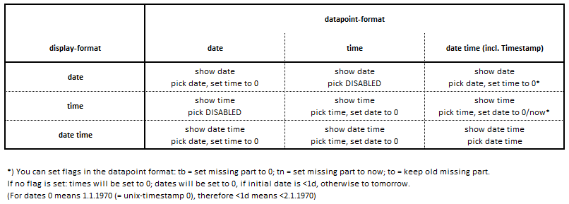

</details>

###  Значение:
* **ШТАТ**: *любой* - любой допустимый штат для отображения (см. раздел «Общие штаты»).
* **УРОВЕНЬ**: *число* - отобразит ползунок в диалоговом окне

###  Программа:
* **СОСТОЯНИЕ**: *логическое значение* - если установлено значение true, программа будет запущена

###  Сцена:
* **СОСТОЯНИЕ**: *логическое значение* - отображает, активна ли сцена. В зависимости от конфигурации сцены (виртуальная группа, заданные значения для false, enabled или disabled), команда переключения будет отправлять true, false, min, 0, max или 100. Есть возможность всегда отправлять true (отключить переключение).

###  Медиаплеер / Пульт дистанционного управления:
* **СОСТОЯНИЕ**: *строка* - "воспроизведение", "пауза" или "остановка" или *логическое значение* - true для воспроизведения, false для остановки
* В параметрах устройства можно задать значения, соответствующие воспроизведению, паузе и остановке.
* **COVER_URL**: *строка* - URL изображения обложки
* **ИСПОЛНИТЕЛЬ, АЛЬБОМ, НАЗВАНИЕ**: *string* - само собой разумеется
* **НОМЕР_ТРЕКА**: *номер* - само собой разумеется
* **ПРЕДЫДУЩИЙ, ПЕРЕМОТКА НАЗАД, ВОСПРОИЗВЕДЕНИЕ, ПАУЗА, СТОП, ПЕРЕМОТКА ВПЕРЕД, СЛЕДУЮЩИЙ**: *логическое значение* - будет установлено в true, если нажата соответствующая кнопка
* **SHUFFLE, MUTE, PLAY_EVERYWHERE, EJECT, POWER_SWITCH**: *логическое значение* - состояние для соответствующей функции
* **ПОВТОР**: *логическое значение* - состояние функции повтора или *строка* - можно задать 3 состояния с помощью соответствующих параметров: значение для выключения, повтора всех повторов и повтора одного повтора
* **ПРОДОЛЖИТЕЛЬНОСТЬ, В ПРОШЛОМ**: *число* - продолжительность и время, прошедшее с момента просмотра видео - используется для отображения полосы прокрутки
* **ГРОМКОСТЬ**: *число* - для ползунка громкости
* **ИСТОЧНИК, ПЛЕЙЛИСТ**: *value-list* - show select-menu to choose source or title from playlist

Для отображения *универсального пульта дистанционного управления* можно задать следующие состояния:
* **REMOTE_NUMBER**: *строка* - отображает цифровую клавиатуру и возвращает соответствующее число, если на него нажата цифра.
* **REMOTE_VOLUME_UP, REMOTE_VOLUME_UP, REMOTE_CH_UP, REMOTE_CH_DOWN**: *строка* - отображает кнопки увеличения/уменьшения громкости и переключения каналов вверх/вниз и возвращает 'volumeUp', 'volumeDown', 'chUp' или 'chDown', если нажата соответствующая кнопка
* **REMOTE_PAD_DIRECTION, REMOTE_PAD_BACK, REMOTE_PAD_HOME, REMOTE_PAD_MENU**: *строка* - отображает сенсорную панель для навигации и возвращает
* 'ok', если нажата середина панели.
* «влево», «вправо», «вверх» или «вниз», если нажаты края панели или панель проведена в соответствующем направлении.
* 'назад', 'домой' или 'меню', если нажаты соответствующие кнопки*
* Обратите внимание: вы можете использовать список целевых значений (доступный через значок гаечного ключа, или, скорее, значок шестеренки в новом React UI, для каждой точки данных), чтобы связать одну точку данных с несколькими точками данных в зависимости от возвращаемого значения (см. раздел «Изменение точек данных» выше).
* **REMOTE_COLOR**: *строка* - отображает цветные кнопки и возвращает соответствующий цвет («красный», «зеленый», «желтый» или «синий»), если нажата кнопка с определенным цветом.
* **REMOTE_CHANNELS**: *array* - массив кнопок. Имя кнопки отправляется соответствующему идентификатору состояния, если кнопка нажата.
* **REMOTE_ADDITIONAL_BUTTONS**: *array* - массив кнопок. Имя кнопки отправляется соответствующему идентификатору состояния, если кнопка нажата.
* **REMOTE_HIDE_REMOTE**: *логическое значение* - если true, весь раздел пульта дистанционного управления будет скрыт (например, чтобы отображать его только при выборе допустимого источника).

###  Всплывающее окно:
* **СОСТОЯНИЕ**: *любое* - может использоваться для отображения дополнительной информации

###  Внешняя ссылка:
* **СОСТОЯНИЕ**: *любое* - может использоваться для отображения дополнительной информации
* **URL**: КОНСТАНТНАЯ *строка* - этот URL будет открыт

###  Виджет:
Это устройство имеет несколько специальных предустановленных параметров размера и отображения для показа веб-сайта, который можно определить с помощью параметра **BACKGROUND_URL**, в виде виджета. При настройках по умолчанию в правом верхнем углу будет отображаться небольшая кнопка увеличения.

* **СОСТОЯНИЕ**: *любое* - СПЕЦИАЛЬНОЕ: Если поле пустое, будет создана виртуальная точка данных, нажав на которую, вы сможете активировать виджет и, следовательно, увеличить его размер.

### Информационный текст:
Это устройство имеет несколько специальных предустановленных настроек размера и отображения, позволяющих показывать текст на всю ширину экрана на прозрачном фоне. При стандартных настройках устройство скрывается, если поле STATE пустое. Высота устройства адаптируется к размеру поля STATE.

* **СОСТОЯНИЕ**: *любое* - текст, отображаемый на экране.

****

## Поиск неисправностей
* Убедитесь, что вы заполнили раздел «Вам необходимо...» в верхней части этой страницы.
* Если после обновления что-то работает не так, как ожидалось, попробуйте выполнить следующие действия:
* Начать загрузку адаптера:

    \
        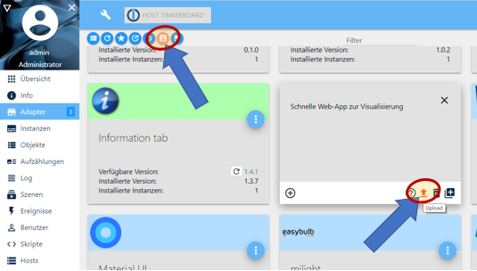

* Очистить кэш браузера
* Перезапустите ioBroker

### Если у вас возникнут дополнительные проблемы, предоставьте, пожалуйста, лог из консоли отладки вашего браузера и скриншоты строки, в которой возникла ошибка:
* Запустите iQontrol, открыв консоль отладки в браузере (чаще всего для этого нужно нажать <kbd>F12</kbd>).
* Переключитесь в консольное окно и воспроизведите ошибку.
* Ищите сообщения в окне консоли.
* При возникновении ошибок указывается номер строки, вызвавшей ошибку.
* Пожалуйста, нажмите на номер этой строки и сделайте снимок экрана с неисправной строкой:

 

****

## Changelog
<!--
  Placeholder for the next version (at the beginning of the line):
  ### **WORK IN PROGRESS**
-->

### **WORK IN PROGRESS**
- (copilot) Adapter requires node.js >= 22 now
- (copilot) Adapter requires admin >= 7.7.22 now
- (copilot) Adapter requires js-controller >= 6.0.11 now
- (copilot) Adapter requires admin >= 7.6.17 now

### 3.0.0 (2024-10-21)
- (mcm1957) Adapter has been moved to iobroker-community-adapter organisation.
- (mcm1957) Adapter requires js-controller 5, admin 6 and node.js 20 now.
- (mcm1957) Dependencies have been updated.

### 2.3.0 (2023-07-16)
* (sbormann) Fixes for new js-controller

### 2.2.0 (2023-03-23)
* (sbormann) You can now chose destination when copying devices.
* (sbormann) Added option Toggle POWER_SWITCH instead of STATE (for example when clicking on icon) for media.
* (sbormann) Added option to hide slider for LEVEL, if favorites are set.
* (sbormann) Added option to show BADGE, even if value is zero.
* (sbormann) Added option to set DURATION and ELAPSED in milliseconds respective percentage for media.
* (sbormann) Added ability to set links to other views with anchor to sub-headings.
* (sbormann) Corrected some fonts.
* (sbormann/Wal) Enabled right-click for wioBrowser.
* (sbormann) Added some new options for popup-messages and introduced persistent popups.
* (sbormann) Uploading of userfiles via ZIP-File is now possible.
* (sbormann/hetti72) Fixed CONTROL_MODE of HP-IP-Thermostat (hopefully finally...)
* (sbormann) Removed hidden links to other views from toolbar context-menu

### 2.1.0 (2023-01-24)
* (sbormann) Fixed marquee for INFO_A/B after resizing tile.
* (sbormann) Subheading with no visible tiles beneath are now hided.
* (sbormann) Added option to hide STATE and LEVEL in dialog.
* (sbormann) Fixed default icons for ERROR, UNREACH and BATTERY (if you have changed them in a previous version you might need to change them again).
* (sbormann) Fixed size of custom toolbar icons.
* (sbormann) Added DISCHARGE to Battery.
* (sbormann) Fixed Favorites not working in map-widget with instance-number.
* (sbormann) Enhanced JSON-Table to work with alexa-shoppinglist-adapter.
* (sbormann) Added badges to toolbar.
* (sbormann) Enhanced handling of images in BACKGROUND_HTML.
* (sbormann) Added option to protect instance by passphrase.
* (sbormann) Added option to set value of LOCK_OPEN for doors with lock.
* (sbormann) Linking color to GLOW or BACKGROUND_COLOR now works when using ALTERNATIVE_COLORSPACE.
* (sbormann) Added URL-Parameter &language=xx.
* (sbormann) Added option to center headers and subheaders. 
* (sbormann) Enhanced FLOT-Chart-Widget to display more Datapoints.
* (sbormann) Fixed timestamp in JSON-Table-Widget.
* (dirkhe) Fixed and enhanced step attribute.
* (sbormann) Moved options caption for STATE and caption for LEVEL into section STATE, LEVEL and TIMESTAMP.
* (sbormann) Added option to set favorite values for LEVEL.
* (sbormann) You can now click on linked devices.
* (sbormann) Prevented back-swiping for safari.
* (sbormann) Updated some dependencies.

### 2.0.1 (2022-03-09)
* (sbormann) Fixed json-table sorting order.
* (sbormann) Added placeholder-option for empty tables to json-table-widget.
* (sbormann) Fixed 'switch to this widget button' for widgets with replace-URL.
* (sbormann) Added more timestamp options to datapoint-detection of json-table-widget.
* (sbormann) Enhanced sorting of lists.

[Older changelogs can be found there](https://github.com/iobroker-community-adapters/ioBroker.iqontrol/blob/master/CHANGELOG_OLD.md)

## License
MIT License

Copyright (c) 2024-2026 iobroker-community-adapters <iobroker-community-adapters@gmx.de>  
Copyright (c) 2019-2023 Sebastian Bormann

Permission is hereby granted, free of charge, to any person obtaining a copy
of this software and associated documentation files (the "Software"), to deal
in the Software without restriction, including without limitation the rights
to use, copy, modify, merge, publish, distribute, sublicense, and/or sell
copies of the Software, and to permit persons to whom the Software is
furnished to do so, subject to the following conditions:

The above copyright notice and this permission notice shall be included in all
copies or substantial portions of the Software.

THE SOFTWARE IS PROVIDED "AS IS", WITHOUT WARRANTY OF ANY KIND, EXPRESS OR
IMPLIED, INCLUDING BUT NOT LIMITED TO THE WARRANTIES OF MERCHANTABILITY,
FITNESS FOR A PARTICULAR PURPOSE AND NONINFRINGEMENT. IN NO EVENT SHALL THE
AUTHORS OR COPYRIGHT HOLDERS BE LIABLE FOR ANY CLAIM, DAMAGES OR OTHER
LIABILITY, WHETHER IN AN ACTION OF CONTRACT, TORT OR OTHERWISE, ARISING FROM,
OUT OF OR IN CONNECTION WITH THE SOFTWARE OR THE USE OR OTHER DEALINGS IN THE
SOFTWARE.