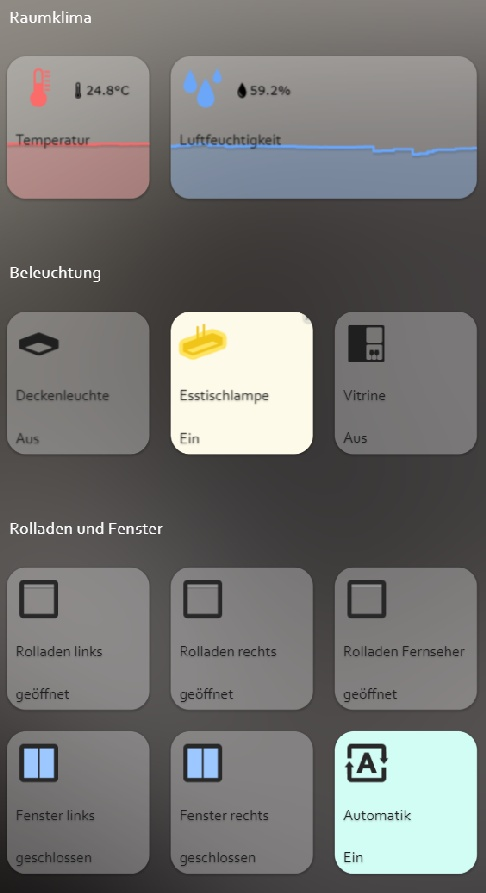

# IoBroker.iqontrol
[](https://weblate.iobroker.net/engage/adapters/?utm_source=widget)

**Тесты:**

| Linux/Mac/Windows: | Кросс-браузерная проверка: |
| --- | --- |

\ **Если вам это нравится, рассмотрите пожертвование:**

[![PayPal] (https://www.paypalobjects.com/en_US/DK/i/btn/btn_donateCC_LG.gif)](https://www.paypal.com/cgi-bin/webscr?cmd=_s-xclick&hosted_button_id=LDHZMNPXKRX2N&source=url)

****

## Адаптер iqontrol для ioBroker
Быстрое веб-приложение для визуализации.

 © от dslraser: © автор muuulle: © автор peks-64:

Работает в любом браузере.
Легко настроить, хотя он полностью настраиваемый и отзывчивый.

> **Этот адаптер использует библиотеки Sentry для автоматического сообщения об исключениях и ошибках кода разработчикам.** Дополнительные сведения и информацию о том, как отключить отчеты об ошибках, см. в [Документация по плагину Sentry](https://github.com/ioBroker/plugin-sentry#plugin-sentry)! Отчеты Sentry используются, начиная с js-controller 3.0.

## Видео-учебник (немецкий язык):
[](https://youtube.com/playlist?list=PL8epyNz8pGEv6-R8dnfXm-m5aBlZFKOBG)

## Добавить на домашний экран
Вы можете сохранить его как веб-приложение на главном экране, и оно будет выглядеть и работать как родное приложение: 

## Тебе нужно...
* Nodejs 10 или выше
* Веб-адаптер с одним экземпляром, работающим по тому же протоколу (http или https), что и админ-адаптер, socket.IO настроен как «интегрированный» и «Принудительно использовать веб-сокеты» отключен.
    * Если это противоречит другим адаптерам, просто добавьте еще один экземпляр с указанными выше настройками — iQontrol выполнит поиск наиболее подходящего экземпляра веб-адаптера и будет использовать его для связи.
* Для подключения через *iobroker.pro-Cloud* и административный, и веб-адаптер должны быть настроены на http (не https)

* Если у вас возникнут какие-либо проблемы, ознакомьтесь с разделом [устранение неполадок](#troubleshooting) в конце этого файла ознакомительных сведений.

## Форум
Посетите тему поддержки [iobroker форум](https://forum.iobroker.net/topic/52077).
Посетите тему для разработчиков [iobroker форум](https://forum.iobroker.net/topic/22039).

## Вики
Посмотрите вики [вики](https://github.com/sbormann/ioBroker.iqontrol/wiki).

## Как пользоваться
**Не пугайтесь множества вариантов, которые у вас есть.** Большинство вещей работает сразу после установки. Вы *можете*, но вам не обязательно использовать все возможности конфигурации, которые предлагает iQontrol! Просто начните так:

* Начните создавать представления.

Вы можете рассматривать просмотры как что-то вроде страницы.

* Затем создайте устройства на этих представлениях.

У устройств есть роль, которая определяет функцию устройства, используемые значки и так далее.
В зависимости от этой роли вы можете привязать к устройству несколько состояний. Это придаст устройству его функциональность.
Если вы выберете «Ссылка на другое представление» в качестве роли, вы сможете создавать ссылки на другие представления. Я предлагаю скинировать ссылки на другие представления с тем же фоном, что и связанное представление.
Вы также можете попробовать использовать функцию автосоздания, чтобы выбрать существующее устройство из дерева объектов iobroker. Автосоздание пытается выяснить роль и сопоставить как можно больше состояний.

* После этого вы можете создать панель инструментов, которая отображается в виде нижнего колонтитула.

Записи панели инструментов — это ссылки на представления.
Первой записью на панели инструментов будет ваш «Главный вид», который будет загружен при запуске.

* Чтобы придать всему причудливый стиль, вы можете загрузить свои собственные изображения.

Вы можете использовать свои изображения в качестве фоновых изображений для представлений или для устройств.
Изображения в папке «/usericons» можно использовать в качестве значков для устройств.
Бесплатные встроенные демо-обои взяты с сайта www.pexels.com.

### Использовать автосоздание
* Вы найдете кнопку «Автоматическое создание представлений» внутри вкладки «Представления».
* Если у вас есть хорошо поддерживаемые перечисления ioBroker, такие как комнаты или функции, вы можете использовать эту функцию для автоматического создания представлений с устройствами, перечисленными в этих перечислениях.
* Имейте в виду, что из-за большого количества различных адаптеров и устройств внутри ioBroker-univese функция автократирования не может поддерживать все устройства на 100% корректно. Возможно, вам придется изменить некоторые настройки вручную, чтобы получить наилучшие результаты. Но автосоздание предлагает вам хорошую отправную точку для создания собственной визуализации за считанные секунды.

## URL-параметры
* Внешний интерфейс вызывается через ``http[s]://<url или ip iobroker>:<порт веб-адаптера>/iqontrol/index.html``
    * ``<порт веб-адаптера>`` обычно 8082
* Чтобы открыть указанный экземпляр, вы можете добавить ``namespace=iqontrol.<instance-number>`` в качестве параметра URL
* Чтобы открыть указанное представление, вы можете добавить ``renderView=<viewID>`` в качестве параметра URL.
    * ``<viewID>`` необходимо отформатировать как ``iqontrol.<instance-number>.Views.<view-name>``
* Примечание: это чувствительно к регистру!
* Чтобы открыть указанное представление в качестве домашней страницы, вы можете добавить ``home=<viewID>`` в качестве параметра URL. Это также изменит связанный вид первой записи панели инструментов!
    * ``<viewID>`` необходимо отформатировать как ``iqontrol.<instance-number>.Views.<view-name>``
* Примечание: это чувствительно к регистру!
* Чтобы открыть указанный диалог при загрузке страницы, вы можете добавить ``openDialog=<deviceID>`` в качестве параметра URL
    * ``<deviceID>`` необходимо отформатировать как ``iqontrol.<номер-экземпляра>.Views.<имя-представления>.devices.<номер-устройства>``, где ``<номер-устройства>`` начинается с 0 (поэтому первое устройство в представлении имеет номер устройства 0)
* Примечание: это чувствительно к регистру!
* Чтобы установить или переопределить настройки возврата по истечении времени, используйте следующие параметры:
* ``returnAfterTimeTreshold=<time in seconds> `` для установки времени, после которого вызывается целевое представление. Используйте ``0``, чтобы отключить функцию возврата по истечении времени.
* ``returnAfterTimeDestiationView=<viewID>`` для установки представления, которое вызывается после порога. Если не указано, будет использоваться домашний вид.
* Эти параметры полезны, если вы вызываете iQontrol с настенного планшета, который должен автоматически возвращаться к исходному виду после использования.
* Чтобы загрузить страницу без панели инструментов, вы можете добавить ``noToolbar=true``
* Чтобы загрузить страницу без панели, вы можете добавить ``noPanel=true``
* Чтобы загрузить страницу без панели инструментов и панели, с деактивированным свайпом, без счетчика загрузки и с прозрачным экраном загрузки, вы можете добавить ``isBackgroundView=true``

**Пример:**

* ``https://192.168.1.1:8082/iqontrol/index.html?namespace=iqontrol.1&home=iqontrol.1.Views.Living-Room``
    * Обратите внимание на верхний и нижний регистр

## Шрифты
* Вы можете загрузить свои собственные файлы шрифтов на вкладке Images/Widgets в папку /userfonts
* На вкладке «Параметры» у вас есть несколько мест, где можно выбрать эти шрифты.
* Это зависит от MIME-настроек ваших серверов, правильно ли шрифт отображается в браузере - у меня лучше всего работали .ttf и .woff (проверено на raspi 4b)
    * Эти настройки mime должны работать:
* .otf: приложение/x-шрифт-opentype
* .ttf: application/x-font-ttf или application/x-font-truetype
* .woff: приложение/шрифт-woff
* .woff2: приложение/шрифт-woff2
* .eot: приложение/vnd.ms-fontobject
* Вы можете конвертировать шрифты в другие форматы на fontsquirrel.com в генераторе
* Имейте в виду - веб-шрифты всегда немного сложны, и не каждый шрифт с каждым сервером и каждым браузером будет работать.

## Иконки и фоновые изображения
* Вы можете использовать встроенные изображения или изображения, загруженные на вкладке изображений, или любой бесплатный URL-адрес, который вам нравится.
* Вы также можете использовать переменную внутри URL-адреса изображения. Это может быть полезно, например, для прогнозов погоды. Используйте этот шаблон:
    * ``path/to/firstloaded.png|anotherpath/to/{iobrokerstate|fallback}.png``
    * Пример: ``./../iqontrol.meta/userimages/demo/bottle.jpg|./../iqontrol.meta/userimages/demo/{javascript.0.myimage|whitestone}.jpg``
* Это загружает ``./../iqontrol.meta/userimages/demo/bottle.jpg``, когда вы открываете вид
* Как только состояние ``javascript.0.myimage`` будет получено с сервера, изображение будет заменено на ``./../iqontrol.meta/userimages/demo/XXX.jpg``, где ` XXX – это значение javascript.0.myimage.
* Если ``javascript.0.myimage`` не имеет значения, будет использован резервный вариант ``whitestone`` (использование резервного варианта необязательно)

### Индикаторы выполнения
* Можно использовать SVG-определения в сочетании с переменными вместо файлов изображений для отображения индикаторов выполнения.
* Есть несколько встроенных шаблонов на выбор, но вы также можете создавать свои собственные SVG

 

* См. [Вики] (https://github.com/sbormann/ioBroker.iqontrol/wiki/Progress-Bars) для получения дополнительной информации.

### Графики
* Вы можете добавить ''FLOT Chart-Widget'' в качестве BACKGROUND_URL любого устройства, которое будет автоматически отображать основное состояние в виде диаграммы на фоне плитки устройства.
* Вам необходимо убедиться, что состояние логируется и записывается одним из адаптеров истории ioBroker


## Имена устройств
* Точно так же, как переменные в URL-адресах изображений, вы можете использовать переменные в именах устройств. Синтаксис почти такой же:
    * ``Текст при загрузке|Текст после загрузки {iobrokerstate|fallback}``
* Дополнительно можно заключить iobrokerstate в квадратные скобки, тогда будет использоваться простое значение без единицы измерения: ``Текст при загрузке|Текст после загрузки {[iobrokerstate]|fallback}``
    * Пример: ``Погода загружается|Погода: {javascript.0.weather|Данные о погоде не найдены}``
* Это показывает ``Погода загружается``, когда вы открываете представление
* Как только состояние ``javascript.0.weather`` будет получено с сервера, текст будет заменен на ``Weather: XXX``, где ``XXX`` — значение ``javascript.0`` .погода``
* Если ``javascript.0.weather`` не имеет значения, будет использоваться резервный вариант ``Данные о погоде не найдены`` (использование резервного варианта необязательно)

## Всплывающие сообщения
* Каждый экземпляр создает состояние ``iqontrol.x.Popup.Message``
* При передаче значений в это состояние будет отображаться всплывающее сообщение (или тост).
* Вы можете использовать html-теги для форматирования текста сообщения
* Есть некоторые дополнительные состояния для дальнейшей настройки отображаемого всплывающего окна (они должны быть установлены до установки точки данных сообщения):
    * ``Duration``: это время в мс, в течение которого отображается сообщение; если установлено 0, сообщение должно быть подтверждено
    * ``ClickedValue`` и ``ClickedDestinationState``: если пользователь щелкнул всплывающее окно, значение из ``ClickedValue`` будет отправлено в ``iqontrol.x.Popup.POPUP_CLICKED`` и, если указано, дополнительные к точке данных в ``ClickedDestinationState``
        * Если значение не указано, будет использоваться ``true``
    * ``ButtonNames``: здесь вы можете указать список кнопок, разделенных запятыми, которые будут отображаться внизу всплывающего окна (например, «ОК, Прервать»)
        * ``ButtonValues`` и ``ButtonDestinationStates``: это списки значений, разделенных запятыми, которые будут отправлены в ``iqontrol.x.Popup.BUTTON_CLICKED`` и, если указано, дополнительно к точке данных в ``ButtonDestinationStates` `, если пользователь нажмет соответствующую кнопку
* Вместо точки данных вы можете использовать команды ``COMMAND:renderView`` и ``COMMAND:openDialog`` в качестве ButtonDestinationState, чтобы отобразить представление или открыть диалоговое окно.
* Затем ButtonValue указывает вид соответственно. диалоговое окно и должно быть в формате ``iqontrol.<номер-экземпляра>.Views.<имя-представления>`` соответственно. ``iqontrol.<номер-экземпляра>.Views.<имя-представления>.devices.<номер-устройства>``, где ``<номер-устройства>`` начинается с 0 (поэтому первым устройством в представлении является устройство номер 0)
* Если вы используете только одно значение (вместо списка, разделенного запятыми), это значение будет использоваться для всех кнопок.
* Если вы оставите ``ButtonValues`` пустым, будет использовано имя кнопки
* Если вы используете только одно состояние назначения (вместо списка, разделенного запятыми), это состояние будет использоваться для всех кнопок.
        * ``ButtonCloses``: Это разделенный запятыми список логических значений (``true``/``false``), которые указывают, следует ли закрывать всплывающее окно при нажатии соответствующей кнопки.
* В качестве альтернативы вы можете установить эти значения с помощью команды sendTo с параметрами ``PopupMessage``, ``PopupDuration``, ``PopupClickedValue`` и т. д.
    * Пример: ``sendTo("iqontrol", "send", {PopupMessage: 'Это мое сообщение', PopupDuration: 2500, PopupClickedValue: 'messageConfirmed'});``
* Вы также можете использовать blockly для отправки сообщений в iQontrol

 

## Виджеты
* Каждая плитка имеет BACKGROUND_URL и точку данных BACKGROUND_HTML.
* Здесь вы можете указать ссылку (через BACKGROUND_URL) на веб-сайт или разместить прямой HTML-код (через BACKGROUND_HTML), который будет отображаться в качестве фона плитки
* Это дает вам возможность размещать (интерактивный) контент внутри плитки (например, часы, FLOT-диаграммы, таблицы, прогнозы погоды и т. д.)
* По умолчанию события мыши будут направляться на это содержимое (таким образом, вы больше не сможете щелкнуть по самой плитке), но вы можете отключить это с помощью параметра «Направлять события мыши на плитку, а не на содержимое BACKGROUND_VIEW/URL/HTML». "
* iQontrol предлагает роль устройства «Виджет», в которой есть несколько предопределенных параметров, которые в основном будут использоваться при отображении веб-сайта в виде виджета. Но вы можете добиться того же результата с любой другой ролью, правильно изменив параметры устройств.


<details><summary>Разработка виджета (только для экспертов): (<ins> нажмите, чтобы открыть</ins> )</summary>

### PostMessage-Связь
* Технически содержимое BACKGROUND_VIEW/URL/HTML размещается внутри HTML-элемента, называемого iframe, который представляет собой веб-сайт внутри веб-сайта.
* Включив параметр «Разрешить связь postMessage для BACKGROUND_VIEW/URL/HTML», вы можете включить связь postMessage между веб-сайтом внутри этого iframe и самим iQontrol.
* Для отправки команд в iQontrol вы можете использовать следующую javascript-команду: ``window.parent.postMessage(message, "*");``
    * ``message`` представляет собой объект javascript формата ``{ команда: команда, stateId: stateId, значение: значение }``
    * Поддерживаются следующие команды-сообщения:
        * ``{ команда: "setWidgetState", stateId: <widgetStateId>, значение: <value> }``
* Это установит состояние ioBroker ``iqontrol.<instance>.Widgets.<widgetStateId>`` в значение ``<value>`` (``<value>`` может быть строкой, числом, логическим или объект типа ``{ val: <value>, ack: true|false }``)
        * ``{ команда: "getWidgetState", stateId: <widgetStateId> }``
* Это заставит iQontrol отправить значение состояния ioBroker ``iqontrol.<экземпляр>.Widgets.<widgetStateId>`` (см. ниже, как получить сообщение-ответ)
        * ``{ команда: "getWidgetStateSubscribed", stateId: <widgetStateId> }``
* Это заставит iQontrol отправлять значение состояния ioBroker ``iqontrol.<instance>.Widgets.<widgetStateId>`` сейчас и каждый раз при изменении его значения (см. ниже, как получать сообщения-ответы)
        * ``{ команда: "setWidgetDeviceState", stateId: <widgetDeviceState>, значение: <value> }``
* Это установит точку данных ioBroker, назначенную устройству STATE ``<widgetDeviceState>`` (например, точку данных, назначенную LEVEL), на значение ``<значение>`` (``<значение>` ` может быть строкой, числом, логическим значением или объектом, например ``{ val: <value>, ack: true|false }``)
        * ``{ команда: "getWidgetDeviceState", stateId: <widgetDeviceState> }``
* Это заставит iQontrol отправить значение точки данных ioBroker, назначенной устройству STATE ``<widgetDeviceState>`` (например, точку данных, назначенную LEVEL; см. ниже, как получить ответное сообщение)
        * ``{ команда: "getWidgetDeviceStateSubscribed", stateId: <widgetDeviceState> }``
* Это приведет к тому, что iQontrol будет отправлять значение точки данных ioBroker, которая назначена устройству STATE ``<widgetDeviceState>`` (например, точка данных, назначенная LEVEL) сейчас и каждый раз, когда ее значение изменяется (см. ниже как получить ответ-сообщение)
        * ``{ команда: "setState", stateId: <stateId>, значение: <value> }``
* Это установит состояние ioBroker ``<stateId>`` в значение ``<value>`` (``<value>`` может быть строкой, числом, логическим значением или объектом, например ``{ val: < значение>, подтверждение: истина|ложь }``)
        * ``{ команда: "getState", stateId: <stateId> }``
* Это заставит iQontrol отправить значение состояния ioBroker ``<stateId>`` (см. ниже, как получить сообщение-ответ)
        * ``{ команда: "getStateSubscribed", stateId: <stateId> }``
* Это заставит iQontrol отправлять значение состояния ioBroker ``<stateId>`` сейчас и каждый раз, когда его значение изменяется (см. ниже, как получать сообщения-ответы)
        * ``{ команда: "getOptions"}``
* Это приведет к тому, что iQontrol отправит параметры пользователя, настроенные пользователем как объект
        * ``{ команда: "renderView", значение: <viewID> }``
* Это даст указание iQontrol отобразить представление, где ``<viewID>`` необходимо отформатировать как ``iqontrol.<instance-number>.Views.<view-name>`` (с учетом регистра)
        * ``{ команда: "openDialog", значение: <deviceID> }``
* Это заставит iQontrol открыть диалоговое окно, где ``<deviceID>`` должен быть отформатирован как ``iqontrol.<номер-экземпляра>.Views.<имя-представления>.devices.<номер-устройства>`` где ``<device-number>`` начинается с 0 (поэтому первое устройство в представлении имеет номер устройства 0)
* Чтобы получать сообщения от iQontrol, вам необходимо зарегистрировать прослушиватель событий на событие "сообщение" с помощью javascript-команды ``window.addEventListener("message", receivePostMessage, false);``
    * Функция ``receivePostMessage`` получает объект ``event``
* ``event.data`` содержит сообщение от iqontrol, которое будет представлять собой объект типа:
* event.data = ``{ command: "getState", stateId: <stateId>, value: <stateObject> }`` - это будет ответом на команду getState или getStateSubsribed и даст вам фактический ` `<value>``-объект состояния ioBroker``<stateId>``
* ``<stateObject>`` сам по себе является объектом, подобным

			````javascript
			event.data.value = {
				val: <value (rounded)>,
				unit: "<unit>",
				valFull: <value (not rounded, no javascript-injection prevention)>,
				plainText: "<clear text of val, for example taken from valuelist>",
				min: <minimum>,
				max: <maximum>,
				step: <step-width>,
				valuelist: {<object with possible values and corresponding clear text>},
				targetValues: {<target value list>},
				ack: <true|false>,
				readonly: <true|false>,
				custom: {<object with custom settings>},
				id: <id of the iobroker datapoint>,
				from: "<source of state>",
				lc: <timestamp of last change>,
				ts: <timestamp of last actualization>,
				q: <quality of signal>,
				role: "<role of state>",
				type: "<string|number|boolean>",
				name: "<name of datapoint>",
				desc: "<description of datapoint>",
				Date: <Date-object (only present, if value is regognized as a valid time or period)>
			}
			````

* Чтобы указать iQontrol генерировать widgetState в ``iqontrol.<экземпляр>.Widgets``, вы можете использовать мета-тег в разделе заголовка сайта-виджета:
* Синтаксис: ``<meta name="widget-datapoint" content="WidgetName.StateName" data-type="string" data-role="text" /> ``
* Вы можете дополнительно настроить точку данных, используя атрибуты типа данных (который может быть строковым, числовым или логическим), роли данных, имени данных, минимальных данных, максимальных данных, определения данных и единиц данных.
* Вы также можете использовать параметр URL (см. ниже) в качестве переменной, например, для создания отдельных экземпляров виджетов с собственными точками данных.
* Синтаксис тогда: `` <meta name="widget-datapoint" content="WidgetName.StateName|WidgetName.{instance}.StateName" data-type="string" data-role="text" /> ``
* Если переменная ``instance`` установлена, то часть после ``|`` будет использоваться как widgetState-Name, а ``{instance}`` будет заменено значением ``instance``
* Если переменная ``instance`` не установлена, то часть перед ``|`` будет использоваться как wigetState-Name
    * Соответствующая точка данных создается только тогда, когда виджет-сайт добавляется на устройство как URL или BACKGROUND_URL
* Та же концепция может использоваться для URL/HTML-состояния, которое используется для отображения веб-сайта в диалоговом окне устройства.
* Чтобы создать значок для вашего виджета, поместите файл .png с тем же именем, что и у виджета, в каталог виджетов.
* См. ниже пример сайта-виджета:

<details><summary>Покажите пример виджета-сайта, который будет отображаться как виджет с postMessage-коммуникацией: (<ins> нажмите, чтобы открыть</ins> )</summary>

* Вы можете использовать следующий HTML-код и скопировать его в состояние BACKGROUND_HTML виджета (которое затем необходимо настроить как «Постоянное»)
* В качестве альтернативы вы можете загрузить этот код в виде html-файла в подкаталог /userwidgets и сослаться на него в BACKGROUND_URL-State (которое затем также необходимо настроить как «Постоянное»)
* Активируйте опцию «Разрешить сообщение postMessage для BACKGROUND_VIEW/URL/HTML».
* Он продемонстрирует, как осуществляется двусторонняя связь между веб-сайтом и iQontrol.

````html
<!doctype html>
<html>
<head>
	<meta http-equiv="Content-Type" content="text/html; charset=UTF-8"/>
	<meta name="widget-datapoint" content="postMessageTest.test" data-type="string" data-role="text" />
	<meta name="widget-description" content="This is a test widget. To get the WidgetDeviceState-Functions working, please set a valid iobroker-datapoint for STATE. (C) by Sebastian Bormann"/>
	<meta name="widget-urlparameters" content="title/postMessageTest/Please enter a title">
	<meta name="widget-options" content="{'noZoomOnHover': 'true', 'hideDeviceName': 'true', 'sizeInactive': 'xwideIfInactive highIfInactive', 'iconNoPointerEventsInactive': 'true', 'hideDeviceNameIfInactive': 'true', 'hideStateIfInactive': 'true', 'sizeActive': 'xwideIfActive highIfActive', 'bigIconActive': 'true', 'iconNoPointerEventsActive': 'true', 'hideDeviceNameIfActive': 'true', 'hideStateIfActive': 'true', 'sizeEnlarged': 'fullWidthIfEnlarged fullHeightIfEnlarged', 'bigIconEnlarged': 'true', 'iconNoPointerEventsEnlarged': 'false', 'noOverlayEnlarged': 'true', 'hideDeviceNameIfEnlarged': 'true', 'hideStateIfEnlarged': 'true', 'popupAllowPostMessage': 'true', 'backgroundURLAllowPostMessage': 'true', 'backgroundURLNoPointerEvents': 'false'}"/>
 	<title>iQontrol postMessageTest</title>
</head>
<body>
	<br><br>
	<h3><span id="title">postMessageTest</span><h3>
	<button onclick="getWidgetState('postMessageTest.test')">getWidgetState postMessageTest.test</button><br>
	<button onclick="getWidgetStateSubscribed('postMessageTest.test')">getWidgetStateSubscribed postMessageTest.test</button><br>
	<button onclick="setWidgetState('postMessageTest.test', 'Hello world')">setWidgetState postMessageTest.test to 'Hello world'</button><br>
  	<br>
	<button onclick="getWidgetDeviceState('STATE')">getWidgetDeviceState STATE</button><br>
	<button onclick="getWidgetDeviceStateSubscribed('STATE')">getWidgetDeviceStateSubscribed STATE</button><br>
	<button onclick="setWidgetDeviceState('STATE', 'Hello world')">setWidgetDeviceState STATE to 'Hello world'</button><br>
  	<br>
	<button onclick="getState('system.adapter.admin.0.cpu')">getState system.adapter.admin.0.cpu</button><br>
	<button onclick="getStateSubscribed('system.adapter.admin.0.uptime')">getStateSubscribed system.adapter.admin.0.uptime</button><br>
	<button onclick="setState('iqontrol.0.Popup.Message', 'Hey, this is a test Message')">setState popup message</button><br>
  	<br>
	<button onclick="renderView('iqontrol.0.Views.Home')">renderView 'Home'</button><br>
	<button onclick="openDialog('iqontrol.0.Views.Home.devices.0')">openDialog 1st device on 'Home'</button><br>
	<br><hr>
	message sent: <span id="messageSent">-</span><br>
	<br><hr>
	message received: <span id="messageReceived">-</span><br>
	<br><hr>
	this means: <span id="thisMeans">-</span><br>
	<br><hr>
    <script type="text/javascript">
		var countSend = 0;
		var countReceived = 0;

		//Set title from UrlParameter
		document.getElementById('title').innerHTML = getUrlParameter('title') || "No Title set";

		//getWidgetState
		function getWidgetState(stateId){
			sendPostMessage("getWidgetState", stateId);
		}

		//getWidgetStateSubscribed (this means, everytime the state changes, an update will be received)
		function getWidgetStateSubscribed(stateId){
			sendPostMessage("getWidgetStateSubscribed", stateId);
		}

		//setWidgetState
		function setWidgetState(stateId, value){
			sendPostMessage("setWidgetState", stateId, value);
		}


		//getWidgetDeviceState
		function getWidgetDeviceState(stateId){
			sendPostMessage("getWidgetDeviceState", stateId);
		}

		//getWidgetDeviceStateSubscribed (this means, everytime the state changes, an update will be received)
		function getWidgetDeviceStateSubscribed(stateId){
			sendPostMessage("getWidgetDeviceStateSubscribed", stateId);
		}

		//setWidgetDeviceState
		function setWidgetDeviceState(stateId, value){
			sendPostMessage("setWidgetDeviceState", stateId, value);
		}


		//getState
		function getState(stateId){
			sendPostMessage("getState", stateId);
		}

		//getStateSubscribed (this means, everytime the state changes, an update will be received)
		function getStateSubscribed(stateId){
			sendPostMessage("getStateSubscribed", stateId);
		}

		//setState
		function setState(stateId, value){
			sendPostMessage("setState", stateId, value);
		}


		//renderView
		function renderView(viewId){
			sendPostMessage("renderView", null, viewId);
		}

		//openDialog
		function openDialog(deviceId){
			sendPostMessage("openDialog", null, deviceId);
		}

		// +++++ Default Functions +++++
		//getUrlParameter
		function getUrlParameter(name) {
			name = name.replace(/[\[]/, '\\[').replace(/[\]]/, '\\]');
			var regex = new RegExp('[\\?&]' + name + '=([^&#]*)');
			var results = regex.exec(location.search);
			return results === null ? null : decodeURIComponent(results[1].replace(/\+/g, ' '));
		};

		//send postMessages
		function sendPostMessage(command, stateId, value){
			countSend++;
			message = { command: command, stateId: stateId, value: value };
			document.getElementById('messageSent').innerHTML = countSend + " - " + JSON.stringify(message);
			window.parent.postMessage(message, "*");
		}

		//receive postMessages
		window.addEventListener("message", receivePostMessage, false);
		function receivePostMessage(event) { //event = {data: message data, origin: url of origin, source: id of sending element}
			countReceived++;
			if(event.data) document.getElementById('messageReceived').innerHTML = countReceived + " - " + JSON.stringify(event.data);
			if(event.data && event.data.command) switch(event.data.command){
				case "getState":
				if(event.data.stateId && event.data.value && event.data.value.val){
					document.getElementById('thisMeans').innerHTML = "Got State " + event.data.stateId + " with value " + event.data.value.val;
				}
				break;
			}
		}
	</script>
</body>
</html>
````

</детали>

### Дальнейшая настройка виджетов
* Существуют дополнительные мета-теги, которые вы можете использовать внутри раздела head вашего виджета-сайта для настройки поведения виджета:
* 'описание виджета'
* синтаксис: `` <meta name="widget-description" content="Please see www.mywebsite.com for further informations. (C) by me"/> ``
* Содержимое будет отображаться при выборе виджета как URL или BACKGROUND_URL или при автоматическом создании виджета
* 'параметры URL-адреса виджета'
* синтаксис: `` <meta name="widget-urlparameters" content="parameter/default value/description/type;parameter2/default value2/description2/type2"/> ``
* Пользователю будет предложено ввести эти параметры при выборе виджета в качестве URL или BACKGROUND_URL или при автоматическом создании виджета.
* ``type`` является необязательным и может быть ``text`` (это значение по умолчанию), ``number``, ``checkbox``, ``color``, ``select``, ``multipleSelect` `, `combobox``, `historyInstance``, ``datapoint``, ``listJsonDatapoint``, ``icon``, ``fontFamily``, ``fontSize``, ``fontStyle``, ``fontWeight``, ``раздел``, ``разделитель``, ``информация``, ``ссылка`` или ``скрытый``
* Если тип ``select``, ``multipleSelect`` или ``combobox``, вам нужно указать возможные варианты, добавив ``/<selectOptions>``, где ``<selectOptions>`` строка формата ``<значение1>,<заголовок1>/<значение2>,<заголовок2>/...`` (поле со списком — это поле выбора с возможностью ввода произвольного текста)
* Если тип ``number``, то можно указать минимальную, максимальную и ширину шага, добавив ``/<numberOptions>``, где ``<numberOptions>`` — строка формата ``<min>, <max>,<шаг>``
* Типы «раздел», «разделитель», «информация» и «ссылка» не имеют дополнительных функций, они предназначены только для отображения информации пользователю. Для ``ссылки`` значение должно быть URL-адресом, но все косые черты должны быть заменены обратными косыми чертами.
* Тип ``скрытый`` будет передан виджету, но диалоговое окно конфигурации не отображается
* Все эти параметры будут переданы веб-сайту виджета через строку параметров URL (например, ``widget.html?parameter=value&parameter2=value2``)
* Вы можете использовать эти настройки внутри своего веб-сайта-виджета, запросив параметры URL-адреса с помощью такой функции:

			````javascript
			function getUrlParameter(name) {
				name = name.replace(/[\[]/, '\\[').replace(/[\]]/, '\\]');
				var regex = new RegExp('[\\?&]' + name + '=([^&#]*)');
				var results = regex.exec(location.search);
				return results === null ? null : decodeURIComponent(results[1].replace(/\+/g, ' '));
			};
			````

* Если вы использовали тип ``icon`` для параметра URL, вы получите либо путь относительно каталога iqontrol, либо абсолютный путь к изображению. Чтобы создать действительную ссылку на ваше изображение, вы можете использовать этот код:

			    ````javascript
				var iconOn = getUrlParameter('iconOn') || './images/icons/switch_on.png';
				if(iconOn.indexOf('http') != 0) iconOn = '/iqontrol/' + iconOn;
				````

* 'параметры виджета'
* синтаксис: ``<meta name="widget-options" content="{'noZoomOnHover': 'true', 'hideDeviceName': 'true'}"/> ``
* См. расширяемый раздел ниже для возможных параметров, которые можно настроить с помощью этого метатега.

* 'виджет-replaceurl'
* синтаксис: `` <meta name="widget-replaceurl" content="<url>" data-absolute="<true|false>"/> ``
* Это перенастраивает используемый URL/BACKGROUND_URL для этого виджета (таким образом вы можете определить предустановки виджетов, которые используются для предоставления пользователю специальных или упрощенных конфигураций. Но при вызове виджета iQontrol использует заданный ``<url>` ` вместо исходного URL.
* По умолчанию заменяется только имя файла (с расширением). При установке data-absolute="true" заменяется весь URL.

<details><summary>Показать возможные параметры, которые можно настроить с помощью мета-тега &#39;widget-options&#39;: (<ins> нажмите, чтобы открыть</ins> )</summary>

* Иконки:
* ``icon_on`` (значок включен):
* Дефолт: ""
* ``icon_off`` (значок выключен):
* Дефолт: ""
* Специальные параметры устройства:
* ``showState`` (Состояние показа) - действует только для роли Button и Program:
* Возможные значения: "истина"|"ложь"
* По умолчанию: "ложь"
* ``showPowerAsState: `` (Показать POWER как состояние) - действует только для ролей Switch, Light и Fan:
* Возможные значения: "истина"|"ложь"
* По умолчанию: "ложь"
* ``buttonCaption`` (Заголовок для кнопки) - действует только для роли Button:
* Дефолт: ""
* ``returnToOffSetValueAfter`` (возврат к 'OFF_SET_VALUE' через [мс]) - действует только для роли Button:
* Возможные значения: число от 10 до 60000
* Дефолт: ""
* ``alwaysSendTrue`` (Всегда отправлять 'true' (не переключать)) - действует только для роли Сцена:
* Возможные значения: "истина"|"ложь"
* По умолчанию: "ложь"
* ``closeDialogAfterExecution`` (закрыть диалоговое окно после выполнения) - действует только для ролей Button, Program и Scene:
* Возможные значения: "истина"|"ложь"
* По умолчанию: "ложь"
* ``invertCt`` (Инвертировать CT (использовать Кельвин вместо Майреда)) - действует только для роли Light:
* Возможные значения: "истина"|"ложь"
* По умолчанию: "ложь"
* ``alternativeColorspace`` (Цветовое пространство для ALTERNATIVE_COLORSPACE_VALUE") - допустимо только для роли Light:
* Возможные значения: ""|"RGB"|"#RGB"|"RGBW"|"#RGBW"|"RGBWWCW"|"#RGBWWCW"|"RGBCWWW"|"#RGBCWWW"|"RGB_HUEONLY"|"#RGB_HUEONLY "|"HUE_MILIGHT"|"ЧХССББ_ТУЯ"
* Дефолт: ""
* ``linkOverlayActiveColorToHue`` (Используйте цвет лампы как OVERLAY_ACTIVE_COLOR) - действует только для роли Light:
* Возможные значения: "истина"|"ложь"
* По умолчанию: "ложь"
* ``linkGlowActiveColorToHue`` (используйте цвет лампы как GLOW_ACTIVE_COLOR) - действует только для роли Light:
* Возможные значения: "истина"|"ложь"
* По умолчанию: "ложь"
* ``controlModeDisabledValue`` (значение CONTROL_MODE для 'disabled') - допустимо только для роли Термостат:
* Дефолт: ""
* ``stateClosedValue`` (значение СОСТОЯНИЯ для 'закрыто') - допустимо только для роли Окно и Дверь с замком:
* Дефолт: ""
* ``stateOpenedValue`` (значение STATE для 'opened') - допустимо только для роли Window:
* Дефолт: ""
* ``stateTiltedValue`` (значение STATE для 'tilted') - допустимо только для роли Window:
* Дефолт: ""
* ``lockStateLockedValue`` (значение LOCK_STATE для 'заблокировано') - допустимо только для роли Дверь с замком:
* Дефолт: ""
* ``invertActuatorLevel`` (Инвертировать УРОВЕНЬ (0 = открытый)) - действует только для роли Blind:
* Возможные значения: "истина"|"ложь"
* По умолчанию: "ложь"
* ``directionOpeningValue`` (значение DIRECTION для 'opening') - допустимо только для роли Window:
* По умолчанию: "1"
* ``directionOpeningValue`` (значение DIRECTION для 'opening') - допустимо только для роли Window:
* По умолчанию: "2"
* ``directionUncertainValue`` (значение DIRECTION для 'uncertain') - допустимо только для роли Window:
* По умолчанию: "3"
* ``favoritePositionCaption`` (Заголовок для FAVORITE_POSITION) - действует только для роли Window:
* По умолчанию: «Избранное положение».
* ``stopCaption`` (Заголовок для STOP) - действителен только для роли Window:
* По умолчанию: "Стоп"
* ``downCaption`` (Заголовок для DOWN) - действителен только для роли Window:
* По умолчанию: "Вниз"
* ``controlModeDisarmedValue`` (значение CONTROL_MODE для 'disarmed') - допустимо только для роли Alarm:
* По умолчанию: "0"
* ``showStateAndLevelSeparatelyInTile`` (Показать СОСТОЯНИЕ и УРОВЕНЬ отдельно в тайле) - действует только для значения роли:
* Возможные значения: ""|"devidedByComma"|"devidedByComma preceedCaptions"|"devidedBySemicolon"|"devidedBySemicolon preceedCaptions"|"devidedByHyphen"|"devidedByHyphen preceedCaptions"
* Дефолт: ""
* ``timeCaption`` (Заголовок для TIME) - действует только для роли DateAndTime:
* Дефолт: ""
* ``timeFormat`` (Формат ВРЕМЕНИ (как хранится в точке данных, см. файл readme)) - действителен только для роли DateAndTime:
* По умолчанию: "х"
* ``timeDisplayFormat`` (Формат отображения ВРЕМЕНИ (как оно должно отображаться, см. ридми)) - действует только для роли DateAndTime:
* По умолчанию: "дддд, ДД.ММ.ГГГГ ЧЧ:мм:сс"
* ``timeDisplayDontShowDistance`` (Показать расстояние) - действует только для роли DateAndTime:
* Возможные значения: ""|"false"|"true"
* По умолчанию: "" (это означает использование пользовательских настроек точки данных)
* ``dateAndTimeTileActiveConditions`` (Плитка активна, когда все выбранные элементы истинны) - действует только для роли DateAndTime:
* Возможные значения (массив): "activeIfStateActive", "activeIfTimeNotZero", "activeIfTimeInFuture", "activeIfTimeInPast"
* По умолчанию: "activeIfStateActive,activeIfTimeInFuture"
* ``dateAndTimeTileActiveWhenRinging`` (Плитка всегда активна, когда ЗВОНОК активен) - действует только для роли DateAndTime:
* По умолчанию: правда
* ``dateAndTimeShowInState`` (Показать в состоянии) - действует только для роли DateAndTime:
* Возможные значения (массив): "showStateIfInactive", "showStateIfActive", "showSubjectIfActive", "showSubjectIfInactive", "showTimeIfInactiveAndInPast", "showTimeIfInactiveAndInFuture", "showTimeIfActiveAndInPast", "showTimeIfActiveAndInFuture", "showTimeDistanceIfInactiveAndInPast", "showTimeDistanceIfInactiveAndInFuture", "showTimeDistanceIfInactiveAndInFuture", "showTimeDistanceIfInactiveAndInFuture", "showTimeDistanceIfInactiveAndInFuture", "showTimeDistanceIfInactiveAndInFuture", "showTimeDistanceIfInactiveAndInFuture", , "showTimeDistanceIfActiveAndInFuture"
* По умолчанию: «showStateIfInactive, showSubjectIfActive, showTimeDistanceIfActiveAndInFuture».
* ``coverImageReloadDelay`` (Задержка перезагрузки изображения обложки [мс]) - действует только для роли Носитель:
* Возможные значения: число от 0 до 5000
* Дефолт: ""
* ``coverImageNoReloadOnTitleChange: `` (Нет принудительной перезагрузки обложки при изменении TITLE) - действует только для роли Media:
* Возможные значения: "истина"|"ложь"
* По умолчанию: "ложь"
* ``statePlayValue`` (значение STATE для 'play') - допустимо только для роли Media:
* По умолчанию: "играть"
* ``statePauseValue`` (значение STATE для 'pause') - допустимо только для роли Media:
* По умолчанию: "пауза"
* ``stateStopValue`` (значение STATE для 'stop') - допустимо только для роли Media:
* По умолчанию: "стоп"
* ``hidePlayOverlay`` (Скрыть значок воспроизведения) - действует только для роли Media:
* Возможные значения: "истина"|"ложь"
* По умолчанию: "ложь"
* ``hidePauseAndStopOverlay`` (Скрыть значок паузы и остановки) - действует только для роли Медиа:
* Возможные значения: "истина"|"ложь"
* По умолчанию: "ложь"
* ``repeatOffValue`` (значение REPEAT для 'off') - допустимо только для роли Media:
* По умолчанию: "ложь"
* ``repeatAllValue`` (значение REPEAT для 'повторить все') - допустимо только для роли Media:
* По умолчанию: "истина"
* ``repeatOneValue`` (значение REPEAT для 'repeat one') - допустимо только для роли Media:
* По умолчанию: "2"
* ``remoteKeepSectionsOpen`` (оставлять разделы открытыми) - действует только для роли Media:
* Возможные значения: "истина"|"ложь"
* По умолчанию: "ложь"
* ``remoteSectionsStartOpened`` (Начать с этих разделов, изначально открытых) - действует только для роли Media:
* Возможные значения: массив с "REMOTE_PAD", "REMOTE_CONTROL", "REMOTE_ADDITIONAL_BUTTONS", "REMOTE_CHANNELS", "REMOTE_NUMBERS" и/или "REMOTE_COLORS"
* По умолчанию: "ложь"
* ``remoteShowDirectionsInsidePad`` (Показать Vol и Ch +/- внутри Pad) - действует только для роли Media:
* Возможные значения: "истина"|"ложь"
* По умолчанию: "ложь"
* ``remoteChannelsCaption`` (Заголовок для раздела 'Каналы') - действует только для роли Медиа:
* Дефолт: ""
* ``remoteAdditionalButtonsCaption`` (Заголовок для раздела "Дополнительные кнопки") - действует только для роли Media:
* Дефолт: ""
* ``noVirtualState`` (Не использовать виртуальную точку данных для СОСТОЯНИЯ (скрыть переключатель, если СОСТОЯНИЕ пусто)) - допустимо только для роли Виджет:
* Возможные значения: "истина"|"ложь"
* По умолчанию: "ложь"
* Общий:
* ``stateCaption`` (Заголовок СОСТОЯНИЯ):
* Дефолт: ""
* ``levelCaption`` (Заголовок УРОВНЯ):
* Дефолт: ""
* ``только для чтения`` (только для чтения):
* Возможные значения: "истина"|"ложь"
* По умолчанию: "ложь"
* ``renderLinkedViewInParentInstance`` (Открыть связанное представление в родительском экземпляре, если это представление используется как BACKGROUND_VIEW):
* Возможные значения: "истина"|"ложь"
* По умолчанию: "ложь"
* ``renderLinkedViewInParentInstanceClosesPanel`` (после открытия связанного представления в родительском экземпляре закройте панель (если она закрывается)):
* Возможные значения: "истина"|"ложь"
* По умолчанию: "ложь"
* Поведение плитки (общее):
* ``clickOnIconAction`` (Действие по значку):
* Возможные значения: "toggle"|"openDialog"|"enlarge"|"openLinkToOtherView"|"openURLExternal"|"false"
* По умолчанию: "переключить"
* ``clickOnTileAction`` (Действие при нажатии на плитку):
* Возможные значения: "toggle"|"openDialog"|"enlarge"|"openLinkToOtherView"|"openURLExternal"|"false"
* По умолчанию: "openDialog"
* ``clickOnIconOpensDialog`` (Клик по значку открывает диалоговое окно (вместо переключения)):
* *устарело*, так как эта опция теперь включена в clickOnIconAction
* Возможные значения: "истина"|"ложь"
* По умолчанию: "ложь"
* ``clickOnTileToggles`` (Нажмите на переключение плитки (вместо открытия диалогового окна))):
* *устарело*, так как эта опция теперь включена в clickOnTileAction
* Возможные значения: "истина"|"ложь"
* По умолчанию: "ложь"
* ``clickOnTileOpensDialog`` (Нажмите на плитку, чтобы открыть диалоговое окно):
* *устарело*, так как эта опция теперь включена в clickOnTileAction
* Возможные значения: "истина"|"ложь"
* По умолчанию: "true" (для большинства устройств)
* ``noZoomOnHover`` (Отключить эффект масштабирования при наведении):
* Возможные значения: "истина"|"ложь"
* По умолчанию: "false" (для большинства устройств)
* ``iconNoZoomOnHover`` (отключить эффект масштабирования при наведении для значка):
* Возможные значения: "истина"|"ложь"
* По умолчанию: "ложь"
* ``hideDeviceName`` (Скрыть имя устройства):
* Возможные значения: "истина"|"ложь"
* По умолчанию: "истина"
* Условия активной плитки:
* ``tileActiveStateId`` (идентификатор состояния (пусто = будет использоваться СОСТОЯНИЕ/УРОВЕНЬ)):
* Дефолт: ""
* ``tileActiveCondition`` (Условие):
* Возможные значения: ""|"at"|"af"|"eqt"|"eqf"|"eq"|"ne"|"gt"|"ge"|"lt"|"le"
* Дефолт: ""
* ``tileActiveConditionValue`` (значение условия):
* Дефолт: ""
* Плитка-поведение, если устройство неактивно:
* ``sizeInactive`` (Размер плитки, если устройство неактивно):
* Возможные значения: ""|"narrowIfInactive shortIfInactive"|"narrowIfInactive"|"narrowIfInactive highIfInactive"|"narrowIfInactive xhighIfInactive"|"shortIfInactive"|"shortIfInactive wideIfInactive"|"shortIfInactive xwideIfInactive"|"wideIfInactive"|"xwideIfInactive"|"highIfInactive "|"xhighIfInactive"|"wideIfInactive highIfInactive"|"xwideIfInactive highIfInactive"|"wideIfInactive xhighIfInactive"|"xwideIfInactive xhighIfInactive"|"fullWidthIfInactive аспект-1-1IfInactive"|"fullWidthIfInactive аспект-4-3IfInactive"|"fullWidthIfInactive аспект-3- 2IfInactive"|"fullWidthIfInactive аспект-16-9IfInactive"|"fullWidthIfInactive аспект-21-9IfInactive"|"fullWidthIfInactive fullHeightIfInactive"|"
* По умолчанию: "xwideIfInactive highIfInactive"
* ``stateHeightAdaptsContentInactive`` (адаптируйте высоту STATE к его содержимому (это перезаписывает размер плитки, если необходимо), если устройство неактивно):
* Возможные значения: "истина"|"ложь"
* По умолчанию: "ложь"
* ``stateFillsDeviceInactive`` (размер STATE заполняет все устройство (это может мешать другому содержимому), если устройство неактивно):
* Возможные значения: "истина"|"ложь"
* По умолчанию: "ложь"
* ``stateBigFontInactive`` (Используйте большой шрифт для СОСТОЯНИЯ, если устройство неактивно):
* Возможные значения: "истина"|"ложь"
* По умолчанию: "ложь"
* ``bigIconInactive`` (Показать большую иконку, если устройство неактивно):
* Возможные значения: "истина"|"ложь"
* По умолчанию: "ложь"
* ``iconNoPointerEventsInactive`` (игнорировать события мыши для значка, если устройство неактивно):
* Возможные значения: "истина"|"ложь"
* По умолчанию: "ложь"
* ``transparentIfInactive`` (Сделать фон прозрачным, если устройство неактивно):
* Возможные значения: "истина"|"ложь"
* По умолчанию: "ложь"
* ``noOverlayInactive`` (Удалить наложение плитки, если устройство неактивно):
* Возможные значения: "истина"|"ложь"
* По умолчанию: "истина"
* ``hideBackgroundURLInactive`` (Скрыть фон из BACKGROUND_VIEW/URL/HTML, если устройство неактивно):
* Возможные значения: "истина"|"ложь"
* По умолчанию: "ложь"
* ``hideDeviceNameIfInactive`` (Скрыть имя устройства, если оно неактивно):
* Возможные значения: "истина"|"ложь"
* По умолчанию: "ложь"
* ``hideInfoAIfInactive`` (Скрыть INFO_A, если устройство неактивно):
* Возможные значения: "истина"|"ложь"
* По умолчанию: "ложь"
* ``hideInfoBIfInactive`` (Скрыть INFO_B, если устройство неактивно):
* Возможные значения: "истина"|"ложь"
* По умолчанию: "ложь"
* ``hideIndicatorIfInactive`` (Скрыть значки индикаторов (ОШИБКА, НЕДОСТУП, АККУМУЛЯТОР), если устройство неактивно):
* Возможные значения: "истина"|"ложь"
* По умолчанию: "ложь"
* ``hideStateIfInactive`` (Скрыть состояние, если устройство неактивно):
* Возможные значения: "истина"|"ложь"
* По умолчанию: "ложь"
* ``hideDeviceIfInactive`` (Скрыть устройство, если оно неактивно):
* Возможные значения: "истина"|"ложь"
* По умолчанию: "ложь" * ``
* Плитка-поведение, если устройство активно:
* ``sizeActive`` (Размер плитки, если устройство активно):
* Возможные значения: ""|"narrowIfActive shortIfActive"|"narrowIfActive"|"narrowIfActive highIfActive"|"narrowIfActive xhighIfActive"|"shortIfActive"|"shortIfActive wideIfActive"|"shortIfActive xwideIfActive"|"wideIfActive"|"xwideIfActive"|"highIfActive "|"xhighIfActive"|"wideIfActive highIfActive"|"xwideIfActive highIfActive"|"wideIfActive xhighIfActive"|"xwideIfActive xhighIfActive"|"fullWidthIfActive аспект-1-1IfActive"|"fullWidthIfActive аспект-4-3IfActive"|"fullWidthIfActive аспект-3- 2IfActive"|"fullWidthIfActive аспект-16-9IfActive"|"fullWidthIfActive аспект-21-9IfActive"|"fullWidthIfActive fullHeightIfActive"|"
* ``stateHeightAdaptsContentActive`` (адаптируйте высоту STATE к его содержимому (это перезаписывает размер плитки, если необходимо), если устройство неактивно):
* Возможные значения: "истина"|"ложь"
* По умолчанию: "ложь"
* ``stateFillsDeviceActive`` (размер STATE заполняет все устройство (это может мешать другому содержимому), если устройство неактивно):
* Возможные значения: "истина"|"ложь"
* По умолчанию: "ложь"
* ``stateBigFontActive`` (Используйте большой шрифт для СОСТОЯНИЯ, если устройство активно):
* Возможные значения: "истина"|"ложь"
* По умолчанию: "ложь"
* ``bigIconActive`` (Показать большую иконку, если устройство активно):
* Возможные значения: "истина"|"ложь"
* По умолчанию: "ложь"
* ``iconNoPointerEventsActive`` (игнорировать события мыши для значка, если устройство активно):
* Возможные значения: "истина"|"ложь"
* По умолчанию: "ложь"
* ``transparentIfActive`` (Сделать фон прозрачным, если устройство активно):
* Возможные значения: "истина"|"ложь"
* По умолчанию: "ложь"
* ``noOverlayActive`` (Удалить наложение плитки, если устройство активно):
* Возможные значения: "истина"|"ложь"
* По умолчанию: "истина"
* ``hideBackgroundURLActive`` (Скрыть фон из BACKGROUND_VIEW/URL/HTML, если устройство активно):
* Возможные значения: "истина"|"ложь"
* По умолчанию: "ложь"
* ``hideDeviceNameIfActive`` (Скрыть имя устройства, если оно активно):
* Возможные значения: "истина"|"ложь"
* По умолчанию: "ложь"
* ``hideInfoAIfActive`` (Скрыть INFO_A, если устройство активно):
* Возможные значения: "истина"|"ложь"
* По умолчанию: "ложь"
* ``hideInfoBIfActive`` (Скрыть INFO_B, если устройство активно):
* Возможные значения: "истина"|"ложь"
* По умолчанию: "ложь"
* ``hideIndicatorIfActive`` (Скрыть значки индикаторов (ОШИБКА, НЕДОСТУПНОСТЬ, АККУМУЛЯТОР), если устройство активно):
* Возможные значения: "истина"|"ложь"
* По умолчанию: "ложь"
* ``hideStateIfActive`` (Скрыть состояние, если устройство активно):
* Возможные значения: "истина"|"ложь"
* По умолчанию: "ложь"
* ``hideDeviceIfActive`` (Скрыть устройство, если оно активно):
* Возможные значения: "истина"|"ложь"
* По умолчанию: "ложь"
* Плитка-поведение, если устройство увеличено:
* ``sizeEnlarged`` (Размер плитки, если устройство увеличено):
* Возможные значения: ""|"narrowIfEnlarged shortIfEnlarged"|"narrowIfEnlarged"|"narrowIfEnlarged highIfEnlarged"|"narrowIfEnlarged xhighIfEnlarged"|"shortIfEnlarged"|"shortIfEnlarged wideIfEnlarged"|"shortIfEnlarged xwideIfEnlarged"|"wideIfEnlarged"|"xwideIfEnlarged"|"highIfEnlarged" "|"xhighIfEnlarged"|"wideIfEnlarged highIfEnlarged"|"xwideIfEnlarged highIfEnlarged"|"wideIfEnlarged xhighIfEnlarged"|"xwideIfEnlarged xhighIfEnlarged"|"fullWidthIfEnlarged аспект-1-1IfEnlarged"|"fullWidthIfEnlarged аспект-4-3IfEnlarged"|"fullWidthIfEnlarged аспект-3- 2IfEnlarged"|"fullWidthIfEnlarged, аспект-16-9IfEnlarged"|"fullWidthIfEnlarged, аспект-21-9IfEnlarged"|"fullWidthIfEnlarged fullHeightIfEnlarged"|"
* ``stateHeightAdaptsContentEnlarged`` (адаптируйте высоту STATE к его содержимому (это перезаписывает размер плитки, если необходимо), если устройство неактивно):
* Возможные значения: "истина"|"ложь"
* По умолчанию: "ложь"
* ``stateFillsDeviceInactiveEnlarged`` (размер STATE заполняет все устройство (это может мешать другому содержимому), если устройство неактивно):
* Возможные значения: "истина"|"ложь"
* По умолчанию: "ложь"
* ``stateBigFontEnlarged`` (Используйте большой шрифт для СОСТОЯНИЯ, если устройство увеличено):
* Возможные значения: "истина"|"ложь"
* По умолчанию: "ложь"
* ``bigIconEnlarged`` (Показать большую иконку, если устройство увеличено):
* Возможные значения: "истина"|"ложь"
* По умолчанию: "истина"
* ``iconNoPointerEventsEnlarged`` (игнорировать события мыши для значка, если устройство увеличено):
* Возможные значения: "истина"|"ложь"
* По умолчанию: "ложь"
* ``transparentIfEnlarged`` (Сделать фон прозрачным, если устройство увеличено):
* Возможные значения: "истина"|"ложь"
* По умолчанию: "ложь"
* ``noOverlayEnlarged`` (Удалить наложение плитки, если устройство увеличено):
* Возможные значения: "истина"|"ложь"
* По умолчанию: "ложь"
* ``tileEnlargeStartEnlarged`` (Плитка увеличивается при запуске):
* Возможные значения: "истина"|"ложь"
* По умолчанию: "ложь"
* ``tileEnlargeShowButtonInactive`` (Показать кнопку увеличения, если устройство неактивно):
* Возможные значения: "истина"|"ложь"
* По умолчанию: "истина"
* ``tileEnlargeShowButtonActive`` (Показать кнопку увеличения, если устройство активно):
* Возможные значения: "истина"|"ложь"
* По умолчанию: "истина"
* ``tileEnlargeShowInPressureMenuInactive`` (Показать увеличение в меню, если устройство неактивно):
* Возможные значения: "истина"|"ложь"
* По умолчанию: "истина"
* ``tileEnlargeShowInPressureMenuActive`` (Показать увеличение в меню, если устройство активно)
* Возможные значения: "истина"|"ложь"
* По умолчанию: "истина"
* ``visibilityBackgroundURLEnlarged`` (видимость фона из BACKGROUND_VIEW/URL/HTML, если устройство увеличено):
* Возможные значения: ""|"visibleIfEnlarged"|"hideIfEnlarged"
* Дефолт: ""
* ``hideDeviceNameIfEnlarged`` (Скрыть имя устройства, если оно увеличено):
* Возможные значения: "истина"|"ложь"
* По умолчанию: "ложь"
* ``hideInfoAIfEnlarged`` (Скрыть INFO_A, если устройство увеличено):
* Возможные значения: "истина"|"ложь"
* По умолчанию: "ложь"
* ``hideInfoBIfEnlarged`` (Скрыть INFO_B, если устройство увеличено):
* Возможные значения: "истина"|"ложь"
* По умолчанию: "ложь"
* ``hideIndicatorIfEnlarged`` (Скрыть значки индикаторов (ОШИБКА, НЕДОСТУПНОСТЬ, АККУМУЛЯТОР), если устройство увеличено):
* Возможные значения: "истина"|"ложь"
* По умолчанию: "ложь"
* ``hideStateIfEnlarged`` (Скрыть состояние, если устройство увеличено):
* Возможные значения: "истина"|"ложь"
* По умолчанию: "ложь"
* ``hideIconEnlarged`` (Скрыть значок, если устройство увеличено):
* Возможные значения: "истина"|"ложь"
* По умолчанию: "ложь"
* Отметка времени:
* ``addTimestampToState`` (Добавить временную метку в состояние):
* Возможные значения: ""|"SA"|"ST"|"STA"|"SE"|"SEA"|"SE"|"SE.A"|"Se"|"SeA"|"STE"| "СТЭА"|"СТЭ."|"СТЭ.А"|"СТэ"|"СТэА"|"Т"|"ТА"|"ТЭ"|"ЧАЙ"|"ТЭ."|"ТЭ.А"| "Te"|"TeA"|"E"|"EA"|"E."|"EA"|"e"|"eA"|"N"
* По умолчанию: "Н"
* ``showTimestamp`` (Показать временную метку в диалоговом окне):
* Возможные значения: ""|"да"|"нет"|"всегда"|"никогда"
* Дефолт: ""
* АККУМУЛЯТОР Пустой значок:
* ``batteryActiveCondition`` (Условие):
* Возможные значения: ""|"at"|"af"|"eqt"|"eqf"|"eq"|"ne"|"gt"|"ge"|"lt"|"le"
* Дефолт: ""
* ``batteryActiveConditionValue`` (значение условия):
* Дефолт: ""
* Значок НЕДОСТИГАЕМОСТИ:
* ``invertUnreach`` (Инвертировать UNREACH (использовать connect вместо unreach)):
* Возможные значения: "истина"|"ложь"
* По умолчанию: "ложь"
* ``invertUnreach`` (Скрыть (соответственно игнорировать) UNREACH, если устройство неактивно):
* Возможные значения: "истина"|"ложь"
* По умолчанию: "ложь"
* Значок ОШИБКИ:
* ``invertError`` (Инвертировать ОШИБКУ (используйте ok вместо error)):
* Возможные значения: "истина"|"ложь"
* По умолчанию: "ложь"
* BACKGROUND_VIEW/URL/HTML:
* ``adjustHeightToBackgroundView: `` (отрегулируйте высоту плитки устройства в соответствии с размером BACKGROUND_VIEW):
* Возможные значения: "истина"|"ложь"
* По умолчанию: "ложь"
* ``backgroundURLDynamicIframeZoom`` (динамическое масштабирование для BACKGROUND_VIEW/URL/HTML (это уровень масштабирования в %, необходимый для того, чтобы содержимое помещалось в одну плитку 1x1)):
* Возможные значения: число от 0,01 до 200
* Дефолт: ""
* ``backgroundURLPadding`` (применить отступы к BACKGROUND_VIEW/URL/HTML):
* Возможные значения: число от 0 до 50 [пикселей]
* Дефолт: ""
* ``backgroundURLAllowPostMessage`` (Разрешить сообщение postMessage для BACKGROUND_VIEW/URL/HTML):
* Возможные значения: "истина"|"ложь"
* По умолчанию: "ложь"
* ``backgroundURLNoPointerEvents`` (Прямые события мыши на плитку вместо содержимого BACKGROUND_VIEW/URL/HTML):
* Возможные значения: "истина"|"ложь"
* По умолчанию: "ложь"
* ``overlayAboveBackgroundURL`` (Положение наложения выше BACKGROUND_VIEW/URL/HTML):
* Возможные значения: "истина"|"ложь"
* По умолчанию: "ложь"
* ЗНАЧОК:
* ``badgeWithoutUnit`` (Показать значение значка без единицы измерения):
* Возможные значения: "истина"|"ложь"
* По умолчанию: "ложь"
* СВЕТИТЬСЯ:
* ``invertGlowHide`` (Инвертировать GLOW_HIDE):
* Возможные значения: "истина"|"ложь"
* По умолчанию: "ложь"
* URL/HTML:
* ``popupWidth`` (Ширина [px] для URL/HTML-окна):
* Дефолт: ""
* ``popupHeight`` (высота [px] для URL/HTML-Box):
* Дефолт: ""
* ``popupFixed`` (исправлено (размер не изменяется)):
* Возможные значения: "истина"|"ложь"
* По умолчанию: "ложь"
* ``openURLExternal`` (Открыть URL-адрес в новом окне (вместо того, чтобы показывать его в виде окна в диалоговом окне)):
* Возможные значения: "истина"|"ложь"
* По умолчанию: "ложь"
* ``popupAllowPostMessage`` (Разрешить сообщение postMessage для URL/HTML):
* Возможные значения: "истина"|"ложь"
* По умолчанию: "ложь"
* ДОПОЛНИТЕЛЬНЫЕ_УПРАВЛЕНИЯ:
* ``additionalControlsSectionType`` (внешний вид ADDITIONAL_CONTROLS):
* Возможные значения: "нет"|"разборный"|"разборный открытый"
* По умолчанию: "складной"
* ``additionalControlsCaption`` (Заголовок для ADDITIONAL_CONTROLS):
* По умолчанию: «Дополнительные элементы управления».
* ``additionalControlsHeadingType`` (Внешний вид заголовков ADDITIONAL_CONTROLS):
* Возможные значения: "нет"|"разборный"|"разборный открытый"
* По умолчанию: "складной"
* ДОПОЛНИТЕЛЬНАЯ ИНФОРМАЦИЯ:
* ``additionalInfoSectionType`` (внешний вид ADDITIONAL_INFO):
* Возможные значения: "нет"|"разборный"|"разборный открытый"
* По умолчанию: "складной"
* ``additionalInfoCaption`` (Подпись для ADDITIONAL_INFO):
* По умолчанию: «Дополнительная информация».

</детали>

<details><summary>Покажите пример виджета-сайта, создающего карту с указанными выше настройками: (<ins> нажмите, чтобы открыть</ins> )</summary>

* Вы можете загрузить следующий HTML-код в виде html-файла в подкаталог /userwidgets и сослаться на него в BACKGROUND_URL-State (которое затем необходимо настроить как «Постоянное»)
* При добавлении виджета отображается описание
* Затем вас спросят, хотите ли вы применить содержащиеся параметры
* Созданы три точки данных для управления положением карты: iqontrol.x.Widgets.Map.Posision.latitude, .altitude и .zoom

````html
<!doctype html>
<html style="width: 100%; height: 100%; margin: 0px;">
<head>
	<meta http-equiv="Content-Type" content="text/html; charset=UTF-8"/>
	<meta name="widget-description" content="This is a map widget, please provide coordinates at iqontrol.x.Widgets.Map.Posision. (C) by Sebastian Bormann"/>
	<meta name="widget-options" content="{'noZoomOnHover': 'true', 'hideDeviceName': 'true', 'sizeInactive': 'xwideIfInactive highIfInactive', 'iconNoPointerEventsInactive': 'true', 'hideDeviceNameIfInactive': 'true', 'hideStateIfInactive': 'true', 'sizeActive': 'fullWidthIfActive fullHeightIfActive', 'bigIconActive': 'true', 'iconNoPointerEventsActive': 'true', 'hideDeviceNameIfActive': 'true', 'hideStateIfActive': 'true', 'sizeEnlarged': 'fullWidthIfEnlarged fullHeightIfEnlarged', 'bigIconEnlarged': 'true', 'iconNoPointerEventsEnlarged': 'false', 'noOverlayEnlarged': 'true', 'hideDeviceNameIfEnlarged': 'true', 'hideStateIfEnlarged': 'true', 'popupAllowPostMessage': 'true', 'backgroundURLAllowPostMessage': 'true', 'backgroundURLNoPointerEvents': 'false'}"/>
	<meta name="widget-datapoint" content="Map.Position.latitude" data-type="number" data-role="value.gps.latitude" />
	<meta name="widget-datapoint" content="Map.Position.longitude" data-type="number" data-role="value.gps.longitude" />
	<meta name="widget-datapoint" content="Map.Position.zoom" data-type="number" data-role="value.zoom" />
	<link rel="stylesheet" href="https://unpkg.com/leaflet@1.7.1/dist/leaflet.css" integrity="sha512-xodZBNTC5n17Xt2atTPuE1HxjVMSvLVW9ocqUKLsCC5CXdbqCmblAshOMAS6/keqq/sMZMZ19scR4PsZChSR7A==" crossorigin=""/>
	<script src="https://unpkg.com/leaflet@1.7.1/dist/leaflet.js" integrity="sha512-XQoYMqMTK8LvdxXYG3nZ448hOEQiglfqkJs1NOQV44cWnUrBc8PkAOcXy20w0vlaXaVUearIOBhiXZ5V3ynxwA==" crossorigin=""></script>
	<title>Simple iQontrol Map Widget</title>
</head>
<body style="width: 100%; height: 100%; margin: 0px;">
	<div id="mapid" style="width: 100%; height: 100%; margin: 0px;"></div>
	<script type="text/javascript">
		//Declarations
		var mapPositionLatitude;
		var mapPositionLongitude;
		var mapPositionZoom;
		var mymap = false;

		//Subscribe to WidgetDatapoints now
		sendPostMessage("getWidgetStateSubscribed", "Map.Position.latitude");
		sendPostMessage("getWidgetStateSubscribed", "Map.Position.longitude");
		sendPostMessage("getWidgetStateSubscribed", "Map.Position.zoom");

		//Initialize map (if all three parameters mapPositionLatitude, mapPositionLongitude and mapPositionZoom were received)
		if(mapPositionLatitude != null && mapPositionLongitude != null && mapPositionZoom != null){
			console.log("Init map: " + mapPositionLatitude + "|" + mapPositionLongitude + "|" + mapPositionZoom);
			mymap = L.map('mapid').setView([mapPositionLatitude, mapPositionLongitude], mapPositionZoom);
			L.tileLayer('https://{s}.tile.openstreetmap.org/{z}/{x}/{y}.png', {
				'attribution':  'Kartendaten &copy; <a href="https://www.openstreetmap.org/copyright">OpenStreetMap</a> Mitwirkende',
				'useCache': true
			}).addTo(mymap);
		};

		//Reposition map
		function repositionMap(){
			console.log("Reposition map: " + mapPositionLatitude + "|" + mapPositionLongitude + "|" + mapPositionZoom);
			if(mymap) mymap.setView([mapPositionLatitude, mapPositionLongitude], mapPositionZoom); else console.log("   Abort, map not initialized yet");
		}

		//send postMessages
		function sendPostMessage(command, stateId, value){
			message = { command: command, stateId: stateId, value: value };
			window.parent.postMessage(message, "*");
		}

		//receive postMessages
		window.addEventListener("message", receivePostMessage, false);
		function receivePostMessage(event){ //event = {data: message data, origin: url of origin, source: id of sending element}
			if(event.data && event.data.command) switch(event.data.command){
				case "getState":
				if(event.data.stateId && event.data.value) switch(event.data.stateId){
					case "Map.Position.latitude":
					console.log("Set latitude to " + event.data.value.val);
					mapPositionLatitude = parseFloat(event.data.value.val) || 0;
					if(mymap) repositionMap();
					break;

					case "Map.Position.longitude":
					console.log("Set longitude to " + event.data.value.val);
					mapPositionLongitude = parseFloat(event.data.value.val) || 0;
					if(mymap) repositionMap();
					break;

					case "Map.Position.zoom":
					console.log("Set zoom to " + event.data.value.val);
					mapPositionZoom = parseFloat(event.data.value.val) || 0;
					if(mymap) repositionMap();
					break;
				}
				break;
			}
		}
	</script>
</body>
</html>
````

</детали>

<details><summary>Покажите более продвинутый пример: (<ins> нажмите, чтобы открыть</ins> )</summary>

* Вы можете загрузить следующий HTML-код в виде html-файла в подкаталог /userwidgets и сослаться на него в BACKGROUND_URL-State (которое затем необходимо настроить как «Постоянное»)
* При добавлении виджета отображается описание
* Запрашивается url-параметр для вашего заголовка и для вашего экземпляра
* Затем вас спросят, хотите ли вы применить содержащиеся параметры
* Создается множество точек данных для управления положением карты и установки избранных позиций.

````html
<!doctype html>
<html style="width: 100%; height: 100%; margin: 0px;">
<head>
	<meta http-equiv="Content-Type" content="text/html; charset=UTF-8"/>
	<meta name="widget-description" content="This is a map widget, please provide coordinates at iqontrol.x.Widgets.Map[.instance]. (C) by Sebastian Bormann"/>
	<meta name="widget-urlparameters" content="instance//Instance (create mulitple instances to get multiple distinct datapoints to configure your map)/number/0,100,1;title/My Map/Title for your map">
	<meta name="widget-options" content="{'noZoomOnHover': 'true', 'hideDeviceName': 'true', 'sizeInactive': 'xwideIfInactive highIfInactive', 'iconNoPointerEventsInactive': 'true', 'hideDeviceNameIfInactive': 'true', 'hideStateIfInactive': 'true', 'sizeActive': 'fullWidthIfActive fullHeightIfActive', 'bigIconActive': 'true', 'iconNoPointerEventsActive': 'true', 'hideDeviceNameIfActive': 'true', 'hideStateIfActive': 'true', 'sizeEnlarged': 'fullWidthIfEnlarged fullHeightIfEnlarged', 'bigIconEnlarged': 'true', 'iconNoPointerEventsEnlarged': 'false', 'noOverlayEnlarged': 'true', 'hideDeviceNameIfEnlarged': 'true', 'hideStateIfEnlarged': 'true', 'popupAllowPostMessage': 'true', 'backgroundURLAllowPostMessage': 'true', 'backgroundURLNoPointerEvents': 'false'}"/>

	<meta name="widget-datapoint" content="Map.Position.latitude|Map.{instance}.Position.latitude" data-type="number" data-role="value.gps.latitude" />
	<meta name="widget-datapoint" content="Map.Position.longitude|Map.{instance}.Position.longitude" data-type="number" data-role="value.gps.longitude" />
	<meta name="widget-datapoint" content="Map.Position.zoom|Map.{instance}.Position.zoom" data-type="number" data-role="value.zoom" />

	<meta name="widget-datapoint" content="Map.Favorites.0.Position.latitude|Map.{instance}.Favorites.0.Position.latitude" data-type="number" data-role="value.gps.latitude" />
	<meta name="widget-datapoint" content="Map.Favorites.0.Position.longitude|Map.{instance}.Favorites.0.Position.longitude" data-type="number" data-role="value.gps.longitude" />
	<meta name="widget-datapoint" content="Map.Favorites.0.name|Map.{instance}.Favorites.0.name" data-type="string" data-role="text" />
	<meta name="widget-datapoint" content="Map.Favorites.0.icon-url|Map.{instance}.Favorites.0.icon-url" data-type="string" data-role="url" />

	<meta name="widget-datapoint" content="Map.Favorites.1.Position.latitude|Map.{instance}.Favorites.1.Position.latitude" data-type="number" data-role="value.gps.latitude" />
	<meta name="widget-datapoint" content="Map.Favorites.1.Position.longitude|Map.{instance}.Favorites.1.Position.longitude" data-type="number" data-role="value.gps.longitude" />
	<meta name="widget-datapoint" content="Map.Favorites.1.name|Map.{instance}.Favorites.1.name" data-type="string" data-role="text" />
	<meta name="widget-datapoint" content="Map.Favorites.1.icon-url|Map.{instance}.Favorites.1.icon-url" data-type="string" data-role="url" />

	<meta name="widget-datapoint" content="Map.Favorites.2.Position.latitude|Map.{instance}.Favorites.2.Position.latitude" data-type="number" data-role="value.gps.latitude" />
	<meta name="widget-datapoint" content="Map.Favorites.2.Position.longitude|Map.{instance}.Favorites.2.Position.longitude" data-type="number" data-role="value.gps.longitude" />
	<meta name="widget-datapoint" content="Map.Favorites.2.name|Map.{instance}.Favorites.2.name" data-type="string" data-role="text" />
	<meta name="widget-datapoint" content="Map.Favorites.2.icon-url|Map.{instance}.Favorites.2.icon-url" data-type="string" data-role="url" />

	<meta name="widget-datapoint" content="Map.Favorites.3.Position.latitude|Map.{instance}.Favorites.3.Position.latitude" data-type="number" data-role="value.gps.latitude" />
	<meta name="widget-datapoint" content="Map.Favorites.3.Position.longitude|Map.{instance}.Favorites.3.Position.longitude" data-type="number" data-role="value.gps.longitude" />
	<meta name="widget-datapoint" content="Map.Favorites.3.name|Map.{instance}.Favorites.3.name" data-type="string" data-role="text" />
	<meta name="widget-datapoint" content="Map.Favorites.3.icon-url|Map.{instance}.Favorites.3.icon-url" data-type="string" data-role="url" />

	<meta name="widget-datapoint" content="Map.Favorites.4.Position.latitude|Map.{instance}.Favorites.4.Position.latitude" data-type="number" data-role="value.gps.latitude" />
	<meta name="widget-datapoint" content="Map.Favorites.4.Position.longitude|Map.{instance}.Favorites.4.Position.longitude" data-type="number" data-role="value.gps.longitude" />
	<meta name="widget-datapoint" content="Map.Favorites.4.name|Map.{instance}.Favorites.4.name" data-type="string" data-role="text" />
	<meta name="widget-datapoint" content="Map.Favorites.4.icon-url|Map.{instance}.Favorites.4.icon-url" data-type="string" data-role="url" />

	<meta name="widget-datapoint" content="Map.Favorites.5.Position.latitude|Map.{instance}.Favorites.5.Position.latitude" data-type="number" data-role="value.gps.latitude" />
	<meta name="widget-datapoint" content="Map.Favorites.5.Position.longitude|Map.{instance}.Favorites.5.Position.longitude" data-type="number" data-role="value.gps.longitude" />
	<meta name="widget-datapoint" content="Map.Favorites.5.name|Map.{instance}.Favorites.5.name" data-type="string" data-role="text" />
	<meta name="widget-datapoint" content="Map.Favorites.5.icon-url|Map.{instance}.Favorites.5.icon-url" data-type="string" data-role="url" />

	<meta name="widget-datapoint" content="Map.Favorites.6.Position.latitude|Map.{instance}.Favorites.6.Position.latitude" data-type="number" data-role="value.gps.latitude" />
	<meta name="widget-datapoint" content="Map.Favorites.6.Position.longitude|Map.{instance}.Favorites.6.Position.longitude" data-type="number" data-role="value.gps.longitude" />
	<meta name="widget-datapoint" content="Map.Favorites.6.name|Map.{instance}.Favorites.6.name" data-type="string" data-role="text" />
	<meta name="widget-datapoint" content="Map.Favorites.6.icon-url|Map.{instance}.Favorites.6.icon-url" data-type="string" data-role="url" />

	<meta name="widget-datapoint" content="Map.Favorites.7.Position.latitude|Map.{instance}.Favorites.7.Position.latitude" data-type="number" data-role="value.gps.latitude" />
	<meta name="widget-datapoint" content="Map.Favorites.7.Position.longitude|Map.{instance}.Favorites.7.Position.longitude" data-type="number" data-role="value.gps.longitude" />
	<meta name="widget-datapoint" content="Map.Favorites.7.name|Map.{instance}.Favorites.7.name" data-type="string" data-role="text" />
	<meta name="widget-datapoint" content="Map.Favorites.7.icon-url|Map.{instance}.Favorites.7.icon-url" data-type="string" data-role="url" />

	<meta name="widget-datapoint" content="Map.Favorites.8.Position.latitude|Map.{instance}.Favorites.8.Position.latitude" data-type="number" data-role="value.gps.latitude" />
	<meta name="widget-datapoint" content="Map.Favorites.8.Position.longitude|Map.{instance}.Favorites.8.Position.longitude" data-type="number" data-role="value.gps.longitude" />
	<meta name="widget-datapoint" content="Map.Favorites.8.name|Map.{instance}.Favorites.8.name" data-type="string" data-role="text" />
	<meta name="widget-datapoint" content="Map.Favorites.8.icon-url|Map.{instance}.Favorites.8.icon-url" data-type="string" data-role="url" />

	<meta name="widget-datapoint" content="Map.Favorites.9.Position.latitude|Map.{instance}.Favorites.9.Position.latitude" data-type="number" data-role="value.gps.latitude" />
	<meta name="widget-datapoint" content="Map.Favorites.9.Position.longitude|Map.{instance}.Favorites.9.Position.longitude" data-type="number" data-role="value.gps.longitude" />
	<meta name="widget-datapoint" content="Map.Favorites.9.name|Map.{instance}.Favorites.9.name" data-type="string" data-role="text" />
	<meta name="widget-datapoint" content="Map.Favorites.9.icon-url|Map.{instance}.Favorites.9.icon-url" data-type="string" data-role="url" />

	<link rel="stylesheet" href="https://unpkg.com/leaflet@1.7.1/dist/leaflet.css" integrity="sha512-xodZBNTC5n17Xt2atTPuE1HxjVMSvLVW9ocqUKLsCC5CXdbqCmblAshOMAS6/keqq/sMZMZ19scR4PsZChSR7A==" crossorigin=""/>
	<script src="https://unpkg.com/leaflet@1.7.1/dist/leaflet.js" integrity="sha512-XQoYMqMTK8LvdxXYG3nZ448hOEQiglfqkJs1NOQV44cWnUrBc8PkAOcXy20w0vlaXaVUearIOBhiXZ5V3ynxwA==" crossorigin=""></script>
	<title>iQontrol Map Widget</title>
</head>
<body style="width: 100%; height: 100%; margin: 0px;">
	<div id="mapid" style="width: 100%; height: 100%; margin: 0px;"></div>
	<div id="title" style="position: absolute; top: 3px; right: 15px; z-index: 1000; font-size: smaller; font-family: helvetica; text-shadow: 0px 0px 3px white;"></div>
	<script type="text/javascript">
	//Declarations
	var mapPositionLatitude;
	var mapPositionLongitude;
	var mapPositionZoom;
	var mapFavorites = [];
	var mapMarkers = [];
	var mapMarkerIcons = [];
	var mymap = false;

	//Get UrlParameters
	var instance = getUrlParameter('instance');
	var widgetDatapointsRoot = (instance ? "Map." + instance : "Map");
	document.getElementById('title').innerHTML = getUrlParameter('title') || "";

	//Subscribe to WidgetDatapoints now
	console.log("Getting Map Datapoints from " + widgetDatapointsRoot);
	sendPostMessage("getWidgetStateSubscribed", widgetDatapointsRoot + ".Position.latitude");
	sendPostMessage("getWidgetStateSubscribed", widgetDatapointsRoot + ".Position.longitude");
	sendPostMessage("getWidgetStateSubscribed", widgetDatapointsRoot + ".Position.zoom");
	for(var i=0; i<10; i++){
		mapFavorites[i] = {};
		sendPostMessage("getWidgetStateSubscribed", widgetDatapointsRoot + ".Favorites." + i + ".Position.latitude");
		sendPostMessage("getWidgetStateSubscribed", widgetDatapointsRoot + ".Favorites." + i + ".Position.longitude");
		sendPostMessage("getWidgetStateSubscribed", widgetDatapointsRoot + ".Favorites." + i + ".name");
		sendPostMessage("getWidgetStateSubscribed", widgetDatapointsRoot + ".Favorites." + i + ".icon-url");
	}

	//Initialize and Reposition map
	function repositionMap(){
		console.log("Reposition map: " + mapPositionLatitude + "|" + mapPositionLongitude + "|" + mapPositionZoom);
		if(mymap){
			mymap.setView([mapPositionLatitude, mapPositionLongitude], mapPositionZoom);
		} else {
			if(mapPositionLatitude != null && mapPositionLongitude != null && mapPositionZoom != null){
			console.log("Init map: " + mapPositionLatitude + "|" + mapPositionLongitude + "|" + mapPositionZoom);
				mymap = L.map('mapid', {tap: false}).setView([mapPositionLatitude, mapPositionLongitude], mapPositionZoom);
				L.tileLayer('https://{s}.tile.openstreetmap.org/{z}/{x}/{y}.png', {
					'attribution':  'Kartendaten &copy; <a href="https://www.openstreetmap.org/copyright">OpenStreetMap</a>',
					'useCache': true
				}).addTo(mymap);
			}
		}
	}

	//Set Favorites Markers
	function favoritesMarkers(favoritesIndex){
		if(mapMarkers[favoritesIndex]){
			mapMarkers[favoritesIndex].setLatLng([mapFavorites[favoritesIndex].latitude, mapFavorites[favoritesIndex].longitude]);
		} else {
			if(mapFavorites[favoritesIndex].latitude != null && mapFavorites[favoritesIndex].longitude != null && mapFavorites[favoritesIndex].name != null && mapFavorites[favoritesIndex].iconUrl != null){
				if(mapFavorites[favoritesIndex].iconUrl != "") {
					mapMarkers[favoritesIndex] = L.marker([mapFavorites[favoritesIndex].latitude, mapFavorites[favoritesIndex].longitude], {icon: mapMarkerIcons[favoritesIndex]}).addTo(mymap).bindPopup(mapFavorites[favoritesIndex].name);
				} else {
					mapMarkers[favoritesIndex] = L.marker([mapFavorites[favoritesIndex].latitude, mapFavorites[favoritesIndex].longitude]).addTo(mymap).bindPopup(mapFavorites[favoritesIndex].name);
				}
			}
		}
	}

	//Set Favorites Markers Name
	function favoritesMarkersName(favoritesIndex){
		if(mapMarkers[favoritesIndex]) mapMarkers[favoritesIndex].setPopupContent(mapFavorites[favoritesIndex].name); else favoritesMarkers(favoritesIndex);
	}

	 //Set Farovites Markers Icon
	function favoritesMarkersIcon(favoritesIndex){
		if(mapFavorites[favoritesIndex].iconUrl != "") {
			mapMarkerIcons[favoritesIndex] = L.icon({
				iconUrl: mapFavorites[favoritesIndex].iconUrl,
				iconSize:		[32, 32], // size of the icon
				shadowSize:		[32, 32], // size of the shadow
				iconAnchor:		[16, 16], // point of the icon which will correspond to marker's location
				shadowAnchor:	[16, 16], // the same for the shadow
				popupAnchor:	[0, 0]    // point from which the popup should open relative to the iconAnchor
			});
		} else {
			mapMarkerIcons[favoritesIndex] = L.Icon.Default.prototype;
		}
		if(mapMarkers[favoritesIndex]) mapMarkers[favoritesIndex].setIcon(mapMarkerIcons[favoritesIndex]); else favoritesMarkers(favoritesIndex);
	}

	//send postMessages
	function sendPostMessage(command, stateId, value){
		message = { command: command, stateId: stateId, value: value };
		window.parent.postMessage(message, "*");
	}

	//receive postMessages
	window.addEventListener("message", receivePostMessage, false);
	function receivePostMessage(event) { //event = {data: message data, origin: url of origin, source: id of sending element}
		if(event.data && event.data.command) switch(event.data.command){
			case "getState":
				if(event.data.stateId && event.data.value) switch(event.data.stateId){
					case widgetDatapointsRoot + ".Position.latitude":
						console.log("Set latitude to " + event.data.value.valFull);
						mapPositionLatitude = parseFloat(event.data.value.valFull) || 0;
						repositionMap();
					break;

					case widgetDatapointsRoot + ".Position.longitude":
						console.log("Set longitude to " + event.data.value.valFull);
						mapPositionLongitude = parseFloat(event.data.value.valFull) || 0;
						repositionMap();
					break;

					case widgetDatapointsRoot + ".Position.zoom":
						console.log("Set zoom to " + event.data.value.valFull);
						mapPositionZoom = parseFloat(event.data.value.valFull) || 0;
						repositionMap();
					break;

					default:
					if(event.data.stateId.substring(0, 14) == widgetDatapointsRoot + ".Favorites."){
						var favoritesIndex = parseInt(event.data.stateId.substring(14,15));
						switch(event.data.stateId.substring(16)){
							case "Position.latitude":
							console.log("Set mapFavorite " + favoritesIndex + " latitude to " + event.data.value.valFull);
							mapFavorites[favoritesIndex].latitude = parseFloat(event.data.value.valFull) || 0;
							favoritesMarkers(favoritesIndex);
							break;

							case "Position.longitude":
							console.log("Set mapFavorite " + favoritesIndex + " longitude to " + event.data.value.valFull);
							mapFavorites[favoritesIndex].longitude = parseFloat(event.data.value.valFull) || 0;
							favoritesMarkers(favoritesIndex);
							break;

							case "name":
							console.log("Set mapFavorite " + favoritesIndex + " name to " + event.data.value.val);
							mapFavorites[favoritesIndex].name = event.data.value.val || null;
							favoritesMarkersName(favoritesIndex);
							break;

							case "icon-url":
							console.log("Set mapFavorite " + favoritesIndex + " iconUrl to " + event.data.value.val);
							mapFavorites[favoritesIndex].iconUrl = event.data.value.val || "";
							favoritesMarkersIcon(favoritesIndex);
							break;
						}
					}
				}
			break;
		}
	}

	//GetUrlParameter
	function getUrlParameter(name) {
		name = name.replace(/[\[]/, '\\[').replace(/[\]]/, '\\]');
		var regex = new RegExp('[\\?&]' + name + '=([^&#]*)');
		var results = regex.exec(location.search);
		return results === null ? null : decodeURIComponent(results[1].replace(/\+/g, ' '));
	};
	</script>
</body>
</html>
````

</детали> </детали>

## Списки и счетчики
iQontrol предоставляет мощный инструмент для создания динамических списков и счетчиков устройств и состояний.

Так, например, все открытые окна могут быть автоматически подсчитаны, а также отображены в виде списка. Другим примером могут быть лампы, включенные в настоящее время в доме.

Сервисные сообщения также могут быть созданы таким образом, например, путем подсчета устройств, которые недоступны, или устройств с разряженной батареей. iQontrol автоматически обновляет списки.

Чтобы визуализировать подсчитанные устройства, вы можете использовать Device-Counter-Widget, который предоставляет простой, но в то же время настраиваемый интерфейс. Эксперты также могут использовать JSON-Table-Widget, который предоставляет еще больше возможностей для настройки (Device-Counter-Widget — это упрощенная версия JSON-Table-Widget).

### Создать список
* Перейдите на вкладку СПИСКИ/СЧЕТЧИКИ, создайте список и дайте ему уникальное имя. Нажмите **редактировать**
* В верхней части вы должны определить **селекторы**:
* Этот список будет обрабатываться сверху вниз.
* В любой позиции вы можете добавлять или удалять элементы, определяя условия. Это создаст ваш **TOTAL_LIST**.
* Условия состоят из следующих частей:
* Модификатор: добавление или удаление элементов в список
* Тип: выберите, что добавить или удалить из списка. Тип может быть:
* **Все** - самоочевидно
* **Перечисление** - фильтр по перечислению. Вы можете определить перечисления, такие как «комнаты», «функции» или «окна верхнего этажа» в адаптере администратора ioBroker.
* **Перечисление с дочерними элементами** — перечисления часто содержат только устройство без его точки данных. Поэтому вы в основном будете использовать Enumeration with Childs, который также автоматически включает точки данных.
* **ID** — фильтровать по идентификатору точек данных, например, удалить идентификаторы, которые не заканчиваются на «.color» или «.saturation».
* **Object-Type** — фильтр по Object-Type, который может быть устройством, каналом, состоянием или перечислением.
* **Тип** - фильтр по общему типу точки данных, например строка, число, логическое значение
* **Роль** — фильтр по общей роли точки данных. Это один из самых важных фильтров, так как у каждой точки данных должна быть общая.роль, описывающая, что она означает, например, переключатель, индикатор.недоступность или уровень.цвет.rgb. Внутри ioBroker есть много общих ролей, просто взгляните на свои точки данных, администратор-адаптер предоставляет список со всеми ними.
* Операторы сравнения: некоторые типы можно сравнивать со значением. Оператор обозначает выполненное сравнение, например, «больше чем», «меньше чем» или, для строк, «начинается с» или «содержит»:
* Они работают без учета регистра (поэтому «Текст» совпадает с «текстом»)
* Вы также можете сравнить несколько значений одновременно, если предоставите список аргументов, разделенных запятыми.
* Пример: ``|remove|ID|не заканчивается на|.error,.overheat|`` удалит все идентификаторы, которые не заканчиваются на '.error' ИЛИ на '.overheat'
* Значение: значение, с которым сравнивается оператор сравнения.
* Вы также можете **отфильтровать псевдонимы**: это полезно, если вы, например, создаете список, в котором подсчитываются устройства с низким зарядом батареи. Но вы не хотите, чтобы он учитывал как исходное устройство, так и его псевдоним. Таким образом, псевдоним фильтра гарантирует, что точки данных, имеющие псевдоним в списке, будут удалены.
* Далее вы можете определить **счетчики**:
* Вы можете определить несколько счетчиков, учитывающих заданные условия в вашем TOTAL_LIST. Допустим, вы создали список со всеми вашими точками данных LOW-BATTERY-Datapoints. Теперь вы хотите посчитать, сколько из них активны в данный момент, т.е. имеют статус «истина». Это делается счетчиком
* Вы должны присвоить имя каждому счетчику
* Вы можете назначить единицу для каждого счетчика
* Вам необходимо определить хотя бы одно условие для каждого счетчика. Для этого нажмите на значок редактирования:
* Добавляйте столько условий, сколько хотите
* Условия обрабатываются сверху вниз
* Условия могут быть связаны с операторами И или ИЛИ, поэтому вы можете создавать сложные условия для своего счетчика
* Счетчики обновляются каждый раз, когда изменяется точка данных в вашем TOTAL_LIST.
* Кроме того, вы можете установить определенный **интервал времени**, через который счетчик будет обновляться (например, если вы считаете, сколько у вас устройств с отметкой времени старше 5 минут - это требует периодической проверки)
* Далее вы можете определить **расчеты**:
* Расчеты можно использовать для объединения числовых точек данных и вычисления, например, суммы различных счетчиков.
* Вы также можете комбинировать объекты, такие как массивы (списки), путем сложения или вычитания.
* Затем вы можете определить **комбинации**:
* Комбинации могут использоваться для объединения различных точек данных с текстом.
* «Пефикс» будет помещен перед, «Постфикс» после значения данного идентификатора.
* В разделе «Только если» вы можете определить условие, если линия должна быть размещена или нет.
* При активации «Только префикс» размещается только префикс (не значение и не постфикс), если условие соответствует.
* Вы также можете указать текст «Еще», который будет размещен, если условие не выполняется.
* По крайней мере, вы можете определить **журналы**:
* Журналы можно использовать для регистрации изменений в точках данных с отметкой времени в таблице.
* Каждый раз, когда значение одного из заданных идентификаторов изменяется, журнал обновляется.
* Добавив время устранения дребезга, вы можете предотвратить его частое обновление (например, если некоторые значения изменяются почти одновременно).
* Журнал представляет собой таблицу, состоящую из любого количества столбцов.
* Вы должны присвоить столбцам уникальные имена.
* Затем можно определить содержимое столбца: номер записи, отметку времени или значение идентификатора.
* Результат журнала сохраняется в виде JSON-кода и может отображаться с помощью JSON-Table-Widget.

* Результат списков со счетчиками, расчетами, комбинациями и журналами сохраняется в точках данных, которые вы найдете в iqontrol.x.Lists

### Примеры
* В этом примере показано, как создать UNREACH-List:

	

* Селекторы сначала добавляют все точки данных с общей ролью «indicator.unreach».
* Но затем он удаляет все точки данных с «STICKY_» в своем идентификаторе (homematic предоставляет индикатор STICKY_UNREACH, который мы не хотим учитывать)
* Он отфильтровывает дубликаты по псевдонимам

	

* И, наконец, он подсчитывает все точки данных со значением «истина», которые находятся в этом состоянии не менее 15 секунд.
* Есть несколько встроенных списков по умолчанию, которые вы можете добавить, например сложные сервисные сообщения и адаптер-монитор. Просто нажмите кнопку «Добавить списки по умолчанию» и выберите, что добавить. Не стесняйтесь изучать списки, чтобы лучше понять, как это работает.

### Вики
* В вики есть очень хорошее объяснение с некоторыми хорошими улучшениями от dslraser: [wiki](https://github.com/sbormann/ioBroker.iqontrol/wiki/Listen-Z%C3%A4hler)
* Здесь вы можете найти несколько советов по настройке замен значков в виджете счетчика устройств: [wiki](https://github.com/sbormann/ioBroker.iqontrol/wiki/JSON-Table-and-Device-Counter- Виджет---Иконки-Замены)

## Изменение конфигурации точки данных
Вы можете изменить конфигурацию точек данных с помощью значка гаечного ключа (или, скорее, значка шестеренки в новом интерфейсе реакции) за точкой данных в диалоговом окне конфигурации устройства или на вкладке объектов iobroker.

 

Здесь вы можете:

* Установить флаг только для чтения
* Установить инвертированный флаг
* Установить Confirm-Flag (заставляет пользователя подтвердить перед записью изменения в точку данных)
* Установить PIN-код (заставляет пользователя вводить этот PIN-код до того, как изменение будет записано в точку данных - но будьте осторожны: это только низкий уровень безопасности, потому что пин-код проверяется во внешнем интерфейсе! Используйте число для отображения в полноэкранном режиме -пин-пад, если попросят код)
* Изменить единицу измерения точки данных, отдельно для нулевого, единственного и множественного числа
* Изменить минимум и максимум точки данных
* Установите шаги, которые предпринимает ползунок уровня, когда он увеличивается/уменьшается
* Изменить тип точки данных
* Изменить роль точки данных
* Установите идентификатор целевого значения, который является идентификатором точки данных, куда записываются целевые значения (если у вас есть разные точки данных для фактического и целевого значения)
* Установить или изменить список значений
    * При желании добавьте опцию в список значений для ввода произвольного текста
* Установите список целевых значений:
    * В дополнение к идентификатору целевого значения вы можете определить разные идентификаторы точек данных и целевые значения для разных ключей (ключи являются возможными значениями исходной точки данных)
    * Вы также можете использовать подстановочный знак ``*`` в ключах и в целевых значениях
* Пример:
* Ключ: ``TuneIn-Playlist: *``, ID целевой точки данных: ``alexa2.0.Echo-Devices.XYZ.Music-Provider.TuneIn-Playlist``, целевое значение: ``*``
* Если пользователь вводит «TuneIn-Playlist: Ambient», значение «Ambient» будет записано в «alexa2.0.Echo-Devices.XYZ.Music-Provider.TuneIn-Playlist».

        

## Описание ролей и связанных состояний
У каждого устройства есть роль, которая определяет функцию устройства. Каждая роль генерирует набор состояний, которые можно связать с соответствующим состоянием iobroker.
Если вы используете функцию автоматического создания, вы можете выбрать существующее устройство из дерева объектов iobroker. Автосоздание пытается выяснить роль и сопоставить как можно больше состояний.
Это будет работать только для известных устройств. Для неизвестных устройств и для предоставления им расширенных функций вы можете добавить их вручную с помощью кнопки (+) или отредактировать устройства, которые были созданы автоматически.
Чтобы изменить роль и состояния устройства, щелкните карандаш за устройством. Ниже вы найдете краткое описание ролей и используемых состояний:

### Общие состояния:
#### СОСТОЯНИЕ и УРОВЕНЬ
Почти все роли имеют **СОСТОЯНИЕ**- и/или **УРОВЕНЬ**-состояние. В большинстве случаев это основная функция устройства. На него можно назначать iobroker-states следующих типов:

* *boolean* - если возможно, это будет переведено в осмысленный текст, такой как «вкл/выкл», «открыто/закрыто» или подобное. Если вы нажмете на значок плитки, он попытается переключить логическое значение (например, включить или выключить свет). Если он не доступен только для чтения, он сгенерирует флип-переключатель в диалоговом окне.
* *число* - будет отображаться с соответствующей единицей измерения и генерировать ползунок в диалоге
* *string* - текст для отображения
* *список-значений* - будет отображаться выбранное значение. Если он не защищен от записи, он создаст раскрывающееся меню в диалоговом окне.
  *Технически* писок-значений* — это значение с соответствующим списком-переводом, определенным в объектах «common.custom.iqontrol.<экземпляр>.states», «native.states» или «common.states» точки данных. :

````
"native": {
    "states": {"true": "Text for true", "false": "Text for false"},
    ...
}
````

    * Вы можете создать свой собственный список значений, изменив точку данных (значок гаечного ключа или, скорее, значок шестеренки в новом интерфейсе реакции, за точкой данных на вкладке объектов iobroker, см. выше)
* iQontrol отобразит определенный список значений в виде раскрывающегося списка в диалоговом окне при следующих обстоятельствах:
* если тип 'numbers' и список значений имеет ровно столько записей, сколько шагов между min- и max точки данных или
* если тип "логический", но роль не "переключатель" или
* если тип 'строка' или
* если активирована опция "Добавить возможность ввода произвольного текста"
* Будет ли плитка устройства отображаться как активная или неактивная, также определяется из точки данных STATE или LEVEL. Кроме того, вы можете свободно настроить поведение в разделе параметров «Условия для активной плитки». Вы даже можете установить другую внешнюю точку данных, которая определяет состояние плитки.

Однако не каждый тип подходит для каждой роли. Таким образом, СОСТОЯНИЕ переключателя, например, в большинстве случаев будет логическим, чтобы его можно было переключать между включением и выключением. Строка может отображаться, но переключатель не будет работать.

#### Дальнейшие общие состояния:
* **INFO_A** и **INFO_B**: *массив* - массив точек данных и значков, которые будут циклически отображаться в верхней правой части плитки.

    

* **ADDITIONAL_CONTROLS**: *массив* - массив точек данных, определяющих дополнительные элементы управления, которые будут отображаться внутри информационного диалога. Вы можете использовать переменные внутри имен и заголовков (используйте тот же синтаксис, что и для обычных имен устройств).
* **ADDITIONAL_INFO**: *array* - массив точек данных, который будет отображаться внизу информационного диалога
* **URL**: CONSTANT или DATAPOINT *string* — этот URL будет открыт как iframe внутри диалога
* **HTML**: CONSTANT или DATAPOINT *string* - эта разметка будет отображаться внутри iframe, если URL-Datapoint не указан
* **BACKGROUND_URL**: CONSTANT или DATAPOINT *string* — этот URL будет отображаться в качестве фона плитки устройства. Он размещается над фоновыми изображениями, но вы можете настроить его так, чтобы он был скрыт, если плитка активна или неактивна. Пожалуйста, ознакомьтесь с разделом виджетов данного руководства.
* **BACKGROUND_HTML**: CONSTANT или DATAPOINT *string* — эта разметка будет отображаться как фон тайла устройства, если BACKGROUND_URL не указан
* **BATTERY**: *boolean* - когда true или *number* - когда меньше 10%, будет отображаться маленький значок батареи.
    * Вы можете дополнительно настроить поведение значка батареи в разделе параметров «Пустой значок батареи».
* **ОШИБКА**: *boolean* - при значении true будет отображаться маленький восклицательный знак
* **UNREACH**: *boolean* - при значении true будет отображаться маленький значок беспроводной сети.
    * Поведение можно инвертировать в разделе «Общие» параметров (используйте «подключено» вместо «недоступно»)
* **ENLARGE_TILE**: *boolean* — при значении true плитка будет увеличена. Вы можете перезаписать это, нажав кнопку увеличения/уменьшения. Но каждый раз, когда состояние ENLARGE_TILE изменяется, оно снова берет на себя управление состоянием увеличения плитки. Если роль ENLARGE_TILE — *кнопка*, то каждое изменение состояния будет переключать состояние увеличения.
* **ЗНАЧОК**: *число* или *строка* - если присутствует значение, отличное от нуля/ложи, то значок в верхнем левом углу отображается с этим значением
  ***BADGE_COLOR**:* tring* — любая допустимая строка html-color (например, 'green', '#00FF00', 'rgba(0,255,0,0.5)' и т. д.), представляющая цвет значка. . Если он отсутствует или недействителен, будет использоваться красный цвет с прозрачностью 20%.

    

* **OVERLAY_INACTIVE_COLOR** и **OVERLAY_ACTIVE_COLOR**: *string* — любая допустимая строка html-color (например, 'green', '#00FF00', 'rgba(0,255,0,0.5)' и т. д.), которая представляет цвет наложения плитки (в зависимости от того, активна плитка или неактивна). Если действительная строка цвета не указана, используется стандартный цвет наложения (который можно настроить в iQontrol-Options). Имейте в виду, что есть возможность определить прозрачность наложения в параметрах iQontrol, что повлияет на внешний вид установленного цвета наложения.
* Для освещения вы также можете использовать параметр «Использовать цвет лампы как OVERLAY_ACTIVE_COLOR», который можно найти в настройках устройства.

    

* **GLOW_INACTIVE_COLOR** и **GLOW_ACTIVE_COLOR**: *string* — любая допустимая строка html-color (например, 'green', '#00FF00', 'rgba(0,255,0,0.5)' и т. д.), которая представляет цвет эффекта свечения вокруг плитки (в зависимости от того, активна ли плитка или неактивна). Если не указана действительная цветовая строка, эффект свечения отключен.
* **GLOW_HIDE**: *boolean* - если true, эффект свечения скрыт (можно инвертировать в разделе настроек «Общие»)
* Для освещения вы также можете использовать параметр «Использовать цвет лампы как GLOW_ACTIVE_COLOR», который можно найти в настройках устройства.

    

### Ссылка на другой вид:
* Не имеет дальнейших состояний
* Свойство **linked-view** открывается напрямую

### Выключатель:
* **STATE**: *boolean* - отображение и установка состояния включения/выключения
* **МОЩНОСТЬ**: *число* - потребляемая мощность, которая будет отображаться мелким шрифтом в правом верхнем углу.

### Кнопка:
* **СОСТОЯНИЕ**: *любой* - любой желаемый тип состояния
* **SET_VALUE**: CONSTANT *string* - это константа (не связанное состояние iobroker!), которая будет присвоена СОСТОЯНИЮ при нажатии кнопки
* **OFF_SET_VALUE**: CONSTANT *string* — это константа (не связанное состояние iobroker!). Если указано, СОСТОЯНИЕ будет сброшено на это значение по истечении заданного в параметрах времени или 100 мс.

### Светлый:
Каждый источник света может иметь одно или оба следующих состояния:

* **СОСТОЯНИЕ**: *boolean* - показать и включить/выключить состояние
* **УРОВЕНЬ**: *число* - показать и установить уровень света

Дополнительно вы можете определить следующие состояния:

* Для цветных светодиодов (цветовое пространство HSB):
  ***HUE**:* исло* - цвет света от 0 до 360° (формат оттенка)
  ***НАСЫЩЕННОСТЬ**:* исло* - насыщенность света (от белого до чистого цвета)
  ***COLOR_BRIGHTNESS**:* umber* - яркость цветных светодиодов (если у вас есть состояние LEVEL и нет белых светодиодов, это игнорируется, потому что яркость полностью контролируется LEVEL)
* Для белых светодиодов:
  ***CT**:* исло* - цветовая температура света, если он имеет два оттенка белого
  ***WHITE_BRIGHTNESS**:* umber* - яркость белых светодиодов (если у вас есть LEVEL-State и нет цветных светодиодов, это игнорируется, потому что яркость полностью контролируется LEVEL)
* Альтернативные цветовые пространства:
    * **ALTERNATIVE_COLORSPACE_VALUE**: *строка* или *число* (в зависимости от выбранного цветового пространства) - значение альтернативного цветового пространства

    Если ваше устройство не поддерживает использование HUE, SATURATION и COLOR_BRIGHTNESS (цветовое пространство HSB/HSV), вы можете использовать множество альтернативных цветовых пространств. В настройках устройства вы можете выбрать одно из следующих цветовых пространств:

        * **RGB** / **#RGB**: вместо использования HUE, SATURATION и COLOR_BRIGHTNESS вы можете использовать формат RGB (шестнадцатеричный), необязательно с начальным символом «#».
        * **RGBW** / **#RGBW**: вместо использования HUE, SATURATION, COLOR_BRIGHTNESS и WHITE_BRIGHTNESS вы можете использовать формат RGBW (шестнадцатеричный), необязательно с начальным знаком '#'
        * **RGBWWCW** / **#RGBWWCW** / **RGBCWWW** / **#RGBCWWW**: вместо HUE, SATURATION, COLOR_BRIGHTNESS, CT и WHITE_BRIGHTNESS можно использовать формат RGBWWCW или RGBCWWW (шестнадцатеричный , WW = теплый белый, CW = холодный белый), необязательно с начальным символом «#»
        * **RGB (только Hue)** / **#RGB (только Hue)**: вместо HUE можно использовать формат RGB (только Hue) (шестнадцатеричный), опционально с символом «#» в начале. В этом особом случае формат RGB будет принимать только чистые насыщенные цвета цветового круга оттенка. Смешанный белый не допускается
        * **Оттенок для Milight**: это значение оттенка для устройств Milight (v5) с использованием другой отправной точки в цветовом круге оттенка:

````
tHue = modulo(66 - (hue / 3.60), 100) * 2.55;
modulo(-3.60 * (MilightHue/2.55 - 66), 360);
on modulo(n, m){ return ((n % m) + m) %m; }
````

        * **HHSSBB для Tuya**: длинная шестнадцатеричная строка из 12 цифр, представляющая оттенок (HH = 0000-016d [0-365]), насыщенность (SS = 0000-03e8 [0-1000]) и яркость цвета (BB = 0000-03e8 [0-1000])

Имейте в виду: преобразование в альтернативное цветовое пространство выполняется внешним интерфейсом, поэтому он активен только в том случае, если где-то открыт iQontrol. Поэтому вы не можете использовать его в качестве конвертера для цветовых пространств. Чтобы избежать циклов диалога, рекомендуется либо использовать исходные точки данных цветового пространства (HUE, SATURATION, COLOR_BRIGHTNESS, CT, WHITE_BRIGHTNESS) *или* альтернативную точку данных цветового пространства, чтобы *заменить* эти точки данных.

* Режим эффекта:
  ***EFFECT**:* alue-list* - эффект для воспроизведения
* **EFFECT_NEXT**: *boolean* - если установлено значение true, будет воспроизводиться следующий эффект (в качестве альтернативы для устройств, которые не поддерживают список значений EFFECT)
* **EFFECT_SPEED_UP** / **EFFECT_SPEED_DOWN**: *boolean* - если установлено значение true, эффект будет ускоряться/замедляться
* Разное:
  ***МОЩНОСТЬ**:* исло* - потребляемая мощность, которая будет отображаться мелким шрифтом в правом верхнем углу.

### Вентилятор:
* **STATE**: *boolean* - отображение и установка состояния включения/выключения
* **УРОВЕНЬ**: *число* или *значение-список* - скорость вентилятора
* **МОЩНОСТЬ**: *число* - потребляемая мощность, которая будет отображаться мелким шрифтом в правом верхнем углу.

### Термостат:
* **SET_TEMPERATURE**: *число* - целевая температура
* **ТЕМПЕРАТУРА**: *число* - фактическая температура будет отображаться мелким шрифтом в правом верхнем углу.
* **ВЛАЖНОСТЬ**: *число* - фактическая влажность будет отображаться мелким шрифтом в правом верхнем углу.
* **CONTROL_MODE**: *value-list* - отображение и установка режима термостата
* **WINDOW_OPENING_REPORTING**: *boolean* - если true, отображается приоткрытое окно
* **VALVE_STATES**: массив имен и номеров — отображает открытие клапанов, связанных с термостатом.

### Homematic-Термостат:
В дополнение к обычному термостату вы можете определить:

* **PARTY_TEMPERATURE**: *string* - строка специального формата для определения режима вечеринки или праздника домашних термостатов.
* **BOOST_STATE**: *number* - отображает оставшееся время буста homematic-термостатов

### Датчик температуры, Датчик влажности, Датчик давления:
* **СОСТОЯНИЕ**: *число* - температура или влажность, которые будут отображаться в нижней части устройства
* **ТЕМПЕРАТУРА**: *число* - температура, которая будет отображаться мелким шрифтом в правом верхнем углу
* **ВЛАЖНОСТЬ**: *число* - влажность, которая будет отображаться мелким шрифтом в правом верхнем углу
* Свойство **linked-view** открывается напрямую

### Датчик яркости:
* **СОСТОЯНИЕ**: *число* - яркость, которая будет отображаться в нижней части устройства
* **ЯРКОСТЬ**: *число* - яркость, которая будет отображаться мелким шрифтом в правом верхнем углу
* Свойство **linked-view** открывается напрямую

### Датчик движения:
* **СОСТОЯНИЕ**: *логическое значение* — отображать, обнаружено движение или нет
* Свойство **linked-view** открывается напрямую

### Дверь, Окно:
* **СОСТОЯНИЕ**: *boolean* — отображать, открыта или закрыта дверь или окно
  *В качестве альтернативы вы можете назначить* писок значений* для отображения дополнительных состояний, таких как «наклон» (в параметрах окон вы можете определить, какой текст означает «открыто», «закрыто» или «наклонено», чтобы отобразить правильный значок)
    * Вы также можете назначить *строку* для отображения любого текста, такого как "3 окна открыты" или "все закрыты" или *число*
* Свойство **linked-view** открывается напрямую

### Гаражная дверь:
* **СОСТОЯНИЕ**: *boolean* - показать, открыта или закрыта дверь
  *В качестве альтернативы вы можете назначить* писок значений* для отображения дополнительных состояний, таких как "наклон"
  *Вы также можете назначить* троку* для отображения любого текста, такого как «3 двери открыты» или «все закрыты».
* **TOGGLE**: *boolean* — отображает кнопку «Переключить» и устанавливается в значение true, если она нажата

### Дверь с замком:
* **СОСТОЯНИЕ**: *boolean* - показать, открыта или закрыта дверь (дверной/оконный контакт)
* **LOCK_STATE**: *boolean* - отображение и управление, если дверь заперта или разблокирована (управление отключено, если STATE истинно - потому что вы не можете заблокировать дверь, если она открыта)
* **LOCK_STATE_UNCERTAIN**: *boolean* - если true, СОСТОЯНИЕ будет отображаться курсивом, чтобы показать, что точное положение замка неизвестно.
* **LOCK_OPEN**: *boolean* - если установлено в true, дверь откроется полностью

### Слепой:
* **УРОВЕНЬ**: *число* - высота блайнда в процентах
* **DIRECTION**: *value-list* - может быть Stop, Up и Down. Значения, представляющие «Стоп», «Вверх», «Вниз» и «Неизвестно», можно настроить.
* **STOP**: *boolean* - устанавливается в true, если нажата кнопка остановки. Кроме того, вы можете определить значение через точку данных **STOP_SET_VALUE**. Если определено, это значение будет отправлено вместо true при нажатии кнопки Stop
* **UP** / **DOWN**: *boolean* - устанавливается в true, если нажата кнопка вверх/вниз (для устройств, которые используют точки данных UP и DOWN вместо или в дополнение к LEVEL). Кроме того, вы можете определить значение с помощью точек данных **UP_SET_VALUE** / **DOWN_SET_VALUE**. Если определено, это значение будет отправлено вместо true при нажатии кнопки Up/Down.
* **FAVORITE_POSITION**: *boolean* — может использоваться для вызова любимой позиции. Если нажата кнопка Избранное (название кнопки можно настроить в настройках устройства), в эту точку данных будет отправлено значение true. Кроме того, вы можете определить значение через точку данных **FAVORITE_POSITION_SET_VALUE**. Если определено, это значение будет отправлено вместо true при нажатии кнопки избранного
* **SLATS_LEVEL**: *number* - положение планок в процентах

### Датчик пожара:
* **STATE**: *boolean* - если true, датчик будет отображаться как сработавший
  *В качестве альтернативы вы можете назначить* писок значений* для отображения дополнительных состояний, таких как "подделаны"
  *Вы также можете назначить* троку* для отображения любого текста, например "пожар на верхнем этаже"
* Свойство **linked-view** открывается напрямую

### Датчик наводнения:
* **STATE**: *boolean* - если true, датчик будет отображаться как сработавший
  *В качестве альтернативы вы можете назначить* писок значений* для отображения дополнительных состояний, таких как "подделаны"
  *Вы также можете назначить* троку* для отображения любого текста, например "затопление на верхнем этаже"
* Свойство **linked-view** открывается напрямую

### Тревога:
* **STATE**: *boolean* - если true, датчик будет отображаться как сработавший
  *В качестве альтернативы вы можете назначить* писок значений* для отображения дополнительных состояний, таких как «подделаны»
  *Вы также можете назначить* троку* для отображения любого текста, например "пожар на верхнем этаже"
* **CONTROL_MODE**: *список-значений* - выбор режима работы, например "Охрана" и "Снята с охраны"
    * В параметрах устройства вы можете определить значение, обозначающее снятие с охраны, чтобы отображалась соответствующая иконка.

### Батарея:
* **СОСТОЯНИЕ**: *число* - уровень заряда батареи в процентах
* **ЗАРЯДКА**: *boolean* - если true, отображается значок зарядки
* **МОЩНОСТЬ**: *число* - потребляемая мощность, которая будет отображаться мелким шрифтом в правом верхнем углу.
* **VOLTAGE**: *число* - напряжение, которое будет отображаться маленькими буквами в правом верхнем углу

### Дата и время:
* **STATE**: *boolean* - если true, плитка будет отображаться как активная
* **SUBJECT**: *string* - установить описание
* **RINGING**: *boolean* - если true, показывается будильник
* Имейте в виду: вы можете настроить кнопку выхода и повтора через ADDITIONAL_CONTROLS
* **TIME**: *string* - Строка с датой и/или временем или продолжительностью (вы можете указать формат в настройках устройства) для первого и второго раза

<details><summary>Показать возможные форматы времени :(<ins> нажмите, чтобы открыть</ins> )</summary>

* В пользовательском разделе (значок гаечного ключа или, скорее, значок шестеренки в новом интерфейсе реакции) любой точки данных вы можете настроить формат времени и формат отображения времени. Если точка данных содержит информацию о времени, эти два параметра определяют, в каком формате время сохраняется в точке данных и как iQontrols отображает время для пользователя.
* Для устройства «Дата и время» эти две настройки также можно выполнить в параметрах устройства в разделе, посвященном конкретному устройству. Они перезапишут настройки, сделанные в пользовательском разделе точки данных.
* Вы можете использовать следующие токены:

| | | Жетон | Пример | Точка данных | Показать | Сборщик |
|----------:|-------------------------------:|--------------------|------------------------------------------------------------------------------|-----------|--------------------------------------|-----------------------------|
| Отметка времени | Временная метка Unix | Х | 1410715640.579 | Х | --- | --- |
| | Отметка времени Unix мс | х | 1410715640579 | Х | --- | --- |
| Дата | День недели | д | 0 1 ... 5 6 | Х | --- | --- |
| | | дд | Су Пн ... Пт Сб | Х | Х (переведено) | --- |
| | | ддд | Вс Пн ... Пт Сб | Х | Х (переведено) | --- |
| | | дддд | Воскресенье Понедельник ... Пятница Суббота | Х | Х (переведено) | --- |
| | | делать | 0-й 1-й ... 5-й 6-й | Х | --- | --- |
| | День месяца | Д | 1 2 ... 30 31 | Х | Х | Х |
| | | ДД | 01 02 ... 30 31 | Х | Х | Х |
| | | Делать | 1-й 2-й ... 30-й 31-й | Х | --- (преобразовано в D) | --- (преобразовано в D) |
| | Месяц | М | 1 2 ... 11 12 | Х | Х | Х |
| | | мм | 01 02 ... 11 12 | Х | Х | Х |
| | | МММ | янв фев ... ноя дек | Х | Х | Х |
| | | ММММ | Январь Февраль ... Ноябрь Декабрь | Х | Х | Х |
| | | Мо | 1-й 2-й ... 11-й 12-й | Х | --- (конвертируется в М) | --- (конвертируется в М) |
| | Год | Y | 1970 1971 ... 9999 +10000 +10001 | Х | Х | Х |
| | | ГГ | 70 71 ... 29 30 | Х | Х | Х |
| | | ГГГГ | 1970 1971 ... 2029 2030 | Х | Х | Х |
| | | ГГГГГГ | -001970 -001971 ... +001907 +001971 | Х | --- (преобразовано в ГГГГ) | --- (преобразовано в ГГГГ) |
| Время | утра/вечера | А | до полудня | Х | Х | Х |
| | | а | утро вечера | Х | Х | Х |
| | Час | Н | 0 1 ... 22 23 | Х | Х | Х |
| | | ЧЧ | 00 01 ... 22 23 | Х | Х | Х |
| | | ч | 1 2 ... 11 12 | Х | Х | Х |
| | | чч | 01 02 ... 11 12 | Х | Х | Х |
| | | к | 1 2 ... 23 24 | Х | --- (преобразовано в H) | --- (преобразовано в H) |
| | | кк | 01 02 ... 23 24 | Х | --- (конвертируется в ЧЧ) | --- (конвертируется в ЧЧ) |
| | Минута | м | 0 1 ... 58 59 | Х | Х | Х |
| | | мм | 00 01 ... 58 59 | Х | Х | Х |
| | Второй | с | 0 1 ... 58 59 | Х | Х | Х |
| | | сс | 00 01 ... 58 59 | Х | Х | Х |
| | Дробная секунда | С | 0 1 ... 8 9 | Х | --- | --- |
| | | СС | 00 01 ... 98 99 | Х | --- | --- |
| | | ССС | 000 001 ... 998 999 | Х | --- | --- |
| | | СССС ... СССССССС | 000[0..] 001[0..] ... 998[0..] 999[0..] | Х | --- | --- |
| | часовой пояс | z или zz | EST CST ... MST PST | Х | --- | --- |
| | | Я | -07:00 -06:00 ... +06:00 +07:00 | Х | --- | --- |
| | | ЗЗ | -0700 -0600 ... +0600 +0700 | Х | --- | --- |
| Периоды | День года | ДДД | 1 2 ... 364 365 | Х | --- | --- |
| | | ДДДД | 001 002 ... 364 365 | Х | --- | --- |
| | | ДДДо | 1-й 2-й ... 364-й 365-й | Х | --- | --- |
| Другое | День недели (локаль) | е | 0 1 ... 5 6 | Х | --- | --- |
| | День недели (ISO) | Е | 1 2 ... 6 7 | Х | --- | --- |
| | Квартал | Вопрос | 1 2 3 4 | Х | --- | --- |
| | | Qо | 1-й 2-й 3-й 4-й | Х | --- | --- |
| | Неделя года | ш | 1 2 ... 52 53 | Х | --- | --- |
| | | горе | 1-й 2-й ... 52-й 53-й | Х | --- | --- |
| | | вв | 01 02 ... 52 53 | Х | --- | --- |
| | неделя года (ISO) | Вт | 1 2 ... 52 53 | Х | --- | --- |
| | | Ву | 1-й 2-й ... 52-й 53-й | Х | --- | --- |
| | | ВВ | 01 02 ... 52 53 | Х | --- | --- |
| | Эра Год | у | 1 2 ... 2020 ... | Х | --- | --- |
| | | лет | 1-й 2-й … 2020-й … | Х | --- | --- |
| | Эра | Н, НН, ННН | Британская Колумбия | Х | --- | --- |
| | | НННН | До Христа, Анно Домини | Х | --- | --- |
| | | ННННН | Британская Колумбия | Х | --- | --- |
| | Неделя Год | гг | 70 71 ... 29 30 | Х | --- | --- |
| | | ггг | 1970 1971 ... 2029 2030 | Х | --- | --- |
| | Неделя Год (ISO) | ГГ | 70 71 ... 29 30 | Х | --- | --- |
| | | ГГГГ | 1970 1971 ... 2029 2030 | Х | --- | --- |
| Периоды | Период | П | Отмечает период, а не конкретное время. Может быть в одном из следующих форматов: | Х | --- (конвертируется в D [День(дни)], ч:м:с) | --- (конвертируется в D, ч:м:с) |
| | | | миллисекунды (например, 279344) | | | |
| | | | часы:минуты (например, 46:33) | | | |
| | | | часы:минуты:секунды (например, 46:33:44 или 28:33:44,5) | | | |
| | | | дни часы:минуты.секунды (например, 1 22:33:44 или 1 22:33:44,5) | | | |
| | | | дни.часы:минуты.секунды (например, 1,22:33:44 или 1,22:33:44,5) | | | |
| | | | ISO 8601 (например, P0Y0M1DT22H33M44S или P1DT22H33M44S) | | | |
| | | Пи | Период лет | Х | --- | --- |
| | | вечера | Период месяцев | Х | --- | --- |
| | | Пв | Период недель | Х | --- | --- |
| | | палладий | Период дней | Х | --- | --- |
| | | Ф | Период часов | Х | --- | --- |
| | | вечера | Период минут | Х | --- | --- |
| | | Пс | Период секунд | Х | --- | --- |
| | | ПМС | Период миллисекунд | Х | --- | --- |
| Флаги | Установить недостающие части в начало | ТБ | Например. установить дату на 1970-01-01, если указано только время | Х | --- | --- |
| | Установить отсутствующие части сейчас | тн | Например. установить дату сейчас, если указано только время | Х | --- | --- |
| | Сохраняйте старые недостающие детали | к | Например. оставить дату прежней, если указано только время | Х | --- | --- |
| Свободный текст | Отметить произвольный текст в скобках | [] | [это пример, все токены игнорируются] | Х | Х | --- |

* Если вы используете разные конфигурации для формата даты и времени и формата отображения, используются следующие правила преобразования.
* Вы можете использовать флаги ``tb``, ``tn`` и ``to`` внутри формата datapoint-time, чтобы влиять на поведение.

    

</детали>

### Ценность:
* **СОСТОЯНИЕ**: *любое* - любое допустимое состояние для отображения (посмотрите раздел общих состояний)
* **УРОВЕНЬ**: *число* - создаст ползунок в диалоге

### Программа:
* **STATE**: *boolean* - если установлено в true, программа будет запущена

### Место действия:
* **STATE**: *boolean* - отображается, если сцена активна. В зависимости от конфигурации сцены (виртуальная группа, установленные значения для false включены или отключены), команда-переключатель будет отправлять true, false, min, 0, max или 100. Существует возможность всегда отправлять true (отключить переключение). .

### Медиаплеер/пульт дистанционного управления:
* **СОСТОЯНИЕ**: *строка* - "воспроизведение", "пауза" или "стоп" или *логическое значение* - true для воспроизведения, false для остановки
    * В параметрах устройства вы можете определить значение, которое представляет воспроизведение, паузу и остановку
* **COVER_URL**: *string* - ссылка на обложку
* **ИСПОЛНИТЕЛЬ, АЛЬБОМ, НАЗВАНИЕ**: *строка* - самоочевидно
* **TRACK_NUMBER**: *число* — самоочевидно
* **ПРЕД, НАЗАД, ВОСПРОИЗВЕДЕНИЕ, ПАУЗА, СТОП, ВПЕРЕД, СЛЕДУЮЩИЙ**: *boolean* - будет установлено в true, если нажата соответствующая кнопка
* **SHUFFLE, MUTE, PLAY_EVERYWHERE, EJECT, POWER_SWITCH**: *boolean* - состояние для соответствующей функции
* **REPEAT**: *boolean* - состояние для функции повтора или *string* - с помощью соответствующих опций можно определить 3 состояния: значение для выкл., повтор-все и повтор-один
* **DURATION, ELAPSED**: *число* - продолжительность и прошедшее время фактического заголовка - используется для отображения панели поиска
* **VOLUME**: *число* - для ползунка громкости
* **ИСТОЧНИК, ПЛЕЙЛИСТ**: *значение-список* - показать меню выбора для выбора источника или заголовка из списка воспроизведения

##### Для отображения *универсального пульта дистанционного управления* вы можете определить следующие состояния:
* **REMOTE_NUMBER**: *string* - показывает цифровую клавиатуру и возвращает соответствующий номер, если число нажато
* **REMOTE_VOLUME_UP, REMOTE_VOLUME_UP, REMOTE_CH_UP, REMOTE_CH_DOWN**: *string* - показывает кнопки увеличения/уменьшения громкости и увеличения/уменьшения канала и возвращает 'volumeUp', 'volumeDown', 'chUp' или 'chDown', если соответствующие кнопка нажата
* **REMOTE_PAD_DIRECTION, REMOTE_PAD_BACK, REMOTE_PAD_HOME, REMOTE_PAD_MENU**: *string* — показывает трекпад для навигации и возврата
    * 'ok', если нажата середина пэда,
* 'влево', 'вправо', 'вверх' или 'вниз', если нажаты края пэда или проведены по пэду в соответствующем направлении или
* «назад», «домой» или «меню*, если нажаты соответствующие кнопки
* Имейте в виду: вы можете использовать Target-Value-List (доступный через значок гаечного ключа или, скорее, значок шестеренки в новом пользовательском интерфейсе реакции, каждой точки данных), чтобы связать одну точку данных с несколькими точками данных, в зависимости от возвращаемого значения (см. раздел «Изменение точек данных» выше)
* **REMOTE_COLOR**: *string* - показывает цветные кнопки и возвращает соответствующий цвет ("красный", "зеленый", "желтый" или "синий") при нажатии на цвет
* **REMOTE_CHANNELS**: *массив* - массив кнопок. Имя кнопки отправляется в соответствующий идентификатор состояния, если кнопка нажата
* **REMOTE_ADDITIONAL_BUTTONS**: *массив* - массив кнопок. Имя кнопки отправляется в соответствующий идентификатор состояния, если кнопка нажата
* **REMOTE_HIDE_REMOTE**: *boolean* - если true, весь раздел удаленного управления будет скрыт (например, чтобы показать только его, если выбран действительный источник)

### Неожиданно возникнуть:
* **СОСТОЯНИЕ**: *любое* — может использоваться для отображения дополнительной информации

### Внешняя ссылка:
* **СОСТОЯНИЕ**: *любой* - может использоваться для отображения дополнительной информации
* **URL**: CONSTANT *string* - этот URL будет открыт

### Виджет:
Это устройство имеет некоторые специальные предопределенные параметры размера и отображения для отображения веб-сайта, который можно определить с помощью **BACKGROUND_URL**, в качестве виджета. С параметрами по умолчанию в правом верхнем углу будет отображаться небольшая кнопка увеличения.

* **СОСТОЯНИЕ**: *любое* - СПЕЦИАЛЬНОЕ: Если пусто, будет создана виртуальная точка данных, поэтому вы можете щелкнуть значок, чтобы активировать и, следовательно, увеличить размер виджета.

### Информационный текст:
Это устройство имеет некоторые специальные предустановленные настройки размера и отображения для отображения текста по всей ширине экрана на прозрачном фоне. При стандартных настройках устройство скрыто, если в СТАТУСе пусто. Высота устройства адаптируется к размерам ШТАТА.

* **СОСТОЯНИЕ**: *любой* - этот текст отображается на экране.

****

## Исправление проблем
* Убедитесь, что вы выполнили раздел "Вам нужно..." в верхней части этой страницы.
* Если после обновления что-то работает не так, как ожидалось, попробуйте выполнить следующие действия:
    * Начать загрузку адаптера:

    \
        

* Очистить кеш браузера
* Перезапустите ioBroker

### Если у вас есть дальнейшие проблемы, пожалуйста, предоставьте лог из консоли отладки вашего браузера и скриншоты неисправной строки:
* Запустите iQonrol с открытой консолью отладки вашего браузера (обычно вам нужно нажать <kbd>F12</kbd> , чтобы открыть ее)
* Переключитесь в окно консоли и воспроизведите ошибку
* Ищите сообщения в окне консоли
* При появлении ошибок указывается номер строки, вызвавшей ошибку
* Пожалуйста, нажмите на этот номер строки и сделайте скриншот ошибочной строки:

 

****

## Changelog
<!--
  Placeholder for the next version (at the beginning of the line):
  ### **WORK IN PROGRESS**
-->
### 2.0.0-rc1.2 (2022-02-09)
* (sbormann) Fixed counting of logs.
* (sbormann) Lists are now saved as readonly and with ack=true.

### 2.0.0-rc1.1 (2022-02-08)
* (sbormann) Kompatibility to new ioBroker websocket established.
* (sbormann) Enhanced datapoint-rcognition in json-table-widget.
* (sbormann) Fixed INFO A/B icon brightness-setting for dark mode.

### 2.0.0-rc1.0 (2022-02-04)
* (sbormann) Introducing a powerful new feature: Lists and Counters.
* (sbormann) The JSON-Table-Widget accepts now simple lists (for example an array of datapoints).
* (sbormann) Added configurable font to JSON-table widget.
* (sbormann) Added column-sorting to JSON-Table-Widget.
* (sbormann) Added heading and border-color-option to JSON-table widget.
* (sbormann) Added Device-Counter-Widget.
* (sbormann) Added option to show POWER as state.
* (sbormann) Added preview of tile appeareance when setting tile colors.
* (sbormann) Added scrollbar-settings for firefox.
* (sbormann) Added option to adjust height of tile to the size of BACKGROUND_VIEW.
* (sbormann) Added option to change and invert INFO_A/B-Symbols.
* (sbormann) Added option to invert color of INFO_A/B icons for dark-mode.
* (sbormann) Added option to hide indicator icons if inactive, active or enlarged.
* (sbormann) Added import and export function to device options.
* (sbormann) Added widget-replaceurl to widgets, which allows creation of simplified widget-presets, as preparation for further development.
* (sbormann) Added option to media-player to disable forced reload of cover-image on TITLE-change.
* (sbormann) Adjustmets for ALTERNATIVE_COLORSPACE.
* (sbormann) Added widget-replaceurl as a widget configuration parameter.
* (sbormann) Changed behaviour of min/max/ignore-min-max-settings of FLOT-Chart-Widget.
* (sbormann) Added export and import function to devices.
* (sbormann) Fixed border-radius for big mode.
* (sbormann) Added configurable values for 'closed' and 'locked' for 'Door with Lock'
* (sbormann) Fixed targetValues for Admin 5.

### 1.11.0 (2021-12-18)
* (sbormann) Added the ability to globally change the default icons.
* (sbormann) Introducing iconsets and fluent icons.
* (sbormann) Added option to change badge font and color.
* (sbormann) Fixed setting of font family.
* (sbormann) Fixed LayoutViewDeviceInactiveHoverOpacity.

### 1.10.0 (2021-12-03)
* (sbormann) Fixed ALTERNATIVE_COLORSPACE.
* (sbormann) Added option to change the icons for BATTERY, UNREACH and ERROR.

### 1.9.16 (2021-11-23)
* (sbormann) Enhanced viewport height scaling for collapsibles.

### 1.9.15 (2021-11-23)
* (sbormann) Updated dependencies.
* (sbormann) Updated type-detector.
* (sbormann) Some minor code adjustments.

### 1.9.14 (2021-11-21)
* (sbormann) Added option to set colors for JSON-Table-Widget.
* (sbormann) Fix for periods with role value.time.
* (sbormann) Enhanced reconnection process when reopening the web app.
* (sbormann) Prevent endless loop for Party-Mode if objects do not exist.

### 1.9.13 (2021-10-02)
* (sbormann) Minor design adjustments for dark-mode.

### 1.9.12 (2021-09-28)
* (sbormann) Fix for ADDITIONAL_CONTROLS rendering only once.

### 1.9.11 (2021-09-27)
* (sbormann) Added release-script by AlCalzone.
* (sbormann) Set setState for postMessage to forced send.

### 1.9.10 (2021-09-26)
* (sbormann) Enhanced handling of states set by widgets.

### 1.9.9 (2021-09-09)
* (sbormann) Fixed collapsible not opening if initial closed.
* (muuulle, sbormann) Enhanced Analog-Clock-Widget to be able to display the time of a datapoint.
* (sbormann) Enhanced json-table-Widget to regognize parentNames of datapoints, transpose and convert json-data and some styling-options.
* (sbormann) Enhanced styling of ADDITIONAL_INFO.

### 1.9.8 (2021-09-03)
* (sbormann) Fixed variables with special chars not working.
* (sbormann) Enhanced json-table-widget with datapoint recognition, which allows to see values and toggle datapoints in the list.
* (sbormann) Fixed view rendering problems with thermostats without CONTROL_MODE.
* (sbormann) Added the ability to widgets, to create widgetStates that contain a variable (for example to create distinct instances of a widget with own datapoints).
* (sbormann) The map widget has been extended with a instance-option to create multiple maps with own datapoints.

### 1.9.7 (2021-08-31)
* (sbormann) Added option to close collapsible subheaders, if others open.
* (sbormann) Fixed missing subheaders if new line option was activated.
* (sbormann) Added option to define new section spacing.
* (sbormann) Minor design enhancements to dark mode, ADDITIONAL_INFO and JSON-Table-Widget.
* (sbormann) Added more options to configure cols of JSON-Table-Widget.
* (sbormann) Redesigned CONTROL_MODE of Thermostats to be a fieldset instead of a dropdown.
* (sbormann) Overwrite step for HomematicIP-Temperature sensors with wrong min and max values.
* (sbormann) Added option to send state-values when clicking on play, pause and stop to media.
* (sbormann) Updated dependencies.
* (sbormann) Added sections to widget options.
* (sbormann) Added option to show state and level devided for device type value.

### 1.9.6 (2021-08-21)
* (sbormann) Removed some unnecessary horizontal lines in dialog.
* (sbormann) Added option to edit caption of STATE or LEVEL.
* (sbormann) Enhanced ADDITIONAL_INFO list (you can go back to old style via option) and added optional columns.
* (sbormann) Added some polyfils for older browsers.
* (sbormann) Fixed a bug that prevented certain options from being applied correctly.

### 1.9.5 (2021-08-20)
* (sbormann) Removed prevention of injection for iframes.

### 1.9.4 (2021-08-20)
* (sbormann, sandro_gera) Preventing injection of code into states.
* (sbormann) Sub-Headers can now contain variables.
* (sbormann) Added option to make sub-headers collapsible.
* (sbormann) BACKGROUND_VIEWs are now lightend up in dark-mode.

### 1.9.3 (2021-08-18)
* (sbormann) Fixes for ADDITIONAL_CONTROLS.
* (sbormann) Some minor enhancements for handling of Date and Time.
* (sbormann) Added option to custom to hide period of date and time values.
* (sbormann) Some design adjustments for dark-mode.
* (sbormann) You can now freely configure all colours for dark-mode.
* (sbormann) Added previous and next buttons to views-tab.

### 1.9.2 (2021-08-17)
* (sbormann) Fixed conversion error #199.
* (sbormann) Added option to set ADDITIONAL_CONTROLS to half width.
* (sbormann) Enhanced uploading of font files.
* (sbormann) Added getOptions to postMessage-Communication for widgets.
* (sbormann) Added Dark-Mode to JSON-Table-Widget.

### 1.9.1 (2021-08-15)
* (sbormann) You can now upload own font files.
* (sbormann) Admin tab is now linked to the iqontrol-administration page instead of frontend.
* (sbormann) Fixed mkDir for redis.
* (sbormann) Enhanced enlarge button for large screens.

### 1.9.0 (2021-08-13)
* (sbormann) Added Dark-Mode.
* (sbormann) Added new configuration options for click on tile/icon behaviours - WARNING: Old configuration is automatically converted to the new settings. Its recommendet to create a backup of your config BEFORE doing the update, as the new settings are not backwards-compatible and in case of conversion errors.
* (sbormann) Added option to link color of lamp to OVERLAY_ACTIVE_COLOR.
* (sbormann) Added option to define caption of button for external URLs.

### 1.8.2 (2021-08-06)
* (sbormann) Added JSON-Table Widget (Displays JSON-Data as table).
* (sbormann) Enhanced device copy dialog with option to set new name and to replace datapoints.
* (sbormann) You can now copy devices directly from the device list.
* (sbormann) Entries with empty values in Arrays of INFO_A/B are now hidden.
* (sbormann) Added option to hide UNREACH if device is inactive.
* (sbormann) Fixed missing general options for device link to other view.
* (sbormann) Fixed admin page not working in safari.
* (sbormann) Added option to hide name for buttons in ADDITIONAL_CONTROLS.

### 1.8.1 (2021-07-28)
* (sbormann) Some design-adjustments for react-ui.
* (sbormann) Keep track of ioBroker object changes in admin.
* (sbormann) Fixed crash if active view has no devices.
* (sbormann) Removed old conn.js from admin.
* (Einstein2002, sbormann) Added HomematicIP-Thermostat.
* (sbormann) Enhanced max-height of dialog.
* (sbormann) Fixed up, down and stop button for blinds.
* (sbormann) Changed some log messages.
* (sbormann) Enhanced FLOT-Chart-Widget to set axis options.

### 1.8.0 (2021-04-29)
* (sbormann) Some design-adjustments for react-ui.

### 1.7.3 (2021-04-27)
* (sbormann) Fixed admin-tab for react.

### 1.7.2 (2021-04-27)
* (sbormann) Added compatibility to new react-ui of admin-adapter.
* (sbormann) Fixed uploading of larger files.
* (sbormann) Changed background-images in autocreate views function.
* (sbormann) Internal definition and handling of device options changed.
* (sbormann) The directories /usericons, /usersymbols and /userwidgets are now automatically created, if not existant.
* (sbormann) Some design-adjustments for react-ui.

### 1.7.1 (2021-04-18)
* (sbormann) Fix to work with Admin v5.0.3 (renaming files and folders will only work with the upcoming next admin-update).
* (sbormann) Updated dependencies.
* (sbormann) Added option to show name of INFO_A/B.

### 1.7.0 (2021-04-13)
* (sbormann) Added combobox as possible option type.
* (sbormann) Added Date and Time as new device for dates, times and periods (durations).
* (sbormann) Added time-format and time-display-format to custom settings of datapoints.
* (sbormann) Added time-picker for every STATE datapoint and ADDITIONAL_CONTROLS - of role value.time, value.date, value.datetime, level.timer and level.timer.sleep.
* (sbormann) Enhanced blind to better show opening and closing, even if level is 0 or 100.
* (sbormann) Added STOP_SET_VALUE for blinds.
* (sbormann) You can now use variables in device-names, button-captions and headings of ADDITIONAL_CONTROLS.

### 1.6.6 (2021-03-21)
* (sbormann) Fix for double admin page.

### 1.6.5 (2021-03-20)
* (sbormann) If you change the device-specific option 'Return to OFF_SET_VALUE after [ms]' of buttons to 0, the button toggles now. 
* (sbormann) Fixed noZoomOnHover for device icon on large screens. 
* (sbormann) The options of the change device-options-function are now sorted alphabetically. 
* (sbormann) Added option to configure appereance of VALVE_STATES for thermostats. 
* (sbormann) Fixed recognition of blank icon for device-filling states and added padding, if badge is present. 
* (sbormann) Added option to INFO_A/B to define the number of digits to be rounded to. 
* (sbormann) Added option to customs-dialog to define the number of digits to be rounded to. 
* (sbormann) Now also numerical values are treatet as strings, if common.role is string (before it was converted to level).
* (sbormann) Now empty values on a value-list are not longer ignored.
* (sbormann) Some fine adjustments to panel.
* (sbormann) Updated type-detector.
* (sbormann) Added edit button to views.
* (sbormann) INFO_A/B will be hidden if value is empty.

### 1.6.4 (2021-03-06)
* (sbormann) Added select id dialog to change-device-states function.

### 1.6.3 (2021-03-03)
* (sbormann) Added match-list to change device-options-function.
* (sbormann) Added change device-states-function to options.
* (sbormann) Fixed comparing to 0 for tile active conditions.
* (sbormann) Enhanced speed of admin ui.

### 1.6.2 (2021-02-28)
* (sbormann) Enhanced rendering of badge to avoid color flickering.
* (sbormann) Added option clickOnIconToggles and clickOnIconOpensDialog to all devices. The logic is now: 
    1. If clickOnIconToggles is true => toggle
	2. else if clickOnIconOpensDialog is true => open dialog
	3. else if linked view is given => open link to view
	4. else do nothing
* (sbormann) Fixed slider sometimes not working after swiping.
* (sbormann) Prevent scrolling and flickering of background when dialog is opened.
* (sbormann) Lights without hue but with active option linkGlowActiveColorToHue now glow in a slightly yellow.

### 1.6.1 (2021-02-21)
* (sbormann) Fixed sentry error in main.js.
* (sbormann) Reworked shuffle-process.
* (sbormann) Fixed can't scroll to bottom issue.
* (sbormann) Added possibility to change many icons and options at once (under options, change device-options).

### 1.6.0 (2021-02-19)
* (sbormann) Changed standard badge-color to red, 20% transparency.
* (sbormann) Added optional glow-effect for tiles.
* (sbormann) Fixed edit-dialog of device not opening under some circumstances.
* (sbormann) Added type icon and type datapoint to widget-url-parameters.
* (sbormann) Added OVERLAY_INACTIVE_COLOR and OVERLAY_ACTIVE_COLOR.
* (sbormann) Added option to show badge value without unit.
* (sbormann) Badge has now a maximum-width and uses marquee-effect.
* (sbormann) Added toggle by icon for garage door (after optional confirmation).
* (sbormann) Fixed not to open Dialog if clickOnTileOpensDialog is set to false.
* (sbormann) Added new device: Info-Text, which can be used to display plain Text on views, therefore some new options were created (stateHeightAdaptsContent, stateFillsDevice, stateBigFont).
* (sbormann) Text on transparent tiles is now white (can be configured).
* (sbormann) When converting to bool, "off" is interpreted as false now.
* (sbormann) Added option to center device name and/or state.
* (sbormann) Fixed option font-size for sub-header.
* (sbormann) Moved option, to show toolbar in one single line, into the options-tab.
* (sbormann) Added option, to invert Error Icon.
* (sbormann) Rearranged device options for a better overview.
* (sbormann) Added option noZoomOnHover for Icon (in device-options, section tile-behaviour (general) and, for all devices, in settings, section tile).
* (sbormann) Added delay to visibility of badge to allow color-change happen before it appears.
* (sbormann) Fixed min/max/step for number of url-parameters of widgets (which fixed range for FLOT-Chart).
* (sbormann) Added PANEL_HIDE and the corresponding option Invert PANEL_HIDE to panel.
* (sbormann) Added manifest.json.
* (sbormann) Fixed saving values of color-picker.

### 1.5.7 (2021-01-24)
* (sbormann) Fixed missing info.connection object.
* (sbormann) Fixed INFO_B position for short tiles.
* (siedi) Added option clickOnTileOpensDialog to all devices. The logic is now: 
    1. If clickOnTileToggles is true => toggle
	2. else if clickOnTileOpensDialog is true => open dialog
	3. else if linked view is given => open link to view
	4. else do nothing
* (sbormann) Fixed FLOT for short tiles.

### 1.5.6 (2021-01-21)
* (sbormann) Fixed toolbar hiding issue if popup with additional controls is closed early.
* (sbormann) Fixed ALTERNATIVE_COLORSPACE only working after opening the view a second time.
* (sbormann) Added badge.
* (sbormann) Added predefined wallpapers to dropdown for devices background images.
* (sbormann) Redesigned dropdown for toolbar-icons to show thumbnails and added ability to add custom icons.
* (sbormann) Added option to show toolbar in one singe line.
* (sbormann) Added HHSSBB for Tuya to ALTERNATIVE_COLORSPACEs.
* (sbormann) Added historyInstance to options of FLOT-Chart-Widget.
* (sbormann) Fixed changing commonRole breaks symbolic links.

### 1.5.5 (2021-01-07)
* (sbormann) Added optional headings to ADDITIONAL_CONTROLS, the appereance can be controlled by an option.
* (sbormann) Added "No caption" to the option that controls the appereance of ADDITIONAL_CONTROLS-Section.
* (sbormann) The ADDITIONAL_CONTROLS-Section has been reordered to appear higher up.
* (sbormann) Virtual enlarge-switch from widgets was renamed from switch to enlarge.
* (siedi) Fix for remote control not appearing if REMOTE_CHANNELS was the only used datapoint.
* (sbormann) Reposition popup, if ADDITIONAL_CONTROLS are present.

### 1.5.4 (2020-12-20)
* (sbormann) Added info if demo-view is loaded.
* (sbormann) Enhanced widget FLOT_CHART to be able to use an external datapoint.
* (sbormann) Added homeButton for BACKGROUND_VIEWs, if view has changed to return to home view.
* (sbormann) You can now edit widget-settings by clicking the pencil icon.

### 1.5.3 (2020-12-18)
* (sbormann) Fix for black-colour-options-bug for new instances.
* (sbormann) Added pressure sensor.

### 1.5.2 (2020-12-06)
* (sbormann) Design-Adjustments for iPhones without home button and devices with notch and rounded corners.
* (sbormann) Prevent opening of context menu when closing app.

### 1.5.1 (2020-12-01)
* (sbormann) Added url-paremeter noPanel.
* (sbormann) Changed fetching-method of ioBroker Objects.

<details>
<summary>Older Changelog: (<ins>klick to open</ins>)</summary>

### 1.5.0 (2020-11-24)
* (sbormann) Added Flot-Chart widget.
* (sbormann) Enhanced adding of widgets with a new settings dialog.
* (sbormann) Added some new options for widget-developers (the meta-tag url-datapoints was enhanced for example to ask for a color with a color-picker, postMessage-answeres now contain the id of the original datapoint).
* (sbormann) Removed space when using new-line-option.
* (sbormann) Added role "button" in custom dialog.
* (sbormann) Enhanced timing of repositioning dialogs after loading.
* (sbormann) Added noToolbar to URL-parameters.
* (sbormann) Added BACKGROUND_VIEW, to define a view which will be displayed as background of a tile.
* (sbormann) Added the option 'Open linked view in parent instance, if this view is used as a BACKGROUND_VIEW' and the option 'close panel after opening link' for links to other views. 
* (sbormann) Added a panel which can be placed on left side of the screen and display a BACKGROUND_VIEW/URL/HTML and is widely configurable.
* (sbormann) Added showing of swipe goals (can be hidden via option in options/miscellaneous/swiping).
* (sbormann) Fixed crash when enlarging a hidden tile.
* (sbormann) Reworked some borders and scrolling parameters.
* (sbormann) Fixed comboboxes (selecbox with progressbars in admin).
* (sbormann) Padding bottom is only applied when minimizing a tile to give enough room for scrolling to tiles top.
* (sbormann) Fixed setState to false for postMessage-Communication.
* (sbormann) Added option to define border-radius (rounded corners) of tiles.
* (sbormann) Added option to define text-shadow-color of toolbar.
* (sbormann) Added fallback to loading iframe content for non fitting mime types.

### 1.4.1 (2020-11-01)
* (sbormann) Fixed drag-sorting or tables and usage of comboboxes on mobile (touch) devices.
* (sbormann) Enhanced demo for new instances.
* (sbormann) Enhanced autocreate views function.

### 1.4.0 (2020-10-30)
* (sbormann) Added Autocreate views, which will help you create entire configurations out of ioBroker lists (for example rooms or functions).
* (sbormann) Added state ENLARGE_TILE, which can be used to trigger enlargement of tile via external datapoint.
* (sbormann) Enhanced dynamic zoom for BACKGROUND_VIEW/URL/HTML to be more accurate when resizing the tile.
* (sbormann) Drag-Sort of lists should now work on touch devices too.

### 1.3.6 (2020-10-29)
* (sbormann) Added option for transparent background.
* (sbormann) Enhanced handling of temporary states for color lights.
* (sbormann) Added option for dynamic zoom for BACKGROUND_VIEW/URL/HTML.
* (sbormann) Fixed creating of widget-datapoints.

### 1.3.5 (2020-10-27)
* (sbormann) Fix for line 6034 (capitalze).

### 1.3.4 (2020-10-27)
* (sbormann) Added clock widget.
* (sbormann) Added ability to create symbolic links instead of real copys of devices.
* (sbormann) Added options to hide INFO_A and INFO_B if device is inactive/active/enlarged.
* (sbormann) Added optional delay of cover reload for media.
* (sbormann) Added new size optione for tiles (full width with aspect ratio but limited to screen height).
* (sbormann) Added option to center tiles (options / tiles / general / tiles centered).
* (sbormann) Changed scrollbar layout.
* (sbormann) Fixed scrolling to top when clicking on a large dialog.
* (sbormann) Fixed colour lights if using alterntive_color_space.
* (sbormann) Added blank symbol.
* (sbormann) Removed up/down arrows from lists (because of sort-by-dragging not necessary any more and they broke symbolic links).
* (sbormann) Added option to apply padding to BACKGROUND_VIEW/URL/HTML.
* (sbormann) Enhanced recognition of tilted state for windows.
* (sbormann) Added backup and restore of settings and userfiles (under options / backup and restore).

### 1.3.3 (2020-10-17)
* (sbormann) Fixed applying of widget-options for newly devices that havn't been saved before.
* (sbormann) Enhanced postMessage-Communication to deliver the complete stateObject if a state is requested.
* (sbormann) Added postMessage-Communication commands getWidgetDeviceState, getWidgetDeviceStateSubscribed and setWidgetDeviceState.
* (sbormann) Drop-Down-Menus in admin-page are now bigger.
* (sbormann) Added Autocreate Widget to devices tab.
* (sbormann) Added more meta-tags for widgets.

### 1.3.2 (2020-10-12)
* (sbormann) Added icons to REMOTE_ADDITIONAL_BUTTONS of remote control.
* (sbormann) Added REMOTE_CHANNELS to display channel buttons inside remote control.
* (sbormann) Enhanced positioning of dialog if URL/HTML is set.
* (sbormann) When writing data to an iframe replace encoded cr chars.
* (sbormann) Added option to remove overlay of tile, if device is enlarged.
* (sbormann) Added possibility to add and edit html/css/js files to folder /userwidgets.
* (sbormann) Withdrawn changes to blank icons (now they catch mouse events again) - but for that added an option to optionally ignore mouse events for icons.
* (sbormann) Added option which sections of remote are opened at start.
* (sbormann) Added new postMessage-communication options for widgets and allow widgets to create datapoints unter iqontrol.x.Widgets by using a meta-tag inside html-code.

### 1.3.1 (2020-10-04)
* (sbormann) Breaking change: completely removed presssure detection and replaced it by long clicks to open context menu.
* (sbormann) Blank icons don't catch mouse and touch-events any more.
* (sbormann) Added option to disable virtual datapoint (switch) for widgetes.
* (sbormann) Fixed url-parameter home.
* (sbormann) Added collapsible sections to device options.
* (sbormann) Enhanced channel detector for autocreate devices function.
* (sbormann) Enhanced dropdown-menus on admin-page to work better on mobile devices.

### 1.2.7 (2020-09-30)
* (sbormann) Added ADDITIONAL_CONTROLS as universal datapoint to define an array of additional control items that will be displayed inside dialog.
* (sbormann) Added possibility to renderViews and openDialogs via popup-buttons and postMessage-commands for iframes.
* (sbormann) Changed behaviour of url-parameter home (this will now also change the link of the first toolbar entry) and added new url-parameter renderView.

### 1.2.6 (2020-09-27)
* (sbormann) Scroll to element when deactivating fullScreen.
* (sbormann) Enhanced picture selection drop down and rearranged some images - maybe you need to clear cache to get this working.
* (sbormann) Added INFO_A and INFO_B to display additional informations in the tile.
* (sbormann) Added possibility to hide views name.
* (sbormann) Added possibility to upload html, css and js files and added drop down menu for these files for URL- and BACKGROUND_URL-State.
* (sbormann) Added option to hide icon, if device is enlarged.
* (sbormann) Added option set visibility of BACKGROUND_VIEW/URL/HTML, if device is enlarged.

### 1.2.5 (2020-09-19)
* (sbormann) Fix for iOS 14 touch callout.
* (sbormann) Added option to show big icons if device is inactive, active or enlarged.
* (sbormann) Added forced reload to cover images.
* (sbormann) Added more tile sizes.
* (sbormann) Added options to hide device, name or state if inactive, active or enlarged.
* (sbormann) Added option direct mouse events to the tile instead to the content of BACKGROUND_VIEW/URL/HTML.
* (sbormann) Added postMessage-Communication to allow widget-websites to send commands to iQontrol and receive messages from iQontrol.
* (sbormann) Added option to disable swiping.

### 1.2.4 (2020-09-14)
* (sbormann) Ignore readonly for enlarge.
* (sbormann) Always show enlarge button, if tile is enlarged.
* (sbormann) Enhanced some styles and marquee detection.
* (sbormann) Added url-parameter to open a specified dialog on loading the page.
* (sbormann) Changed the way cover images are loaded.
* (sbormann) Added option to start with new line for devices.
* (sbormann) Tiles with no link to other view now open dialog by default.
* (sbormann) Added mouse cursor styles depending on tile actions (open dialog, toggle, link to view, external link, ...).
* (sbormann) You can now chose caption and appearance (always visible, collapsible closed, collapsible opened) of ADDITIONAL_INFO.

### 1.2.3 (2020-09-07)
* (sbormann) Now it will be automatically scrolled to tile that is switched to Screen Size.
* (sbormann) New options to set tile size for an enlarged state, which can be toggled via a new enlarge-button and via the pressure menu (both needs to be turned on in options).
* (sbormann) Modified the widget-device to use the new enlarge-button and use a blank icon by default.

### 1.2.2 (2020-09-05)
* (sbormann) Enhanced TileActiveConditions to even work, if STATE is not defined.
* (sbormann) Added option to rename section 'Additional Buttons' for remote.
* (sbormann) Arrays like REMOTE_ADDITIONAL_BUTTONS are now sortable.
* (sbormann) Enhanced handling of BACKGROUND_VIEW/URL/HTML.
* (sbormann) Added options to change caption of UP, STOP and DOWN for blinds.
* (sbormann) Disabled scrolling to top by reconnection.
* (sbormann) Added more tile size options (full width with different aspects and full screen).
* (sbormann) Fixed a bug where frontend could crash in endless loop.
* (sbormann) Added Widget to devices.

### 1.2.1 (2020-28-30)
* (sbormann) If STATE in Dialog contains (valid) HTML-Code, it is now rendered as HTML and - if state is not readonly - a HTML-Editor is shown.
* (sbormann) Added option to disable zoom-effect on mouse-over (for HTML-Widgets the zoom-effect may be disturbing).
* (sbormann) Remote is only shown, if one of the remote datapoints are defined.
* (sbormann) Added polyfil for older browsers for Array.from in shuffle.js.

### 1.2.0 (2020-28-29)
* (sbormann) Introducing different tile sizes, they can be configured in options for active and inactive state.
* (sbormann) Added BACKGROUND_URL and BACKGROUND_HTML as universal states to all devices, to display webpages as background of tiles (for FLOT, weather, security-cameras,...).
* (sbormann) Again better animations for shuffle.js.
* (sbormann) Reordered remote control sections.

### 1.1.15 (2020-08-27)
* (sbormann) Bugfixed shuffle.js (better animations, fixed hideIfInactive-Option).

### 1.1.14 (2020-08-24)
* (sbormann) Made HTML/URL-iFrame resizable (can be turned off by option).
* (sbormann) Bugfixing remote control.
* (sbormann) Added option to configure conditions for active battery-empty-icon.
* (sbormann) Dialog is now repositioned and bigger when phone is rotated to horizontal view.
* (sbormann) Breaking Change: Using now shuffle.js to reposition the tiles after resizing or orientation change. For now its only a nice effect, but this opens possibilities for future development with different tile-sizes.

### 1.1.13 (2020-08-23)
* (sbormann) Added option to remote to show vol and ch +/- inside pad.
* (sbormann) Fixed calculation of blind level.
* (sbormann) Fixed opening of external links.

### 1.1.12 (2020-08-21)
* (sbormann) Prevented selection of elements on long click for actual iOS version.
* (sbormann) Bugfixed tile active conditions for media.
* (sbormann) Renamed Media-Player to Media-Player / Remote-Control.
* (bluefox) The compatibility to socket.io 3.0.13 provided
* (sbormann) Prevented accidentally sorting of tables when clicking buttons.

### 1.1.11 (2020-08-21)
* (sbormann) Added option to define explicit conditions for a tile to be active.
* (sbormann) Added wrench icon to edit array dialog.

### 1.1.10 (2020-08-20)
* (sbormann) Added universal remote control including a track-pad to media-device.
* (sbormann) Device-Options are now sorted in categories.
* (sbormann) Collapsibles like additional informations are animated now.
* (sbormann) Added option for the device button to change the caption of the button in the dialog.
* (sbormann) Added option to open URL in new window instead of box inside dialog.
* (sbormann) Made toggeling of a state more fault tolerant if the type is not set correctly (iQontrol presumes now, it is a switch).

### 1.1.9 (2020-08-14)
* (sbormann) Enhanced popup with the ability to add buttons and confirmation messages.
* (sbormann) Fixed crash on some toolbar specifications.

### 1.1.8 (2020-08-02)
* (sbormann) Enhanced rendering of color-lights with alternative colorspace.
* (sbormann) Added rounded corners to iframe.
* (sbormann) Added sans-serif as standard font-family to iframe (may overwrite your settings - you can overwrite this by marking your own font-family css with '!important').
* (sbormann) Added sentry plugin.

### 1.1.7 (2020-07-28)
* (sbormann) Improved long press and forced touch handling.
* (sbormann) Added URL-Parameters returnAfterTimeDestiationView and returnAfterTimeTreshold.

### 1.1.6 (2020-07-24)
* (sbormann) Added some roles to recognize water and fire sensors more reliable.
* (sbormann) Added a block to blockly to send popup messages to iQontrol.
* (sbormann) Set option "Always use time instead of pressure" as standard - if you want to use ForcedTouch, disable this option.
* (sbormann) Updated some dependencies.

### 1.1.5 (2020-07-05)
* (sbormann) Made dialog movable by dragging title.
* (sbormann) Added LEVEL to fan.
* (sbormann) Fixed flickering of SVG-Background change on some devices.

### 1.1.4 (2020-07-03)
* (sbormann) Changed the way popup-iframes are created to allow execution of code inside them.
* (sbormann) Added the possibility to chose progressbars as icons and background-images for devices.
* (sbormann) Added progress-circle of remaining display-time to popup.

### 1.1.3 (2020-06-28)
* (sbormann) Added popup messagen (toast-messagen).
* (sbormann) Enhanced scenes to be able to toggle (added option to always send true, if you need the old behaviour).

### 1.1.2 (2020-06-21)
* (sbormann) Compatibility enhancements for repeat function of Media-Player.
* (sbormann) Made value-list and target-value-list sortable.
* (sbormann) Made sortable lists only draggable in y-axis.
* (sbormann) Added option to enter own value for value-lists.
* (sbormann) Added PLAY_EVERYWHERE to Media-Player.

### 1.1.1 (2020-06-16)
* (sbormann) Some fixes, styling and enhancements for Media-Player.
* (sbormann) Added option to hide play, pause and stop icon for Media-Player.
* (sbormann) Added function repeat one to Media-Player.
* (sbormann) Maquee is only restarting, if the value of a state has really changed.
* (sbormann) Fixed crash when some ids of linked views were missing.
* (sbormann) Added targetValues to custom configuration, which allows to send changes of a state to different target-datapoints.

### 1.1.0 (2020-06-13)
* (sbormann) Added Media-Player.

### 1.0.1 (2020-06-10)
* (sbormann) Fixed month for timestamps.
* (sbormann) You can now chose if values are linked states or constants.
* (sbormann) Added the ability to use variables in device-names.

### 1.0.0 (2020-06-01)
* (sbormann) Added a few captions to admin.
* (sbormann) Prevent pressure menu when scrolling and after opening menu.
* (sbormann) Corrected a few translations.

### 0.4.1 (2020-05-15)
* (sbormann) Added icons for toplight and tilted to window and enhanced window to recognize tilted position.
* (sbormann) Fixed crash when using some thermostats.
* (sbormann) New gulpfile and fixed translations.
* (sbormann) Further improvement of connection speed.
* (sbormann) Disabled context-menu on long/right-click.
* (sbormann) Revised pressure/forced touch and added option to always use time instead of pressure.

### 0.4.0 (2020-05-13)
* (sbormann) Major change using socket.io without conn.js which leads to a much faster initial connection.
* (sbormann) Improved loading and scrolling for popups.

### 0.3.7 (2020-05-06)
* (sbormann) Added more options to timestamp.

### 0.3.6 (2020-05-05)
* (sbormann) Added failback to variables
* (sbormann) Added option to add timestamp to state

### 0.3.5 (2020-04-26)
* (sbormann) Added variables to icons and backgroundimages (see readme)
* (sbormann) It is now possible to remove toolbar (the first view is then the home view)

### 0.3.3 (2020-04-19)
* (sbormann) Fixed device readonly for toggle state.
* (Sebastian Boramnn) Fixed devices with same name.
* (sbormann) Removed some old code from version <0.3.0.

### 0.3.2 (2020-04-19)
* (sbormann) Fixed loading toolbar with no entries on linked view.
* (sbormann) Fixed views with quotes in name.
* (sbormann) Fixed Flood-Sensor.

### 0.3.1 (2020-04-16)
* (sbormann) Breaking change: The complete configuration is no longer stored in ioBroker channels and states, but is fetched as one complete object, thus saving the configuration is much much faster than before.
* (sbormann) Views, devices and toolbar entries are now sortable via drag- and drop in the configuration dialog.
* (sbormann) After saving the configuration the instance ist now yellow until the configuration is completely written.
* (sbormann) Added invert UNREACH to device options.
* (sbormann) Added Flood-Sensor.
* (sbormann) Enhanced autocreation-feature by using ioBroker-Type-Detector by bluefox.
* (sbormann) Enhanced hue-lights when using alternative colorspace without white-values and changing ct.
* (sbormann) Enhanced hue-lights when using alternative colorspace to keep uppercase if needed.

### 0.2.20 (2020-04-08)
* (sbormann) If value for POWER is greater than 100, it is rounded without decimal places.
* (sbormann) Bugfixed invert-function with custom min and max.
* (sbormann) Added reload-link to loading page.
* (sbormann) Updated dependencies.

### 0.2.19 (2020-02-29)
* (sbormann) Updated dependencies.

### 0.2.18 (2020-02-29)
* (sbormann) Updated dependencies.

### 0.2.17 (2020-02-29)
* (sbormann) Added option to open dialog by clicking on tile for View, Window, Door, Fire, Temperatur, Humidity, Brightness and Motion.
* (sbormann) Added option to hide device, if it is inactive (handle with care, as you may not be able to switch it on again).

### 0.2.16 (2020-01-14)
* (sbormann) Fixed custom step for heating control.
* (sbormann) Fixed universal popup which was displayed, even when empty.

### 0.2.15 (2020-01-07)
* (sbormann) Added svg as possible image to upload.
* (sbormann) Made URL and HTML universal for nearly all devices, to display custom html code or content of an url inside the dialog (this could be used e.g. to display FLOT-graphs related to the device inside the dialog).
* (sbormann) Fixed disabled custom values with admin 3.7.6+ and js-controller <2.2.

### 0.2.14 (2019-11-12)
* (sbormann) Fixed icon-switching for thermostats.

### 0.2.13 (2019-10-23)
* (sbormann) Improved the return after time method.
* (Bluefox) Fixed translations in custom-dialog.

### 0.2.12 (2019-10-12)
* (sbormann) Improvement of homematic-thermostat for controler 2.0 compatiility.

### 0.2.11 (2019-10-07)
* (sbormann) Rewritten pincode-section to work with older browsers.
* (sbormann) Pincode now works for buttons as well.
* (sbormann) Modified the return after time function to work with older browsers.
* (sbormann) Fixed missing entrys in long pressure menus in iOS 13.

### 0.2.10 (2019-10-05)
* (Sebatian Bormann) Enhanced PIN-Code to view a num-pad when using an alphanumeric PIN.

### 0.2.9 (2019-10-02)
* (sbormann) Added optional PIN-Code to custom datapoint-configuration dialog (wrench icon).
* (sbormann) Added option to return to a view after a settable time of inactivity to settings.

### 0.2.8 (2019-09-27)
* (sbormann) Further improvement of index.js for controller 2.0 compatibility.

### 0.2.7 (2019-09-27)
* (sbormann) Fixed popup_width and popup_height.
* (sbormann) Further improvement of main.js and index.js for controller 2.0 compatibility.
* (sbormann) Added option showState for Button and Program.

### 0.2.6 (2019-09-24)
* (sbormann) Processing the plain text of values is now done after rounding a number value.
* (sbormann) Removed Icon_on for Button.
* (sbormann) Modified main.js for controler 2.0 compatibility.

### 0.2.5 (2019-09-22)
* (sbormann) Adjusted handling of pressure menu for iOS 13.
* (sbormann) Added Buffer for rendering a view while pressureMenue is beeing created.
* (sbormann) Added POWER and VOLTAGE to battery.

### 0.2.4 (2019-09-15)
* (sbormann) Further enhancement of control-mode handling for homematic-thermostat.
* (sbormann) Minor bugfixes.

### 0.2.3 (2019-09-15)
* (sbormann) Further enhancement of control-mode handling for homematic-thermostat.
* (sbormann) Added handling of alternative states-property-syntax.

### 0.2.2 (2019-09-14)
* (sbormann) Enhanced handling of control-mode for homematic-thermostat for more compatibility.
* (sbormann) Reduced rate of sending when moving slider for blinds and thermostats.

### 0.2.1 (2019-09-07)
* (sbormann) Fixed crash of Backend (interchanged index_m.html and custom_m.html).

### 0.2.0 (2019-09-06)
* (sbormann) Added slats level to blind.

### 0.1.15 (2019-09-05)
* (sbormann) Added step to custom dialog, which allowes to define the resolution of value-sliders.
* (sbormann) Values with unit % and a range from min to max of 0-1 are now scaled to 0-100.
* (sbormann) Fixed conversion to alternative colorspace for hue lights.

### 0.1.14 (2019-09-01)
* (sbormann) Fixed missing dropdown-menus for images after sorting or adding items to tables.
* (sbormann) Level-Sliders will have a higher resolution for datapoints with small value ranges.

### 0.1.13 (2019-08-28)
* (sbormann) Fixed crash of frontend.
* (sbormann) Security updates.

### 0.1.12 (2019-08-28)
* (sbormann) Added width and height to options for popup.
* (sbormann) Added option to define free CSS-code to modify frontend.
* (sbormann) Infotext-values are now displayed as plain text or rounded if numbers.
* (sbormann) Added 'Close dialog after execution' to device options for scenes, programs and buttons.

### 0.1.11 (2019-08-26)
* (sbormann) Bugfix for chrome opacity transition bug.
* (sbormann) Added placeholder for default values for text inputs on options page.
* (sbormann) Added placeholder for default icon and blank icon to device options.
* (sbormann) Extended thermostat CONTROL_MODE by type switch.
* (sbormann) Fixed crash when using thermostat with setpoint an non homematic-devices.
* (sbormann) Added min and max to custom dialog.
* (sbormann) Now you can set none as a devices background image for active devices (formerly this was copied from inactive devices for backward-compatibility-reasons).

### 0.1.10 (2019-08-20)
* (sbormann) You can now define different units if value is zero or if value is one in custom dialog.
* (sbormann) When changing an image via the new drop-down, save button will be activated now.
* (Sebastian Boramnn) Added option, to remove overlay of tile, if device is active or inactive.
* (sbormann) Enhanced conversion function when converting booelan to number.
* (sbormann) Fixed renaming of image files (links to used images are now also correctly renamed).
* (sbormann) Fixed handling of spaces in image filenames.

### 0.1.9 (2019-08-18)
* (sbormann) Modified cache manifest to remove EISDIR-errors from log.
* (sbormann) Fixed toggle-entry in pressure menu.
* (sbormann) Added multiple file upload to images tab.
* (sbormann) Added check for dead links to other views when saving settings.
* (sbormann) You can now assign external urls to background images and icons (for example to add a weather-live-map).
* (sbormann) Removed options clickOnIconOpensDialog and clickOnTileToggles for Values and Programs as they are not switchable.
* (sbormann) Added OFF_SET_VALUE and the option 'Return to OFF_SET_VALUE after [ms]' to button.

### 0.1.8 (2019-08-11)
* (sbormann) Further improvements on connecting over iobroker.pro.
* (sbormann) COLOR_BRIGHTNESS and WHITE_BRIGHTNESS are now displayed, if LEVEL is not defined on hue lights.
* (sbormann) Added thumbnail-previews of fonts.
* (sbormann) Added clickOnIconOpensDialog and clickOnTileToggles to device options.

### 0.1.7 (2019-08-11)
* (sbormann) Added font-family, -size, -weight and -style to options for toolbar, headers, device-name, device-state and device-info-text.
* (sbormann) Added icon-size, icon-background-size and icon-background-corner-size to options for toolbar.

### 0.1.6 (2019-08-08)
* (sbormann) Next try to connect via iobroker.pro

### 0.1.5 (2019-08-06)
* (sbormann) Added validation to options.
* (sbormann) Extended alarm with CONTROL_MODE-datapoint and icons for disarmed, armed and triggered. 
* (sbormann) To save memory, only used states are saved in local memory (before all used AND all updated states were saved).
* (sbormann) Optimized socket-connectionLink to try to connect via iobroker.pro.

### 0.1.4 (2019-08-04)
* (sbormann) Optimized fading of tiles.
* (sbormann) Added toggle-button to blind, if no up/down button is defined.
* (sbormann) Added detection of protocol for socket in admin.
* (sbormann) Added confirm-flag inside custom datapoint configuration dialog to enable asking user to confirm before changing values.
* (sbormann) Added toggle-button to garage door.

### 0.1.3 (2019-08-01)
* (sbormann) Added seperate background image for active devices.
* (sbormann) Fixed background-options (color and opacity) for active and inactive device tiles.
* (sbormann) Added more space to views bottom.
* (sbormann) Fixed invert level for blinds.
* (sbormann) Organized options in collapsible layout.

### 0.1.2 (2019-07-29)
* (sbormann) Added FAVORITE_POSITION (with configurable button caption) and SET_VALUE for UP, DOWN and FAVORITE_POSITION to Blinds.
* (sbormann) Added 'No Icon' as option to icon configuration.
* (sbormann) Addes icon to 'Link to other view'.
* (sbormann) Added a bunch of new standard-icons.

### 0.1.1 (2019-07-28)
* (sbormann) Added usericons.

### 0.1.0 **stable** (2019-07-27)
* (sbormann) First stable release.
* (sbormann) Added show timestamp to device options to chose default behaviour and a small timestamp-icon in the dialog to show and hide timestamps.
* (sbormann) Fixed readonly handling of control mode for Homematic Thermostats.

### 0.0.49 (2019-07-27)
* (sbormann) Added common type and common role to custom dialog.
* (sbormann) Added pressure menu for toolbar.

### 0.0.48 (2019-07-25)
* (sbormann) Datapoint BATTERY can now be a level - the battery-empty-icon will be shown if value is less than 10%.
* (sbormann) Added additional colorspaces for hue lights (RGB, RGBW, RGBWWCW, RGBCWWW, Milight-Hue, RGB Hue Only).
* (sbormann) Added Garage Door.

### 0.0.47 (2019-07-22)
* (sbormann) Added targetValueId inside custom datapoint configuration dialog which allowes to have different datapoints vor actual value and for target value.
* (sbormann) Added invert-flag inside custom datapoint configuration dialog.

### 0.0.46 (2019-07-20)
* (sbormann) Added options to device configuration dialog.
* (sbormann) Added readonly-flag to device options.
* (sbormann) Added invert color temperature flag to device options for lights.
* (sbormann) Added invert flag to device options for blinds.

### 0.0.45 (2019-07-15)
* (sbormann) Devices are now zoomed to fit screen (configurable under options).

### 0.0.44
* (sbormann) Fixed incomplete loading of admin page with some settings.
* (sbormann) Added datapoint-configuration via custom-dialog.

### 0.0.43
* (sbormann) Changed initialization of socket.io to an asynchronous process to wait for connection before trying to use file-operations.
* (sbormann) Added general datapoint ADDITIONAL_INFO to display additional datapoints at the bottom of the info-dialog.
* (sbormann) Fixed value list type conflict.

### 0.0.42
* (sbormann) Adjusted pathes of demo-files.

### 0.0.41
* (sbormann) Major Change: The location of the uploaded userimages has changed, so the images can be accessed by backup-function of iobroker - the images will be moved to the new location automatically - please open admin-page for ALL instances and save the settings to adjust the filenames of used images automatically.
* (sbormann) Inverted colortemperature-scale for hue-lights (now it uses the mired-scale = micro reciprocal degree-scale instead of kelvin).
* (Ansgar Schulte) Added Up and Down Buttons to Blinds.
* (sbormann) When creating a directory it will be entered.
* (sbormann) Added Effect-Section to Light
* (sbormann) If a state is not set yet, a standard value will be used

### 0.0.40
* (sbormann) Appended missing conn.js in admin-folder.

### 0.0.39
* (sbormann) Now file-operations in admin should work (file and directory renaming and deleting).
* (sbormann) Added Image-Popup in admin.
* (sbormann) Renamed demo-images.

### 0.0.38
* (sbormann) Again changes to forced touch for gained compatibility.

### 0.0.37
* (sbormann) Some more little changes to forced touch.
* (sbormann) Added option to open a view via url by adding 'home=<viewId>' to url-parameters.

### 0.0.36
* (sbormann) Added compatibility for some android devices to forced touch.
* (sbormann) Changed the way hue and ct is displayed for better compatibility to some devices.

### 0.0.35
* (sbormann) Fixed crash of frontend, if a device has no role and added info to admin to chose a role.
* (sbormann) Removed filtering of states in select-id-dialog for autocreate.
* (sbormann) Further improvments of forced touch with force-indicator and hopefully a better compatibility with more devices.

### 0.0.34
* (sbormann) Added forced touch menu (press hard or press long on unsupported devices), which will give more room for extended features in future.
* (sbormann) Linked Views can now be set for all roles and are available in the dialog and by a forced touch.
* (sbormann) Added timestamp for Window, Door, Fire, Temperature, Humidity, Brightness and Motion.
* (sbormann) Fixed issure 49 (state for role switch if type is number).

### 0.0.33
* (sbormann) Added WINDOW_OPENING_REPORTING to thermostat and homematic-thermostat.
* (sbormann) Fixed marquee not always starting correctly.

### 0.0.32
* (sbormann) Added Battery.
* (sbormann) Heaters are displayed as inactive, if set-value is at its minimum.
* (sbormann) Added meta.user object to allow backup of user uploaded files via iobroker backup.
* (sbormann) Added check for existance of common.role before rendering view.

### 0.0.31
* (sbormann) Fixed some typos.
* (sbormann) Enhanced color-mixing of light with seperate brightness-datapoints for color and white.
* (sbormann) Rewritten rendering of view as praparation for further enhancements.
* (sbormann) Rewritten rendering of dialog as praparation for further enhancements.
* (sbormann) Added option to colorize Device-Texts.

### 0.0.30
* (sbormann) Fixed io-package.json

### 0.0.29
* (sbormann) changed parts of the code to be backward-compatible to older browsers like ie 11.
* (sbormann) Now its possible to define a value list for a data point under .native.states which will have a greater priority than a value list under .common.states. 
* (sbormann) Updated dependency for axios to 0.0.19 to fix a scurity issue.

### 0.0.28
* (sbormann) Added datapoint POWER to switch, fan and light.
* (sbormann) Fixed marquee for small info texts in the upper right corner at big screen sizes.
* (sbormann) Added more options for configuring header-colors and device-colors (experimental state). Text-color ist not configurable yet.

### 0.0.27
* (sbormann) Added marquee (scrolling text) for long states and device names (can be configured  in options). 
* (sbormann) Added more toolbar-options. 
* (sbormann) Enhanced handling of value lists. 
* (sbormann) Disabled swiping when dialog is opened.

### 0.0.26
* (sbormann) Added brightness to motion-sensor.
* (sbormann) Added options tab. You can now configure colors of toolbar.
* (sbormann) Fixed rendering of constants.
* (sbormann) Resized the demo-wallpapers for faster loading.

### 0.0.25
* (sbormann) Added motion-sensor.
* (sbormann) Added description, how the frontend works: [Operating Principle of Frontend](Operating%20Principle%20of%20Frontend.md).
* (sbormann) Added dialog for editing constants like SET_VALUE, URL or HTML.
* (sbormann) Changed the way arrays are stored.
* (sbormann) Added submit-button for values of type string.
* (sbormann) Added saturation to hue-lights.
* (sbormann) Better icons for color-temperature and brightness-sensor.

### 0.0.24
* (sbormann) Fixed jittering on Safari while scrolling (was related to Pull2Refresh).
* (sbormann) System language of iobroker will be loaded and used.

### 0.0.23
* (sbormann) Rewrote how constant values (instead of linkedStates) are handeled - this is a requirement for further development.
* (sbormann) Fixed Pull2Refresh on android devices / chrome.
* (sbormann) Added external links
* (sbormann) Added popups with iframes

### 0.0.22
* (watcherkb) Improved german translation.
* (BramTown) Improved german translation.
* (sbormann) Short after another coming reconnect-events (<5s) are ignored now.

### 0.0.21
* (sbormann) Added Pull2Refresh on mobile devices - reloads whole page when pulling down on homepage, otherwise only the acual view is reloaded.
* (sbormann) Improved reloading on reconnect (hoepefully to get it finally good working on iOS 12.2).

### 0.0.20
* (sbormann) New trial to get it working in iOS 12.2.

### 0.0.19
* (sbormann) Improved reloading of page in new PWA-Mode of iOS 12.2.

### 0.0.18
* (sbormann) Improved fetching of VALVE_STATES.
* (sbormann) Changed Button Icon.
* (sbormann) Added Loading-Spinner if disconnected.
* (sbormann) Due to new iOS 12.2 PWA-Mode added visibility-check and connectivity-check.
* (sbormann) Added role-icons to role-selectbox in edit device dialog.
* (sbormann) Fixed missing value-list for states of the type string.

### 0.0.17
* (sbormann) Changed description of slider (level/dimmer/value/height).

### 0.0.16
* (sbormann) Role of device is displayed in devices-table.
* (sbormann) VALVE_STATES is now editable via GUI (show opening of valves associated with a thermostat in percentage).
* (sbormann) Added Role 'Button': You can define a constant SET_VALUE which will be written to the ID that is linked with STATE if the button is pressed.
* (sbormann) Rewritten parts of front-end to guarentee better compatibility. Boost-Mode for Homematic-Thermostat should work now.
* (sbormann) Added state BOOST_STATE for Homematic-Thermostat - ability to display remaining boost-time if in boost-mode.
* (sbormann) Added dessription of roles and corresponding states.
* (sbormann) Temperature und Humidity-Sensors can now display a STATE at bottom of device, and both, TEMPERATURE and HUMIDITY, in small in the upper right corner.
* (sbormann) Better handling of Auto-Create of Temperature- und Humidity-Sensors.
* (sbormann) German translation: 'geöffnet' lower case.
* (sbormann) Zigbee humidity and temperature added to auto-creation.
* (sbormann) Fixed not scrollable selectbox at devices tab.

### 0.0.15
* (sbormann) Improved check for value type of states.
* (sbormann) Improved slider-tooltip to lower font-size at large numbers.

### 0.0.13
* (sbormann) Doors and Windows now force true/false to be translated to opened/closed.
* (sbormann) Double Entrys on WelcomeScreen/Overview removed.
* (sbormann) States are now set with the correct value type.
* (sbormann) Changed recognition of state types. I hope there are no new bugs now!

### 0.0.12
* (sbormann) Check for unallowed chars in object names.
* (sbormann) Check for duplicates in view names.
* (sbormann) Level fires a slider in dialog - even when it has a state list (HUE again :)).
* (sbormann) Added Blinds (Homematic) - please test it, i don't have one to test.

### 0.0.11
* (sbormann) Added compatibility for edge and firefox. 
* (sbormann) Again Hue bugfixes.
* (sbormann) Removed Tooltip from Toolbar.

### 0.0.10
* (sbormann) Added ColorTemperature. Hoepfully HUE works now? Can't test ist, because i do not own any hue lamp :)

### 0.0.9
* (sbormann) Philips HUE added to autocreate (colortemp is not working yet!).  
* (sbormann) LinkedView now also works on windows, doors and fire-sensor.
* (sbormann) Added translation (thanks ldittmar!).

### 0.0.8
* (sbormann) Added icons to image selectboxes.

### 0.0.7
* (sbormann) Changed order of tabs
* (sbormann) Autocreate for shelly should work now (i hope so, can't test it here)

### 0.0.6
* (sbormann) Improved speed of select id and autocreate
* (sbormann) Set filter to channel on autocreate

### 0.0.5
* (sbormann) Bugfix: creation of many devices schould work now

### 0.0.4
* (sbormann) Bugfix: copy device created just a reference to old object
* (sbormann) Addes Toolbar-Icons

### 0.0.3
* (sbormann) various bugfixes

### 0.0.2
* (sbormann) first partly running version

### 0.0.1
* (sbormann) initial release

</details>

## License
MIT License

Copyright (c) 2022 Sebastian Bormann

Permission is hereby granted, free of charge, to any person obtaining a copy
of this software and associated documentation files (the "Software"), to deal
in the Software without restriction, including without limitation the rights
to use, copy, modify, merge, publish, distribute, sublicense, and/or sell
copies of the Software, and to permit persons to whom the Software is
furnished to do so, subject to the following conditions:

The above copyright notice and this permission notice shall be included in all
copies or substantial portions of the Software.

THE SOFTWARE IS PROVIDED "AS IS", WITHOUT WARRANTY OF ANY KIND, EXPRESS OR
IMPLIED, INCLUDING BUT NOT LIMITED TO THE WARRANTIES OF MERCHANTABILITY,
FITNESS FOR A PARTICULAR PURPOSE AND NONINFRINGEMENT. IN NO EVENT SHALL THE
AUTHORS OR COPYRIGHT HOLDERS BE LIABLE FOR ANY CLAIM, DAMAGES OR OTHER
LIABILITY, WHETHER IN AN ACTION OF CONTRACT, TORT OR OTHERWISE, ARISING FROM,
OUT OF OR IN CONNECTION WITH THE SOFTWARE OR THE USE OR OTHER DEALINGS IN THE
SOFTWARE.