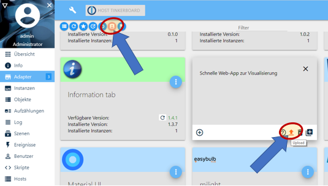

# IoBroker.iqontrol
<!-- [](https://weblate.iobroker.net/engage/adapters/?utm_source=widget) -->

**Тесты:**

| Linux/Mac/Windows: | Кроссбраузерная проверка: |
|---------------------------------------------------------------------------------------------------------------------------------------| --- |

****

## Адаптер iQontrol для ioBroker
Быстрое веб-приложение для визуализации.

    

&copy; от dslraser:


&copy; от muuulle:


&копия; от peks-64:


Работает в любом браузере.
Легко настраивается, хотя полностью настраиваемый и адаптивный.

> **Этот адаптер использует библиотеки Sentry для автоматического сообщения разработчикам об исключениях и ошибках кода.** Более подробную информацию и информацию о том, как отключить отчеты об ошибках, см. в [Документация по плагину Sentry](https://github.com/ioBroker/plugin-sentry#plugin-sentry)! Отчеты Sentry используются, начиная с js-controller 3.0.

## Кредиты
Этот адаптер был бы невозможен без огромной работы @o0Shojo0o (https://github.com/o0Shojo0o), который разработал предыдущие версии этого адаптера.

## Как сообщать о проблемах и запрашивать новые функции
В идеале, пожалуйста, используйте для этого GitHub issues, а лучший метод достигается путем установки адаптера в режим Debug log (Instances -> Expert mode -> Column Log level). Затем извлеките файл журнала с диска через подкаталог ioBroker 'log', **не** из Admin, что приведет к сокращению строк.

## Видеоурок (на немецком языке):
[](https://youtube.com/playlist?list=PL8epyNz8pGEv6-R8dnfXm-m5aBlZFKOBG)

## Добавить на главный экран
Вы можете сохранить его как веб-приложение на главном экране, и оно будет выглядеть и работать как нативное приложение: 

Это также работает на вашем ПК с Chrome:

* Откройте iQontrol в Chrome
* Нажмите на меню с тремя точками - Дополнительные инструменты - Создать ярлык
* После этого вы найдете iQontrol в меню «Пуск» в разделе приложений Chrome и даже сможете добавить его на панель задач.

## Вам нужно...
* Nodejs 10 или выше
* Веб-адаптер с одним экземпляром, работающим по тому же протоколу (http или https), что и административный адаптер, socket.IO установлен на «интегрированный» и «Принудительные веб-сокеты» отключены
* Если это конфликтует с другими адаптерами, просто добавьте еще один экземпляр с указанными выше настройками — iQontrol найдет наиболее подходящий экземпляр веб-адаптера и будет использовать его для связи.
* Для подключения через *iobroker.pro-Cloud* и административный, и веб-адаптер должны быть настроены на http (не https)

* Если у вас возникли какие-либо проблемы, ознакомьтесь с разделом [устранение неполадок](#устранение неполадок) в конце этого файла readme.

## Форум
Посетите ветку поддержки [форум iobroker](https://forum.iobroker.net/topic/52077).
Посетите ветку разработчика [форум iobroker](https://forum.iobroker.net/topic/22039).

## Вики
Взгляните на вики [вики](https://github.com/sbormann/ioBroker.iqontrol/wiki).

## Как использовать
**Не пугайтесь множества имеющихся у вас опций.** Большинство вещей работают сразу из коробки. Вы *можете*, но вам не обязательно использовать все возможности конфигурации, которые предлагает iQontrol! Просто начните так:

* Начните создавать представления.

Просмотры можно рассматривать как нечто вроде страницы.

* Затем создайте устройства на этих представлениях.

Устройства имеют роль, которая определяет функцию устройства, используемые значки и т. д.
В зависимости от этой роли вы можете связать несколько состояний с устройством. Они предоставят устройству его функциональность.
Если вы выберете «Связать с другим представлением» в качестве роли, вы сможете создавать ссылки на другие представления. Я предлагаю скин для ссылок на другие представления с тем же фоном, что и у связанного представления.
Вы также можете попробовать использовать функцию Auto-create-Function, чтобы выбрать существующее устройство из дерева объектов iobroker. Функция Auto-create пытается найти роль и сопоставить как можно больше состояний.

* После этого вы можете создать панель инструментов, которая будет отображаться в виде нижнего колонтитула.

Записи панели инструментов — это ссылки на представления.
Первая запись панели инструментов будет вашим «Домашним представлением», которое будет загружено при запуске.

* Чтобы придать всему необычный стиль, вы можете загрузить свои собственные изображения.

Вы можете использовать свои изображения в качестве фоновых изображений для представлений или для устройств.
Изображения в папке `/usericons` можно использовать в качестве значков для устройств.
Бесплатные встроенные демо-обои с www.pexels.com.

### Использовать автоматическое создание
* Вы найдете кнопку «Автоматическое создание представлений» на вкладке «Виды».
* Если у вас есть хорошо поддерживаемые перечисления ioBroker, такие как Rooms или Functions, вы можете использовать эту функцию для автоматического создания представлений с устройствами, перечисленными внутри этих перечислений.
* Помните, что из-за большого количества различных адаптеров и устройств внутри ioBroker-universe функция автоматического создания не может поддерживать все устройства на 100% правильно. Возможно, вам придется вручную переделать некоторые настройки, чтобы получить наилучшие результаты. Но функция автоматического создания предлагает вам хорошую отправную точку для создания собственной визуализации за считанные секунды.

## Параметры URL
* Фронтенд вызывается через `http[s]://<url или ip iobroker>:<порт веб-адаптера>/iqontrol/index.html`
* `<порт веб-адаптера>` обычно 8082
* Чтобы открыть указанный экземпляр, можно добавить `namespace=iqontrol.<instance-number>` в качестве параметра URL
* Чтобы открыть указанное представление, вы можете добавить `renderView=<viewID>` в качестве параметра URL.
* `<viewID>` необходимо отформатировать как `iqontrol.<номер-экземпляра>.Views.<имя-представления>`
* Примечание: регистр имеет значение!
* Чтобы открыть указанное представление как домашнюю страницу, вы можете добавить `home=<viewID>` как параметр URL. Это также изменит связанное представление первой записи панели инструментов!
* `<viewID>` необходимо отформатировать как `iqontrol.<номер-экземпляра>.Views.<имя-представления>`
* Примечание: регистр имеет значение!
* Чтобы открыть указанный диалог при загрузке страницы, можно добавить `openDialog=<deviceID>` в качестве параметра URL.
* `<deviceID>` необходимо отформатировать как `iqontrol.<instance-number>.Views.<view-name>.devices.<device-number>`, где `<device-number>` начинается с 0 (поэтому первое устройство в представлении имеет номер устройства 0)
* Примечание: регистр имеет значение!
* Чтобы установить или переопределить настройки возврата по истечении времени, используйте следующие параметры:
    * `returnAfterTimeTreshold=<time in seconds> ` для установки времени, после которого вызывается целевой вид. Используйте `0` для отключения функции возврата после времени.
* `returnAfterTimeDestiationView=<viewID>` для установки представления, которое вызывается после порогового значения. Если не указано, будет использоваться домашнее представление.
* Эти параметры полезны, если вы вызываете iQontrol с настенного планшета, который должен автоматически возвращаться на домашний экран после использования.
* Чтобы загрузить страницу без панели инструментов, вы можете добавить `noToolbar=true`
* Чтобы загрузить страницу без панели, можно добавить `noPanel=true`
* Чтобы загрузить страницу без панели инструментов и панели, без смахивания, без индикатора загрузки и с прозрачным экраном загрузки, вы можете добавить `isBackgroundView=true`
* Обычно iQontrol использует язык, установленный в ioBroker. Вы можете переопределить его, добавив `language=<xx>`
* `<xx>` может быть `de`, `en`, `es`, `fr`, `it`, `nl`, `pl`, `pt`, `ru` или `zh-cn`
* Если ваш экземпляр iQontrol защищен паролем с помощью парольной фразы (см. Параметры - Защита парольной фразы), вы можете отправить парольную фразу, добавив `passphrase=<MyPassphrase>'

**Пример:**

* `https://192.168.1.1:8082/iqontrol/index.html?namespace=iqontrol.1&home=iqontrol.1.Views.Living-Room`
* Обратите внимание на верхний и нижний регистр.

## Шрифты
* Вы можете загрузить собственные файлы шрифтов на вкладке «Изображения/Виджеты» в папку `/userfonts`
* На вкладке «Параметры» есть несколько мест, где можно выбрать эти шрифты.
* Это зависит от настроек MIME вашего сервера, если шрифт правильно отображается в браузере - для меня лучше всего подходят .ttf и .woff (проверено на raspi 4b)
* Эти настройки mime должны работать:
* .otf: `application/x-font-opentype`
* .ttf: `application/x-font-ttf` или `application/x-font-truetype`
* .woff: `application/font-woff`
* .woff2: `application/font-woff2`
* .eot: `application/vnd.ms-fontobject`
* Вы можете конвертировать шрифты в другие форматы на `fontsquirrel.com` в разделе генератор
* Помните — веб-шрифты всегда немного каверзны, и не каждый шрифт будет работать на каждом сервере и в каждом браузере.

## Иконки и фоновые изображения
* Вы можете использовать встроенные изображения или изображения, загруженные на вкладке «Изображения» или по любой бесплатной ссылке, которая вам нравится.
* Вы также можете использовать переменную внутри image-url. Это может быть полезно, например, для прогнозов погоды. Используйте этот шаблон:
* `path/to/firstloaded.png|anotherpath/to/{iobrokerstate|fallback}.png`
* Пример: `./../iqontrol.meta/userimages/demo/bottle.jpg|./../iqontrol.meta/userimages/demo/{javascript.0.myimage|whitestone}.jpg`
* Это загружает `./../iqontrol.meta/userimages/demo/bottle.jpg` при открытии представления
* Как только состояние `javascript.0.myimage` будет извлечено с сервера, изображение будет заменено на `./../iqontrol.meta/userimages/demo/XXX.jpg`, где `XXX` — это значение `javascript.0.myimage`
* Если `javascript.0.myimage` не имеет значения, будет использован резервный `whitestone` (использование резервного варианта необязательно)

### Индикаторы выполнения
* Возможно использовать SVG-определения в сочетании с переменными вместо файлов изображений для отображения индикаторов выполнения.
* В комплект входит ряд встроенных шаблонов, но вы также можете создавать свои собственные SVG-файлы.

 

* Более подробную информацию см. в [Wiki](https://github.com/sbormann/ioBroker.iqontrol/wiki/Progress-Bars)

### Диаграммы
* Вы можете добавить ''FLOT Chart-Widget'' как BACKGROUND_URL любого устройства, что автоматически отобразит основное состояние в виде диаграммы на заднем плане плитки устройства.
* Вам необходимо убедиться, что состояние регистрируется и записывается одним из адаптеров истории ioBroker


## Имена устройств
* Так же, как переменные в image-urls, вы можете использовать переменные в device-names. Синтаксис почти такой же:
* `Текст во время загрузки|Текст после загрузки {iobrokerstate|fallback}`
* Кроме того, можно заключить состояние iobroker в квадратные скобки, тогда будет использоваться простое значение без единицы измерения: `Текст во время загрузки|Текст после загрузки {[iobrokerstate]|fallback}`
* Пример: `Погода загружается|Погода: {javascript.0.weather|Данные о погоде не найдены}`
* При открытии представления отображается сообщение «Погода загружается»
* Как только состояние `javascript.0.weather` будет извлечено с сервера, текст будет заменен на `Weather: XXX`, где `XXX` — это значение `javascript.0.weather`
* Если `javascript.0.weather` не имеет значения, будет использован резервный вариант `Данные о погоде не найдены` (использование резервного варианта необязательно)

## Всплывающие сообщения
* Каждый экземпляр создает состояние `iqontrol.x.Popup.Message`
* При передаче значений в это состояние всплывающее сообщение (или уведомление) будет отображаться на всех **в данный момент** открытых интерфейсах iQontrol
* Дополнительно каждый экземпляр создает состояние `iqontrol.x.Popup.PersistentMessage`
* При передаче значений этого состояния всплывающее сообщение будет сохранено в массиве PERSISTENT_MESSAGES_PENDING.
* Постоянные сообщения будут отображаться не только на всех открытых в данный момент интерфейсах iQontrol, но и на всех **будущих** открытых экземплярах до тех пор, пока они не будут подтверждены (щелчком или по продолжительности) или не истечет срок их действия.
* `PersistentExpires` определяет, когда истекает срок действия постоянного сообщения как UNIX-Timestamp (секунды с 1970-01-01 00:00:00). Значения ниже 31536000 интерпретируются как длительность в секундах с текущего момента (31536000 секунд = 1 год).
* `PersistentUndismissible` *boolean* - Если установлено значение true, постоянное сообщение будет сохранено даже после его закрытия. Если вы откроете новый экземпляр iQontrol, оно будет отображено снова. В противном случае постоянные сообщения удаляются после закрытия всплывающего окна (даже по щелчку или по истечении времени).
* `PersistentId` — необязательное произвольное выражение, которое можно использовать для идентификации сообщения.
* Идентификатор может быть использован для удаления соответствующих всплывающих сообщений путем отправки идентификатора в `PERSISTENT_MESSAGES_DELETE_ID`. Отправка `null` в эту точку данных удаляет все ожидающие сообщения.
* Идентификатор также может быть использован для отображения соответствующих всплывающих сообщений на всех открытых в данный момент экземплярах iQontrol снова путем отправки идентификатора в `PERSISTENT_MESSAGES_SHOW_ID`. Отправка `null` в эту точку данных показывает все ожидающие сообщения.
* **Примечание**: Вы можете отправить сообщение только в одну из двух точек данных «Message» или «PersistentMessage», но не в обе.
* Вы можете использовать html-теги для форматирования текста сообщения
* Существуют некоторые дополнительные состояния для дальнейшей настройки отображаемого всплывающего окна (их необходимо установить до установки точки данных сообщения):
* `Длительность`: это время в мс, в течение которого отображается сообщение; если установлено значение 0, сообщение необходимо подтвердить.
* `ClickedValue` и `ClickedDestinationState`: если пользователь нажимает на всплывающее окно, значение из `ClickedValue` будет отправлено в `iqontrol.x.Popup.POPUP_CLICKED` и, если указано, в дополнение к точке данных в `ClickedDestinationState`
* Если значение не указано, будет использовано `true`
* `ClickKeepsOpen` *boolean* - если true, то всплывающее окно можно закрыть только нажатием на кнопку, нажатие на само всплывающее окно не закроет его. Поэтому убедитесь, что вы добавили кнопки в свое всплывающее сообщение, как описано ниже.
* `ButtonNames`: Здесь вы можете указать список кнопок, разделенных запятыми, которые будут отображаться в нижней части всплывающего окна (например, «ОК,Отмена»)
* `ButtonValues` и `ButtonDestinationStates`: это списки значений, разделенные запятыми, которые будут отправлены в `iqontrol.x.Popup.BUTTON_CLICKED` и, если указано, в дополнение к точке данных в `ButtonDestinationStates`, если пользователь нажмет соответствующую кнопку.
* Вместо точки данных вы можете использовать команды `COMMAND:renderView` и `COMMAND:openDialog` в качестве ButtonDestinationState для визуализации представления или открытия диалогового окна.
* ButtonValue затем указывает представление, соответственно, диалоговое окно и должно быть в формате `iqontrol.<номер-экземпляра>.Views.<имя-представления>` или `iqontrol.<номер-экземпляра>.Views.<имя-представления>.devices.<номер-устройства>`, где `<номер-устройства>` начинается с 0 (поэтому первое устройство в представлении имеет номер устройства 0)
* Если вы используете только одно значение (вместо списка, разделенного запятыми), это значение будет использоваться для всех кнопок.
* Если оставить `ButtonValues` пустым, будет использовано имя кнопки
* Если вы используете только одно состояние назначения (вместо списка, разделенного запятыми), это состояние будет использоваться для всех кнопок.
* `ButtonCloses`: это список логических значений, разделенных запятыми (`true`/`false`), которые указывают, следует ли закрывать всплывающее окно при нажатии соответствующей кнопки.
* `ButtonClears`: это список логических значений, разделенных запятыми (`true`/`false`), которые указывают, следует ли очищать настройки всплывающего окна (= устанавливать все состояния всплывающих окон пустыми) при нажатии соответствующей кнопки.
* В качестве альтернативы вы можете задать эти значения с помощью команды sendTo с параметрами `PopupMessage`, `PopupDuration`, `PopupClickedValue` и т. д.
* Пример: `sendTo("iqontrol", "send", {PopupMessage: 'Это мое сообщение', PopupDuration: 2500, PopupClickedValue: 'messageConfirmed'});`
* Вы также можете использовать blockly для отправки сообщений в iQontrol

 

## Виджеты
* Каждая плитка имеет точку данных BACKGROUND_URL и BACKGROUND_HTML.
* Здесь вы можете определить ссылку (через BACKGROUND_URL) на веб-сайт или разместить прямой HTML-код (через BACKGROUND_HTML), который будет отображаться в качестве фона плитки.
* Это дает вам возможность размещать (интерактивный) контент внутри плитки (например, часы, FLOT-диаграммы, таблицы, прогнозы погоды и т. д.)
* По умолчанию события мыши будут направлены на этот контент (таким образом, вы больше не сможете щелкнуть саму плитку), но вы можете отключить это с помощью параметра «Направлять события мыши на плитку, а не на контент BACKGROUND_VIEW/URL/HTML»
* iQontrol предлагает роль устройства "Виджет", которая имеет некоторые предопределенные параметры, которые будут в основном использоваться при отображении веб-сайта в качестве виджета. Но вы можете достичь того же результата с любой другой ролью, изменив параметры устройства должным образом.


<details><summary>Разработка виджета (только для экспертов): (<ins> нажмите, чтобы открыть</ins> )</summary>

### JQuery
* Технически содержимое BACKGROUND_VIEW/URL/HTML помещается внутрь HTML-элемента, называемого iframe, который представляет собой веб-сайт внутри веб-сайта.
* Чтобы использовать jQuery, вы можете перенести его из iQontrol в iFrame с помощью следующего кода:

``window.$=window.jQuery=parent.jQuery.extend(function(s){return parent.jQuery(s,document)},parent.jQuery);``

* Пример:

	```html
	<!doctype html>
	<html>
	<head>
		<meta http-equiv="Content-Type" content="text/html; charset=UTF-8"/>
		<meta name="widget-description" content="This is a demo widget-preset. It has no useful funcion. (C) by Sebastian Bormann"/>
		<meta name="widget-options" content="{'noZoomOnHover': 'true', 'hideDeviceName': 'true', 'sizeInactive': 'xwideIfInactive highIfInactive', 'iconNoPointerEventsInactive': 'true', 'hideDeviceNameIfInactive': 'true', 'hideStateIfInactive': 'true', 'sizeActive': 'fullWidthIfActive fullHeightIfActive', 'bigIconActive': 'true', 'iconNoPointerEventsActive': 'true', 'hideDeviceNameIfActive': 'true', 'hideStateIfActive': 'true', 'sizeEnlarged': 'fullWidthIfEnlarged fullHeightIfEnlarged', 'bigIconEnlarged': 'true', 'iconNoPointerEventsEnlarged': 'false', 'noOverlayEnlarged': 'true', 'hideDeviceNameIfEnlarged': 'true', 'hideStateIfEnlarged': 'true', 'popupAllowPostMessage': 'true', 'backgroundURLAllowPostMessage': 'true', 'backgroundURLNoPointerEvents': 'false'}"/>
		<title>iQontrol Widget Test</title>
	</head>
	<body>
		<div id="testDiv">Loading...</div>
		<script type="text/javascript">
			console.log("JQUERY-TEST");
			window.$=window.jQuery=parent.jQuery.extend(function(s){return parent.jQuery(s,document)},parent.jQuery);
			$(document).ready(function(){
				$('#testDiv').html("<h1>Hello World</h1)");
				console.log("jQuery works!!");
			});
		</script>
	</body>
	</html>
	```

### PostMessage-Коммуникация
* Включив опцию «Разрешить postMessage-Communication для BACKGROUND_VIEW/URL/HTML», вы можете включить postMessage-Communication между виджетом в его iframe и самим iQontrol.
* Для отправки команд в iQontrol вы можете использовать следующую команду JavaScript: `window.parent.postMessage(message, "*");`
* `message` — это объект JavaScript в формате `{ command: command, stateId: stateId, value: value }`
* Поддерживаются следующие команды-сообщения:
* `{ команда: "setWidgetState", stateId: <widgetStateId>, значение: <value> }`
* Это установит состояние ioBroker `iqontrol.<instance>.Widgets.<widgetStateId>` в значение `<value>` (`<value>` может быть строкой, числом или логическим значением или объектом, например `{ val: <value>, ack: true|false }`)
* `{ команда: "getWidgetState", stateId: <widgetStateId> }`
* Это заставит iQontrol отправить значение состояния ioBroker `iqontrol.<instance>.Widgets.<widgetStateId>` (см. ниже, как получить ответное сообщение)
* `{ команда: "getWidgetStateSubscribed", stateId: <widgetStateId> }`
* Это заставит iQontrol отправлять значение состояния ioBroker `iqontrol.<instance>.Widgets.<widgetStateId>` сейчас и каждый раз, когда его значение изменяется (см. ниже, как получать ответные сообщения)
* `{ команда: "setWidgetDeviceState", stateId: <widgetDeviceState>, значение: <value> }`
* Это установит точку данных ioBroker, назначенную устройству STATE `<widgetDeviceState>` (например, точку данных, назначенную LEVEL), на значение `<value>` (`<value>` может быть строкой, числом или логическим значением или объектом, например `{ val: <value>, ack: true|false }`)
* `{ команда: "getWidgetDeviceState", stateId: <widgetDeviceState> }`
* Это заставит iQontrol отправить значение точки данных ioBroker, которая назначена СОСТОЯНИЮ устройства `<widgetDeviceState>` (например, точка данных, которая назначена УРОВНЮ; см. ниже, как получить ответное сообщение)
* `{ команда: "getWidgetDeviceStateSubscribed", stateId: <widgetDeviceState> }`
* Это заставит iQontrol отправлять значение точки данных ioBroker, которая назначена СОСТОЯНИЮ устройства `<widgetDeviceState>` (например, точка данных, которая назначена УРОВНЮ) сейчас и каждый раз, когда ее значение изменяется (см. ниже, как получить ответное сообщение)
* `{ команда: "setState", stateId: <stateId>, значение: <value> }`
* Это установит состояние ioBroker `<stateId>` в значение `<value>` (`<value>` может быть строкой, числом или логическим значением или объектом, например `{ val: <value>, ack: true|false }`)
* `{ command: "getState", stateId: <stateId> }`
* Это заставит iQontrol отправить значение состояния ioBroker `<stateId>` (см. ниже, как получить ответное сообщение)
* `{ command: "getStateSubscribed", stateId: <stateId> }`
* Это заставит iQontrol отправлять значение состояния ioBroker `<stateId>` сейчас и каждый раз, когда его значение изменяется (см. ниже, как получать ответные сообщения)
* `{ команда: "getOptions"}`
* Это заставит iQontrol отправлять пользовательские параметры, которые пользователь настроил как объект
* `{ команда: "renderView", значение: <viewID> }`
* Это даст указание iQontrol отобразить представление, где `<viewID>` необходимо отформатировать как `iqontrol.<instance-number>.Views.<view-name>` (с учетом регистра)
* `{ команда: "openDialog", значение: <deviceID> }`
* Это даст указание iQontrol открыть диалоговое окно, в котором `<deviceID>` необходимо отформатировать следующим образом: `iqontrol.<instance-number>.Views.<view-name>.devices.<device-number>`, где `<device-number>` начинается с 0 (поэтому первое устройство в представлении имеет номер устройства 0)
* Чтобы получать сообщения от iQontrol, вам необходимо зарегистрировать прослушиватель событий для события "message" с помощью команды javascript `window.addEventListener("message", receivePostMessage, false);`
* Функция `receivePostMessage` получает объект `event`
* `event.data` содержит сообщение от iqontrol, которое будет представлять собой объект вроде:
* event.data = `{ command: "getState", stateId: <stateId>, value: <stateObject> }` - это будет ответом на команду `getState` или `getStateSubscribed` и даст вам фактический `<value>`-объект состояния ioBroker`<stateId>`
* `<stateObject>` сам по себе является объектом, подобным

			```
			event.data.value = {
				val: <value (rounded)>,
				unit: "<unit>",
				valFull: <value (not rounded, no javascript-injection prevention)>,
				plainText: "<clear text of val, for example taken from valuelist>",
				min: <minimum>,
				max: <maximum>,
				step: <step-width>,
				valuelist: {<object with possible values and corresponding clear text>},
				targetValues: {<target value list>},
				ack: <true|false>,
				readonly: <true|false>,
				custom: {<object with custom settings>},
				id: <id of the iobroker datapoint>,
				from: "<source of state>",
				lc: <timestamp of last change>,
				ts: <timestamp of last actualization>,
				q: <quality of signal>,
				role: "<role of state>",
				type: "<string|number|boolean>",
				name: "<name of datapoint>",
				desc: "<description of datapoint>",
				Date: <Date-object (only present, if value is regognized as a valid time or period)>
			}
			```

* Чтобы указать iQontrol на необходимость создания widgetState в `iqontrol.<instance>.Widgets`, можно использовать метатег внутри заголовка сайта-виджета:
* Синтаксис:

```
<meta name="widget-datapoint" content="WidgetName.StateName" data-type="string" data-role="text" />
```

* Вы можете дополнительно настроить точку данных, используя атрибуты data-type (который может быть установлен как строка, число или логическое значение), data-role, data-name, data-min, data-max, data-def и data-unit.
* Вы также можете использовать URL-параметр (см. ниже) в качестве переменной, например, для создания отдельных экземпляров виджетов с собственными точками данных.
* Синтаксис тогда следующий:

		  ```
          <meta name="widget-datapoint" content="WidgetName.StateName|WidgetName.{instance}.StateName" data-type="string" data-role="text" />
          ```

* Если задана переменная `instance`, то часть после `|` будет использоваться как widgetState-Name, а `{instance}` будет заменено значением `instance`
* Если переменная `instance` не задана, то часть перед `|` будет использоваться как `wigdetState`-Name
* Соответствующая точка данных создается только тогда, если виджет-сайт добавлен на устройство как URL или BACKGROUND_URL
* Та же концепция может быть использована для URL/HTML-State, который используется для отображения веб-сайта в диалоговом окне устройства.
* Чтобы создать значок для вашего виджета, поместите файл .png с тем же именем, что и у виджета, в каталог виджетов.
* Ниже приведен пример виджет-сайта:

<details><summary>Показать пример виджета-сайта, который будет отображаться как виджет с postMessage-communication: (<ins> нажмите, чтобы открыть</ins> )</summary>

* Вы можете использовать следующий HTML-код и скопировать его в BACKGROUND_HTML-State виджета (который затем необходимо настроить как «Constant»)
* В качестве альтернативы вы можете загрузить этот код как html-файл в подкаталог `/userwidgets` и сослаться на него в BACKGROUND_URL-State (который затем также необходимо настроить как «Constant»)
* Активируйте опцию «Разрешить postMessage-Communication для BACKGROUND_VIEW/URL/HTML»
* Будет продемонстрировано, как осуществляется двусторонняя связь между веб-сайтом и iQontrol.

```html
<!doctype html>
<html>
<head>
	<meta http-equiv="Content-Type" content="text/html; charset=UTF-8"/>
	<meta name="widget-datapoint" content="postMessageTest.test" data-type="string" data-role="text" />
	<meta name="widget-description" content="This is a test widget. To get the WidgetDeviceState-Functions working, please set a valid iobroker-datapoint for STATE. (C) by Sebastian Bormann"/>
	<meta name="widget-urlparameters" content="title/postMessageTest/Please enter a title">
	<meta name="widget-options" content="{'noZoomOnHover': 'true', 'hideDeviceName': 'true', 'sizeInactive': 'xwideIfInactive highIfInactive', 'iconNoPointerEventsInactive': 'true', 'hideDeviceNameIfInactive': 'true', 'hideStateIfInactive': 'true', 'sizeActive': 'xwideIfActive highIfActive', 'bigIconActive': 'true', 'iconNoPointerEventsActive': 'true', 'hideDeviceNameIfActive': 'true', 'hideStateIfActive': 'true', 'sizeEnlarged': 'fullWidthIfEnlarged fullHeightIfEnlarged', 'bigIconEnlarged': 'true', 'iconNoPointerEventsEnlarged': 'false', 'noOverlayEnlarged': 'true', 'hideDeviceNameIfEnlarged': 'true', 'hideStateIfEnlarged': 'true', 'popupAllowPostMessage': 'true', 'backgroundURLAllowPostMessage': 'true', 'backgroundURLNoPointerEvents': 'false'}"/>
 	<title>iQontrol postMessageTest</title>
</head>
<body>
	<br><br>
	<h3><span id="title">postMessageTest</span><h3>
	<button onclick="getWidgetState('postMessageTest.test')">getWidgetState postMessageTest.test</button><br>
	<button onclick="getWidgetStateSubscribed('postMessageTest.test')">getWidgetStateSubscribed postMessageTest.test</button><br>
	<button onclick="setWidgetState('postMessageTest.test', 'Hello world')">setWidgetState postMessageTest.test to 'Hello world'</button><br>
  	<br>
	<button onclick="getWidgetDeviceState('STATE')">getWidgetDeviceState STATE</button><br>
	<button onclick="getWidgetDeviceStateSubscribed('STATE')">getWidgetDeviceStateSubscribed STATE</button><br>
	<button onclick="setWidgetDeviceState('STATE', 'Hello world')">setWidgetDeviceState STATE to 'Hello world'</button><br>
  	<br>
	<button onclick="getState('system.adapter.admin.0.cpu')">getState system.adapter.admin.0.cpu</button><br>
	<button onclick="getStateSubscribed('system.adapter.admin.0.uptime')">getStateSubscribed system.adapter.admin.0.uptime</button><br>
	<button onclick="setState('iqontrol.0.Popup.Message', 'Hey, this is a test Message')">setState popup message</button><br>
  	<br>
	<button onclick="renderView('iqontrol.0.Views.Home')">renderView 'Home'</button><br>
	<button onclick="openDialog('iqontrol.0.Views.Home.devices.0')">openDialog 1st device on 'Home'</button><br>
	<br><hr>
	message sent: <span id="messageSent">-</span><br>
	<br><hr>
	message received: <span id="messageReceived">-</span><br>
	<br><hr>
	this means: <span id="thisMeans">-</span><br>
	<br><hr>
    <script type="text/javascript">
		var countSend = 0;
		var countReceived = 0;

		//Set title from UrlParameter
		document.getElementById('title').innerHTML = getUrlParameter('title') || "No Title set";

		//getWidgetState
		function getWidgetState(stateId){
			sendPostMessage("getWidgetState", stateId);
		}

		//getWidgetStateSubscribed (this means, everytime the state changes, an update will be received)
		function getWidgetStateSubscribed(stateId){
			sendPostMessage("getWidgetStateSubscribed", stateId);
		}

		//setWidgetState
		function setWidgetState(stateId, value){
			sendPostMessage("setWidgetState", stateId, value);
		}


		//getWidgetDeviceState
		function getWidgetDeviceState(stateId){
			sendPostMessage("getWidgetDeviceState", stateId);
		}

		//getWidgetDeviceStateSubscribed (this means, everytime the state changes, an update will be received)
		function getWidgetDeviceStateSubscribed(stateId){
			sendPostMessage("getWidgetDeviceStateSubscribed", stateId);
		}

		//setWidgetDeviceState
		function setWidgetDeviceState(stateId, value){
			sendPostMessage("setWidgetDeviceState", stateId, value);
		}


		//getState
		function getState(stateId){
			sendPostMessage("getState", stateId);
		}

		//getStateSubscribed (this means, everytime the state changes, an update will be received)
		function getStateSubscribed(stateId){
			sendPostMessage("getStateSubscribed", stateId);
		}

		//setState
		function setState(stateId, value){
			sendPostMessage("setState", stateId, value);
		}


		//renderView
		function renderView(viewId){
			sendPostMessage("renderView", null, viewId);
		}

		//openDialog
		function openDialog(deviceId){
			sendPostMessage("openDialog", null, deviceId);
		}

		// +++++ Default Functions +++++
		//getUrlParameter
		function getUrlParameter(name) {
			name = name.replace(/[\[]/, '\\[').replace(/[\]]/, '\\]');
			var regex = new RegExp('[\\?&]' + name + '=([^&#]*)');
			var results = regex.exec(location.search);
			return results === null ? null : decodeURIComponent(results[1].replace(/\+/g, ' '));
		};

		//send postMessages
		function sendPostMessage(command, stateId, value){
			countSend++;
			message = { command: command, stateId: stateId, value: value };
			document.getElementById('messageSent').innerHTML = countSend + " - " + JSON.stringify(message);
			window.parent.postMessage(message, "*");
		}

		//receive postMessages
		window.addEventListener("message", receivePostMessage, false);
		function receivePostMessage(event) { //event = {data: message data, origin: URL of origin, source: id of sending element}
			countReceived++;
			if(event.data) document.getElementById('messageReceived').innerHTML = countReceived + " - " + JSON.stringify(event.data);
			if(event.data && event.data.command) switch(event.data.command){
				case "getState":
				if(event.data.stateId && event.data.value && event.data.value.val){
					document.getElementById('thisMeans').innerHTML = "Got State " + event.data.stateId + " with value " + event.data.value.val;
				}
				break;
			}
		}
	</script>
</body>
</html>
```

</подробности>

### Дальнейшая настройка виджетов
* Существуют дополнительные метатеги, которые вы можете использовать внутри заголовка вашего виджет-сайта для настройки поведения виджета:
* `описание-виджета`
* синтаксис:

		  ```  
          <meta name="widget-description" content="Please see www.mywebsite.com for further informations. (C) by me"/>
          ```

* Содержимое будет отображаться при выборе виджета как URL или BACKGROUND_URL или при автоматическом создании виджета
* `widget-urlparameters`
* синтаксис:

		  ```
          <meta name="widget-urlparameters" content="parameter/default value/description/type;parameter2/default value2/description2/type2"/>
          ```

* Пользователю будут предложено ввести эти параметры при выборе виджета как URL или BACKGROUND_URL или при автоматическом создании виджета
* `type` необязателен и может быть `text` (это значение по умолчанию), `number`, `checkbox`, `color`, `select`, `multipleSelect`, `combobox`, `historyInstance`, `datapoint`, `listJsonDatapoint`, `icon`, `fontFamily`, `fontSize`, `fontStyle`, `fontWeight`, `language`, `section`, `divider`, `info`, `link` или `hidden`
* Если тип - `select`, `multipleSelect` или `combobox`, то вам необходимо указать возможные варианты, добавив `/<selectOptions>`, где `<selectOptions>` - это строка формата `<value1>,<caption1>/<value2>,<caption2>/...` (combobox - это выпадающий список с возможностью ввода свободного текста)
* Если тип - `number`, то можно указать min, max и step-width, добавив `/<numberOptions>`, где `<numberOptions>` - это строка в формате `<min>,<max>,<step>`
* Типы `section`, `divider`, `info` и `link` не имеют дополнительных функций, они просто отображают информацию пользователю. Для `link` значение должно быть URL, но все слеши должны быть заменены на обратные слеши.
* Тип `hidden` будет передан виджету, но диалоговое окно конфигурации не отображается
* Все эти параметры будут переданы на сайт-виджет через строку URL-параметров (например, `widget.html?parameter=value&parameter2=value2`)
* Вы можете использовать эти настройки внутри вашего виджет-сайта, запросив параметры URL с помощью такой функции:

			```
			function getUrlParameter(name) {
				name = name.replace(/[\[]/, '\\[').replace(/[\]]/, '\\]');
				var regex = new RegExp('[\\?&]' + name + '=([^&#]*)');
				var results = regex.exec(location.search);
				return results === null ? null : decodeURIComponent(results[1].replace(/\+/g, ' '));
			};
			```

* Если вы использовали тип `icon` для вашего параметра URL, то вы получите либо путь относительно каталога iqontrol, либо абсолютный путь к изображению. Чтобы создать действительную ссылку на ваше изображение, вы можете использовать этот код:

			    ```
				var iconOn = getUrlParameter('iconOn') || './images/icons/switch_on.png';
				if(iconOn.indexOf('http') != 0) iconOn = '/iqontrol/' + iconOn;
				```

* `опции-виджета`
* синтаксис:

		  ```
          <meta name="widget-options" content="{'noZoomOnHover': 'true', 'hideDeviceName': 'true'}"/>
          ```

* Возможные параметры, которые можно настроить с помощью этого метатега, см. в раскрывающемся разделе ниже.

* `widget-replaceurl`
* синтаксис:

```
<meta name="widget-replaceurl" content="<url>" data-absolute="<true|false>"/>

* Это изменяет используемый URL/BACKGROUND_URL для этого виджета (таким образом вы можете определить предустановки виджета, которые используются для предоставления пользователю специальных или упрощенных конфигураций). Но при вызове виджета iQontrol использует указанный `<url>` вместо исходного URL.
* По умолчанию заменяется только имя файла (с расширением). При установке `data-absolute=`true`` заменяется весь URL.

<details><summary>Показать возможные параметры, которые можно настроить с помощью метатега &#39;widget-options&#39;: (<ins> нажмите, чтобы открыть</ins> )</summary>

* Иконки:
* `icon_on` (Значок включен):
		* По умолчанию: ""
* `icon_off` (Иконка выключена):
		* По умолчанию: ""
* Параметры, специфичные для устройства:
* `showState` (Показать состояние) - действует только для роли Button и Program:
* Возможные значения: `true`|`false`
* По умолчанию: `false`
* `showPowerAsState: ` (Показать POWER как состояние) - действительно только для ролей Switch, Light и Fan:
* Возможные значения: `true`|`false`
* По умолчанию: `false`
* `buttonCaption` (Подпись для кнопки) - действительно только для роли Button:
		* По умолчанию: ""
* `returnToOffSetValueAfter` (Вернуться к «OFF_SET_VALUE» через [мс]) — действительно только для роли Button:
* Возможные значения: число от 10 до 60000
		* По умолчанию: ""
* `alwaysSendTrue` (Всегда отправлять «true» (не переключать)) - действует только для роли Сцена:
* Возможные значения: `true`|`false`
* По умолчанию: `false`
* `closeDialogAfterExecution` (Закрыть диалоговое окно после выполнения) - действует только для роли Button, Program и Scene:
* Возможные значения: `true`|`false`
* По умолчанию: `false`
* `invertCt` (инвертировать CT (использовать Кельвин вместо Майреда)) - действует только для роли Свет:
* Возможные значения: `true`|`false`
* По умолчанию: `false`
* `alternativeColorspace` (цветовое пространство для ALTERNATIVE_COLORSPACE_VALUE") - действительно только для роли Light:
* Возможные значения: ""|"RGB"|"#RGB"|"RGBW"|"#RGBW"|"RGBWWCW"|"#RGBWWCW"|"RGBCWWW"|"#RGBCWWW"|"RGB_HUEONLY"|"#RGB_HUEONLY"|"HUE_MILIGHT"|"HHSSBB_TUYA"
		* По умолчанию: ""
* `linkOverlayActiveColorToHue` (использовать цвет лампы как OVERLAY_ACTIVE_COLOR) - действительно только для роли Light:
* Возможные значения: `true`|`false`
* По умолчанию: `false`
* `linkGlowActiveColorToHue` (использовать цвет лампы как GLOW_ACTIVE_COLOR) - действует только для роли Light:
* Возможные значения: `true`|`false`
* По умолчанию: `false`
* `controlModeDisabledValue` (значение CONTROL_MODE для «отключено») — действительно только для ролей Термостат, Домашний термостат и Домашний IP-термостат:
		* По умолчанию: ""
* `valveStatesSectionType` (Внешний вид VALVE_STATES) - действительно только для ролей Термостат, Домашний термостат и Домашний IP-термостат:
* Возможные значения: `true`|`false` `none`|`none noCaption`|`collapsible`|`collapsible open`
* По умолчанию: "складной"
* `stateClosedValue` (Значение СОСТОЯНИЯ для «закрыто») — действительно только для ролей Окно и Дверь с Замком:
		* По умолчанию: ""
* `stateOpenedValue` (Значение СОСТОЯНИЯ для «открыто») — действительно только для роли Window:
		* По умолчанию: ""
* `stateTiltedValue` (Значение СОСТОЯНИЯ для 'tilted') - действительно только для роли Window:
		* По умолчанию: ""
* `lockStateLockedValue` (Значение LOCK_STATE для «закрыто») — действительно только для роли Дверь с замком:
		* По умолчанию: ""
* `lockOpenValue` (Значение LOCK_OPEN для «открытой двери») — действительно только для роли Дверь с замком:
		* По умолчанию: ""
* `invertActuatorLevel` (Инвертировать УРОВЕНЬ (0 = открыто)) - действует только для роли Blind:
* Возможные значения: `true`|`false`
* По умолчанию: `false`
* `directionOpeningValue` (Значение НАПРАВЛЕНИЯ для «открытия») — действительно только для роли Окно:
* По умолчанию: "1"
* `directionClosingValue` (Значение НАПРАВЛЕНИЯ для «закрытия») — действительно только для роли Window:
* По умолчанию: "2"
* `directionUncertainValue` (Значение НАПРАВЛЕНИЯ для 'uncertain') - действительно только для роли Window:
* По умолчанию: "3"
* `favoritePositionCaption` (Подпись для FAVORITE_POSITION) - действительно только для роли Window:
* По умолчанию: «Любимая позиция»
* `stopCaption` (Подпись для STOP) - действительно только для роли Window:
* По умолчанию: «Стоп»
* `upCaption` (Подпись для UP) - действительно только для роли Window:
* По умолчанию: "Вниз"
* `downCaption` (Заголовок для DOWN) - действительно только для роли Window:
* По умолчанию: "Вниз"
* `noConfirmationForTogglingViaIcon` (Не запрашивать подтверждение при переключении с помощью значка) - действует только для роли Garage Door:
* По умолчанию: "ложь"
* Возможные значения: `true`|`false`
* `controlModeDisarmedValue` (Значение CONTROL_MODE для «disarmed») — действительно только для роли Alarm:
* По умолчанию: "0"
* `showStateAndLevelSeparatelyInTile` (показывать СОСТОЯНИЕ и УРОВЕНЬ отдельно на плитке) - действительно только для значения роли:
* Возможные значения: ""|"devidedByComma"|"devidedByComma preceedCaptions"|"devidedBySemitolon"|"devidedBySemitolon preceedCaptions"|"devidedByHyphen"|"devidedByHyphen preceedCaptions"
		* По умолчанию: ""
* `timeCaption` (Подпись для TIME) - действительно только для роли DateAndTime:
		* По умолчанию: ""
* `timeFormat` (Формат ВРЕМЕНИ (как он хранится в точке данных, см. файл readme)) - действителен только для роли DateAndTime:
* По умолчанию: "x"
* `timeDisplayFormat` (Формат отображения ВРЕМЕНИ (как оно должно отображаться, см. файл readme)) - действительно только для роли DateAndTime:
* По умолчанию: "dddd, ДД.ММ.ГГГГ ЧЧ:мм:сс"
* `timeDisplayDontShowDistance` (Показать расстояние) - действует только для роли DateAndTime:
* Возможные значения: ""|`false`|`true`
* По умолчанию: "" (это означает использование пользовательских настроек точек данных)
* `dateAndTimeTileActiveConditions` (Плитка активна, когда все выбранные элементы истинны) - действительно только для роли DateAndTime:
* Возможные значения (массив): "activeIfStateActive", "activeIfTimeNotZero", "activeIfTimeInFuture", "activeIfTimeInPast"
* По умолчанию: "activeIfStateActive,activeIfTimeInFuture"
* `dateAndTimeTileActiveWhenRinging` (Плитка всегда активна, когда активен RINGING) - действительно только для роли DateAndTime:
* По умолчанию: правда
* `dateAndTimeShowInState` (Показать в состоянии) - действительно только для роли DateAndTime:
* Возможные значения (массив): "showStateIfInactive", "showStateIfActive", "showSubjectIfActive", "showSubjectIfInactive", "showTimeIfInactiveAndInPast", "showTimeIfInactiveAndInFuture", "showTimeIfActiveAndInPast", "showTimeIfActiveAndInFuture", "showTimeDistanceIfInactiveAndInPast", "showTimeDistanceIfInactiveAndInFuture", "showTimeDistanceIfActiveAndInPast", "showTimeDistanceIfInactiveAndInFuture"
* По умолчанию: "showStateIfInactive,showSubjectIfActive,showTimeDistanceIfActiveAndInFuture"
* `coverImageReloadDelay` (Задержка перезагрузки изображения обложки [мс]) - действует только для роли Media:
* Возможные значения: число от 0 до 5000
		* По умолчанию: ""
* `coverImageNoReloadOnTitleChange: ` (Нет принудительной перезагрузки изображения обложки при изменении НАЗВАНИЯ) - действует только для роли Media:
* Возможные значения: `true`|`false`
* По умолчанию: `false`
* `statePlayValue` (Значение STATE для 'play') - действительно только для роли Media:
* По умолчанию: "воспроизведение"
* `statePauseValue` (Значение STATE для 'pause') - действительно только для роли Media:
* По умолчанию: "пауза"
* `stateStopValue` (Значение STATE для 'stop') - действительно только для роли Media:
* По умолчанию: "стоп"
* `useStateValuesForPlayPauseStop` (отправлять эти значения (вместо true) при нажатии на кнопки ВОСПРОИЗВЕДЕНИЕ, ПАУЗА и ОСТАНОВКА) - действительно только для роли Media:
* Возможные значения: `true`|`false`
* По умолчанию: "ложь"
* `hidePlayOverlay` (Скрыть значок воспроизведения) - действует только для роли Медиа:
* Возможные значения: `true`|`false`
* По умолчанию: `false`
* `hidePauseAndStopOverlay` (Скрыть значок паузы и остановки) - действует только для роли Media:
* Возможные значения: `true`|`false`
* По умолчанию: `false`
* `repeatOffValue` (Значение REPEAT для 'off') - действительно только для роли Media:
* По умолчанию: `false`
* `repeatAllValue` (Значение REPEAT для «повторить все») — действительно только для роли Media:
* По умолчанию: `true`
* `repeatOneValue` (Значение REPEAT для «repeat one») — действительно только для роли Media:
* По умолчанию: "2"
* `remoteKeepSectionsOpen` (Оставить разделы открытыми) - действует только для роли Media:
* Возможные значения: `true`|`false`
* По умолчанию: `false`
* `remoteSectionsStartOpened` (Начать с этих изначально открытых разделов) - действительно только для роли Media:
* Возможные значения: массив с "REMOTE_PAD", "REMOTE_CONTROL", "REMOTE_ADDITIONAL_BUTTONS", "REMOTE_CHANNELS", "REMOTE_NUMBERS" и/или "REMOTE_COLORS"
* По умолчанию: `false`
* `remoteShowDirectionsInsidePad` (Показать громкость и каналы +/- внутри Pad) - действует только для роли Media:
* Возможные значения: `true`|`false`
* По умолчанию: `false`
* `remoteChannelsCaption` (Подпись для раздела «Каналы») — действует только для роли Media:
		* По умолчанию: ""
* `remoteAdditionalButtonsCaption` (Заголовок для раздела «Дополнительные кнопки») — действует только для роли Media:
		* По умолчанию: ""
* `togglePowerSwitch` (переключение POWER_SWITCH вместо STATE (например, при нажатии на значок)) - действует только для роли Media:
* Возможные значения: `true`|`false`
* По умолчанию: `false`
* `noVirtualState` (Не использовать виртуальную точку данных для STATE (скрыть переключатель, если STATE пуст)) - действительно только для роли Widget:
* Возможные значения: `true`|`false`
* По умолчанию: `false`
* Общий:
* `readonly` (Только для чтения):
* Возможные значения: `true`|`false`
* По умолчанию: `false`
* `renderLinkedViewInParentInstance` (открыть связанное представление в родительском экземпляре, если это представление используется как BACKGROUND_VIEW):
* Возможные значения: `true`|`false`
* По умолчанию: `false`
* `renderLinkedViewInParentInstanceClosesPanel` (После открытия связанного представления в родительском экземпляре закройте панель (если ее можно закрыть)):
* Возможные значения: `true`|`false`
* По умолчанию: `false`
* Поведение плитки (общее):
* `clickOnIconAction` (действие по щелчку на значке):
* Возможные значения: "toggle"|"openDialog"|"enlarge"|"openLinkToOtherView"|"openURLExternal"|`false`
* По умолчанию: "переключить"
* `clickOnTileAction` (действие по щелчку на плитке):
* Возможные значения: "toggle"|"openDialog"|"enlarge"|"openLinkToOtherView"|"openURLExternal"|`false`
* По умолчанию: "openDialog"
* `clickOnIconOpensDialog` (щелчок по значку открывает диалоговое окно (вместо переключения)):
* *устарело*, так как эта опция теперь включена в clickOnIconAction
* Возможные значения: `true`|`false`
* По умолчанию: `false`
* `clickOnTileToggles` (Щелкните по переключателям плиток (вместо открытия диалогового окна))):
* *устарело*, так как эта опция теперь включена в clickOnTileAction
* Возможные значения: `true`|`false`
* По умолчанию: `false`
* `clickOnTileOpensDialog` (щелчок по плитке открывает диалоговое окно):
* *устарело*, так как эта опция теперь включена в clickOnTileAction
* Возможные значения: `true`|`false`
* По умолчанию: `true` (для большинства устройств)
* `noZoomOnHover` (Отключить эффект масштабирования при наведении):
* Возможные значения: `true`|`false`
* По умолчанию: `false` (для большинства устройств)
* `iconNoZoomOnHover` (Отключить эффект масштабирования при наведении на значок):
* Возможные значения: `true`|`false`
* По умолчанию: `false`
* `hideDeviceName` (Скрыть имя устройства):
* Возможные значения: `true`|`false`
* По умолчанию: `true`
* Условия для активной плитки:
* `tileActiveStateId` (ID состояния (пусто = будет использоваться СОСТОЯНИЕ/УРОВЕНЬ)):
		* По умолчанию: ""
* `tileActiveCondition` (Условие):
		* Возможные значения: ""|"at"|"af"|"eqt"|"eqf"|"eq"|"ne"|"gt"|"ge"|"lt"|"le"
		* По умолчанию: ""
* `tileActiveConditionValue` (Значение условия):
		* По умолчанию: ""
* Поведение плитки, если устройство неактивно:
* `sizeInactive` (Размер плитки, если устройство неактивно):
* Возможные значения: ""|"narrowIfInactive shortIfInactive"|"narrowIfInactive"|"narrowIfInactive highIfInactive"|"narrowIfInactive xhighIfInactive"|"shortIfInactive"|"shortIfInactive wideIfInactive"|"shortIfInactive xwideIfInactive"|"wideIfInactive"|"xwideIfInactive"|"highIfInactive"|"xhighIfInactive"|"wideIfInactive highIfInactive"|"xwideIfInactive highIfInactive"|"wideIfInactive xhighIfInactive"|"xwideIfInactive xhighIfInactive"|"fullWidthIfInactive aspects-1-1IfInactive"|"fullWidthIfInactive aspects-4-3IfInactive"|"fullWidthIfInactive aspects-3-2IfInactive"|"fullWidthIfInactive аспект-16-9IfInactive"|"fullWidthIfInactive аспект-21-9IfInactive"|"fullWidthIfInactive fullHeightIfInactive"|"
* По умолчанию: "xwideIfInactive highIfInactive"
* `stateHeightAdaptsContentInactive` (адаптировать высоту STATE к его содержимому (при необходимости это перезаписывает размер плитки), если устройство неактивно):
* Возможные значения: `true`|`false`
* По умолчанию: `false`
* `stateFillsDeviceInactive` (Размер STATE заполняет все устройство (это может мешать другому содержимому), если устройство неактивно):
* Возможные значения: `true`|`false`
* По умолчанию: `false`
* `stateBigFontInactive` (Использовать большой шрифт для СОСТОЯНИЯ, если устройство неактивно):
* Возможные значения: `true`|`false`
* По умолчанию: `false`
* `bigIconInactive` (Показывать большой значок, если устройство неактивно):
* Возможные значения: `true`|`false`
* По умолчанию: `false`
* `iconNoPointerEventsInactive` (игнорировать события мыши для значка, если устройство неактивно):
* Возможные значения: `true`|`false`
* По умолчанию: `false`
* `transparentIfInactive` (Сделать фон прозрачным, если устройство неактивно):
* Возможные значения: `true`|`false`
* По умолчанию: `false`
* `noOverlayInactive` (Удаление наложения плитки, если устройство неактивно):
* Возможные значения: `true`|`false`
* По умолчанию: `true`
* `hideBackgroundURLInactive` (Скрыть фон из BACKGROUND_VIEW/URL/HTML, если устройство неактивно):
* Возможные значения: `true`|`false`
* По умолчанию: `false`
* `hideDeviceNameIfInactive` (Скрыть имя устройства, если устройство неактивно):
* Возможные значения: `true`|`false`
* По умолчанию: `false`
* `hideInfoAIfInactive` (Скрыть INFO_A, если устройство неактивно):
* Возможные значения: `true`|`false`
* По умолчанию: `false`
* `hideInfoBIfInactive` (Скрыть INFO_B, если устройство неактивно):
* Возможные значения: `true`|`false`
* По умолчанию: `false`
* `hideIndicatorIfInactive` (Скрыть значки индикаторов (ERROR, UNREACH, BATTERY), если устройство неактивно):
* Возможные значения: `true`|`false`
* По умолчанию: `false`
* `hideStateIfInactive` (Скрыть состояние, если устройство неактивно):
* Возможные значения: `true`|`false`
* По умолчанию: `false`
* `hideDeviceIfInactive` (Скрыть устройство, если оно неактивно):
* Возможные значения: `true`|`false`
* По умолчанию: `false` * `
* Поведение плитки, если устройство активно:
* `sizeActive` (Размер плитки, если устройство активно):
* Возможные значения: ""|"narrowIfActive shortIfActive"|"narrowIfActive"|"narrowIfActive highIfActive"|"narrowIfActive xhighIfActive"|"shortIfActive"|"shortIfActive wideIfActive"|"shortIfActive xwideIfActive"|"wideIfActive"|"xwideIfActive"|"highIfActive"|"xhighIfActive"|"wideIfActive highIfActive"|"xwideIfActive highIfActive"|"wideIfActive xhighIfActive"|"xwideIfActive xhighIfActive"|"fullWidthIfActive aspects-1-1IfActive"|"fullWidthIfActive aspects-4-3IfActive"|"fullWidthIfActive аспект-3-2ЕслиАктивен"|"полнаяШиринаЕслиАктивен аспект-16-9ЕслиАктивен"|"полнаяШиринаЕслиАктивен аспект-21-9ЕслиАктивен"|"полнаяШиринаЕслиАктивен полнаяВысотаЕслиАктивен"|"
* `stateHeightAdaptsContentActive` (адаптировать высоту STATE к его содержимому (при необходимости это перезаписывает размер плитки), если устройство неактивно):
* Возможные значения: `true`|`false`
* По умолчанию: `false`
* `stateFillsDeviceActive` (Размер STATE заполняет все устройство (это может мешать другому содержимому), если устройство неактивно):
* Возможные значения: `true`|`false`
* По умолчанию: `false`
* `stateBigFontActive` (Использовать большой шрифт для СОСТОЯНИЯ, если устройство активно):
* Возможные значения: `true`|`false`
* По умолчанию: `false`
* `bigIconActive` (Показывать большой значок, если устройство активно):
* Возможные значения: `true`|`false`
* По умолчанию: `false`
* `iconNoPointerEventsActive` (игнорировать события мыши для значка, если устройство активно):
* Возможные значения: `true`|`false`
* По умолчанию: `false`
* `transparentIfActive` (Сделать фон прозрачным, если устройство активно):
* Возможные значения: `true`|`false`
* По умолчанию: `false`
* `noOverlayActive` (Удалить наложение плитки, если устройство активно):
* Возможные значения: `true`|`false`
* По умолчанию: `true`
* `hideBackgroundURLActive` (Скрыть фон из BACKGROUND_VIEW/URL/HTML, если устройство активно):
* Возможные значения: `true`|`false`
* По умолчанию: `false`
* `hideDeviceNameIfActive` (Скрыть имя устройства, если устройство активно):
* Возможные значения: `true`|`false`
* По умолчанию: `false`
* `hideInfoAIfActive` (Скрыть INFO_A, если устройство активно):
* Возможные значения: `true`|`false`
* По умолчанию: `false`
* `hideInfoBIfActive` (Скрыть INFO_B, если устройство активно):
* Возможные значения: `true`|`false`
* По умолчанию: `false`
* `hideIndicatorIfActive` (Скрыть значки индикаторов (ERROR, UNREACH, BATTERY), если устройство активно):
* Возможные значения: `true`|`false`
* По умолчанию: `false`
* `hideStateIfActive` (Скрыть состояние, если устройство активно):
* Возможные значения: `true`|`false`
* По умолчанию: `false`
* `hideDeviceIfActive` (Скрыть устройство, если оно активно):
* Возможные значения: `true`|`false`
* По умолчанию: `false`
* Поведение плитки при увеличении устройства:
* `sizeEnlarged` (Размер плитки, если устройство увеличено):
* Возможные значения: ""|"narrowIfEnlarged shortIfEnlarged"|"narrowIfEnlarged"|"narrowIfEnlarged highIfEnlarged"|"narrowIfEnlarged xhighIfEnlarged"|"shortIfEnlarged wideIfEnlarged"|"shortIfEnlarged xwideIfEnlarged"|"wideIfEnlarged"|"xwideIfEnlarged"|"highIfEnlarged"|"xhighIfEnlarged"|"wideIfEnlarged highIfEnlarged"|"xwideIfEnlarged highIfEnlarged"|"wideIfEnlarged xhighIfEnlarged"|"xwideIfEnlarged xhighIfEnlarged"|"fullWidthIfEnlarged aspects-1-1IfEnlarged"|"fullWidthIfEnlarged aspects-4-3IfEnlarged"|"fullWidthIfEnlarged аспект-3-2ЕслиУвеличено"|"полнаяШиринаЕслиУвеличено аспект-16-9ЕслиУвеличено"|"полнаяШиринаЕслиУвеличено аспект-21-9ЕслиУвеличено"|"полнаяШиринаЕслиУвеличено полнаяВысотаЕслиУвеличено"|"
* `stateHeightAdaptsContentEnlarged` (адаптировать высоту STATE к его содержимому (при необходимости это перезаписывает размер плитки), если устройство неактивно):
* Возможные значения: `true`|`false`
* По умолчанию: `false`
* `stateFillsDeviceInactiveEnlarged` (Размер STATE заполняет все устройство (это может мешать другому содержимому), если устройство неактивно):
* Возможные значения: `true`|`false`
* По умолчанию: `false`
* `stateBigFontEnlarged` (Использовать большой шрифт для STATE, если устройство увеличено):
* Возможные значения: `true`|`false`
* По умолчанию: `false`
* `bigIconEnlarged` (Показывать большой значок, если устройство увеличено):
* Возможные значения: `true`|`false`
* По умолчанию: `true`
* `iconNoPointerEventsEnlarged` (Игнорировать события мыши для значка, если устройство увеличено):
* Возможные значения: `true`|`false`
* По умолчанию: `false`
* `transparentIfEnlarged` (Сделать фон прозрачным, если устройство увеличено):
* Возможные значения: `true`|`false`
* По умолчанию: `false`
* `noOverlayEnlarged` (Удалить наложение плитки, если устройство увеличено):
* Возможные значения: `true`|`false`
* По умолчанию: `false`
* `tileEnlargeStartEnlarged` (Плитка увеличивается при запуске):
* Возможные значения: `true`|`false`
* По умолчанию: `false`
* `tileEnlargeShowButtonInactive` (Показать кнопку увеличения, если устройство неактивно):
* Возможные значения: `true`|`false`
* По умолчанию: `true`
* `tileEnlargeShowButtonActive` (Показать кнопку увеличения, если устройство активно):
* Возможные значения: `true`|`false`
* По умолчанию: `true`
* `tileEnlargeShowInPressureMenuInactive` (Показывать увеличение в меню, если устройство неактивно):
* Возможные значения: `true`|`false`
* По умолчанию: `true`
* `tileEnlargeShowInPressureMenuActive` (Показать увеличение в меню, если устройство активно)
* Возможные значения: `true`|`false`
* По умолчанию: `true`
* `visibilityBackgroundURLEnlarged` (Видимость фона из BACKGROUND_VIEW/URL/HTML, если устройство увеличено):
* Возможные значения: ""|"visibleIfEnlarged"|"hideIfEnlarged"
		* По умолчанию: ""
* `hideDeviceNameIfEnlarged` (Скрыть имя устройства, если устройство увеличено):
* Возможные значения: `true`|`false`
* По умолчанию: `false`
* `hideInfoAIfEnlarged` (Скрыть INFO_A, если устройство увеличено):
* Возможные значения: `true`|`false`
* По умолчанию: `false`
* `hideInfoBIfEnlarged` (Скрыть INFO_B, если устройство увеличено):
* Возможные значения: `true`|`false`
* По умолчанию: `false`
* `hideIndicatorIfEnlarged` (Скрыть значки индикаторов (ERROR, UNREACH, BATTERY), если устройство увеличено):
* Возможные значения: `true`|`false`
* По умолчанию: `false`
* `hideStateIfEnlarged` (Скрыть состояние, если устройство увеличено):
* Возможные значения: `true`|`false`
* По умолчанию: `false`
* `hideIconEnlarged` (Скрыть значок, если устройство увеличено):
* Возможные значения: `true`|`false`
* По умолчанию: `false`
* Временная метка:
* `stateCaption` (Заголовок STATE):
		* По умолчанию: ""
* `levelCaption` (Название УРОВНЯ):
		* По умолчанию: ""
* `levelFavorites` (Избранные значения для LEVEL (список чисел, разделенных точкой с запятой)):
		* По умолчанию: ""
* `levelFavoritesHideSlider` (Скрыть ползунок для УРОВНЯ, если установлены значения Избранного):
* Возможные значения: `true`|`false`
* По умолчанию: `false`
* `hideStateAndLevelInDialog` (Скрыть СОСТОЯНИЕ и УРОВЕНЬ в диалоге):
* Возможные значения: `true`|`false`
* По умолчанию: `false`
* `addTimestampToState` (Добавить временную метку к состоянию):
		* Возможные значения: ""|"SA"|"ST"|"STA"|"SE"|"SEA"|"SE."|"SE.A"|"Se"|"SeA"|"STE"| "СТЭА"|"СТЭ."|"СТЭ.А"|"СТе"|"СТеА"|"Т"|"ТА"|"ТЕ"|"ЧАЙ"|"ТЕ"|"ТЕ.А"| "Te"|"TeA"|"E"|"EA"|"E"|"EA"|"e"|"eA"|"N"
* По умолчанию: "Н"
* `showTimestamp` (Показать временную метку в диалоговом окне):
* Возможные значения: ""|"да"|"нет"|"всегда"|"никогда"
		* По умолчанию: ""
* ИНФОРМАЦИЯ А/Б:
* `infoARoundDigits` (округлить INFO_A до этого количества цифр):
* Возможные значения: 0-10
* По умолчанию: "1"
* `infoBRoundDigits` (округлить INFO_B до этого количества цифр):
* Возможные значения: 0-10
* По умолчанию: "1"
* `infoAShowName` (Показать имя INFO_A):
* Возможные значения: `true`|`false`
* По умолчанию: `false`
* `infoBShowName` (Показать имя INFO_B):
* Возможные значения: `true`|`false`
* По умолчанию: `false`
* Значок разряженной батареи:
* `batteryActiveCondition` (Состояние):
		* Возможные значения: ""|"at"|"af"|"eqt"|"eqf"|"eq"|"ne"|"gt"|"ge"|"lt"|"le"
		* По умолчанию: ""
* `batteryActiveConditionValue` (Значение условия):
		* По умолчанию: ""
* Значок «НЕДОСТУПНО»:
* `invertUnreach` (инвертировать UNREACH (использовать connected вместо unreach)):
* Возможные значения: `true`|`false`
* По умолчанию: `false`
* `hideUnreachIfInactive` (Скрыть (соответственно игнорировать) UNREACH, если устройство неактивно):
* Возможные значения: `true`|`false`
* По умолчанию: `false`
* Значок ОШИБКИ:
* `invertError` (Инвертировать ERROR (использовать ok вместо error)):
* Возможные значения: `true`|`false`
* По умолчанию: `false`
* BACKGROUND_VIEW/URL/HTML:
* `adjustHeightToBackgroundView` (настроить высоту плитки устройства в соответствии с размером BACKGROUND_VIEW):
* Возможные значения: `true`|`false`
* По умолчанию: `false`
* `backgroundURLAllowAdjustHeight` (разрешить виджету в BACKGROUND_URL регулировать высоту плитки устройства):
* Возможные значения: `true`|`false`
* По умолчанию: `false`
* `backgroundLimitAdjustHeightToScreen` (Ограничить регулировку высоты размером экрана):
* Возможные значения: `true`|`false`
* По умолчанию: `false`
* `backgroundURLDynamicIframeZoom` (динамическое масштабирование для BACKGROUND_VIEW/URL/HTML (это уровень масштабирования в %, который потребуется, чтобы содержимое уместилось в одну плитку 1x1)):
* Возможные значения: число от 0,01 до 200
		* По умолчанию: ""
* `backgroundURLPadding` (применить отступ к BACKGROUND_VIEW/URL/HTML):
* Возможные значения: число от 0 до 50 [пиксель]
		* По умолчанию: ""
* `backgroundURLAllowPostMessage` (разрешить postMessage-коммуникацию для BACKGROUND_VIEW/URL/HTML):
* Возможные значения: `true`|`false`
* По умолчанию: `false`
* `backgroundURLNoPointerEvents` (Направлять события мыши на плитку, а не на содержимое BACKGROUND_VIEW/URL/HTML):
* Возможные значения: `true`|`false`
* По умолчанию: `false`
* `overlayAboveBackgroundURL` (Расположить наложение над BACKGROUND_VIEW/URL/HTML):
* Возможные значения: `true`|`false`
* По умолчанию: `false`
* ЗНАЧОК:
* `badgeWithoutUnit` (Показать значение значка без единицы измерения):
* Возможные значения: `true`|`false`
* По умолчанию: `false`
* `showBadgeIfZero` (Показывать значок, даже если значение равно нулю):
* Возможные значения: `true`|`false`
* По умолчанию: `false`
* СВЕТИТЬСЯ:
* `invertGlowHide` (Инвертировать GLOW_HIDE):
* Возможные значения: `true`|`false`
* По умолчанию: `false`
* URL/HTML:
* `popupWidth` (Ширина [px] для URL/HTML-Box):
		* По умолчанию: ""
* `popupHeight` (Высота [px] для URL/HTML-Box):
		* По умолчанию: ""
* `popupFixed` (фиксированный (размер не может быть изменен)):
* Возможные значения: `true`|`false`
* По умолчанию: `false`
* `openURLExternal` (открыть URL в новом окне (вместо отображения в виде поля в диалоговом окне)):
* Возможные значения: `true`|`false`
* По умолчанию: `false`
* `openURLExternalCaption` (Заголовок кнопки открытия URL в новом окне):
		* По умолчанию: ""
* `popupAllowPostMessage` (разрешить postMessage-коммуникацию для URL/HTML):
* Возможные значения: `true`|`false`
* По умолчанию: `false`
* ДОПОЛНИТЕЛЬНЫЕ_ЭЛЕМЕНТЫ_УПРАВЛЕНИЯ:
* `additionalControlsSectionType` (Внешний вид ADDITIONAL_CONTROLS):
* Возможные значения: «нет»|«складной»|«складной открытый»
* По умолчанию: "складной"
* `additionalControlsCaption` (Заголовок для ADDITIONAL_CONTROLS):
* По умолчанию: «Дополнительные элементы управления»
* `additionalControlsHeadingType` (Внешний вид заголовков ADDITIONAL_CONTROLS):
* Возможные значения: «нет»|«складной»|«складной открытый»
* По умолчанию: "складной"
* `additionalControlsHideNameForButtons` (Скрыть имя (со значком) для кнопок (использовать только подпись)):
* Возможные значения: `true`|`false`
* По умолчанию: `false`
* ДОПОЛНИТЕЛЬНАЯ_ИНФОРМАЦИЯ:
* `additionalInfoSectionType` (Внешний вид ADDITIONAL_INFO):
* Возможные значения: «нет»|«складной»|«складной открытый»
* По умолчанию: "складной"
* `additionalInfoCaption` (Подпись для ADDITIONAL_INFO):
* По умолчанию: «Дополнительная информация»
* `additionalInfoListType` (тип списка ADDITIONAL_INFO):
* Возможные значения: ""|`plain`
		* По умолчанию: ""
* `additionalInfoListColumnCount` (Разбить список на указанное количество столбцов):
* Возможные значения: `auto`|`1`|`2`|`3`|`4`|`5`|`6`
* По умолчанию: `авто`
* `additionalInfoListColumnWidth` (Не опускайтесь ниже этой ширины столбца [px]):
* Возможные значения: 0-1200
		* По умолчанию: ""

</подробности>

<details><summary>Покажите пример виджета-сайта, который создает карту с указанными выше настройками: (<ins> нажмите, чтобы открыть</ins> )</summary>

* Вы можете загрузить следующий HTML-код как html-файл в подкаталог `/userwidgets` и сослаться на BACKGROUND_URL-State (который затем необходимо настроить как «Constant»)
* При добавлении виджета отображается описание
* Затем вас спросят, хотите ли вы применить содержащиеся в нем параметры.
* Для управления положением карты создаются три точки данных: `iqontrol.x.Widgets.Map.Posision.latitude`, `.altitude` и `.zoom`

```html
<!doctype html>
<html style="width: 100%; height: 100%; margin: 0;">
<head>
	<meta http-equiv="Content-Type" content="text/html; charset=UTF-8"/>
	<meta name="widget-description" content="This is a map widget, please provide coordinates at iqontrol.x.Widgets.Map.Posision. (C) by Sebastian Bormann"/>
	<meta name="widget-options" content="{'noZoomOnHover': 'true', 'hideDeviceName': 'true', 'sizeInactive': 'xwideIfInactive highIfInactive', 'iconNoPointerEventsInactive': 'true', 'hideDeviceNameIfInactive': 'true', 'hideStateIfInactive': 'true', 'sizeActive': 'fullWidthIfActive fullHeightIfActive', 'bigIconActive': 'true', 'iconNoPointerEventsActive': 'true', 'hideDeviceNameIfActive': 'true', 'hideStateIfActive': 'true', 'sizeEnlarged': 'fullWidthIfEnlarged fullHeightIfEnlarged', 'bigIconEnlarged': 'true', 'iconNoPointerEventsEnlarged': 'false', 'noOverlayEnlarged': 'true', 'hideDeviceNameIfEnlarged': 'true', 'hideStateIfEnlarged': 'true', 'popupAllowPostMessage': 'true', 'backgroundURLAllowPostMessage': 'true', 'backgroundURLNoPointerEvents': 'false'}"/>
	<meta name="widget-datapoint" content="Map.Position.latitude" data-type="number" data-role="value.gps.latitude" />
	<meta name="widget-datapoint" content="Map.Position.longitude" data-type="number" data-role="value.gps.longitude" />
	<meta name="widget-datapoint" content="Map.Position.zoom" data-type="number" data-role="value.zoom" />
	<link rel="stylesheet" href="https://unpkg.com/leaflet@1.7.1/dist/leaflet.css" integrity="sha512-xodZBNTC5n17Xt2atTPuE1HxjVMSvLVW9ocqUKLsCC5CXdbqCmblAshOMAS6/keqq/sMZMZ19scR4PsZChSR7A==" crossorigin=""/>
	<script src="https://unpkg.com/leaflet@1.7.1/dist/leaflet.js" integrity="sha512-XQoYMqMTK8LvdxXYG3nZ448hOEQiglfqkJs1NOQV44cWnUrBc8PkAOcXy20w0vlaXaVUearIOBhiXZ5V3ynxwA==" crossorigin=""></script>
	<title>Simple iQontrol Map Widget</title>
</head>
<body style="width: 100%; height: 100%; margin: 0px;">
	<div id="mapid" style="width: 100%; height: 100%; margin: 0px;"></div>
	<script type="text/javascript">
		//Declarations
		var mapPositionLatitude;
		var mapPositionLongitude;
		var mapPositionZoom;
		var mymap = false;

		//Subscribe to WidgetDatapoints now
		sendPostMessage("getWidgetStateSubscribed", "Map.Position.latitude");
		sendPostMessage("getWidgetStateSubscribed", "Map.Position.longitude");
		sendPostMessage("getWidgetStateSubscribed", "Map.Position.zoom");

		//Initialize map (if all three parameters mapPositionLatitude, mapPositionLongitude and mapPositionZoom were received)
		if(mapPositionLatitude != null && mapPositionLongitude != null && mapPositionZoom != null){
			console.log("Init map: " + mapPositionLatitude + "|" + mapPositionLongitude + "|" + mapPositionZoom);
			mymap = L.map('mapid').setView([mapPositionLatitude, mapPositionLongitude], mapPositionZoom);
			L.tileLayer('https://{s}.tile.openstreetmap.org/{z}/{x}/{y}.png', {
				'attribution':  'Kartendaten &copy; <a href="https://www.openstreetmap.org/copyright">OpenStreetMap</a> Mitwirkende',
				'useCache': true
			}).addTo(mymap);
		}

		//Reposition map
		function repositionMap(){
			console.log("Reposition map: " + mapPositionLatitude + "|" + mapPositionLongitude + "|" + mapPositionZoom);
			if(mymap) mymap.setView([mapPositionLatitude, mapPositionLongitude], mapPositionZoom); else console.log("   Abort, map not initialized yet");
		}

		//send postMessages
		function sendPostMessage(command, stateId, value){
			message = { command: command, stateId: stateId, value: value };
			window.parent.postMessage(message, "*");
		}

		//receive postMessages
		window.addEventListener("message", receivePostMessage, false);
		function receivePostMessage(event){ //event = {data: message data, origin: URL of origin, source: id of sending element}
			if(event.data && event.data.command) switch(event.data.command){
				case "getState":
				if(event.data.stateId && event.data.value) switch(event.data.stateId){
					case "Map.Position.latitude":
					console.log("Set latitude to " + event.data.value.val);
					mapPositionLatitude = parseFloat(event.data.value.val) || 0;
					if(mymap) repositionMap();
					break;

					case "Map.Position.longitude":
					console.log("Set longitude to " + event.data.value.val);
					mapPositionLongitude = parseFloat(event.data.value.val) || 0;
					if(mymap) repositionMap();
					break;

					case "Map.Position.zoom":
					console.log("Set zoom to " + event.data.value.val);
					mapPositionZoom = parseFloat(event.data.value.val) || 0;
					if(mymap) repositionMap();
					break;
				}
				break;
			}
		}
	</script>
</body>
</html>
```

</подробности>

<details><summary>Покажите более продвинутый пример: (<ins> нажмите, чтобы открыть</ins> )</summary>

* Вы можете загрузить следующий HTML-код как html-файл в подкаталог `/userwidgets` и сослаться на BACKGROUND_URL-State (который затем необходимо настроить как «Constant»)
* При добавлении виджета отображается описание
* Запрашивается URL-параметр для вашего заголовка и для вашего экземпляра
* Затем вас спросят, хотите ли вы применить содержащиеся в нем параметры.
* Создается набор точек данных для управления положением карты и установки избранных позиций.

```html
<!doctype html>
<html style="width: 100%; height: 100%; margin: 0;">
<head>
	<meta http-equiv="Content-Type" content="text/html; charset=UTF-8"/>
	<meta name="widget-description" content="This is a map widget, please provide coordinates at iqontrol.x.Widgets.Map[.instance]. (C) by Sebastian Bormann"/>
	<meta name="widget-urlparameters" content="instance//Instance (create multiple instances to get multiple distinct datapoints to configure your map)/number/0,100,1;title/My Map/Title for your map">
	<meta name="widget-options" content="{'noZoomOnHover': 'true', 'hideDeviceName': 'true', 'sizeInactive': 'xwideIfInactive highIfInactive', 'iconNoPointerEventsInactive': 'true', 'hideDeviceNameIfInactive': 'true', 'hideStateIfInactive': 'true', 'sizeActive': 'fullWidthIfActive fullHeightIfActive', 'bigIconActive': 'true', 'iconNoPointerEventsActive': 'true', 'hideDeviceNameIfActive': 'true', 'hideStateIfActive': 'true', 'sizeEnlarged': 'fullWidthIfEnlarged fullHeightIfEnlarged', 'bigIconEnlarged': 'true', 'iconNoPointerEventsEnlarged': 'false', 'noOverlayEnlarged': 'true', 'hideDeviceNameIfEnlarged': 'true', 'hideStateIfEnlarged': 'true', 'popupAllowPostMessage': 'true', 'backgroundURLAllowPostMessage': 'true', 'backgroundURLNoPointerEvents': 'false'}"/>

	<meta name="widget-datapoint" content="Map.Position.latitude|Map.{instance}.Position.latitude" data-type="number" data-role="value.gps.latitude" />
	<meta name="widget-datapoint" content="Map.Position.longitude|Map.{instance}.Position.longitude" data-type="number" data-role="value.gps.longitude" />
	<meta name="widget-datapoint" content="Map.Position.zoom|Map.{instance}.Position.zoom" data-type="number" data-role="value.zoom" />

	<meta name="widget-datapoint" content="Map.Favorites.0.Position.latitude|Map.{instance}.Favorites.0.Position.latitude" data-type="number" data-role="value.gps.latitude" />
	<meta name="widget-datapoint" content="Map.Favorites.0.Position.longitude|Map.{instance}.Favorites.0.Position.longitude" data-type="number" data-role="value.gps.longitude" />
	<meta name="widget-datapoint" content="Map.Favorites.0.name|Map.{instance}.Favorites.0.name" data-type="string" data-role="text" />
	<meta name="widget-datapoint" content="Map.Favorites.0.icon-url|Map.{instance}.Favorites.0.icon-url" data-type="string" data-role="url" />

	<meta name="widget-datapoint" content="Map.Favorites.1.Position.latitude|Map.{instance}.Favorites.1.Position.latitude" data-type="number" data-role="value.gps.latitude" />
	<meta name="widget-datapoint" content="Map.Favorites.1.Position.longitude|Map.{instance}.Favorites.1.Position.longitude" data-type="number" data-role="value.gps.longitude" />
	<meta name="widget-datapoint" content="Map.Favorites.1.name|Map.{instance}.Favorites.1.name" data-type="string" data-role="text" />
	<meta name="widget-datapoint" content="Map.Favorites.1.icon-url|Map.{instance}.Favorites.1.icon-url" data-type="string" data-role="url" />

	<meta name="widget-datapoint" content="Map.Favorites.2.Position.latitude|Map.{instance}.Favorites.2.Position.latitude" data-type="number" data-role="value.gps.latitude" />
	<meta name="widget-datapoint" content="Map.Favorites.2.Position.longitude|Map.{instance}.Favorites.2.Position.longitude" data-type="number" data-role="value.gps.longitude" />
	<meta name="widget-datapoint" content="Map.Favorites.2.name|Map.{instance}.Favorites.2.name" data-type="string" data-role="text" />
	<meta name="widget-datapoint" content="Map.Favorites.2.icon-url|Map.{instance}.Favorites.2.icon-url" data-type="string" data-role="url" />

	<meta name="widget-datapoint" content="Map.Favorites.3.Position.latitude|Map.{instance}.Favorites.3.Position.latitude" data-type="number" data-role="value.gps.latitude" />
	<meta name="widget-datapoint" content="Map.Favorites.3.Position.longitude|Map.{instance}.Favorites.3.Position.longitude" data-type="number" data-role="value.gps.longitude" />
	<meta name="widget-datapoint" content="Map.Favorites.3.name|Map.{instance}.Favorites.3.name" data-type="string" data-role="text" />
	<meta name="widget-datapoint" content="Map.Favorites.3.icon-url|Map.{instance}.Favorites.3.icon-url" data-type="string" data-role="url" />

	<meta name="widget-datapoint" content="Map.Favorites.4.Position.latitude|Map.{instance}.Favorites.4.Position.latitude" data-type="number" data-role="value.gps.latitude" />
	<meta name="widget-datapoint" content="Map.Favorites.4.Position.longitude|Map.{instance}.Favorites.4.Position.longitude" data-type="number" data-role="value.gps.longitude" />
	<meta name="widget-datapoint" content="Map.Favorites.4.name|Map.{instance}.Favorites.4.name" data-type="string" data-role="text" />
	<meta name="widget-datapoint" content="Map.Favorites.4.icon-url|Map.{instance}.Favorites.4.icon-url" data-type="string" data-role="url" />

	<meta name="widget-datapoint" content="Map.Favorites.5.Position.latitude|Map.{instance}.Favorites.5.Position.latitude" data-type="number" data-role="value.gps.latitude" />
	<meta name="widget-datapoint" content="Map.Favorites.5.Position.longitude|Map.{instance}.Favorites.5.Position.longitude" data-type="number" data-role="value.gps.longitude" />
	<meta name="widget-datapoint" content="Map.Favorites.5.name|Map.{instance}.Favorites.5.name" data-type="string" data-role="text" />
	<meta name="widget-datapoint" content="Map.Favorites.5.icon-url|Map.{instance}.Favorites.5.icon-url" data-type="string" data-role="url" />

	<meta name="widget-datapoint" content="Map.Favorites.6.Position.latitude|Map.{instance}.Favorites.6.Position.latitude" data-type="number" data-role="value.gps.latitude" />
	<meta name="widget-datapoint" content="Map.Favorites.6.Position.longitude|Map.{instance}.Favorites.6.Position.longitude" data-type="number" data-role="value.gps.longitude" />
	<meta name="widget-datapoint" content="Map.Favorites.6.name|Map.{instance}.Favorites.6.name" data-type="string" data-role="text" />
	<meta name="widget-datapoint" content="Map.Favorites.6.icon-url|Map.{instance}.Favorites.6.icon-url" data-type="string" data-role="url" />

	<meta name="widget-datapoint" content="Map.Favorites.7.Position.latitude|Map.{instance}.Favorites.7.Position.latitude" data-type="number" data-role="value.gps.latitude" />
	<meta name="widget-datapoint" content="Map.Favorites.7.Position.longitude|Map.{instance}.Favorites.7.Position.longitude" data-type="number" data-role="value.gps.longitude" />
	<meta name="widget-datapoint" content="Map.Favorites.7.name|Map.{instance}.Favorites.7.name" data-type="string" data-role="text" />
	<meta name="widget-datapoint" content="Map.Favorites.7.icon-url|Map.{instance}.Favorites.7.icon-url" data-type="string" data-role="url" />

	<meta name="widget-datapoint" content="Map.Favorites.8.Position.latitude|Map.{instance}.Favorites.8.Position.latitude" data-type="number" data-role="value.gps.latitude" />
	<meta name="widget-datapoint" content="Map.Favorites.8.Position.longitude|Map.{instance}.Favorites.8.Position.longitude" data-type="number" data-role="value.gps.longitude" />
	<meta name="widget-datapoint" content="Map.Favorites.8.name|Map.{instance}.Favorites.8.name" data-type="string" data-role="text" />
	<meta name="widget-datapoint" content="Map.Favorites.8.icon-url|Map.{instance}.Favorites.8.icon-url" data-type="string" data-role="url" />

	<meta name="widget-datapoint" content="Map.Favorites.9.Position.latitude|Map.{instance}.Favorites.9.Position.latitude" data-type="number" data-role="value.gps.latitude" />
	<meta name="widget-datapoint" content="Map.Favorites.9.Position.longitude|Map.{instance}.Favorites.9.Position.longitude" data-type="number" data-role="value.gps.longitude" />
	<meta name="widget-datapoint" content="Map.Favorites.9.name|Map.{instance}.Favorites.9.name" data-type="string" data-role="text" />
	<meta name="widget-datapoint" content="Map.Favorites.9.icon-url|Map.{instance}.Favorites.9.icon-url" data-type="string" data-role="url" />

	<link rel="stylesheet" href="https://unpkg.com/leaflet@1.7.1/dist/leaflet.css" integrity="sha512-xodZBNTC5n17Xt2atTPuE1HxjVMSvLVW9ocqUKLsCC5CXdbqCmblAshOMAS6/keqq/sMZMZ19scR4PsZChSR7A==" crossorigin=""/>
	<script src="https://unpkg.com/leaflet@1.7.1/dist/leaflet.js" integrity="sha512-XQoYMqMTK8LvdxXYG3nZ448hOEQiglfqkJs1NOQV44cWnUrBc8PkAOcXy20w0vlaXaVUearIOBhiXZ5V3ynxwA==" crossorigin=""></script>
	<title>iQontrol Map Widget</title>
</head>
<body style="width: 100%; height: 100%; margin: 0px;">
	<div id="mapid" style="width: 100%; height: 100%; margin: 0px;"></div>
	<div id="title" style="position: absolute; top: 3px; right: 15px; z-index: 1000; font-size: smaller; font-family: helvetica; text-shadow: 0px 0px 3px white;"></div>
	<script type="text/javascript">
	//Declarations
	var mapPositionLatitude;
	var mapPositionLongitude;
	var mapPositionZoom;
	var mapFavorites = [];
	var mapMarkers = [];
	var mapMarkerIcons = [];
	var mymap = false;

	//Get UrlParameters
	var instance = getUrlParameter('instance');
	var widgetDatapointsRoot = (instance ? "Map." + instance : "Map");
	document.getElementById('title').innerHTML = getUrlParameter('title') || "";

	//Subscribe to WidgetDatapoints now
	console.log("Getting Map Datapoints from " + widgetDatapointsRoot);
	sendPostMessage("getWidgetStateSubscribed", widgetDatapointsRoot + ".Position.latitude");
	sendPostMessage("getWidgetStateSubscribed", widgetDatapointsRoot + ".Position.longitude");
	sendPostMessage("getWidgetStateSubscribed", widgetDatapointsRoot + ".Position.zoom");
	for(var i=0; i<10; i++){
		mapFavorites[i] = {};
		sendPostMessage("getWidgetStateSubscribed", widgetDatapointsRoot + ".Favorites." + i + ".Position.latitude");
		sendPostMessage("getWidgetStateSubscribed", widgetDatapointsRoot + ".Favorites." + i + ".Position.longitude");
		sendPostMessage("getWidgetStateSubscribed", widgetDatapointsRoot + ".Favorites." + i + ".name");
		sendPostMessage("getWidgetStateSubscribed", widgetDatapointsRoot + ".Favorites." + i + ".icon-url");
	}

	//Initialize and Reposition map
	function repositionMap(){
		console.log("Reposition map: " + mapPositionLatitude + "|" + mapPositionLongitude + "|" + mapPositionZoom);
		if(mymap){
			mymap.setView([mapPositionLatitude, mapPositionLongitude], mapPositionZoom);
		} else {
			if(mapPositionLatitude != null && mapPositionLongitude != null && mapPositionZoom != null){
			console.log("Init map: " + mapPositionLatitude + "|" + mapPositionLongitude + "|" + mapPositionZoom);
				mymap = L.map('mapid', {tap: false}).setView([mapPositionLatitude, mapPositionLongitude], mapPositionZoom);
				L.tileLayer('https://{s}.tile.openstreetmap.org/{z}/{x}/{y}.png', {
					'attribution':  'Kartendaten &copy; <a href="https://www.openstreetmap.org/copyright">OpenStreetMap</a>',
					'useCache': true
				}).addTo(mymap);
			}
		}
	}

	//Set Favorites Markers
	function favoritesMarkers(favoritesIndex){
		if(mapMarkers[favoritesIndex]){
			mapMarkers[favoritesIndex].setLatLng([mapFavorites[favoritesIndex].latitude, mapFavorites[favoritesIndex].longitude]);
		} else {
			if(mapFavorites[favoritesIndex].latitude != null && mapFavorites[favoritesIndex].longitude != null && mapFavorites[favoritesIndex].name != null && mapFavorites[favoritesIndex].iconUrl != null){
				if(mapFavorites[favoritesIndex].iconUrl != "") {
					mapMarkers[favoritesIndex] = L.marker([mapFavorites[favoritesIndex].latitude, mapFavorites[favoritesIndex].longitude], {icon: mapMarkerIcons[favoritesIndex]}).addTo(mymap).bindPopup(mapFavorites[favoritesIndex].name);
				} else {
					mapMarkers[favoritesIndex] = L.marker([mapFavorites[favoritesIndex].latitude, mapFavorites[favoritesIndex].longitude]).addTo(mymap).bindPopup(mapFavorites[favoritesIndex].name);
				}
			}
		}
	}

	//Set Favorites Markers Name
	function favoritesMarkersName(favoritesIndex){
		if(mapMarkers[favoritesIndex]) mapMarkers[favoritesIndex].setPopupContent(mapFavorites[favoritesIndex].name); else favoritesMarkers(favoritesIndex);
	}

	 //Set Farovites Markers Icon
	function favoritesMarkersIcon(favoritesIndex){
		if(mapFavorites[favoritesIndex].iconUrl != "") {
			mapMarkerIcons[favoritesIndex] = L.icon({
				iconUrl: mapFavorites[favoritesIndex].iconUrl,
				iconSize:		[32, 32], // size of the icon
				shadowSize:		[32, 32], // size of the shadow
				iconAnchor:		[16, 16], // point of the icon which will correspond to marker's location
				shadowAnchor:	[16, 16], // the same for the shadow
				popupAnchor:	[0, 0]    // point from which the popup should open relative to the iconAnchor
			});
		} else {
			mapMarkerIcons[favoritesIndex] = L.Icon.Default.prototype;
		}
		if(mapMarkers[favoritesIndex]) mapMarkers[favoritesIndex].setIcon(mapMarkerIcons[favoritesIndex]); else favoritesMarkers(favoritesIndex);
	}

	//send postMessages
	function sendPostMessage(command, stateId, value){
		message = { command: command, stateId: stateId, value: value };
		window.parent.postMessage(message, "*");
	}

	//receive postMessages
	window.addEventListener("message", receivePostMessage, false);
	function receivePostMessage(event) { //event = {data: message data, origin: URL of origin, source: id of sending element}
		if(event.data && event.data.command) switch(event.data.command){
			case "getState":
				if(event.data.stateId && event.data.value) switch(event.data.stateId){
					case widgetDatapointsRoot + ".Position.latitude":
						console.log("Set latitude to " + event.data.value.valFull);
						mapPositionLatitude = parseFloat(event.data.value.valFull) || 0;
						repositionMap();
					break;

					case widgetDatapointsRoot + ".Position.longitude":
						console.log("Set longitude to " + event.data.value.valFull);
						mapPositionLongitude = parseFloat(event.data.value.valFull) || 0;
						repositionMap();
					break;

					case widgetDatapointsRoot + ".Position.zoom":
						console.log("Set zoom to " + event.data.value.valFull);
						mapPositionZoom = parseFloat(event.data.value.valFull) || 0;
						repositionMap();
					break;

					default:
					if(event.data.stateId.substring(0, 14) == widgetDatapointsRoot + ".Favorites."){
						var favoritesIndex = parseInt(event.data.stateId.substring(14,15));
						switch(event.data.stateId.substring(16)){
							case "Position.latitude":
							console.log("Set mapFavorite " + favoritesIndex + " latitude to " + event.data.value.valFull);
							mapFavorites[favoritesIndex].latitude = parseFloat(event.data.value.valFull) || 0;
							favoritesMarkers(favoritesIndex);
							break;

							case "Position.longitude":
							console.log("Set mapFavorite " + favoritesIndex + " longitude to " + event.data.value.valFull);
							mapFavorites[favoritesIndex].longitude = parseFloat(event.data.value.valFull) || 0;
							favoritesMarkers(favoritesIndex);
							break;

							case "name":
							console.log("Set mapFavorite " + favoritesIndex + " name to " + event.data.value.val);
							mapFavorites[favoritesIndex].name = event.data.value.val || null;
							favoritesMarkersName(favoritesIndex);
							break;

							case "icon-url":
							console.log("Set mapFavorite " + favoritesIndex + " iconUrl to " + event.data.value.val);
							mapFavorites[favoritesIndex].iconUrl = event.data.value.val || "";
							favoritesMarkersIcon(favoritesIndex);
							break;
						}
					}
				}
			break;
		}
	}

	//GetUrlParameter
	function getUrlParameter(name) {
		name = name.replace(/[\[]/, '\\[').replace(/[\]]/, '\\]');
		var regex = new RegExp('[\\?&]' + name + '=([^&#]*)');
		var results = regex.exec(location.search);
		return results === null ? null : decodeURIComponent(results[1].replace(/\+/g, ' '));
	};
	</script>
</body>
</html>
```

</подробности> </подробности>

## Списки и счетчики
iQontrol предоставляет мощный инструмент для создания динамических списков и счетчиков устройств и состояний.

Так, например, все открытые окна могут быть автоматически подсчитаны и также визуализированы в списке. Другим примером могут быть лампы, включенные в данный момент в доме.

Таким же образом можно создавать сервисные сообщения, например, подсчитывая устройства, до которых невозможно добраться, или устройства с разряженной батареей. Затем iQontrol автоматически обновляет списки.

Для визуализации подсчитанных устройств можно использовать Device-Counter-Widget, который предоставляет простой, но в то же время высоко настраиваемый интерфейс. Эксперты также могут использовать JSON-Table-Widget, который предоставляет еще больше возможностей конфигурации (Device-Counter-Widget является упрощенной версией JSON-Table-Widget).

### Создать список
* Перейдите на вкладку СПИСКИ/СЧЕТЧИКИ, создайте список и дайте ему уникальное имя. Нажмите **редактировать**
* В верхней части необходимо определить **селекторы**:
* Этот список будет обрабатываться сверху вниз.
* В любой позиции вы можете добавлять или удалять элементы, определяя условия. Это сгенерирует ваш **TOTAL_LIST**.
* Условия состоят из следующих частей:
* Модификатор: Добавить или удалить элементы в список
* Тип: Выберите, что добавить или удалить из списка. Тип может быть:
* **Все** - говорят сами за себя
* **Перечисление** - фильтр по перечислению. Вы можете определить перечисления, такие как 'комнаты', 'функции' или 'окна верхнего этажа' в адаптере администратора ioBroker
* **Перечисление с детьми** - перечисления часто содержат только устройство без его точек данных. Поэтому вы в основном будете использовать Перечисление с детьми, которое автоматически включает точки данных
* **ID** - фильтрация по ID точек данных, например, удаление ID, которые не заканчиваются на «.color» или «.saturation»
* **Тип объекта** - фильтр по типу объекта, который может быть устройством, каналом, состоянием или перечислением
* **Тип** - фильтр по `common.type` точки данных, например, строка, число, логическое значение
* **Роль** - фильтр по `common.role` точки данных. Это один из самых важных фильтров, так как каждая точка данных должна иметь `common.role`, которая описывает, что она означает, например, switch, `indicator.unreach` или level.color.rgb. Внутри ioBroker есть множество общих ролей, просто посмотрите на свои точки данных, admin-adapter предоставляет список со всеми ними
* Операторы сравнения: Некоторые типы можно сравнивать со значением. Оператор обозначает сравнение, которое выполняется, например, «больше», «меньше» или, для строк, «начинается с» или «содержит»:
* Они работают без учета регистра (поэтому «Текст» — это то же самое, что и «текст»)
* Вы также можете сравнивать несколько значений одновременно, если предоставите список аргументов, разделенных запятыми.
* Пример: `|remove|ID|не заканчивается на|.error,.overheat|` удалит все идентификаторы, которые не заканчиваются на «.error» ИЛИ на «.overheat»
* Значение: значение, с которым сравнивает оператор сравнения.
* Вы также можете **фильтровать по псевдонимам**: это полезно, если вы, например, создаете список, который подсчитывает устройства с низким зарядом батареи. Но вы не хотите, чтобы он подсчитывал и исходное устройство, и его псевдоним. Поэтому фильтр по псевдониму гарантирует, что точки данных, имеющие псевдоним в списке, будут удалены
* Далее вы можете определить **счетчики**:
* Вы можете определить несколько счетчиков, которые учитывают заданные условия в вашем TOTAL_LIST. Допустим, вы создали список со всеми вашими LOW-BATTERY-Data-точками. Теперь вы хотите посчитать, сколько из них активны в данный момент, т.е. имеют статус 'true'. Это делается счетчиком
* Вам необходимо присвоить имя каждому счетчику.
* Вы можете назначить единицу измерения каждому счетчику
* Вам необходимо определить хотя бы одно условие для каждого счетчика. Для этого нажмите на иконку редактирования:
* Добавьте столько условий, сколько захотите.
* Условия обрабатываются сверху вниз.
* Условия можно связывать с помощью операторов И или ИЛИ, поэтому вы можете создавать сложные условия для своего счетчика.
* Счетчики обновляются каждый раз, когда изменяется точка данных в вашем TOTAL_LIST.
* Кроме того, вы можете задать определенный **интервал времени**, через который счетчик будет обновляться (например, если вы считаете, сколько у вас устройств с временной меткой старше 5 минут - это требует периодической проверки)
* Далее вы можете определить **вычисления**:
* Расчеты можно использовать для объединения числовых точек данных и вычисления, например, суммы различных счетчиков.
* Вы также можете объединять объекты, такие как массивы (списки), путем сложения или вычитания.
* Затем вы можете определить **комбинации**:
* Комбинации можно использовать для объединения различных точек данных с текстом.
* «Префикс» будет помещен перед значением указанного идентификатора, а «Постфикс» — после него.
* В разделе «Только если» вы можете определить условие, следует ли размещать линию или нет.
* При активации «Только префикс» добавляется только префикс (не значение и не постфикс), если условие выполняется.
* Вы также можете указать текст «Иначе», который будет помещен, если условие не выполняется.
* По крайней мере вы можете определить **логи**:
* Журналы можно использовать для регистрации изменений в точках данных с отметкой времени в таблице.
* Каждый раз, когда значение одного из указанных идентификаторов изменяется, журнал обновляется.
* Добавив время дребезга, вы можете предотвратить слишком частое обновление (например, если некоторые значения изменяются почти одновременно).
* Журнал представляет собой таблицу, состоящую из любого количества столбцов.
* Вам необходимо присвоить столбцам уникальные имена.
* Затем можно определить содержимое столбца: номер записи, временную метку или значение идентификатора.
* Результат журнала сохраняется в виде JSON-кода и может быть отображен с помощью JSON-Table-Widget.

* Результаты списков со счетчиками, вычислениями, комбинациями и журналами сохраняются в точках данных, которые вы найдете в iqontrol.x.Lists

### Примеры
* В этом примере показано, как создать список UNREACH:

	

* Селекторы сначала добавляют все точки данных с общей ролью `indicator.unreach`
* Но затем он удаляет все точки данных с `STICKY_` в своем идентификаторе (`homematic` предоставляет индикатор `STICKY_UNREACH`, который мы не хотим учитывать)
* Фильтрует дубликаты по псевдонимам

	

* И, наконец, он подсчитывает все точки данных со значением `true`, которые имеют это состояние в течение как минимум 15 секунд.
* Есть несколько встроенных списков по умолчанию, которые вы можете добавить, например, сложные Service-Messages и Adapter-Monitor. Просто нажмите кнопку «Добавить списки по умолчанию» и выберите, что добавить. Не стесняйтесь изучать списки, чтобы лучше понять, как они работают.

### Вики
* Очень хорошее объяснение с некоторыми хорошими улучшениями от `dslraser` есть в вики: [wiki](https://github.com/sbormann/ioBroker.iqontrol/wiki/Listen-Z%C3%A4hler)
* Здесь вы можете найти несколько советов по настройке замены иконок в виджете счетчика устройств: [wiki](https://github.com/sbormann/ioBroker.iqontrol/wiki/JSON-Table-and-Device-Counter-Widget---Icon-Replacements)

## Изменение конфигурации точки данных
Вы можете изменить конфигурацию точек данных с помощью значка гаечного ключа (или, скорее, значка шестеренки в новом интерфейсе React) позади точки данных в диалоговом окне конфигурации устройства или на вкладке объектов iobroker.

 

Здесь вы можете:

* Установить флаг «Только для чтения»
* Установить флаг инвертирования
* Установить флаг подтверждения (заставляет пользователя подтвердить, прежде чем изменение будет записано в точку данных)
* Установить PIN-код (заставляет пользователя ввести этот PIN-код перед записью изменений в точку данных, но будьте осторожны: это обеспечивает лишь низкую безопасность, поскольку PIN-код проверяется во внешнем интерфейсе! Используйте число для отображения полноэкранной PIN-панели, если запрашивается код)
* Изменить единицу измерения точки данных, отдельно для нуля, единственного и множественного числа
* Изменить минимум и максимум точки данных
* Установите шаги, которые выполняет ползунок уровня при его увеличении/уменьшении
* Изменить тип точки данных
* Изменить роль точки данных
* Установите target-value-id, который является идентификатором точки данных, куда записываются целевые значения (если у вас разные точки данных для фактического и целевого значения)
* Установите или измените список значений
* При желании добавьте опцию в список значений для ввода свободного текста
* Установите список целевых значений:
* В дополнение к target-value-id вы можете определить различные datapoint-id и target-values для различных ключей (ключи — это возможные значения исходной точки данных)
* Вы также можете использовать подстановочный знак `*` в ключах и целевых значениях.
	* Пример:
* Ключ: `TuneIn-Playlist: *`, Идентификатор целевой точки данных: `alexa2.0.Echo-Devices.XYZ.Music-Provider.TuneIn-Playlist`, Целевое значение: `*`
* Если пользователь вводит `TuneIn-Playlist: Ambient`, значение `Ambient` будет записано в `alexa2.0.Echo-Devices.XYZ.Music-Provider.TuneIn-Playlist`

        

## Описание ролей и связанных с ними состояний
У каждого устройства есть роль, которая определяет функцию устройства. Каждая роль генерирует набор состояний, которые могут быть связаны с соответствующим состоянием iobroker.
Если вы используете функцию автоматического создания, вы можете выбрать существующее устройство из дерева объектов iobroker. Функция автоматического создания пытается найти роль и сопоставить как можно больше состояний.
Это будет работать только для известных устройств. Для неизвестных устройств и для предоставления устройствам расширенных функций вы можете добавить их вручную с помощью кнопки (+) или отредактировать устройства, созданные с помощью функции автоматического создания.
Чтобы отредактировать роль и состояния устройства, щелкните карандаш позади устройства. Ниже вы найдете краткое описание ролей и используемых состояний:

### Общие положения:
#### СОСТОЯНИЕ и УРОВЕНЬ
Почти все роли имеют **STATE**- и/или **LEVEL**-состояние. В большинстве случаев это представляет основную функцию устройства. Вы можете назначить ему iobroker-состояния следующих типов:

* *boolean* - если возможно, он будет переведен в осмысленный текст, например `on/off`, `opened/closed` или подобный. Если вы нажмете на иконку плитки, он попытается переключить булеву переменную (например, включить или выключить свет). Если он не только для чтения, он сгенерирует переключатель в диалоговом окне
* *число* - будет отображаться с соответствующей единицей измерения и сгенерирует ползунок в диалоговом окне
* *строка* - текст для отображения
* *value-list* - выбранное значение будет отображено. Если оно не защищено от записи, то в диалоговом окне будет создано раскрывающееся меню
* Технически *список-значений* — это значение с соответствующим списком-переводов, определенным в объекте `common.custom.iqontrol.<instance>.states`, `native.states` или `common.states` точки данных:

```
"native": {
    "states": {`true`: "Text for true", `false`: "Text for false"},
    ...
}
```

* Вы можете создать свой собственный список значений, изменив точку данных (значок гаечного ключа или, скорее, значок шестеренки в новом React-UI, позади точки данных на вкладке «Объекты» iobroker, см. выше)
* iQontrol отобразит определенный список значений в виде раскрывающегося поля в диалоговом окне при следующих обстоятельствах:
* если тип - `number` и valueList имеет ровно столько записей, сколько шагов между min- и max-ом точки данных или
* если тип - `boolean`, но роль - не `switch` или
* если тип - `string` или
* если активирована опция «Добавить возможность ввода свободного текста»
* Если плитка устройства будет отображаться как активная или неактивная, это также определяется из STATE или LEVEL-Datapoint. Кроме того, вы можете свободно настраивать поведение в разделе опций «Условия для активной плитки». Вы даже можете установить другую внешнюю точку данных, которая определяет состояние плитки

Однако не каждый тип имеет смысл для каждой роли. Так, например, STATE переключателя в большинстве случаев будет булевым, чтобы можно было переключаться между включенным и выключенным состояниями. Строка может отображаться, но переключатель не будет функциональным.

#### Дальнейшие общие положения:
* **INFO_A** и **INFO_B**: *array* - массив точек данных и значков, которые будут циклически отображаться в правом верхнем углу плитки

    

* **ADDITIONAL_CONTROLS**: *array* - массив точек данных, которые определяют дополнительные элементы управления, которые будут отображаться внутри info-dialog. Вы можете использовать переменные внутри имен и подписей (используйте тот же синтаксис, что и для обычных имен устройств)
* **ДОПОЛНИТЕЛЬНАЯ_ИНФОРМАЦИЯ**: *массив* - массив точек данных, который будет отображаться в нижней части информационного диалога
* **URL**: КОНСТАНТА или ТОЧКА ДАННЫХ *строка* - этот URL будет открыт как iframe внутри диалогового окна
* **HTML**: CONSTANT или DATAPOINT *string* - эта разметка будет отображаться внутри iframe, если не указан URL-Datapoint
* **BACKGROUND_URL**: CONSTANT или DATAPOINT *string* - этот URL будет отображаться как фон устройства-плитки. Он размещается над фоновыми изображениями, но вы можете настроить его так, чтобы он был скрыт, если плитка активна или неактивна. Пожалуйста, посмотрите подробнее раздел виджетов этого руководства
* **BACKGROUND_HTML**: CONSTANT или DATAPOINT *string* - эта разметка будет отображаться как фон плитки устройства, если не указан BACKGROUND_URL
* **БАТАРЕЯ**: *логическое значение* - если истина или *число* - если менее 10%, будет отображаться маленький значок пустой батареи
* Вы можете дополнительно настроить поведение значка батареи в разделе параметров «Значок «БАТАРЕЯ РАЗРЯЖЕНА»»
* **ОШИБКА**: *логическое значение* - если true, будет отображаться маленький восклицательный знак
* **UNREACH**: *логическое значение* — если true, будет отображаться маленький значок беспроводной связи
* Поведение можно инвертировать в разделе настроек «Общие» (используйте «подключено» вместо «недоступно»)
* **ENLARGE_TILE**: *boolean* - если true, плитка будет установлена как увеличенная. Вы можете переопределить это, нажав кнопку увеличения/уменьшения. Но каждый раз, когда состояние ENLARGE_TILE изменяется, она снова берет на себя управление состоянием увеличения плитки. Если роль `ENLARGE_TILE` - `button`, то каждое изменение состояния будет переключать состояние увеличения
* **ЗНАЧОК**: *число* или *строка* - если присутствует значение, отличное от нуля/ложи, то значок в левом верхнем углу отображается с этим значением. Можно настроить так, чтобы он также отображался, даже если значение равно нулю или игнорировал единицу измерения
* **BADGE_COLOR**: *string* - любая допустимая html-color-string (например, 'green', '#00FF00', 'rgba(0,255,0,0.5)' и т. д.), представляющая цвет значка. Если отсутствует или недействителен, будет использоваться красный цвет с прозрачностью 20%.

    

* **OVERLAY_INACTIVE_COLOR** и **OVERLAY_ACTIVE_COLOR**: *string* - любая допустимая html-color-string (например, 'green', '#00FF00', 'rgba(0,255,0,0.5)' и т. д.), представляющая цвет наложения плитки (в зависимости от того, активна плитка или нет). Если допустимая color-string не указана, используется standard-overlay-color (который можно настроить в iQontrol-Options). Имейте в виду, что в параметрах iQontrol есть возможность определить прозрачность наложения, что повлияет на внешний вид установленного цвета наложения.
* Для освещения вы также можете использовать опцию «Использовать цвет лампы как OVERLAY_ACTIVE_COLOR», которую можно найти в настройках конкретного устройства.

    

* **GLOW_INACTIVE_COLOR** и **GLOW_ACTIVE_COLOR**: *string* - любая допустимая html-color-string (например, `green`, `#00FF00`, `rgba(0,255,0,0.5)` и т. д.), которая представляет цвет эффекта свечения вокруг плитки (в зависимости от того, активна плитка или нет). Если допустимая строка цвета не указана, эффект свечения отключается.
* **GLOW_HIDE**: *логическое значение* — если true, эффект свечения скрыт (можно инвертировать в разделе настроек «Общие»)
* Для освещения вы также можете использовать опцию «Использовать цвет лампы как GLOW_ACTIVE_COLOR», которую можно найти в настройках конкретного устройства.

    

### Ссылка на другой вид:
* Не имеет дополнительных состояний
* **Связанное-просмотр-свойство** открывается напрямую

### Выключатель:
* **STATE**: *boolean* - отображение и установка состояния вкл/выкл
* **МОЩНОСТЬ**: *число* - потребляемая мощность, которая будет отображаться маленьким шрифтом в правом верхнем углу

### Кнопка:
* **СОСТОЯНИЕ**: *любое* - любой желаемый тип состояния
* **SET_VALUE**: КОНСТАНТА *строка* - это константа (не связанное состояние iobroker!), которая будет назначена СОСТОЯНИЮ при нажатии кнопки
* **OFF_SET_VALUE**: CONSTANT *string* - это константа (не связанное состояние iobroker!). Если определено, STATE будет сброшено до этого значения по истечении времени, определенного в опциях, или 100 мс

### Свет:
Каждый источник света может иметь одно или оба из следующих состояний:

* **STATE**: *boolean* - показать и установить состояние вкл/выкл
* **УРОВЕНЬ**: *число* - показать и установить уровень света

По желанию вы можете определить следующие состояния:

* Для цветных светодиодов (HSB-цветовое пространство):
* **ОТТЕНОК**: *число* - цвет света от 0 до 360° (формат оттенка)
* **НАСЫЩЕННОСТЬ**: *число* - насыщенность света (от белого до чистого цвета)
* **COLOR_BRIGHTNESS**: *число* - яркость цветных светодиодов (если у вас есть LEVEL-State и нет белых светодиодов, это игнорируется, поскольку яркость полностью контролируется LEVEL)
* Для белых светодиодов:
* **CT**: *число* - цветовая температура света, если он имеет два оттенка белого
* **WHITE_BRIGHTNESS**: *число* - яркость белых светодиодов (если у вас есть LEVEL-State и нет цветных светодиодов, это игнорируется, поскольку яркость полностью контролируется LEVEL)
* Альтернативные цветовые пространства:
* **ALTERNATIVE_COLORSPACE_VALUE**: *строка* или *число* (в зависимости от выбранного цветового пространства) - значение альтернативного цветового пространства

Если ваше устройство не поддерживает использование HUE, SATURATION и COLOR_BRIGHTNESS (HSB/HSV-colorspace), вы можете использовать множество альтернативных цветовых пространств. В параметрах устройства вы можете выбрать одно из следующих цветовых пространств:

* **RGB** / **#RGB**: вместо использования HUE, SATURATION и COLOR_BRIGHTNESS вы можете использовать формат RGB (шестнадцатеричный), необязательно с начальным символом «#»
* **RGBW** / **#RGBW**: вместо использования HUE, SATURATION, COLOR_BRIGHTNESS и WHITE_BRIGHTNESS вы можете использовать формат RGBW (шестнадцатеричный), необязательно с начальным символом «#»
* **RGBWWCW** / **#RGBWWCW** / **RGBCWWW** / **#RGBCWWW**: вместо HUE, SATURATION, COLOR_BRIGHTNESS, CT и WHITE_BRIGHTNESS вы можете использовать формат RGBWWCW или RGBCWWW (шестнадцатеричный, WW = теплый белый, CW = холодный белый), необязательно с начальным символом «#»
* **RGB (только оттенок)** / **#RGB (только оттенок)**: вместо использования HUE вы можете использовать формат RGB (только оттенок) (шестнадцатеричный), необязательно с ведущим '#'. В этом особом случае формат RGB будет принимать только чистые насыщенные цвета из круга оттенок-цвет. Смешанный белый не допускается
* **Оттенок для Milight**: Это значение оттенка для устройств Milight (v5) с использованием другой начальной точки в цветовом круге оттенка:

```
tHue = modulo(66 - (hue / 3.60), 100) * 2.55;
modulo(-3.60 * (MilightHue/2.55 - 66), 360);
on modulo(n, m){ return ((n % m) + m) %m; }
```

* **HHSSBB для Tuya**: 12-значная шестнадцатеричная строка, представляющая оттенок (HH = 0000-016d [0-365]), насыщенность (SS = 0000-03e8 [0-1000]) и яркость цвета (BB = 0000-03e8 [0-1000])

Имейте в виду: преобразование в альтернативное цветовое пространство выполняется интерфейсом, поэтому оно активно только если iQontrol где-то открыт. Поэтому вы не можете использовать его в качестве конвертера для цветовых пространств. Чтобы избежать циклов разговоров, рекомендуется использовать исходные точки данных цветового пространства (HUE, SATURATION, COLOR_BRIGHTNESS, CT, WHITE_BRIGHTNESS) *или* альтернативную точку данных цветового пространства для *замены* этих точек данных.

* Режим эффекта:
* **ЭФФЕКТ**: *список-значений* - эффект для воспроизведения
* **EFFECT_NEXT**: *логическое значение* — если установлено значение true, будет воспроизводиться следующий эффект (как альтернатива для устройств, не поддерживающих список значений EFFECT)
* **EFFECT_SPEED_UP** / **EFFECT_SPEED_DOWN**: *логическое значение* - если установлено значение true, эффект будет ускоряться/замедляться
* Разнообразный:
* **МОЩНОСТЬ**: *число* - потребляемая мощность, которая будет отображаться маленьким шрифтом в правом верхнем углу

### Вентилятор:
* **STATE**: *boolean* - отображение и установка состояния вкл/выкл
* **УРОВЕНЬ**: *число* или *список-значений* - скорость вентилятора
* **МОЩНОСТЬ**: *число* - потребляемая мощность, которая будет отображаться маленьким шрифтом в правом верхнем углу

### Термостат:
* **SET_TEMPERATURE**: *число* - целевая температура
* **ТЕМПЕРАТУРА**: *число* - фактическая температура, которая будет отображаться маленьким шрифтом в правом верхнем углу
* **ВЛАЖНОСТЬ**: *число* - фактическая влажность, которая будет отображаться маленьким шрифтом в правом верхнем углу
* **CONTROL_MODE**: *value-list* - отображение и установка режима термостата
* **WINDOW_OPENING_REPORTING**: *boolean* - если true, отображается небольшое открытое окно
* **VALVE_STATES**: массив имен и номеров — отображает открытие клапанов, связанных с термостатом

### Homematic-термостат:
В дополнение к обычному термостату вы можете определить:

* **PARTY_TEMPERATURE**: *строка* - строка специального формата для определения режима вечеринки или отпуска термостатов Homematic
* **BOOST_STATE**: *число* - отображает оставшееся время работы термостатов Homematic

### Датчик температуры, Датчик влажности, Датчик давления:
* **СОСТОЯНИЕ**: *число* - температура или влажность, которая будет отображаться в нижней части устройства
* **ТЕМПЕРАТУРА**: *число* - температура, которая будет отображаться маленьким шрифтом в правом верхнем углу
* **ВЛАЖНОСТЬ**: *число* - влажность, которая будет отображаться маленьким шрифтом в правом верхнем углу
* **Связанное-просмотр-свойство** открывается напрямую

### Датчик яркости:
* **СОСТОЯНИЕ**: *число* - яркость, которая будет отображаться в нижней части устройства
* **ЯРКОСТЬ**: *число* - яркость, которая будет отображаться маленьким шрифтом в правом верхнем углу
* **Связанное-просмотр-свойство** открывается напрямую

### Датчик движения:
* **СОСТОЯНИЕ**: *логическое значение* - отображать, обнаружено ли движение или нет
* **Связанное-просмотр-свойство** открывается напрямую

### Дверь, Окно:
* **СОСТОЯНИЕ**: *логическое значение* - отображает, открыта или закрыта дверь или окно
* В качестве альтернативы вы можете назначить *список значений*, чтобы отображать дополнительные состояния, такие как «наклонено» (в параметрах окон вы можете определить, какой текст обозначает открытое, закрытое и наклоненное состояние, чтобы отображать правильный значок)
* Вы также можете назначить *строку* для отображения любого текста, например «открыто 3 окна» или «все закрыты» или *число*
* **Связанное-просмотр-свойство** открывается напрямую

### Гаражные ворота:
* **СОСТОЯНИЕ**: *логическое значение* - отображает, открыта или закрыта дверь
* В качестве альтернативы вы можете назначить *список значений*, чтобы отобразить дополнительные состояния, например «наклонен»
* Вы также можете назначить *строку* для отображения любого текста, например «3 двери открыты» или «все закрыты»
* **TOGGLE**: *boolean* — отображает кнопку «Переключение» и при нажатии устанавливается в значение true

### Дверь с замком:
* **СОСТОЯНИЕ**: *логическое значение* - отображает, открыта или закрыта дверь (контакт двери/окна)
* **LOCK_STATE**: *логическое значение* - отображение и управление, заблокирована или разблокирована дверь (управление отключено, если STATE имеет значение true - поскольку вы не можете заблокировать дверь, которая открыта)
* **LOCK_STATE_UNCERTAIN**: *логическое значение* — если true, СОСТОЯНИЕ будет отображаться курсивом, чтобы обозначить, что точное положение замка неизвестно
* **LOCK_OPEN**: *логическое значение* — если установлено значение true, дверь откроется полностью

### Слепой:
* **УРОВЕНЬ**: *число* - высота жалюзи в процентах
* **НАПРАВЛЕНИЕ**: *список-значений* - может быть Stop, Up и Down. Значения, представляющие Stop, Up, Down и Unknown, могут быть настроены
* **STOP**: *boolean* - устанавливается в true, если нажата кнопка остановки. Кроме того, вы можете определить значение через **STOP_SET_VALUE** Datapoint. Если определено, это значение будет отправлено вместо true, когда нажата кнопка остановки
* **UP** / **DOWN**: *boolean* - устанавливается в true, если нажата кнопка вверх / вниз (для устройств, которые используют точки данных UP и DOWN вместо или в дополнение к LEVEL). Кроме того, вы можете определить значение через точки данных **UP_SET_VALUE** / **DOWN_SET_VALUE**. Если определено, это значение будет отправлено вместо true, когда нажата кнопка вверх / вниз
* **FAVORITE_POSITION**: *boolean* - может использоваться для вызова избранной позиции. Если нажата кнопка Избранное (надпись на кнопке можно настроить в настройках устройства), в эту точку данных будет отправлено значение true. Кроме того, вы можете определить значение через точку данных **FAVORITE_POSITION_SET_VALUE**. Если определено, это значение будет отправлено вместо true при нажатии избранной кнопки
* **SLATS_LEVEL**: *число* - положение планок в процентах

### Датчик пожара:
* **СОСТОЯНИЕ**: *логическое значение* - если true, датчик будет отображаться как сработавший
* В качестве альтернативы вы можете назначить *список значений*, чтобы отобразить дополнительные состояния, например «поддельный»
* Вы также можете назначить *строку* для отображения любого текста, например "пожар на верхнем этаже"
* **Связанное-просмотр-свойство** открывается напрямую

### Датчик затопления:
* **СОСТОЯНИЕ**: *логическое значение* - если true, датчик будет отображаться как сработавший
* В качестве альтернативы вы можете назначить *список значений*, чтобы отобразить дополнительные состояния, например «поддельный»
* Вы также можете назначить *строку* для отображения любого текста, например «потоп на верхнем этаже»
* **Связанное-просмотр-свойство** открывается напрямую

### Тревога:
* **СОСТОЯНИЕ**: *логическое значение* - если true, датчик будет отображаться как сработавший
* В качестве альтернативы вы можете назначить *список значений*, чтобы отобразить дополнительные состояния, например «поддельный»
* Вы также можете назначить *строку* для отображения любого текста, например "пожар на верхнем этаже"
* **CONTROL_MODE**: *список-значений* - выбор режима работы, например «Вооружен» и «Снято с охраны»
* В параметрах устройства можно определить значение, представляющее снятое с охраны, чтобы отображался соответствующий значок

### Аккумулятор:
* **СОСТОЯНИЕ**: *число* - уровень заряда батареи в процентах
* **ЗАРЯДКА**: *логическое значение* — если true, отображается значок зарядки
* **МОЩНОСТЬ**: *число* - потребляемая мощность, которая будет отображаться маленьким шрифтом в правом верхнем углу
* **НАПРЯЖЕНИЕ**: *число* - напряжение, которое будет отображаться маленьким шрифтом в правом верхнем углу

### Дата и время:
* **STATE**: *boolean* - если true, плитка будет отображаться как активная
* **ТЕМА**: *строка* - для задания описания
* **ЗВОНОК**: *логическое значение* - если true, отображается звонок будильника
* Помните: вы можете настроить кнопки выхода и отсрочки с помощью ADDITIONAL_CONTROLS
* **TIME**: *string* - Строка с датой и/или временем или продолжительностью (формат можно указать в параметрах устройства) для первого и второго раза

<details><summary>Показать возможные форматы времени: (<ins> нажмите, чтобы открыть</ins> )</summary>

* В разделе custom-section (значок гаечного ключа или, скорее, значок шестеренки в новом react-ui) любой точки данных вы можете настроить формат времени и формат отображения времени. Если точка данных содержит информацию о времени, эти два параметра указывают, в каком формате время сохраняется в точке данных и как iQontrols отображает время пользователю.
* Для устройства «Дата и время» эти две настройки также можно сделать в параметрах устройства в разделе, специфичном для устройства. Они перезапишут настройки, сделанные в пользовательском разделе точки данных.
* Вы можете использовать следующие токены:

| | | Токен | Описание/Пример | Точка данных | Отображение | Выбор |
|----------:|-------------------------------:|----------------------|------------------------------------------------------------------------------------|-----------|----------------------------------------|-------------------------------|
| Временная метка | Временная метка Unix | `X` | `1410715640.579` | X | --- | --- |
| Дата | День недели | `d` | `0` `1`...`5` `6` | X | --- | --- |
| | | `dd` | `Su` `Mo`...`Fr` `Sa` | X | X (перевод) | --- |
| | | `ddd` | `Sun` `Mon`...`Fri` `Sat` | X | X (перевод) | --- |
| | | `dddd` | `Sunday` `Monday`...`Friday` `Saturday` | X | X (перевод) | --- |
| | | `do` | `0th` `1st`...`5th` `6th` | X | --- | --- |
| | День месяца | `D` | `1` `2`...`30` `31` | X | X |
| | | `DD` | `01` `02`...`30` `31` | X | X |
| | | `Do` | `1st` `2nd`...`30th` `31st` | X | --- (преобразовано в `D`) | --- (преобразовано в `D`) |
| | Месяц | `M` | `1` `2`...`11` `12` | X | X |
| | | `MM` | `01` `02`...`11` `12` | X | X |
| | | `MMM` | `Jan` `Feb`...`Nov` `Dec` | X | X |
| | | `MMMM` | `January` `February`...`November` `December` | X | X |
| | | `Mo` | `1st` `2nd`...`11th` `12th` | X | --- (преобразовано в `M`) | --- (преобразовано в `M`) |
| | Год | `Y` | `1970` `1971`...`9999` `+10000` `+10001` | X | X | X |
| | | `YY` | `70` `71`...`29` `30` | X | X |
| | | `YYYY` | `1970` `1971`...`2029` `2030` | X | X |
| | | `YYYYYY` | `-001970` `-001971`...`+001907` `+001971` | X | --- (преобразовано в `YYYY`) | --- (преобразовано в `YYYY`) |
| Время | AM/PM | `A` | `AM` `PM` | X | X | X |
| | | `a` | `am` `pm` | X | X | X |
| | Час | `H` | `0` `1`...`22` `23` | X | X |
| | | `HH` | `00` `01`...`22` `23` | X | X |
| | | `h` | `1` `2`...`11` `12` | X | X |
| | | `hh` | `01` `02`...`11` `12` | X | X |
| | | `k` | `1` `2`...`23` `24` | X | --- (преобразовано в `H`) | --- (преобразовано в `H`) |
| | | `kk` | `01` `02`...`23` `24` | X | --- (преобразовано в `HH`) | --- (преобразовано в `HH`) |
| | Минута | `m` | `0` `1`...`58` `59` | X | X |
| | | `mm` | `00` `01`...`58` `59` | X | X |
| | Второй | `s` | `0` `1`...`58` `59` | X | X |
| | | `ss` | `00` `01`...`58` `59` | X | X |
| | Дробная секунда | `S` | `0` `1`...`8` `9` | X | --- | --- |
| | | `SS` | `00` `01`...`98` `99` | X | --- | --- |
| | | `SSS` | `000` `001`...`998` `999` | X | --- | --- |
| | | `SSSS`...`SSSSSSSSS` | `000[0..]` `001[0..]`...`998[0..]` `999[0..]` | X | --- | --- |
| | Часовой пояс | `z` или `zz` | `EST` `CST`...`MST` `PST` | X | --- | --- |
| | | `Z` | `-07:00` `-06:00`...`+06:00` `+07:00` | X | --- | --- |
| | | `ZZ` | `-0700` `-0600`...`+0600` `+0700` | X | --- | --- |
| Периоды | День года | `DDD` | `1` `2`...`364` `365` | X | --- | --- |
| | | `DDDD` | `001` `002`...`364` `365` | X | --- | --- |
| | | `DDDo` | `1st` `2nd`...`364th` `365th` | X | --- | --- |
| Другое | День недели (локаль) | `e` | `0` `1`...`5` `6` | X | --- | --- |
| | День недели (ISO) | `E` | `1` `2`...`6` `7` | X | --- | --- |
| | Четверть | `Q` | `1` `2` `3` `4` | X | --- | --- |
| | | `Qo` | `1st` `2nd` `3rd` `4th` | X | --- | --- |
| | Неделя года | `w` | `1` `2`...`52` `53` | X | --- | --- |
| | | `wo` | `1st` `2nd`...`52nd` `53rd` | X | --- | --- |
| | | `ww` | `01` `02`...`52` `53` | X | --- | --- |
| | Неделя года (ISO) | `W` | `1` `2`...`52` `53` | X | --- | --- |
| | | `Wo` | `1st` `2nd`...`52nd` `53rd` | X | --- | --- |
| | | `WW` | `01` `02`...`52` `53` | X | --- | --- |
| | Эра Год | `y` | `1` `2`...`2020`... | X | --- | --- |
| | | `yo` | `1st` `2nd`...`2020th`... | X | --- | --- |
|           | Эра | `N`, `NN`, `NNN` | `BC` `AD` | Х | --- | --- |
| | | `NNNN` | `Before Christ`, `Anno Domini` | X | --- | --- |
| | | `NNNNN` | `BC` `AD` | X | --- | --- |
| | Неделя Год | `gg` | `70` `71`...`29` `30` | X | --- | --- |
| | | `gggg` | `1970` `1971`...`2029` `2030` | X | --- | --- |
| | Неделя Год (ISO) | `GG` | `70` `71`...`29` `30` | X | --- | --- |
| | | `GGGG` | `1970` `1971`...`2029` `2030` | X | --- | --- |
| Периоды | Период | `P` | Отмечает период, а не конкретное время. Может быть одним из следующих форматов: | X | --- (преобразуется в `D [Day(s)], h:m:s`) | --- (преобразуется в `D, h:m:s`) |
| | | | миллисекунды (например, `279344`) | | | |
| | | | часы:минуты (например, `46:33`) | | | |
| | | | часы:минуты:секунды (например, `46:33:44` или `28:33:44.5`) | | | |
| | | | дни часы:минуты.секунды (например, `1 22:33:44` или `1 22:33:44.5`) | | | |
| | | | дни.часы:минуты.секунды (например, `1.22:33:44` или `1.22:33:44.5`) | | | |
| | | | ISO 8601 (например, `P0Y0M1DT22H33M44S` или `P1DT22H33M44S`) | | | |
| | | `Py` | Период лет | X | --- | --- |
| | | `PM` | Период месяцев | X | --- | --- |
| | | `Pw` | Период недель | X | --- | --- |
| | | `Pd` | Период дней | X | --- | --- |
| | | `Ph` | Период часов | X | --- | --- |
| | | `Pm` | Период минут | X | --- | --- |
| | | `Ps` | Период секунд | X | --- | --- |
| | | `Pms` | Период миллисекунд | X | --- | --- |
| Флаги | Установить отсутствующие части в начало | `tb` | Например, установить дату на 1970-01-01, если указано только время | X | --- | --- |
| | Установить отсутствующие части на текущий момент | `tn` | Например, установить дату на текущий момент, если указано только время | X | --- | --- |
| | Сохранить старые отсутствующие части | `to` | Например, оставьте прежнюю дату, если указано только время | X | --- | --- |
| Свободный текст | Отметьте свободный текст в скобках | `[]` | `[this is an example, all tokens are ignored]` | X | X | --- |
| Свободный текст | Выделите свободный текст в скобках | `[]` | `[это пример, все токены игнорируются]` | X | X | --- |

* Если вы используете разные конфигурации для datapoint-timeformat и display-timeformat, используются следующие правила преобразования.
* Вы можете использовать флаги `tb`, `tn` и `to` внутри datapoint-timeformat, чтобы влиять на поведение.

    

</подробности>

### Ценить:
* **СОСТОЯНИЕ**: *любое* - любое допустимое состояние для отображения (см. раздел общих состояний)
* **УРОВЕНЬ**: *число* - создаст ползунок в диалоговом окне

### Программа:
* **STATE**: *boolean* - если установлено значение true, программа будет запущена

### Сцена:
* **STATE**: *boolean* - отображает, активна ли сцена. В зависимости от конфигурации сцены (виртуальная группа, заданные значения для false включены или выключены), команда toggle-command отправит true, false, min, 0, max или 100. Есть возможность всегда отправлять true (отключить переключение).

### Медиаплеер/пульт дистанционного управления:
* **СОСТОЯНИЕ**: *строка* - "воспроизведение", "пауза" или "остановка" или *логическое значение* - true для воспроизведения, false для остановки
* В параметрах устройства вы можете определить значение, которое будет представлять воспроизведение, паузу и остановку.
* **COVER_URL**: *строка* - URL-адрес изображения обложки
* **ИСПОЛНИТЕЛЬ, АЛЬБОМ, НАЗВАНИЕ**: *строка* - говорит само за себя
* **TRACK_NUMBER**: *номер* - говорит сам за себя
* **ПРЕДЫДУЩИЙ, ПЕРЕМОТКА НАЗАД, ВОСПРОИЗВЕДЕНИЕ, ПАУЗА, СТОП, ВПЕРЕД, ДАЛЕЕ**: *логическое значение* - будет установлено в значение true, если нажата соответствующая кнопка
* **SHUFFLE, MUTE, PLAY_EVERYWHERE, EJECT, POWER_SWITCH**: *логическое значение* - состояние для соответствующей функции
* **REPEAT**: *boolean* - состояние для функции повтора или *string* - 3 состояния могут быть определены с помощью соответствующих опций: значение для выключения, повторить все и повторить один раз
* **ДЛИТЕЛЬНОСТЬ, ПРОШЛОЕ**: *число* - продолжительность и прошедшее время фактического заголовка - используется для отображения полосы прокрутки
* **ГРОМКОСТЬ**: *число* - для ползунка громкости
* **ИСТОЧНИК, ПЛЕЙЛИСТ**: *список-значений* - показать меню выбора для выбора источника или заголовка из плейлиста

##### Для отображения *универсального пульта дистанционного управления* можно определить следующие состояния:
* **REMOTE_NUMBER**: *строка* - показывает цифровую клавиатуру и возвращает соответствующую цифру, если нажата цифра
* **REMOTE_VOLUME_UP, REMOTE_VOLUME_UP, REMOTE_CH_UP, REMOTE_CH_DOWN**: *строка* - отображает кнопки увеличения/уменьшения громкости и переключения каналов вверх/вниз и возвращает 'volumeUp', 'volumeDown', 'chUp' или 'chDown', если нажата соответствующая кнопка
* **REMOTE_PAD_DIRECTION, REMOTE_PAD_BACK, REMOTE_PAD_HOME, REMOTE_PAD_MENU**: *строка* - показывает трекпад для навигации и возврата
* «ok», если нажата середина площадки,
* «влево», «вправо», «вверх» или «вниз», если щелкнуть по краям планшета или провести по планшету в соответствующем направлении или
* «назад», «домой» или «меню»*, если нажаты соответствующие кнопки
* Помните: вы можете использовать список целевых значений (доступный через значок гаечного ключа или, скорее, значок шестеренки в новом интерфейсе React для каждой точки данных) для связи одной точки данных с несколькими точками данных в зависимости от возвращаемого значения (см. раздел «Изменение точек данных» выше)
* **REMOTE_COLOR**: *string* - показывает цветные кнопки и возвращает соответствующий цвет («красный», «зеленый», «желтый» или «синий»), если выбран цвет
* **REMOTE_CHANNELS**: *array* - массив кнопок. Имя кнопки отправляется в соответствующий state-id, если кнопка нажата
* **REMOTE_ADDITIONAL_BUTTONS**: *array* - массив кнопок. Имя кнопки отправляется в соответствующий state-id, если кнопка нажата
* **REMOTE_HIDE_REMOTE**: *логическое значение* — если true, весь раздел дистанционного управления будет скрыт (например, чтобы показать его только в том случае, если выбран допустимый источник)

### Неожиданно возникнуть:
* **СОСТОЯНИЕ**: *любое* - может использоваться для отображения дополнительной информации

### Внешняя ссылка:
* **СОСТОЯНИЕ**: *любое* - может использоваться для отображения дополнительной информации
* **URL**: КОНСТАНТА *строка* - этот URL будет открыт

### Виджет:
Это устройство имеет некоторые специальные предопределенные настройки размера и отображения для отображения веб-сайта, который может быть определен **BACKGROUND_URL**, как виджет. С параметрами по умолчанию небольшая кнопка увеличения будет отображаться в правом верхнем углу.

* **СОСТОЯНИЕ**: *любое* - СПЕЦИАЛЬНОЕ: Если пусто, будет создана виртуальная точка данных, поэтому вы можете нажать на значок, чтобы активировать и, следовательно, увеличить размер виджета

### Информационный текст:
Это устройство имеет некоторые специальные предопределенные настройки размера и отображения для отображения текста на всю ширину экрана на прозрачном фоне. При стандартных настройках устройство скрыто, если STATE пуст. Высота устройства адаптируется к размеру STATE.

* **СОСТОЯНИЕ**: *любое* - текст, отображаемый на экране.

****

## Поиск неисправностей
* Убедитесь, что вы выполнили требования раздела «Вам необходимо...» в верхней части этой страницы.
* Если после обновления что-то работает не так, как ожидалось, попробуйте выполнить следующие действия:
* Начать загрузку адаптера:

    \
        

* Очистить кэш браузера
* Перезапустите ioBroker

### Если у вас возникнут дополнительные проблемы, предоставьте, пожалуйста, лог из отладочной консоли вашего браузера и скриншоты неисправной строки:
* Запустите iQontrol с открытой отладочной консолью вашего браузера (в большинстве случаев для ее открытия нужно нажать <kbd>F12</kbd> )
* Переключитесь в окно консоли и воспроизведите ошибку.
* Ищите сообщения в окне консоли
* При появлении ошибок указывается номер строки, вызвавшей ошибку
* Нажмите на этот номер строки и сделайте снимок экрана неисправной строки:

 

****

## Changelog
<!--
  Placeholder for the next version (at the beginning of the line):
  ### **WORK IN PROGRESS**
-->
### 3.0.0 (2024-10-21)
- (mcm1957) Adapter has been moved to iobroker-community-adapter organisation.
- (mcm1957) Adapter requires js-controller 5, admin 6 and node.js 20 now.
- (mcm1957) Dependencies have been updated.

### 2.3.0 (2023-07-16)
* (sbormann) Fixes for new js-controller

### 2.2.0 (2023-03-23)
* (sbormann) You can now chose destination when copying devices.
* (sbormann) Added option Toggle POWER_SWITCH instead of STATE (for example when clicking on icon) for media.
* (sbormann) Added option to hide slider for LEVEL, if favorites are set.
* (sbormann) Added option to show BADGE, even if value is zero.
* (sbormann) Added option to set DURATION and ELAPSED in milliseconds respective percentage for media.
* (sbormann) Added ability to set links to other views with anchor to sub-headings.
* (sbormann) Corrected some fonts.
* (sbormann/Wal) Enabled right-click for wioBrowser.
* (sbormann) Added some new options for popup-messages and introduced persistent popups.
* (sbormann) Uploading of userfiles via ZIP-File is now possible.
* (sbormann/hetti72) Fixed CONTROL_MODE of HP-IP-Thermostat (hopefully finally...)
* (sbormann) Removed hidden links to other views from toolbar context-menu

### 2.1.0 (2023-01-24)
* (sbormann) Fixed marquee for INFO_A/B after resizing tile.
* (sbormann) Subheading with no visible tiles beneath are now hided.
* (sbormann) Added option to hide STATE and LEVEL in dialog.
* (sbormann) Fixed default icons for ERROR, UNREACH and BATTERY (if you have changed them in a previous version you might need to change them again).
* (sbormann) Fixed size of custom toolbar icons.
* (sbormann) Added DISCHARGE to Battery.
* (sbormann) Fixed Favorites not working in map-widget with instance-number.
* (sbormann) Enhanced JSON-Table to work with alexa-shoppinglist-adapter.
* (sbormann) Added badges to toolbar.
* (sbormann) Enhanced handling of images in BACKGROUND_HTML.
* (sbormann) Added option to protect instance by passphrase.
* (sbormann) Added option to set value of LOCK_OPEN for doors with lock.
* (sbormann) Linking color to GLOW or BACKGROUND_COLOR now works when using ALTERNATIVE_COLORSPACE.
* (sbormann) Added URL-Parameter &language=xx.
* (sbormann) Added option to center headers and subheaders. 
* (sbormann) Enhanced FLOT-Chart-Widget to display more Datapoints.
* (sbormann) Fixed timestamp in JSON-Table-Widget.
* (dirkhe) Fixed and enhanced step attribute.
* (sbormann) Moved options caption for STATE and caption for LEVEL into section STATE, LEVEL and TIMESTAMP.
* (sbormann) Added option to set favorite values for LEVEL.
* (sbormann) You can now click on linked devices.
* (sbormann) Prevented back-swiping for safari.
* (sbormann) Updated some dependencies.

### 2.0.1 (2022-03-09)
* (sbormann) Fixed json-table sorting order.
* (sbormann) Added placeholder-option for empty tables to json-table-widget.
* (sbormann) Fixed 'switch to this widget button' for widgets with replace-URL.
* (sbormann) Added more timestamp options to datapoint-detection of json-table-widget.
* (sbormann) Enhanced sorting of lists.

## License
MIT License

Copyright (c) 2024 iobroker-community-adapters <iobroker-community-adapters@gmx.de>  
Copyright (c) 2019-2023 Sebastian Bormann

Permission is hereby granted, free of charge, to any person obtaining a copy
of this software and associated documentation files (the "Software"), to deal
in the Software without restriction, including without limitation the rights
to use, copy, modify, merge, publish, distribute, sublicense, and/or sell
copies of the Software, and to permit persons to whom the Software is
furnished to do so, subject to the following conditions:

The above copyright notice and this permission notice shall be included in all
copies or substantial portions of the Software.

THE SOFTWARE IS PROVIDED "AS IS", WITHOUT WARRANTY OF ANY KIND, EXPRESS OR
IMPLIED, INCLUDING BUT NOT LIMITED TO THE WARRANTIES OF MERCHANTABILITY,
FITNESS FOR A PARTICULAR PURPOSE AND NONINFRINGEMENT. IN NO EVENT SHALL THE
AUTHORS OR COPYRIGHT HOLDERS BE LIABLE FOR ANY CLAIM, DAMAGES OR OTHER
LIABILITY, WHETHER IN AN ACTION OF CONTRACT, TORT OR OTHERWISE, ARISING FROM,
OUT OF OR IN CONNECTION WITH THE SOFTWARE OR THE USE OR OTHER DEALINGS IN THE
SOFTWARE.