# Содержание
- [описание](#описание)
- [Начало работы](#getting-started)
    - [Пример 1](#пример-1)
    - [Пример 2](#пример-2)
    - [Пример 3](#пример-3)
- [блоки](#блоки)
    - [системные блоки](#системные блоки)
        - [Вывод отладки] (#вывод отладки)
        - [комментарий](#комментарий)
        - [Состояние контроля](#control-state)
        - [Состояние обновления](#update-state)
        - [Состояния привязки](#состояния привязки)
        - [Состояния записи](#состояния записи)
        - [Состояние создания](#состояние создания)
        - [Получить значение состояния](#get-value-of-state)
        - [Получить идентификатор объекта](#get-object-id)
    - [блоки действий](#блоки действий)
        - [Exec - команда](#exec---команда)
        - [URL-адрес запроса](#URL-адрес запроса)
    - [блоки SendTo] (блоки #sendTo)
        - [Отправить в телеграмму](#send-to-telegram)
        - [Отправить в сообщение](#отправить в сообщение)
        - [Отправить слабаку](#send-to-pushover)
        - [Отправить письмо](#send-email)
        - [Пользовательский блок sendTo](#custom-sendto-block)
    - [Блоки даты и времени] (#date-and-time-blocks)
        - [Сравнение времени](#time-comparison)
        - [Сравнение фактического времени](#сравнение фактического времени)
        - [Получить фактическое время в определенном формате](#get-actual-time-in-specific-format)
        - [Получить время астрономических событий на сегодня](#get-time-of-astro-events-for-today)
    - [Конвертировать блоки](#convert-blocks)
        - [Преобразовать в число](#преобразовать в число)
        - [Преобразовать в логическое значение](#convert-to-boolean)
        - [Получить тип переменной](#get-type-of-variable)
        - [Преобразовать в объект даты/времени](#convert-to-datetime-object)
        - [Преобразовать объект даты/времени в строку](#convert-datetime-object-to-string)
        - [Преобразовать JSON в объект](#convert-json-to-object)
        - [Преобразовать объект в JSON](#convert-object-to-json)
        - [Преобразовать выражением JSONata](#convert-by-jsonata-expression)
    - [триггеры](#триггеры)
        - [Срабатывать при изменении состояния](#триггер-на-состоянии-изменения)
        - [Триггер при изменении состояния](#trigger-on-state-change)
        - [Информация о триггере](#информация о триггере)
        - [Расписание](#расписание)
        - [Триггер по астро-событию](#триггер-по-астро-событию)
        - [Именованное расписание](#названное-расписание)
        - [Очистить расписание](#clear-schedule)
        - [Диалог CRON] (диалог #cron)
        - [правило CRON](#cron-rule)
        - [триггер по обновлению файла](#триггер по обновлению файла)
        - [Отменить событие при обновлении файла](#cancel-event-on-file-update)
    - [таймауты](#таймауты)
        - [Отложенное выполнение](#delayed-execution)
        - [Удалить отложенное выполнение](#clear-delayed-execution)
        - [Выполнение по интервалу](#выполнение-по-интервалу)
        - [Остановить выполнение по интервалу](#stop-execution-by-interval)
    - [Логика](#логика)
        - [Если еще блок](#if-else-блок)
        - [Блок сравнения](#comparison-block)
        - [Логический блок И/ИЛИ](#логический-и-или-блок)
        - [Блок отрицания](#блок отрицания)
        - [Логическое значение ИСТИНА/ЛОЖЬ](#логическое-значение-истина-ложь)
        - [нулевой блок](#нулевой блок)
        - [Тестовый блок](#test-block)
    - [петли](#петли)
        - [Повторить N раз](#повторить-n-раз)
        - [Повторять пока](#повторять-пока)
        - [Количество](#количество)
        - [Для каждого](#для каждого)
        - [Вырваться из цикла](#вырваться из цикла)
    - [Математика](#математика)
        - [Числовое значение](#число-значение)
        - [Арифметические операции +-\*/^](#арифметические-операции--)
        - [Квадратный корень, Abs, -, ln, log10, e^, 10^](#square-root-abs---ln-log10-e-10)
        - [грех, кос, тан, асин, акос, атан] (# грех-кос-тан-асин-акос-атан)
        - [Математические константы: pi, e, phi, sqrt(2), sqrt(1/2), бесконечность](#math-constants-pi-e-phi-sqrt2-sqrt12-infinity)
        - [Четно, нечетно, простое, целое, положительное, отрицательное, делится на](#is-even-odd-prime-целое-положительное-отрицательное-делимо-на)
        - [Изменять переменно по значению плюс или минус](#modify-varially-by-value-plus-or-minus)
        - [Круглое, напольное, потолочное значение](#round-floor-ceil-value)
        - [Операции со списком значений: сумма, минимум, максимум, среднее, медиана, режимы, отклонение, случайный элемент](#операции-на-списке-значений-сумма-мин-макс-среднее-медиана- режимы-отклонение-случайный-элемент)
        - [модуль](#модуль)
        - [Ограничить некоторое значение по минимальному и максимальному значению](#limit-some-value-by-min-and-max)
        - [Случайное значение от 0 до 1](#random-value-from-0-to-1)
        - [Случайное значение между минимумом и максимумом](#random-value-between-min-and-max)
    - [текст](#текст)
        - [Строковое значение](#строковое значение)
        - [Объединить строки](#объединить-строки)
        - [Добавить строку к переменной](#добавить-строку-к-переменной)
        - [Длина строки](#длина строки)
        - [Строка пуста](#is-string-empty)
        - [Найти позицию в строке](#find-position-in-string)
        - [Получить символ в строке в определенной позиции](#get-symbol-in-string-on-specific-position)
        - [Получить подстроку](#получить-подстроку)
        - [Преобразовать в верхний или нижний регистр](#Преобразовать-в-верхний-или-в-нижний регистр)
        - [Обрезать строку](#обрезать строку)
    - [Списки](#списки)
        - [Создать пустой список](#create-empty-list)
        - [Создать список со значениями](#create-list-with-values)
        - [Создать список с одинаковым значением N раз](#create-list-with-same-value-n-times)
        - [Получить длину списка](#get-length-of-list)
        - [Список пуст](#is-list-empty)
        - [Найти позицию элемента в списке](#Найти-позицию-элемента-в-списке)
        - [Получить элемент в списке](#get-item-in-list)
        - [Установить элемент в списке](#set-item-in-list)
        - [Получить подсписок](#get-sublist-of-list)
        - [Преобразовать текст в список и наоборот](#convert-text-to-list-and-verse)
    - [Цвет](#цвет)
        - [Значение цвета](#значение цвета)
        - [Случайный цвет](#random-color)
        - [Цвет RGB] (цвет #RGB)
        - [Смешать цвета](#mix-colors)
    - [переменные](#переменные)
        - [Установить значение переменной](#set-variables-value)
        - [Получить значение переменной](#get-variables-value)
    - [Функции](#функции)
        - [Создать функцию из блоков без возвращаемого значения](#create-function-from-blocks-with-no-return-value)
        - [Создать функцию из блоков с возвращаемым значением](#create-function-from-blocks-with-return-value)
        - [Возвращаемое значение в функции](#возвращаемое-значение-в-функции)
        - [Создать пользовательскую функцию без возвращаемого значения](#create-custom-function-with-no-return-value)
        - [Создать пользовательскую функцию с возвращаемым значением](#create-custom-function-with-return-value)
        - [Функция вызова](#функция вызова)

&nbsp;

# Описание Blockly — это графический редактор, позволяющий пользователям создавать сценарии путем сборки блоков.
Он предназначен для пользователей, не имеющих опыта программирования на компьютере.
&nbsp;

# Начиная
## Пример 1
**Изменить состояние точки данных при изменении другой точки данных**

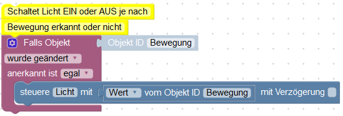

Это классический пример переключения чего-то другого при изменении точки данных.

Здесь свет включается или выключается при обнаружении движения или его отсутствии.

Сначала вставьте блок «Триггеры=>Если объект». Выберите идентификатор объекта, чтобы использовать состояние объекта в качестве триггера для этого скрипта.

Добавьте еще один блок - "Система=>Управление" и в диалоге выберите другое состояние, которое будет изменено триггером.

В этот блок управления вставьте блок «Система=>Значение идентификатора объекта» и в диалоговом окне выберите объект «Движение», чтобы записать его состояние в «Свет»:.

**В триггерных блоках есть специальная переменная «значение». Это всегда определяется здесь и может использоваться для различных целей. Он содержит текущее значение инициирующего объекта, поэтому вы можете создавать более простые сценарии, используя блок «Переменная=>Идентификатор объекта» и переименовывая его в «Значение».**

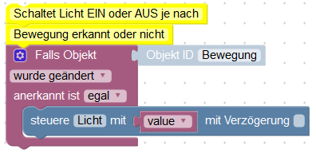

&nbsp; Пример для импорта:

```xml 
<xml xmlns="http://www.w3.org/1999/xhtml">
  <block type="comment" id="s7s**k+Cc_KjDnJW`(h~" x="12" y="63">
    <field name="COMMENT">Switch light ON or OFF it motion detected or IDLE</field>
    <next>
      <block type="on_ext" id="#}:B(M-o5:/]k,_msr%y">
        <mutation items="1"></mutation>
        <field name="CONDITION">ne</field>
        <field name="ACK_CONDITION"></field>
        <value name="OID0">
          <shadow type="field_oid" id="o~6)!C0IVy{WD%Km(lkc">
            <field name="oid">javascript.0.Motion</field>
          </shadow>
        </value>
        <statement name="STATEMENT">
          <block type="control" id="(ZqzhS_7*jGpk;`zJAZg">
            <mutation delay_input="false"></mutation>
            <field name="OID">javascript.0.Light</field>
            <field name="WITH_DELAY">FALSE</field>
            <value name="VALUE">
              <block type="get_value" id="a-E@UcwER=knNljh@:M/">
                <field name="ATTR">val</field>
                <field name="OID">javascript.0.Motion</field>
              </block>
            </value>
          </block>
        </statement>
      </block>
    </next>
  </block>
</xml>
```

&nbsp;

## Пример 2 **Включать свет при движении и выключать при отсутствии движения в течение 10 минут.**
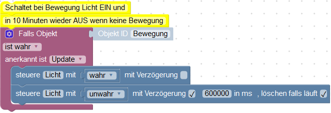

Если состояние «движение» обновляется со значением «истина», выполните:

- включить свет".
- начать задержку на 10 минут, чтобы выключить «свет» и очистить все предыдущие задержки для этой точки данных.

Как видите, флаг «очистить задержку» сбрасывается последней командой. Это удалит все таймеры для этой точки данных и запустит новый таймер.

&nbsp; Пример для импорта:

<!-- ```xml <xml xmlns="http://www.w3.org/1999/xhtml"> --> <block type="comment" id="s7s**k+Cc_KjDnJW`(h ~" x="112" y="63"> <field name="COMMENT">Включение и выключение света через 10 минут бездействия</field> <next> <block type="on_ext" id="#} :B(M-o5:/]k,_msr%y"> <mutation items="1"></mutation> <field name="CONDITION">true</field> <field name="ACK_CONDITION">true </field> <value name="OID0"> <shadow type="field_oid" id="o~6)!C0IVy{WD%Km(lkc"> <field name="oid">javascript.0.Motion< /field> </shadow> </value> <statement name="STATEMENT"> <block type="control" id="(ZqzhS_7*jGpk;`zJAZg"> <mutation delay_input="false"></mutation> <field name="OID">javascript.0.Light</field> <field name="WITH_DELAY">FALSE</field> <value name="VALUE"> <block type="logic_boolean" id="%^ ADwe*2l0tLw8Ga5F*Y"> <field name="BOOL">TRUE</field> </block> </value> <next> <block type="control" id="=]vmzp6j^V9:3?R ?2Y,x"> <mutation delay_input="true"></mutation> <field name="OID">javascript.0.Light</field> <field name="WITH_DELAY">TRUE</field> <field name="DELAY_MS">600000</field> <field name="CLEAR_RUNNING">TRUE</field> <value name="VALUE"> <block type="logic_boolean" id="!;DiIh,D]l1oN{ D;skYl"> <field name="BOOL">FALSE</field> </block> </value> </block> </next> </block> </statement> </block> </next> </блок> </xml>

```


&nbsp;
## Beispiel 3
**Verschicke eine E-Mail, wenn die Außentemperatur höher als 25 Grad Celsius ist.**

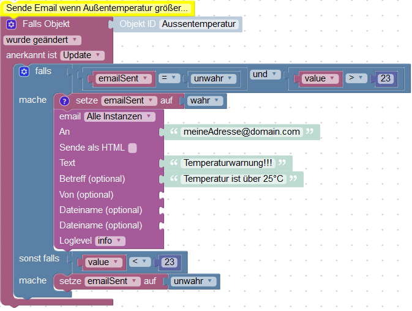

Erklärung:

Zuerst müssen wir eine Variable definieren um zu speichern, dass die E-Mail für den aktuellen Temperaturalarm bereits gesendet wurde und diese Variable auf "falsch" setzen.
Dann beobachten wir die Veränderungen der Temperatur. Wir könnten dieses Skript auch periodisch ausführen, aber das ist nicht so effektiv.

Wenn sich die Temperatur ändert vergleichen wir den aktuellen Wert mit 25 und prüfen, ob die E-Mail bereits verschickt wurde oder nicht.
Wenn die E-Mail noch nicht versendet war, speichern wir, dass wir sie jetzt senden und senden sie auch. Natürlich muss der E-Mail-Adapter vorher installiert und konfiguriert worden sein.

Wenn die Temperatur unter 23 Grad fällt setzen wir die Variable "emailSent" zurück, damit beim nächsten Temperaturalarm wieder eine E-Mail gesendet wird.
Dazu wird die aktuelle Temperatur mit 23 verglichen und es werden keine E-Mails geschickt, solange die Temperatur um 25 Grad schwankt.

Um den "falls ... sonst falls ..." Block zu erstellen klickt man auf das Zahnrad und fügt die zusätzlich benötigten Elemente dem "falls" Block hinzu.

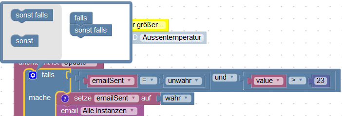

Man kann zu jedem Block einen Kommentar hinterlegen, indem man "Kommentar hinzufügen" im Kontextmenü des Blocks anklickt. Diesen Kommentar kann man später durch anklicken des Fragezeichens ansehen.

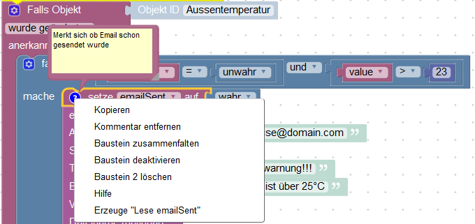

Man kann größere Blöcke einklappen, um eine bessere Übersicht zu erhalten, indem man im Kontextmenü den Punkt "Block einklappen" auswählt.

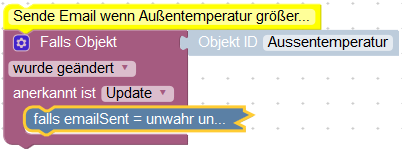


&nbsp;
Beispiel zum importieren:

```xml
<xml xmlns="http://www.w3.org/1999/xhtml">
  <block type="comment" id="r53:ZiP]3DYe;Ly;@!v5" x="87" y="13">
    <field name="COMMENT"> Send email if outside temperature is more than 25 grad Celsius.</field>
    <next>
      <block type="variables_set" id="oyEg!Z7~qid+!HYECD8C">
        <field name="VAR">emailSent</field>
        <value name="VALUE">
          <block type="logic_boolean" id="gakxd?9T354S1#_(=)%K">
            <field name="BOOL">FALSE</field>
          </block>
        </value>
        <next>
          <block type="on_ext" id="DR}w0I%EUL-FCI%`w5L4">
            <mutation items="1"></mutation>
            <field name="CONDITION">ne</field>
            <field name="ACK_CONDITION">true</field>
            <value name="OID0">
              <shadow type="field_oid" id="}TdS?2Lg~Mt[0!o0iMG.">
                <field name="oid">javascript.0.Outside_temperature</field>
              </shadow>
            </value>
            <statement name="STATEMENT">
              <block type="controls_if" id="rBBI(VLLLRnwd|ys59si">
                <mutation elseif="1"></mutation>
                <value name="IF0">
                  <block type="logic_operation" id="B5R%#,6F,xYI1gB!jjq|">
                    <field name="OP">AND</field>
                    <value name="A">
                      <block type="logic_compare" id="I=R,TaB*pge*l#j|[HZ0">
                        <field name="OP">EQ</field>
                        <value name="A">
                          <block type="variables_get" id="wd1I0gzqle,y-:h@GF)v">
                            <field name="VAR">emailSent</field>
                          </block>
                        </value>
                        <value name="B">
                          <block type="logic_boolean" id="q5~/ZIb))r`w]/RaSXUu">
                            <field name="BOOL">FALSE</field>
                          </block>
                        </value>
                      </block>
                    </value>
                  </block>
                </value>
                <statement name="DO0">
                  <block type="variables_set" id="i):z[{@|*;4zOruzXH46">
                    <field name="VAR">emailSent</field>
                    <comment pinned="false" h="80" w="160">Remember, that email was sent</comment>
                    <value name="VALUE">
                      <block type="logic_boolean" id="56A@]MZKiuL(iuuj)MRI">
                        <field name="BOOL">FALSE</field>
                      </block>
                    </value>
                    <next>
                      <block type="email" id="3J#TXZ`oei_NMEL,_w8K">
                        <field name="INSTANCE"></field>
                        <field name="IS_HTML">FALSE</field>
                        <field name="LOG">log</field>
                        <value name="TO">
                          <shadow type="text" id="j*x?kanQQyGH/pN,r9B2">
                            <field name="TEXT">myaddress@domain.com</field>
                          </shadow>
                        </value>
                        <value name="TEXT">
                          <shadow type="text" id="QE(T_Z]{=o8~h~+vz!ZU">
                            <field name="TEXT">Temperature is over 25°C</field>
                          </shadow>
                        </value>
                        <value name="SUBJECT">
                          <shadow type="text" id="/_AxN7@=T|t@XW.^Fu1(">
                            <field name="TEXT">Temperature alert</field>
                          </shadow>
                        </value>
                      </block>
                    </next>
                  </block>
                </statement>
                <value name="IF1">
                  <block type="logic_compare" id="S?0|;{3V3!_rqUk]GJ4)">
                    <field name="OP">LT</field>
                    <value name="A">
                      <block type="variables_get" id="IJwq1,|y;l7ueg1mF{~x">
                        <field name="VAR">value</field>
                      </block>
                    </value>
                    <value name="B">
                      <block type="math_number" id="m(.v?M3ezTKz(kf5b9ZE">
                        <field name="NUM">23</field>
                      </block>
                    </value>
                  </block>
                </value>
                <statement name="DO1">
                  <block type="variables_set" id="M0{G}QBtF!FYrT,xWBnV">
                    <field name="VAR">emailSent</field>
                    <value name="VALUE">
                      <block type="logic_boolean" id="ti#H=_:;-XRC%CzR/+/0">
                        <field name="BOOL">FALSE</field>
                      </block>
                    </value>
                  </block>
                </statement>
              </block>
            </statement>
          </block>
        </next>
      </block>
    </next>
  </block>
</xml>
```

&nbsp;

&nbsp;

# Блоки
## Системные блоки
### Отладочный вывод
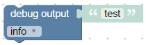

Этот блок ничего не делает, кроме записи строки в лог. Вы можете использовать его для отладки скрипта, например:

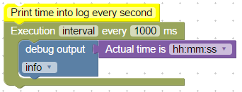

&nbsp; Пример для импорта:

```xml 
<xml xmlns="http://www.w3.org/1999/xhtml">
  <block type="comment" id="K|2AnJ|5})RoNZ1T%Hh#" x="38" y="13">
    <field name="COMMENT">Print time into log every second</field>
    <next>
      <block type="timeouts_setinterval" id="LNsHTl,!r6eR8J9Yg,Xn">
        <field name="NAME">interval</field>
        <field name="INTERVAL">1000</field>
        <statement name="STATEMENT">
          <block type="debug" id=".oLS7P_oFU0%PWocRlYp">
            <field name="Severity">log</field>
            <value name="TEXT">
              <shadow type="text" id="X^Z/.qUry9B5Rr#N`)Oy">
                <field name="TEXT">test</field>
              </shadow>
              <block type="time_get" id="TPo6nim+=TBb-pnKMkRp">
                <mutation format="false" language="false"></mutation>
                <field name="OPTION">hh:mm:ss</field>
              </block>
            </value>
          </block>
        </statement>
      </block>
    </next>
  </block>
</xml>
```

Вы можете определить 4 различных уровня серьезности для сообщений:

- отладка (для этого требуется активировать уровень отладки экземпляра javascript.)
- информация (по умолчанию, по крайней мере, уровень журнала информации должен быть активирован в экземпляре javascript.)
- предупреждение
- ошибка (отображается всегда. Другие уровни можно игнорировать, если это установлено соответствующим образом в экземпляре javascript.)

&nbsp;

### Комментарий 
Добавьте комментарий к сценарию для лучшего понимания позже.

Блок ничего не делает, это просто комментарий.

&nbsp;

### Состояние управления 
Вы можете написать состояние двумя разными способами:

- Чтобы что-то контролировать и отправлять значение на оборудование (Этот блок)
- Запишите новое значение только для информации, например, изменение температуры ([следующий блок](#update-state))

&nbsp; Типичное применение этого блока:

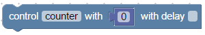

ID объекта выбирается в диалоге, значение для отправки должно быть указано. В зависимости от типа точки данных значение может иметь тип [строка](#строка-значение), [число](#число-значение) или [логическое](#ogical-value-trueflase).

Дополнительные пояснения приведены в [здесь](https://github.com/ioBroker/ioBroker/wiki/Adapter-Development-Documentation#commands-and-statuses).

Этот блок записывает команду в точку данных с (ack=false). Также можно указать задержку.
Если задержка не равна 0, состояние устанавливается не сразу, а только через указанное время в миллисекундах.

Вы можете удалить все другие задержки для этой точки данных, установив флажок.

В следующем примере точка данных «Свет» переключается только один раз (через 2 секунды): 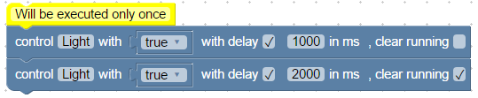

&nbsp; Пример для импорта:

```xml 
<xml xmlns="http://www.w3.org/1999/xhtml">
  <block type="comment" id="K|2AnJ|5})RoNZ1T%Hh#" x="38" y="13">
    <field name="COMMENT">Will be executed only once</field>
    <next>
      <block type="control" id="IWceY@BFn9/Y?Ez^b(_-">
        <mutation delay_input="true"></mutation>
        <field name="OID">javascript.0.Light</field>
        <field name="WITH_DELAY">TRUE</field>
        <field name="DELAY_MS">1000</field>
        <field name="CLEAR_RUNNING">FALSE</field>
        <value name="VALUE">
          <block type="logic_boolean" id="I/LUv5/AknHr#[{{qd-@">
            <field name="BOOL">TRUE</field>
          </block>
        </value>
        <next>
          <block type="control" id=".Ih(K(P)SFApUP0)/K7,">
            <mutation delay_input="true"></mutation>
            <field name="OID">javascript.0.Light</field>
            <field name="WITH_DELAY">TRUE</field>
            <field name="DELAY_MS">2000</field>
            <field name="CLEAR_RUNNING">TRUE</field>
            <value name="VALUE">
              <block type="logic_boolean" id="B?)bgD[JZoNL;enJQ4M.">
                <field name="BOOL">TRUE</field>
              </block>
            </value>
          </block>
        </next>
      </block>
    </next>
  </block>
</xml>
```

В отличие от предыдущего примера, в следующем примере состояние «Свет» переключается дважды (через 1 секунду и через 2 секунды): 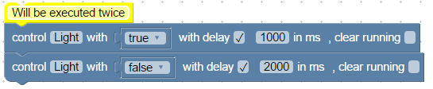

```xml 
<xml xmlns="http://www.w3.org/1999/xhtml">
  <block type="comment" id="K|2AnJ|5})RoNZ1T%Hh#" x="38" y="13">
    <field name="COMMENT">Will be executed twice</field>
    <next>
      <block type="control" id="IWceY@BFn9/Y?Ez^b(_-">
        <mutation delay_input="true"></mutation>
        <field name="OID">javascript.0.Light</field>
        <field name="WITH_DELAY">TRUE</field>
        <field name="DELAY_MS">1000</field>
        <field name="CLEAR_RUNNING">FALSE</field>
        <value name="VALUE">
          <block type="logic_boolean" id="I/LUv5/AknHr#[{{qd-@">
            <field name="BOOL">TRUE</field>
          </block>
        </value>
        <next>
          <block type="control" id=".Ih(K(P)SFApUP0)/K7,">
            <mutation delay_input="true"></mutation>
            <field name="OID">javascript.0.Light</field>
            <field name="WITH_DELAY">TRUE</field>
            <field name="DELAY_MS">2000</field>
            <field name="CLEAR_RUNNING">FALSE</field>
            <value name="VALUE">
              <block type="logic_boolean" id="B?)bgD[JZoNL;enJQ4M.">
                <field name="BOOL">FALSE</field>
              </block>
            </value>
          </block>
        </next>
      </block>
    </next>
  </block>
</xml>
```

&nbsp;

### Состояние обновления 
Этот блок аналогичен [блок управления](#steuere-state), но устанавливает только текущее значение. Никакая команда не отправляется для управления оборудованием.

Типичное применение этого блока:


&nbsp;

### Состояния привязки 
Этот блок связывает два состояния вместе.

С этими блоками можно добиться того же:

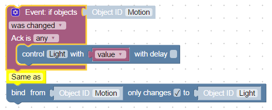

Можно выбрать, будет ли значение передаваться только при изменении источника или при каждом обновлении.

&nbsp; Пример для импорта:

```xml 
<block xmlns="http://www.w3.org/1999/xhtml" type="on_ext" id="w/@=5/5!D;8wn4DZ;jzG" x="287.99999999999943" y="37.999999999999716">
  <mutation items="1"></mutation>
  <field name="CONDITION">ne</field>
  <field name="ACK_CONDITION"></field>
  <value name="OID0">
    <shadow type="field_oid" id="tQBL3[;V1luVO[`h2ONM">
      <field name="oid">javascript.0.Motion</field>
    </shadow>
  </value>
  <statement name="STATEMENT">
    <block type="control" id="w=sN]yxb)5Jv!,YK[C5%">
      <mutation delay_input="false"></mutation>
      <field name="OID">javascript.0.Light</field>
      <field name="WITH_DELAY">FALSE</field>
      <value name="VALUE">
        <block type="variables_get" id="6`1|t;T%_h^|ES+nd~/?">
          <field name="VAR">value</field>
        </block>
      </value>
    </block>
  </statement>
</block>
```

&nbsp;

### Запись состояний 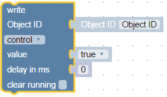
Универсальный блок записи, который может делать то же самое, что и [«Состояние обновления»](#update-state) и [«Состояние управления»](#control-state) вместе.

Но по сравнению с ними вы можете определить Object ID и задержку с другими блоками, чтобы сделать ваш скрипт более универсальным.

### Создать состояние
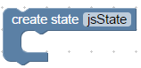 В сценариях можно создавать переменные двух типов:

- локальные [переменные](#set-variables-value)
- глобальные переменные или состояния.

Глобальные состояния видны во всех скриптах, но локальные видны только в этом текущем скрипте.

Глобальные состояния могут использоваться в vis, mobile и всех других модулях логики или визуализации, могут быть зарегистрированы в базе данных или где-то еще.

Этот блок создает глобальное состояние, и если состояние еще существует, команда будет проигнорирована. Вы можете смело вызывать этот блок при каждом запуске скрипта.

Этот блок создает глобальные состояния, и если он уже существует, команда игнорируется. Поэтому этот блок можно без риска использовать при каждом запуске скрипта.

&nbsp; Типичное применение этого блока:

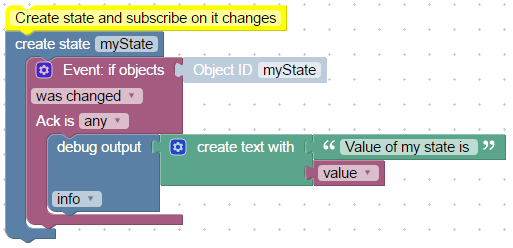

```xml 
<xml xmlns="http://www.w3.org/1999/xhtml">
  <block type="comment" id="dBV.{0z/{Fr@RB+10H5i" x="38" y="13">
    <field name="COMMENT">Create state and subscribe on it changes</field>
    <next>
      <block type="create" id="D%[{T~!b9^V#Z.7bI+3y">
        <field name="NAME">myState</field>
        <statement name="STATEMENT">
          <block type="on_ext" id="H@F~z_,FpvXo8BptmAtL">
            <mutation items="1"></mutation>
            <field name="CONDITION">ne</field>
            <field name="ACK_CONDITION"></field>
            <value name="OID0">
              <shadow type="field_oid" id="hn{OMH9y7AP_dns;KO6*">
                <field name="oid">javascript.0.myState</field>
              </shadow>
            </value>
            <statement name="STATEMENT">
              <block type="debug" id="DjP1pU?v=))`V;styIRR">
                <field name="Severity">log</field>
                <value name="TEXT">
                  <shadow type="text" id="de?mCXefl4v#XrO])~7y">
                    <field name="TEXT">test</field>
                  </shadow>
                  <block type="text_join" id="^33}.]#ov(vUAEEn8Hdp">
                    <mutation items="2"></mutation>
                    <value name="ADD0">
                      <block type="text" id="_-p%CZq4%)v1EYvh)lf@">
                        <field name="TEXT">Value of my state is </field>
                      </block>
                    </value>
                    <value name="ADD1">
                      <block type="variables_get" id="6r!TtpfrfQ@5Nf[4#[6l">
                        <field name="VAR">value</field>
                      </block>
                    </value>
                  </block>
                </value>
              </block>
            </statement>
          </block>
        </statement>
      </block>
    </next>
  </block>
</xml>
```

Вы можете использовать только что созданное состояние в самом блоке.

Следующий код выдает ошибку при первом запуске, потому что «подписаться» на «myState» не удается найти объект:

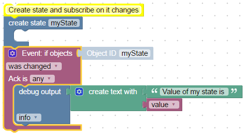

При втором запуске ошибка не возникает, поскольку точка данных уже существует.

&nbsp;

### Значение идентификатора объекта 
Этот блок используется для чтения значения точки данных. Можно прочитать следующие атрибуты точки данных:

- Ценить
- Подтверждение - команда = ложь или обновление = истина
- Временная метка в мс с 01.01.1970 (имеет тип "Дата объекта")
- Последнее изменение значения в мс с 01.01.1970 (имеет тип "Дата объекта")
- качество
- Источник — имя экземпляра, который записал последнее значение, например `system.adapter.javascript.0`

&nbsp; Пример вывода времени последнего изменения значения:

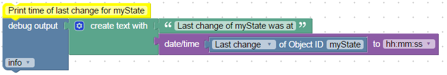

```xml 
<xml xmlns="http://www.w3.org/1999/xhtml">
  <block type="comment" id="GVW732OFexZ9HP[q]B3," x="38" y="13">
    <field name="COMMENT">Print time of last change for myState</field>
    <next>
      <block type="debug" id="t,GmgLjo]1d0{xT+@Yns">
        <field name="Severity">log</field>
        <value name="TEXT">
          <shadow type="text" id="w{UF-|ashrP4e*jl~{9_">
            <field name="TEXT">test</field>
          </shadow>
          <block type="text_join" id="i~L{r:B9oU}.ANc.AV8F">
            <mutation items="2"></mutation>
            <value name="ADD0">
              <block type="text" id="r5=i|qvrII+NCAQ~t{p5">
                <field name="TEXT">Last change of myState was at</field>
              </block>
            </value>
            <value name="ADD1">
              <block type="convert_from_date" id="?cGS1/CwThX!tTDMVSoj">
                <mutation format="false" language="false"></mutation>
                <field name="OPTION">hh:mm:ss</field>
                <value name="VALUE">
                  <block type="get_value" id="k+#N2u^rx)u%Z9lA`Yps">
                    <field name="ATTR">lc</field>
                    <field name="OID">javascript.0.myState</field>
                  </block>
                </value>
              </block>
            </value>
          </block>
        </value>
      </block>
    </next>
  </block>
</xml>
```

&nbsp;

### Идентификатор объекта


Это простой вспомогательный блок для удобного выбора идентификатора объекта для запуска блока.

Диалоговое окно выбора идентификатора открывается при нажатии на «Идентификатор объекта».

&nbsp; Типичное применение этого блока:

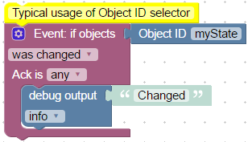

```xml 
<xml xmlns="http://www.w3.org/1999/xhtml">
  <block type="comment" id="GVW732OFexZ9HP[q]B3," x="38" y="13">
    <field name="COMMENT">Typical usage of Object ID selector</field>
    <next>
      <block type="on_ext" id="D+1_tP(lF!R]wy?R#|~A">
        <mutation items="1"></mutation>
        <field name="CONDITION">ne</field>
        <field name="ACK_CONDITION"></field>
        <value name="OID0">
          <shadow type="field_oid" id="rpg#*-DXMVqzexE8-^Xc">
            <field name="oid">default</field>
          </shadow>
          <block type="field_oid" id="YYTRKxeC@l3WE~OJx4ei">
            <field name="oid">javascript.0.myState</field>
          </block>
        </value>
        <statement name="STATEMENT">
          <block type="debug" id="{;_x6LATJ,b^leE,xgz9">
            <field name="Severity">log</field>
            <value name="TEXT">
              <shadow type="text" id="-)V}_9Cxt2kj:]36y,7#">
                <field name="TEXT">Changed</field>
              </shadow>
            </value>
          </block>
        </statement>
      </block>
    </next>
  </block>
</xml>
```

&nbsp;

&nbsp;

## Блоки действий
### Exec - команда
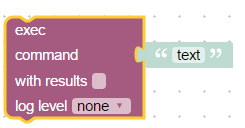

Этот блок выполняет введенную команду в системе, как если бы она была введена в командной строке через SSH.

Команда выполняется с правами пользователя, под которым запущен ioBroker.

Если вывод не требуется, его можно подавить:

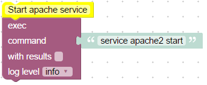

Если нужно сделать вывод:

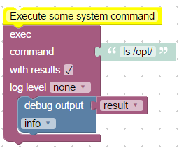

&nbsp;

```xml 
<xml xmlns="http://www.w3.org/1999/xhtml">
  <block type="comment" id="GVW732OFexZ9HP[q]B3," x="313" y="38">
    <field name="COMMENT">Execute some system command</field>
    <next>
      <block type="exec" id="hGkHs.IkmiTa{jR^@-}S">
        <mutation with_statement="true"></mutation>
        <field name="WITH_STATEMENT">TRUE</field>
        <field name="LOG"></field>
        <value name="COMMAND">
          <shadow type="text" id=":KG#hyuPRhQJWFSk)6Yo">
            <field name="TEXT">ls /opt/</field>
          </shadow>
        </value>
        <statement name="STATEMENT">
          <block type="debug" id="ELv(y5V4[hZ,F8,]D51x">
            <field name="Severity">log</field>
            <value name="TEXT">
              <shadow type="text" id="J[o*Fylexfu41}smph).">
                <field name="TEXT">result</field>
              </shadow>
              <block type="variables_get" id="gWo7Y^,QI=PqL(Q;7D=^">
                <field name="VAR">result</field>
              </block>
            </value>
          </block>
        </statement>
      </block>
    </next>
  </block>
</xml>
```

&nbsp;

Для анализа вывода создаются 3 специальные переменные:

- Результат содержит обычный вывод на консоль (например, для команды "ls /opt" вывод "iobroker nodejs")
- Объект ошибки, если модуль JavaScript не смог выполнить команду
- stderr, вывод ошибки выполненной программы

Кроме того, тот же вывод также появится в журнале, если для уровня журнала не установлено значение «none».

&nbsp;

### Адрес запроса
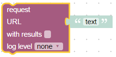

Вызывает URL и возвращает результат.

&nbsp; Пример:

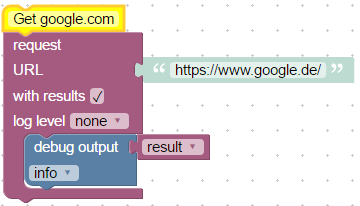

Для анализа вывода создаются 3 специальные переменные:

- Результат, содержит тело запрошенной страницы
- Ошибка, содержит описание ошибки
- Ответ (только расширенный), специальный объект типа [http.IncomingMessage](https://nodejs.org/api/http.html#http_class_http_incomingmessage)

Если вывод не нужен, его можно подавить. Для этого отметьте опцию «с результатом».

&nbsp;

&nbsp;

## Блоки отправки
### Отправить в телеграм
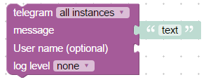

Этот блок используется для отправки сообщения через телеграмму с помощью адаптера телеграммы.

Разумеется, телеграм-адаптер должен быть предварительно установлен и настроен.

Чтобы отправить сообщение через конкретный экземпляр, необходимо выбрать нужный экземпляр адаптера (обычно это telegram.0), иначе сообщение будет отправлено через все доступные экземпляры.

Поле *Сообщение* является обязательным, и содержащийся в нем текст точно так же отправляется клиенту.

Идентификатор имени пользователя является необязательным, это идентификатор из [телеграмма](https://core.telegram.org/bots/api#user) (уникальный идентификатор пользователя или бота).

Кроме того, если уровень журнала не равен «none», в журнал будет отправлено то же сообщение.

&nbsp;

### Отправить в SayIt
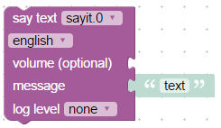

Этот блок используется для отправки текста экземпляру `sayit` для произнесения этого текста.

Разумеется, необходимо установить и настроить адаптер `sayit`.

Чтобы отправить сообщение в конкретный экземпляр, вы должны выбрать установленный экземпляр адаптера (обычно `sayit.0`), иначе сообщение будет отправлено во все существующие экземпляры.

Свойство *message* является обязательным и будет произноситься именно этот текст.

Вы должны проверить свойство языка. Это будет использоваться для движка text2speech.

Громкость не является обязательной (обычно от 0 до 100).

Кроме того, если уровень журнала не равен «none», в журнал будет отправлено то же сообщение.

&nbsp;

### Отправить на пустяк
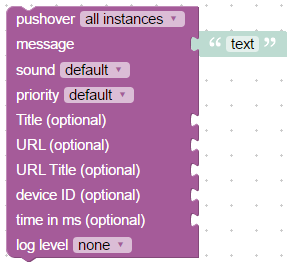

Этот блок используется для отправки текста клиенту pushover. Вы можете прочитать о драйвере pushover [здесь](https://github.com/ioBroker/ioBroker.pushover).

Конечно, адаптер pushover должен быть установлен и настроен.

Чтобы отправить сообщение в какой-то конкретный экземпляр, вы должны выбрать установленный экземпляр адаптера (обычно pushover.0), иначе сообщение будет отправлено во все существующие экземпляры.

Свойство *message* является обязательным и именно этот текст будет отправлен клиенту.

Все остальные свойства являются необязательными, и вы можете прочитать о них [здесь](https://pushover.net/api):

- *идентификатор устройства* - имя устройства вашего пользователя для отправки сообщения непосредственно на это устройство, а не на все устройства пользователя (несколько устройств могут быть разделены запятой)
- *title* - заголовок вашего сообщения, иначе используется название вашего приложения
- *URL* - дополнительный URL для отображения с вашим сообщением
- *Заголовок URL* - заголовок для вашего дополнительного URL, в противном случае отображается только URL
- *priority* - отправить как -2, чтобы не генерировать уведомление/предупреждение, -1, чтобы всегда отправлять как тихое уведомление, 1, чтобы отображать как высокоприоритетный и не использовать тихие часы пользователя, или 2, чтобы также требовать подтверждения от пользователя
- *время в мс* - временная метка Unix с датой и временем вашего сообщения для отображения пользователю, а не время получения вашего сообщения нашим API
- *sound* - имя одного из звуков, поддерживаемых клиентами устройства, для переопределения выбора звука пользователем по умолчанию.

Кроме того, если уровень журнала не равен «none», в журнал будет отправлено то же сообщение.

&nbsp;

### Отправить письмо
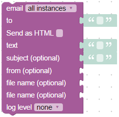

Этот блок используется для отправки текста по электронной почте.

Конечно, почтовый адаптер должен быть установлен, настроен и протестирован.

Чтобы отправить сообщение в какой-то конкретный экземпляр, вы должны выбрать установленный экземпляр адаптера (обычно email.0), иначе сообщение будет отправлено во все существующие экземпляры.

Свойство *текст* является обязательным и именно этот текст будет отправлен клиенту.

Конечно, пункт назначения (*to*) должен быть заполнен действительным адресом электронной почты.

Вы можете прикрепить файлы (обычно изображения) к электронному письму. Чтобы использовать изображения в тексте, вы должны изменить формат на HTML (установите флажок «Отправить как HTML»), и текст может выглядеть так:

```html
<p>Embedded image 1: </p>
<p>Embedded image 2: </p>
```

Вы можете ссылаться на файлы как ``````. "file1" и "file2" являются зарезервированными идентификаторами и не могут быть изменены.

"имя файла" должно состоять из полного пути к образу на диске.

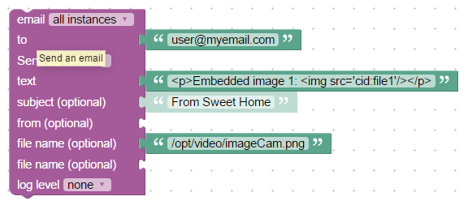

```xml 
<block xmlns="http://www.w3.org/1999/xhtml" type="email" id="VeysPTJXFh^.CW1t(s@Q" x="563" y="63">
  <field name="INSTANCE"></field>
  <field name="IS_HTML">FALSE</field>
  <field name="LOG"></field>
  <value name="TO">
    <shadow type="text" id=".6+6Rp^N7JHiNkP/.^09">
      <field name="TEXT"></field>
    </shadow>
    <block type="text" id="NC6==~4g|OB^`xZ:|Rlx">
      <field name="TEXT">user@myemail.com</field>
    </block>
  </value>
  <value name="TEXT">
    <shadow type="text" id="jaGOyI%O4wl(.s.wo(Y`">
      <field name="TEXT"></field>
    </shadow>
    <block type="text" id=")--+u-+rdoAyWpi9I87+">
      <field name="TEXT">&lt;p&gt;Embedded image 1: &lt;img src='cid:file1'/&gt;&lt;/p&gt;</field>
    </block>
  </value>
  <value name="SUBJECT">
    <shadow type="text" id="|49=rPOCP]hwFD[HX@_I">
      <field name="TEXT">From Sweet Home</field>
    </shadow>
  </value>
  <value name="FILE_1">
    <block type="text" id="tlb_Kuh5?JvPTQr)A{}4">
      <field name="TEXT">/opt/video/imageCam.png</field>
    </block>
  </value>
</block>
```

Кроме того, если уровень журнала не равен «none», в журнал будет отправлено то же сообщение.

&nbsp;

### Пользовательский блок sendTo
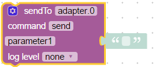

Это просто блок справки для отправки внутреннего системного сообщения (sendTo) любому адаптеру.

Конечно, вы можете использовать пользовательский функциональный блок, чтобы делать что-нибудь сумасшедшее, а также отправлять сообщения.

Вы можете определить свои собственные параметры для команды sendTo:

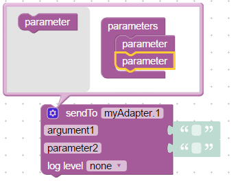

Подробнее [здесь](https://github.com/ioBroker/ioBroker.javascript#sendto) о «sendTo».

Пример отправки SQL-запроса на sql-адаптер:

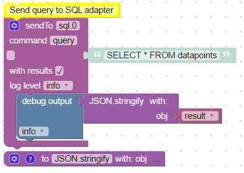

```xml 
<xml xmlns="http://www.w3.org/1999/xhtml"> -->
  <block type="comment" id="GVW732OFexZ9HP[q]B3," x="163" y="13">
    <field name="COMMENT">Send query to SQL adapter</field>
    <next>
      <block type="sendto_custom" id="84lYloO4o+RvLszPVHZ5">
        <mutation items="" with_statement="true"></mutation>
        <field name="INSTANCE">sql.0</field>
        <field name="COMMAND">query</field>
        <field name="WITH_STATEMENT">TRUE</field>
        <field name="LOG">log</field>
        <value name="ARG0">
          <shadow type="text" id=")faamoSD,nGPXawY4|(Z">
            <field name="TEXT">SELECT * FROM datapoints</field>
          </shadow>
        </value>
        <statement name="STATEMENT">
          <block type="debug" id="Q#UJl]^_g/VHzM*G/a:f">
            <field name="Severity">log</field>
            <value name="TEXT">
              <shadow type="text" id="#!NJS43!0z@}z:6~_,9(">
                <field name="TEXT">test</field>
              </shadow>
              <block type="procedures_callcustomreturn" id="0E2fmQQduf4)-({z(om|">
                <mutation name="JSON.stringify">
                  <arg name="obj"></arg>
                </mutation>
                <value name="ARG0">
                  <block type="variables_get" id=",^2E2eT#598hI^TvABD9">
                    <field name="VAR">result</field>
                  </block>
                </value>
              </block>
            </value>
          </block>
        </statement>
      </block>
    </next>
  </block>
  <block type="procedures_defcustomreturn" id="lm*.n3kQXll8o9X^*m,k" x="163" y="263">
    <mutation statements="false">
      <arg name="obj"></arg>
    </mutation>
    <field name="NAME">JSON.stringify</field>
    <field name="SCRIPT">cmV0dXJuIEpTT04uc3RyaW5naWZ5KG9iaik7</field>
    <comment pinned="false" h="80" w="160">Describe this function...</comment>
  </block>
</xml>
```

Если вы используете только один параметр с пустым именем, структура не будет создана, как здесь:

```javascript
var obj, result;

/**
 * Describe this function...
 */
function JSON_stringify(obj) {
    return JSON.stringify(obj);
}


// Send query to SQL adapter
sendTo("sql.0", "query", 'SELECT * FROM datapoints', function (result) {
    console.log((JSON_stringify(result)));
  });
console.log("sql.0: " + "");
```

Или как запросить историю у адаптера SQL:

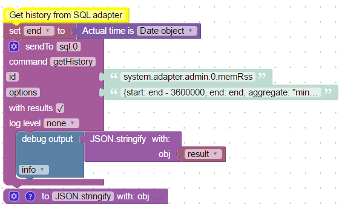

```XML
<xml xmlns="http://www.w3.org/1999/xhtml">
  <block type="comment" id="GVW732OFexZ9HP[q]B3," x="263" y="13">
    <field name="COMMENT">Get history from SQL adapter</field>
    <next>
      <block type="variables_set" id="J;8I^fN*4YQ1+jPI3FS#">
        <field name="VAR">end</field>
        <value name="VALUE">
          <block type="time_get" id="kZFFxa-2%7/:=IHU|}eB">
            <mutation format="false" language="false"></mutation>
            <field name="OPTION">object</field>
          </block>
        </value>
        <next>
          <block type="sendto_custom" id="84lYloO4o+RvLszPVHZ5">
            <mutation items="id,options" with_statement="true"></mutation>
            <field name="INSTANCE">sql.0</field>
            <field name="COMMAND">getHistory</field>
            <field name="WITH_STATEMENT">TRUE</field>
            <field name="LOG"></field>
            <value name="ARG0">
              <shadow type="text" id=")faamoSD,nGPXawY4|(Z">
                <field name="TEXT">system.adapter.admin.0.memRss</field>
              </shadow>
            </value>
            <value name="ARG1">
              <shadow type="text" id="/nmT=qDw;S`#*tXN=C6n">
                <field name="TEXT">{start: end - 3600000, end: end, aggregate: "minmax"}</field>
              </shadow>
            </value>
            <statement name="STATEMENT">
              <block type="debug" id="Q#UJl]^_g/VHzM*G/a:f">
                <field name="Severity">log</field>
                <value name="TEXT">
                  <shadow type="text" id="#!NJS43!0z@}z:6~_,9(">
                    <field name="TEXT">test</field>
                  </shadow>
                  <block type="procedures_callcustomreturn" id="0E2fmQQduf4)-({z(om|">
                    <mutation name="JSON.stringify">
                      <arg name="obj"></arg>
                    </mutation>
                    <value name="ARG0">
                      <block type="variables_get" id=",^2E2eT#598hI^TvABD9">
                        <field name="VAR">result</field>
                      </block>
                    </value>
                  </block>
                </value>
              </block>
            </statement>
          </block>
        </next>
      </block>
    </next>
  </block>
  <block type="procedures_defcustomreturn" id="lm*.n3kQXll8o9X^*m,k" x="263" y="313">
    <mutation statements="false">
      <arg name="obj"></arg>
    </mutation>
    <field name="NAME">JSON.stringify</field>
    <field name="SCRIPT">cmV0dXJuIEpTT04uc3RyaW5naWZ5KG9iaik7</field>
    <comment pinned="false" h="80" w="160">JSON.stringify object</comment>
  </block>
</xml>
```

Сгенерированный код JavaScript:

```javascript
var obj, end, result;

/**
 * JSON.stringify object
 */
function JSON_stringify(obj) {
    return JSON.stringify(obj);
}


// Get history from SQL adapter
end = (new Date().getTime());
sendTo("sql.0", "getHistory", {
   "id": 'system.adapter.admin.0.memRss',
   "options": {start: end - 3600000, end: end, aggregate: "minmax"}
}, function (result) {
    console.log((JSON_stringify(result)));
  });
```

Если вы начинаете значение с "{", оно будет интерпретироваться как строка JSON. Используйте двойные кавычки в строке.

&nbsp;

&nbsp;

## Блоки даты и времени
### Сравнение времени
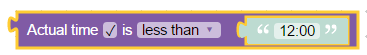

Если используется оператор «между» или «не между», блок выглядит так:


Вы можете указать время, которое необходимо сравнить. Блок ожидает время как «объект даты».


Существуют следующие режимы сравнения:

- меньше чем, проверьте, меньше ли фактическое время, чем указанное время.
- равно или меньше
- больше чем
- равно или больше
- равно
- между, проверьте, есть ли время между некоторыми дневными временами.
    - напр. если время должно быть между 12:00 и 20:00. Будет проверено, если фактическое время больше или равно 12:00 и меньше 20:00. 20:00 вернет false.
    - или, например, с 21:00 до 8:00. В последнем случае будет проверено, больше или равно 21:00 или меньше 8:00.

- не между, если время не находится в заданном периоде дневного времени. Если время меньше начала и больше или равно концу. (если время начала больше времени окончания, будет проверено, больше или равно время окончания и меньше начала)

Допустимы следующие форматы времени:

- ГГГГ-ММ-ДД чч:мм:сс
- ГГГГ-ММ-ДД чч:мм
- чч:мм:сс
- чч:мм

&nbsp;

### Сравнение фактического времени
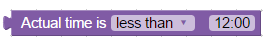

Этот блок используется для сравнения дневного времени с фактическим временем. У него та же логика, что и у [Сравнение времени](#time-comparision), но лимиты не могут быть блоками, и он сравнивает только фактическое время. (для совместимости со старыми версиями)

&nbsp;

### Получить фактическое время в определенном формате


Возвращает фактическое время в определенном формате.

Поддерживаются следующие форматы:

- миллисекунды - возвращает только миллисекунды текущей секунды от 0 до 999 (не миллисекунды эпохи). Чтобы получить миллисекунды эпохи, используйте «Объект даты»;
- секунды - возвращает только секунды текущей минуты от 0 до 59,
- секунды в дне - возвращает количество секунд от начала дня (от 0 до 24 * 3600 - 1),
- минуты - возвращает минуты текущего часа от 0 до 59,
- минут в дне - возвращает количество минут с начала дня (от 0 до 24 * 60 - 1),
- часы - возвращает часы текущего дня от 0 до 23,
- день месяца - получить день месяца от 1 до 31,
- месяц как число - получить месяц как число от 1 до 12,
- месяц как текст - получить месяц как текст. Язык должен быть указан.
- месяц в виде короткого текста - получить месяц в виде текста: январь, февраль, март, апрель, май, июнь, июль, август, сентябрь, октябрь, ноябрь, декабрь. Язык должен быть указан.
- короткий год - год от 0 до 99, т.е. на 2016 год результат будет 16.
- полный год - Полный год: 2016
- текст дня недели - Получить день недели в виде текста.
- короткий день недели - Получить день недели в виде короткого текста: Вс, Пн, Вт, Ср, Чт, Пт, Сб.
- день недели в виде числа - день недели в виде числа от 1 (понедельник) до 7 (воскресенье).
- пользовательский формат - вы можете указать свой собственный [формат] (https://github.com/ioBroker/ioBroker.javascript#formatdate).
- Объект даты - возвращает дату и время в миллисекундах от начала эпохи (1970.1.1 00:00:00.000Z GMT). Это всегда время по Гринвичу.
- гггг.мм.дд - 2016.09.14
- гггг/мм/дд - 2016/09/14
- гг.мм.дд - 16.09.14
- гг/мм/дд - 16/09/14
- дд.мм.гггг - 14.09.2016
- дд/мм/гггг - 09.14.2016
- дд.мм.гг - 14.09.16
- дд/мм/гг - 14/09/16
- дд/мм/гггг - 14.09.2016
- дд/мм/гг - 14.09.16
- дд.мм. - 14.09.
- дд/мм - 14/09
- мм.дд - 09.14
- мм/дд - 09/14
- чч:мм - 12:00
- чч:мм:сс - 12:00:00
- чч:мм:сс.сссс - 12:00:00.000

&nbsp;

### Получить время астрономических событий на сегодня
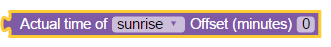

Возвращает время текущего дня определенного астрологического события.

Атрибут «смещение» — это смещение в минутах. Он также может быть отрицательным, чтобы определить время до астрономического события.

В качестве атрибута в астрофункции можно использовать следующие значения:

- восход солнца: восход солнца (верхний край солнца появляется на горизонте)
- SunriseEnd: восход заканчивается (нижний край солнца касается горизонта)
- GoldenHourEnd: заканчивается утренний золотой час (мягкий свет, лучшее время для фотосъемки)
- solarNoon: солнечный полдень (солнце находится в самом высоком положении)
- GoldenHour: начинается вечерний золотой час
- sunstartStart: начинается закат (нижний край солнца касается горизонта)
- закат: закат (солнце уходит за горизонт, начинаются вечерние гражданские сумерки)
-summer:summer (начинаются вечерние морские сумерки)
- nauticalDusk: морские сумерки (начинаются вечерние астрономические сумерки)
- ночь: начинается ночь (достаточно темно для астрономических наблюдений)
- nightEnd: ночь заканчивается (начинаются утренние астрономические сумерки)
- nauticalDawn: морской рассвет (начинаются утренние морские сумерки)
- рассвет: рассвет (заканчиваются утренние морские сумерки, начинаются утренние гражданские сумерки)
- надир: надир (самый темный момент ночи, солнце находится в самом низком положении)

Возвращаемое значение имеет тип «Объект даты», который представляет собой просто количество миллисекунд с 1970.01.01.

**Примечание:** для использования "астро"-функции "широта" и "долгота" должны быть определены в настройках javascript-адаптера.

&nbsp;

&nbsp;

## Преобразование блоков
Иногда требуется преобразовать значение в другой тип. Следующие блоки позволяют преобразовать значение в определенные типы.

### Преобразование в число


Преобразование значения в число (с плавающей запятой).

&nbsp;

### Преобразование в логическое значение


Преобразование значения в логическое значение (true или false).

&nbsp;

### Преобразование в строку


Преобразовать значение в строку.

&nbsp;

### Получить тип переменной


Получить тип значения. Тип может быть: логический, числовой, строковый, объектный.

&nbsp;

### Преобразование в объект даты/времени


Преобразовать значение в «Объект даты». Прочтите [здесь](#get-actual-time-im-specific-format), что такое «объект даты».

&nbsp;

### Преобразование объекта даты/времени в строку


Преобразовать "Объект даты" в строку. Он имеет те же параметры формата, что и [Получить фактическое время в определенном формате](#get-actual-time-im-specific-format).

&nbsp;

### Преобразование JSON в объект


Преобразование строки JSON в объект javascript. В случае ошибки будет возвращен пустой объект. (только для экспертов)

&nbsp;

### Преобразование объекта в JSON
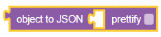

Преобразование объекта Javascript в строку JSON. Если выбран параметр prettify, результирующая строка выглядит так:

```json
{
  "a": 1,
  "b": 2
}
```

если не:

```
{"a": 1, "b": 2}
```

### Преобразование с помощью выражения JSONata


Преобразование объекта Javascript с помощью выражения JSONata. Подробнее об этом можно прочитать здесь: [https://jsonata.org/](https://jsonata.org/)

Пример полезной нагрузки:

```
{"example": [{"value": 4},{"value": 7},{"value": 13}]}
```

Полученные результаты:

```
[{"value": 4},{"value": 7},{"value": 13}]
24
4
13
```

## Триггеры
### Запуск при изменении состояний
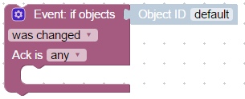

Этот блок выполняет какое-либо действие, если состояние заданных объектов изменилось или обновилось. Это основной блок для построения взаимодействий между различными состояниями и системами соответственно.

С помощью этого блока вы можете связать разные состояния вместе или отправить сообщение или электронное письмо при изменении значения.

Типичное использование блоков:

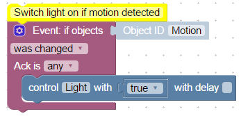

```xml 
<xml xmlns="http://www.w3.org/1999/xhtml">
  <block type="comment" id="]L0d;6j+=OH*[4n{C7v^" x="112" y="13">
    <field name="COMMENT">Switch light on if motion detected</field>
    <next>
      <block type="on_ext" id="QYVeQlu|#2hwniNg)=z8">
        <mutation items="1"></mutation>
        <field name="CONDITION">ne</field>
        <field name="ACK_CONDITION"></field>
        <value name="OID0">
          <shadow type="field_oid" id="Xe6D#r|nf9SEK`.oAuS0">
            <field name="oid">javascript.0.Motion</field>
          </shadow>
        </value>
        <statement name="STATEMENT">
          <block type="control" id="J(HiEvnNKw2B%V1~WXsX">
            <mutation delay_input="false"></mutation>
            <field name="OID">javascript.0.Light</field>
            <field name="WITH_DELAY">FALSE</field>
            <value name="VALUE">
              <block type="logic_boolean" id="o;j8lE#h.XE,0:0_LcW{">
                <field name="BOOL">TRUE</field>
              </block>
            </value>
          </block>
        </statement>
      </block>
    </next>
  </block>
</xml>
```

Вы можете определить столько ObjectID, сколько хотите, через диалоговое окно расширения:

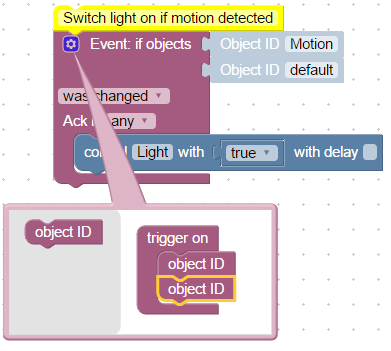

Если используется только один идентификатор объекта, поэтому в блоке операторов доступны специальные переменные:

- value - фактическое значение состояния
- oldValue - старое значение состояния

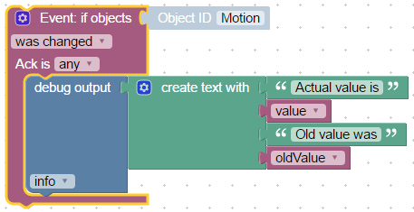

```xml 
<block xmlns="http://www.w3.org/1999/xhtml" type="on_ext" id="QYVeQlu|#2hwniNg)=z8" x="38" y="39">
  <mutation items="1"></mutation>
  <field name="CONDITION">ne</field>
  <field name="ACK_CONDITION"></field>
  <value name="OID0">
    <shadow type="field_oid" id="Xe6D#r|nf9SEK`.oAuS0">
      <field name="oid">javascript.0.Motion</field>
    </shadow>
  </value>
  <statement name="STATEMENT">
    <block type="debug" id="jT6fif_FI9ua|,rL[Ra1">
      <field name="Severity">log</field>
      <value name="TEXT">
        <shadow type="text" id="}=qIm)a0)};f+J/JRgy^">
          <field name="TEXT">test</field>
        </shadow>
        <block type="text_join" id="wjgpY(Whewaqy0d8NVx%">
          <mutation items="4"></mutation>
          <value name="ADD0">
            <block type="text" id="M?[Xy1(Fu36A;b#=4~[t">
              <field name="TEXT">Actual value is</field>
            </block>
          </value>
          <value name="ADD1">
            <block type="variables_get" id="W)*G#(JDzuVpV^1P|[2m">
              <field name="VAR">value</field>
            </block>
          </value>
          <value name="ADD2">
            <block type="text" id="7TW;voPvdc#c4e/SWCjZ">
              <field name="TEXT">Old value was</field>
            </block>
          </value>
          <value name="ADD3">
            <block type="variables_get" id="s`6)4s:}%L#f]pu4E[vK">
              <field name="VAR">oldValue</field>
            </block>
          </value>
        </block>
      </value>
    </block>
  </statement>
</block>
```

в противном случае, если для триггера используется более одного идентификатора объекта, вы можете получить доступ к значению и старому значению через [информация о триггере](#trigger-info).

&nbsp;

### Запуск при изменении состояния
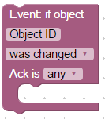

Это тот же блок, что и "Триггер при изменении состояний", но без возможности использовать несколько идентификаторов объектов для срабатывания (для совместимости версий).

&nbsp;

###Информация о триггере


Получите информацию о значении, временной метке или идентификаторе состояния, вызвавшего срабатывание триггера.

Этот блок можно использовать только внутри блоков ["Запуск при изменении состояния"](#trigger-on-states-change) или ["Запуск при изменении состояния"](#trigger-on-state-change).

Доступна следующая информация:

- идентификатор объекта - идентификатор состояния, в котором сработал триггер
- name - название штата из common.name
- description - описание состояния из common.desc
- идентификатор канала - идентификатор канала, которому принадлежит состояние. Если там нет канала, он будет нулевым
- название канала - название канала, которому принадлежит состояние. Если там нет канала, он будет нулевым
- ID устройства - ID устройства, которому принадлежит состояние. Если там нет канала, он будет нулевым
- имя устройства - имя устройства, которому принадлежит состояние. Если там нет канала, он будет нулевым
- state value - фактическое значение состояния срабатывания
- временная метка состояния - фактическая временная метка как объект Date
- состояние качества - фактическое качество код стоимости
- происхождение значения - имя экземпляра, вызвавшего изменение
- это команда или обновление - это команда (ack=false) или обновление (ack=true)
- последнее изменение состояния - метка времени последнего изменения этого значения
- предыдущее значение - предыдущее значение этого состояния перед срабатыванием триггера
- предыдущая временная метка - предыдущая временная метка этого состояния перед срабатыванием триггера
- предыдущее качество - предыдущее качество этого состояния до срабатывания триггера
- предыдущее происхождение - предыдущее происхождение этого состояния до срабатывания триггера
- предыдущая команда или обновление - предыдущий тип этого значения до срабатывания триггера
- предыдущее последнее изменение - предыдущее "последнее измененное значение" этого состояния перед срабатыванием триггера

Типичное использование:

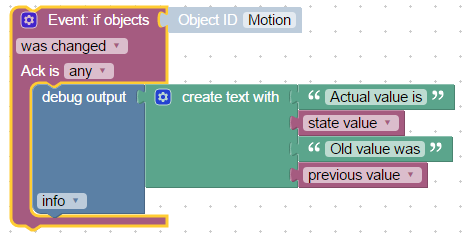

```xml 
<block xmlns="http://www.w3.org/1999/xhtml" type="on_ext" id="QYVeQlu|#2hwniNg)=z8" x="113" y="238">
  <mutation items="1"></mutation>
  <field name="CONDITION">ne</field>
  <field name="ACK_CONDITION"></field>
  <value name="OID0">
    <shadow type="field_oid" id="Xe6D#r|nf9SEK`.oAuS0">
      <field name="oid">javascript.0.Motion</field>
    </shadow>
  </value>
  <statement name="STATEMENT">
    <block type="debug" id="jT6fif_FI9ua|,rL[Ra1">
      <field name="Severity">log</field>
      <value name="TEXT">
        <shadow type="text" id="}=qIm)a0)};f+J/JRgy^">
          <field name="TEXT">test</field>
        </shadow>
        <block type="text_join" id="wjgpY(Whewaqy0d8NVx%">
          <mutation items="4"></mutation>
          <value name="ADD0">
            <block type="text" id="M?[Xy1(Fu36A;b#=4~[t">
              <field name="TEXT">Actual value is</field>
            </block>
          </value>
          <value name="ADD1">
            <block type="on_source" id="_q8v0HD`c[7e76O{@4Tq">
              <field name="ATTR">state.val</field>
            </block>
          </value>
          <value name="ADD2">
            <block type="text" id="7TW;voPvdc#c4e/SWCjZ">
              <field name="TEXT">Old value was</field>
            </block>
          </value>
          <value name="ADD3">
            <block type="on_source" id="D`gpXSShKRQuy:jyMK}6">
              <field name="ATTR">oldState.val</field>
            </block>
          </value>
        </block>
      </value>
    </block>
  </statement>
</block>
```

&nbsp;

### Расписание


Это второй основной блок автоматизации после [«Запуск при изменении состояния»](#trigger-on-states-change). Этот блок позволяет периодически выполнять некоторые действия.

Определение правила расписания будет сделано в очень хорошо документированном CRON [формат](https://en.wikipedia.org/wiki/Cron). С расширением эти секунды также могут быть определены.
Если нужно использовать секунды, они должны быть определены как самый первый параметр правила CRON, и правило будет состоять из 6 частей.

Обычно правило CRON состоит из 5 или 6 частей:

- правила секунд (необязательно)
- минутные правила
- правила часа
- правила дня месяца
- правила месяца
- и правила дня недели.

Для каждой части разрешены следующие форматы:

- \* - срабатывать каждые (секунду, минуту, час, ...)
- X (например, 5) - стрелять только в эту секунду, минуту, час...
- from-to (например, 1-9) - стрелять только в этом интервале
- \*/X (например, \*/5) - срабатывать каждые X секунд, минут... В случае "\*/5" для часов триггер будет срабатывать на 0, 5, 10, 15 и 20 часов.
- числа и интервалы можно объединять запятой (например, 1,3,4-6). Не делайте пробелов между числами, так как пробел является разделителем частей правила.

\*/10 \* \* \* 6,7 - срабатывает каждые 10 минут в субботу и воскресенье.

\*/30 \* \* \* \* \* - срабатывает каждые 30 секунд.

```
 ┌───────────── min (0 - 59)
 │ ┌────────────── hour (0 - 23)
 │ │ ┌─────────────── day of month (1 - 31)
 │ │ │ ┌──────────────── month (1 - 12)
 │ │ │ │ ┌───────────────── day of week (0 - 6) (0 to 6 are Sunday to Saturday; 7 is also Sunday)
 │ │ │ │ │
 │ │ │ │ │
 │ │ │ │ │
 * * * * *  schedule
```

или если используются секунды:

```
 ┌───────────── seconds (0 - 59)
 │ ┌───────────── min (0 - 59)
 │ │ ┌────────────── hour (0 - 23)
 │ │ │ ┌─────────────── day of month (1 - 31)
 │ │ │ │ ┌──────────────── month (1 - 12)
 │ │ │ │ │ ┌───────────────── day of week (0 - 6) (0 to 6 are Sunday to Saturday; 7 is also Sunday)
 │ │ │ │ │ │
 │ │ │ │ │ │
 │ │ │ │ │ │
 * * * * * *  schedule
```

Но есть хорошая помощь для вас, чтобы построить такие правила. Щелкнув по правилу, откроется диалоговое окно CRON, и вы сможете указать мышью свое правило.

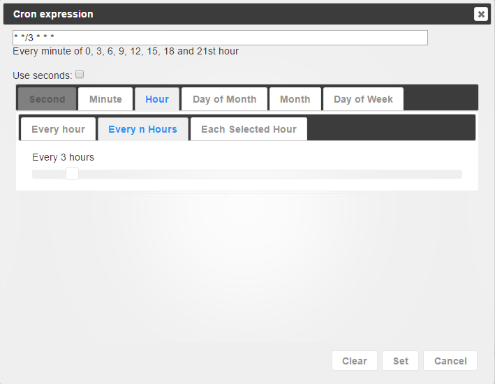

&nbsp;

### Запуск по астрономическому событию
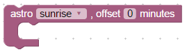

Выполните какое-либо действие по астрологическому событию. Возможны следующие события:

- восход солнца: восход солнца (верхний край солнца появляется на горизонте)
- SunriseEnd: восход заканчивается (нижний край солнца касается горизонта)
- GoldenHourEnd: заканчивается утренний золотой час (мягкий свет, лучшее время для фотосъемки)
- solarNoon: солнечный полдень (солнце находится в самом высоком положении)
- GoldenHour: начинается вечерний золотой час
- sunstartStart: начинается закат (нижний край солнца касается горизонта)
- закат: закат (солнце уходит за горизонт, начинаются вечерние гражданские сумерки)
-summer:summer (начинаются вечерние морские сумерки)
- nauticalDusk: морские сумерки (начинаются вечерние астрономические сумерки)
- ночь: начинается ночь (достаточно темно для астрономических наблюдений)
- nightEnd: ночь заканчивается (начинаются утренние астрономические сумерки)
- nauticalDawn: морской рассвет (начинаются утренние морские сумерки)
- рассвет: рассвет (заканчиваются утренние морские сумерки, начинаются утренние гражданские сумерки)
- надир: надир (самый темный момент ночи, солнце находится в самом низком положении)

**Примечание:** для использования "астро"-функции "широта" и "долгота" должны быть определены в настройках javascript-адаптера.

Кроме того, вы можете установить смещение в минутах к астрологическому событию, например. чтобы запустить триггер за 1 час до спуска:

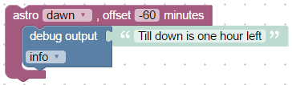

Как видите, смещение также может быть отрицательным, чтобы указать время до астрологических событий.

&nbsp;

### Именованное расписание
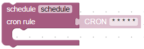

Этот блок аналогичен [Расписание](#schedule), но с возможностью установки правила CRON по строке и с возможностью остановки расписания.

Вы можете указать уникальное имя этого блока расписания, а затем очистить его с помощью [Очистить расписание](#clear-schedule).

Вот пример настраиваемого будильника:

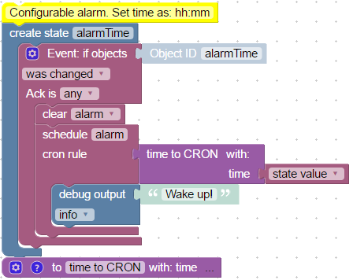

```xml 
<xml xmlns="http://www.w3.org/1999/xhtml">
  <block type="comment" id="QWp.l96v1;-4{x)j5K5y" x="38" y="13">
    <field name="COMMENT">Configurable alarm. Set time as: hh:mm</field>
    <next>
      <block type="create" id="5*XX`C;PgnU(q#Nk~D,o">
        <field name="NAME">alarmTime</field>
        <statement name="STATEMENT">
          <block type="on_ext" id="ot:9oFMh.(c)sxkufTxA">
            <mutation items="1"></mutation>
            <field name="CONDITION">ne</field>
            <field name="ACK_CONDITION"></field>
            <value name="OID0">
              <shadow type="field_oid" id="qV#=^mz,%qxL#}VsA)3C">
                <field name="oid">javascript.0.alarmTime</field>
              </shadow>
            </value>
            <statement name="STATEMENT">
              <block type="schedule_clear" id="ukGIQYyTpip_9!1H_xnN">
                <field name="NAME">alarm</field>
                <next>
                  <block type="schedule_create" id=")^!A|k+`1=[pFp(S-*sw">
                    <field name="NAME">alarm</field>
                    <value name="SCHEDULE">
                      <shadow type="field_cron" id="uSka7fK[T7j0m_4!4+fO">
                        <field name="CRON">* * * * *</field>
                      </shadow>
                      <block type="procedures_callcustomreturn" id=")E!Ljg1z9iQ3)Nb#CX~n">
                        <mutation name="time to CRON">
                          <arg name="time"></arg>
                        </mutation>
                        <value name="ARG0">
                          <block type="on_source" id="qs+k30Lnd1V(BSNs{}P!">
                            <field name="ATTR">state.val</field>
                          </block>
                        </value>
                      </block>
                    </value>
                    <statement name="STATEMENT">
                      <block type="debug" id="7arB5vcx^ci2Un#}TLKh">
                        <field name="Severity">log</field>
                        <value name="TEXT">
                          <shadow type="text" id="N;`AY!p#T_do@vP_OQr9">
                            <field name="TEXT">Wake up!</field>
                          </shadow>
                        </value>
                      </block>
                    </statement>
                  </block>
                </next>
              </block>
            </statement>
          </block>
        </statement>
      </block>
    </next>
  </block>
  <block type="procedures_defcustomreturn" id="_*_L4XpCr!7eLsYWS(R(" x="38" y="337">
    <mutation statements="false">
      <arg name="time"></arg>
    </mutation>
    <field name="NAME">time to CRON</field>
    <field name="SCRIPT">dmFyIHBhcnRzID0gdGltZS5zcGxpdCgnOicpOwovLyBpZiBpdCBpcyBDUk9OCmlmIChwYXJ0cy5sZW5ndGggPT09IDEpIHJldHVybiB0aW1lOwpyZXR1cm4gcGFydHNbMV0gKyAnICcgKyBwYXJ0c1swXSArICcgKiAqIConOw==</field>
    <comment pinned="false" h="80" w="160">Describe this function...</comment>
  </block>
</xml>
```

&nbsp;

### Очистить расписание


С помощью этого функционального блока вы можете очистить именованное расписание. Если вы определите named еще раз, не очистив его, старый останется активным.

См. пример в [Именованное расписание](#named-schedule)

&nbsp;

### CRON-диалог


Создайте правило CRON из диалогового окна. Этот блок можно соединить с [Именованное расписание](#named-schedule).

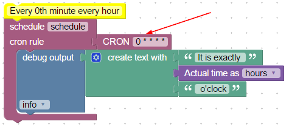

```xml 
<xml xmlns="http://www.w3.org/1999/xhtml">
  <block type="comment" id="]aB;GhQJvYrr~:H4Ft9l" x="63" y="38">
    <field name="COMMENT">Every 0th minute every hour</field>
    <next>
      <block type="schedule_create" id="?}upFtiA@CE_Gd)SmDo|">
        <field name="NAME">schedule</field>
        <value name="SCHEDULE">
          <shadow type="field_cron" id="1Ag|noK^~u]GFEW/(lb)">
            <field name="CRON">* * * * *</field>
          </shadow>
          <block type="field_cron" id="phjg#B~@BJTO9i[HmZ4O">
            <field name="CRON">0 * * * *</field>
          </block>
        </value>
        <statement name="STATEMENT">
          <block type="debug" id="Lv[a}BtvBDO-2Lt,s+z4">
            <field name="Severity">log</field>
            <value name="TEXT">
              <shadow type="text" id="evxnn0R1(AC^Y_U`oT_a">
                <field name="TEXT">It is exactly</field>
              </shadow>
              <block type="text_join" id="6!2uB_db8.g}63I{^e}#">
                <mutation items="3"></mutation>
                <value name="ADD0">
                  <block type="text" id="HH((bCdxr?A5)8Svuo6(">
                    <field name="TEXT">It is exactly </field>
                  </block>
                </value>
                <value name="ADD1">
                  <block type="time_get" id="7{BBfF0jmKD[qX,y6voK">
                    <mutation format="false" language="false"></mutation>
                    <field name="OPTION">h</field>
                  </block>
                </value>
                <value name="ADD2">
                  <block type="text" id="edML0zJ2V9kN}5/DLdS5">
                    <field name="TEXT"> o'clock</field>
                  </block>
                </value>
              </block>
            </value>
          </block>
        </statement>
      </block>
    </next>
  </block>
</xml>
```

&nbsp;

### Правило CRON
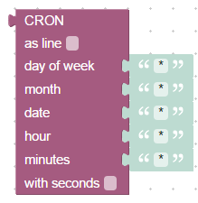

Объедините правило CRON из разных частей.

Вы можете отобразить правило как блок или как строку:


С дополнительным параметром "с секундами" вы также можете указать секунды для правила CRON.


Этот блок можно использовать (например, блок [Диалог CRON](#cron-dialog)) только с [Именованное расписание](#named-schedule).

### Запуск при обновлении файла


Вы можете подписаться на обновления файлов и выполнять некоторые действия. Например, здесь содержимое vis распечатывается при каждом обновлении проекта:

```
<xml xmlns="https://developers.google.com/blockly/xml">
  <variables>
    <variable id="@-v}))=J7?dr9n$tR,=j">data</variable>
  </variables>
  <block type="onFile" id="4`C)*,R0DVN@nRaM@/[N" x="188" y="37">
    <field name="WITH_FILE">TRUE</field>
    <value name="OID">
      <shadow type="field_oid_meta" id="K^Qc~2T8{V+K017=]c^d">
        <field name="oid">vis.0</field>
      </shadow>
    </value>
    <value name="FILE">
      <shadow type="text" id="A7UXrl-.!o]Oi9g[eBxr">
        <field name="TEXT">main/*</field>
      </shadow>
    </value>
    <statement name="STATEMENT">
      <block type="debug" id="fl3BZ)}mE7qw[`W*ZUx}">
        <field name="Severity">log</field>
        <value name="TEXT">
          <shadow type="text" id="se+gg@!ryr*!AO~Bx3uX">
            <field name="TEXT">test</field>
          </shadow>
          <block type="variables_get" id="E{)LJvx~EH~shD%3!);w">
            <field name="VAR" id="@-v}))=J7?dr9n$tR,=j">data</field>
          </block>
        </value>
      </block>
    </statement>
  </block>
</xml>
```

**Важно**: эта функция доступна только с js-controller@4.1.x или новее.

### Отменить событие при обновлении файла
 С помощью этого блока вы можете отменить события через обновление файла.

**Важно**: эта функция доступна только с js-controller@4.1.x или новее.

## Тайм-ауты
### Отложенное выполнение


С помощью этого блока вы можете выполнять другие блоки с задержкой на некоторое время, указанное в миллисекундах.
если вы знаете Javascript, это та же функция, что и setTimeout.

В blockly нет «паузы», но вы можете использовать этот блок для имитации паузы. Если вы разместите все блоки, которые должны быть выполнены после паузы, вы получите тот же эффект, что и с паузой.

Дополнительной функцией является установка интервала с помощью переменной, просто замените «ms» на предопределенную переменную: 

Каждое отложенное выполнение может иметь уникальное имя. Его можно отменить другим блоком. [Очистить отложенное выполнение](#clear-delayed-execution)


```xml 
<xml xmlns="http://www.w3.org/1999/xhtml">
  <block type="debug" id=":6GZ!E*FHy@vPKKl{`hV" x="487" y="163">
    <field name="Severity">log</field>
    <value name="TEXT">
      <shadow type="text" id="LV!-dx[I(8bAu(_kcG.U">
        <field name="TEXT">Make a pause 5 seconds</field>
      </shadow>
    </value>
    <next>
      <block type="timeouts_settimeout" id="~?BW3eBK_t:TzNk}x9l3">
        <field name="NAME">timeout</field>
        <field name="DELAY">5000</field>
        <statement name="STATEMENT">
          <block type="debug" id="glbs:mQxsDfEieLaru!0">
            <field name="Severity">log</field>
            <value name="TEXT">
              <shadow type="text" id="_7T9e{FEJTWcpLl*BltU">
                <field name="TEXT">After pause</field>
              </shadow>
            </value>
          </block>
        </statement>
      </block>
    </next>
  </block>
</xml>
```

&nbsp;

### Очистить отложенное выполнение


Этот блок используется для отмены текущей задержки по имени. Типичное использование — имитация сценария обнаружения движения.
При первом движении свет должен загореться, а после последнего движения через 30 секунд свет должен погаснуть.


```xml 
<xml xmlns="http://www.w3.org/1999/xhtml">
  <block type="on_ext" id="+nZ`H6mh/;g(e3u,t;wJ" x="163" y="12">
    <mutation items="1"></mutation>
    <field name="CONDITION">ne</field>
    <field name="ACK_CONDITION"></field>
    <value name="OID0">
      <shadow type="field_oid" id="{mRcPH:!k^_5q-hwg1q%">
        <field name="oid">node-red.0.javascript.0.Motion</field>
      </shadow>
    </value>
    <statement name="STATEMENT">
      <block type="controls_if" id="]lX4.m?HnwXigM.6wY/D">
        <value name="IF0">
          <block type="logic_compare" id="s0DHFun9e*,c3AawmP_~">
            <field name="OP">EQ</field>
            <value name="A">
              <block type="variables_get" id="g}IH`Bx0T(mkht8~{Ul0">
                <field name="VAR">value</field>
              </block>
            </value>
            <value name="B">
              <block type="logic_boolean" id="Meek9{gS-NOR?|(fgbVg">
                <field name="BOOL">TRUE</field>
              </block>
            </value>
          </block>
        </value>
        <statement name="DO0">
          <block type="debug" id=":6GZ!E*FHy@vPKKl{`hV">
            <field name="Severity">log</field>
            <value name="TEXT">
              <shadow type="text" id="LV!-dx[I(8bAu(_kcG.U">
                <field name="TEXT">Motion detected</field>
              </shadow>
            </value>
            <next>
              <block type="comment" id="6_T-s#wApgZhu0+4uEk}">
                <field name="COMMENT">Switch light ON</field>
                <next>
                  <block type="control" id="fxgT@s0r?[`LJIsqR~M_">
                    <mutation delay_input="false"></mutation>
                    <field name="OID">javascript.0.Light</field>
                    <field name="WITH_DELAY">FALSE</field>
                    <value name="VALUE">
                      <block type="logic_boolean" id="0mgo#`N%Zm{MTELxw%~0">
                        <field name="BOOL">TRUE</field>
                      </block>
                    </value>
                    <next>
                      <block type="comment" id="rZ^o06`}^uFftKj2oYvE">
                        <field name="COMMENT">Stop timer, even if it not running</field>
                        <next>
                          <block type="timeouts_cleartimeout" id="#H#~HxipC8_-/{%,2R1P">
                            <field name="NAME">lightOff</field>
                            <next>
                              <block type="timeouts_settimeout" id="~?BW3eBK_t:TzNk}x9l3">
                                <field name="NAME">lightOff</field>
                                <field name="DELAY">5000</field>
                                <statement name="STATEMENT">
                                  <block type="debug" id="glbs:mQxsDfEieLaru!0">
                                    <field name="Severity">log</field>
                                    <value name="TEXT">
                                      <shadow type="text" id="_7T9e{FEJTWcpLl*BltU">
                                        <field name="TEXT">Light OFF</field>
                                      </shadow>
                                    </value>
                                    <next>
                                      <block type="control" id="McdOD=k4)MlO42RVgB~r">
                                        <mutation delay_input="false"></mutation>
                                        <field name="OID">javascript.0.Light</field>
                                        <field name="WITH_DELAY">FALSE</field>
                                        <value name="VALUE">
                                          <block type="logic_boolean" id="XLHrXB)/|dqGlh,nXl^[">
                                            <field name="BOOL">FALSE</field>
                                          </block>
                                        </value>
                                      </block>
                                    </next>
                                  </block>
                                </statement>
                              </block>
                            </next>
                          </block>
                        </next>
                      </block>
                    </next>
                  </block>
                </next>
              </block>
            </next>
          </block>
        </statement>
      </block>
    </statement>
  </block>
</xml>
```

&nbsp;

### Выполнение по интервалу


Этот блок позволяет периодически выполнять какое-либо действие. Конечно, есть блок CRON, но блок CRON имеет наименьший интервал в одну секунду.
Этот блок может выполнять действия в миллисекундах.

Если вы установите слишком маленький интервал (менее 100 мс), возможно, что интервалы будут больше.

Подобно блоку тайм-аута, вы также можете установить уникальное имя интервала.

&nbsp;

### Остановить выполнение по интервалу


С помощью этого блока можно отменить периодическое выполнение интервального блока по его имени.

&nbsp;

&nbsp;

## Логика
### Если еще блок
### Блок сравнения
### Логический блок И/ИЛИ
### Блок отрицания
### Логическое значение ИСТИНА/ЛОЖЬ
### Нулевые блоки
### Тестовый блок
&nbsp;

&nbsp;

## Петли
### Повторить N раз
### Повторять пока
### Считать
### Для каждого
### Выйти из цикла
&nbsp;

&nbsp;

## Математика
### Числовое значение
### Арифметические операции +-*/^
### Квадратный корень, Abs, -, ln, log10, e^, 10^
### Грех, соз, тан, асин, акос, атан
### Математические константы: пи, е, фи, sqrt(2), sqrt(1/2), бесконечность
### Является четным, нечетным, простым, целым, положительным, отрицательным, делится на
### Изменить переменную по значению (плюс или минус)
### Круглый, пол, значение ячейки
### Операции со списком значений: сумма, минимум, максимум, среднее, медиана, моды, отклонение, случайный элемент
### Модуль
### Ограничение некоторого значения по минимуму и максимуму
### Случайное значение от 0 до 1
### Случайное значение между минимумом и максимумом
&nbsp;

&nbsp;

## Тело
### Строковое значение
### Объединить строки
### Добавить строку в переменную
### Длина строки
### Строка пуста
### Найти позицию в строке
### Получить символ в строке в определенной позиции
### Получить подстроку
### Преобразование в верхний или нижний регистр
### Обрезать строку
&nbsp;

&nbsp;

## Списки
### Создать пустой список
### Создать список со значениями
### Создать список с одинаковым значением N раз
### Получить длину списка
### Список пуст
### Найти позицию элемента в списке
### Получить элемент в списке
### Установить элемент в списке
### Получить подсписок списка
### Преобразование текста в список и наоборот
&nbsp;

&nbsp;

## Цвет
### Значение цвета
### Случайный цвет
### Цвет RGB
### Смешайте цвета
&nbsp;

&nbsp;

## Переменные
### Установить значение переменной


Чтобы использовать этот блок, вы должны понимать основные правила программирования: как использовать переменные.

С помощью этого блока вы можете записать в глобальную (видимую повсюду в этом скрипте) переменную и использовать ее для хранения некоторых значений. Если переменная не существует, она будет объявлена автоматически.

Этот блок может создать новую переменную или использовать существующую.


Этот код:


```xml 
<block xmlns="http://www.w3.org/1999/xhtml" type="variables_set" id="ch{H@omhfzI(QA{syxAG" x="212.99999999999977" y="37.99999999999994">
  <field name="VAR">item</field>
  <value name="VALUE">
    <block type="math_number" id="SbmD7,uR:hMW!(P%IZRc">
      <field name="NUM">0</field>
    </block>
  </value>
</block>
```

делает только это:

```javascript
var item;
item = 0;
```

&nbsp;

### Получить значение переменной


Этот блок получает значение переменной. Вы можете создать новый или использовать существующий.


Существует одно исключение с блоками запуска [Запуск при изменении состояния](#trigger-on-states-change) и [Запуск при изменении состояния](#trigger-on-state-change).
Внутри этих блоков переменная «значение» еще существует, но в любом случае, чтобы прочитать их значения, вы должны переименовать переменную в значение, а затем использовать ее.


&nbsp;

&nbsp;

## Функции
### Создать функцию из блоков без возвращаемого значения
### Создать функцию из блоков с возвращаемым значением
### Возвращаемое значение в функции
### Создать пользовательскую функцию без возвращаемого значения
### Создать пользовательскую функцию с возвращаемым значением
### Функция вызова