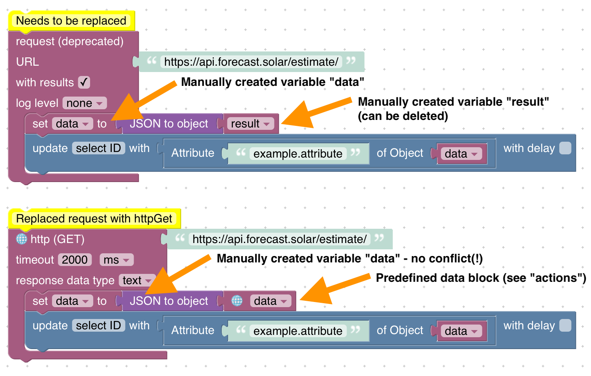

# Руководство по обновлению
## Запрещенные каталоги для зеркалирования файловой системы скриптов
**Начиная с версии 5.5.0 адаптера JavaScript** следующие местоположения (относительно базового каталога ioBroker, обычно `/opt/iobroker`) не разрешается использовать:

* Сам базовый каталог ioBroker и любой путь выше!
* Сам `./iobroker-data`, собственный подкаталог (выберите имя, которое не пересекается с каким-либо адаптером!)
* `./iobroker-data/backup-objects` или что-нибудь ниже
* `./iobroker-data/files` или что-нибудь ниже
* `./iobroker-data/backitup` или что-нибудь ниже
* `./backups` или что-нибудь ниже
* `./node_modules` или что-нибудь ниже
* `./log` или что-нибудь ниже

Зеркальное отображение файловой системы сценариев сохранит все исходные файлы сценариев в вашей файловой системе и позволит вам редактировать файлы в вашем любимом редакторе сценариев помимо веб-редактора. Все изменения синхронизируются в обоих направлениях.

При включении системного зеркалирования файлов сценариев обязательно создайте **выделенный новый каталог** и **не** используйте существующий каталог с другим содержимым. Также убедитесь, что никакой другой сценарий или процесс не изменяет файлы в указанном каталоге, чтобы предотвратить проблемы с доступом.
Любое местоположение должно быть доступно для записи пользователю «iobroker»!

## Запрос к httpGet
**Начиная с версии 8.0.0 адаптера JavaScript** пакет `request` устарел, и его использование в ваших сценариях вызовет предупреждение. Адаптеру JavaScript в какой-то момент необходимо удалить пакет. Чтобы максимально упростить миграцию, в песочнице предусмотрена новая функция запроса HTTP-ресурсов.

### JavaScript
Пример кода:

```js
const request = require('request');

schedule('*/30 * * * *', () => {
    const options = ;

    request({ url: 'https://api.forecast.solar/estimate/', method: 'GET' }, (error, response, body) => {
        if (!error && response.statusCode == 200) {
            const resObj = JSON.parse(body);

            // ...
        }
    });
});
```

Миграция:

1. Удалите импорт пакета `request`.
2. Используйте собственный метод httpGet (подробности см. в документации).
3. Обновить параметры функции обратного вызова.
4. Замените `body` на `response.data`.

```js
schedule('*/30 * * * *', () => {
    httpGet('https://api.forecast.solar/estimate/', (err, response) => {
        if (err) {
            console.error(err);
        } else if (response.statusCode == 200) {
            const resObj = JSON.parse(response.data);

            // ...
        }
    });
});
```

### Блочно
- Блок `request` поддерживал только HTTP GET (другие методы не поддерживались) - замените блок на `http (GET)`
— Для использования ответа потребовалось создать пользовательскую переменную с именем «result». Это больше не требуется. Удалите переменную и используйте выделенный блок для работы с результирующими параметрами (как в триггерных блоках).

