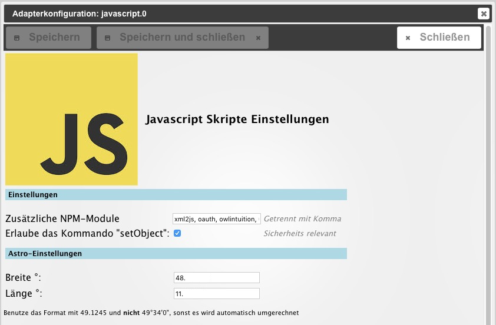
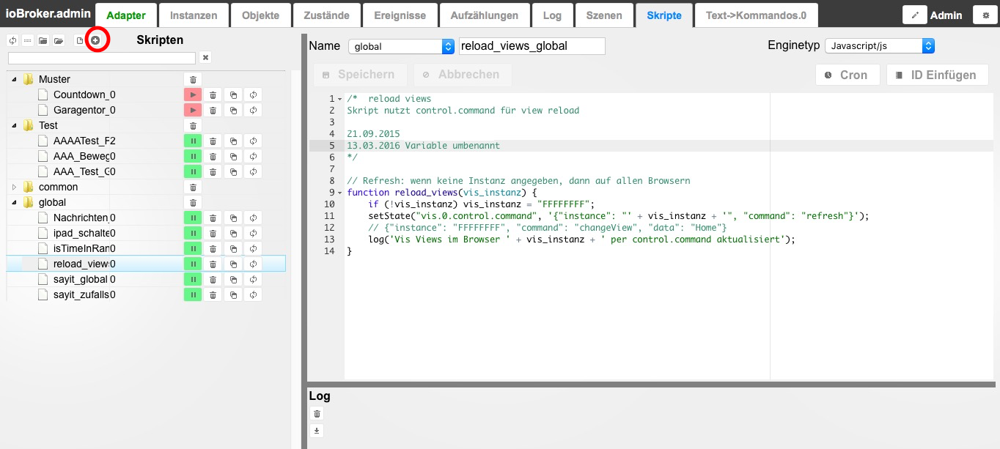
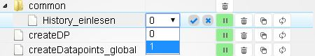

**Примечание. В настоящее время английская версия содержит гораздо больше информации, и мы рекомендуем ее прочитать**

Адаптер javascript используется для удобного создания, редактирования и управления скриптами.

## Конфигурация
[Вот еще об этом](https://github.com/ioBroker/ioBroker/wiki/ioBroker-Adapter-javascript#konfiguration)

 Фактическая конфигурация состоит из ввода дополнительных загружаемых модулей npm (через запятую), а также географических координат, которые будут использоваться для различных расчетов. Чтобы получить координаты, можно, например, немного увеличить масштаб _googlemaps_ и нажать на нужное место. Затем отображаются координаты. После сохранения адаптер необходимо активировать с помощью красной кнопки play.

* * *

## Услуга
Во время установки в интерфейсе _Администратора_ отображается еще одна вкладка _Скрипты_. Здесь новая папка создается путем нажатия на (+) на панели инструментов (красный кружок).  Новый скрипт создается с помощью значка «чистый лист» слева от него. Откроется окно и запросит имя и расположение в структуре папок.

### Список папок и файлов
Структура папок может быть создана по желанию. Место хранения не влияет на функциональность скрипта. Помимо древовидной структуры, имеется представление списка. Поле поиска упрощает поиск сценариев. Чтобы скрипт запустился, его необходимо активировать, нажав на красную кнопку _Play_ в структуре папок слева. Чтобы остановить, нажмите зеленую кнопку _Пауза_. Для каждого скрипта создается новый объект. Он имеет имя сценария с добавлением `_enabled` и находится в папке `javascript.Instanz.ScriptEnabled`. С помощью (`true/false`) объект указывает, запущен ли сценарий. Состояние также можно настроить для включения/выключения сценария. Сценарии, сохраненные в папке _global_, являются глобальными сценариями. Они копируются внутри перед каждым другим скриптом, т. е. обрабатываются заранее. Это означает, что глобальные функции можно применять к нескольким сценариям. Переменные в глобальных скриптах можно использовать в других скриптах. Но будьте осторожны: каждый скрипт имеет собственное пространство переменных. Вы не можете использовать переменные в глобальных скриптах для обмена значениями между скриптами. Для этой цели необходимо использовать объекты (состояния).

###Редактор
После создания справа открывается редактор _Javascript_. Некоторые примеры сценариев можно найти [здесь](http://www.iobroker.net/docu/?page_id=2786&lang=de).

#### Фамилия
Если вы ранее присвоили имя, оно будет отображаться здесь и его можно будет изменить.

#### Расположение
В этом раскрывающемся списке отображаются все созданные папки. В настоящее время они отсортированы в том хронологическом порядке, в котором они были созданы.

#### Тип двигателя
Здесь вы можете выбрать, хотите ли вы работать с движком _javascript_ или _coffeescript_.

#### Бревно
Справа внизу находится окно журнала для вывода всех логов, относящихся к выбранному скрипту. Логи отображаются после сохранения/перезапуска скрипта.

* * *

## Советы
### Резервное копирование
Чтобы иметь возможность восстановить скрипты в случае сомнений, рекомендуется выполнить резервное копирование с помощью _Copy & Paste_.

### Тестовый экземпляр
Чтобы протестировать новые сценарии, рекомендуется создать еще один экземпляр Javascript и запустить сценарий в этом экземпляре.
Желаемый экземпляр можно установить, используя раскрывающийся список после имени сценария.
Если в сценарии есть серьезная ошибка, завершается работу только этого дополнительного тестового экземпляра, а не продуктивного экземпляра.

